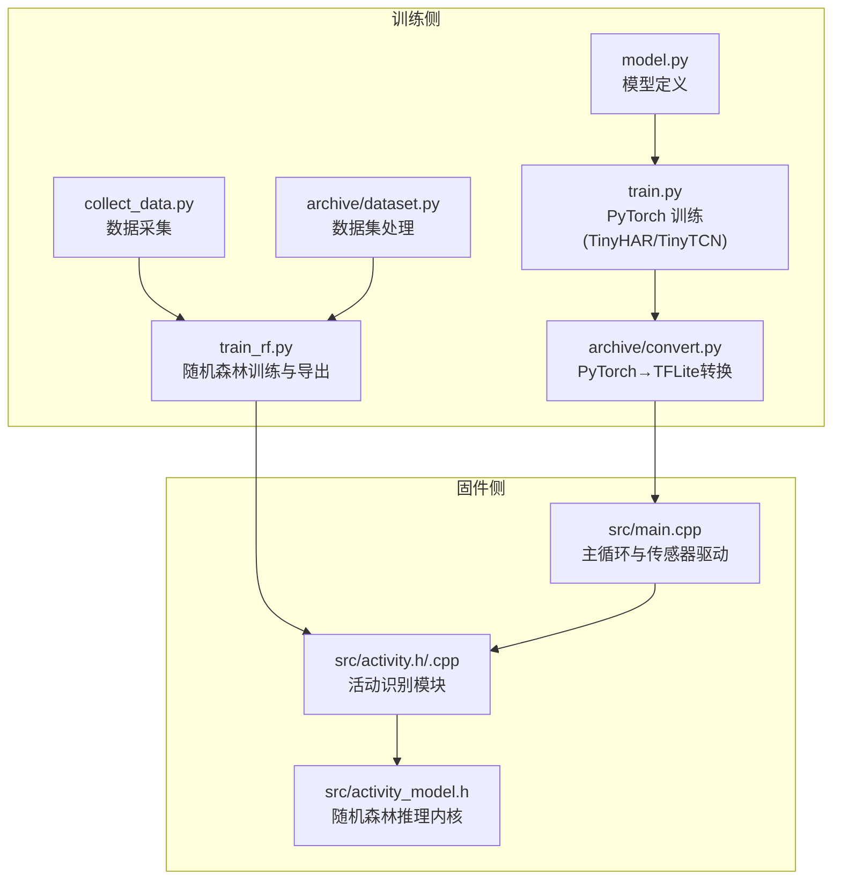
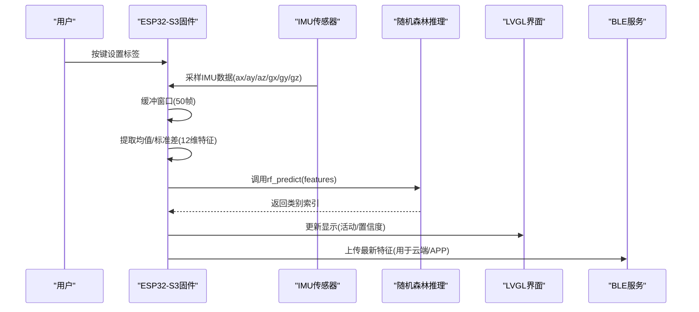
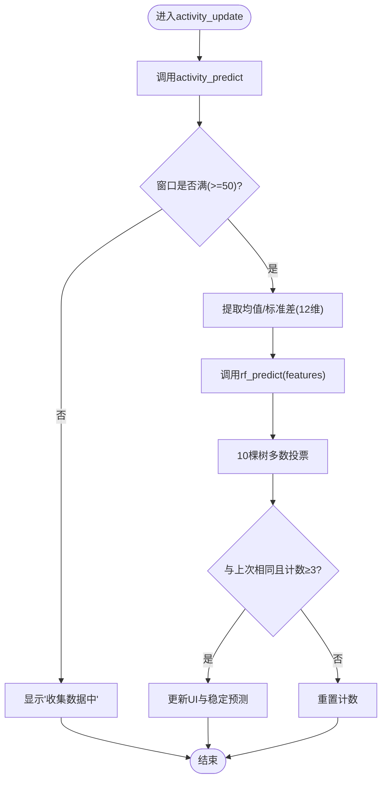
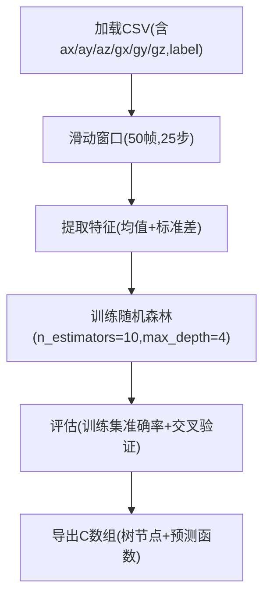
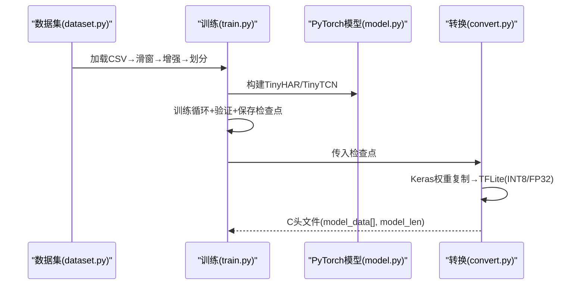
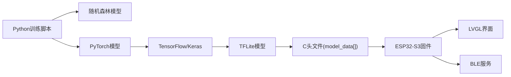

# AI边缘推理

<cite>
**本文引用的文件**
- [training/model.py](file://training/model.py)
- [training/train_rf.py](file://training/train_rf.py)
- [training/collect_data.py](file://training/collect_data.py)
- [src/activity.h](file://src/activity.h)
- [src/activity.cpp](file://src/activity.cpp)
- [src/activity_model.h](file://src/activity_model.h)
- [training/train.py](file://training/train.py)
- [training/archive/dataset.py](file://training/archive/dataset.py)
- [training/archive/convert.py](file://training/archive/convert.py)
- [src/main.cpp](file://src/main.cpp)
- [platformio.ini](file://platformio.ini)
- [training/test_imu_walk_run_idle.csv](file://training/test_imu_walk_run_idle.csv)
- [EDGE_AI_TRAINING_PLAN.md](file://EDGE_AI_TRAINING_PLAN.md)
- [DEBUG_REPORT.md](file://DEBUG_REPORT.md)
</cite>

## 目录
1. [简介](#简介)
2. [项目结构](#项目结构)
3. [核心组件](#核心组件)
4. [架构总览](#架构总览)
5. [详细组件分析](#详细组件分析)
6. [依赖关系分析](#依赖关系分析)
7. [性能考量](#性能考量)
8. [故障排查指南](#故障排查指南)
9. [结论](#结论)
10. [附录](#附录)

## 简介
本项目为 SmartBracelet 的 AI 边缘推理系统，目标是在 ESP32-S3 微控制器上实现低功耗、低延迟的人体活动识别（走、跑、静止）。系统采用“特征工程 + 随机森林”的轻量级方案，确保在资源受限的嵌入式设备上快速稳定运行；同时保留基于 1D-CNN 的可选深度学习路径，便于后续扩展与迁移学习。

## 项目结构
项目分为训练侧（Python 脚本）与固件侧（C++/Arduino）两大部分：
- 训练侧：数据采集、滑动窗口特征提取、模型训练与导出
- 固件侧：特征缓冲与提取、随机森林推理、UI 展示与 BLE 数据上传

图表来源
- [training/collect_data.py](file://training/collect_data.py#L1-L120)
- [training/train_rf.py](file://training/train_rf.py#L1-L160)
- [training/train.py](file://training/train.py#L1-L175)
- [training/model.py](file://training/model.py#L1-L69)
- [training/archive/dataset.py](file://training/archive/dataset.py#L1-L116)
- [training/archive/convert.py](file://training/archive/convert.py#L1-L234)
- [src/main.cpp](file://src/main.cpp#L1-L200)
- [src/activity.h](file://src/activity.h#L1-L13)
- [src/activity.cpp](file://src/activity.cpp#L1-L130)
- [src/activity_model.h](file://src/activity_model.h#L1-L74)

章节来源
- [platformio.ini](file://platformio.ini#L1-L41)
- [src/main.cpp](file://src/main.cpp#L1-L200)

## 核心组件
- 数据采集与标注：通过串口从设备读取 IMU 数据，键盘输入进行标签标注，保存为 CSV。
- 特征工程：固定窗口（1 秒，50Hz）滑动，提取每轴均值与标准差，共 12 维特征。
- 随机森林模型：训练 10 棵浅决策树，按多数投票输出类别。
- 推理引擎：在 ESP32-S3 上以 C 实现随机森林树遍历，稳定预测与去抖。
- 模型导出与集成：将树结构导出为 C 数组，嵌入固件；或通过 PyTorch→TFLite 路线进行端侧部署。

章节来源
- [training/collect_data.py](file://training/collect_data.py#L1-L120)
- [training/train_rf.py](file://training/train_rf.py#L1-L160)
- [src/activity.cpp](file://src/activity.cpp#L1-L130)
- [src/activity_model.h](file://src/activity_model.h#L1-L74)

## 架构总览
系统采用“离线训练 + 在线推理”的边缘 AI 架构。训练侧负责数据准备与模型训练，固件侧负责实时特征提取与快速推理，并将特征上传至 BLE 服务。

图表来源
- [src/activity.cpp](file://src/activity.cpp#L30-L76)
- [src/activity_model.h](file://src/activity_model.h#L58-L73)
- [src/activity.h](file://src/activity.h#L6-L12)

## 详细组件分析

### 数据采集与标注
- 支持列出可用串口、自定义波特率、键盘输入标注（1-8 或 9/0 对应特定动作）。
- 将传感器数据与当前标签写入 CSV 文件，文件名包含时间戳。
- 适合离线标注与快速迭代训练数据。

章节来源
- [training/collect_data.py](file://training/collect_data.py#L1-L120)

### 特征工程设计
- 窗口长度与步长：窗口 50 帧（1 秒），步长 25 帧（50% 重叠），平衡稳定性与实时性。
- 特征类型：每轴均值与标准差，共 12 维，覆盖时域统计特性。
- 标签聚合：窗口内标签多数投票决定该窗口类别，减少误标影响。

章节来源
- [training/train_rf.py](file://training/train_rf.py#L22-L51)
- [src/activity.cpp](file://src/activity.cpp#L52-L63)

### 随机森林模型与参数
- 树数量：10 棵，浅层树（由最大深度限制），兼顾精度与速度。
- 训练流程：加载 CSV → 切分窗口 → 训练 → 交叉验证估计泛化误差。
- 导出 C 代码：将树节点结构与预测函数打印为 C 数组与函数，便于直接嵌入固件。

章节来源
- [training/train_rf.py](file://training/train_rf.py#L136-L155)

### 推理引擎实现
- 固件侧实现：环形缓冲区存储最近 50 帧，按需提取 12 维特征，调用 rf_predict 进行预测。
- 预测稳定性：连续 3 次相同预测才更新显示，降低误判抖动。
- 特征上传：保存最新特征供 BLE 服务上传，支持云端协同诊断。

图表来源
- [src/activity.cpp](file://src/activity.cpp#L107-L129)

章节来源
- [src/activity.cpp](file://src/activity.cpp#L1-L130)
- [src/activity_model.h](file://src/activity_model.h#L58-L73)

### 深度学习模型（可选路径）
- TinyHAR/TinyTCN：1D-CNN 与扩张卷积网络，参数量约 10K/8.5K，适合端侧部署。
- 训练流程：滑动窗口 → 数据增强 → 训练循环 → 保存检查点与 ONNX。
- 导出路线：PyTorch → Keras 权重复制 → TFLite（FP32/INT8）→ C 头文件嵌入固件。

章节来源
- [training/model.py](file://training/model.py#L1-L69)
- [training/train.py](file://training/train.py#L1-L175)
- [training/archive/convert.py](file://training/archive/convert.py#L1-L234)

### 数据集处理与增强
- 标签映射：将多类动作归并到有限类别集合，保证训练一致性。
- 滑动窗口：固定窗口长度与步长，统计模式决定窗口标签。
- 数据增强：对窗口加高斯噪声与幅度缩放，提升鲁棒性。

章节来源
- [training/archive/dataset.py](file://training/archive/dataset.py#L10-L106)

### 模型训练流程（随机森林）

图表来源
- [training/train_rf.py](file://training/train_rf.py#L124-L155)

章节来源
- [training/train_rf.py](file://training/train_rf.py#L1-L160)

### 模型训练流程（深度学习）

图表来源
- [training/train.py](file://training/train.py#L80-L157)
- [training/archive/convert.py](file://training/archive/convert.py#L95-L229)
- [training/model.py](file://training/model.py#L5-L54)

章节来源
- [training/train.py](file://training/train.py#L1-L175)
- [training/archive/convert.py](file://training/archive/convert.py#L1-L234)
- [training/model.py](file://training/model.py#L1-L69)

## 依赖关系分析
- 训练侧依赖：NumPy、Pandas、SciPy、Scikit-learn、PyTorch、TensorFlow（仅转换阶段）。
- 固件侧依赖：Arduino、LVGL、传感器驱动库、BLE 服务。
- 关键耦合点：随机森林树结构与预测函数需与固件侧保持一致；深度学习路径需保证权重复制与量化校准正确。

图表来源
- [training/train_rf.py](file://training/train_rf.py#L124-L155)
- [training/archive/convert.py](file://training/archive/convert.py#L95-L229)
- [src/activity_model.h](file://src/activity_model.h#L58-L73)

章节来源
- [platformio.ini](file://platformio.ini#L1-L41)
- [src/main.cpp](file://src/main.cpp#L1-L200)

## 性能考量
- 随机森林路径
  - 窗口大小与步长：1 秒窗口、50% 重叠，兼顾稳定性与实时性。
  - 特征维度：12 维，计算开销极低，适合嵌入式。
  - 预测逻辑：10 棵树多数投票，去抖策略有效。
- 深度学习路径
  - TinyHAR/TinyTCN 参数量约 10K/8.5K，INT8 模型体积约 20KB，ESP32-S3 上可实现实时推理。
  - 量化校准与权重复制验证，保证转换质量。
- 端到端指标（参考计划文档）
  - 3 类活动识别：预期准确率 95%+，模型大小约 20KB，推理时间 2-3ms。

章节来源
- [training/train_rf.py](file://training/train_rf.py#L22-L23)
- [training/model.py](file://training/model.py#L6-L8)
- [EDGE_AI_TRAINING_PLAN.md](file://EDGE_AI_TRAINING_PLAN.md#L187-L193)

## 故障排查指南
- 串口无法打开
  - 检查端口号与波特率，使用 --list-ports 查看可用端口。
  - 确认设备连接与驱动安装。
- 数据采集异常
  - 确认设备输出格式为 DATA,ax,ay,az,gx,gy,gz 的行。
  - 检查键盘输入是否正确切换标签。
- 随机森林预测不稳
  - 确认窗口已满（至少 50 帧）。
  - 检查特征提取逻辑与 rf_predict 调用。
- 深度学习模型部署失败
  - 核对权重复制差异与量化校准数据。
  - 确认 TFLite 解释器输入输出张量形状与量化参数。
- 平台配置问题
  - PlatformIO 环境与库依赖需满足要求，必要时清理缓存重新安装。

章节来源
- [training/collect_data.py](file://training/collect_data.py#L33-L114)
- [src/activity.cpp](file://src/activity.cpp#L107-L129)
- [training/archive/convert.py](file://training/archive/convert.py#L159-L229)
- [platformio.ini](file://platformio.ini#L1-L41)

## 结论
本项目提供了两条可行的边缘 AI 路径：以随机森林为核心的轻量特征工程方案，以及以 TinyHAR/TinyTCN 为主的深度学习方案。前者部署简单、资源占用低；后者具备更强的表达能力，可通过持续训练与量化进一步优化。结合稳定的特征提取与去抖策略，系统可在 ESP32-S3 上实现低功耗、低延迟的活动识别。

## 附录

### 训练数据收集与处理方法
- 使用数据采集脚本实时标注动作，生成 CSV 文件。
- 使用数据集脚本进行滑动窗口切分、标签聚合与数据增强。
- 可直接使用 CSV 训练随机森林，也可导入 PyTorch 流程进行深度学习训练。

章节来源
- [training/collect_data.py](file://training/collect_data.py#L1-L120)
- [training/archive/dataset.py](file://training/archive/dataset.py#L18-L106)
- [training/test_imu_walk_run_idle.csv](file://training/test_imu_walk_run_idle.csv#L1-L200)

### 模型优化策略
- 特征选择：保留最有效的 6 维（均值/标准差各 3 轴），减少计算与内存占用。
- 模型压缩：随机森林采用浅树与少量树；深度学习采用 INT8 量化与通道裁剪。
- 推理加速：固定窗口与多数投票，避免复杂矩阵运算；在固件侧尽量减少分支与浮点运算。

章节来源
- [training/train_rf.py](file://training/train_rf.py#L136-L155)
- [training/archive/convert.py](file://training/archive/convert.py#L163-L172)

### 部署与版本管理
- 随机森林路径：将导出的 C 数组复制到固件源码，重新编译烧录。
- 深度学习路径：导出 TFLite 并生成 C 头文件，嵌入固件；或使用 TFLite Micro/ESP-NN 集成。
- 版本管理：以 CSV 文件名与检查点命名记录版本；BLE 服务可上传特征用于回放与再训练。

章节来源
- [src/activity_model.h](file://src/activity_model.h#L1-L74)
- [training/archive/convert.py](file://training/archive/convert.py#L214-L228)
- [src/main.cpp](file://src/main.cpp#L81-L82)

### 持续改进机制
- 在线回放：BLE 上传特征与标签，回放到训练侧进行增量训练。
- A/B 测试：对比随机森林与深度学习模型在真实场景中的表现。
- 数据扩充：引入更多动作类别与环境变化，持续丰富数据集。

章节来源
- [src/activity.h](file://src/activity.h#L10-L12)
- [DEBUG_REPORT.md](file://DEBUG_REPORT.md#L908-L934)