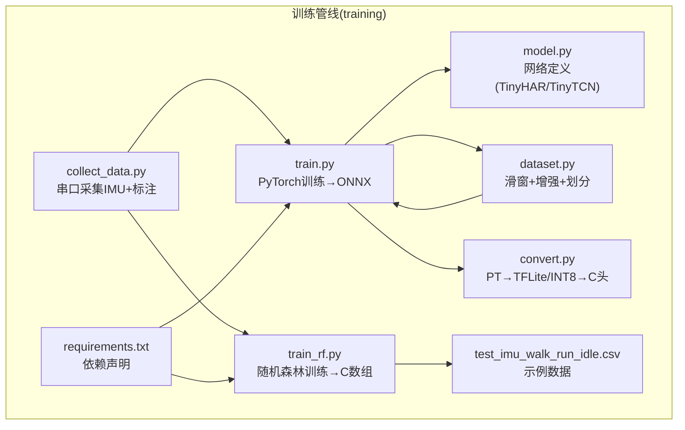
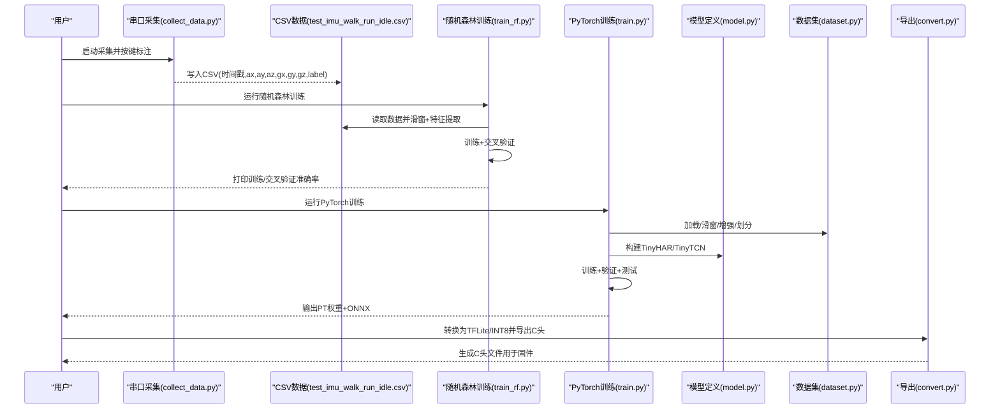
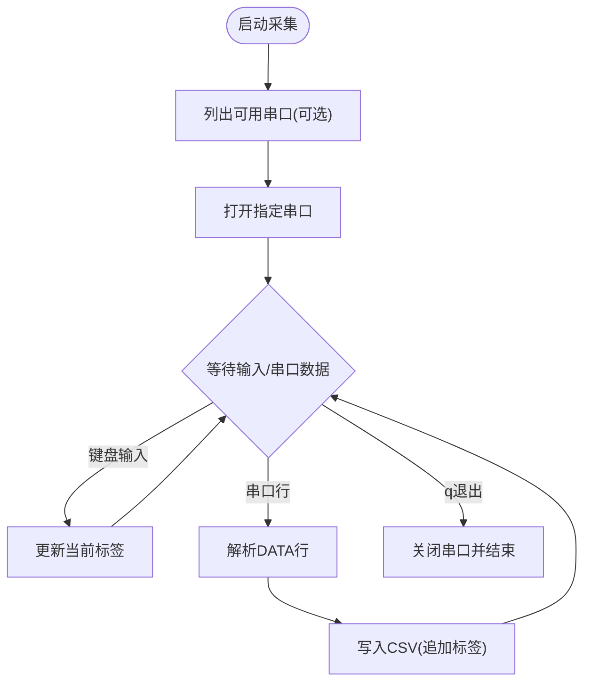
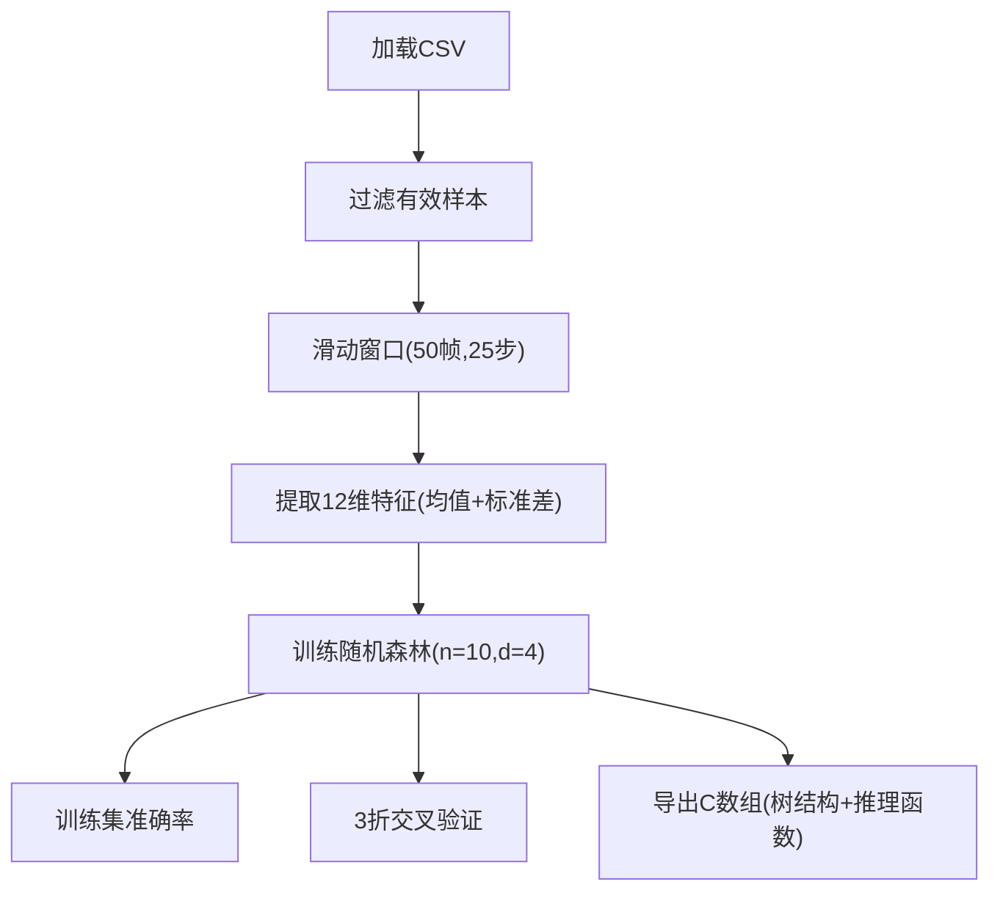
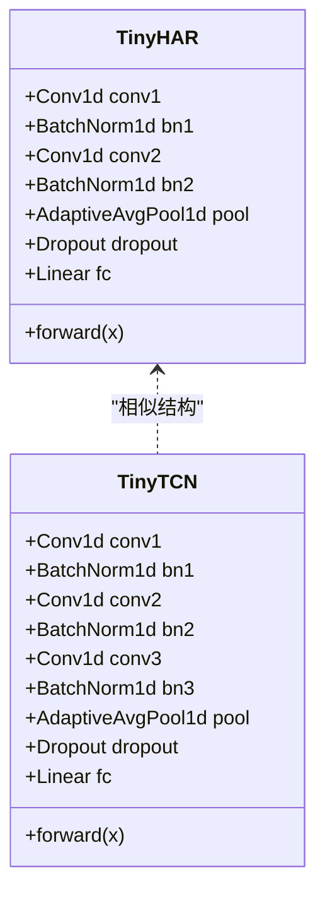
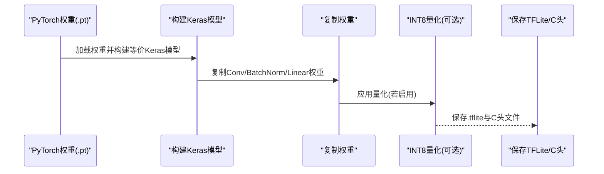
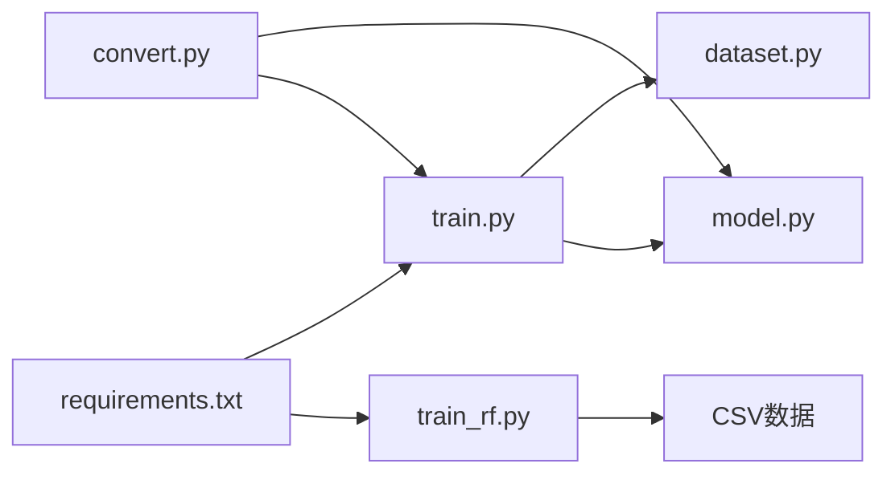

# 模型训练

<cite>
**本文引用的文件**
- [collect_data.py](file://training/collect_data.py)
- [train_rf.py](file://training/train_rf.py)
- [train.py](file://training/train.py)
- [model.py](file://training/model.py)
- [dataset.py](file://training/archive/dataset.py)
- [convert.py](file://training/archive/convert.py)
- [requirements.txt](file://training/requirements.txt)
- [test_imu_walk_run_idle.csv](file://training/test_imu_walk_run_idle.csv)
- [DEVELOPMENT_PLAN.md](file://DEVELOPMENT_PLAN.md)
- [EDGE_AI_TRAINING_PLAN.md](file://EDGE_AI_TRAINING_PLAN.md)
</cite>

## 目录
1. [简介](#简介)
2. [项目结构](#项目结构)
3. [核心组件](#核心组件)
4. [架构总览](#架构总览)
5. [详细组件分析](#详细组件分析)
6. [依赖关系分析](#依赖关系分析)
7. [性能考量](#性能考量)
8. [故障排查指南](#故障排查指南)
9. [结论](#结论)
10. [附录](#附录)

## 简介
本文件面向 SmartBracelet 的 AI 模型训练流程，系统化梳理从数据采集、标注、特征工程、模型训练、评估、导出到部署的完整闭环。重点覆盖两类训练路径：
- 随机森林（轻量部署，适合 ESP32-S3 端侧）
- PyTorch 1D-CNN/TCN（可导出 ONNX/TFLite，便于手机端或更高性能设备）

同时给出数据采集工具使用、样本平衡策略、模型评估指标、交叉验证与测试集评估、模型保存与加载、可视化与监控建议等实用指南。

## 项目结构
训练相关代码集中在 training 目录，包含数据采集、模型定义、训练脚本、导出工具与依赖声明。关键文件如下：
- 数据采集：collect_data.py
- 随机森林训练：train_rf.py
- PyTorch 训练：train.py + model.py + dataset.py
- 模型导出：convert.py（TFLite/INT8）
- 依赖：requirements.txt
- 示例数据：test_imu_walk_run_idle.csv

图表来源
- [collect_data.py](file://training/collect_data.py#L1-L120)
- [train_rf.py](file://training/train_rf.py#L1-L160)
- [train.py](file://training/train.py#L1-L175)
- [model.py](file://training/model.py#L1-L69)
- [dataset.py](file://training/archive/dataset.py#L1-L116)
- [convert.py](file://training/archive/convert.py#L1-L234)
- [requirements.txt](file://training/requirements.txt#L1-L5)
- [test_imu_walk_run_idle.csv](file://training/test_imu_walk_run_idle.csv#L1-L800)

章节来源
- [DEVELOPMENT_PLAN.md](file://DEVELOPMENT_PLAN.md#L305-L315)
- [EDGE_AI_TRAINING_PLAN.md](file://EDGE_AI_TRAINING_PLAN.md#L54-L106)

## 核心组件
- 数据采集与标注
  - 通过串口实时接收 IMU 数据，键盘输入数字键进行标签切换，自动写入 CSV。
  - 支持列出可用串口、设置波特率、默认端口等。
- 随机森林训练与导出
  - 读取 CSV → 滑动窗口 → 统计特征（均值/标准差）→ 训练随机森林 → 交叉验证 → 导出 C 数组用于固件。
- PyTorch 训练与导出
  - 读取 CSV → 滑动窗口 → 增强（噪声/缩放）→ 训练 TinyHAR/TinyTCN → 保存 PT 权重 → 导出 ONNX → 转 TFLite/INT8 → C 头文件。
- 模型定义
  - TinyHAR：1D-CNN，参数量约 15K，INT8 约 60KB。
  - TinyTCN：带膨胀卷积的 TCN，参数量约 25K，INT8 约 100KB。
- 数据集处理
  - 滑动窗口、标签聚合（众数）、数据增强、训练/验证/测试划分。

章节来源
- [collect_data.py](file://training/collect_data.py#L1-L120)
- [train_rf.py](file://training/train_rf.py#L1-L160)
- [train.py](file://training/train.py#L1-L175)
- [model.py](file://training/model.py#L1-L69)
- [dataset.py](file://training/archive/dataset.py#L1-L116)
- [convert.py](file://training/archive/convert.py#L1-L234)

## 架构总览
下图展示从数据采集到模型部署的关键步骤与模块交互。

图表来源
- [collect_data.py](file://training/collect_data.py#L42-L120)
- [train_rf.py](file://training/train_rf.py#L124-L156)
- [train.py](file://training/train.py#L52-L172)
- [model.py](file://training/model.py#L5-L69)
- [dataset.py](file://training/archive/dataset.py#L86-L106)
- [convert.py](file://training/archive/convert.py#L95-L230)

## 详细组件分析

### 数据采集与标注（collect_data.py）
- 功能要点
  - 列出可用串口、设置端口与波特率、默认端口 COM9、波特率 115200。
  - 键盘输入数字键切换标签（1-8 对应 walk/run/wave/idle/flick/circle/sit/fall），按 q 退出。
  - 从串口读取以 DATA, 开头的行，解析 IMU 数据并追加当前标签写入 CSV。
  - 每收集 100 帧打印一次统计信息。
- 使用建议
  - 确认串口权限与驱动，首次运行可加 --list-ports 查看可用端口。
  - 标注时保持稳定姿态，避免抖动影响标签一致性。
  - 采集足够样本，建议每类至少数百帧，保证训练稳定性。

图表来源
- [collect_data.py](file://training/collect_data.py#L42-L120)

章节来源
- [collect_data.py](file://training/collect_data.py#L1-L120)

### 随机森林训练与导出（train_rf.py）
- 数据加载与过滤
  - 读取 CSV，提取 ax/ay/az/gx/gy/gz 与 label，过滤不在目标标签集合中的样本。
- 特征工程
  - 滑动窗口：WINDOW=50（1秒@50Hz），STRIDE=25（50%重叠）。
  - 每个窗口提取 12 维特征：每轴均值与标准差。
- 模型训练与评估
  - 使用 RandomForestClassifier，n_estimators=10，max_depth=4，random_state=42，n_jobs=-1。
  - 训练集准确率与 3 折交叉验证估计。
- 导出 C 数组
  - 将每棵决策树的节点结构（特征索引、阈值、左右子节点、叶子类别）打印为 C 结构体数组与推理函数。
- 注意事项
  - 该方案无需额外库依赖，适合 ESP32-S3 端侧直接部署。
  - 若需更复杂场景，可调高 n_estimators 或增大 max_depth，但会增加推理开销。

图表来源
- [train_rf.py](file://training/train_rf.py#L26-L52)
- [train_rf.py](file://training/train_rf.py#L136-L156)

章节来源
- [train_rf.py](file://training/train_rf.py#L1-L160)

### PyTorch 训练与评估（train.py + model.py + dataset.py）
- 模型定义
  - TinyHAR：两层卷积 + BN + GAP + Dropout + FC，参数量约 15K，INT8 约 60KB。
  - TinyTCN：三层膨胀卷积 + BN + GAP + Dropout + FC，参数量约 25K，INT8 约 100KB。
- 数据处理
  - 读取 CSV → 滑动窗口（默认 window=100, stride=50）→ 标签聚合（众数）→ 数据增强（噪声+缩放）→ 训练/验证/测试划分。
- 训练流程
  - Adam 优化器，交叉熵损失，ReduceLROnPlateau 调度。
  - 每轮打印损失、验证准确率与最佳验证准确率。
  - 测试集评估并输出混淆矩阵。
- 导出与保存
  - 保存 PyTorch 权重（.pt）与 ONNX（.onnx），便于后续转换为 TFLite/INT8。
- 评估指标
  - 准确率：预测正确的样本数 / 总样本数。
  - 混淆矩阵：用于分析各类别识别情况，辅助定位误判类别。

图表来源
- [model.py](file://training/model.py#L5-L69)

章节来源
- [train.py](file://training/train.py#L1-L175)
- [model.py](file://training/model.py#L1-L69)
- [dataset.py](file://training/archive/dataset.py#L1-L116)

### 模型导出与部署（convert.py）
- 目标
  - 将 PyTorch 权重转换为 TFLite/INT8，并导出为 C 头文件，便于嵌入固件。
- 流程
  - 加载 .pt 权重 → 构建等价 Keras 模型 → 复制权重 → INT8 量化（可选）→ 保存 .tflite → 导出 C 头文件。
- 关键点
  - 支持指定模型类型（har/tcn）、类别数、序列长度、通道数。
  - 可提供校准数据（npy）进行 INT8 量化，否则使用随机数据。
  - 输出文件名根据输入自动推断，包含 .tflite 与 .h。

图表来源
- [convert.py](file://training/archive/convert.py#L95-L230)

章节来源
- [convert.py](file://training/archive/convert.py#L1-L234)

## 依赖关系分析
- Python 环境
  - torch>=2.0、scikit-learn>=1.3、numpy>=1.24、pyserial>=3.5。
- 模块间耦合
  - train_rf.py 与 dataset.py（滑窗与标签聚合）存在间接耦合（两者均处理 CSV → 窗口 → 标签）。
  - train.py 与 model.py、dataset.py 强耦合（模型定义、数据加载与划分）。
  - convert.py 与 model.py 强耦合（等价网络结构）。
- 外部依赖
  - TensorFlow（仅用于 TFLite 转换），ONNX/ONNXRuntime（可选），ai-edge-torch（可选）。

图表来源
- [requirements.txt](file://training/requirements.txt#L1-L5)
- [train_rf.py](file://training/train_rf.py#L1-L160)
- [train.py](file://training/train.py#L1-L175)
- [model.py](file://training/model.py#L1-L69)
- [dataset.py](file://training/archive/dataset.py#L1-L116)
- [convert.py](file://training/archive/convert.py#L1-L234)

章节来源
- [requirements.txt](file://training/requirements.txt#L1-L5)

## 性能考量
- 随机森林（train_rf.py）
  - n_estimators=10，max_depth=4，特征维度 12，推理极轻量，适合资源受限设备。
  - 交叉验证估计整体泛化能力，便于快速迭代。
- PyTorch（train.py + model.py）
  - TinyHAR/TinyTCN 参数量小，INT8 后模型体积可控，适合移动端或边缘设备。
  - 训练采用 ReduceLROnPlateau，有助于在验证集上稳定收敛。
- 数据增强
  - 噪声与缩放增强可提升模型鲁棒性，减少过拟合风险。
- 推理效率
  - 随机森林推理时间短，适合高频实时场景。
  - TFLite/INT8 可进一步降低延迟与功耗，但需权衡精度。

[本节为通用指导，不直接分析具体文件]

## 故障排查指南
- 串口无法打开
  - 使用 --list-ports 查看可用端口，确认端口名称与驱动安装。
  - 检查波特率是否匹配（默认 115200）。
- 标签不生效
  - 确认键盘输入为数字键（1-8），且终端处于可读取状态。
- 训练准确率低
  - 增加样本量，确保各类别均衡。
  - 调整窗口大小与步长，或增加数据增强强度。
- 导出失败
  - 确认已安装 TensorFlow（用于 TFLite 转换）或使用 ai-edge-torch 直接转换。
  - 检查 .pt 权重与模型类型一致（har/tcn）。

章节来源
- [collect_data.py](file://training/collect_data.py#L42-L75)
- [train_rf.py](file://training/train_rf.py#L136-L156)
- [train.py](file://training/train.py#L107-L134)
- [convert.py](file://training/archive/convert.py#L95-L113)

## 结论
SmartBracelet 提供了两条高效可行的训练路径：随机森林（轻量、易部署）与 PyTorch（可扩展、可导出）。结合统一的数据采集与标注流程、滑动窗口特征工程、交叉验证与测试集评估，以及模型保存与导出工具，能够快速完成从数据到部署的闭环。建议根据应用场景选择合适模型，并持续优化数据质量与特征设计以提升性能。

[本节为总结性内容，不直接分析具体文件]

## 附录

### 数据采集与标注规范
- 采集频率：50Hz（每 20ms 采集一次）。
- 标注类别：walk、run、wave、idle、flick、circle、sit、fall。
- 建议每类采集 200-500 帧以上，避免极端动作导致标签偏差。
- 采集时保持稳定，避免抖动与非目标动作混入。

章节来源
- [collect_data.py](file://training/collect_data.py#L26-L30)
- [test_imu_walk_run_idle.csv](file://training/test_imu_walk_run_idle.csv#L1-L800)

### 随机森林超参数设置
- n_estimators：10（决策树数量）
- max_depth：4（最大深度）
- 特征：每轴均值与标准差，共 12 维
- 训练策略：并行（n_jobs=-1），随机种子固定（42）

章节来源
- [train_rf.py](file://training/train_rf.py#L136-L138)

### 模型评估指标与方法
- 准确率：预测正确样本数 / 总样本数。
- 交叉验证：3 折交叉验证估计泛化误差。
- 混淆矩阵：用于分析各类别识别情况，定位误判类别。

章节来源
- [train_rf.py](file://training/train_rf.py#L142-L146)
- [train.py](file://training/train.py#L27-L49)

### 模型保存与加载
- PyTorch 权重保存：包含模型状态字典、类别数、通道数、序列长度、模型类型、验证/测试准确率。
- 加载：根据保存字段重建模型实例并加载权重。

章节来源
- [train.py](file://training/train.py#L146-L157)

### 可视化与监控建议
- 训练曲线：记录每轮训练损失与验证准确率，绘制折线图观察收敛趋势。
- 混淆矩阵热力图：直观展示各类别识别效果。
- 样本分布直方图：检查各类别样本数量是否均衡，必要时进行重采样或数据增强。
- 推理耗时：记录单次推理时间，评估实时性与功耗。

[本节为通用指导，不直接分析具体文件]