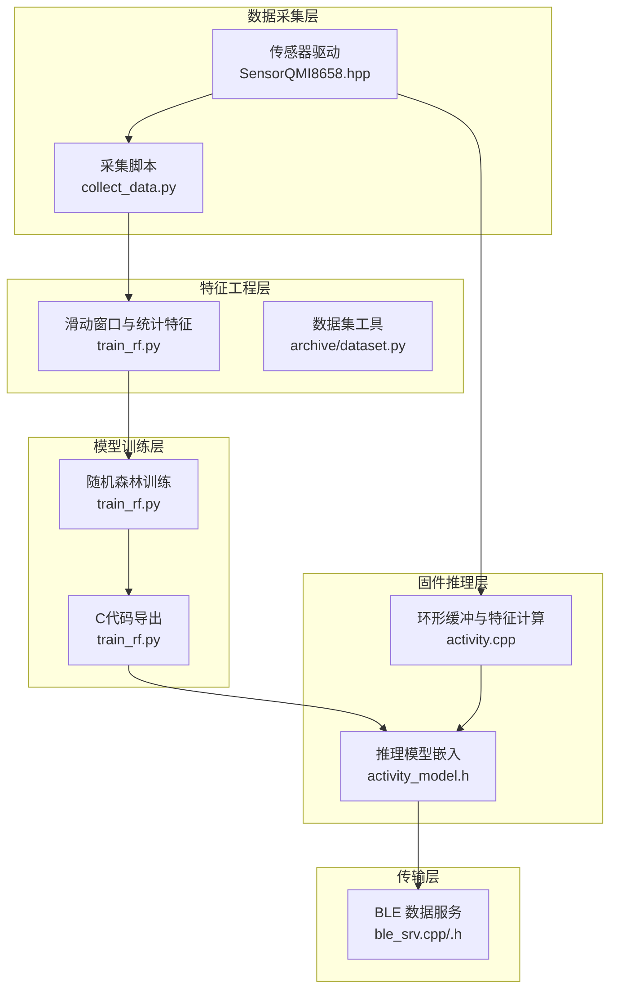
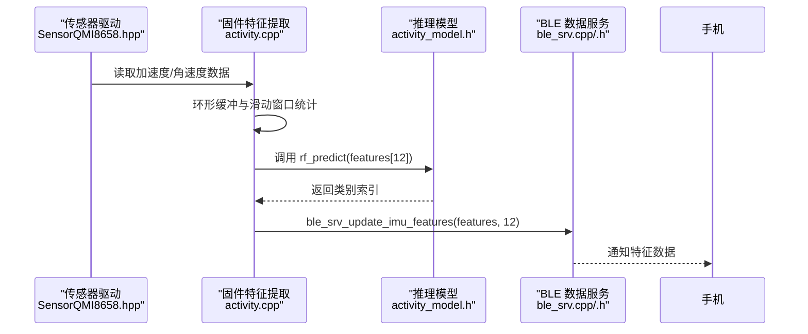
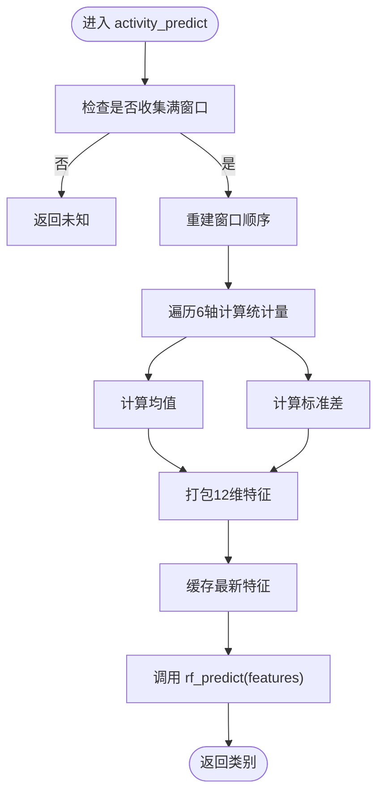
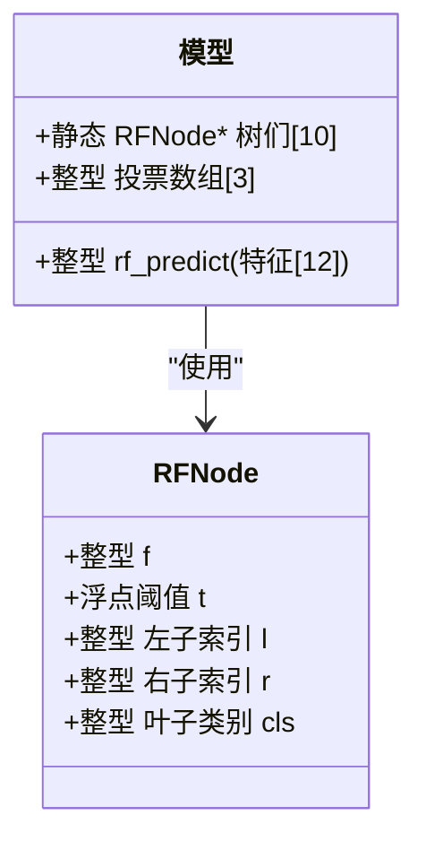
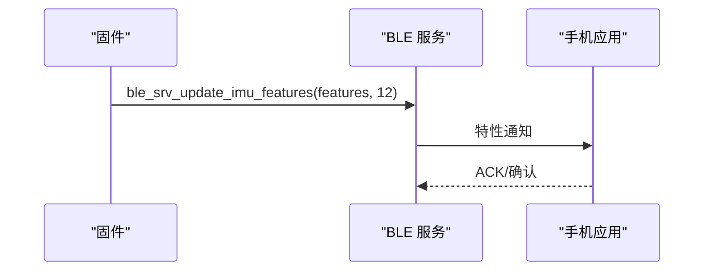
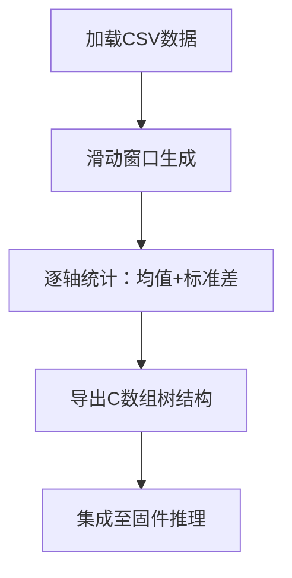
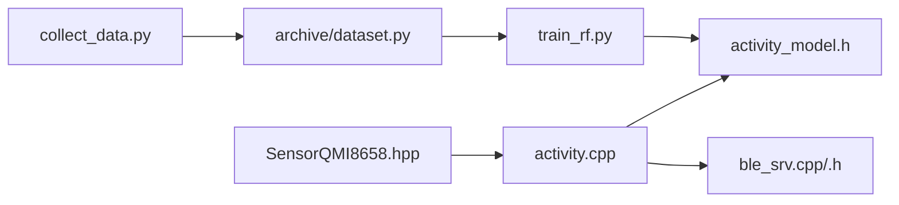

# 特征工程

<cite>
**本文引用的文件**
- [src/activity.cpp](file://src/activity.cpp)
- [src/activity.h](file://src/activity.h)
- [src/activity_model.h](file://src/activity_model.h)
- [src/service/ble_srv.cpp](file://src/service/ble_srv.cpp)
- [src/service/ble_srv.h](file://src/service/ble_srv.h)
- [training/train_rf.py](file://training/train_rf.py)
- [training/archive/dataset.py](file://training/archive/dataset.py)
- [training/collect_data.py](file://training/collect_data.py)
- [training/test_imu_walk_run_idle.csv](file://training/test_imu_walk_run_idle.csv)
- [lib/SensorLib-Waveshare/src/SensorQMI8658.hpp](file://lib/SensorLib-Waveshare/src/SensorQMI8658.hpp)
- [EDGE_AI_TRAINING_PLAN.md](file://EDGE_AI_TRAINING_PLAN.md)
- [DEBUG_REPORT.md](file://DEBUG_REPORT.md)
</cite>

## 目录
1. [引言](#引言)
2. [项目结构](#项目结构)
3. [核心组件](#核心组件)
4. [架构总览](#架构总览)
5. [详细组件分析](#详细组件分析)
6. [依赖关系分析](#依赖关系分析)
7. [性能考虑](#性能考虑)
8. [故障排查指南](#故障排查指南)
9. [结论](#结论)
10. [附录](#附录)

## 引言
本技术文档围绕 SmartBracelet 的特征工程系统展开，聚焦于12维特征向量的设计与实现，涵盖时域统计特征（均值与标准差）、频域特征的理论基础与实践价值、特征标准化与归一化策略、特征选择与降维方法、特征质量评估与异常值处理，以及特征向量的存储格式与传输协议。文档以仓库中的实际代码为依据，结合训练脚本与固件实现，给出可操作的技术细节与可视化图示。

## 项目结构
SmartBracelet 的特征工程由“数据采集—特征提取—模型训练—固件推理—BLE 传输”构成闭环。关键路径如下：
- 数据采集：传感器驱动读取加速度与角速度，采集脚本将原始数据写入 CSV。
- 特征提取：滑动窗口 + 统计特征（均值、标准差），形成12维特征向量。
- 训练与导出：随机森林训练并导出 C 代码，嵌入固件推理。
- 固件推理：环形缓冲区滑动窗口，实时计算特征并上传 BLE。
- 传输协议：BLE Data Service 提供特征通知通道。

**图表来源**
- [src/activity.cpp](file://src/activity.cpp#L1-L130)
- [src/activity_model.h](file://src/activity_model.h#L1-L74)
- [src/service/ble_srv.cpp](file://src/service/ble_srv.cpp#L190-L222)
- [src/service/ble_srv.h](file://src/service/ble_srv.h#L46-L49)
- [training/train_rf.py](file://training/train_rf.py#L1-L147)
- [training/archive/dataset.py](file://training/archive/dataset.py#L1-L116)
- [lib/SensorLib-Waveshare/src/SensorQMI8658.hpp](file://lib/SensorLib-Waveshare/src/SensorQMI8658.hpp#L651-L686)

**章节来源**
- [src/activity.cpp](file://src/activity.cpp#L1-L130)
- [src/activity_model.h](file://src/activity_model.h#L1-L74)
- [src/service/ble_srv.cpp](file://src/service/ble_srv.cpp#L190-L222)
- [src/service/ble_srv.h](file://src/service/ble_srv.h#L46-L49)
- [training/train_rf.py](file://training/train_rf.py#L1-L147)
- [training/archive/dataset.py](file://training/archive/dataset.py#L1-L116)
- [lib/SensorLib-Waveshare/src/SensorQMI8658.hpp](file://lib/SensorLib-Waveshare/src/SensorQMI8658.hpp#L651-L686)

## 核心组件
- 12维特征向量设计
  - 6个均值特征：分别对应加速度三轴(ax/ay/az)与角速度三轴(gx/gy/gz)。
  - 6个标准差特征：同上，反映信号的离散程度与抖动强度。
- 时域特征提取
  - 窗口大小与步长：固定窗口长度与重叠步长，保证时间连续性与稳定性。
  - 统计量：窗口内逐轴求均值与标准差，形成12维特征向量。
- 频域特征
  - 理论基础：频域能量分布、主频率、能量集中度等，常用于区分周期性运动与非周期性动作。
  - 实践价值：在当前 Walk/Run/Idle 识别场景中，时域均值与标准差已足够；若需更高精度或手势识别，可引入FFT、功率谱、频带能量等。
- 特征标准化与归一化
  - 标准化（Z-score）：适用于各轴量纲一致且近似正态分布。
  - 归一化（Min-Max）：适用于有明确物理上下限的传感器数据。
  - 建议：按训练集统计量对测试/在线数据进行变换，避免数据泄露。
- 特征选择与降维
  - 过滤法：基于方差、互信息、卡方等指标筛选高区分度特征。
  - 包装法：递归特征消除（RFE）等，结合模型评估。
  - 嵌入法：L1正则化、树模型特征重要性。
  - 降维：PCA/LDA/自编码器，保留主要能量占比（如95%）。
- 特征质量评估与异常值处理
  - 质量评估：缺失率、离群点比例、特征分布稳定性、跨设备一致性。
  - 异常值处理：基于统计（3σ、IQR）或基于模型（孤立森林、One-Class SVM）检测与剔除。
- 存储格式与传输协议
  - 存储：CSV（时间戳, ax, ay, az, gx, gy, gz, label）。
  - 传输：BLE Data Service 的特征通知通道，以4字节浮点数序列发送（最多12个，共48字节）。

**章节来源**
- [src/activity.cpp](file://src/activity.cpp#L52-L76)
- [training/train_rf.py](file://training/train_rf.py#L39-L51)
- [training/archive/dataset.py](file://training/archive/dataset.py#L30-L51)
- [src/service/ble_srv.cpp](file://src/service/ble_srv.cpp#L214-L221)

## 架构总览
下图展示从传感器到 BLE 的完整链路，重点标注特征提取与传输节点。

**图表来源**
- [lib/SensorLib-Waveshare/src/SensorQMI8658.hpp](file://lib/SensorLib-Waveshare/src/SensorQMI8658.hpp#L651-L686)
- [src/activity.cpp](file://src/activity.cpp#L30-L76)
- [src/activity_model.h](file://src/activity_model.h#L58-L73)
- [src/service/ble_srv.cpp](file://src/service/ble_srv.cpp#L403-L412)
- [src/service/ble_srv.h](file://src/service/ble_srv.h#L46-L49)

## 详细组件分析

### 组件A：固件特征提取（activity.cpp）
- 环形缓冲与滑动窗口
  - 使用固定窗口大小与步长，确保每次推理使用相同时间跨度的数据。
  - 窗口内按轴计算均值与标准差，形成12维特征向量。
- 推理与稳定性
  - 推理结果经稳定机制（连续多次一致才更新）减少误判。
  - 可将最新特征缓存以便 BLE 上报。

**图表来源**
- [src/activity.cpp](file://src/activity.cpp#L42-L76)

**章节来源**
- [src/activity.cpp](file://src/activity.cpp#L1-L130)
- [src/activity.h](file://src/activity.h#L1-L12)

### 组件B：推理模型嵌入（activity_model.h）
- 随机森林结构
  - 以 C 结构体数组形式存储多棵决策树，每棵树以节点数组表示。
  - 推理函数对输入特征进行树遍历，累计投票后选择多数类。
- 特征索引映射
  - 12维特征按轴与统计量顺序排列，需与训练阶段严格一致。

**图表来源**
- [src/activity_model.h](file://src/activity_model.h#L5-L73)

**章节来源**
- [src/activity_model.h](file://src/activity_model.h#L1-L74)

### 组件C：BLE 特征传输（ble_srv.cpp/.h）
- 服务与特性
  - Data Service 提供特征通知特性，支持读取与通知。
  - 特征以原始字节流发送，每个浮点数占4字节，最多12个。
- 上报流程
  - 固件侧将最新特征数组打包并通过 BLE 发送。
  - 手机端订阅特性即可接收实时特征。

**图表来源**
- [src/service/ble_srv.cpp](file://src/service/ble_srv.cpp#L214-L221)
- [src/service/ble_srv.cpp](file://src/service/ble_srv.cpp#L403-L412)
- [src/service/ble_srv.h](file://src/service/ble_srv.h#L46-L49)
- [DEBUG_REPORT.md](file://DEBUG_REPORT.md#L1106-L1118)

**章节来源**
- [src/service/ble_srv.cpp](file://src/service/ble_srv.cpp#L190-L222)
- [src/service/ble_srv.cpp](file://src/service/ble_srv.cpp#L403-L412)
- [src/service/ble_srv.h](file://src/service/ble_srv.h#L46-L49)
- [DEBUG_REPORT.md](file://DEBUG_REPORT.md#L1106-L1118)

### 组件D：训练与特征工程（train_rf.py, dataset.py）
- 滑动窗口与特征
  - 固定窗口长度与步长，窗口内对6轴数据分别计算均值与标准差，得到12维特征。
- 数据集工具
  - 加载 CSV、标签映射、滑动窗口、数据增强（噪声与缩放）。
- 导出 C 代码
  - 将训练好的随机森林树结构与节点阈值打印为 C 数组，便于嵌入固件。

**图表来源**
- [training/train_rf.py](file://training/train_rf.py#L26-L51)
- [training/archive/dataset.py](file://training/archive/dataset.py#L30-L83)

**章节来源**
- [training/train_rf.py](file://training/train_rf.py#L1-L147)
- [training/archive/dataset.py](file://training/archive/dataset.py#L1-L116)

### 组件E：数据采集与标注（collect_data.py, test_imu_walk_run_idle.csv）
- 采集脚本
  - 通过串口读取传感器数据，键盘输入设置标签，写入 CSV。
- 测试数据
  - 提供示例 CSV 文件，包含时间戳与6轴数据及标签列。

**章节来源**
- [training/collect_data.py](file://training/collect_data.py#L1-L120)
- [training/test_imu_walk_run_idle.csv](file://training/test_imu_walk_run_idle.csv#L1-L800)

## 依赖关系分析
- 固件依赖
  - 传感器驱动提供原始数据；固件特征模块负责统计与推理；BLE 服务负责传输。
- 训练依赖
  - 采集脚本产出 CSV；数据集工具完成窗口化与增强；训练脚本导出推理代码。
- 关键耦合点
  - 特征维度与顺序必须在训练与固件之间保持一致。
  - BLE 传输格式需与固件打包格式匹配。

**图表来源**
- [lib/SensorLib-Waveshare/src/SensorQMI8658.hpp](file://lib/SensorLib-Waveshare/src/SensorQMI8658.hpp#L651-L686)
- [src/activity.cpp](file://src/activity.cpp#L1-L130)
- [src/activity_model.h](file://src/activity_model.h#L1-L74)
- [src/service/ble_srv.cpp](file://src/service/ble_srv.cpp#L190-L222)
- [training/collect_data.py](file://training/collect_data.py#L1-L120)
- [training/archive/dataset.py](file://training/archive/dataset.py#L1-L116)
- [training/train_rf.py](file://training/train_rf.py#L1-L147)

**章节来源**
- [lib/SensorLib-Waveshare/src/SensorQMI8658.hpp](file://lib/SensorLib-Waveshare/src/SensorQMI8658.hpp#L651-L686)
- [src/activity.cpp](file://src/activity.cpp#L1-L130)
- [src/activity_model.h](file://src/activity_model.h#L1-L74)
- [src/service/ble_srv.cpp](file://src/service/ble_srv.cpp#L190-L222)
- [training/collect_data.py](file://training/collect_data.py#L1-L120)
- [training/archive/dataset.py](file://training/archive/dataset.py#L1-L116)
- [training/train_rf.py](file://training/train_rf.py#L1-L147)

## 性能考虑
- 计算复杂度
  - 固件每步仅做固定窗口内的均值与标准差计算，时间复杂度 O(W·D)，W 为窗口长度，D 为维度（此处为12）。
- 内存占用
  - 环形缓冲占用 O(W·D) 浮点内存；随机森林推理为常数级额外空间。
- 传输开销
  - BLE 通知最大 48 字节（12×4），满足当前需求；建议保持固定长度，便于解析。
- 实时性
  - 窗口大小与采样率需权衡：窗口越大越稳定但延迟越高；采样率越高计算量越大。

[本节为通用指导，不直接分析具体文件]

## 故障排查指南
- 无特征上报
  - 检查 BLE 是否连接、特性订阅是否成功。
  - 确认固件是否正确打包并调用发送接口。
- 类别预测不稳定
  - 检查窗口是否完整、统计是否正常。
  - 调整稳定计数阈值或重新训练模型。
- 数据采集异常
  - 确认串口波特率、端口选择与标签输入。
  - 检查传感器驱动初始化与数据就绪标志。

**章节来源**
- [src/service/ble_srv.cpp](file://src/service/ble_srv.cpp#L317-L327)
- [src/service/ble_srv.cpp](file://src/service/ble_srv.cpp#L330-L361)
- [training/collect_data.py](file://training/collect_data.py#L42-L120)

## 结论
SmartBracelet 的特征工程以“时域统计特征 + 随机森林 + BLE 传输”为核心路径，具备低功耗、低延迟与高可移植性的优势。12维特征向量（6均值+6标准差）在 Walk/Run/Idle 场景中表现稳健；若需进一步提升精度或扩展到更复杂的动作/手势，可在现有框架中引入频域特征与更丰富的统计量，并配合特征选择与降维策略优化模型与资源占用。

[本节为总结性内容，不直接分析具体文件]

## 附录

### A. 12维特征向量设计说明
- 均值特征（6维）：反映信号中心趋势，对平移不变性动作敏感。
- 标准差特征（6维）：反映信号波动程度，对抖动与强度变化敏感。
- 设计原则：与传感器轴向一一对应，便于物理意义解释与异常诊断。

**章节来源**
- [src/activity.cpp](file://src/activity.cpp#L52-L76)
- [training/train_rf.py](file://training/train_rf.py#L39-L41)

### B. 时域特征提取流程
- 窗口参数：固定长度与步长，保证时间连续性。
- 统计量：逐轴均值与标准差，形成12维向量。
- 稳定性：固件侧采用稳定机制减少误判。

**章节来源**
- [src/activity.cpp](file://src/activity.cpp#L7-L8)
- [src/activity.cpp](file://src/activity.cpp#L42-L76)

### C. 频域特征理论与实践
- 理论：频域描述信号能量分布与周期性，适合捕捉重复性动作。
- 实践：可计算FFT幅度谱、主频率、频带能量、零交叉率等。
- 建议：在现有均值+标准差基础上增量引入，避免破坏已有模型。

[本节为概念性说明，不直接分析具体文件]

### D. 特征标准化与归一化策略
- 标准化（Z-score）：适用于近似正态分布且量纲一致的特征。
- 归一化（Min-Max）：适用于有明确物理上下限的传感器数据。
- 实施：使用训练集统计量对测试/在线数据进行变换，避免数据泄露。

[本节为通用指导，不直接分析具体文件]

### E. 特征选择与降维
- 过滤法：方差、互信息、卡方等。
- 包装法：递归特征消除（RFE）。
- 嵌入法：L1正则化、树模型特征重要性。
- 降维：PCA/LDA/自编码器，保留主要能量占比（如95%）。

[本节为通用指导，不直接分析具体文件]

### F. 特征质量评估与异常值处理
- 质量评估：缺失率、离群点比例、分布稳定性、跨设备一致性。
- 异常值处理：3σ/IQR 统计法或基于模型的 One-Class SVM、孤立森林。

[本节为通用指导，不直接分析具体文件]

### G. 存储格式与传输协议
- 存储：CSV（时间戳, ax, ay, az, gx, gy, gz, label）。
- 传输：BLE Data Service 特性，4字节浮点数序列（最多12个，48字节）。

**章节来源**
- [src/service/ble_srv.cpp](file://src/service/ble_srv.cpp#L214-L221)
- [DEBUG_REPORT.md](file://DEBUG_REPORT.md#L1106-L1118)