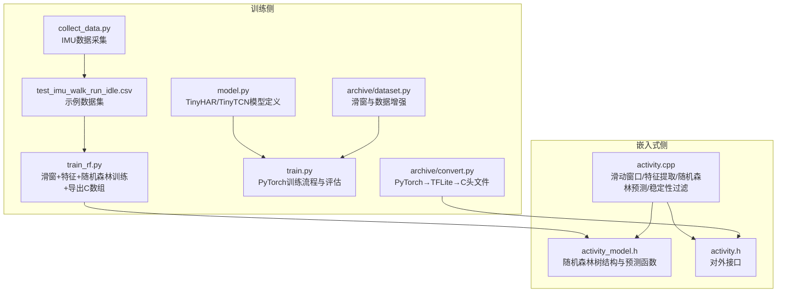
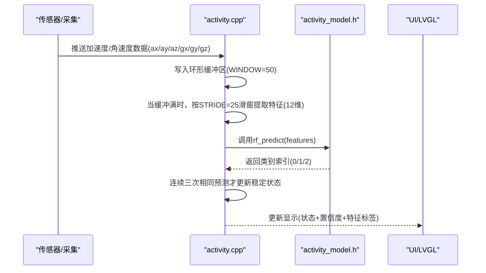
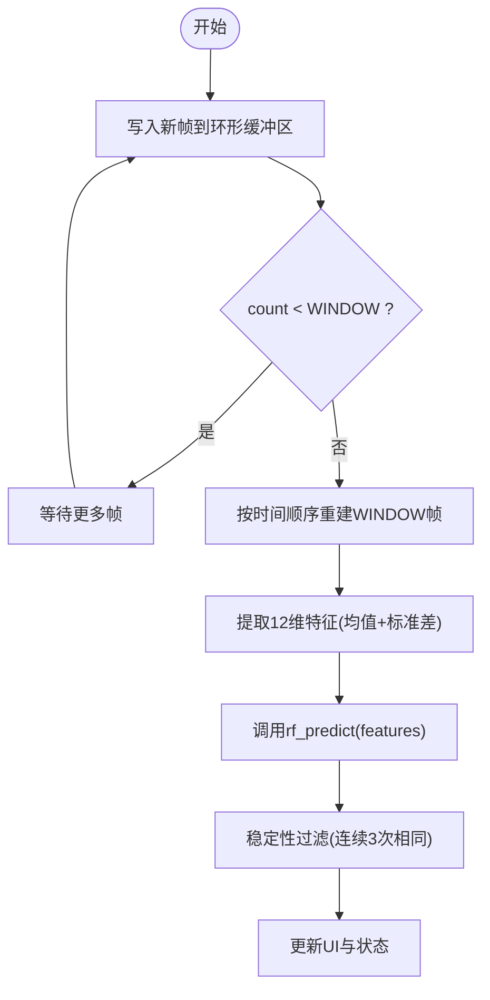
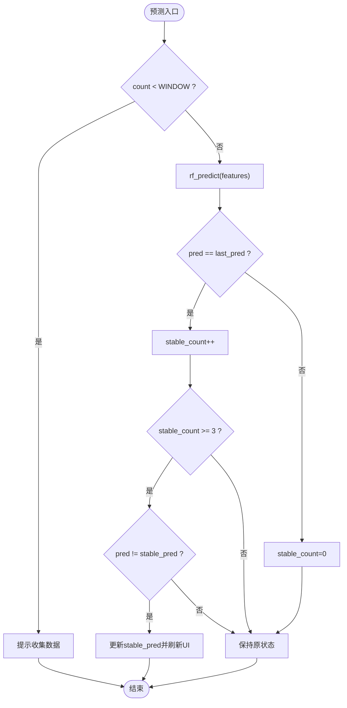
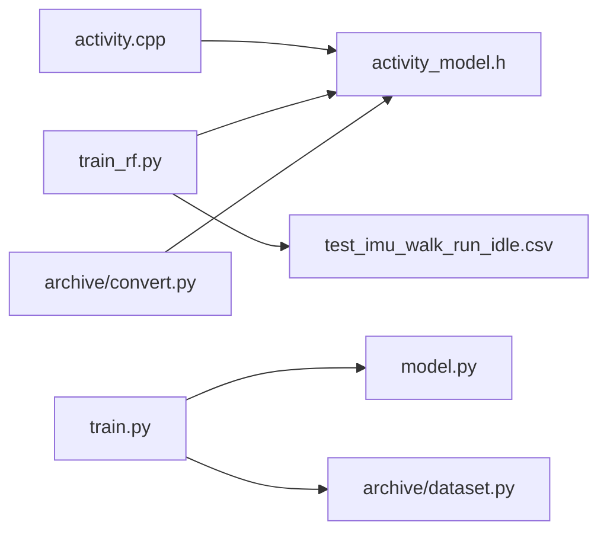

# 算法设计

<cite>
**本文引用的文件列表**
- [src/activity.h](file://src/activity.h)
- [src/activity.cpp](file://src/activity.cpp)
- [src/activity_model.h](file://src/activity_model.h)
- [training/train_rf.py](file://training/train_rf.py)
- [training/model.py](file://training/model.py)
- [training/train.py](file://training/train.py)
- [training/collect_data.py](file://training/collect_data.py)
- [training/test_imu_walk_run_idle.csv](file://training/test_imu_walk_run_idle.csv)
- [training/archive/dataset.py](file://training/archive/dataset.py)
- [training/archive/convert.py](file://training/archive/convert.py)
- [EDGE_AI_TRAINING_PLAN.md](file://EDGE_AI_TRAINING_PLAN.md)
</cite>

## 目录
1. [引言](#引言)
2. [项目结构](#项目结构)
3. [核心组件](#核心组件)
4. [架构总览](#架构总览)
5. [详细组件分析](#详细组件分析)
6. [依赖关系分析](#依赖关系分析)
7. [性能考量](#性能考量)
8. [故障排查指南](#故障排查指南)
9. [结论](#结论)
10. [附录](#附录)

## 引言
本技术文档围绕 SmartBracelet 的活动识别算法进行系统化设计与实现说明，重点覆盖以下方面：
- 随机森林算法在活动识别中的应用原理、算法选择理由与优势
- 滑动窗口机制的设计思路与参数选择依据（窗口大小 WINDOW=50、步长 STRIDE=25）
- 稳定性判断机制（连续三次相同预测）与防抖动设计
- 活动状态分类体系（WALK、RUN、IDLE）的定义与识别标准
- 算法参数调优指南（窗口参数、稳定阈值等）
- 算法性能分析与准确率评估方法

## 项目结构
该仓库采用“嵌入式固件 + Python 训练/采集”的分层架构：
- 嵌入式侧（ESP32-S3）：实时采集 IMU 数据，维护滑动窗口缓冲区，提取 12 维特征，通过随机森林进行在线预测，并进行稳定性过滤与显示更新
- 训练侧（Python）：提供数据采集脚本、滑动窗口特征提取、随机森林训练与导出 C 数组、以及可选的神经网络方案（TinyHAR/TinyTCN）

图表来源
- [src/activity.cpp](file://src/activity.cpp#L1-L130)
- [src/activity_model.h](file://src/activity_model.h#L1-L74)
- [src/activity.h](file://src/activity.h#L1-L13)
- [training/train_rf.py](file://training/train_rf.py#L1-L160)
- [training/model.py](file://training/model.py#L1-L69)
- [training/train.py](file://training/train.py#L1-L175)
- [training/collect_data.py](file://training/collect_data.py#L1-L120)
- [training/test_imu_walk_run_idle.csv](file://training/test_imu_walk_run_idle.csv#L1-L800)
- [training/archive/dataset.py](file://training/archive/dataset.py#L1-L116)
- [training/archive/convert.py](file://training/archive/convert.py#L1-L234)

章节来源
- [src/activity.h](file://src/activity.h#L1-L13)
- [src/activity.cpp](file://src/activity.cpp#L1-L130)
- [src/activity_model.h](file://src/activity_model.h#L1-L74)
- [training/train_rf.py](file://training/train_rf.py#L1-L160)
- [training/model.py](file://training/model.py#L1-L69)
- [training/train.py](file://training/train.py#L1-L175)
- [training/collect_data.py](file://training/collect_data.py#L1-L120)
- [training/test_imu_walk_run_idle.csv](file://training/test_imu_walk_run_idle.csv#L1-L800)
- [training/archive/dataset.py](file://training/archive/dataset.py#L1-L116)
- [training/archive/convert.py](file://training/archive/convert.py#L1-L234)

## 核心组件
- 活动识别主控模块（activity.cpp）：负责滑动窗口缓冲、特征提取（均值+标准差）、随机森林预测、稳定性过滤与 UI 更新
- 随机森林模型（activity_model.h）：内嵌 10 棵决策树的树形结构与投票预测逻辑
- 对外接口（activity.h）：提供数据推送、当前状态查询、特征导出等接口
- 训练与导出（train_rf.py）：滑动窗口+特征提取+随机森林训练+导出 C 数组
- 可选神经网络方案（model.py、train.py、convert.py）：提供 TinyHAR/TinyTCN 的 PyTorch 实现与量化部署路径

章节来源
- [src/activity.h](file://src/activity.h#L1-L13)
- [src/activity.cpp](file://src/activity.cpp#L1-L130)
- [src/activity_model.h](file://src/activity_model.h#L1-L74)
- [training/train_rf.py](file://training/train_rf.py#L1-L160)
- [training/model.py](file://training/model.py#L1-L69)
- [training/train.py](file://training/train.py#L1-L175)
- [training/archive/convert.py](file://training/archive/convert.py#L1-L234)

## 架构总览
下图展示从 IMU 数据到活动识别结果的端到端流程，包括嵌入式侧的实时处理与训练侧的离线训练/导出。

图表来源
- [src/activity.cpp](file://src/activity.cpp#L30-L129)
- [src/activity_model.h](file://src/activity_model.h#L58-L73)

## 详细组件分析

### 随机森林算法在活动识别中的应用
- 特征工程：对 50 帧（1 秒）窗口内的 6 轴（ax/ay/az/gx/gy/gz）分别计算均值与标准差，得到 12 维特征向量
- 分类器：使用 10 棵深度受限的决策树进行集成学习，通过多数投票确定最终类别
- 优点：
  - 可解释性强：可通过树结构查看关键特征与阈值
  - 对噪声鲁棒：集成多个弱学习器降低过拟合风险
  - 实时友好：树遍历预测复杂度低，适合嵌入式部署
  - 易于导出：训练后可直接导出为 C 数组，便于固化到固件中

章节来源
- [src/activity.cpp](file://src/activity.cpp#L42-L76)
- [src/activity_model.h](file://src/activity_model.h#L5-L74)
- [training/train_rf.py](file://training/train_rf.py#L39-L51)
- [training/train_rf.py](file://training/train_rf.py#L136-L145)

### 滑动窗口机制设计
- 窗口大小 WINDOW=50：对应 1 秒钟的 IMU 数据（采样率 50Hz）
- 步长 STRIDE=25：50% 重叠，兼顾时间分辨率与计算开销
- 缓冲策略：环形缓冲区 head 指针循环推进，count 记录有效样本数；当 count<WINDOW 时不进行预测
- 时间顺序重建：从 head 开始按时间顺序取出 WINDOW 帧，避免乱序导致特征不一致

图表来源
- [src/activity.cpp](file://src/activity.cpp#L30-L76)
- [src/activity.cpp](file://src/activity.cpp#L107-L129)

章节来源
- [src/activity.cpp](file://src/activity.cpp#L7-L40)
- [src/activity.cpp](file://src/activity.cpp#L42-L76)
- [src/activity.cpp](file://src/activity.cpp#L107-L129)
- [training/train_rf.py](file://training/train_rf.py#L22-L23)
- [training/train_rf.py](file://training/train_rf.py#L44-L51)

### 稳定性判断与防抖动设计
- 设计目标：减少误触发与闪烁，提升用户体验
- 实现方式：
  - 记录最近一次预测 last_pred 与稳定预测 stable_pred
  - 若本次预测与 last_pred 相同，则 stable_count 自增；达到阈值（≥3）且与当前 stable_pred 不同时，更新 stable_pred
  - 若不同则重置 stable_count=0
  - 仅在稳定预测发生变化时更新 UI 文本颜色与状态

图表来源
- [src/activity.cpp](file://src/activity.cpp#L107-L129)

章节来源
- [src/activity.cpp](file://src/activity.cpp#L18-L28)
- [src/activity.cpp](file://src/activity.cpp#L107-L129)

### 活动状态分类体系
- 类别映射：WALK=0、RUN=1、IDLE=2
- 训练标签映射：训练脚本支持多标签映射到 3 类（走/跑/静止），并在导出 C 数组时保留类别名称
- 识别标准：由 12 维特征驱动的随机森林模型决定；稳定性过滤确保状态切换平滑

章节来源
- [src/activity.cpp](file://src/activity.cpp#L18-L18)
- [src/activity_model.h](file://src/activity_model.h#L3-L3)
- [training/train_rf.py](file://training/train_rf.py#L21-L21)

### 算法参数调优指南
- 窗口参数
  - WINDOW：建议根据动作持续性与实时性权衡。增大 WINDOW 提高稳定性但降低响应速度；减小 WINDOW 提升响应但易受噪声影响
  - STRIDE：重叠比例越高，冗余越多但更平滑。50% 重叠在资源与精度间取得平衡
- 稳定阈值
  - stable_count 阈值：当前实现为 3；可根据抖动程度调整，如 2/4
- 特征维度
  - 当前使用 12 维（均值+标准差），若需更高区分度可考虑引入能量、频域统计等
- 集成树数量
  - 当前 10 棵树；可尝试 5/15 观察准确率与延迟变化

章节来源
- [src/activity.cpp](file://src/activity.cpp#L7-L8)
- [src/activity.cpp](file://src/activity.cpp#L114-L128)
- [src/activity_model.h](file://src/activity_model.h#L58-L73)
- [training/train_rf.py](file://training/train_rf.py#L136-L137)

### 性能分析与准确率评估
- 嵌入式侧
  - 预测复杂度：每次预测遍历 10 棵树，每棵树最多若干层，整体常数时间
  - 内存占用：WINDOW×6 浮点缓冲区；特征数组 12×float；少量静态变量
  - 实时性：每 20ms 左右（50Hz/25 步长）产生一次预测，满足实时需求
- 训练侧（随机森林）
  - 训练准确率与交叉验证估计：脚本输出训练集准确率与 3 折交叉验证均值与方差
  - 导出 C 数组：将树结构与预测函数打印为 C 代码，便于直接集成到固件
- 训练侧（神经网络）
  - TinyHAR/TinyTCN：提供 PyTorch 实现与 ONNX/TFLite 转换流程，支持 INT8 量化以进一步降低资源占用
  - 评估指标：提供准确率与混淆矩阵输出

章节来源
- [src/activity.cpp](file://src/activity.cpp#L42-L76)
- [src/activity_model.h](file://src/activity_model.h#L58-L73)
- [training/train_rf.py](file://training/train_rf.py#L139-L145)
- [training/train.py](file://training/train.py#L135-L141)
- [training/model.py](file://training/model.py#L5-L28)
- [training/archive/convert.py](file://training/archive/convert.py#L159-L186)

## 依赖关系分析
- activity.cpp 依赖 activity_model.h 中的随机森林树结构与预测函数
- activity_model.h 由训练脚本导出的 C 数组生成
- 训练脚本 train_rf.py 依赖 scikit-learn，输出 C 数组供固件使用
- 可选神经网络方案依赖 PyTorch/TensorFlow/Keras，提供 ONNX/TFLite 转换与量化导出

图表来源
- [src/activity.cpp](file://src/activity.cpp#L1-L5)
- [src/activity_model.h](file://src/activity_model.h#L1-L5)
- [training/train_rf.py](file://training/train_rf.py#L1-L12)
- [training/test_imu_walk_run_idle.csv](file://training/test_imu_walk_run_idle.csv#L1-L800)
- [training/train.py](file://training/train.py#L17-L18)
- [training/model.py](file://training/model.py#L1-L69)
- [training/archive/dataset.py](file://training/archive/dataset.py#L1-L116)
- [training/archive/convert.py](file://training/archive/convert.py#L1-L234)

章节来源
- [src/activity.cpp](file://src/activity.cpp#L1-L5)
- [src/activity_model.h](file://src/activity_model.h#L1-L5)
- [training/train_rf.py](file://training/train_rf.py#L1-L12)
- [training/train.py](file://training/train.py#L17-L18)
- [training/archive/dataset.py](file://training/archive/dataset.py#L1-L116)
- [training/archive/convert.py](file://training/archive/convert.py#L1-L234)

## 性能考量
- 计算复杂度
  - 随机森林：每次预测 O(T×D)，T 为树数量（10），D 为平均树深（受限深度）
  - 神经网络：Conv1D 前向传播，参数规模与层数决定计算量
- 内存占用
  - 固件侧：环形缓冲区约 50×6×4B≈1.2KB；特征数组 12×4B≈48B；静态变量极小
  - 训练侧：取决于数据集规模与模型参数
- 能耗与实时性
  - 50Hz/25 步长的预测周期约为 20ms，满足低功耗与实时性要求
- 量化与部署
  - 神经网络方案支持 INT8 量化与 TFLite 导出，显著降低内存与计算开销

章节来源
- [src/activity.cpp](file://src/activity.cpp#L7-L8)
- [training/model.py](file://training/model.py#L5-L28)
- [training/archive/convert.py](file://training/archive/convert.py#L159-L186)

## 故障排查指南
- 无法开始预测
  - 检查 count 是否达到 WINDOW（缓冲未满）
  - 确认 activity_push_data 是否被正确调用
- 预测频繁抖动
  - 提高 stable_count 阈值或增加 STRIDE 减少重叠
  - 检查传感器安装是否稳固，避免震动干扰
- 类别误判
  - 重新采集数据并标注，确保样本均衡
  - 调整特征维度或尝试神经网络方案
- 训练/导出问题
  - 确认 CSV 列名与格式正确
  - 检查导出 C 数组是否完整复制到 activity_model.h

章节来源
- [src/activity.cpp](file://src/activity.cpp#L42-L43)
- [src/activity.cpp](file://src/activity.cpp#L114-L128)
- [training/train_rf.py](file://training/train_rf.py#L26-L36)
- [training/train_rf.py](file://training/train_rf.py#L54-L121)

## 结论
本设计采用“滑动窗口+随机森林”的轻量级方案，在嵌入式端实现了低延迟、低功耗的活动识别。通过稳定的滑窗参数与连续三次确认机制，有效抑制了误触发与抖动。同时，训练侧提供了完整的数据采集、特征提取、模型训练与导出流程，既可直接固化到固件，也可扩展至神经网络方案以获得更高的识别精度。建议在实际部署中结合用户场景对窗口参数与稳定阈值进行微调，并在必要时采用量化模型以进一步优化资源占用。

## 附录
- 数据采集与标注
  - 使用采集脚本通过串口记录 IMU 数据与标签
  - 示例数据集包含走、跑、静止三类标签
- 训练与导出
  - 随机森林：滑窗+特征+训练+导出 C 数组
  - 神经网络：PyTorch 训练→ONNX→TFLite→C 头文件
- 计划参考
  - 边缘 AI 训练计划文档提供了窗口长度、步长与模型推荐等指导

章节来源
- [training/collect_data.py](file://training/collect_data.py#L1-L120)
- [training/test_imu_walk_run_idle.csv](file://training/test_imu_walk_run_idle.csv#L1-L800)
- [training/train_rf.py](file://training/train_rf.py#L1-L12)
- [training/train.py](file://training/train.py#L1-L73)
- [training/archive/convert.py](file://training/archive/convert.py#L1-L234)
- [EDGE_AI_TRAINING_PLAN.md](file://EDGE_AI_TRAINING_PLAN.md#L79-L185)