# IMU传感器数据处理

<cite>
**本文档引用的文件**
- [SensorQMI8658.hpp](file://lib/SensorLib-Waveshare/src/SensorQMI8658.hpp)
- [QMI8658Constants.h](file://lib/SensorLib-Waveshare/src/REG/QMI8658Constants.h)
- [SensorWireHelper.h](file://lib/SensorLib-Waveshare/src/SensorWireHelper.h)
- [SensorWireHelper.cpp](file://lib/SensorLib-Waveshare/src/SensorWireHelper.cpp)
- [SensorCommon.tpp](file://lib/SensorLib-Waveshare/src/SensorCommon.tpp)
- [main.cpp](file://src/main.cpp)
</cite>

## 目录
1. [简介](#简介)
2. [项目结构](#项目结构)
3. [核心组件](#核心组件)
4. [架构概览](#架构概览)
5. [详细组件分析](#详细组件分析)
6. [依赖关系分析](#依赖关系分析)
7. [性能考虑](#性能考虑)
8. [故障排除指南](#故障排除指南)
9. [结论](#结论)

## 简介

本文件详细介绍了SmartBracelet项目中IMU传感器数据处理的技术实现，重点围绕QMI8658传感器的完整数据处理流程。该系统集成了加速度计和陀螺仪数据采集、FIFO缓冲区管理、数据就绪中断机制以及同步采样模式等功能，为智能手环应用提供了可靠的运动数据基础。

## 项目结构

SmartBracelet项目采用模块化设计，IMU传感器处理位于SensorLib-Waveshare库中，主应用程序在src目录下运行。整体架构如下：

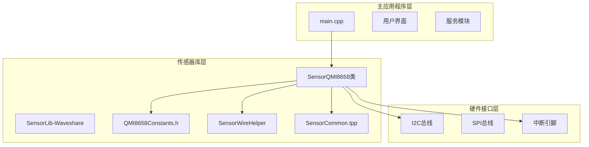

**图表来源**
- [main.cpp](file://src/main.cpp#L615-L722)
- [SensorQMI8658.hpp](file://lib/SensorLib-Waveshare/src/SensorQMI8658.hpp#L43-L191)
- [SensorCommon.tpp](file://lib/SensorLib-Waveshare/src/SensorCommon.tpp#L71-L94)

**章节来源**
- [main.cpp](file://src/main.cpp#L615-L722)
- [SensorQMI8658.hpp](file://lib/SensorLib-Waveshare/src/SensorQMI8658.hpp#L43-L191)

## 核心组件

### QMI8658传感器类

SensorQMI8658是整个IMU数据处理的核心类，提供了完整的传感器配置和数据读取功能：

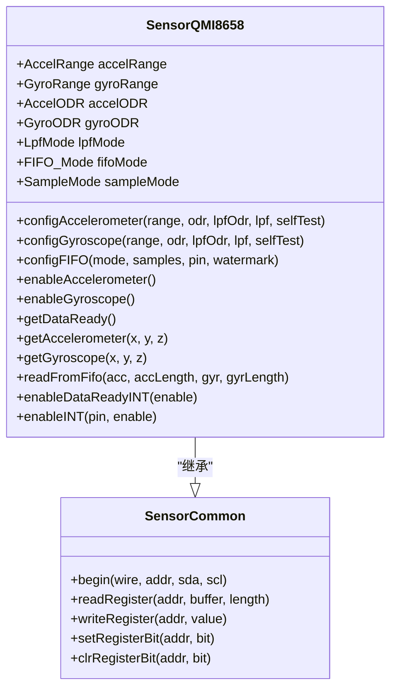

**图表来源**
- [SensorQMI8658.hpp](file://lib/SensorLib-Waveshare/src/SensorQMI8658.hpp#L43-L1501)
- [SensorCommon.tpp](file://lib/SensorLib-Waveshare/src/SensorCommon.tpp#L50-L128)

### 寄存器常量定义

QMI8658传感器使用标准化的寄存器地址和默认值：

| 寄存器类型 | 地址范围 | 功能描述 |
|------------|----------|----------|
| 设备识别 | 0x00-0x01 | WHOAMI和版本信息 |
| 控制寄存器 | 0x02-0x0A | 传感器控制和配置 |
| FIFO寄存器 | 0x13-0x17 | FIFO缓冲区控制 |
| 数据寄存器 | 0x35-0x40 | 加速度计和陀螺仪数据 |
| 状态寄存器 | 0x2D-0x2F | 中断状态和传感器状态 |

**章节来源**
- [QMI8658Constants.h](file://lib/SensorLib-Waveshare/src/REG/QMI8658Constants.h#L32-L134)

## 架构概览

### 初始化流程

系统启动时的完整初始化流程如下：

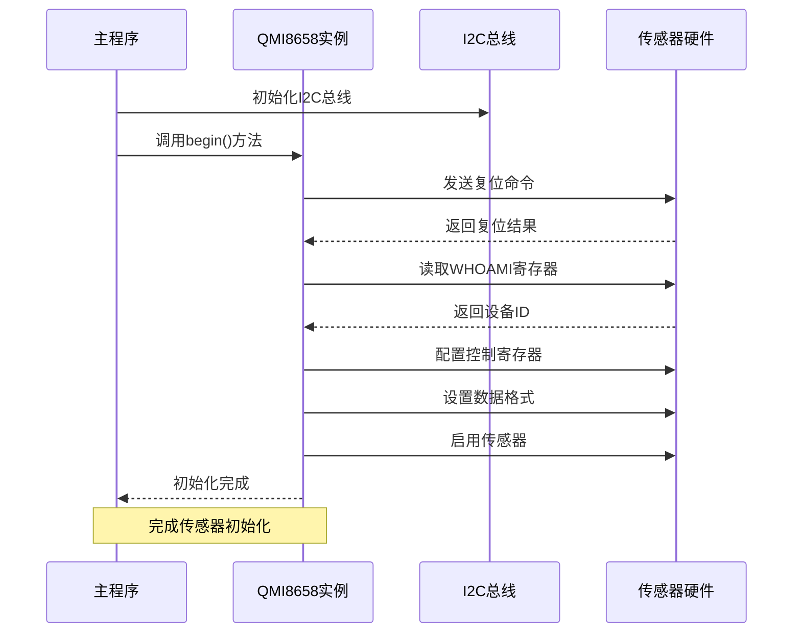

**图表来源**
- [main.cpp](file://src/main.cpp#L661-L668)
- [SensorQMI8658.hpp](file://lib/SensorLib-Waveshare/src/SensorQMI8658.hpp#L1451-L1494)

### 数据采集循环

主循环中的数据采集流程：

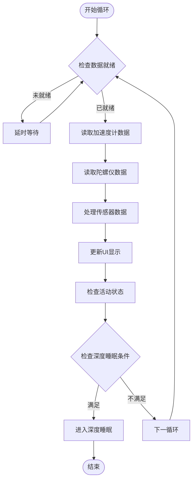

**图表来源**
- [main.cpp](file://src/main.cpp#L805-L812)
- [main.cpp](file://src/main.cpp#L834-L871)

**章节来源**
- [main.cpp](file://src/main.cpp#L661-L668)
- [main.cpp](file://src/main.cpp#L805-L812)

## 详细组件分析

### I2C通信设置

#### 通信初始化

QMI8658通过标准I2C接口进行通信，支持多种数据格式和传输模式：

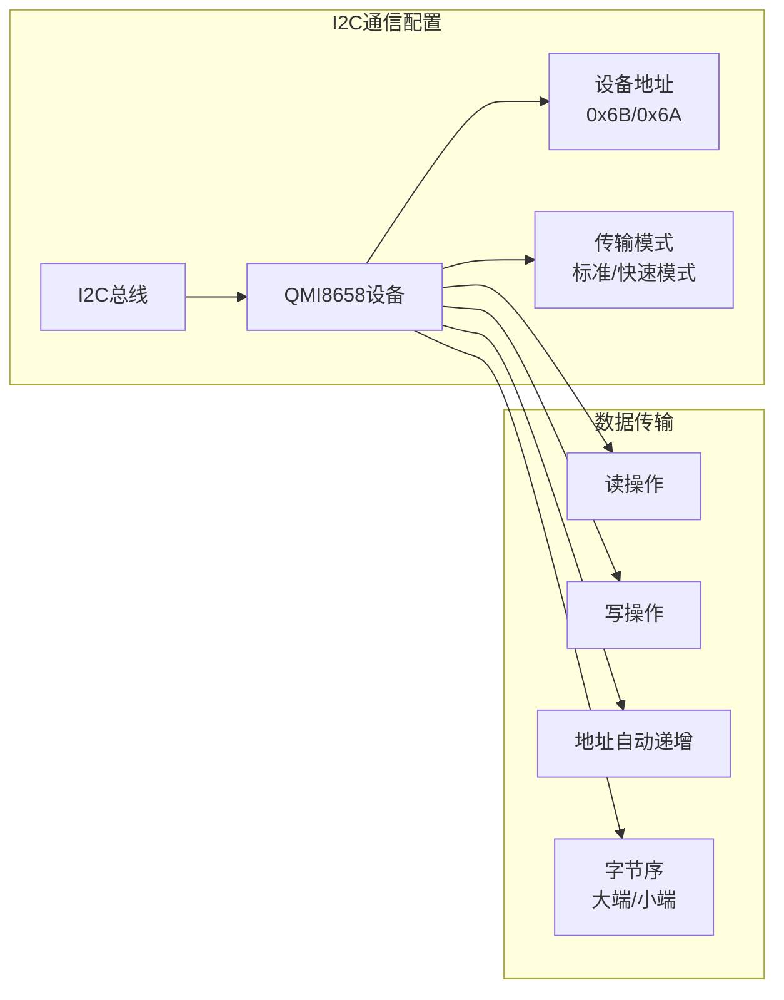

**图表来源**
- [SensorCommon.tpp](file://lib/SensorLib-Waveshare/src/SensorCommon.tpp#L71-L94)
- [QMI8658Constants.h](file://lib/SensorLib-Waveshare/src/REG/QMI8658Constants.h#L32-L34)

#### 寄存器访问方法

传感器提供了统一的寄存器访问接口：

| 方法 | 功能 | 参数 | 返回值 |
|------|------|------|--------|
| `readRegister()` | 读取单个寄存器 | 寄存器地址, 缓冲区指针 | 读取状态 |
| `writeRegister()` | 写入单个寄存器 | 寄存器地址, 值 | 写入状态 |
| `setRegisterBit()` | 设置寄存器位 | 寄存器地址, 位号 | 操作状态 |
| `clrRegisterBit()` | 清除寄存器位 | 寄存器地址, 位号 | 操作状态 |

**章节来源**
- [SensorCommon.tpp](file://lib/SensorLib-Waveshare/src/SensorCommon.tpp#L71-L128)

### 硬件自检与初始化

#### 复位序列

QMI8658的复位流程确保传感器处于已知状态：

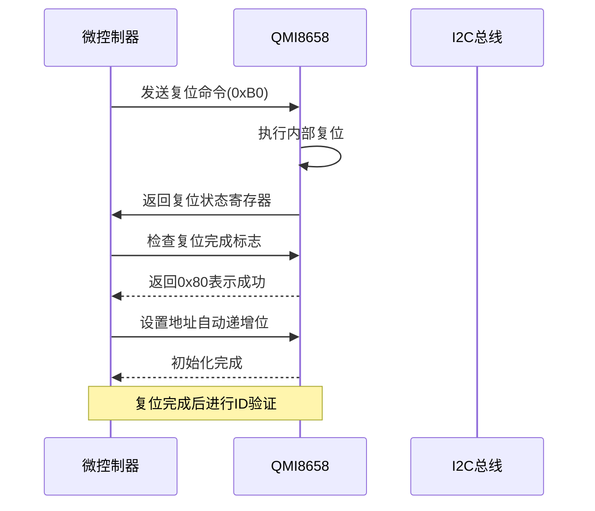

**图表来源**
- [SensorQMI8658.hpp](file://lib/SensorLib-Waveshare/src/SensorQMI8658.hpp#L211-L237)

#### 设备识别

传感器通过WHOAMI寄存器进行身份验证：

| 寄存器 | 默认值 | 用途 |
|--------|--------|------|
| WHOAMI | 0x05 | 设备识别码 |
| REVISION | 0x03 | 固件版本 |
| STATUS | 0x03 | 初始状态 |

**章节来源**
- [QMI8658Constants.h](file://lib/SensorLib-Waveshare/src/REG/QMI8658Constants.h#L37-L40)

### 加速度计配置

#### 量程选择

加速度计支持四种量程配置：

| 量程设置 | 数值范围 | 分辨率 | 适用场景 |
|----------|----------|--------|----------|
| 2G | ±2g | 0.000610352g/LSB | 精密测量, 低噪声 |
| 4G | ±4g | 0.001220703g/LSB | 日常运动检测 |
| 8G | ±8g | 0.002441406g/LSB | 强烈运动, 跌落检测 |
| 16G | ±16g | 0.004882812g/LSB | 极端运动场景 |

#### 输出数据率(ODR)配置

加速度计支持广泛的采样频率：

| ODR设置 | 频率(Hz) | 低功耗模式 | 适用场景 |
|---------|----------|------------|----------|
| 1000Hz | 1000 | 否 | 高精度实时应用 |
| 500Hz | 500 | 否 | 标准运动跟踪 |
| 250Hz | 250 | 否 | 平衡性能与功耗 |
| 125Hz | 125 | 否 | 低功耗应用 |
| 62.5Hz | 62.5 | 否 | 节能模式 |
| 31.25Hz | 31.25 | 否 | 长时间监测 |
| 128Hz | 128 | 是 | 低功耗唤醒 |
| 21Hz | 21 | 是 | 长时间休眠监测 |
| 11Hz | 11 | 是 | 超低功耗待机 |

#### 低通滤波器配置

低通滤波器用于减少高频噪声：

| LPF模式 | 截止频率 | 特点 | 应用场景 |
|---------|----------|------|----------|
| LPF_MODE_0 | 2.66% ODR | 最强滤波 | 高噪声环境 |
| LPF_MODE_1 | 3.63% ODR | 中等滤波 | 一般应用 |
| LPF_MODE_2 | 5.39% ODR | 较弱滤波 | 高频响应需求 |
| LPF_MODE_3 | 13.37% ODR | 最弱滤波 | 实时性要求高 |

**章节来源**
- [SensorQMI8658.hpp](file://lib/SensorLib-Waveshare/src/SensorQMI8658.hpp#L51-L81)
- [SensorQMI8658.hpp](file://lib/SensorLib-Waveshare/src/SensorQMI8658.hpp#L311-L357)

### 陀螺仪配置

#### 量程选择

陀螺仪提供多种灵敏度配置：

| 量程设置 | 角速度范围 | 分辨率 | 适用场景 |
|----------|------------|--------|----------|
| 16DPS | ±16°/s | 0.000488281°/s/LSB | 精密姿态检测 |
| 32DPS | ±32°/s | 0.000976562°/s/LSB | 日常旋转测量 |
| 64DPS | ±64°/s | 0.001953125°/s/LSB | 中等旋转应用 |
| 128DPS | ±128°/s | 0.003906250°/s/LSB | 快速旋转检测 |
| 256DPS | ±256°/s | 0.007812500°/s/LSB | 强烈旋转运动 |
| 512DPS | ±512°/s | 0.015625000°/s/LSB | 极端旋转场景 |
| 1024DPS | ±1024°/s | 0.031250000°/s/LSB | 超高速旋转 |

#### 输出数据率配置

陀螺仪支持从28Hz到7174.4Hz的宽频带采样：

| ODR设置 | 频率(Hz) | 低功耗模式 | 应用场景 |
|---------|----------|------------|----------|
| 7174.4Hz | 7174.4 | 否 | 高精度实时控制 |
| 3587.2Hz | 3587.2 | 否 | 高速运动分析 |
| 1793.6Hz | 1793.6 | 否 | 中等速度应用 |
| 896.8Hz | 896.8 | 否 | 标准运动跟踪 |
| 448.4Hz | 448.4 | 否 | 平衡性能功耗 |
| 224.2Hz | 224.2 | 否 | 低功耗模式 |
| 112.1Hz | 112.1 | 否 | 节能应用 |
| 56.05Hz | 56.05 | 否 | 长时间监测 |
| 28.025Hz | 28.025 | 否 | 超低功耗 |

**章节来源**
- [SensorQMI8658.hpp](file://lib/SensorLib-Waveshare/src/SensorQMI8658.hpp#L58-L93)
- [SensorQMI8658.hpp](file://lib/SensorLib-Waveshare/src/SensorQMI8658.hpp#L369-L420)

### FIFO缓冲区工作机制

#### FIFO模式配置

QMI8658支持三种FIFO工作模式：

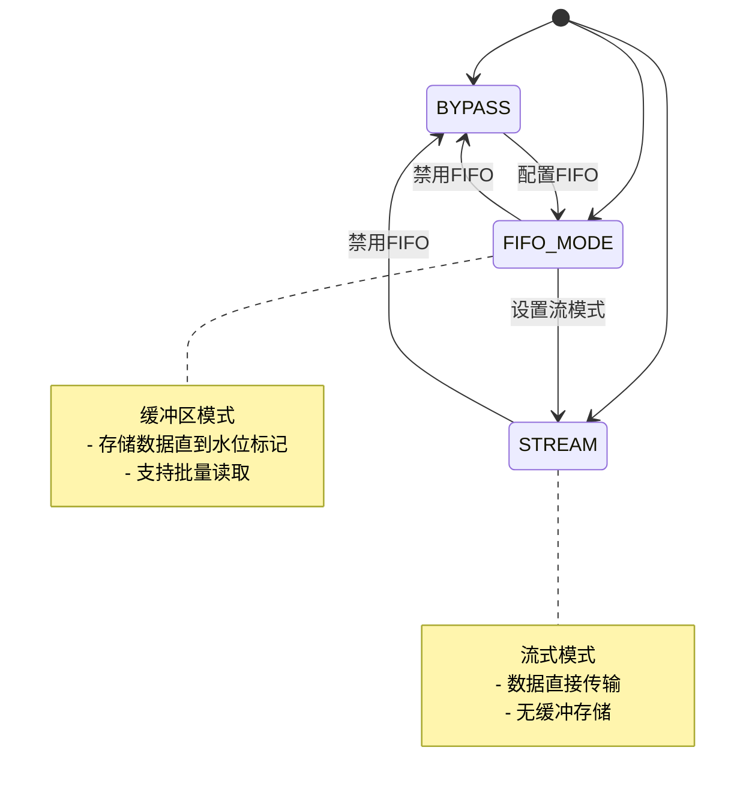

**图表来源**
- [SensorQMI8658.hpp](file://lib/SensorLib-Waveshare/src/SensorQMI8658.hpp#L124-L129)

#### FIFO样本容量

FIFO支持不同样本容量配置：

| 样本容量 | 字节数 | 适用场景 |
|----------|--------|----------|
| 16样本 | 192字节 | 小容量缓冲 |
| 32样本 | 384字节 | 中等容量缓冲 |
| 64样本 | 768字节 | 大容量缓冲 |
| 128样本 | 1536字节 | 超大容量缓冲 |

#### 水位标记设置

水位标记用于控制FIFO触发时机：

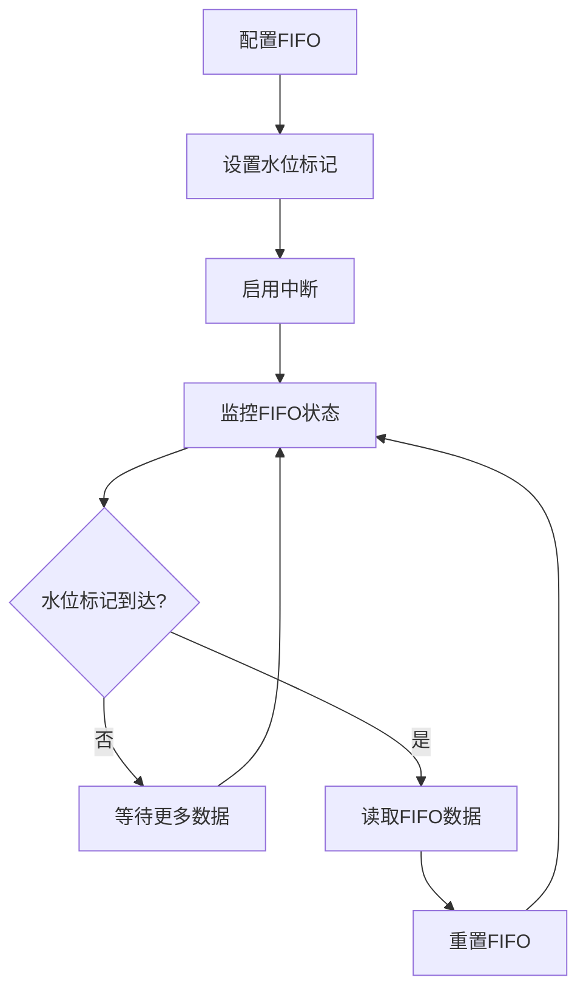

**图表来源**
- [SensorQMI8658.hpp](file://lib/SensorLib-Waveshare/src/SensorQMI8658.hpp#L431-L473)

**章节来源**
- [SensorQMI8658.hpp](file://lib/SensorLib-Waveshare/src/SensorQMI8658.hpp#L116-L129)
- [SensorQMI8658.hpp](file://lib/SensorLib-Waveshare/src/SensorQMI8658.hpp#L431-L473)

### 原始数据读取与转换

#### 数据格式解析

QMI8658输出16位有符号整数数据，需要进行适当的缩放转换：

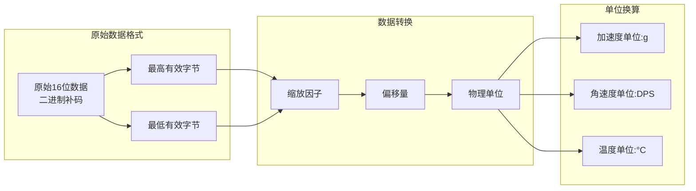

**图表来源**
- [SensorQMI8658.hpp](file://lib/SensorLib-Waveshare/src/SensorQMI8658.hpp#L505-L517)
- [SensorQMI8658.hpp](file://lib/SensorLib-Waveshare/src/SensorQMI8658.hpp#L641-L686)

#### 缩放因子计算

根据量程设置计算相应的缩放因子：

| 量程设置 | 缩放因子 | 计算公式 |
|----------|----------|----------|
| 2G | 2.0/32768.0 | ±2g/32768 |
| 4G | 4.0/32768.0 | ±4g/32768 |
| 8G | 8.0/32768.0 | ±8g/32768 |
| 16G | 16.0/32768.0 | ±16g/32768 |
| 16DPS | 16.0/32768.0 | ±16°/s/32768 |
| 32DPS | 32.0/32768.0 | ±32°/s/32768 |
| 64DPS | 64.0/32768.0 | ±64°/s/32768 |
| 128DPS | 128.0/32768.0 | ±128°/s/32768 |
| 256DPS | 256.0/32768.0 | ±256°/s/32768 |
| 512DPS | 512.0/32768.0 | ±512°/s/32768 |
| 1024DPS | 1024.0/32768.0 | ±1024°/s/32768 |

**章节来源**
- [SensorQMI8658.hpp](file://lib/SensorLib-Waveshare/src/SensorQMI8658.hpp#L330-L395)
- [SensorQMI8658.hpp](file://lib/SensorLib-Waveshare/src/SensorQMI8658.hpp#L505-L517)

### 数据就绪中断机制

#### 中断配置

QMI8658支持多种中断源配置：

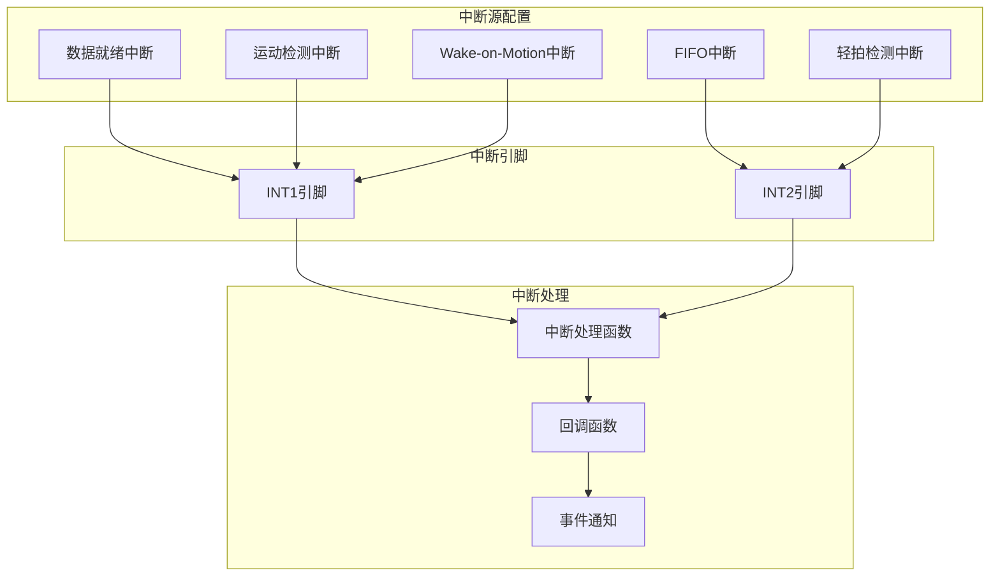

**图表来源**
- [SensorQMI8658.hpp](file://lib/SensorLib-Waveshare/src/SensorQMI8658.hpp#L275-L299)
- [SensorQMI8658.hpp](file://lib/SensorLib-Waveshare/src/SensorQMI8658.hpp#L1348-L1391)

#### 同步采样模式

同步采样模式确保加速度计和陀螺仪数据的时间一致性：

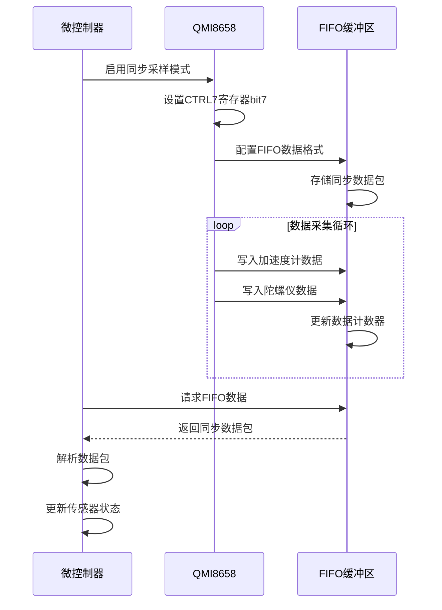

**图表来源**
- [SensorQMI8658.hpp](file://lib/SensorLib-Waveshare/src/SensorQMI8658.hpp#L709-L719)
- [SensorQMI8658.hpp](file://lib/SensorLib-Waveshare/src/SensorQMI8658.hpp#L688-L707)

**章节来源**
- [SensorQMI8658.hpp](file://lib/SensorLib-Waveshare/src/SensorQMI8658.hpp#L275-L299)
- [SensorQMI8658.hpp](file://lib/SensorLib-Waveshare/src/SensorQMI8658.hpp#L709-L719)

### 错误处理与超时管理

#### 通信错误处理

传感器库实现了完善的错误处理机制：

| 错误类型 | 错误码 | 处理策略 |
|----------|--------|----------|
| 设备未响应 | DEV_WIRE_ERR | 重试通信, 检查连接 |
| 超时错误 | DEV_WIRE_TIMEOUT | 增加重试次数, 恢复通信 |
| 寄存器访问失败 | DEV_WIRE_ERR | 验证地址和数据格式 |
| 内存不足 | NULL指针 | 释放内存, 重新分配 |

#### 超时管理策略

系统采用多级超时保护机制：

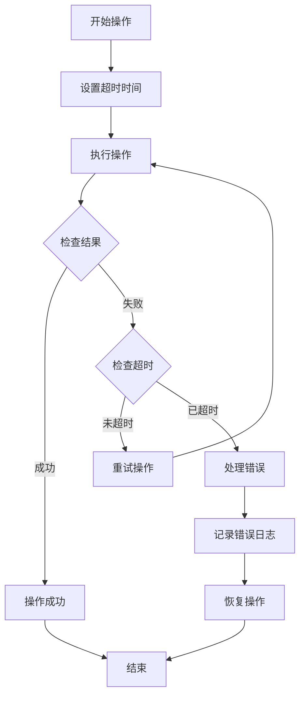

**图表来源**
- [SensorQMI8658.hpp](file://lib/SensorLib-Waveshare/src/SensorQMI8658.hpp#L1415-L1447)

#### 数据完整性验证

传感器提供了多种数据完整性检查方法：

| 验证方式 | 实现方法 | 用途 |
|----------|----------|------|
| CRC校验 | 寄存器内建CRC | 数据传输完整性 |
| 连续性检查 | 时间戳比较 | 数据连续性验证 |
| 范围检查 | 数值范围验证 | 数据合理性检查 |
| 自检测试 | 内部自检功能 | 传感器功能验证 |

**章节来源**
- [SensorQMI8658.hpp](file://lib/SensorLib-Waveshare/src/SensorQMI8658.hpp#L1415-L1447)

## 依赖关系分析

### 组件间依赖关系

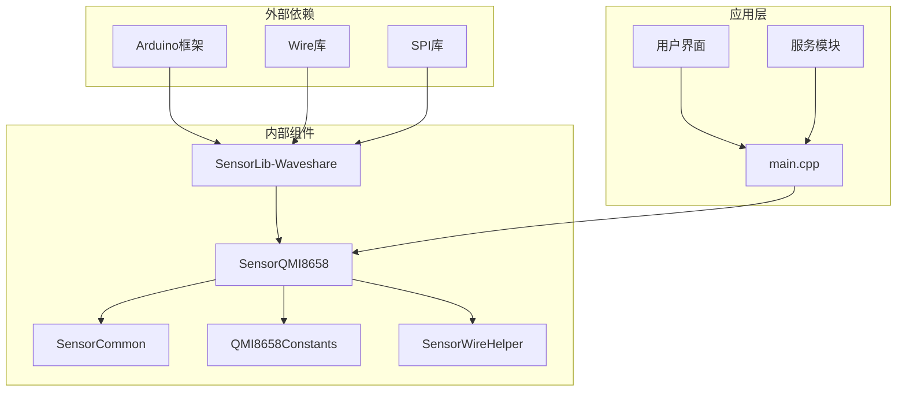

**图表来源**
- [SensorQMI8658.hpp](file://lib/SensorLib-Waveshare/src/SensorQMI8658.hpp#L31-L32)
- [main.cpp](file://src/main.cpp#L1-L27)

### 关键依赖路径

系统的关键依赖关系如下：

1. **主程序依赖**：main.cpp直接依赖SensorQMI8658类进行传感器初始化和数据读取
2. **库依赖**：SensorQMI8658依赖SensorCommon模板类提供通用的I2C通信功能
3. **常量依赖**：QMI8658Constants.h提供所有寄存器地址和默认值定义
4. **工具类依赖**：SensorWireHelper提供调试和诊断功能

**章节来源**
- [SensorQMI8658.hpp](file://lib/SensorLib-Waveshare/src/SensorQMI8658.hpp#L31-L32)
- [main.cpp](file://src/main.cpp#L12-L34)

## 性能考虑

### 采样率优化

根据应用场景选择合适的采样率可以显著影响功耗和性能：

| 应用场景 | 推荐采样率 | 功耗等级 | 延迟特性 |
|----------|------------|----------|----------|
| 实时运动控制 | 1000Hz | 高 | 低延迟 |
| 步数计数 | 50Hz | 中 | 中等延迟 |
| 睡眠监测 | 10Hz | 低 | 高延迟 |
| 跌倒检测 | 200Hz | 中高 | 低延迟 |

### 内存使用优化

FIFO缓冲区的内存使用需要根据应用需求进行权衡：

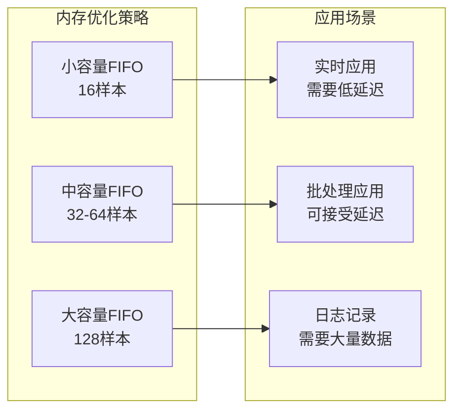

### 功耗管理

QMI8658提供了多种功耗管理模式：

| 模式 | 功耗特点 | 适用场景 |
|------|----------|----------|
| 全功率模式 | 高性能, 高功耗 | 实时应用 |
| 低功耗模式 | 中等性能, 低功耗 | 电池供电设备 |
| 睡眠模式 | 极低功耗 | 长时间待机 |
| 部分激活 | 可调节功耗 | 动态功耗管理 |

## 故障排除指南

### 常见问题诊断

#### 传感器无法识别

**症状**：WHOAMI读取返回错误值
**可能原因**：
1. I2C连接问题
2. 设备地址配置错误
3. 电源供应异常
4. 复位未完成

**解决步骤**：
1. 检查I2C引脚连接
2. 验证设备地址设置
3. 测量电源电压
4. 重新执行复位序列

#### 数据读取失败

**症状**：传感器数据读取返回错误
**可能原因**：
1. I2C总线冲突
2. 时钟频率过高
3. 数据格式不匹配
4. FIFO溢出

**解决步骤**：
1. 降低I2C时钟频率
2. 检查数据格式配置
3. 清理FIFO缓冲区
4. 重新初始化传感器

#### 中断不工作

**症状**：中断引脚无响应
**可能原因**：
1. 中断配置错误
2. 引脚映射问题
3. 中断优先级设置
4. 外部电路问题

**解决步骤**：
1. 验证中断配置寄存器
2. 检查引脚连接
3. 调整中断优先级
4. 测试外部电路

### 调试工具使用

#### 寄存器转储功能

SensorWireHelper提供了完整的寄存器调试功能：

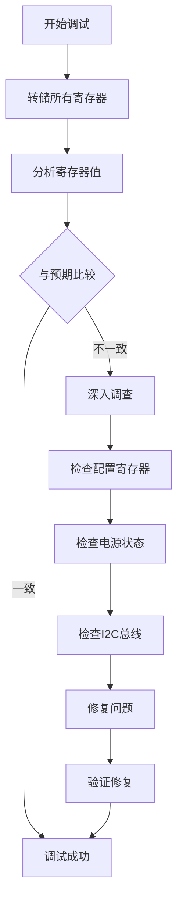

**图表来源**
- [SensorWireHelper.cpp](file://lib/SensorLib-Waveshare/src/SensorWireHelper.cpp#L36-L56)

**章节来源**
- [SensorWireHelper.h](file://lib/SensorLib-Waveshare/src/SensorWireHelper.h#L35-L41)
- [SensorWireHelper.cpp](file://lib/SensorLib-Waveshare/src/SensorWireHelper.cpp#L36-L56)

## 结论

SmartBracelet项目中的IMU传感器数据处理系统展现了现代嵌入式传感器应用的最佳实践。通过QMI8658传感器的完整配置和优化的数据处理流程，系统能够：

1. **可靠的数据采集**：通过完善的I2C通信和硬件自检确保数据准确性
2. **灵活的配置选项**：支持广泛的量程、采样率和滤波器配置
3. **高效的缓冲管理**：利用FIFO缓冲区实现批量数据处理
4. **精确的中断控制**：通过数据就绪中断实现低延迟响应
5. **强大的错误处理**：提供多层次的错误检测和恢复机制

该系统为智能手环应用提供了坚实的基础，支持从日常运动监测到高级数据分析的各种应用场景。通过合理的性能优化和功耗管理，系统能够在保证数据质量的同时延长设备续航时间。