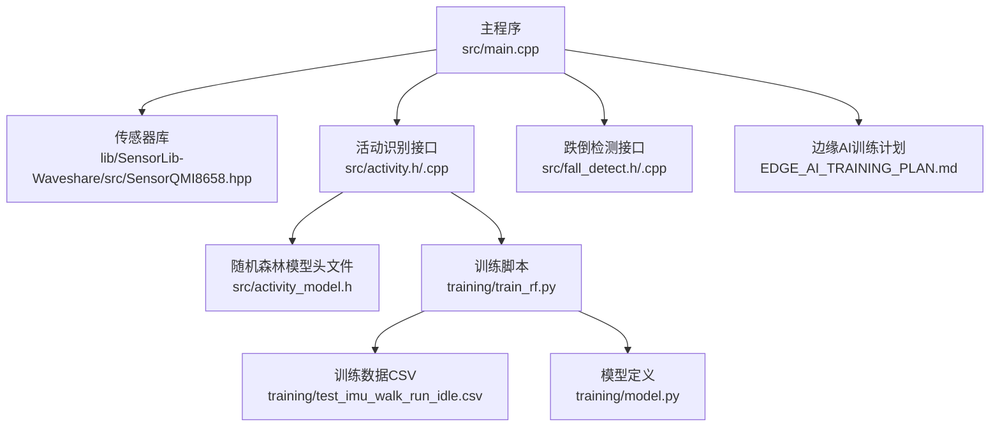
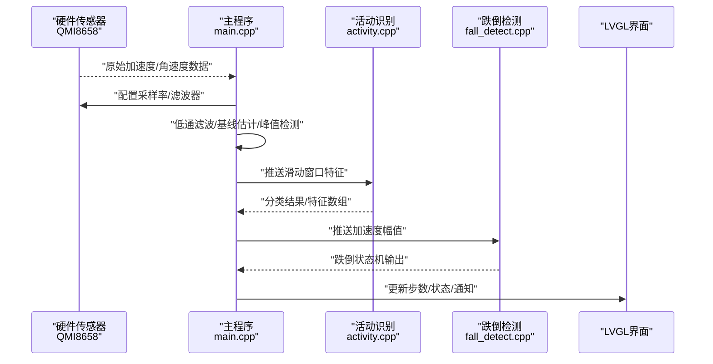
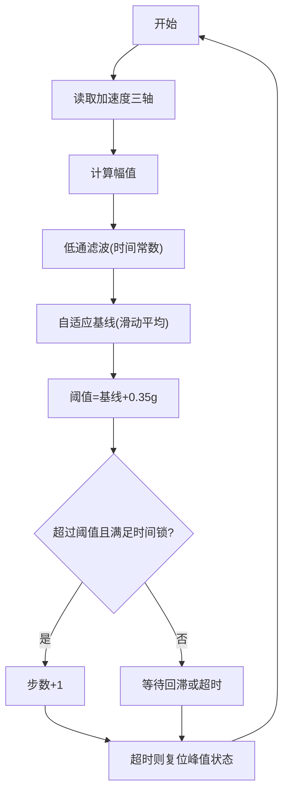
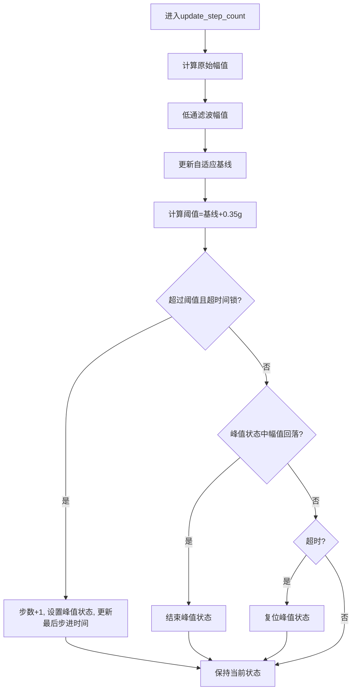
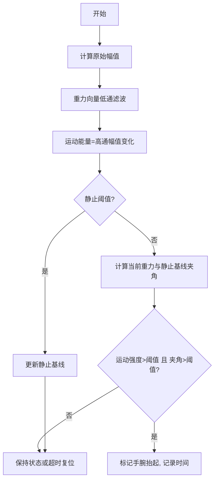
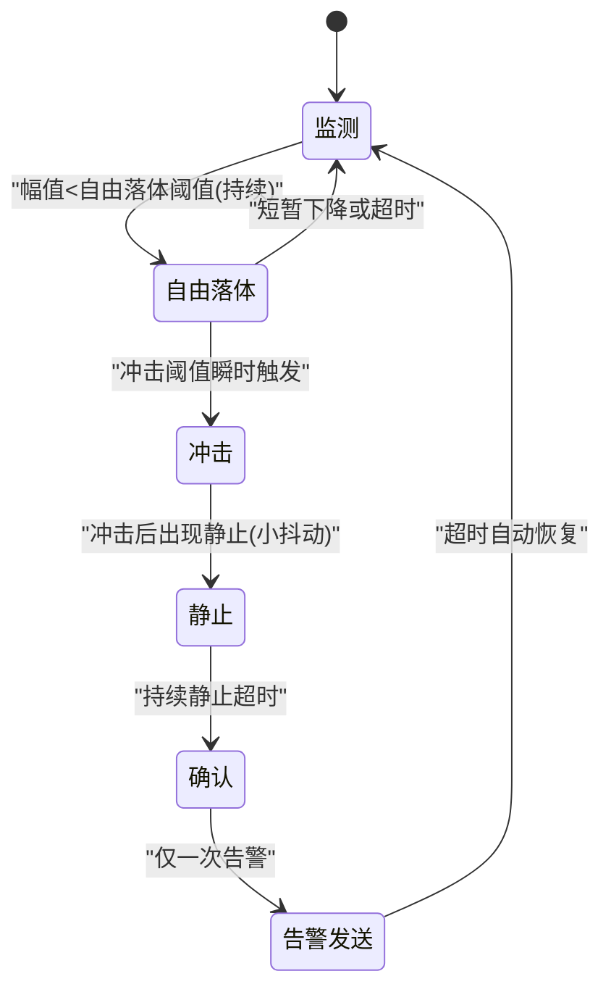
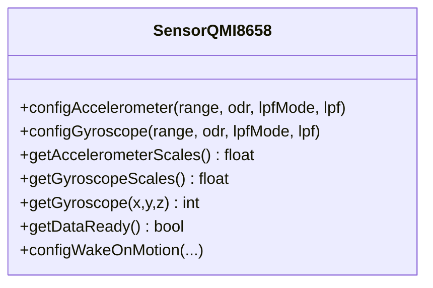
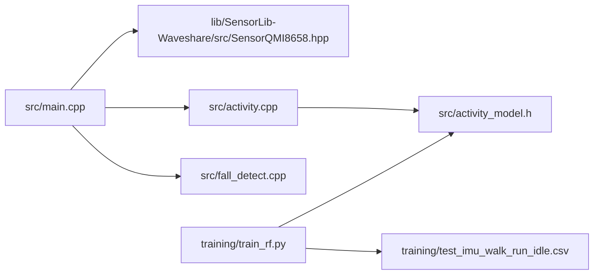

# 传感器数据融合

<cite>
**本文引用的文件**
- [src/main.cpp](file://src/main.cpp)
- [src/activity.h](file://src/activity.h)
- [src/activity.cpp](file://src/activity.cpp)
- [src/activity_model.h](file://src/activity_model.h)
- [src/fall_detect.h](file://src/fall_detect.h)
- [src/fall_detect.cpp](file://src/fall_detect.cpp)
- [lib/SensorLib-Waveshare/src/SensorQMI8658.hpp](file://lib/SensorLib-Waveshare/src/SensorQMI8658.hpp)
- [training/train_rf.py](file://training/train_rf.py)
- [training/model.py](file://training/model.py)
- [training/test_imu_walk_run_idle.csv](file://training/test_imu_walk_run_idle.csv)
- [EDGE_AI_TRAINING_PLAN.md](file://EDGE_AI_TRAINING_PLAN.md)
</cite>

## 目录
1. [引言](#引言)
2. [项目结构](#项目结构)
3. [核心组件](#核心组件)
4. [架构总览](#架构总览)
5. [详细组件分析](#详细组件分析)
6. [依赖关系分析](#依赖关系分析)
7. [性能考虑](#性能考虑)
8. [故障排查指南](#故障排查指南)
9. [结论](#结论)
10. [附录](#附录)

## 引言
本技术文档围绕智能手环中的传感器数据融合与算法展开，重点覆盖以下内容：
- 多传感器数据融合基础与实现：在当前代码中以IMU（加速度计与陀螺仪）为主，结合传感器库提供的原始数据读取与配置能力，为后续融合奠定基础。
- IMU数据预处理：低通滤波、自适应基线估计、幅度阈值与峰值检测等，用于步数统计与姿态稳定化。
- 姿态角计算：通过重力向量与运动能量估计，实现手腕抬举检测与姿态变化感知。
- 步数统计算法：低通滤波、自适应基线、时间约束与峰值回滞，形成稳健的步进检测。
- 跌倒检测算法：基于自由落体、冲击与静止的时序状态机设计，结合阈值与超时策略，降低误报。
- 数据质量评估与融合精度验证：通过滑动窗口特征提取与随机森林模型进行活动识别，并提供训练与评估流程。
- 性能优化要点：采样率与滤波参数权衡、内存与功耗控制、UI刷新与后台任务调度。

## 项目结构
该项目采用模块化组织，核心运行逻辑集中在主程序，传感器驱动来自第三方库，AI模型训练与导出在独立目录中完成。下图展示主要模块及其交互关系：



图表来源
- [src/main.cpp](file://src/main.cpp#L615-L722)
- [lib/SensorLib-Waveshare/src/SensorQMI8658.hpp](file://lib/SensorLib-Waveshare/src/SensorQMI8658.hpp#L661-L668)
- [src/activity.h](file://src/activity.h#L1-L13)
- [src/activity.cpp](file://src/activity.cpp#L1-L130)
- [src/activity_model.h](file://src/activity_model.h#L1-L74)
- [src/fall_detect.h](file://src/fall_detect.h#L1-L32)
- [src/fall_detect.cpp](file://src/fall_detect.cpp#L1-L147)
- [training/train_rf.py](file://training/train_rf.py#L1-L160)
- [training/test_imu_walk_run_idle.csv](file://training/test_imu_walk_run_idle.csv#L3003-L3317)
- [training/model.py](file://training/model.py#L1-L69)
- [EDGE_AI_TRAINING_PLAN.md](file://EDGE_AI_TRAINING_PLAN.md#L79-L131)

章节来源
- [src/main.cpp](file://src/main.cpp#L615-L722)
- [lib/SensorLib-Waveshare/src/SensorQMI8658.hpp](file://lib/SensorLib-Waveshare/src/SensorQMI8658.hpp#L661-L668)

## 核心组件
- 主循环与页面管理：负责UI、传感器初始化、BLE/WiFi服务、OTA更新与系统状态维护。
- 传感器驱动：封装QMI8658的加速度计/陀螺仪配置、数据读取与中断功能，提供原始数据与缩放系数。
- 活动识别：滑动窗口特征提取（均值与标准差），配合随机森林模型进行分类预测。
- 跌倒检测：基于自由落体、冲击与静止的有限状态机，结合低通滤波与时间阈值。
- 步数统计：低通滤波幅度、自适应基线、幅度阈值与时间锁定期，避免误触发。
- 姿态与手腕抬举：重力向量低通滤波与运动能量估计，结合角度变化判断手腕抬举。

章节来源
- [src/main.cpp](file://src/main.cpp#L516-L613)
- [src/activity.h](file://src/activity.h#L1-L13)
- [src/fall_detect.h](file://src/fall_detect.h#L1-L32)
- [lib/SensorLib-Waveshare/src/SensorQMI8658.hpp](file://lib/SensorLib-Waveshare/src/SensorQMI8658.hpp#L369-L394)

## 架构总览
下图展示从传感器到算法再到UI的整体数据流与控制流：



图表来源
- [src/main.cpp](file://src/main.cpp#L516-L613)
- [src/activity.cpp](file://src/activity.cpp#L30-L76)
- [src/fall_detect.cpp](file://src/fall_detect.cpp#L54-L146)

## 详细组件分析

### 组件A：IMU数据预处理与融合基础
- 低通滤波：对加速度幅值进行指数滑窗滤波，抑制高频噪声；用于步数统计与跌倒检测的幅值平滑。
- 自适应基线：对滤波幅值进行滑动平均，动态估计静止基线，提升步数检测鲁棒性。
- 幅度阈值与回滞：通过“高于基线+0.35g”的阈值触发步进，配合回滞与时间锁定期，避免抖动与误触发。
- 时间约束：步进间隔最小锁定期与超时复位，防止持续误判。



图表来源
- [src/main.cpp](file://src/main.cpp#L516-L547)

章节来源
- [src/main.cpp](file://src/main.cpp#L516-L547)

### 组件B：步数统计算法
- 窗口大小与步长：滑动窗口长度与步长决定实时性与稳定性之间的平衡。
- 阈值策略：基线+固定阈值，结合回滞与时间锁定期，减少误触发。
- 超时复位：长时间无步进则复位峰值检测状态，避免累积误差。



图表来源
- [src/main.cpp](file://src/main.cpp#L516-L547)

章节来源
- [src/main.cpp](file://src/main.cpp#L516-L547)

### 组件C：姿态角与手腕抬举检测
- 重力向量估计：对加速度进行低通滤波，得到重力分量；在静止状态下收敛为静止基线。
- 运动能量估计：高通能量（幅值变化）衡量运动强度。
- 角度变化：利用点积计算当前重力与静止基线夹角，结合运动强度判断手腕抬举。



图表来源
- [src/main.cpp](file://src/main.cpp#L559-L613)

章节来源
- [src/main.cpp](file://src/main.cpp#L559-L613)

### 组件D：活动识别（随机森林）
- 特征提取：滑动窗口内对6轴数据计算均值与标准差，共12维特征。
- 模型训练：使用随机森林分类器，导出C结构树用于嵌入式推理。
- 推理过程：多棵决策树投票，选择得票最多的类别作为最终输出。

```mermaid
classDiagram
class FeatureExtractor {
+窗口大小 : 50
+步长 : 25
+提取均值与标准差
+返回12维特征向量
}
class RandomForestModel {
+节点结构 : {feat_idx, threshold, left, right, leaf_class}
+预测函数 : rf_predict(features)
+多棵树投票
}
class ActivityModule {
+push_data(ax,ay,az,gx,gy,gz)
+predict() : 类别
+get_features() : 12维特征
}
ActivityModule --> FeatureExtractor : "使用"
ActivityModule --> RandomForestModel : "调用"
```

图表来源
- [src/activity.cpp](file://src/activity.cpp#L42-L76)
- [src/activity_model.h](file://src/activity_model.h#L58-L74)
- [training/train_rf.py](file://training/train_rf.py#L39-L51)

章节来源
- [src/activity.cpp](file://src/activity.cpp#L1-L130)
- [src/activity_model.h](file://src/activity_model.h#L1-L74)
- [training/train_rf.py](file://training/train_rf.py#L1-L160)

### 组件E：跌倒检测（有限状态机）
- 状态机：监测→自由落体→冲击→静止→确认→告警发送。
- 参数：自由落体阈值、冲击阈值、静止阈值、各阶段时间窗。
- 抑制策略：超时未出现预期状态则回退；确认后自动超时恢复。



图表来源
- [src/fall_detect.cpp](file://src/fall_detect.cpp#L54-L146)

章节来源
- [src/fall_detect.h](file://src/fall_detect.h#L1-L32)
- [src/fall_detect.cpp](file://src/fall_detect.cpp#L1-L147)

### 组件F：传感器驱动与数据读取
- 配置：加速度计/陀螺仪量程、输出速率、低通滤波模式与使能。
- 数据读取：原始16位寄存器值经比例因子转换为物理单位。
- 中断与唤醒：支持唤醒事件配置与中断引脚设置。



图表来源
- [lib/SensorLib-Waveshare/src/SensorQMI8658.hpp](file://lib/SensorLib-Waveshare/src/SensorQMI8658.hpp#L369-L394)
- [lib/SensorLib-Waveshare/src/SensorQMI8658.hpp](file://lib/SensorLib-Waveshare/src/SensorQMI8658.hpp#L653-L661)
- [lib/SensorLib-Waveshare/src/SensorQMI8658.hpp](file://lib/SensorLib-Waveshare/src/SensorQMI8658.hpp#L1142-L1180)

章节来源
- [lib/SensorLib-Waveshare/src/SensorQMI8658.hpp](file://lib/SensorLib-Waveshare/src/SensorQMI8658.hpp#L369-L394)

## 依赖关系分析
- 主程序依赖传感器库进行底层数据读取与配置；依赖活动识别模块进行行为分类；依赖跌倒检测模块进行健康安全监控。
- 活动识别模块依赖随机森林模型头文件与训练脚本生成的树结构。
- 训练脚本依赖CSV数据集与特征提取逻辑，输出C代码供固件集成。



图表来源
- [src/main.cpp](file://src/main.cpp#L615-L722)
- [src/activity.cpp](file://src/activity.cpp#L1-L130)
- [src/fall_detect.cpp](file://src/fall_detect.cpp#L1-L147)
- [src/activity_model.h](file://src/activity_model.h#L1-L74)
- [training/train_rf.py](file://training/train_rf.py#L1-L160)
- [training/test_imu_walk_run_idle.csv](file://training/test_imu_walk_run_idle.csv#L3003-L3317)

章节来源
- [src/main.cpp](file://src/main.cpp#L615-L722)
- [src/activity.cpp](file://src/activity.cpp#L1-L130)
- [src/fall_detect.cpp](file://src/fall_detect.cpp#L1-L147)
- [src/activity_model.h](file://src/activity_model.h#L1-L74)
- [training/train_rf.py](file://training/train_rf.py#L1-L160)

## 性能考虑
- 采样率与滤波：根据应用需求在加速度计/陀螺仪ODR之间权衡；低通滤波参数影响噪声抑制与响应速度。
- 内存占用：滑动窗口缓冲区大小与特征数组需与RAM容量匹配；随机森林树规模影响Flash与RAM占用。
- 功耗控制：传感器在非活动时段可降低采样率或启用低功耗模式；屏幕背光与WiFi周期性关闭。
- 实时性：UI刷新、BLE/WiFi与OTA任务与传感器读取、滤波与算法应合理调度，避免阻塞。

## 故障排查指南
- 传感器无数据：检查I2C引脚连接、设备地址与初始化返回值；确认传感器已使能。
- 步数不准确：调整基线更新权重、阈值与时间锁定期；确保穿戴贴合与运动幅度足够。
- 跌倒误报：提高自由落体/冲击/静止阈值；延长各阶段时间窗；确认环境振动干扰。
- 活动识别不准：增加训练样本、优化特征窗口与步长；检查标签一致性与模型过拟合。

章节来源
- [src/main.cpp](file://src/main.cpp#L661-L668)
- [src/fall_detect.cpp](file://src/fall_detect.cpp#L8-L16)

## 结论
本项目在资源受限的嵌入式平台上实现了较为完整的传感器数据融合与算法链路：以IMU为基础，结合低通滤波、自适应基线与峰值检测实现稳健的步数统计；通过有限状态机实现跌倒检测；借助滑动窗口特征与随机森林模型实现活动识别。整体设计注重实时性与功耗控制，同时为后续融合（如引入磁力计、温度补偿与更高阶的姿态解算）预留了扩展空间。

## 附录
- 训练与部署流程参考：训练脚本、模型定义与数据集路径见相应文件。
- 边缘AI训练计划：包含采集脚本、窗口参数与任务类型说明。

章节来源
- [training/train_rf.py](file://training/train_rf.py#L1-L160)
- [training/model.py](file://training/model.py#L1-L69)
- [training/test_imu_walk_run_idle.csv](file://training/test_imu_walk_run_idle.csv#L3003-L3317)
- [EDGE_AI_TRAINING_PLAN.md](file://EDGE_AI_TRAINING_PLAN.md#L79-L131)