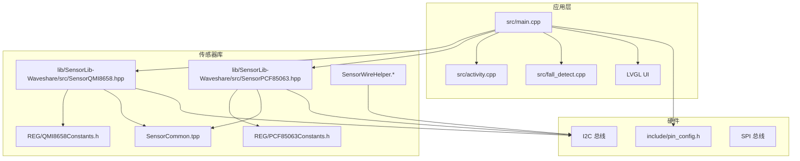
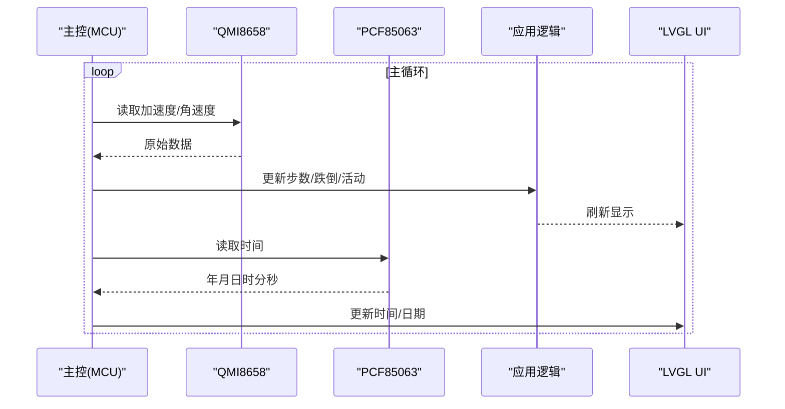
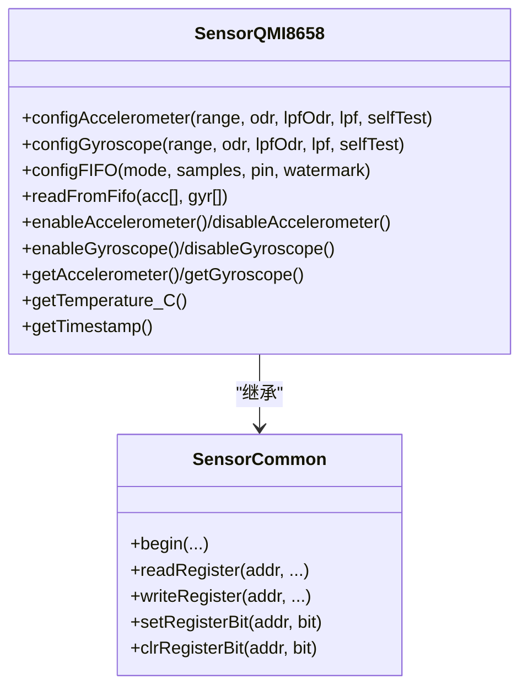
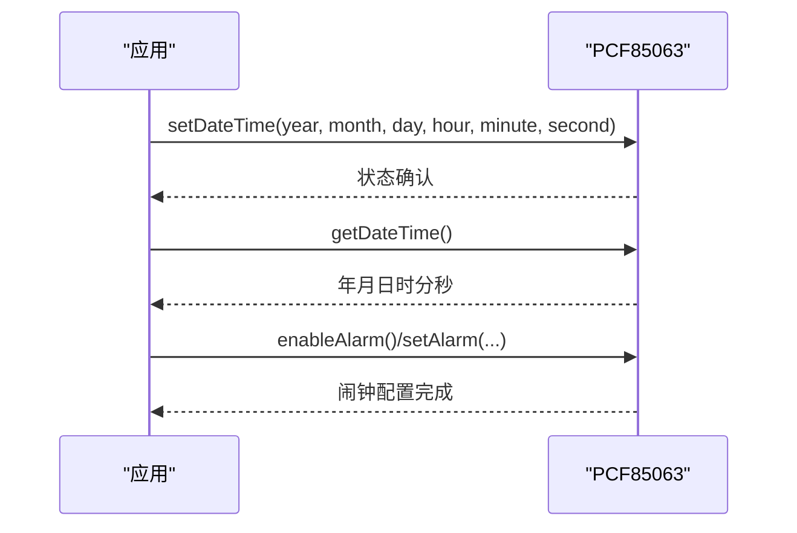
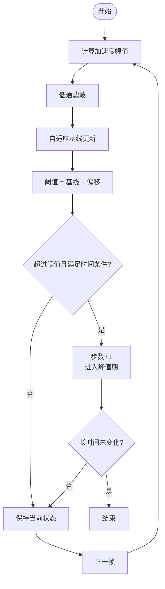
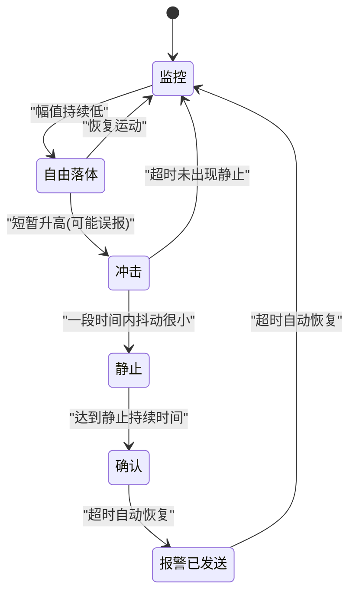
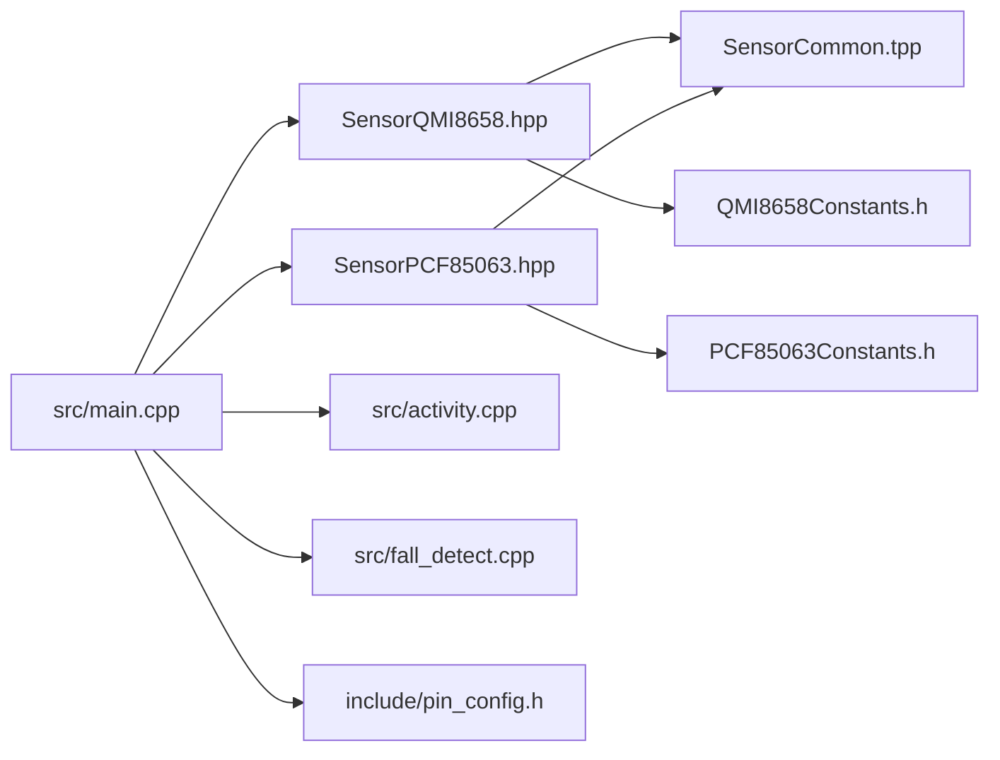

# 传感器系统

<cite>
**本文引用的文件**
- [src/main.cpp](file://src/main.cpp)
- [src/activity.cpp](file://src/activity.cpp)
- [src/fall_detect.cpp](file://src/fall_detect.cpp)
- [src/activity.h](file://src/activity.h)
- [src/fall_detect.h](file://src/fall_detect.h)
- [lib/SensorLib-Waveshare/src/SensorQMI8658.hpp](file://lib/SensorLib-Waveshare/src/SensorQMI8658.hpp)
- [lib/SensorLib-Waveshare/src/SensorPCF85063.hpp](file://lib/SensorLib-Waveshare/src/SensorPCF85063.hpp)
- [lib/SensorLib-Waveshare/src/REG/QMI8658Constants.h](file://lib/SensorLib-Waveshare/src/REG/QMI8658Constants.h)
- [lib/SensorLib-Waveshare/src/REG/PCF85063Constants.h](file://lib/SensorLib-Waveshare/src/REG/PCF85063Constants.h)
- [lib/SensorLib-Waveshare/src/SensorCommon.tpp](file://lib/SensorLib-Waveshare/src/SensorCommon.tpp)
- [lib/SensorLib-Waveshare/src/SensorWireHelper.h](file://lib/SensorLib-Waveshare/src/SensorWireHelper.h)
- [lib/SensorLib-Waveshare/src/SensorWireHelper.cpp](file://lib/SensorLib-Waveshare/src/SensorWireHelper.cpp)
- [include/pin_config.h](file://include/pin_config.h)
</cite>

## 目录
1. [引言](#引言)
2. [项目结构](#项目结构)
3. [核心组件](#核心组件)
4. [架构总览](#架构总览)
5. [详细组件分析](#详细组件分析)
6. [依赖关系分析](#依赖关系分析)
7. [性能考虑](#性能考虑)
8. [故障排查指南](#故障排查指南)
9. [结论](#结论)
10. [附录](#附录)

## 引言
本文件为 SmartBracelet 智能手环传感器系统的综合技术文档，聚焦以下目标：
- 解释 IMU 传感器 QMI8658 的数据采集与处理流程：加速度计与陀螺仪的配置、滤波算法、数据校准与标度因子。
- 说明实时钟 PCF85063 的时序管理与时间同步机制。
- 阐述传感器数据融合思路与步数统计、跌倒检测算法的关键实现要点。
- 提供传感器校准方法、数据质量评估与故障诊断建议。

## 项目结构
该工程采用模块化组织方式，传感器驱动位于 SensorLib-Waveshare 库中，应用层在 src 目录下，UI 使用 LVGL，硬件引脚定义在 include/pin_config.h 中。主程序负责初始化传感器、更新显示与业务逻辑。

图表来源
- [src/main.cpp](file://src/main.cpp#L1-L120)
- [lib/SensorLib-Waveshare/src/SensorQMI8658.hpp](file://lib/SensorLib-Waveshare/src/SensorQMI8658.hpp#L1-L120)
- [lib/SensorLib-Waveshare/src/SensorPCF85063.hpp](file://lib/SensorLib-Waveshare/src/SensorPCF85063.hpp#L1-L120)
- [lib/SensorLib-Waveshare/src/SensorCommon.tpp](file://lib/SensorLib-Waveshare/src/SensorCommon.tpp#L70-L128)
- [include/pin_config.h](file://include/pin_config.h#L1-L41)

章节来源
- [src/main.cpp](file://src/main.cpp#L1-L120)
- [include/pin_config.h](file://include/pin_config.h#L1-L41)

## 核心组件
- QMI8658 IMU：支持加速度计与陀螺仪双通道，具备 FIFO、中断、自测与温度输出能力；通过 I2C 接口读写寄存器。
- PCF85063 实时时钟：提供秒、分、时、日、星期、月、年等字段，支持闹钟与运行控制。
- 应用层算法：步数统计（低通滤波 + 自适应基线 + 峰值检测）、跌倒检测（自由落体 → 冲击 → 静止序列）与活动识别（均值+标准差特征 + 随机森林分类）。

章节来源
- [lib/SensorLib-Waveshare/src/SensorQMI8658.hpp](file://lib/SensorLib-Waveshare/src/SensorQMI8658.hpp#L311-L420)
- [lib/SensorLib-Waveshare/src/SensorPCF85063.hpp](file://lib/SensorLib-Waveshare/src/SensorPCF85063.hpp#L91-L135)
- [src/activity.cpp](file://src/activity.cpp#L42-L76)
- [src/fall_detect.cpp](file://src/fall_detect.cpp#L54-L146)

## 架构总览
系统以主循环为核心，周期性从 QMI8658 读取加速度与角速度，进行步数与跌倒检测；同时通过 PCF85063 获取时间信息，用于显示与日志记录。UI 层使用 LVGL 绘制时间、日期、步数、电池状态等。

图表来源
- [src/main.cpp](file://src/main.cpp#L511-L558)
- [lib/SensorLib-Waveshare/src/SensorQMI8658.hpp](file://lib/SensorLib-Waveshare/src/SensorQMI8658.hpp#L628-L686)
- [lib/SensorLib-Waveshare/src/SensorPCF85063.hpp](file://lib/SensorLib-Waveshare/src/SensorPCF85063.hpp#L116-L141)

## 详细组件分析

### IMU 传感器 QMI8658 数据采集与处理
- 寄存器与接口
  - 通过 SensorCommon 模板类封装 I2C/SPI 读写与寄存器位操作，提供统一的 begin/init、寄存器读写与命令发送接口。
  - 关键寄存器包括 WHOAMI/REVISION、CTRL1~CTRL9、STATUS0~STATUS1、FIFO 控制与数据区、温度与时间戳等。
- 加速度计与陀螺仪配置
  - 支持多档量程与输出数据率（ODR），可分别设置低通滤波模式与自测功能。
  - 通过寄存器位设置范围与 ODR，并根据范围计算物理单位换算比例（标度因子）。
- FIFO 与数据读取
  - 可配置 FIFO 模式、采样深度与水位线；按启用的传感器通道顺序打包读取，解析为浮点数据。
- 同步/异步采样与中断
  - 支持同步采样锁定机制与数据就绪中断；可通过状态寄存器判断可用标志。
- 温度与时间戳
  - 提供片上温度读取与三字节时间戳寄存器访问，用于事件对齐与时序分析。

图表来源
- [lib/SensorLib-Waveshare/src/SensorCommon.tpp](file://lib/SensorLib-Waveshare/src/SensorCommon.tpp#L70-L128)
- [lib/SensorLib-Waveshare/src/SensorQMI8658.hpp](file://lib/SensorLib-Waveshare/src/SensorQMI8658.hpp#L311-L420)
- [lib/SensorLib-Waveshare/src/REG/QMI8658Constants.h](file://lib/SensorLib-Waveshare/src/REG/QMI8658Constants.h#L44-L123)

章节来源
- [lib/SensorLib-Waveshare/src/SensorQMI8658.hpp](file://lib/SensorLib-Waveshare/src/SensorQMI8658.hpp#L311-L420)
- [lib/SensorLib-Waveshare/src/REG/QMI8658Constants.h](file://lib/SensorLib-Waveshare/src/REG/QMI8658Constants.h#L44-L123)
- [lib/SensorLib-Waveshare/src/SensorCommon.tpp](file://lib/SensorLib-Waveshare/src/SensorCommon.tpp#L70-L128)

### 实时时钟 PCF85063 时间同步与管理
- 初始化与运行控制
  - 通过 initImpl 校验设备在线与基本有效性，默认启用 24 小时格式与运行状态。
- 时间设置与读取
  - setDateTime 支持年月日时分秒设置；getDateTime 返回结构化时间，内部完成 BCD 与十进制转换。
- 闹钟与报警
  - 支持按秒/分/时/日/周设置闹钟，提供使能/禁用/复位与状态查询。
- 电源与停止
  - 提供 stop/start 与 isRunning 查询，便于低功耗场景下的时钟管理。

图表来源
- [lib/SensorLib-Waveshare/src/SensorPCF85063.hpp](file://lib/SensorLib-Waveshare/src/SensorPCF85063.hpp#L91-L141)
- [lib/SensorLib-Waveshare/src/SensorPCF85063.hpp](file://lib/SensorLib-Waveshare/src/SensorPCF85063.hpp#L183-L293)
- [lib/SensorLib-Waveshare/src/REG/PCF85063Constants.h](file://lib/SensorLib-Waveshare/src/REG/PCF85063Constants.h#L36-L53)

章节来源
- [lib/SensorLib-Waveshare/src/SensorPCF85063.hpp](file://lib/SensorLib-Waveshare/src/SensorPCF85063.hpp#L91-L141)
- [lib/SensorLib-Waveshare/src/REG/PCF85063Constants.h](file://lib/SensorLib-Waveshare/src/REG/PCF85063Constants.h#L36-L53)

### 步数统计算法
- 流程概要
  - 计算三轴加速度幅值；低通滤波平滑；动态估计基线（自适应）；超过阈值触发步进；加入时间锁避免重复计数；长时间无步态重置峰值状态。
- 关键参数与逻辑
  - 低通滤波：对幅值进行指数平滑，抑制噪声。
  - 自适应基线：短时间快速收敛，稳定后缓慢跟踪。
  - 阈值：基线 + 固定偏移。
  - 时间约束：步进锁间隔与超时重置。
- 特征与上传
  - 活动识别模块会提取窗口内均值与标准差作为特征，供 BLE 上传或边缘推理使用。

图表来源
- [src/main.cpp](file://src/main.cpp#L516-L547)
- [src/activity.cpp](file://src/activity.cpp#L52-L76)

章节来源
- [src/main.cpp](file://src/main.cpp#L516-L547)
- [src/activity.cpp](file://src/activity.cpp#L42-L76)

### 跌倒检测算法
- 状态机
  - 监控 → 自由落体 → 冲击 → 静止 → 确认 → 报警已发送。
- 触发条件
  - 自由落体：滤波后的幅值持续低于阈值。
  - 冲击：瞬时幅值高于阈值。
  - 静止：冲击后抖动幅度持续很小。
- 安全窗与超时
  - 自由落体持续时间、冲击窗口、静止持续时间与自动消警超时共同抑制误报。

图表来源
- [src/fall_detect.cpp](file://src/fall_detect.cpp#L68-L146)

章节来源
- [src/fall_detect.cpp](file://src/fall_detect.cpp#L54-L146)

### 传感器数据融合与校准
- 融合思路
  - 本仓库未直接实现互补/卡尔曼滤波的完整代码。可在 IMU 数据预处理阶段引入互补滤波（如将低频姿态来自加速度，高频来自陀螺积分）或扩展卡尔曼滤波以融合磁力计（若后续增加）。
- 标度因子与零偏
  - QMI8658 在配置量程时会计算物理单位换算比例，应用侧应使用该比例将原始 ADC 转换为 SI 单位。
- 校准方法
  - 加速度计/陀螺仪零偏：静置状态下对多帧数据求平均作为零偏；在应用层进行补偿。
  - 低通滤波：在步数与跌倒检测前对幅值进行平滑，降低高频噪声影响。
- 数据质量评估
  - 通过观察滤波后幅值波动范围、基线漂移速率与峰值检测稳定性进行评估；必要时调整滤波系数与阈值。

章节来源
- [lib/SensorLib-Waveshare/src/SensorQMI8658.hpp](file://lib/SensorLib-Waveshare/src/SensorQMI8658.hpp#L330-L334)
- [lib/SensorLib-Waveshare/src/SensorQMI8658.hpp](file://lib/SensorLib-Waveshare/src/SensorQMI8658.hpp#L388-L395)
- [src/main.cpp](file://src/main.cpp#L516-L547)
- [src/fall_detect.cpp](file://src/fall_detect.cpp#L57-L63)

## 依赖关系分析
- 主程序依赖
  - 传感器库：QMI8658、PCF85063、SensorCommon、寄存器常量与工具类。
  - UI：LVGL 显示时间、日期、步数与状态。
  - 外设：I2C/SPI 引脚配置由 pin_config.h 提供。
- 运行时耦合
  - 主循环中 IMU 采样与 UI 更新并行；时间同步通过 NTP 服务回调写入 RTC。

图表来源
- [src/main.cpp](file://src/main.cpp#L1-L60)
- [lib/SensorLib-Waveshare/src/SensorQMI8658.hpp](file://lib/SensorLib-Waveshare/src/SensorQMI8658.hpp#L1-L60)
- [lib/SensorLib-Waveshare/src/SensorPCF85063.hpp](file://lib/SensorLib-Waveshare/src/SensorPCF85063.hpp#L1-L60)
- [lib/SensorLib-Waveshare/src/SensorCommon.tpp](file://lib/SensorLib-Waveshare/src/SensorCommon.tpp#L50-L94)
- [include/pin_config.h](file://include/pin_config.h#L1-L41)

章节来源
- [src/main.cpp](file://src/main.cpp#L1-L60)
- [lib/SensorLib-Waveshare/src/SensorCommon.tpp](file://lib/SensorLib-Waveshare/src/SensorCommon.tpp#L50-L94)

## 性能考虑
- 采样与滤波
  - 合理选择 ODR 与 LPF，避免过采样导致 CPU 压力过大；滤波系数需兼顾响应速度与噪声抑制。
- FIFO 与批处理
  - 利用 FIFO 批量读取可减少 I2C 事务次数；注意水位线与溢出处理。
- 低功耗
  - 传感器与 RTC 在空闲时可进入低功耗模式；UI 熄灭与定时唤醒策略降低整体功耗。
- 内存与实时性
  - 步数与跌倒检测均为轻量级算法，适合嵌入式实时执行；特征提取窗口大小与稳定计数可调以平衡准确性与延迟。

## 故障排查指南
- 设备无法通信
  - 使用 SensorWireHelper 工具扫描 I2C 地址与寄存器转储，确认设备地址与连接正确。
- 传感器数据异常
  - 检查量程与 ODR 设置是否匹配应用场景；确认 FIFO 水位线与溢出标志；核对标度因子换算。
- 时间不同步
  - 确认 RTC 初始化成功与运行状态；检查 NTP 回调写入时间的路径与时区处理。
- 误报与漏报
  - 步数：提高滤波系数或调整基线更新权重；增大步进锁间隔或延长超时。
  - 跌倒：收紧自由落体/静止阈值或延长判定窗口；结合抖动门限细化。

章节来源
- [lib/SensorLib-Waveshare/src/SensorWireHelper.h](file://lib/SensorLib-Waveshare/src/SensorWireHelper.h#L35-L41)
- [lib/SensorLib-Waveshare/src/SensorWireHelper.cpp](file://lib/SensorLib-Waveshare/src/SensorWireHelper.cpp#L36-L85)
- [lib/SensorLib-Waveshare/src/SensorPCF85063.hpp](file://lib/SensorLib-Waveshare/src/SensorPCF85063.hpp#L342-L367)
- [src/main.cpp](file://src/main.cpp#L113-L117)

## 结论
本系统基于 QMI8658 与 PCF85063 实现了可靠的传感器数据采集、时间同步与基础算法（步数、跌倒、活动识别）。通过合理的滤波与阈值设计，能够在资源受限环境下实现较好的鲁棒性。未来可扩展互补/卡尔曼滤波融合磁力计，进一步提升姿态估计精度；同时优化参数与模型以降低误报并提升用户体验。

## 附录
- 寄存器与常量参考
  - QMI8658 寄存器列表与掩码、PCF85063 控制寄存器与闹钟寄存器定义见对应头文件。
- 引脚与外设
  - LCD、触摸、TF 卡、音频与 I2S 引脚定义见 pin_config.h。

章节来源
- [lib/SensorLib-Waveshare/src/REG/QMI8658Constants.h](file://lib/SensorLib-Waveshare/src/REG/QMI8658Constants.h#L44-L134)
- [lib/SensorLib-Waveshare/src/REG/PCF85063Constants.h](file://lib/SensorLib-Waveshare/src/REG/PCF85063Constants.h#L36-L63)
- [include/pin_config.h](file://include/pin_config.h#L1-L41)