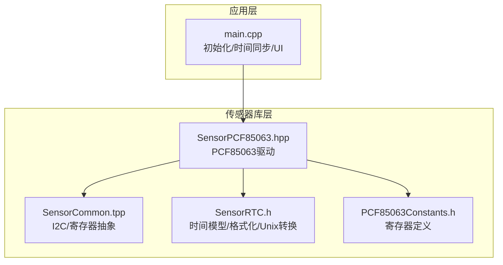
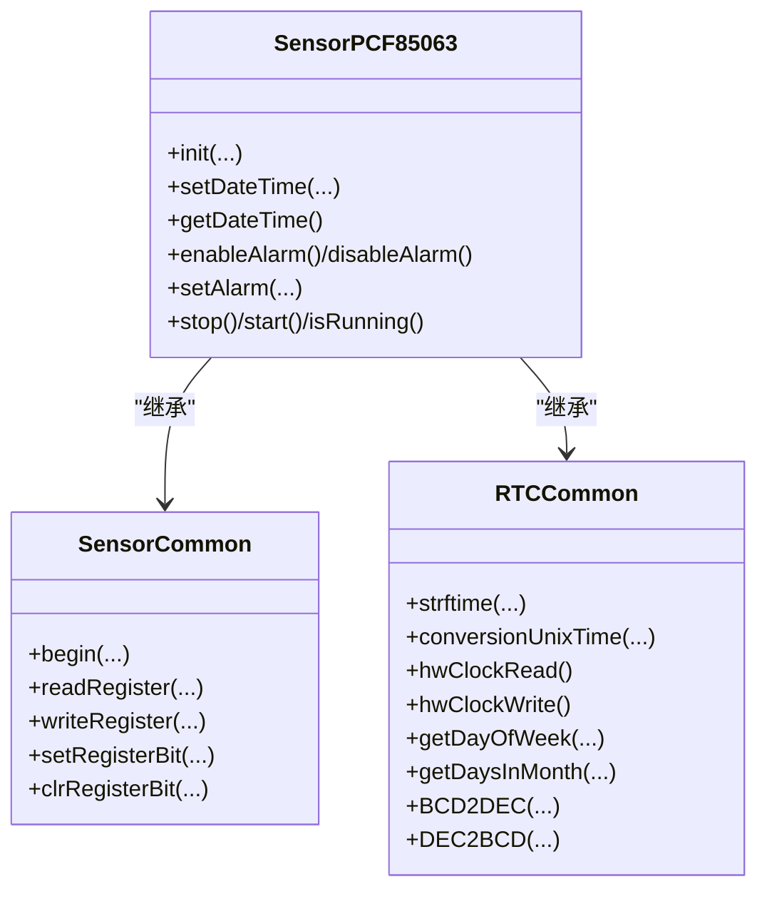
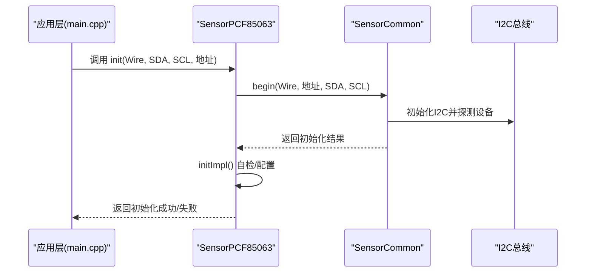
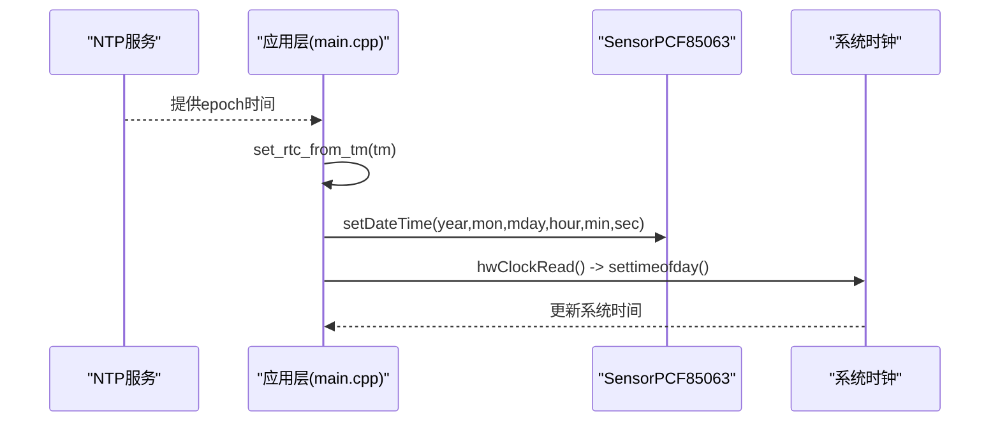
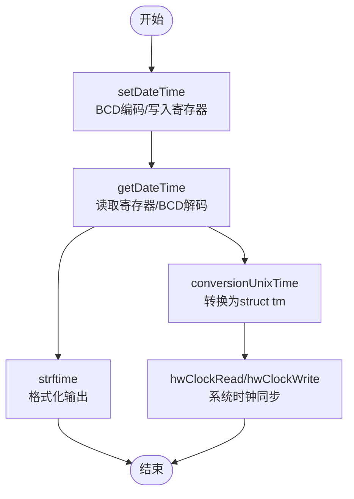
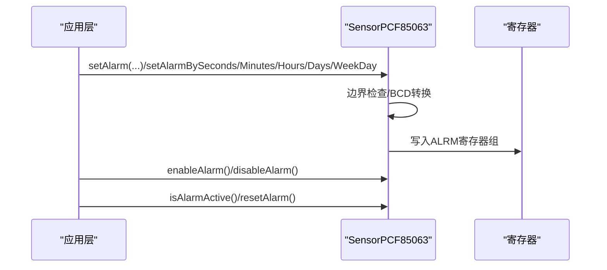
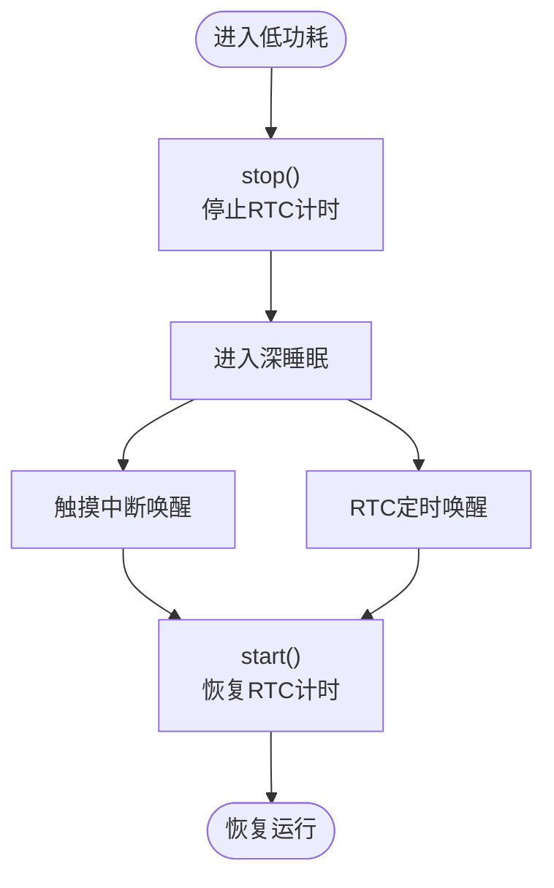
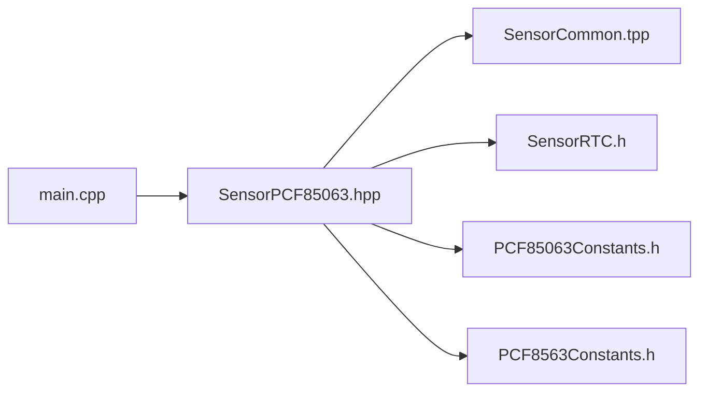

# 实时时钟管理

<cite>
**本文引用的文件列表**
- [SensorPCF85063.hpp](file://lib/SensorLib-Waveshare/src/SensorPCF85063.hpp)
- [PCF85063Constants.h](file://lib/SensorLib-Waveshare/src/REG/PCF85063Constants.h)
- [SensorRTC.h](file://lib/SensorLib-Waveshare/src/SensorRTC.h)
- [SensorCommon.tpp](file://lib/SensorLib-Waveshare/src/SensorCommon.tpp)
- [main.cpp](file://src/main.cpp)
- [PCF8563Constants.h](file://lib/SensorLib-Waveshare/src/REG/PCF8563Constants.h)
</cite>

## 目录
1. [简介](#简介)
2. [项目结构](#项目结构)
3. [核心组件](#核心组件)
4. [架构总览](#架构总览)
5. [详细组件分析](#详细组件分析)
6. [依赖关系分析](#依赖关系分析)
7. [性能考量](#性能考量)
8. [故障排查指南](#故障排查指南)
9. [结论](#结论)
10. [附录](#附录)

## 简介
本文件为智能手环项目中的实时时钟（RTC）管理系统技术文档，聚焦于PCF85063 RTC芯片的初始化与配置、时间同步机制、闹钟功能、低功耗模式下的时钟保持策略、时间数据的读写接口以及BCD编解码、闰年与夏令时处理等。文档旨在帮助开发者快速理解并正确使用该RTC模块，确保时间准确性与低功耗运行。

## 项目结构
本项目采用分层与模块化组织方式：
- 传感器库层：封装通用I2C/寄存器访问、PCF85063驱动与RTC通用功能
- 应用层：主程序负责初始化、时间同步、UI更新与低功耗控制

图表来源
- [main.cpp](file://src/main.cpp#L615-L660)
- [SensorPCF85063.hpp](file://lib/SensorLib-Waveshare/src/SensorPCF85063.hpp#L32-L34)
- [SensorCommon.tpp](file://lib/SensorLib-Waveshare/src/SensorCommon.tpp#L71-L94)
- [SensorRTC.h](file://lib/SensorLib-Waveshare/src/SensorRTC.h#L63-L179)
- [PCF85063Constants.h](file://lib/SensorLib-Waveshare/src/REG/PCF85063Constants.h#L34-L53)

章节来源
- [main.cpp](file://src/main.cpp#L615-L660)
- [SensorPCF85063.hpp](file://lib/SensorLib-Waveshare/src/SensorPCF85063.hpp#L32-L34)
- [SensorCommon.tpp](file://lib/SensorLib-Waveshare/src/SensorCommon.tpp#L71-L94)
- [SensorRTC.h](file://lib/SensorLib-Waveshare/src/SensorRTC.h#L63-L179)
- [PCF85063Constants.h](file://lib/SensorLib-Waveshare/src/REG/PCF85063Constants.h#L34-L53)

## 核心组件
- SensorPCF85063：PCF85063 RTC驱动，提供初始化、时间读写、闹钟设置与启停控制
- SensorCommon：通用I2C/寄存器访问与设备初始化模板
- RTCCommon：时间数据结构、格式化输出、Unix时间转换、BCD编解码、闰年与月份天数计算
- 寄存器常量：PCF85063寄存器地址与位掩码定义

章节来源
- [SensorPCF85063.hpp](file://lib/SensorLib-Waveshare/src/SensorPCF85063.hpp#L37-L377)
- [SensorCommon.tpp](file://lib/SensorLib-Waveshare/src/SensorCommon.tpp#L50-L691)
- [SensorRTC.h](file://lib/SensorLib-Waveshare/src/SensorRTC.h#L63-L342)
- [PCF85063Constants.h](file://lib/SensorLib-Waveshare/src/REG/PCF85063Constants.h#L34-L63)

## 架构总览
PCF85063通过I2C与主控通信，应用层通过SensorPCF85063进行初始化与时间操作，SensorCommon提供底层I2C读写与寄存器位操作，SensorRTC提供时间数据结构与格式化工具。

图表来源
- [SensorPCF85063.hpp](file://lib/SensorLib-Waveshare/src/SensorPCF85063.hpp#L37-L39)
- [SensorCommon.tpp](file://lib/SensorLib-Waveshare/src/SensorCommon.tpp#L50-L691)
- [SensorRTC.h](file://lib/SensorLib-Waveshare/src/SensorRTC.h#L181-L342)

## 详细组件分析

### 初始化与配置流程
- 设备初始化：通过SensorCommon::begin完成I2C初始化与设备探测，并调用SensorPCF85063::initImpl进行芯片自检与默认配置
- 自检逻辑：读取秒寄存器，验证范围有效后设置为24小时制并启动RTC
- 主程序入口：在setup阶段调用rtc.init并通过getDateTime判断是否需要写入初始时间

图表来源
- [main.cpp](file://src/main.cpp#L656-L659)
- [SensorPCF85063.hpp](file://lib/SensorLib-Waveshare/src/SensorPCF85063.hpp#L342-L367)
- [SensorCommon.tpp](file://lib/SensorLib-Waveshare/src/SensorCommon.tpp#L71-L94)

章节来源
- [SensorPCF85063.hpp](file://lib/SensorLib-Waveshare/src/SensorPCF85063.hpp#L342-L367)
- [SensorCommon.tpp](file://lib/SensorLib-Waveshare/src/SensorCommon.tpp#L71-L94)
- [main.cpp](file://src/main.cpp#L656-L659)

### 时间同步机制
- 应用层从NTP服务获取时间后，通过set_rtc_from_tm将struct tm转换为PCF85063可识别的时间格式并写入
- RTCCommon提供conversionUnixTime将RTC_DateTime转换为struct tm，用于系统时钟同步
- 主循环周期性检查网络状态并按需同步

图表来源
- [main.cpp](file://src/main.cpp#L112-L117)
- [SensorRTC.h](file://lib/SensorLib-Waveshare/src/SensorRTC.h#L219-L256)

章节来源
- [main.cpp](file://src/main.cpp#L112-L117)
- [SensorRTC.h](file://lib/SensorLib-Waveshare/src/SensorRTC.h#L219-L256)

### 时间读写与格式化
- 写入：setDateTime将年、月、日、时、分、秒转换为BCD并写入对应寄存器，同时计算星期
- 读取：getDateTime从寄存器读取BCD值并转换为十进制，支持24小时/12小时格式
- 格式化：strftime支持多种日期时间格式输出，便于UI展示
- Unix转换：conversionUnixTime与hwClockRead/hwClockWrite实现与系统时间的互转

图表来源
- [SensorPCF85063.hpp](file://lib/SensorLib-Waveshare/src/SensorPCF85063.hpp#L96-L135)
- [SensorRTC.h](file://lib/SensorLib-Waveshare/src/SensorRTC.h#L185-L256)

章节来源
- [SensorPCF85063.hpp](file://lib/SensorLib-Waveshare/src/SensorPCF85063.hpp#L96-L135)
- [SensorRTC.h](file://lib/SensorLib-Waveshare/src/SensorRTC.h#L185-L256)

### 闹钟功能实现
- 闹钟使能/失能：通过CTRL2寄存器位控制
- 闹钟复位：清除闹钟标志位
- 闹钟查询：读取ALRM寄存器组，解析秒、分、时、日、周
- 设置接口：支持按秒、分钟、小时、日、周设置，内部做边界检查与BCD转换

图表来源
- [SensorPCF85063.hpp](file://lib/SensorLib-Waveshare/src/SensorPCF85063.hpp#L183-L201)
- [SensorPCF85063.hpp](file://lib/SensorLib-Waveshare/src/SensorPCF85063.hpp#L216-L293)

章节来源
- [SensorPCF85063.hpp](file://lib/SensorLib-Waveshare/src/SensorPCF85063.hpp#L183-L201)
- [SensorPCF85063.hpp](file://lib/SensorLib-Waveshare/src/SensorPCF85063.hpp#L216-L293)

### 低功耗与时钟保持策略
- RTC启停：通过CTRL1寄存器STOP位启停计时
- 低功耗场景：息屏与深睡期间，系统通过触摸中断或RTC定时唤醒
- 寄存器位：CTRL1包含时钟启用、软复位、中断使能、12/24小时格式等控制位

图表来源
- [SensorPCF85063.hpp](file://lib/SensorLib-Waveshare/src/SensorPCF85063.hpp#L168-L181)
- [PCF85063Constants.h](file://lib/SensorLib-Waveshare/src/REG/PCF85063Constants.h#L55-L59)

章节来源
- [SensorPCF85063.hpp](file://lib/SensorLib-Waveshare/src/SensorPCF85063.hpp#L168-L181)
- [PCF85063Constants.h](file://lib/SensorLib-Waveshare/src/REG/PCF85063Constants.h#L55-L59)

### 数据读写接口与BCD编解码
- I2C读写：SensorCommon提供统一的读写接口，支持Arduino Wire与ESP-IDF两种模式
- BCD编解码：DEC2BCD/BCD2DEC实现十进制与BCD之间的转换
- 闰年与月份天数：getLeapYear/getDaysInMonth支持跨年与闰年的天数计算

章节来源
- [SensorCommon.tpp](file://lib/SensorLib-Waveshare/src/SensorCommon.tpp#L300-L443)
- [SensorRTC.h](file://lib/SensorLib-Waveshare/src/SensorRTC.h#L282-L326)

### 时钟校准与漂移补偿
- 项目中未发现专门的校准寄存器或漂移补偿算法实现
- 建议方案：利用RTC_OFFSET寄存器（如存在）进行微调；或通过系统时间同步周期性校正

章节来源
- [PCF85063Constants.h](file://lib/SensorLib-Waveshare/src/REG/PCF85063Constants.h#L38-L38)

## 依赖关系分析
- SensorPCF85063依赖SensorCommon进行I2C通信与寄存器操作，依赖SensorRTC提供时间数据结构与格式化
- main.cpp通过SensorPCF85063实现时间初始化与同步
- PCF8563常量头文件用于对比其他RTC芯片的寄存器布局

图表来源
- [main.cpp](file://src/main.cpp#L656-L659)
- [SensorPCF85063.hpp](file://lib/SensorLib-Waveshare/src/SensorPCF85063.hpp#L32-L34)
- [SensorCommon.tpp](file://lib/SensorLib-Waveshare/src/SensorCommon.tpp#L50-L691)
- [SensorRTC.h](file://lib/SensorLib-Waveshare/src/SensorRTC.h#L63-L179)
- [PCF85063Constants.h](file://lib/SensorLib-Waveshare/src/REG/PCF85063Constants.h#L34-L53)
- [PCF8563Constants.h](file://lib/SensorLib-Waveshare/src/REG/PCF8563Constants.h#L34-L70)

章节来源
- [main.cpp](file://src/main.cpp#L656-L659)
- [SensorPCF85063.hpp](file://lib/SensorLib-Waveshare/src/SensorPCF85063.hpp#L32-L34)
- [SensorCommon.tpp](file://lib/SensorLib-Waveshare/src/SensorCommon.tpp#L50-L691)
- [SensorRTC.h](file://lib/SensorLib-Waveshare/src/SensorRTC.h#L63-L179)
- [PCF85063Constants.h](file://lib/SensorLib-Waveshare/src/REG/PCF85063Constants.h#L34-L53)
- [PCF8563Constants.h](file://lib/SensorLib-Waveshare/src/REG/PCF8563Constants.h#L34-L70)

## 性能考量
- I2C速率：SensorCommon默认使用较高速率，确保读写效率
- UI刷新：屏幕关闭时降低更新频率以节省功耗
- 闹钟与定时：建议使用闹钟或定时器减少轮询开销

## 故障排查指南
- 设备无法通信：检查I2C引脚配置与上拉电阻，确认地址正确
- 时间异常：确认initImpl返回成功，必要时重新写入初始时间
- 闹钟不触发：检查CTRL2寄存器位状态与ALRM寄存器设置

章节来源
- [SensorCommon.tpp](file://lib/SensorLib-Waveshare/src/SensorCommon.tpp#L281-L298)
- [SensorPCF85063.hpp](file://lib/SensorLib-Waveshare/src/SensorPCF85063.hpp#L342-L367)
- [SensorPCF85063.hpp](file://lib/SensorLib-Waveshare/src/SensorPCF85063.hpp#L183-L201)

## 结论
本项目基于SensorLib实现了PCF85063 RTC的完整生命周期管理：从初始化、时间同步到闹钟与低功耗控制均有清晰的接口与实现。通过BCD编解码、闰年与月份天数计算，确保了时间数据的准确性。建议后续补充校准与漂移补偿机制，进一步提升长期精度。

## 附录
- 寄存器参考：见PCF85063Constants.h中的寄存器地址与位定义
- 时间格式：strftime支持多种常用格式，便于UI适配

章节来源
- [PCF85063Constants.h](file://lib/SensorLib-Waveshare/src/REG/PCF85063Constants.h#L34-L63)
- [SensorRTC.h](file://lib/SensorLib-Waveshare/src/SensorRTC.h#L185-L217)