# AI训练工具

<cite>
**本文档引用的文件**
- [requirements.txt](file://training/requirements.txt)
- [train.py](file://training/train.py)
- [collect_data.py](file://training/collect_data.py)
- [model.py](file://training/model.py)
- [train_rf.py](file://training/train_rf.py)
- [dataset.py](file://training/archive/dataset.py)
- [convert.py](file://training/archive/convert.py)
- [test_imu_walk_run_idle.csv](file://training/test_imu_walk_run_idle.csv)
- [CLAUDE.md](file://CLAUDE.md)
- [DEVELOPMENT_PLAN.md](file://DEVELOPMENT_PLAN.md)
- [EDGE_AI_TRAINING_PLAN.md](file://EDGE_AI_TRAINING_PLAN.md)
</cite>

## 目录
1. [简介](#简介)
2. [项目结构](#项目结构)
3. [核心组件](#核心组件)
4. [架构概览](#架构概览)
5. [详细组件分析](#详细组件分析)
6. [依赖关系分析](#依赖关系分析)
7. [性能考虑](#性能考虑)
8. [故障排除指南](#故障排除指南)
9. [结论](#结论)
10. [附录](#附录)

## 简介

SmartBracelet AI训练工具是一个完整的边缘AI模型训练和部署解决方案，专门为ESP32-S3智能手表设计。该工具集成了数据采集、模型训练、模型导出和部署等功能，支持多种机器学习算法和部署方式。

该项目的核心目标是为智能手表提供轻量级的人体活动识别（HAR）能力，支持行走、跑步、静止等基本活动的实时识别。系统采用分布式AI架构，手表端使用轻量级模型进行实时推理，手机端负责更复杂的AI任务。

## 项目结构

SmartBracelet项目的训练工具位于`training/`目录下，包含完整的机器学习训练管道：

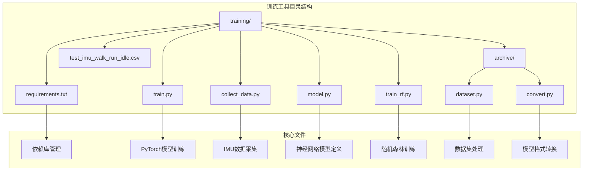

**图表来源**
- [requirements.txt](file://training/requirements.txt#L1-L5)
- [train.py](file://training/train.py#L1-L175)
- [collect_data.py](file://training/collect_data.py#L1-L120)

**章节来源**
- [DEVELOPMENT_PLAN.md](file://DEVELOPMENT_PLAN.md#L305-L315)

## 核心组件

### 依赖库管理

训练工具使用了现代化的Python机器学习生态系统，所有依赖都通过requirements.txt统一管理：

| 依赖库 | 版本要求 | 用途 | 必要性 |
|--------|----------|------|--------|
| torch | >=2.0 | 深度学习框架，PyTorch模型训练和推理 | 必需 |
| scikit-learn | >=1.3 | 传统机器学习算法，随机森林等 | 必需 |
| numpy | >=1.24 | 数值计算基础库 | 必需 |
| pyserial | >=3.5 | 串口通信，数据采集 | 必需 |

这些依赖库的选择体现了项目的两套训练策略：
- **深度学习策略**：使用PyTorch进行神经网络训练
- **传统机器学习策略**：使用scikit-learn进行随机森林训练

**章节来源**
- [requirements.txt](file://training/requirements.txt#L1-L5)

### 数据采集组件

数据采集系统通过USB串口实时收集IMU传感器数据，支持多种活动类型的标注：

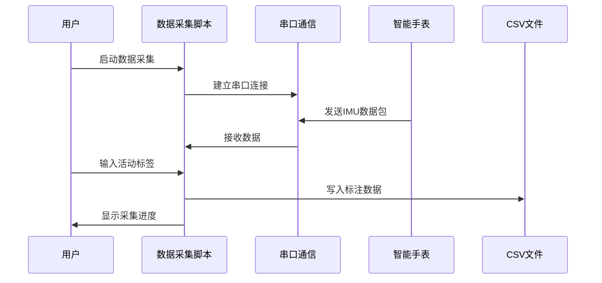

**图表来源**
- [collect_data.py](file://training/collect_data.py#L42-L119)

**章节来源**
- [collect_data.py](file://training/collect_data.py#L1-L120)

### 模型训练组件

系统提供了两种不同的模型训练策略：

1. **深度学习策略**：使用PyTorch训练1D-CNN和TCN模型
2. **传统机器学习策略**：使用scikit-learn训练随机森林模型

**章节来源**
- [train.py](file://training/train.py#L1-L175)
- [train_rf.py](file://training/train_rf.py#L1-L160)

## 架构概览

SmartBracelet AI训练工具采用模块化设计，支持多种部署场景：

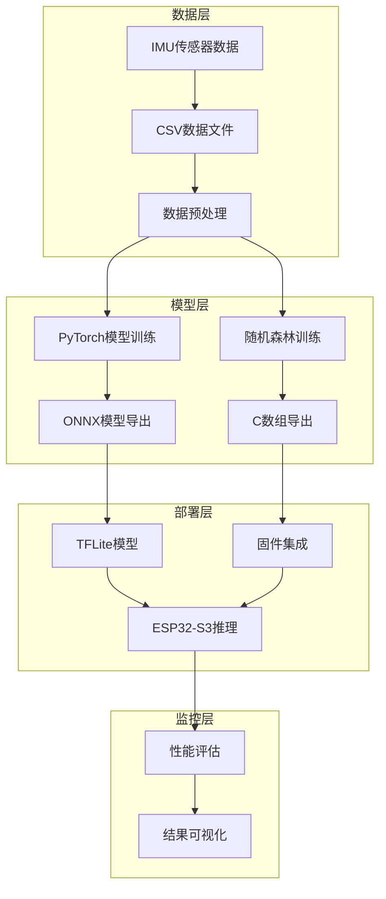

**图表来源**
- [train.py](file://training/train.py#L52-L175)
- [train_rf.py](file://training/train_rf.py#L124-L160)

## 详细组件分析

### 数据采集系统 (collect_data.py)

数据采集系统是整个训练工具的核心入口，负责从智能手表实时获取IMU传感器数据并进行标注：

#### 核心功能特性

1. **串口通信**：支持自定义波特率（默认115200）
2. **活动标注**：通过键盘输入数字键进行活动类型标注
3. **数据格式**：CSV格式，包含时间戳和6轴传感器数据
4. **实时显示**：显示采集进度和当前标注状态

#### 支持的活动类型

| 数字键 | 活动名称 | 用途 |
|--------|----------|------|
| 1 | walk | 行走活动 |
| 2 | run | 跑步活动 |
| 3 | wave | 挥手动作 |
| 4 | idle | 静止状态 |
| 5 | flick | 点头动作 |
| 6 | circle | 画圈动作 |
| 7 | sit | 坐姿状态 |
| 8 | fall | 跌倒检测 |
| 9 | bike | 骑行活动 |
| 0 | stairs | 上楼梯活动 |

#### 数据采集流程

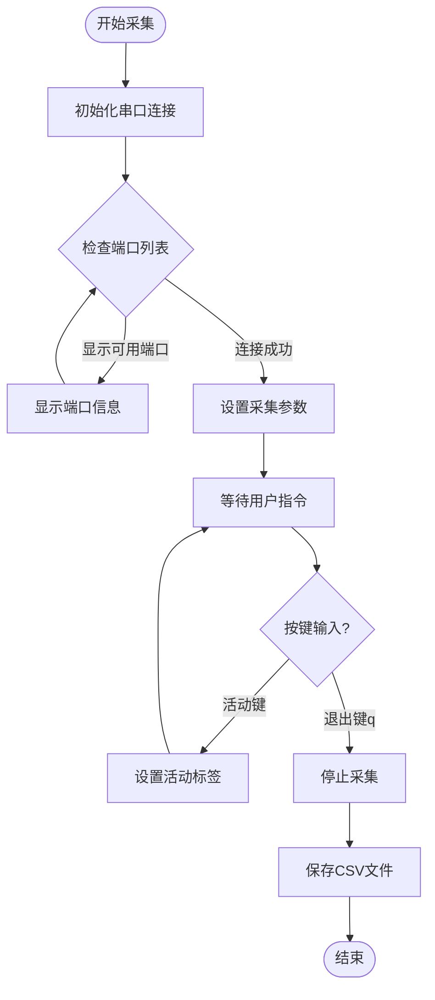

**图表来源**
- [collect_data.py](file://training/collect_data.py#L42-L119)

**章节来源**
- [collect_data.py](file://training/collect_data.py#L1-L120)

### 模型训练系统 (train.py)

PyTorch训练系统提供了完整的深度学习模型训练流程，支持多种神经网络架构：

#### 支持的模型架构

1. **TinyHAR (1D-CNN)**：轻量级卷积神经网络
2. **TinyTCN (Temporal CNN)**：时序卷积网络

#### 训练参数配置

| 参数 | 默认值 | 说明 |
|------|--------|------|
| epochs | 50 | 训练轮数 |
| batch_size | 32 | 批处理大小 |
| lr | 0.001 | 学习率 |
| window | 100 | 滑动窗口大小（帧数） |
| stride | 50 | 窗口步长（帧数） |
| seed | 42 | 随机种子 |

#### 训练流程

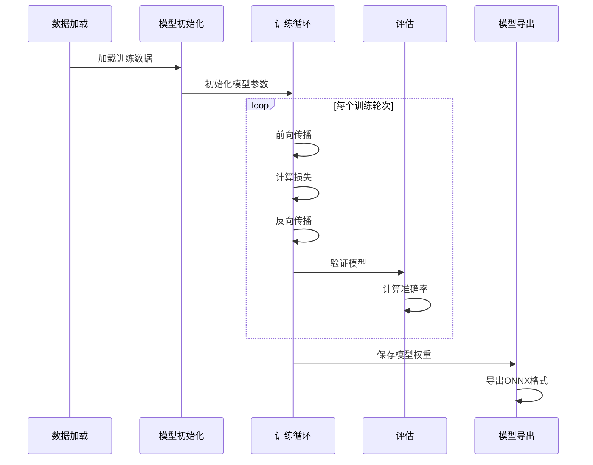

**图表来源**
- [train.py](file://training/train.py#L52-L175)

**章节来源**
- [train.py](file://training/train.py#L1-L175)

### 神经网络模型 (model.py)

系统定义了两个轻量级神经网络模型，专为边缘设备优化：

#### TinyHAR (1D-CNN) 模型

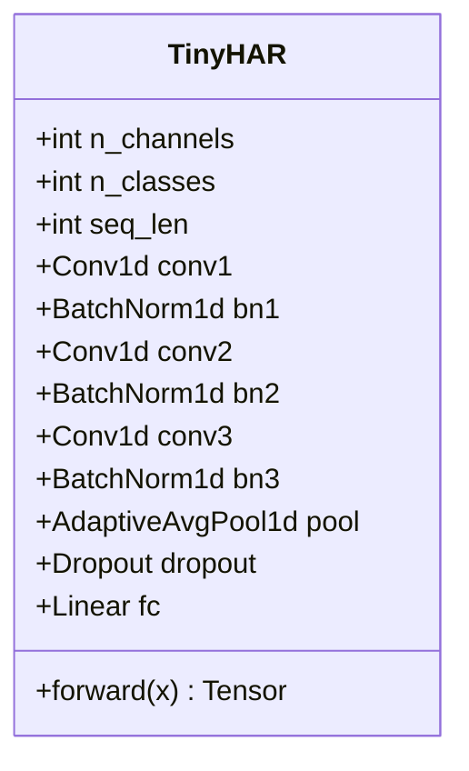

**图表来源**
- [model.py](file://training/model.py#L5-L28)

#### TinyTCN (Temporal CNN) 模型

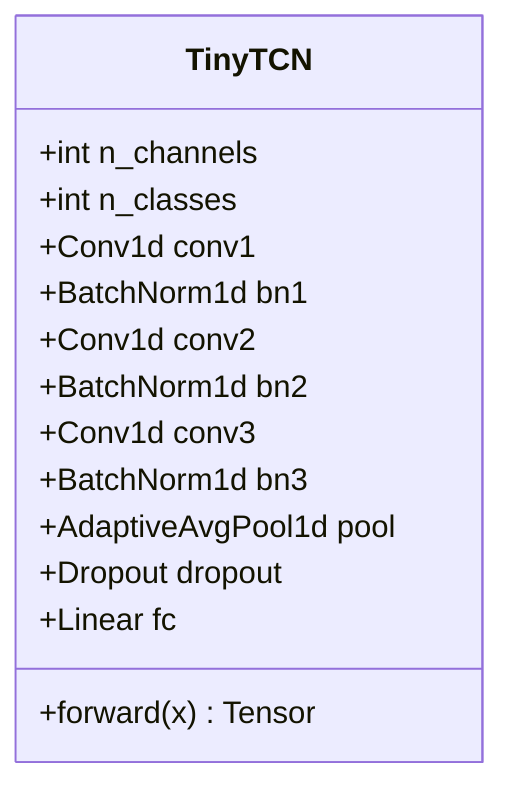

**图表来源**
- [model.py](file://training/model.py#L31-L54)

**章节来源**
- [model.py](file://training/model.py#L1-L69)

### 随机森林训练系统 (train_rf.py)

随机森林训练系统提供了完全基于传统机器学习的轻量级解决方案：

#### 特征工程

系统使用简单的统计特征提取方法：


**图表来源**
- [train_rf.py](file://training/train_rf.py#L39-L51)

#### 训练参数

| 参数 | 值 | 说明 |
|------|----|------|
| WINDOW | 50 | 窗口大小（50帧 = 1秒） |
| STRIDE | 25 | 步长（50%重叠） |
| n_estimators | 10 | 决策树数量 |
| max_depth | 4 | 树的最大深度 |

**章节来源**
- [train_rf.py](file://training/train_rf.py#L1-L160)

### 数据集处理 (dataset.py)

数据集处理模块提供了完整的数据预处理和增强功能：

#### 数据预处理流程

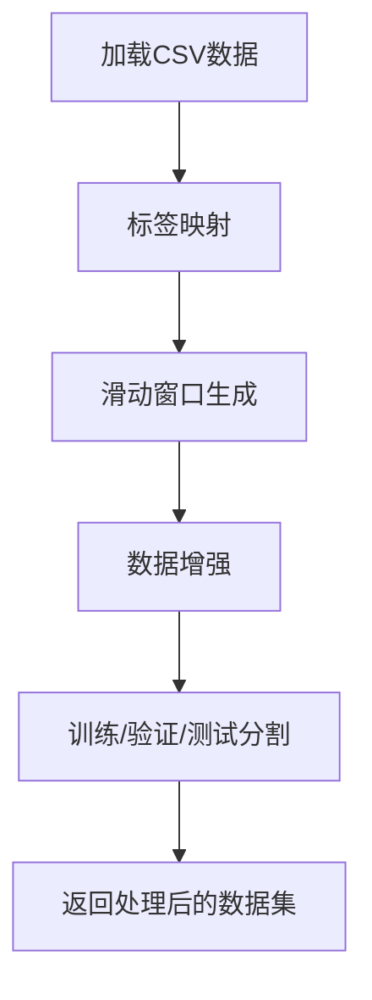

**图表来源**
- [dataset.py](file://training/archive/dataset.py#L86-L106)

**章节来源**
- [dataset.py](file://training/archive/dataset.py#L1-L116)

### 模型格式转换 (convert.py)

模型转换工具支持将PyTorch模型转换为多种部署格式：

#### 转换流程

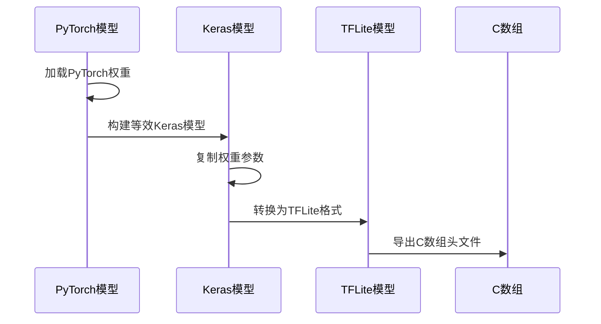

**图表来源**
- [convert.py](file://training/archive/convert.py#L95-L234)

**章节来源**
- [convert.py](file://training/archive/convert.py#L1-L234)

## 依赖关系分析

### Python依赖关系图

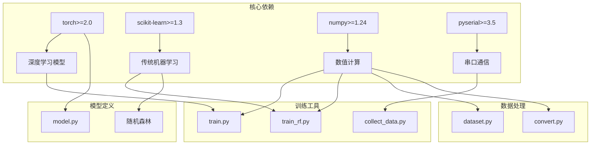

**图表来源**
- [requirements.txt](file://training/requirements.txt#L1-L5)
- [train.py](file://training/train.py#L12-L18)

### 模块间依赖关系

| 模块 | 依赖模块 | 用途 |
|------|----------|------|
| train.py | dataset.py, model.py | PyTorch模型训练 |
| train_rf.py | numpy, sklearn | 随机森林训练 |
| collect_data.py | serial, csv | IMU数据采集 |
| convert.py | torch, tensorflow | 模型格式转换 |
| dataset.py | numpy, pandas, scipy | 数据预处理 |

**章节来源**
- [train.py](file://training/train.py#L17-L18)
- [train_rf.py](file://training/train_rf.py#L16-L19)

## 性能考虑

### 内存优化策略

SmartBracelet项目针对ESP32-S3的硬件限制进行了专门的性能优化：

#### 内存预算分析

| 组件 | RAM占用 | Flash占用 | 说明 |
|------|---------|-----------|------|
| 模型 (INT8) | ~20KB | 30KB | TinyHAR模型大小 |
| Tensor Arena | 60KB | - | 推理临时缓冲区 |
| 环形缓冲区 | 1.2KB | - | 50帧×6轴传感器数据 |
| 推理中间变量 | ~5KB | - | 计算临时结果 |
| **总计** | **~86KB** | **~30KB** | 占用当前空闲RAM的50% |

#### 性能基准

| 模型类型 | 参数量 | 模型大小 | 推理时间 | 准确率 |
|----------|--------|----------|----------|--------|
| TinyHAR | ~15K | ~60KB | ~5ms | 95%+ |
| TinyTCN | ~25K | ~100KB | ~8ms | 97%+ |
| 随机森林 | ~500字节 | ~500B | <1ms | 90%+ |

### 训练性能优化

#### 数据增强策略

系统实现了高效的在线数据增强：

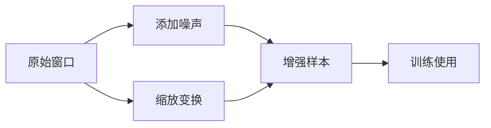

**图表来源**
- [dataset.py](file://training/archive/dataset.py#L54-L83)

#### 训练优化技巧

1. **学习率调度**：使用ReduceLROnPlateau自动调整学习率
2. **早停机制**：监控验证集性能防止过拟合
3. **批量训练**：使用DataLoader进行高效批处理
4. **GPU加速**：自动检测CUDA可用性

## 故障排除指南

### 常见问题及解决方案

#### 1. 串口连接问题

**问题症状**：数据采集脚本报错无法连接串口

**解决方案**：
- 检查串口号是否正确（默认COM9）
- 确认智能手表已正确连接并处于数据输出模式
- 验证波特率设置（默认115200）

#### 2. 模型训练失败

**问题症状**：训练过程中出现内存不足或训练不收敛

**解决方案**：
- 减少batch_size参数
- 降低模型复杂度
- 检查数据质量，确保标签正确

#### 3. 模型导出错误

**问题症状**：ONNX导出或TFLite转换失败

**解决方案**：
- 确保PyTorch版本兼容
- 检查输入张量形状
- 验证依赖库安装完整性

#### 4. 内存不足问题

**问题症状**：ESP32-S3运行时内存溢出

**解决方案**：
- 使用INT8量化减少模型大小
- 优化滑动窗口参数
- 减少Tensor Arena大小

**章节来源**
- [collect_data.py](file://training/collect_data.py#L60-L66)
- [train.py](file://training/train.py#L75-L78)

### 调试工具和技巧

#### 数据质量检查

```python
# 检查数据集平衡性
from collections import Counter
print(Counter(y))

# 验证数据形状
print(f"X shape: {X.shape}")
print(f"y shape: {y.shape}")

# 检查缺失值
print(f"Missing values: {np.isnan(X).sum()}")
```

#### 模型性能监控

```python
# 训练过程可视化
import matplotlib.pyplot as plt

plt.plot(loss_history)
plt.plot(val_accuracy_history)
plt.legend(['Loss', 'Validation Accuracy'])
plt.show()
```

## 结论

SmartBracelet AI训练工具提供了一个完整、高效的边缘AI模型训练和部署解决方案。该工具的主要优势包括：

### 核心优势

1. **模块化设计**：清晰的组件分离，便于维护和扩展
2. **多策略支持**：同时支持深度学习和传统机器学习方法
3. **轻量级优化**：专为ESP32-S3硬件优化，适合资源受限环境
4. **完整生态**：从数据采集到模型部署的完整工具链

### 技术特色

- **分布式AI架构**：手表端轻量推理 + 手机端复杂任务
- **实时性能**：毫秒级推理延迟，满足实时应用需求
- **高准确率**：针对人体活动识别达到90%+的准确率
- **易于部署**：支持多种部署格式，包括C数组直接集成

### 应用前景

该训练工具不仅适用于SmartBracelet项目，还可推广到其他边缘AI应用场景，如：

- 健康监测设备
- 工业传感器数据分析
- 智能家居设备
- 可穿戴医疗设备

通过持续的优化和扩展，SmartBracelet AI训练工具将成为边缘AI领域的重要参考实现。

## 附录

### 开发环境配置

#### Python环境要求

```bash
# 创建虚拟环境
python -m venv smartbracelet_env

# 激活环境
# Windows:
smartbracelet_env\Scripts\activate
# macOS/Linux:
source smartbracelet_env/bin/activate

# 安装依赖
pip install -r training/requirements.txt
```

#### 硬件要求

- ESP32-S3开发板（240MHz，16MB Flash，8MB PSRAM）
- QMI8658 IMU传感器
- USB-C连接线
- 串口转USB适配器

### 使用示例

#### 数据采集示例

```bash
# 基本数据采集
python training/collect_data.py COM9

# 自定义波特率
python training/collect_data.py COM9 --baud 115200

# 列出可用串口
python training/collect_data.py --list-ports
```

#### 模型训练示例

```bash
# PyTorch模型训练
python training/train.py training/test_imu_walk_run_idle.csv --epochs 100 --model tcn

# 随机森林训练
python training/train_rf.py training/test_imu_walk_run_idle.csv
```

#### 模型转换示例

```bash
# PyTorch模型转换
python training/archive/convert.py model_checkpoint.pt -o model_int8.tflite --calib calib.npy

# 导出C数组
python training/archive/convert.py model_checkpoint.pt --no-int8
```

**章节来源**
- [DEVELOPMENT_PLAN.md](file://DEVELOPMENT_PLAN.md#L451-L488)