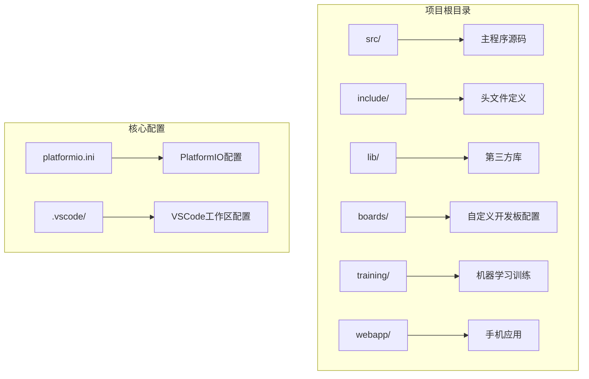
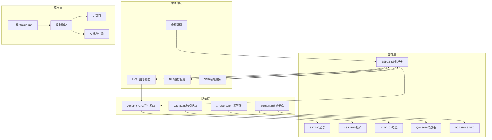
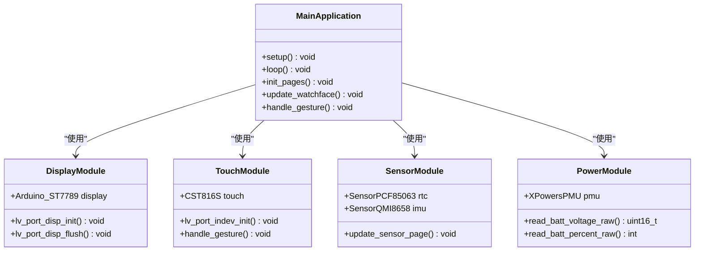
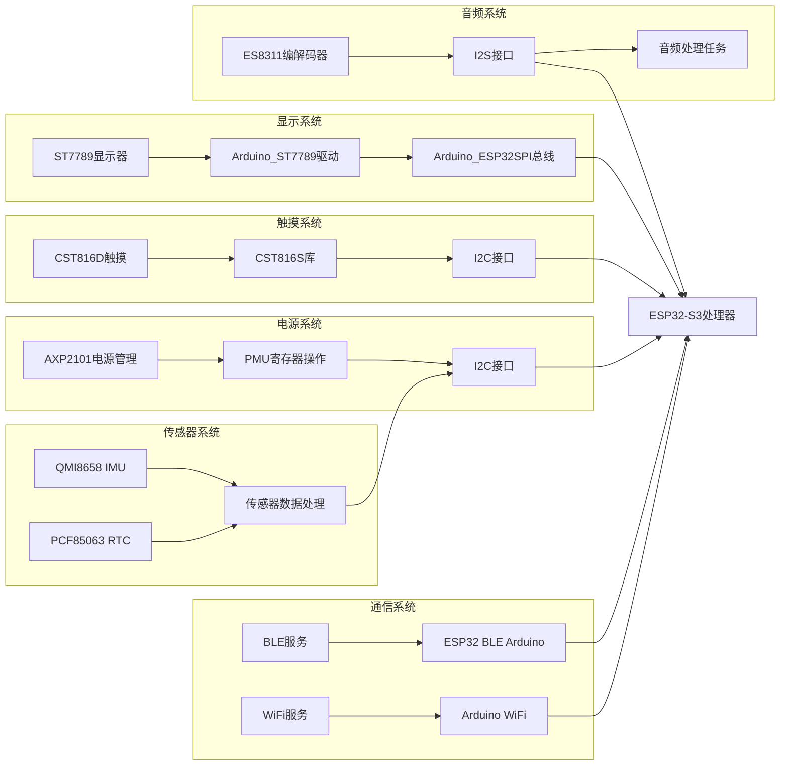
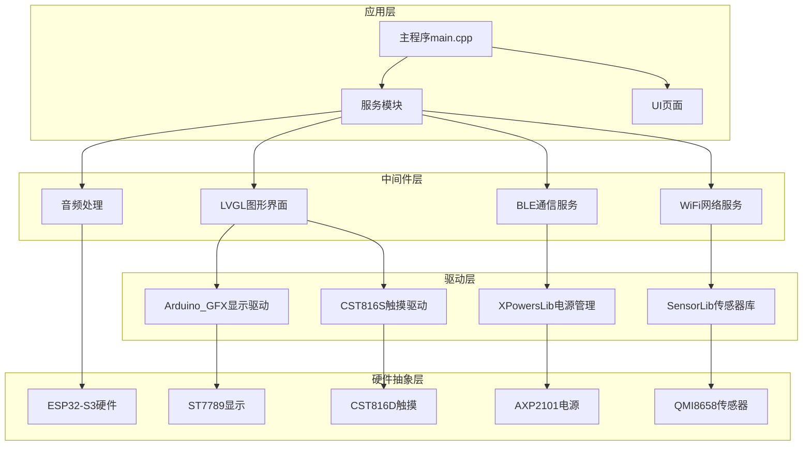
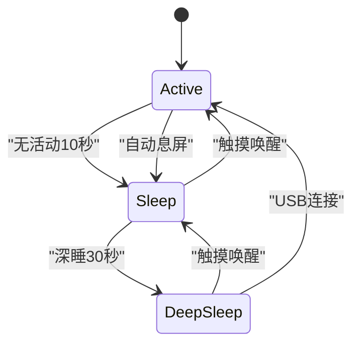

# IDE环境配置

<cite>
**本文档引用的文件**
- [platformio.ini](file://platformio.ini)
- [ESP32-S3-R8-OPI.json](file://boards/ESP32-S3-R8-OPI.json)
- [DEVELOPMENT_PLAN.md](file://DEVELOPMENT_PLAN.md)
- [pin_config.h](file://include/pin_config.h)
- [main.cpp](file://src/main.cpp)
</cite>

## 目录
1. [简介](#简介)
2. [项目结构](#项目结构)
3. [核心组件](#核心组件)
4. [架构概览](#架构概览)
5. [详细组件分析](#详细组件分析)
6. [依赖关系分析](#依赖关系分析)
7. [性能考虑](#性能考虑)
8. [故障排除指南](#故障排除指南)
9. [结论](#结论)

## 简介

SmartBracelet是一个基于Waveshare ESP32-S3-Touch-LCD-1.83开发板的边缘AI智能手表项目。该项目采用PlatformIO作为构建系统，结合Visual Studio Code进行开发，实现了完整的智能手表功能，包括健康监测、语音交互、通知同步等核心手表功能。

本指南将详细介绍IDE开发环境的配置过程，包括Visual Studio Code和PlatformIO插件的安装配置、工作区设置、编译器配置等，帮助开发者快速搭建高效的开发环境。

## 项目结构

SmartBracelet项目采用模块化的组织结构，主要包含以下核心目录：

**图表来源**
- [platformio.ini](file://platformio.ini#L1-L41)
- [DEVELOPMENT_PLAN.md](file://DEVELOPMENT_PLAN.md#L277-L315)

项目的核心特点：
- **硬件平台**：ESP32-S3 (240MHz双核，16MB Flash，8MB OPI PSRAM)
- **显示方案**：ST7789 240×284触摸屏
- **AI路线**：手表端侧推理(RF) + 手机端推理(ONNX)分布式协作
- **开发环境**：PlatformIO + Arduino框架 + Flutter

**章节来源**
- [DEVELOPMENT_PLAN.md](file://DEVELOPMENT_PLAN.md#L69-L110)
- [DEVELOPMENT_PLAN.md](file://DEVELOPMENT_PLAN.md#L277-L315)

## 核心组件

### PlatformIO核心配置

PlatformIO是该项目的主要构建系统，负责管理编译、链接、上传等开发流程。核心配置文件platformio.ini定义了整个项目的构建参数。

关键配置项说明：
- **平台选择**：espressif32@6.9.0 - 指定ESP32系列开发板支持
- **开发板配置**：esp32-s3-devkitc-1 - 使用标准开发板型号
- **框架选择**：arduino - 采用Arduino框架进行开发
- **监控设置**：波特率为115200，启用时间戳和调试过滤器

### 自定义开发板配置

项目提供了自定义的开发板JSON配置文件，详细描述了硬件规格和特性：
- **内存配置**：16MB Flash，8MB OPI PSRAM
- **连接特性**：支持WiFi和蓝牙
- **上传参数**：921600波特率，需要串口上传端口
- **硬件标识**：ESP32-S3 Dev Module，带PSRAM

### 引脚配置系统

项目采用集中式的引脚配置管理，所有硬件引脚定义都集中在pin_config.h文件中，便于维护和修改。

**章节来源**
- [platformio.ini](file://platformio.ini#L14-L41)
- [ESP32-S3-R8-OPI.json](file://boards/ESP32-S3-R8-OPI.json#L1-L40)
- [pin_config.h](file://include/pin_config.h#L1-L41)

## 架构概览

SmartBracelet的软件架构采用分层设计，从底层硬件抽象到上层应用逻辑都有清晰的层次划分：

**图表来源**
- [main.cpp](file://src/main.cpp#L1-L50)
- [DEVELOPMENT_PLAN.md](file://DEVELOPMENT_PLAN.md#L221-L261)

## 详细组件分析

### PlatformIO配置详解

PlatformIO配置文件是整个项目的构建核心，包含了平台、开发板、编译选项、上传设置等关键参数。

#### 平台和开发板配置
- **平台版本**：espressif32@6.9.0 - 确保与ESP32-S3兼容
- **开发板型号**：esp32-s3-devkitc-1 - 标准开发板，易于获取和维护
- **框架选择**：arduino - 提供丰富的Arduino生态系统支持

#### 编译器配置
项目采用了优化的编译标志：
- **调试优化**：-Og - 保持调试友好性的同时提供基本优化
- **LVGL集成**：-DLV_CONF_INCLUDE_SIMPLE - 简化LVGL配置
- **BLE优化**：禁用BLE 5.0特性，限制连接数量以节省内存
- **WiFi内存优化**：禁用多项IRAM优化以避免内存溢出

#### 库依赖管理
项目明确声明了必需的第三方库：
- **触摸驱动**：fbiego/CST816S - 支持CST816D触摸芯片
- **图形界面**：lvgl/lvgl@^8.4.0 - 最新稳定版本的LVGL
- **JSON处理**：bblanchon/ArduinoJson@^7.0.0 - 高效的JSON解析库

### VSCode工作区配置

虽然项目根目录没有.vscode文件夹，但可以通过PlatformIO插件自动创建必要的配置。

#### 推荐的VSCode扩展
- **PlatformIO IDE** - 官方支持，提供完整的ESP32开发体验
- **C/C++** - Microsoft官方扩展，提供智能代码补全
- **Arduino** - Arduino官方扩展，支持Arduino项目
- **Bracket Pair Colorizer** - 括号匹配和着色
- **EditorConfig** - 统一编辑器配置

#### 工作区设置建议
- **编译输出**：.pio/build/esp32s3/
- **库路径**：lib/ - 包含所有本地库
- **头文件路径**：include/ - 包含所有头文件
- **任务配置**：自动创建PlatformIO任务

### 代码组织和模块化

项目采用清晰的模块化设计，每个功能模块都有独立的源文件和头文件：

**图表来源**
- [main.cpp](file://src/main.cpp#L30-L36)
- [main.cpp](file://src/main.cpp#L615-L722)

**章节来源**
- [platformio.ini](file://platformio.ini#L14-L41)
- [main.cpp](file://src/main.cpp#L1-L100)
- [main.cpp](file://src/main.cpp#L615-L722)

## 依赖关系分析

### 硬件依赖关系

SmartBracelet项目中的硬件组件之间存在复杂的依赖关系：

**图表来源**
- [pin_config.h](file://include/pin_config.h#L1-L41)
- [main.cpp](file://src/main.cpp#L1-L27)

### 软件依赖关系

项目软件模块之间的依赖关系体现了清晰的分层架构：

**图表来源**
- [main.cpp](file://src/main.cpp#L1-L27)
- [DEVELOPMENT_PLAN.md](file://DEVELOPMENT_PLAN.md#L221-L261)

**章节来源**
- [pin_config.h](file://include/pin_config.h#L1-L41)
- [main.cpp](file://src/main.cpp#L1-L27)

## 性能考虑

### 内存优化策略

针对ESP32-S3的内存限制，项目采用了多项优化策略：

#### IRAM内存管理
- **禁用IRAM优化**：CONFIG_ESP_WIFI_IRAM_OPT=0 - 避免内存溢出
- **BLE连接限制**：最大连接数限制为1，减少内存占用
- **音频缓冲优化**：I2S DMA缓冲区大小经过精心调优

#### 存储空间优化
- **闪存使用**：16MB Flash足够容纳所有功能模块
- **PSRAM利用**：8MB OPI PSRAM用于LVGL显示缓冲
- **代码压缩**：使用-Og优化级别平衡调试和性能

### 电源管理优化

项目实现了智能的电源管理系统：

**图表来源**
- [main.cpp](file://src/main.cpp#L95-L106)

### 实时性能保证

为了确保UI响应性和传感器数据处理的实时性：

- **LVGL定时器**：定期执行UI更新
- **传感器采样**：200Hz采样频率，满足步数计算需求
- **BLE服务**：非阻塞通信，避免UI卡顿
- **WiFi管理**：按需开启，减少功耗

## 故障排除指南

### 常见编译问题

#### IRAM溢出错误
**症状**：编译时报错"IRAM overflow"
**解决方案**：
- 检查platformio.ini中的IRAM相关配置
- 减少lib_deps中的库数量
- 确保只包含必需的库依赖

#### 内存不足问题
**症状**：运行时出现重启或功能异常
**解决方案**：
- 检查PSRAM初始化配置
- 优化LVGL显示缓冲区大小
- 减少同时启用的功能模块

### 硬件连接问题

#### 串口通信异常
**症状**：无法通过串口调试或上传失败
**解决方案**：
- 确认COM端口号正确
- 检查USB转串口驱动安装
- 尝试不同的波特率设置

#### 触摸屏无响应
**症状**：触摸功能失效
**解决方案**：
- 检查I2C引脚连接
- 验证CST816S库版本兼容性
- 确认触摸复位引脚配置

### 开发环境配置问题

#### PlatformIO插件问题
**症状**：VSCode中PlatformIO功能不可用
**解决方案**：
- 重新安装PlatformIO IDE扩展
- 检查Python环境完整性
- 清理PlatformIO缓存

#### 代码补全失效
**症状**：智能提示不工作
**解决方案**：
- 确保C/C++扩展已安装
- 检查include路径配置
- 重新索引项目文件

**章节来源**
- [DEVELOPMENT_PLAN.md](file://DEVELOPMENT_PLAN.md#L507-L525)
- [platformio.ini](file://platformio.ini#L25-L35)

## 结论

SmartBracelet项目的IDE环境配置展现了现代嵌入式开发的最佳实践。通过合理的硬件抽象、模块化设计和优化的资源管理，该项目成功地在ESP32-S3平台上实现了丰富的智能手表功能。

关键成功因素包括：
- **清晰的架构分层**：从硬件抽象到应用逻辑的完整分层
- **优化的资源配置**：针对ESP32-S3的内存和存储限制进行了专门优化
- **可靠的开发工具链**：PlatformIO + VSCode提供了高效的开发体验
- **完善的故障排除机制**：详细的调试信息和问题解决方案

对于希望开发类似项目的开发者，建议重点关注硬件抽象层的设计、内存优化策略的选择，以及开发工具链的合理配置。通过遵循这些最佳实践，可以显著提高开发效率并降低项目风险。