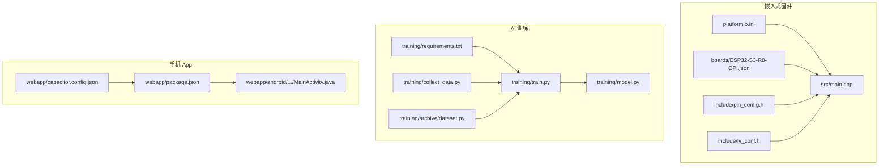
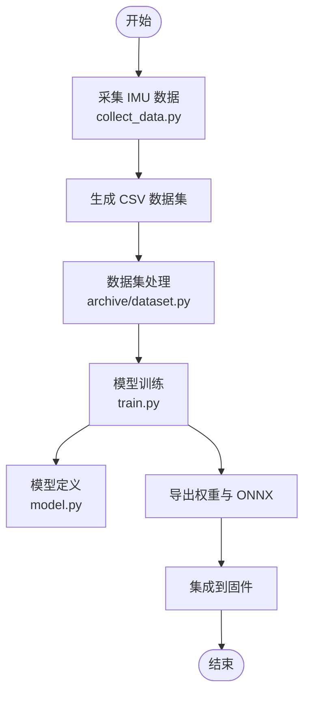
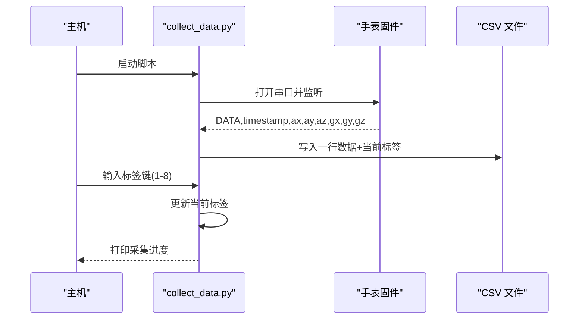
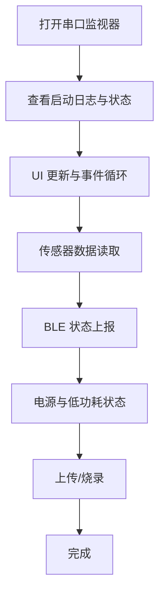
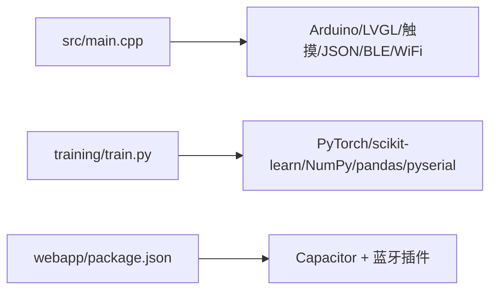

# 开发工具

<cite>
**本文引用的文件**
- [platformio.ini](file://platformio.ini)
- [boards/ESP32-S3-R8-OPI.json](file://boards/ESP32-S3-R8-OPI.json)
- [include/pin_config.h](file://include/pin_config.h)
- [include/lv_conf.h](file://include/lv_conf.h)
- [src/main.cpp](file://src/main.cpp)
- [training/requirements.txt](file://training/requirements.txt)
- [training/train.py](file://training/train.py)
- [training/model.py](file://training/model.py)
- [training/collect_data.py](file://training/collect_data.py)
- [training/archive/dataset.py](file://training/archive/dataset.py)
- [webapp/capacitor.config.json](file://webapp/capacitor.config.json)
- [webapp/package.json](file://webapp/package.json)
- [webapp/android/app/src/main/java/com/smartbracelet/app/MainActivity.java](file://webapp/android/app/src/main/java/com/smartbracelet/app/MainActivity.java)
- [DEVELOPMENT_PLAN.md](file://DEVELOPMENT_PLAN.md)
- [EDGE_AI_TRAINING_PLAN.md](file://EDGE_AI_TRAINING_PLAN.md)
</cite>

## 目录
1. [简介](#简介)
2. [项目结构](#项目结构)
3. [核心组件](#核心组件)
4. [架构总览](#架构总览)
5. [详细组件分析](#详细组件分析)
6. [依赖关系分析](#依赖关系分析)
7. [性能考虑](#性能考虑)
8. [故障排查指南](#故障排查指南)
9. [结论](#结论)
10. [附录](#附录)

## 简介
本指南面向 SmartBracelet 项目的开发与维护，围绕以下主题提供系统化的操作说明与最佳实践：
- PlatformIO 开发环境配置与使用（项目设置、编译选项、上传与调试）
- AI 模型训练工具链（Python 环境、依赖库、训练脚本）
- 数据采集工具（传感器数据记录、特征提取、数据标注）
- 调试工具（串口调试、性能分析、内存监控）
- 代码质量工具（静态分析、单元测试、覆盖率）
- 版本控制与协作流程（分支管理、代码评审、持续集成）
- 开发最佳实践、效率提升技巧与常见问题解决方案

## 项目结构
SmartBracelet 采用模块化组织，分为嵌入式固件、AI 训练工具与手机 App 三大部分：
- 嵌入式固件（ESP32-S3）：src、include、boards、lib
- AI 训练工具：training
- 手机 App：webapp



**图表来源**
- [platformio.ini](file://platformio.ini#L14-L41)
- [boards/ESP32-S3-R8-OPI.json](file://boards/ESP32-S3-R8-OPI.json#L1-L40)
- [include/pin_config.h](file://include/pin_config.h#L1-L41)
- [include/lv_conf.h](file://include/lv_conf.h#L1-L114)
- [src/main.cpp](file://src/main.cpp#L1-L120)
- [training/requirements.txt](file://training/requirements.txt#L1-L5)
- [training/train.py](file://training/train.py#L1-L175)
- [training/model.py](file://training/model.py#L1-L69)
- [training/collect_data.py](file://training/collect_data.py#L1-L120)
- [training/archive/dataset.py](file://training/archive/dataset.py#L1-L116)
- [webapp/capacitor.config.json](file://webapp/capacitor.config.json#L1-L14)
- [webapp/package.json](file://webapp/package.json#L1-L22)
- [webapp/android/app/src/main/java/com/smartbracelet/app/MainActivity.java](file://webapp/android/app/src/main/java/com/smartbracelet/app/MainActivity.java#L1-L6)

**章节来源**
- [DEVELOPMENT_PLAN.md](file://DEVELOPMENT_PLAN.md#L277-L316)

## 核心组件
- PlatformIO 工程配置：平台、板卡、框架、监视器与上传参数、构建标志、库依赖
- 自定义板定义：芯片、内存类型、分区、上传速度与调试配置
- 引脚与外设配置：显示、触控、TF 卡、音频等引脚映射
- LVGL 配置：颜色深度、内存、字体、性能与日志开关
- 主程序入口：显示、触控、传感器、BLE、WiFi、OTA、音频、语音聊天、跌倒检测等模块初始化与主循环
- AI 训练工具链：数据采集、数据集处理、模型训练、导出与集成
- 手机 App：Capacitor 配置、脚本与 Android 入口

**章节来源**
- [platformio.ini](file://platformio.ini#L11-L41)
- [boards/ESP32-S3-R8-OPI.json](file://boards/ESP32-S3-R8-OPI.json#L1-L40)
- [include/pin_config.h](file://include/pin_config.h#L1-L41)
- [include/lv_conf.h](file://include/lv_conf.h#L1-L114)
- [src/main.cpp](file://src/main.cpp#L615-L722)
- [training/requirements.txt](file://training/requirements.txt#L1-L5)
- [training/train.py](file://training/train.py#L1-L175)
- [training/model.py](file://training/model.py#L1-L69)
- [training/collect_data.py](file://training/collect_data.py#L1-L120)
- [training/archive/dataset.py](file://training/archive/dataset.py#L1-L116)
- [webapp/capacitor.config.json](file://webapp/capacitor.config.json#L1-L14)
- [webapp/package.json](file://webapp/package.json#L1-L22)
- [webapp/android/app/src/main/java/com/smartbracelet/app/MainActivity.java](file://webapp/android/app/src/main/java/com/smartbracelet/app/MainActivity.java#L1-L6)

## 架构总览
系统由“手表固件 + 手机 App + 训练工具”三层构成，通过 BLE/GATT 实现数据与指令交互。

```mermaid
graph TB
subgraph "手机 App"
APP_BLE["BLE 通信"]
APP_AI["AI 推理 (ONNX/TFLite)"]
APP_DB["数据看板/历史"]
end
subgraph "手表固件"
FW_UI["LVGL UI"]
FW_SRV["BLE 服务/OTA/音频/TF卡"]
FW_AI["端侧 AI (RF)"]
FW_HW["ST7789/CST816S/QMI8658/AXP2101"]
end
APP_BLE <- --> FW_SRV
APP_AI <- --> FW_AI
APP_DB <- --> FW_SRV
FW_UI --> FW_SRV
FW_SRV --> FW_HW
```

**图表来源**
- [DEVELOPMENT_PLAN.md](file://DEVELOPMENT_PLAN.md#L221-L261)
- [src/main.cpp](file://src/main.cpp#L718-L721)
- [webapp/capacitor.config.json](file://webapp/capacitor.config.json#L1-L14)

## 详细组件分析

### PlatformIO 开发环境配置与使用
- 工程默认环境与目标板：默认环境、ESP32-S3 开发板、Arduino 框架
- 监视器与上传：串口速率、过滤器、上传波特率与端口
- 构建标志：优化级别、LVGL 简化头、BLE 与 WiFi IRAM 优化、包含目录
- 库依赖：触摸、LVGL、JSON
- 自定义板定义：内存类型、分区、上传速度、调试 OpenOCD 目标

建议操作步骤
- 首次配置：确认 COM 端口、波特率与上传模式（QIO）
- 常用命令：构建、上传、监控串口
- 问题定位：IRAM/DRAM 溢出、PSRAM 初始化失败、上传失败

**章节来源**
- [platformio.ini](file://platformio.ini#L11-L41)
- [boards/ESP32-S3-R8-OPI.json](file://boards/ESP32-S3-R8-OPI.json#L1-L40)
- [DEVELOPMENT_PLAN.md](file://DEVELOPMENT_PLAN.md#L489-L504)

### AI 模型训练工具链
- Python 环境与依赖：PyTorch、scikit-learn、NumPy、pyserial
- 数据采集：collect_data.py 通过串口接收 IMU 数据并写入 CSV，支持标签切换
- 数据集处理：archive/dataset.py 加载 CSV、滑动窗口、增强与划分
- 模型训练：train.py 支持 TinyHAR/TinyTCN，输出权重与 ONNX
- 模型定义：model.py 定义网络结构与参数统计



**图表来源**
- [training/collect_data.py](file://training/collect_data.py#L42-L115)
- [training/archive/dataset.py](file://training/archive/dataset.py#L86-L106)
- [training/train.py](file://training/train.py#L52-L172)
- [training/model.py](file://training/model.py#L5-L58)

**章节来源**
- [training/requirements.txt](file://training/requirements.txt#L1-L5)
- [training/collect_data.py](file://training/collect_data.py#L1-L120)
- [training/archive/dataset.py](file://training/archive/dataset.py#L1-L116)
- [training/train.py](file://training/train.py#L1-L175)
- [training/model.py](file://training/model.py#L1-L69)
- [EDGE_AI_TRAINING_PLAN.md](file://EDGE_AI_TRAINING_PLAN.md#L1-L422)

### 数据采集工具使用
- 串口采集：固定波特率、CSV 格式、标签映射、键盘输入切换标签
- 特征提取：滑动窗口、统计特征（均值/标准差）、数据增强
- 数据标注：按键映射到动作类别，支持多类别扩展



**图表来源**
- [training/collect_data.py](file://training/collect_data.py#L42-L115)
- [src/main.cpp](file://src/main.cpp#L620-L625)

**章节来源**
- [training/collect_data.py](file://training/collect_data.py#L1-L120)
- [training/archive/dataset.py](file://training/archive/dataset.py#L30-L51)

### 调试工具配置与使用
- 串口调试：监视器速率、过滤器、USB CDC
- 性能分析：主循环定时器、UI 刷新周期、BLE/OTA 状态上报
- 内存监控：LVGL 内存配置、堆大小、日志开关
- 上传与烧录：推荐 esptool.py 三段式烧录，避免 IRAM/PSRAM 问题



**图表来源**
- [platformio.ini](file://platformio.ini#L18-L23)
- [include/lv_conf.h](file://include/lv_conf.h#L21-L24)
- [src/main.cpp](file://src/main.cpp#L724-L741)
- [DEVELOPMENT_PLAN.md](file://DEVELOPMENT_PLAN.md#L489-L504)

**章节来源**
- [platformio.ini](file://platformio.ini#L18-L23)
- [include/lv_conf.h](file://include/lv_conf.h#L1-L114)
- [src/main.cpp](file://src/main.cpp#L724-L741)
- [DEVELOPMENT_PLAN.md](file://DEVELOPMENT_PLAN.md#L507-L526)

### 代码质量工具集成
- 静态分析：建议使用 clang-format/clang-tidy（在 CI 中执行）
- 单元测试：针对 Python 训练脚本与数据集处理模块编写 pytest
- 覆盖率：pytest-cov 生成覆盖率报告
- 文档与规范：统一注释风格、API 文档生成（Sphinx）

[本节为通用指导，不直接分析具体文件]

### 版本控制与协作流程
- 分支管理：主干稳定、功能分支、热修复分支
- 代码评审：PR 模板、评审清单、自动化检查
- 持续集成：PlatformIO 构建、Python 环境测试、覆盖率报告

[本节为通用指导，不直接分析具体文件]

## 依赖关系分析
- 嵌入式固件依赖：Arduino、LVGL、触摸库、JSON、BLE/WiFi
- AI 训练依赖：PyTorch、scikit-learn、NumPy、pandas、pyserial
- 手机 App 依赖：Capacitor、蓝牙插件、Android Gradle



**图表来源**
- [platformio.ini](file://platformio.ini#L37-L41)
- [training/requirements.txt](file://training/requirements.txt#L1-L5)
- [webapp/package.json](file://webapp/package.json#L15-L21)

**章节来源**
- [platformio.ini](file://platformio.ini#L37-L41)
- [training/requirements.txt](file://training/requirements.txt#L1-L5)
- [webapp/package.json](file://webapp/package.json#L15-L21)

## 性能考虑
- LVGL 内存与刷新：合理设置内存池、刷新周期与字体
- 传感器采样：降低采样率或降采样以减少带宽与处理压力
- BLE/WiFi 共存：分时复用，避免同时高负载
- OTA 与音频：后台任务分离，避免阻塞 UI

[本节为通用指导，不直接分析具体文件]

## 故障排查指南
- USB 串口崩溃：检查全局对象初始化顺序、USBSerial 超时
- PSRAM 初始化失败：使用标准板型或禁用相关宏
- IRAM 溢出：减少库依赖、优化 IRAM 使用
- 上传失败：使用 esptool.py 三段式烧录，确保 QIO 模式与正确波特率
- 电池保护板锁死：直接读取 ADC 寄存器，兼容异常状态

**章节来源**
- [DEVELOPMENT_PLAN.md](file://DEVELOPMENT_PLAN.md#L507-L526)

## 结论
本指南提供了 SmartBracelet 从嵌入式固件到 AI 训练与手机 App 的完整开发工具链说明。遵循本文的配置与流程，可高效完成项目构建、训练与调试，并建立可持续的协作与质量保障机制。

## 附录

### 常用命令与路径
- PlatformIO
  - 构建：pio run
  - 上传：pio run --target upload
  - 监控：pio device monitor
- Python 训练
  - 安装依赖：pip install -r training/requirements.txt
  - 数据采集：python training/collect_data.py COM9
  - 训练：python training/train.py data/*.csv
- 手机 App
  - Capacitor 同步：npm run build
  - 打开 Android：npm run open
  - 开发模式：npm run dev

**章节来源**
- [platformio.ini](file://platformio.ini#L11-L23)
- [training/requirements.txt](file://training/requirements.txt#L1-L5)
- [webapp/package.json](file://webapp/package.json#L6-L10)