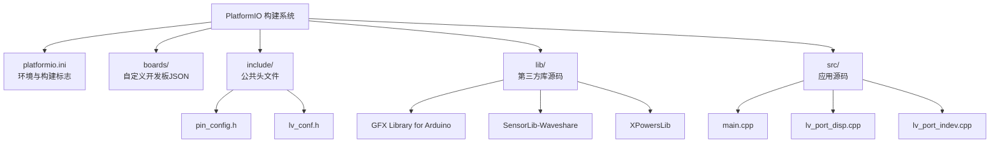
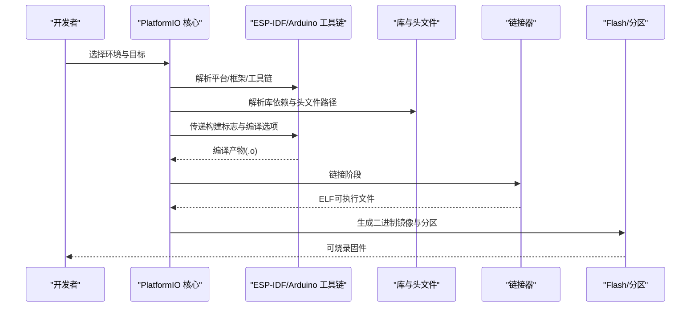
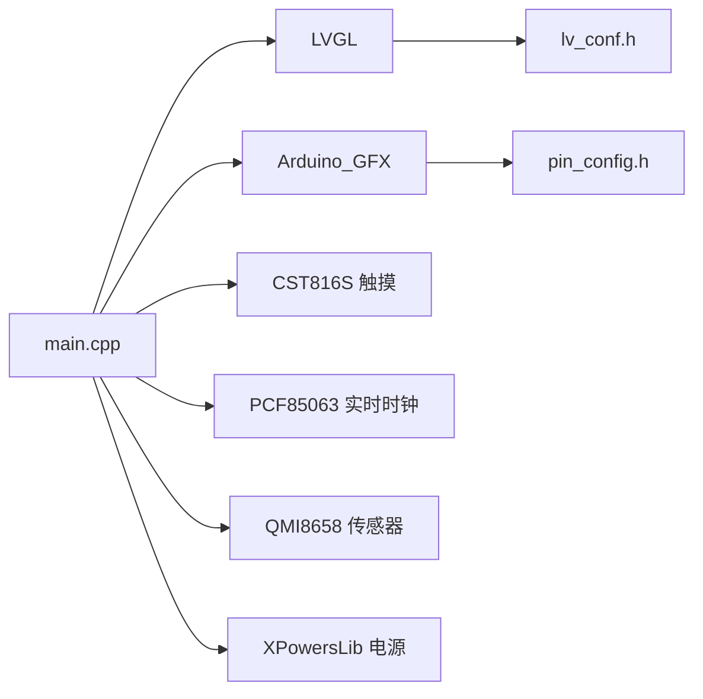

# 构建系统

<cite>
**本文引用的文件**
- [platformio.ini](file://platformio.ini)
- [ESP32-S3-R8-OPI.json](file://boards/ESP32-S3-R8-OPI.json)
- [lv_conf.h](file://include/lv_conf.h)
- [pin_config.h](file://include/pin_config.h)
- [main.cpp](file://src/main.cpp)
- [lv_port_disp.cpp](file://src/lv_port_disp.cpp)
- [lv_port_indev.cpp](file://src/lv_port_indev.cpp)
- [library.properties](file://lib/GFX_Library_for_Arduino/library.properties)
- [SensorLib.h](file://lib/SensorLib-Waveshare/src/SensorLib.h)
- [XPowersLib.h](file://lib/XPowersLib/src/XPowersLib.h)
</cite>

## 目录
1. [简介](#简介)
2. [项目结构](#项目结构)
3. [核心组件](#核心组件)
4. [架构总览](#架构总览)
5. [详细组件分析](#详细组件分析)
6. [依赖关系分析](#依赖关系分析)
7. [性能考虑](#性能考虑)
8. [故障排查指南](#故障排查指南)
9. [结论](#结论)
10. [附录](#附录)

## 简介
本文件面向SmartBracelet项目的构建系统，围绕PlatformIO构建体系进行系统化说明，涵盖以下主题：
- 平台与开发板配置：平台版本、框架、上传参数、环境变量与构建标志
- 编译流程与链接过程：从源码到固件镜像的关键步骤
- 固件生成与分区布局：Flash模式、内存类型、分区表
- 配置文件解析：platformio.ini中的各项设置及其作用
- 源代码组织与头文件包含路径：include目录、库头文件查找策略
- 构建优化：编译器优化级别、调试信息、内存使用优化
- 自定义脚本与后处理：高级构建钩子与产物后处理
- 问题诊断与性能优化：常见问题定位与优化建议

## 项目结构
SmartBracelet采用PlatformIO工程组织方式，核心目录与文件如下：
- 根目录：platformio.ini（全局构建配置）
- boards/：自定义开发板JSON描述（覆盖默认板级参数）
- include/：公共头文件（如LVGL配置、引脚定义）
- lib/：第三方库源码与示例（含GFX、传感器库、电源管理库）
- src/：应用源码（主程序、LVGL显示与输入端口适配）
- webapp/：跨平台前端（Android Capacitor工程，非构建系统主体）

图表来源
- [platformio.ini](file://platformio.ini#L11-L41)
- [ESP32-S3-R8-OPI.json](file://boards/ESP32-S3-R8-OPI.json#L1-L40)
- [main.cpp](file://src/main.cpp#L1-L30)
- [lv_port_disp.cpp](file://src/lv_port_disp.cpp#L1-L33)
- [lv_port_indev.cpp](file://src/lv_port_indev.cpp#L1-L28)
- [pin_config.h](file://include/pin_config.h#L1-L41)
- [lv_conf.h](file://include/lv_conf.h#L1-L114)

章节来源
- [platformio.ini](file://platformio.ini#L11-L41)
- [ESP32-S3-R8-OPI.json](file://boards/ESP32-S3-R8-OPI.json#L1-L40)

## 核心组件
- 平台与框架
  - 平台：Espressif ESP32（指定版本）
  - 框架：Arduino
  - 开发板：esp32-s3-devkitc-1（默认环境）
- 上传与监控
  - 串口监视器波特率与过滤器
  - 上传速度与端口
- 构建标志
  - 调试优化级别、LVGL简化配置、蓝牙/无线相关宏
  - 头文件包含路径（-Iinclude）
- 库依赖
  - GFX图形库、LVGL、ArduinoJson
  - 自定义库目录（lib_extra_dirs）

章节来源
- [platformio.ini](file://platformio.ini#L14-L41)

## 架构总览
下图展示从源码到固件镜像的典型构建链路，以及关键配置对流程的影响。

图表来源
- [platformio.ini](file://platformio.ini#L14-L41)
- [library.properties](file://lib/GFX_Library_for_Arduino/library.properties#L1-L8)

## 详细组件分析

### 平台与开发板配置
- 平台与框架
  - 指定平台版本与Arduino框架，确保工具链与SDK兼容性
- 开发板与变体
  - 使用默认开发板定义，同时通过自定义JSON覆盖特定参数（如内存类型、分区表、外设能力）
- 上传与监控
  - 设置串口监控波特率、过滤器、上传波特率与端口，便于调试

章节来源
- [platformio.ini](file://platformio.ini#L14-L24)
- [ESP32-S3-R8-OPI.json](file://boards/ESP32-S3-R8-OPI.json#L1-L40)

### 构建标志与编译选项
- 调试优化与功能裁剪
  - 调试优化级别、LVGL简化配置宏、蓝牙/无线相关宏用于减少内存占用与提升启动性能
- 头文件包含路径
  - 将include目录加入编译器搜索路径，确保应用头文件与库头文件正确解析

章节来源
- [platformio.ini](file://platformio.ini#L25-L36)

### 库依赖与源码组织
- 第三方库
  - GFX图形库、LVGL、ArduinoJson通过lib_deps声明；自定义库目录通过lib_extra_dirs纳入
- 源码组织
  - include目录集中放置公共头文件（如引脚定义、LVGL配置）
  - lib目录包含多个子库源码，按功能分层（显示驱动、传感器、电源管理）

章节来源
- [platformio.ini](file://platformio.ini#L36-L41)
- [library.properties](file://lib/GFX_Library_for_Arduino/library.properties#L1-L8)
- [SensorLib.h](file://lib/SensorLib-Waveshare/src/SensorLib.h#L1-L232)
- [XPowersLib.h](file://lib/XPowersLib/src/XPowersLib.h#L1-L36)

### LVGL配置与显示端口
- LVGL配置
  - 通过lv_conf.h控制颜色深度、内存分配、HAL定时、字体与小部件启用等
- 显示端口
  - lv_port_disp.cpp实现LVGL到Arduino_GFX的刷新回调，使用双缓冲减少撕裂
  - lv_port_indev.cpp实现触摸输入读取与状态上报

章节来源
- [lv_conf.h](file://include/lv_conf.h#L1-L114)
- [lv_port_disp.cpp](file://src/lv_port_disp.cpp#L1-L33)
- [lv_port_indev.cpp](file://src/lv_port_indev.cpp#L1-L28)

### 引脚与外设配置
- 引脚定义
  - pin_config.h集中定义LCD、I2C、触摸、TF卡、音频等引脚映射
- 外设初始化
  - main.cpp中完成I2C、SPI、显示驱动、触摸、传感器、电源管理等初始化

章节来源
- [pin_config.h](file://include/pin_config.h#L1-L41)
- [main.cpp](file://src/main.cpp#L615-L722)

### 编译流程与链接过程（概念性说明）
- 预处理与编译
  - 依据platformio.ini中的构建标志与包含路径，预处理器展开宏并解析头文件
  - 编译器根据优化级别与语言标准生成目标文件
- 链接
  - 链接器整合所有目标文件与库对象，解析符号并生成ELF
- 固件生成
  - 生成二进制镜像与分区表，写入Flash布局

（本节为概念性说明，不直接分析具体文件）

### 固件生成与分区布局
- 分区表
  - 自定义开发板JSON指定分区表文件名，决定APP与OTA区域划分
- 内存类型与Flash模式
  - OPI与QIO模式影响读写性能与兼容性
- 上传速度与端口
  - 上传速度与端口在platformio.ini中配置，影响烧录稳定性

章节来源
- [ESP32-S3-R8-OPI.json](file://boards/ESP32-S3-R8-OPI.json#L1-L40)
- [platformio.ini](file://platformio.ini#L14-L24)

### 自定义构建脚本与后处理
- 高级选项
  - platformio.ini支持“Advanced options: extra scripting”，可用于注入自定义构建前后处理逻辑
- 建议实践
  - 在构建前校验外部资源（如字体、图片），在构建后生成版本信息或签名文件

章节来源
- [platformio.ini](file://platformio.ini#L1-L10)

## 依赖关系分析
- 组件耦合
  - 应用层（main.cpp）依赖显示与输入端口（lv_port_*）、传感器与电源库、LVGL与GFX
  - LVGL配置（lv_conf.h）影响显示性能与内存占用
- 库依赖
  - GFX库提供多数据总线与显示驱动抽象
  - SensorLib与XPowersLib封装I2C设备访问与电源管理接口
- 外部依赖
  - Arduino框架提供运行时与API
  - Espressif SDK负责底层硬件抽象与无线栈

图表来源
- [main.cpp](file://src/main.cpp#L1-L30)
- [lv_conf.h](file://include/lv_conf.h#L1-L114)
- [pin_config.h](file://include/pin_config.h#L1-L41)

章节来源
- [main.cpp](file://src/main.cpp#L1-L30)
- [lv_conf.h](file://include/lv_conf.h#L1-L114)
- [pin_config.h](file://include/pin_config.h#L1-L41)

## 性能考虑
- 编译器优化
  - 合理选择优化级别以平衡体积与性能；在调试阶段可启用更详细的调试信息
- 内存使用优化
  - 通过LVGL配置裁剪未使用的小部件与字体，限制帧缓冲大小
  - 控制蓝牙/无线相关宏，降低RAM占用
- 显示与输入
  - 使用双缓冲与批量绘制减少重绘开销；触摸轮询周期与LVGL输入周期匹配
- 外设与功耗
  - 合理关闭WiFi与BLE在空闲时段，结合电源管理库进行电压与电流控制

（本节提供通用指导，不直接分析具体文件）

## 故障排查指南
- 上传失败或不稳定
  - 检查上传端口与速度是否匹配；确认开发板JSON中的最大RAM/Flash尺寸与实际硬件一致
- 构建错误或头文件找不到
  - 确认include路径已添加；检查库的library.properties与头文件位置
- 显示异常或闪烁
  - 检查LVGL刷新回调与缓冲大小；核对引脚定义与硬件连线
- 蓝牙/无线功能异常
  - 核对构建标志中相关宏；确认平台与框架版本兼容

章节来源
- [platformio.ini](file://platformio.ini#L14-L24)
- [ESP32-S3-R8-OPI.json](file://boards/ESP32-S3-R8-OPI.json#L1-L40)
- [lv_port_disp.cpp](file://src/lv_port_disp.cpp#L1-L33)

## 结论
SmartBracelet的构建系统基于PlatformIO，通过明确的平台与框架配置、严格的库依赖管理与合理的LVGL优化，实现了稳定高效的固件生成。结合自定义开发板JSON与构建标志，可在保证功能的同时优化内存与性能。建议在后续迭代中完善自定义构建脚本与自动化测试流程，持续提升构建效率与产物质量。

## 附录
- 关键配置要点速查
  - 平台与框架：platformio.ini中的platform与framework
  - 开发板与变体：platformio.ini中的board与自定义JSON
  - 上传与监控：platformio.ini中的upload_port、upload_speed、monitor_speed
  - 构建标志：platformio.ini中的build_flags与-Iinclude
  - 库依赖：platformio.ini中的lib_deps与lib_extra_dirs
  - LVGL配置：include/lv_conf.h
  - 引脚定义：include/pin_config.h

章节来源
- [platformio.ini](file://platformio.ini#L14-L41)
- [lv_conf.h](file://include/lv_conf.h#L1-L114)
- [pin_config.h](file://include/pin_config.h#L1-L41)