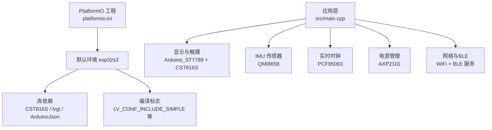
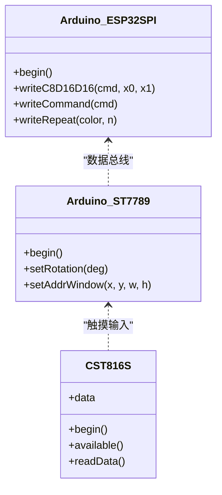
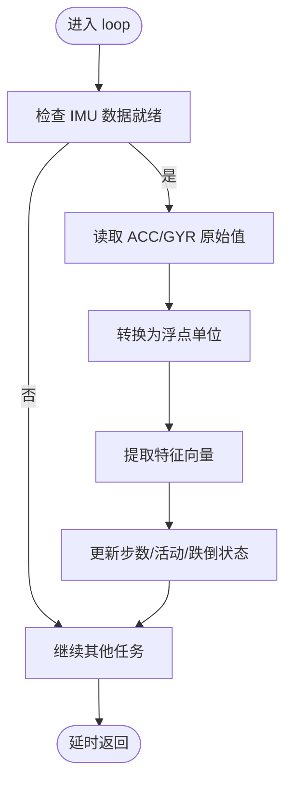
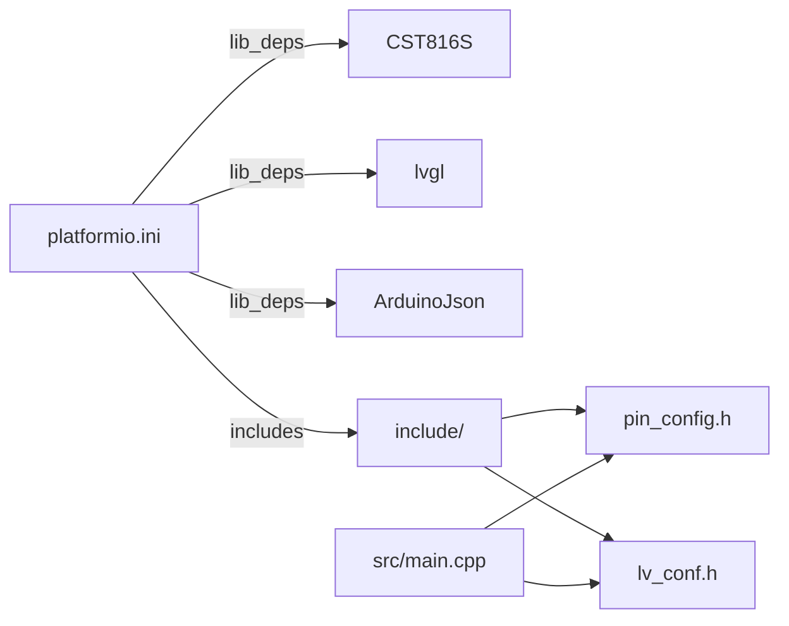

# 快速开始

<cite>
**本文引用的文件**
- [platformio.ini](file://platformio.ini)
- [ESP32-S3-R8-OPI.json](file://boards/ESP32-S3-R8-OPI.json)
- [pin_config.h](file://include/pin_config.h)
- [lv_conf.h](file://include/lv_conf.h)
- [main.cpp](file://src/main.cpp)
- [SensorQMI8658.hpp](file://lib/SensorLib-Waveshare/src/SensorQMI8658.hpp)
- [SensorPCF85063.hpp](file://lib/SensorLib-Waveshare/src/SensorPCF85063.hpp)
- [XPowersLib.h](file://lib/XPowersLib/src/XPowersLib.h)
- [wifi_ntp.h](file://src/service/wifi_ntp.h)
- [ble_srv.h](file://src/service/ble_srv.h)
- [lv_port_disp.h](file://src/lv_port_disp.h)
- [HelloWorld.ino](file://lib/GFX_Library_for_Arduino/examples/HelloWorld/HelloWorld.ino)
- [LVGL_Arduino_v9.ino](file://lib/GFX_Library_for_Arduino/examples/LVGL/LVGL_Arduino_v9/LVGL_Arduino_v9.ino)
</cite>

## 目录
1. [简介](#简介)
2. [项目结构](#项目结构)
3. [核心组件](#核心组件)
4. [架构总览](#架构总览)
5. [详细组件分析](#详细组件分析)
6. [依赖关系分析](#依赖关系分析)
7. [性能与功耗考虑](#性能与功耗考虑)
8. [故障排查指南](#故障排查指南)
9. [结论](#结论)
10. [附录：开发与烧录流程](#附录开发与烧录流程)

## 简介
本指南面向首次接触 SmartBracelet 项目的开发者，提供从开发环境到硬件连接、编译烧录、首次运行验证与常见问题排查的完整路径。项目基于 ESP32-S3 平台，采用 LVGL 图形界面、Arduino_GFX 显示驱动、CST816S 触摸、QMI8658 IMU、PCF85063 RTC、AXP2101 电源管理，并集成 BLE、WiFi、语音通话、OTA 升级等功能。

## 项目结构
- 开发工具与构建：PlatformIO 工程配置位于根目录，包含默认环境、上传端口、编译标志与库依赖。
- 板级定义：boards 目录提供 ESP32-S3 自定义开发板 JSON 描述（含内存类型、分区表、外设支持）。
- 引脚与显示配置：include 目录包含 LVGL 配置与引脚映射头文件。
- 应用入口与服务：src 目录包含主程序、图形与输入端口适配、各类服务模块（BLE、WiFi、OTA、音频、TF 卡等）。
- 外设库：lib 目录包含显示驱动库、传感器库与电源管理库。
- 示例工程：lib/GFX_Library_for_Arduino 提供 Arduino_GFX 与 LVGL 的示例，便于理解显示与触摸集成方式。



**图表来源**
- [platformio.ini](file://platformio.ini#L14-L41)
- [main.cpp](file://src/main.cpp#L615-L722)

**章节来源**
- [platformio.ini](file://platformio.ini#L1-L41)
- [boards/ESP32-S3-R8-OPI.json](file://boards/ESP32-S3-R8-OPI.json#L1-L40)
- [include/pin_config.h](file://include/pin_config.h#L1-L41)
- [include/lv_conf.h](file://include/lv_conf.h#L1-L114)
- [src/main.cpp](file://src/main.cpp#L615-L722)

## 核心组件
- 显示系统：ST7789 LCD + Arduino_ST7789 + Arduino_ESP32SPI；配合 LVGL 与触摸输入驱动。
- 传感器系统：QMI8658 三轴加速度计/陀螺仪；PCF85063 实时时钟。
- 电源管理：AXP2101 电源芯片，提供多路 DC/ACO 稳压与电池监测。
- 通信与网络：CST816S 触摸；WiFi 用于 NTP 同步与天气；BLE 用于数据服务、OTA、语音通话。
- 用户界面：LVGL 8.x，按需启用字体与控件，内存与刷新周期已优化。

**章节来源**
- [main.cpp](file://src/main.cpp#L615-L722)
- [SensorQMI8658.hpp](file://lib/SensorLib-Waveshare/src/SensorQMI8658.hpp#L43-L130)
- [SensorPCF85063.hpp](file://lib/SensorLib-Waveshare/src/SensorPCF85063.hpp#L37-L181)
- [XPowersLib.h](file://lib/XPowersLib/src/XPowersLib.h#L14-L28)
- [lv_port_disp.h](file://src/lv_port_disp.h#L1-L11)

## 架构总览
SmartBracelet 的控制流以主循环为核心，定时处理 LVGL 刷新、BLE/WiFi 任务、传感器数据采集与处理、UI 更新与低功耗策略。显示与触摸通过 Arduino_GFX/LVGL 驱动，传感器与电源由专用库封装，网络与 BLE 服务通过平台框架提供。

```mermaid
sequenceDiagram
participant Boot as "启动流程"
participant Disp as "显示/触摸初始化"
participant IMU as "IMU 初始化"
participant RTC as "RTC 初始化"
participant PMU as "PMU 初始化"
participant BLE as "BLE 服务"
participant WiFi as "WiFi/NTP"
participant Loop as "主循环"
Boot->>Disp: "创建 SPI 总线与 ST7789 显示"
Disp-->>Boot: "显示初始化完成"
Boot->>IMU: "初始化 QMI8658加速度/角速度"
Boot->>RTC: "初始化 PCF85063时间"
Boot->>PMU: "初始化 AXP2101电压/充电"
Boot->>BLE: "初始化 BLE 服务"
Boot->>WiFi: "初始化 WiFi/NTP"
Loop->>Loop: "每帧 LVGL 调度"
Loop->>WiFi: "周期性 NTP 同步"
Loop->>IMU: "读取传感器数据并更新 UI"
Loop->>BLE: "推送电量/步数/活动状态"
Loop->>PMU: "屏幕超时与深睡唤醒"
```

**图表来源**
- [main.cpp](file://src/main.cpp#L615-L722)
- [main.cpp](file://src/main.cpp#L724-L926)

## 详细组件分析

### 显示与触摸（ST7789 + CST816S）
- 引脚映射：LCD 的 DC/CS/SCK/MOSI/RST/BL 与 I2C 的 SDA/SCL、触摸 INT/RST 均在引脚配置中定义。
- 显示初始化：使用 Arduino_ESP32SPI 作为数据总线，Arduino_ST7789 作为控制器，随后初始化 LVGL 与显示端口。
- 触摸初始化：CST816S 通过 I2C 与中断引脚接入，注册为 LVGL 输入设备。



**图表来源**
- [main.cpp](file://src/main.cpp#L628-L654)
- [pin_config.h](file://include/pin_config.h#L5-L21)

**章节来源**
- [pin_config.h](file://include/pin_config.h#L1-L41)
- [main.cpp](file://src/main.cpp#L615-L722)

### IMU（QMI8658）
- 功能：提供加速度与角速度数据，用于步数统计、手腕抬举检测、跌倒检测与活动识别。
- 配置：加速度量程、输出速率、低通滤波与自检；陀螺仪量程、输出速率、低通滤波与自检。
- 数据读取：通过数据就绪信号触发，读取原始值并转换为物理单位。



**图表来源**
- [main.cpp](file://src/main.cpp#L805-L812)
- [SensorQMI8658.hpp](file://lib/SensorLib-Waveshare/src/SensorQMI8658.hpp#L688-L707)

**章节来源**
- [SensorQMI8658.hpp](file://lib/SensorLib-Waveshare/src/SensorQMI8658.hpp#L311-L420)
- [SensorQMI8658.hpp](file://lib/SensorLib-Waveshare/src/SensorQMI8658.hpp#L641-L686)
- [main.cpp](file://src/main.cpp#L805-L812)

### 实时时钟（PCF85063）
- 功能：提供高精度时间信息，支持闹钟与停止/启动控制。
- 使用：上电后若时间早于设定阈值则写入初始时间；可从 NTP 同步后更新 RTC。

**章节来源**
- [SensorPCF85063.hpp](file://lib/SensorLib-Waveshare/src/SensorPCF85063.hpp#L91-L135)
- [main.cpp](file://src/main.cpp#L113-L117)
- [main.cpp](file://src/main.cpp#L656-L659)

### 电源管理（AXP2101）
- 功能：多路稳压输出、电池监测、充电控制、中断与唤醒。
- 使用：初始化后关闭非必要电源域，仅保留关键负载；根据屏幕状态与 USB 连接决定深睡策略。

**章节来源**
- [XPowersLib.h](file://lib/XPowersLib/src/XPowersLib.h#L14-L28)
- [main.cpp](file://src/main.cpp#L670-L716)
- [main.cpp](file://src/main.cpp#L882-L898)

### 网络与 BLE（WiFi/NTP + BLE 服务）
- WiFi：自动连接指定 SSID/密码，周期性进行 NTP 同步；为省电采用“按需开启”策略。
- BLE：提供数据服务（电量、步数、活动）、OTA 状态推送、通知转发、语音命令回调、IMU 特征上报。

**章节来源**
- [wifi_ntp.h](file://src/service/wifi_ntp.h#L6-L25)
- [ble_srv.h](file://src/service/ble_srv.h#L1-L50)
- [main.cpp](file://src/main.cpp#L718-L721)
- [main.cpp](file://src/main.cpp#L724-L764)
- [main.cpp](file://src/main.cpp#L850-L871)

## 依赖关系分析
- 构建与库依赖：platformio.ini 中声明了 Arduino 框架、ESP32 平台版本、库依赖（CST816S、lvgl、ArduinoJson），并设置 include/lib 目录。
- 板级定义：ESP32-S3-R8-OPI.json 定义了内存类型、分区表、外设支持与上传参数，确保与实际硬件匹配。
- 引脚与显示：pin_config.h 将硬件引脚与逻辑模块绑定；lv_conf.h 控制 LVGL 内存与渲染参数。



**图表来源**
- [platformio.ini](file://platformio.ini#L37-L41)
- [boards/ESP32-S3-R8-OPI.json](file://boards/ESP32-S3-R8-OPI.json#L1-L40)
- [include/pin_config.h](file://include/pin_config.h#L1-L41)
- [include/lv_conf.h](file://include/lv_conf.h#L1-L114)

**章节来源**
- [platformio.ini](file://platformio.ini#L1-L41)
- [boards/ESP32-S3-R8-OPI.json](file://boards/ESP32-S3-R8-OPI.json#L1-L40)

## 性能与功耗考虑
- LVGL 参数：内存缓冲大小、帧刷新周期、字体集已按 240x284 ST7789 优化，减少内存占用与带宽压力。
- 传感器采样：IMU 以较高频率采集，但通过特征提取与 BLE 上报节流避免频繁传输。
- WiFi 省电：仅在需要时开启，同步与天气更新后关闭，周期性唤醒以维持时间。
- 屏幕与深睡：屏幕超时关闭背光；USB 连接时避免深睡；无 USB 时在长时间无活动后进入深睡并以触摸或定时器唤醒。

**章节来源**
- [include/lv_conf.h](file://include/lv_conf.h#L21-L46)
- [main.cpp](file://src/main.cpp#L833-L898)

## 故障排查指南
- 显示不亮/花屏
  - 检查 LCD_BL 引脚与背光控制逻辑。
  - 确认 SPI 引脚与 ST7789 初始化顺序。
  - 参考示例工程验证显示驱动是否正常。
  - 参考：[main.cpp](file://src/main.cpp#L615-L650)，[HelloWorld.ino](file://lib/GFX_Library_for_Arduino/examples/HelloWorld/HelloWorld.ino#L41-L79)
- 触摸无响应
  - 确认 TP_INT 与 TP_RST 引脚连接正确。
  - 检查 I2C 地址与 SDA/SCL 引脚映射。
  - 参考：[pin_config.h](file://include/pin_config.h#L17-L21)，[main.cpp](file://src/main.cpp#L652-L654)
- 时间不同步
  - 检查 WiFi 凭据与可用性，确认 NTP 服务器可达。
  - 参考：[wifi_ntp.h](file://src/service/wifi_ntp.h#L6-L9)，[main.cpp](file://src/main.cpp#L743-L746)
- 电量异常/无法充电
  - 检查 AXP2101 初始化与寄存器状态，确认 USB 连接与充电使能。
  - 参考：[XPowersLib.h](file://lib/XPowersLib/src/XPowersLib.h#L14-L28)，[main.cpp](file://src/main.cpp#L670-L716)
- 步数/活动不更新
  - 确认 IMU 初始化与数据就绪信号，检查特征提取与 BLE 推送。
  - 参考：[SensorQMI8658.hpp](file://lib/SensorLib-Waveshare/src/SensorQMI8658.hpp#L688-L707)，[main.cpp](file://src/main.cpp#L805-L812)

## 结论
通过本指南，您可以在 ESP32-S3 平台上快速搭建 SmartBracelet 开发环境，完成硬件连接与软件编译烧录，并验证显示、触摸、传感器、电源与网络功能。建议在首次运行前先参考示例工程熟悉显示与触摸集成方式，再逐步接入传感器与电源管理模块。

## 附录：开发与烧录流程

### 一、开发环境搭建
- 安装 PlatformIO IDE（VSCode 扩展或独立 IDE）。
- 克隆仓库并在 PlatformIO 中打开工程根目录。
- 确认 platformio.ini 中的默认环境、上传端口与编译标志符合当前硬件与需求。
- 若使用自定义开发板，将 boards/ESP32-S3-R8-OPI.json 放入用户目录的 boards 目录下，或直接在工程内维护。

**章节来源**
- [platformio.ini](file://platformio.ini#L11-L36)
- [boards/ESP32-S3-R8-OPI.json](file://boards/ESP32-S3-R8-OPI.json#L1-L40)

### 二、硬件连接与引脚配置
- ST7789 LCD：使用 pin_config.h 中定义的 DC/CS/SCK/MOSI/RST/BL 引脚连接开发板 SPI 与 GPIO。
- I2C：使用 SDA/SCL 连接 PCF85063 与时序要求一致的上拉电阻。
- 触摸 CST816S：I2C 连接 SDA/SCL，RST/INT 分别连接开发板 GPIO。
- TF 卡（可选）：SDMMC 1-bit 模式引脚按 pin_config.h 配置连接。
- 音频（可选）：ES8311 与 INMP441 I2S 引脚按 pin_config.h 配置连接。

**章节来源**
- [pin_config.h](file://include/pin_config.h#L5-L41)

### 三、编译与烧录
- 在 PlatformIO 中选择环境 “esp32s3”，点击“构建”生成固件。
- 确认上传端口（COM9 或目标串口）与上传速度设置正确。
- 点击“上传”烧录固件；如需监控串口输出，可在 Monitor 中查看日志。

**章节来源**
- [platformio.ini](file://platformio.ini#L14-L36)

### 四、首次运行与验证
- 串口监视器观察启动日志，确认显示初始化、触摸初始化、IMU/RTC/PMU 初始化成功。
- 检查 LVGL 界面是否显示时间、日期、电量与步数。
- 验证手势滑动切换页面、点击唤醒屏幕。
- 测试 WiFi 连接与 NTP 同步、BLE 连接与数据服务推送。
- 如需 OTA，可通过 BLE 发送命令触发升级流程。

**章节来源**
- [main.cpp](file://src/main.cpp#L615-L722)
- [main.cpp](file://src/main.cpp#L724-L926)
- [wifi_ntp.h](file://src/service/wifi_ntp.h#L11-L25)
- [ble_srv.h](file://src/service/ble_srv.h#L6-L48)

### 五、示例参考
- Arduino_GFX 显示示例：验证显示驱动与背光控制。
- LVGL 与触摸示例：学习显示缓冲与触摸输入集成方式。

**章节来源**
- [HelloWorld.ino](file://lib/GFX_Library_for_Arduino/examples/HelloWorld/HelloWorld.ino#L41-L79)
- [LVGL_Arduino_v9.ino](file://lib/GFX_Library_for_Arduino/examples/LVGL/LVGL_Arduino_v9/LVGL_Arduino_v9.ino#L119-L225)