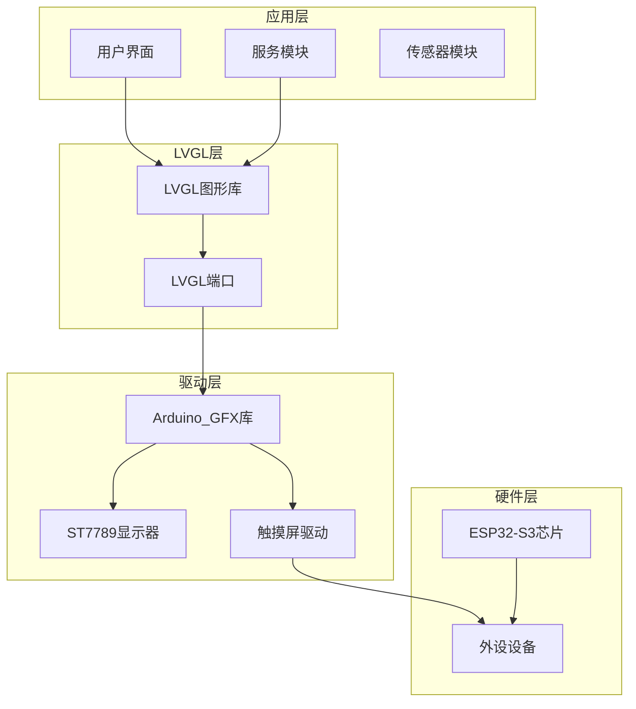
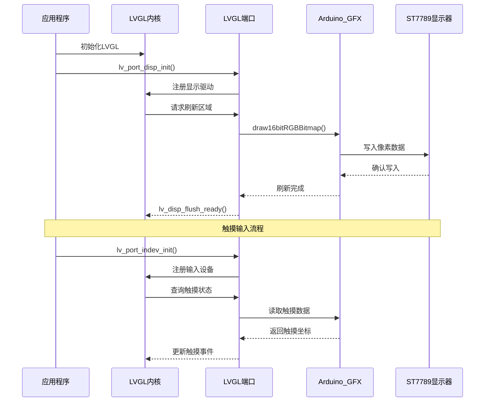
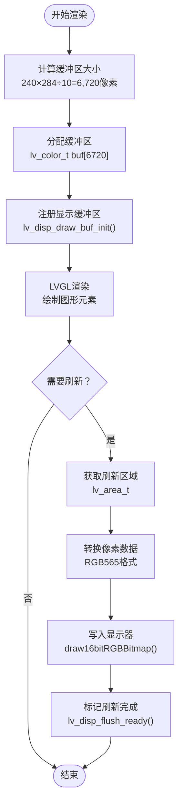
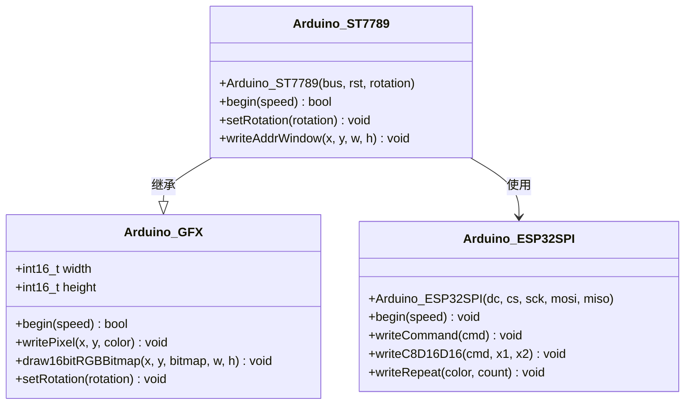
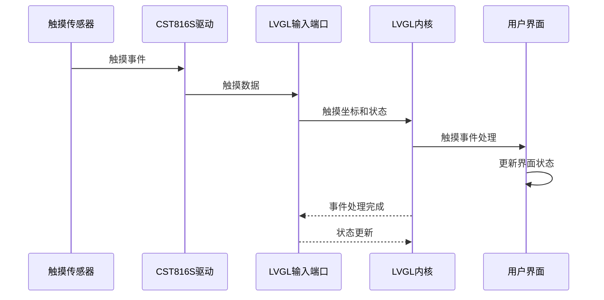
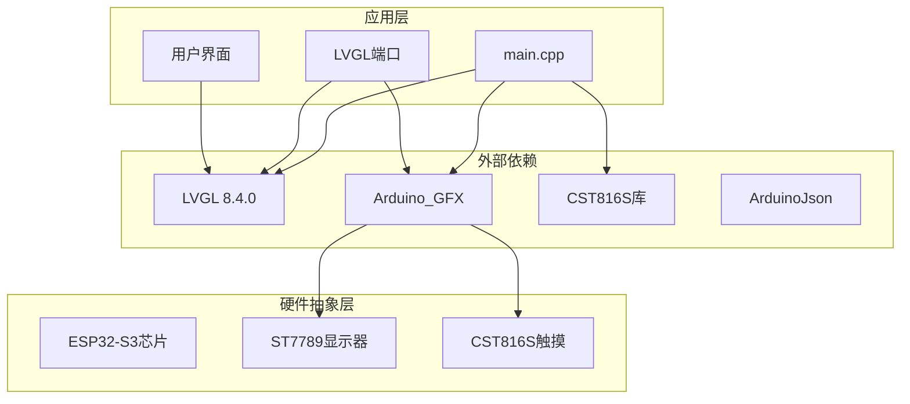

# LVGL图形库集成

<cite>
**本文档引用的文件**
- [lv_conf.h](file://include/lv_conf.h)
- [pin_config.h](file://include/pin_config.h)
- [lv_port_disp.h](file://src/lv_port_disp.h)
- [lv_port_disp.cpp](file://src/lv_port_disp.cpp)
- [lv_port_indev.h](file://src/lv_port_indev.h)
- [lv_port_indev.cpp](file://src/lv_port_indev.cpp)
- [main.cpp](file://src/main.cpp)
- [ESP32-S3-R8-OPI.json](file://boards/ESP32-S3-R8-OPI.json)
- [platformio.ini](file://platformio.ini)
- [Arduino_GFX.h](file://lib/GFX_Library_for_Arduino/src/Arduino_GFX.h)
- [Arduino_ST7789.h](file://lib/GFX_Library_for_Arduino/src/display/Arduino_ST7789.h)
- [DEBUG_REPORT.md](file://DEBUG_REPORT.md)
</cite>

## 目录
1. [简介](#简介)
2. [项目结构](#项目结构)
3. [核心组件](#核心组件)
4. [架构概览](#架构概览)
5. [详细组件分析](#详细组件分析)
6. [依赖关系分析](#依赖关系分析)
7. [性能考虑](#性能考虑)
8. [故障排除指南](#故障排除指南)
9. [结论](#结论)

## 简介

SmartBracelet项目是一个基于ESP32-S3的智能手环项目，集成了LVGL图形库和Arduino_GFX库来实现高效的图形界面显示。本文档详细解释了LVGL在ESP32-S3上的完整移植过程，包括显示驱动初始化、缓冲区配置、刷新回调函数实现等关键技术细节。

该项目采用ESP32-S3芯片（240×284分辨率的ST7789显示器），通过Arduino_GFX库提供的底层驱动接口，实现了与LVGL图形库的无缝集成。系统支持触摸输入、电池管理、传感器数据处理等多种功能。

## 项目结构

SmartBracelet项目的整体架构采用模块化设计，主要分为以下几个层次：

**图表来源**
- [main.cpp](file://src/main.cpp#L615-L722)
- [lv_port_disp.cpp](file://src/lv_port_disp.cpp#L22-L32)
- [lv_port_indev.cpp](file://src/lv_port_indev.cpp#L21-L27)

**章节来源**
- [main.cpp](file://src/main.cpp#L615-L722)
- [platformio.ini](file://platformio.ini#L14-L41)

## 核心组件

### 显示驱动组件

显示驱动组件是LVGL集成的核心部分，负责将LVGL渲染的图形数据传输到物理显示器。该组件包括以下关键要素：

- **缓冲区配置**：使用单缓冲模式，缓冲区大小为屏幕总像素数的1/10
- **刷新回调**：实现LVGL的flush回调函数，将数据写入Arduino_GFX驱动
- **分辨率设置**：针对240×284的ST7789显示器进行优化配置

### 输入设备组件

输入设备组件负责处理触摸输入，为LVGL提供交互能力：

- **触摸传感器**：使用CST816S触摸控制器
- **坐标映射**：将物理触摸坐标转换为LVGL坐标系统
- **事件处理**：处理按下、释放等触摸事件

### 配置管理系统

配置管理系统提供了完整的LVGL配置参数设置：

- **颜色深度**：16位RGB565格式
- **内存分配**：64KB堆内存，16个内存缓冲区
- **刷新周期**：30ms默认刷新间隔

**章节来源**
- [lv_port_disp.cpp](file://src/lv_port_disp.cpp#L5-L32)
- [lv_port_indev.cpp](file://src/lv_port_indev.cpp#L6-L27)
- [lv_conf.h](file://include/lv_conf.h#L14-L35)

## 架构概览

LVGL在SmartBracelet中的架构实现采用了分层设计，确保了良好的模块化和可维护性：

**图表来源**
- [lv_port_disp.cpp](file://src/lv_port_disp.cpp#L11-L20)
- [lv_port_indev.cpp](file://src/lv_port_indev.cpp#L6-L19)
- [main.cpp](file://src/main.cpp#L644-L654)

## 详细组件分析

### LVGL配置参数详解

LVGL配置文件提供了完整的图形库配置选项，针对SmartBracelet的硬件特性进行了优化：

#### 颜色配置
- **颜色深度**：16位RGB565格式，节省内存占用
- **颜色交换**：禁用字节交换，提高性能
- **透明度支持**：禁用屏幕透明度，简化渲染流程

#### 内存配置
- **内存大小**：64KB，适合ESP32-S3的内存限制
- **缓冲区数量**：最多16个内存缓冲区
- **自定义内存管理**：使用LVGL默认内存管理器

#### HAL配置
- **显示刷新周期**：30ms，默认刷新间隔
- **输入设备周期**：30ms，触摸轮询间隔
- **系统时间源**：使用millis()函数作为时间基准
- **DPI设置**：130 DPI，适配小尺寸显示器

#### 绘制配置
- **复杂绘制**：启用复杂图形支持
- **阴影缓存**：禁用阴影缓存，节省内存
- **圆形缓存**：4个圆形缓存项
- **图层缓冲**：简单图层缓冲24KB，回退缓冲3KB

#### 字体配置
- **字体支持**：蒙特serrat系列8-32号字体
- **CJK字体**：支持中文字体
- **默认字体**：14号蒙特serrat字体
- **文本编码**：UTF-8编码支持

**章节来源**
- [lv_conf.h](file://include/lv_conf.h#L14-L106)

### 显示缓冲区工作机制

SmartBracelet采用了优化的显示缓冲区策略，平衡了内存使用和性能需求：

**图表来源**
- [lv_port_disp.cpp](file://src/lv_port_disp.cpp#L5-L20)

#### 双缓冲机制说明

虽然当前实现使用单缓冲模式，但LVGL框架天然支持双缓冲机制。在单缓冲模式下：
- 使用一个主缓冲区存储完整的帧数据
- 刷新时直接将缓冲区内容写入显示器
- 简化了内存管理，但可能影响渲染性能

#### 内存优化策略

针对ESP32-S3的内存限制，采用了以下优化策略：
- **缓冲区大小优化**：使用屏幕总像素数的1/10作为缓冲区大小
- **颜色格式选择**：16位RGB565格式减少内存占用
- **字体裁剪**：仅启用必要的字体大小，避免加载不使用的字体

**章节来源**
- [lv_port_disp.cpp](file://src/lv_port_disp.cpp#L5-L32)

### Arduino_GFX库集成方案

Arduino_GFX库为SmartBracelet提供了强大的底层显示驱动支持：

#### 底层驱动适配

**图表来源**
- [Arduino_GFX.h](file://lib/GFX_Library_for_Arduino/src/Arduino_GFX.h#L167-L200)
- [Arduino_ST7789.h](file://lib/GFX_Library_for_Arduino/src/display/Arduino_ST7789.h#L122-L144)

#### 像素格式转换

Arduino_GFX库提供了高效的像素格式转换功能：
- **RGB565格式**：16位颜色深度，节省内存
- **RGB888到RGB565转换**：自动颜色空间转换
- **批量像素写入**：优化的DMA传输支持

#### 绘图API封装

LVGL通过Arduino_GFX的绘图API实现高效的图形渲染：
- **位图绘制**：`draw16bitRGBBitmap()`函数
- **矩形填充**：`writeFillRectPreclipped()`函数
- **线条绘制**：`writeLine()`函数

**章节来源**
- [Arduino_GFX.h](file://lib/GFX_Library_for_Arduino/src/Arduino_GFX.h#L167-L200)
- [Arduino_ST7789.h](file://lib/GFX_Library_for_Arduino/src/display/Arduino_ST7789.h#L122-L144)

### 触摸输入系统

触摸输入系统为SmartBracelet提供了直观的用户交互能力：

**图表来源**
- [lv_port_indev.cpp](file://src/lv_port_indev.cpp#L6-L19)
- [main.cpp](file://src/main.cpp#L652-L654)

#### 触摸坐标映射

触摸坐标需要进行精确的映射以适配LVGL坐标系统：
- **坐标范围**：从0到屏幕宽度/高度减1
- **方向适配**：根据显示器旋转角度调整坐标
- **压力检测**：区分按下和释放状态

#### 事件处理机制

触摸事件通过LVGL的事件系统进行处理：
- **状态跟踪**：跟踪触摸点的按下/释放状态
- **坐标更新**：实时更新触摸坐标
- **事件分发**：将触摸事件分发给相应的UI组件

**章节来源**
- [lv_port_indev.cpp](file://src/lv_port_indev.cpp#L6-L27)

## 依赖关系分析

SmartBracelet项目的依赖关系体现了清晰的分层架构：

**图表来源**
- [platformio.ini](file://platformio.ini#L37-L40)
- [main.cpp](file://src/main.cpp#L1-L28)

### 版本兼容性

项目采用的LVGL版本为8.4.0，与Arduino_GFX库保持良好的兼容性：

- **LVGL版本**：8.4.0，稳定版本，功能完整
- **Arduino_GFX版本**：支持多种显示器驱动
- **ESP32-S3支持**：完整的ESP32-S3平台支持
- **编译器兼容**：支持ESP-IDF和Arduino框架

### 平台配置

ESP32-S3开发板的配置针对SmartBracelet进行了优化：

- **内存类型**：QIO OPI，支持外部PSRAM
- **Flash大小**：16MB，满足应用程序存储需求
- **CPU频率**：240MHz，提供充足的处理能力
- **PSRAM**：8MB OPI，扩展内存容量

**章节来源**
- [platformio.ini](file://platformio.ini#L14-L41)
- [ESP32-S3-R8-OPI.json](file://boards/ESP32-S3-R8-OPI.json#L1-L40)

## 性能考虑

SmartBracelet在性能优化方面采用了多项策略：

### 内存管理优化

- **缓冲区大小**：使用屏幕总像素数的1/10作为缓冲区大小，平衡内存使用和性能
- **颜色深度**：16位RGB565格式减少内存占用约50%
- **字体裁剪**：仅加载必要的字体大小，避免不必要的内存消耗

### 刷新性能优化

- **刷新周期**：30ms刷新间隔，在流畅性和功耗之间取得平衡
- **区域刷新**：LVGL只刷新发生变化的区域，减少不必要的写操作
- **DMA传输**：Arduino_GFX库支持DMA传输，提高数据传输效率

### 功耗优化

- **背光控制**：通过GPIO控制显示器背光，支持动态亮度调节
- **休眠模式**：在空闲状态下降低系统功耗
- **触摸唤醒**：通过触摸事件唤醒系统

## 故障排除指南

### 常见集成问题及解决方案

#### 1. 触摸驱动问题

**问题描述**：触摸功能异常或无响应

**解决方案**：
- 验证I2C连接和引脚配置
- 检查CST816S驱动库版本兼容性
- 确认I2C地址配置正确

**章节来源**
- [DEBUG_REPORT.md](file://DEBUG_REPORT.md#L514-L551)

#### 2. 显示器初始化失败

**问题描述**：显示器无法正常启动

**解决方案**：
- 检查SPI连接和引脚配置
- 验证显示器供电和复位电路
- 确认初始化序列正确执行

#### 3. LVGL内存不足

**问题描述**：LVGL运行时出现内存不足错误

**解决方案**：
- 减少启用的字体大小
- 关闭不需要的LVGL功能
- 优化UI组件的复杂度

#### 4. 刷新性能问题

**问题描述**：界面刷新缓慢或卡顿

**解决方案**：
- 调整LVGL刷新周期
- 减少同时渲染的UI元素数量
- 优化自定义绘制代码

### 调试技巧

#### 日志输出

启用LVGL日志功能可以帮助诊断问题：
- 设置日志级别为警告或信息级别
- 使用自定义打印回调函数
- 监控内存使用情况

#### 性能监控

使用性能监控工具：
- 监控帧率和刷新时间
- 分析内存使用峰值
- 检查CPU利用率

**章节来源**
- [lv_conf.h](file://include/lv_conf.h#L88-L92)

## 结论

SmartBracelet项目成功实现了LVGL图形库在ESP32-S3平台上的完整集成。通过精心设计的架构和优化的配置，项目在有限的硬件资源下实现了流畅的图形界面和良好的用户体验。

### 主要成就

1. **完整的LVGL集成**：实现了从底层驱动到用户界面的完整链路
2. **性能优化**：通过合理的缓冲区配置和刷新策略，在保证性能的同时控制内存使用
3. **模块化设计**：清晰的分层架构便于维护和扩展
4. **硬件适配**：针对ESP32-S3和ST7789显示器进行了专门优化

### 技术亮点

- **内存效率**：64KB内存配置支持完整的图形界面
- **刷新性能**：30ms刷新周期提供流畅的用户体验
- **触摸交互**：精确的触摸坐标映射和事件处理
- **扩展性**：模块化的架构支持功能扩展

### 未来改进方向

1. **双缓冲支持**：考虑实现双缓冲机制进一步提升性能
2. **更多字体**：根据需要添加更多字体支持
3. **动画效果**：实现更丰富的动画和过渡效果
4. **多语言支持**：增强国际化字符显示能力

通过本次集成，SmartBracelet项目为嵌入式图形界面开发提供了优秀的参考实现，展示了如何在资源受限的环境中实现高质量的图形用户界面。