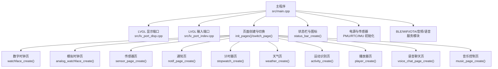
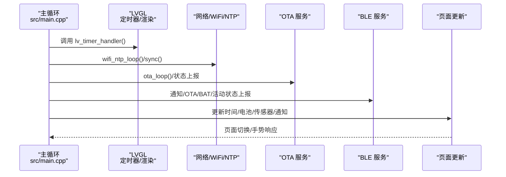
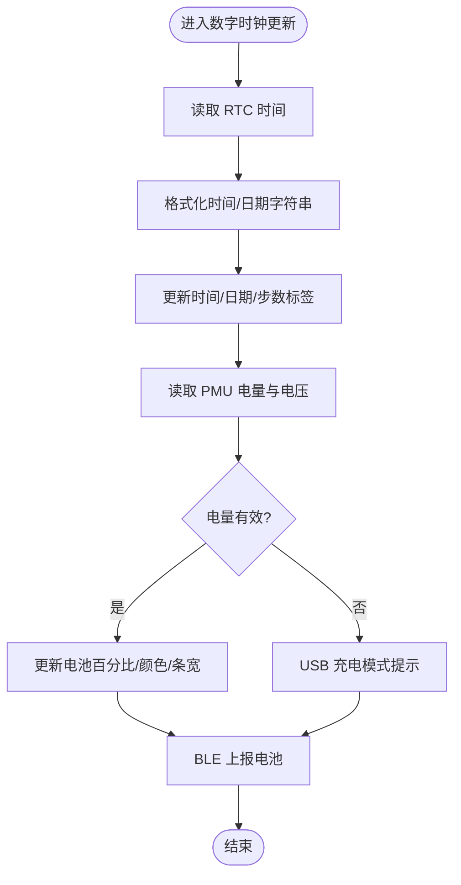
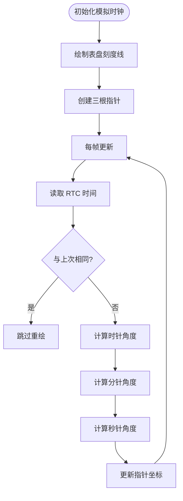
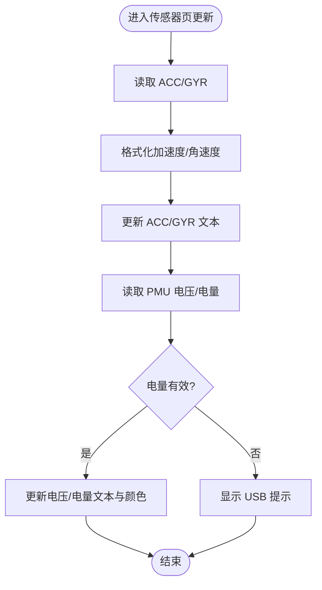
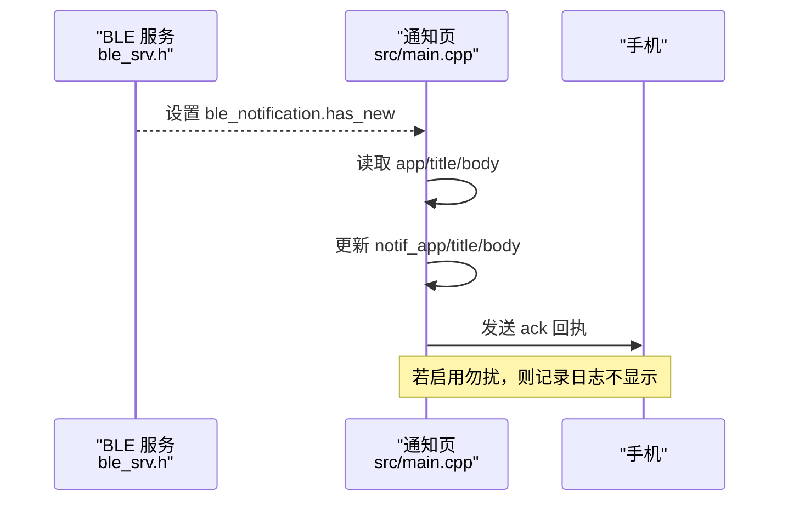
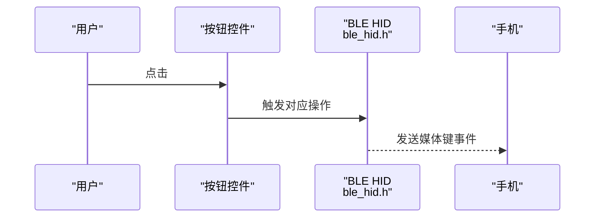
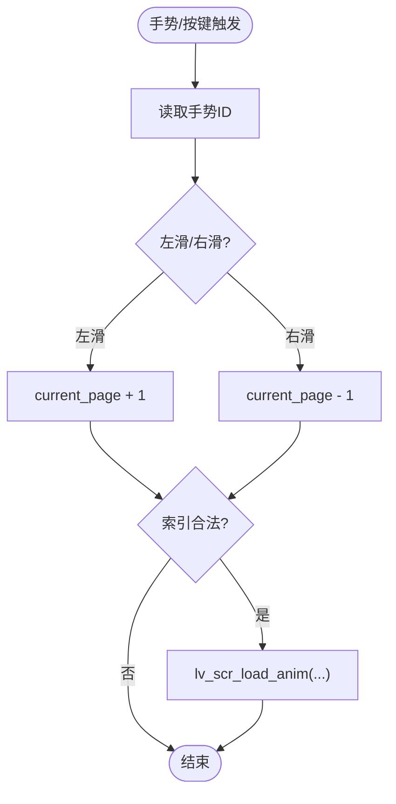
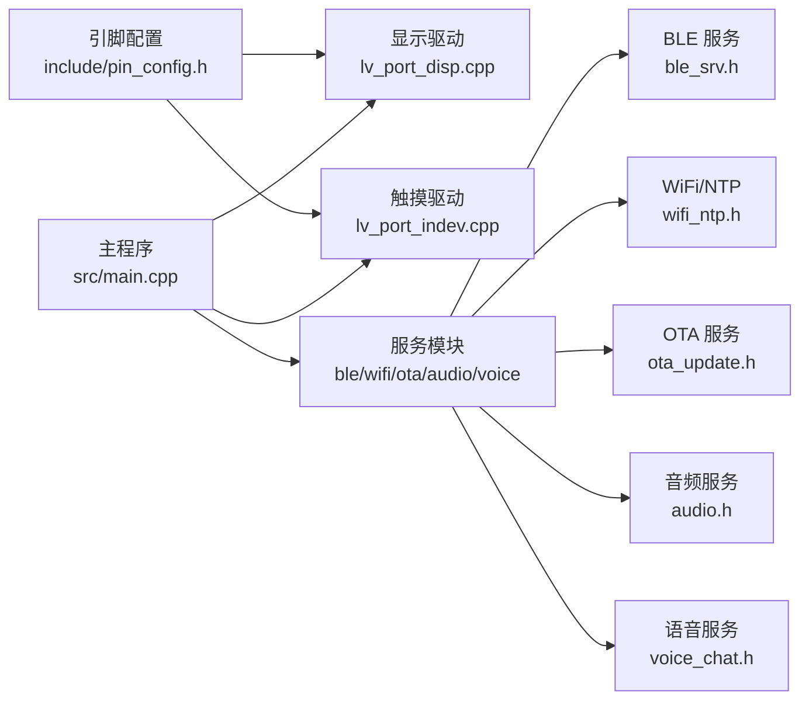

# UI页面管理系统

<cite>
**本文引用的文件**
- [src/main.cpp](file://src/main.cpp)
- [src/activity.cpp](file://src/activity.cpp)
- [src/activity.h](file://src/activity.h)
- [src/lv_port_disp.cpp](file://src/lv_port_disp.cpp)
- [src/lv_port_indev.cpp](file://src/lv_port_indev.cpp)
- [src/weather.h](file://src/weather.h)
- [src/player.h](file://src/player.h)
- [src/stopwatch.h](file://src/stopwatch.h)
- [src/voice_chat_ui.h](file://src/voice_chat_ui.h)
- [include/pin_config.h](file://include/pin_config.h)
- [src/service/wifi_ntp.h](file://src/service/wifi_ntp.h)
- [src/service/ble_srv.h](file://src/service/ble_srv.h)
- [src/service/audio.h](file://src/service/audio.h)
- [src/service/ota_update.h](file://src/service/ota_update.h)
- [src/service/voice_chat.h](file://src/service/voice_chat.h)
</cite>

## 目录
1. [简介](#简介)
2. [项目结构](#项目结构)
3. [核心组件](#核心组件)
4. [架构总览](#架构总览)
5. [详细组件分析](#详细组件分析)
6. [依赖关系分析](#依赖关系分析)
7. [性能考虑](#性能考虑)
8. [故障排查指南](#故障排查指南)
9. [结论](#结论)
10. [附录：页面自定义开发指南](#附录页面自定义开发指南)

## 简介
本文件为 SmartBracelet 的 UI 页面管理系统技术文档，聚焦于基于 LVGL 的页面架构设计与实现，涵盖页面生命周期管理、页面切换机制、页面状态保存与恢复策略；深入解析数字时钟、模拟时钟、传感器监控、通知、音乐控制等页面的具体实现；说明页面间导航逻辑（返回栈、页面优先级、内存回收）；并提供页面自定义开发指南与性能优化建议。

## 项目结构
SmartBracelet 的 UI 层以 LVGL 为核心，通过设备抽象层驱动屏幕与触摸输入，并在主循环中调度各子系统（BLE、WiFi、OTA、音频、语音等）。页面由主程序集中初始化与切换，采用固定数组管理多个页面对象，支持滑动切换与状态栏更新。

图表来源
- [src/main.cpp](file://src/main.cpp#L406-L419)
- [src/lv_port_disp.cpp](file://src/lv_port_disp.cpp#L22-L32)
- [src/lv_port_indev.cpp](file://src/lv_port_indev.cpp#L21-L27)

章节来源
- [src/main.cpp](file://src/main.cpp#L406-L419)
- [src/lv_port_disp.cpp](file://src/lv_port_disp.cpp#L22-L32)
- [src/lv_port_indev.cpp](file://src/lv_port_indev.cpp#L21-L27)

## 核心组件
- 页面容器与生命周期
  - 页面数组管理：固定大小数组存储页面对象，便于快速切换与统一生命周期管理。
  - 页面创建函数：每个页面提供独立的创建函数，负责构建 UI 元素与初始状态。
  - 页面切换函数：支持左右滑动切换，使用 LVGL 动画参数实现流畅过渡。
- 状态栏与全局控件
  - 状态栏包含 WiFi/蓝牙图标、电池条与百分比、充电状态、页面指示点等。
- 传感器与电源
  - 电池电压与电量读取、充电状态检测、步数统计与腕抬唤醒。
- 交互与手势
  - 触摸输入通过 LVGL 输入端口上报，主程序根据手势 ID 执行页面切换。

章节来源
- [src/main.cpp](file://src/main.cpp#L406-L419)
- [src/main.cpp](file://src/main.cpp#L448-L455)
- [src/main.cpp](file://src/main.cpp#L119-L180)
- [src/main.cpp](file://src/main.cpp#L517-L547)
- [src/lv_port_indev.cpp](file://src/lv_port_indev.cpp#L6-L19)

## 架构总览
UI 页面管理系统围绕主循环展开，主循环负责：
- 调度 LVGL 定时器与渲染
- 同步时间与网络状态（WiFi/NTP）
- 处理 OTA 状态并向 BLE 上报
- 更新传感器数据与步数统计
- 响应通知与语音聊天状态
- 控制屏幕背光与休眠

图表来源
- [src/main.cpp](file://src/main.cpp#L724-L800)
- [src/service/wifi_ntp.h](file://src/service/wifi_ntp.h#L11-L25)
- [src/service/ota_update.h](file://src/service/ota_update.h#L29-L35)
- [src/service/ble_srv.h](file://src/service/ble_srv.h#L6-L48)

## 详细组件分析

### 数字时钟页面
- 功能要点
  - 实时显示时间与日期，颜色随电量阈值变化。
  - 步数与电池状态动态更新，支持 USB 充电模式提示。
  - WiFi 连接状态通过状态栏图标显示。
- 数据流
  - 从 RTC 读取时间，格式化后写入标签。
  - 从 PMU 读取电量与充电状态，更新电池条与文本。
  - 通过 BLE 服务上报电池信息。

图表来源
- [src/main.cpp](file://src/main.cpp#L457-L508)
- [src/service/ble_srv.h](file://src/service/ble_srv.h#L7-L9)

章节来源
- [src/main.cpp](file://src/main.cpp#L457-L508)

### 模拟时钟页面
- 功能要点
  - 绘制表盘刻度与三根指针（时/分/秒），仅在时间变化时重绘。
  - 使用三角函数计算指针末端坐标，保证平滑旋转。
- 绘制算法
  - 表盘刻度：按 30° 间隔生成内外两点连线。
  - 指针：以中心点为基准，按角度与长度计算终点坐标。
  - 更新策略：缓存上一次时/分/秒，未变化则跳过重绘。

图表来源
- [src/main.cpp](file://src/main.cpp#L244-L266)
- [src/main.cpp](file://src/main.cpp#L268-L287)

章节来源
- [src/main.cpp](file://src/main.cpp#L244-L287)

### 传感器监控页面
- 功能要点
  - 实时显示加速度、角速度与电池电压/电量。
  - 电量有效性校验，避免浮空噪声误导。
- 数据流
  - 从 IMU 读取原始数据，格式化后写入标签。
  - 从 PMU 读取电压与电量，进行范围校验后更新。

图表来源
- [src/main.cpp](file://src/main.cpp#L435-L446)

章节来源
- [src/main.cpp](file://src/main.cpp#L435-L446)

### 通知页面
- 功能要点
  - 显示应用标识、标题与正文，支持长文本换行。
  - 支持“勿扰”模式，抑制通知显示但保留回执。
- 数据流
  - 从 BLE 服务接收通知结构体，填充标签。
  - 将回执消息通过 BLE 发送手机确认。

图表来源
- [src/main.cpp](file://src/main.cpp#L289-L311)
- [src/main.cpp](file://src/main.cpp#L313-L319)
- [src/service/ble_srv.h](file://src/service/ble_srv.h#L22-L29)

章节来源
- [src/main.cpp](file://src/main.cpp#L289-L319)
- [src/service/ble_srv.h](file://src/service/ble_srv.h#L22-L29)

### 音乐控制页面
- 功能要点
  - 提供上一首/播放暂停/下一首/音量增减按钮。
  - 事件回调直接调用 BLE HID 接口发送按键事件。
- 交互行为
  - 每个按钮绑定点击事件，触发对应 HID 操作。

图表来源
- [src/main.cpp](file://src/main.cpp#L321-L404)
- [src/service/ble_srv.h](file://src/service/ble_srv.h#L39-L40)

章节来源
- [src/main.cpp](file://src/main.cpp#L321-L404)

### 计时器/播放器/语音聊天/天气/运动识别页面
- 页面接口约定
  - 每个页面提供 create 与 update 函数，create 负责 UI 构建，update 负责数据刷新。
- 页面职责
  - 计时器：提供启动/停止/复位与显示。
  - 播放器：媒体播放控制与状态显示。
  - 语音聊天：录音/等待/回复状态与文本展示。
  - 天气：拉取与展示天气信息。
  - 运动识别：AI 推理与置信度展示。

章节来源
- [src/stopwatch.h](file://src/stopwatch.h#L1-L6)
- [src/player.h](file://src/player.h#L1-L6)
- [src/voice_chat_ui.h](file://src/voice_chat_ui.h#L1-L6)
- [src/weather.h](file://src/weather.h#L1-L7)
- [src/activity.cpp](file://src/activity.cpp#L78-L105)
- [src/activity.h](file://src/activity.h#L1-L13)

### 页面切换机制与导航
- 切换实现
  - 通过当前页索引与方向参数选择目标页面，使用 LVGL 动画完成左右滑动切换。
- 导航策略
  - 仅在合法范围内切换（0..NUM_PAGES-1），避免越界。
- 返回栈与优先级
  - 当前实现为顺序索引切换，未见显式返回栈结构；可通过扩展维护一个栈或优先级队列实现更复杂导航。

图表来源
- [src/main.cpp](file://src/main.cpp#L510-L514)
- [src/main.cpp](file://src/main.cpp#L448-L455)

章节来源
- [src/main.cpp](file://src/main.cpp#L448-L455)
- [src/main.cpp](file://src/main.cpp#L510-L514)

### 页面状态保存与恢复
- 保存策略
  - 主程序集中管理页面对象数组，页面切换即加载对应对象，天然具备“恢复到上次布局”的能力。
- 恢复策略
  - 页面创建函数负责初始化 UI；更新函数负责刷新数据；若需持久化用户设置，可在页面内引入本地存储或通过 BLE 服务同步。

章节来源
- [src/main.cpp](file://src/main.cpp#L406-L419)

## 依赖关系分析
- 设备与显示
  - 屏幕驱动与 LVGL 显示缓冲通过端口层对接，配置分辨率与刷新回调。
- 输入与交互
  - 触摸驱动通过 LVGL 输入端口上报坐标与按下状态，主程序解析手势并执行页面切换。
- 传感器与电源
  - PMU/RTC/IMU 初始化与数据读取贯穿主循环，为多页面提供基础数据。
- 服务与通信
  - BLE/WiFi/OTA/音频/语音等服务模块通过头文件接口与主程序耦合，主循环统一调度。

图表来源
- [include/pin_config.h](file://include/pin_config.h#L1-L41)
- [src/lv_port_disp.cpp](file://src/lv_port_disp.cpp#L22-L32)
- [src/lv_port_indev.cpp](file://src/lv_port_indev.cpp#L21-L27)
- [src/main.cpp](file://src/main.cpp#L615-L722)
- [src/service/ble_srv.h](file://src/service/ble_srv.h#L1-L50)
- [src/service/wifi_ntp.h](file://src/service/wifi_ntp.h#L1-L26)
- [src/service/ota_update.h](file://src/service/ota_update.h#L1-L36)
- [src/service/audio.h](file://src/service/audio.h#L1-L23)
- [src/service/voice_chat.h](file://src/service/voice_chat.h#L1-L15)

章节来源
- [include/pin_config.h](file://include/pin_config.h#L1-L41)
- [src/lv_port_disp.cpp](file://src/lv_port_disp.cpp#L22-L32)
- [src/lv_port_indev.cpp](file://src/lv_port_indev.cpp#L21-L27)
- [src/main.cpp](file://src/main.cpp#L615-L722)
- [src/service/ble_srv.h](file://src/service/ble_srv.h#L1-L50)
- [src/service/wifi_ntp.h](file://src/service/wifi_ntp.h#L1-L26)
- [src/service/ota_update.h](file://src/service/ota_update.h#L1-L36)
- [src/service/audio.h](file://src/service/audio.h#L1-L23)
- [src/service/voice_chat.h](file://src/service/voice_chat.h#L1-L15)

## 性能考虑
- 渲染与内存
  - 显示缓冲大小按分辨率比例配置，避免过大导致内存不足；刷新回调仅处理脏矩形区域，减少带宽占用。
- 传感器与滤波
  - 步数统计采用低通滤波与自适应基线，降低误检；腕抬检测结合高通能量与方向余弦，提高稳定性。
- 网络与功耗
  - WiFi 采用周期性开关策略，在满足 NTP/天气更新后关闭以节能；OTA 写入期间仍可上报进度。
- 交互响应
  - LVGL 定时器与主循环解耦，确保 UI 流畅与后台任务并行。

章节来源
- [src/lv_port_disp.cpp](file://src/lv_port_disp.cpp#L5-L20)
- [src/main.cpp](file://src/main.cpp#L517-L547)
- [src/main.cpp](file://src/main.cpp#L559-L613)
- [src/main.cpp](file://src/main.cpp#L748-L764)

## 故障排查指南
- 无法显示或画面异常
  - 检查显示驱动初始化与背光引脚配置；确认 LVGL 分辨率与刷新回调参数正确。
- 触摸无响应
  - 确认触摸驱动初始化与中断引脚配置；检查 LVGL 输入端口注册与读取回调。
- 电量显示异常
  - 校验 PMU 寄存器读取范围与有效性判断逻辑；确认电池连接状态。
- 通知不显示
  - 检查 BLE 通知结构体是否被设置；确认“勿扰”模式状态；验证回执发送路径。
- OTA 更新失败
  - 检查 WiFi 连接与 URL 可达性；查看 OTA 状态机与错误码；确认写入阶段进度上报。

章节来源
- [src/lv_port_disp.cpp](file://src/lv_port_disp.cpp#L22-L32)
- [src/lv_port_indev.cpp](file://src/lv_port_indev.cpp#L21-L27)
- [src/main.cpp](file://src/main.cpp#L421-L433)
- [src/main.cpp](file://src/main.cpp#L766-L780)
- [src/service/ota_update.h](file://src/service/ota_update.h#L6-L35)

## 结论
SmartBracelet 的 UI 页面管理系统以 LVGL 为核心，通过简洁的页面数组与统一的主循环调度，实现了稳定高效的页面切换与状态更新。数字时钟与模拟时钟分别展示了文本与图形绘制的最佳实践；传感器页体现了数据采集与校验的重要性；通知与音乐控制页展示了与 BLE/HID 的集成方式。未来可在导航层面引入返回栈与优先级队列，进一步提升用户体验；同时可扩展页面状态持久化与资源回收策略，增强系统鲁棒性。

## 附录：页面自定义开发指南
- 新页面添加流程
  - 在主程序页面数组中预留位置，新增页面创建函数，负责 UI 构建与初始状态。
  - 在主循环中注册页面更新函数，按需刷新数据。
  - 在页面切换处加入新页面索引，确保边界检查。
- 页面样式定制
  - 使用 LVGL 样式 API 设置字体、颜色、边框与圆角；统一主题色与对比度。
  - 对长文本使用自动换行与宽度适配，避免截断。
- 交互行为扩展
  - 为控件绑定事件回调，调用相应服务接口（如 BLE/HID/OTA）。
  - 手势识别可在主程序中扩展，增加上下滑动等导航动作。
- 内存与资源回收
  - 页面销毁时释放大对象与动态分配资源；避免重复创建导致碎片。
  - 对高频刷新的图形元素采用缓存策略，仅在必要时重绘。
- 性能优化建议
  - 合理设置 LVGL 显示缓冲大小；按需刷新 UI 区域。
  - 将耗时操作放入后台任务，避免阻塞主循环。
  - 对传感器数据采用滑动窗口与滤波，减少抖动与误判。

章节来源
- [src/main.cpp](file://src/main.cpp#L406-L419)
- [src/main.cpp](file://src/main.cpp#L448-L455)
- [src/main.cpp](file://src/main.cpp#L321-L404)