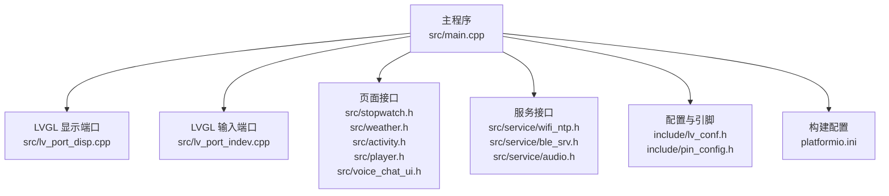
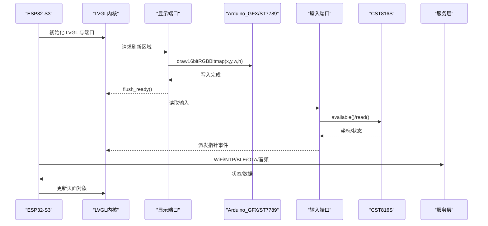
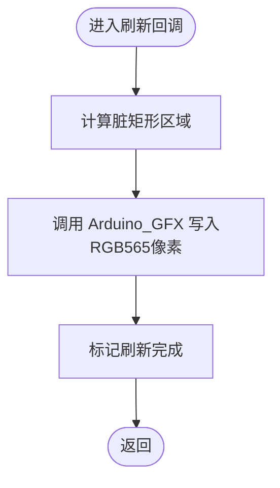
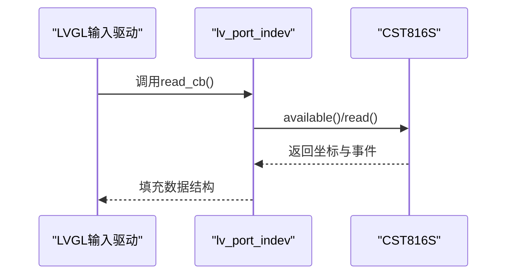
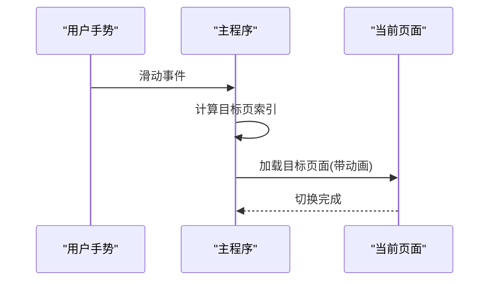
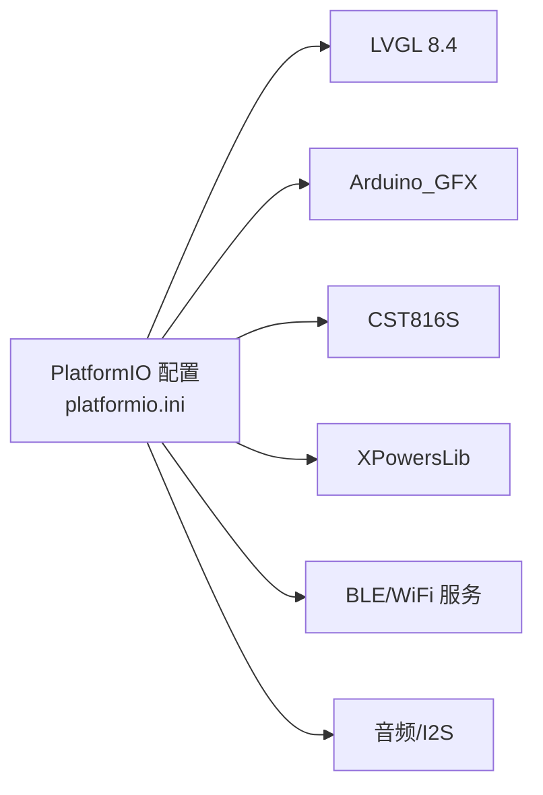

# 显示系统

<cite>
**本文引用的文件**
- [include/lv_conf.h](file://include/lv_conf.h)
- [include/pin_config.h](file://include/pin_config.h)
- [src/main.cpp](file://src/main.cpp)
- [src/lv_port_disp.cpp](file://src/lv_port_disp.cpp)
- [src/lv_port_indev.cpp](file://src/lv_port_indev.cpp)
- [src/stopwatch.h](file://src/stopwatch.h)
- [src/weather.h](file://src/weather.h)
- [src/activity.h](file://src/activity.h)
- [src/player.h](file://src/player.h)
- [src/voice_chat_ui.h](file://src/voice_chat_ui.h)
- [src/service/wifi_ntp.h](file://src/service/wifi_ntp.h)
- [src/service/ble_srv.h](file://src/service/ble_srv.h)
- [src/service/audio.h](file://src/service/audio.h)
- [platformio.ini](file://platformio.ini)
</cite>

## 目录
1. [简介](#简介)
2. [项目结构](#项目结构)
3. [核心组件](#核心组件)
4. [架构总览](#架构总览)
5. [详细组件分析](#详细组件分析)
6. [依赖关系分析](#依赖关系分析)
7. [性能考虑](#性能考虑)
8. [故障排查指南](#故障排查指南)
9. [结论](#结论)
10. [附录](#附录)

## 简介
本文件为 SmartBracelet 显示系统的完整技术文档，聚焦于 LVGL 图形库在 ESP32-S3 上的集成与配置、显示驱动实现、内存管理与渲染优化、UI 页面系统（数字时钟、模拟时钟、传感器监控、通知显示、音乐控制等）、触摸交互与手势识别、UI 自定义（颜色主题、字体、动画）、显示性能优化（刷新率、内存、功耗）以及调试与常见问题解决。文档以循序渐进的方式呈现，既适合开发者深入理解实现细节，也便于非专业读者把握整体架构。

## 项目结构
SmartBracelet 采用模块化组织方式：核心显示与输入由 LVGL 驱动封装；业务页面通过独立头文件声明创建与更新接口；服务层负责网络、蓝牙、音频等功能；硬件引脚与显示参数集中在头文件中统一管理。

图表来源
- [src/main.cpp](file://src/main.cpp#L615-L722)
- [src/lv_port_disp.cpp](file://src/lv_port_disp.cpp#L22-L32)
- [src/lv_port_indev.cpp](file://src/lv_port_indev.cpp#L21-L27)
- [include/lv_conf.h](file://include/lv_conf.h#L1-L114)
- [include/pin_config.h](file://include/pin_config.h#L1-L41)
- [platformio.ini](file://platformio.ini#L14-L41)

章节来源
- [src/main.cpp](file://src/main.cpp#L615-L722)
- [include/lv_conf.h](file://include/lv_conf.h#L1-L114)
- [include/pin_config.h](file://include/pin_config.h#L1-L41)
- [platformio.ini](file://platformio.ini#L14-L41)

## 核心组件
- LVGL 集成与配置：通过 include/lv_conf.h 定义颜色深度、内存、HAL 周期、字体与小部件开关等；platformio.ini 启用 LVGL 头文件包含路径。
- 显示驱动：基于 Arduino_GFX 的 SPI 接口驱动 ST7789，使用双缓冲减少撕裂；flush 回调直接写入 RGB565 像素。
- 输入设备：基于 CST816S 触摸控制器，LVGL 指针输入驱动读取坐标与按下状态。
- UI 页面系统：数字时钟、模拟时钟、传感器页、通知页、音乐控制页、计时器、天气、运动、播放器、语音聊天等页面通过独立接口创建与更新。
- 服务集成：WiFi/NTP、BLE 服务、OTA、音频播放/录音、PMU 电量管理等。

章节来源
- [include/lv_conf.h](file://include/lv_conf.h#L11-L114)
- [src/lv_port_disp.cpp](file://src/lv_port_disp.cpp#L11-L32)
- [src/lv_port_indev.cpp](file://src/lv_port_indev.cpp#L6-L27)
- [src/main.cpp](file://src/main.cpp#L406-L419)

## 架构总览
下图展示从主循环到 LVGL 渲染与输入处理的关键路径，以及与服务层的协作。

图表来源
- [src/lv_port_disp.cpp](file://src/lv_port_disp.cpp#L11-L20)
- [src/lv_port_indev.cpp](file://src/lv_port_indev.cpp#L6-L19)
- [src/main.cpp](file://src/main.cpp#L724-L764)

## 详细组件分析

### LVGL 配置与内存管理
- 颜色与像素格式：16 位 RGB565，无交换；屏幕透明关闭。
- 内存：自定义内存分配关闭，使用静态 64KB 缓冲区，最大缓冲块数 16；图层简单缓冲大小适配屏幕分辨率。
- HAL 周期：显示刷新默认周期 30ms，输入读取周期 30ms；自定义 tick 使用 millis()。
- 字体：启用蒙特拉特系列 8/10/12/14/16/24/32 及宋体 16 CJK；默认字体为 14。
- 小部件：启用常用控件如按钮、滑条、标签、图像等。
- 其他：禁用日志、性能与内存监控，避免生产环境开销。

章节来源
- [include/lv_conf.h](file://include/lv_conf.h#L11-L114)

### 显示驱动实现（lv_port_disp）
- 双缓冲：使用固定大小的行缓冲作为 LVGL draw buffer，降低内存碎片与带宽峰值。
- 刷新回调：按脏矩形区域调用 Arduino_GFX 的 16 位 RGB 写入函数，并标记刷新就绪。
- 注册：设置分辨率、flush 回调与 draw buffer，注册到 LVGL。

图表来源
- [src/lv_port_disp.cpp](file://src/lv_port_disp.cpp#L11-L20)

章节来源
- [src/lv_port_disp.cpp](file://src/lv_port_disp.cpp#L5-L32)

### 输入设备与触摸交互（lv_port_indev）
- 类型：指针输入（触摸板）。
- 读取流程：查询 CST816S 是否有新数据，读取坐标与事件，映射为按下/释放状态。
- 注册：注册到 LVGL 输入驱动，供 UI 事件系统使用。

图表来源
- [src/lv_port_indev.cpp](file://src/lv_port_indev.cpp#L6-L19)

章节来源
- [src/lv_port_indev.cpp](file://src/lv_port_indev.cpp#L21-L27)

### UI 页面系统设计
- 页面数组：主程序维护一个页面数组与当前页索引，支持左右滑动切换。
- 页面创建：每个页面通过独立接口创建，包含数字时钟、模拟时钟、传感器、通知、音乐控制、计时器、天气、运动、播放器、语音聊天等。
- 页面切换：根据方向参数选择动画类型（左移或右移），实现流畅过渡。

图表来源
- [src/main.cpp](file://src/main.cpp#L448-L455)

章节来源
- [src/main.cpp](file://src/main.cpp#L406-L419)
- [src/main.cpp](file://src/main.cpp#L448-L455)

### 数字时钟与状态栏
- 数字时钟：创建时间与日期标签，定时更新文本内容。
- 状态栏：包含 WiFi/蓝牙图标、电池百分比与电量条、充电状态、分页点指示等。
- 电池管理：根据 PMU 读数更新电池条宽度与颜色，支持 USB 充电模式提示。

章节来源
- [src/main.cpp](file://src/main.cpp#L119-L180)
- [src/main.cpp](file://src/main.cpp#L182-L203)
- [src/main.cpp](file://src/main.cpp#L457-L508)

### 模拟时钟
- 表盘与刻度：预先绘制 12 个刻度线，区分小时刻度粗细。
- 指针：时/分/秒三根线段，按实时时间角度更新位置。
- 初始化与更新：仅在时间变化时重绘，避免无效刷新。

章节来源
- [src/main.cpp](file://src/main.cpp#L244-L266)
- [src/main.cpp](file://src/main.cpp#L268-L287)

### 传感器监控页
- 内容：显示加速度、角速度与电池电压/电量。
- 更新：根据 IMU 采样结果格式化文本并刷新。

章节来源
- [src/main.cpp](file://src/main.cpp#L205-L231)
- [src/main.cpp](file://src/main.cpp#L435-L446)

### 通知显示页
- 内容：应用标识、标题与正文，支持自动换行。
- 来源：BLE 服务接收手机推送的通知，主循环检测新通知后更新页面。

章节来源
- [src/main.cpp](file://src/main.cpp#L289-L311)
- [src/main.cpp](file://src/main.cpp#L313-L319)
- [src/service/ble_srv.h](file://src/service/ble_srv.h#L22-L29)

### 音乐控制页
- 控件：上一首/播放暂停/下一首、音量加减。
- 事件：绑定 LVGL 点击事件到对应的 HID 操作（BLE 主机侧）。

章节来源
- [src/main.cpp](file://src/main.cpp#L321-L404)
- [src/service/ble_srv.h](file://src/service/ble_srv.h#L6-L10)

### 计时器、天气、运动、播放器、语音聊天页面
- 接口：各页面通过独立头文件声明创建与更新函数，主程序在初始化阶段统一创建并加入页面数组。
- 协作：页面内部可调用对应服务接口（如天气拉取、运动特征上传等）。

章节来源
- [src/stopwatch.h](file://src/stopwatch.h#L1-L6)
- [src/weather.h](file://src/weather.h#L1-L7)
- [src/activity.h](file://src/activity.h#L1-L13)
- [src/player.h](file://src/player.h#L1-L6)
- [src/voice_chat_ui.h](file://src/voice_chat_ui.h#L1-L6)

### 触摸交互与手势识别
- 手势：通过 CST816S 的手势 ID 判断左右滑动，触发页面切换。
- 抬腕亮屏：检测重力方向变化与运动能量，触发屏幕唤醒与活动计时复位。
- 屏幕超时：长时间无活动后自动关闭背光，节省功耗。

章节来源
- [src/main.cpp](file://src/main.cpp#L510-L514)
- [src/main.cpp](file://src/main.cpp#L559-L613)

### UI 组件自定义
- 颜色主题：通过修改标签/线条的颜色样式实现深色主题与状态色（低电量、充电中）。
- 字体配置：在 LVGL 配置中启用所需字号与中文字体，主程序中按需设置字体。
- 动画效果：页面切换使用 LVGL 内置动画（移动左/右），可扩展为淡入淡出等。

章节来源
- [include/lv_conf.h](file://include/lv_conf.h#L48-L65)
- [src/main.cpp](file://src/main.cpp#L119-L180)
- [src/main.cpp](file://src/main.cpp#L448-L455)

### 显示性能优化策略
- 刷新率控制：HAL 默认刷新周期 30ms，平衡流畅度与功耗。
- 内存使用优化：静态 64KB 内存池与有限缓冲块数量，避免动态分配。
- 渲染优化：按脏矩形刷新，减少全屏重绘；模拟时钟仅在时间变化时更新。
- 屏幕裁剪：ST7789 物理行高 320，LVGL 实际可用区域起始行 20，底部 304-319 裁剪，避免无效写入。

章节来源
- [include/lv_conf.h](file://include/lv_conf.h#L28-L34)
- [src/lv_port_disp.cpp](file://src/lv_port_disp.cpp#L5-L9)
- [src/main.cpp](file://src/main.cpp#L632-L642)
- [src/main.cpp](file://src/main.cpp#L276-L287)

### 调试工具与常见问题
- 调试串口：启动时开启 USB 串口，打印固件版本、PMU 状态、WiFi/蓝牙连接状态等。
- 常见问题：
  - 显示异常：检查 ST7789 物理行裁剪与 DC/CS/SCK/MOSI 引脚配置。
  - 触摸无响应：确认 CST816S 引脚与中断配置，检查可用性与事件状态。
  - 电量显示异常：验证 PMU 寄存器读取范围与阈值判断逻辑。
  - WiFi 功耗：确认 WiFi 开关策略与周期性关闭逻辑。

章节来源
- [src/main.cpp](file://src/main.cpp#L615-L625)
- [src/main.cpp](file://src/main.cpp#L697-L716)
- [include/pin_config.h](file://include/pin_config.h#L1-L41)

## 依赖关系分析
- 平台与框架：ESP32-S3、Arduino 框架、LVGL 8.4、Arduino_GFX、CST816S、PMU、BLE/WiFi 服务。
- 构建配置：platformio.ini 指定编译标志、包含目录与库依赖，启用 LVGL 简单头文件包含。

图表来源
- [platformio.ini](file://platformio.ini#L37-L41)

章节来源
- [platformio.ini](file://platformio.ini#L14-L41)

## 性能考虑
- 刷新节拍：30ms 默认刷新周期适合可穿戴设备，兼顾流畅与功耗。
- 内存策略：静态缓冲与有限块数，避免碎片；合理设置图层缓冲大小。
- 渲染路径：优先按需刷新，减少全屏写入；裁剪物理不可用行。
- 交互响应：输入读取周期与刷新周期一致，保证交互延迟可控。
- 无线功耗：WiFi/NTP 采用周期性开关策略，降低待机功耗。

[本节为通用指导，无需列出具体文件来源]

## 故障排查指南
- 无法显示或黑屏
  - 检查 SPI 引脚与 DC/CS/RST 配置是否正确。
  - 确认 ST7789 初始化与背光使能。
- 触摸无响应
  - 核对 I2C 引脚与中断引脚，确保 CST816S 初始化成功。
- 电量显示异常
  - 对比 PMU 寄存器读数范围与阈值，确认单位换算。
- WiFi 功耗过高
  - 检查 WiFi 开关策略与定时器逻辑，确保周期性关闭生效。

章节来源
- [include/pin_config.h](file://include/pin_config.h#L1-L41)
- [src/main.cpp](file://src/main.cpp#L652-L654)
- [src/main.cpp](file://src/main.cpp#L748-L764)

## 结论
SmartBracelet 显示系统以 LVGL 为核心，结合 Arduino_GFX 与 CST816S，实现了稳定高效的可穿戴显示平台。通过合理的内存与刷新策略、清晰的页面模块化设计、完善的交互与服务集成，系统在资源受限环境下提供了丰富的 UI 能力与良好的用户体验。后续可在动画与字体资源上进一步优化，以提升视觉表现与交互自然度。

[本节为总结性内容，无需列出具体文件来源]

## 附录
- 关键宏与常量
  - 分辨率：240×284
  - 默认刷新周期：30ms
  - 电池电压寄存器范围校验：500–5000mV
  - WiFi 循环开关间隔：10 分钟
- 相关接口
  - 显示端口：lv_port_disp_init
  - 输入端口：lv_port_indev_init
  - 页面接口：各页面头文件声明的 create/update 函数

章节来源
- [include/pin_config.h](file://include/pin_config.h#L11-L12)
- [include/lv_conf.h](file://include/lv_conf.h#L28-L29)
- [src/main.cpp](file://src/main.cpp#L421-L433)
- [src/main.cpp](file://src/main.cpp#L92-L93)