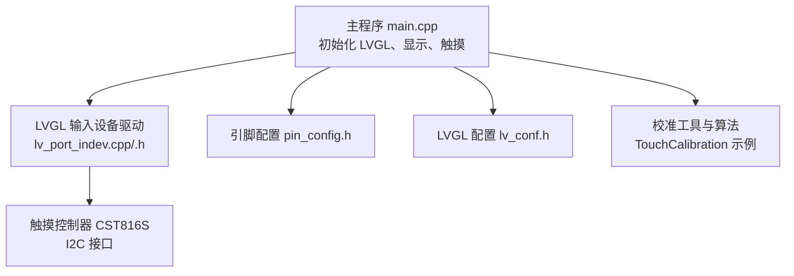
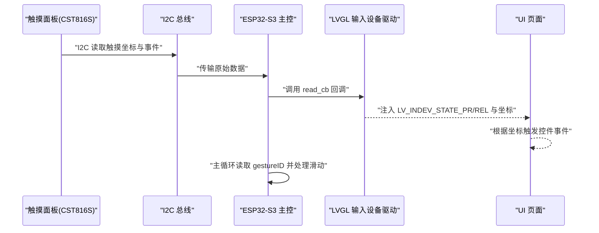
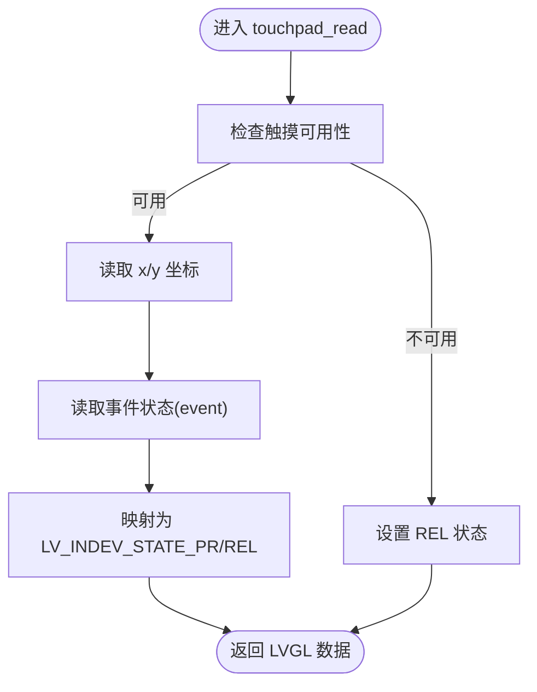
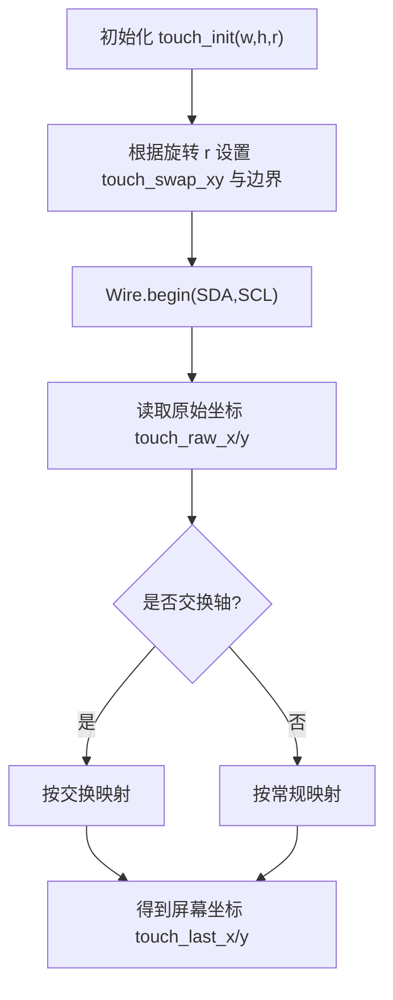
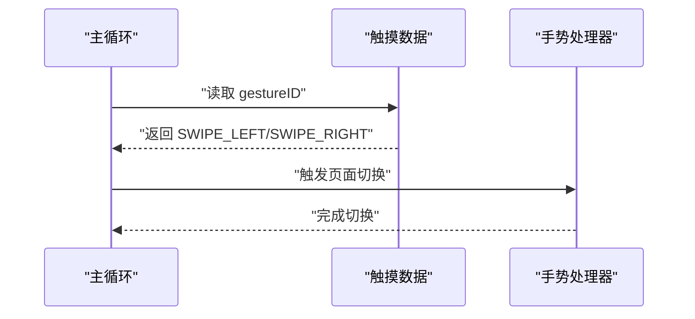
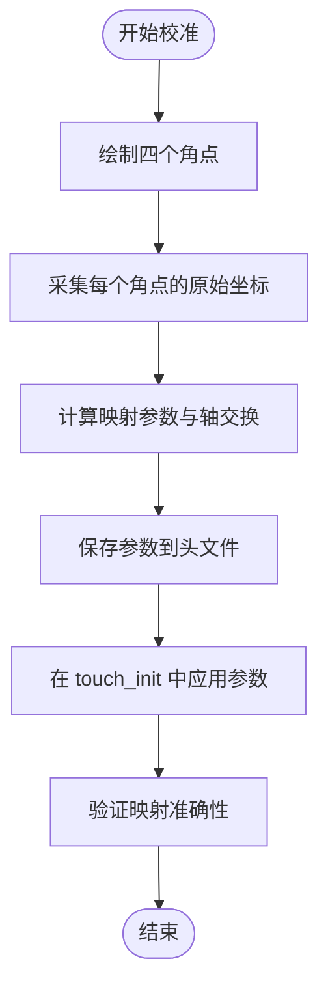
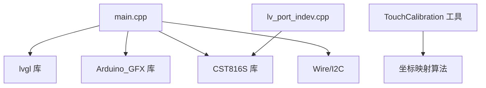

# 触摸交互系统

<cite>
**本文档引用的文件**
- [src/lv_port_indev.cpp](file://src/lv_port_indev.cpp)
- [src/lv_port_indev.h](file://src/lv_port_indev.h)
- [src/main.cpp](file://src/main.cpp)
- [include/pin_config.h](file://include/pin_config.h)
- [include/lv_conf.h](file://include/lv_conf.h)
- [lib/GFX_Library_for_Arduino/examples/TouchCalibration/touch.h](file://lib/GFX_Library_for_Arduino/examples/TouchCalibration/touch.h)
- [lib/GFX_Library_for_Arduino/examples/TouchCalibration/TouchCalibration.ino](file://lib/GFX_Library_for_Arduino/examples/TouchCalibration/TouchCalibration.ino)
- [platformio.ini](file://platformio.ini)
- [DEBUG_REPORT.md](file://DEBUG_REPORT.md)
</cite>

## 目录
1. [简介](#简介)
2. [项目结构](#项目结构)
3. [核心组件](#核心组件)
4. [架构总览](#架构总览)
5. [详细组件分析](#详细组件分析)
6. [依赖关系分析](#依赖关系分析)
7. [性能考虑](#性能考虑)
8. [故障诊断指南](#故障诊断指南)
9. [结论](#结论)
10. [附录](#附录)

## 简介
本文件针对 SmartBracelet 的触摸交互系统进行深入技术说明，覆盖触摸驱动初始化与配置、触摸屏校准算法、坐标转换矩阵、压力检测机制、LVGL 输入设备驱动实现、多点触控支持、手势识别（点击、长按、滑动、缩放）、触摸灵敏度调节、校准流程以及故障诊断与常见问题解决方案。文档以仓库现有实现为基础，结合 LVGL 8.x 与 CST816S 触摸控制器的实际集成情况，提供可操作的参数调优与排障建议。

## 项目结构
触摸交互系统主要由以下模块构成：
- LVGL 输入设备驱动：封装触摸事件到 LVGL 指针输入设备
- 触摸控制器驱动：CST816S（I2C）提供原始坐标与事件信息
- 校准工具与算法：基于示例工程的坐标映射与旋转适配
- 主循环集成：在主循环中处理手势识别与屏幕唤醒逻辑

图表来源
- [src/main.cpp](file://src/main.cpp#L615-L722)
- [src/lv_port_indev.cpp](file://src/lv_port_indev.cpp#L1-L28)
- [src/lv_port_indev.h](file://src/lv_port_indev.h#L1-L11)
- [include/pin_config.h](file://include/pin_config.h#L1-L41)
- [include/lv_conf.h](file://include/lv_conf.h#L1-L114)
- [lib/GFX_Library_for_Arduino/examples/TouchCalibration/TouchCalibration.ino](file://lib/GFX_Library_for_Arduino/examples/TouchCalibration/TouchCalibration.ino#L69-L132)

章节来源
- [src/main.cpp](file://src/main.cpp#L615-L722)
- [src/lv_port_indev.cpp](file://src/lv_port_indev.cpp#L1-L28)
- [src/lv_port_indev.h](file://src/lv_port_indev.h#L1-L11)
- [include/pin_config.h](file://include/pin_config.h#L1-L41)
- [include/lv_conf.h](file://include/lv_conf.h#L1-L114)

## 核心组件
- LVGL 输入设备驱动：负责将触摸事件（按下/抬起/坐标）注入 LVGL 指针输入设备，供 UI 控件消费
- 触摸控制器 CST816S：通过 I2C 提供触摸坐标与事件状态，并支持手势识别（如滑动）
- 校准工具：提供旋转方向适配、坐标映射与校准参数输出，便于移植到目标设备
- 主循环集成：在主循环中读取手势并执行页面切换等交互动作

章节来源
- [src/lv_port_indev.cpp](file://src/lv_port_indev.cpp#L6-L19)
- [src/lv_port_indev.h](file://src/lv_port_indev.h#L4-L6)
- [src/main.cpp](file://src/main.cpp#L510-L514)
- [lib/GFX_Library_for_Arduino/examples/TouchCalibration/touch.h](file://lib/GFX_Library_for_Arduino/examples/TouchCalibration/touch.h#L67-L129)

## 架构总览
下图展示了触摸交互在系统中的位置与数据流：

图表来源
- [src/lv_port_indev.cpp](file://src/lv_port_indev.cpp#L6-L19)
- [src/main.cpp](file://src/main.cpp#L900-L922)

章节来源
- [src/lv_port_indev.cpp](file://src/lv_port_indev.cpp#L6-L27)
- [src/main.cpp](file://src/main.cpp#L900-L922)

## 详细组件分析

### LVGL 输入设备驱动实现
- 初始化：注册 LVGL 指针类型输入设备，设置读回调函数
- 读回调：从全局触摸对象读取可用性、坐标与事件状态，映射为 LVGL 的按下/抬起状态
- 单点触控：当前实现仅使用单点坐标；多点触控需要扩展数据结构与回调

图表来源
- [src/lv_port_indev.cpp](file://src/lv_port_indev.cpp#L6-L19)

章节来源
- [src/lv_port_indev.cpp](file://src/lv_port_indev.cpp#L6-L27)
- [src/lv_port_indev.h](file://src/lv_port_indev.h#L4-L6)

### 触摸屏校准算法与坐标转换
- 旋转适配：根据显示旋转方向自动设置坐标轴交换与映射范围
- 坐标映射：使用 map 函数将原始触摸坐标映射到屏幕分辨率范围
- 校准流程：通过四个角点采样，计算映射参数并输出到头文件，供驱动使用

图表来源
- [lib/GFX_Library_for_Arduino/examples/TouchCalibration/touch.h](file://lib/GFX_Library_for_Arduino/examples/TouchCalibration/touch.h#L67-L157)
- [lib/GFX_Library_for_Arduino/examples/TouchCalibration/TouchCalibration.ino](file://lib/GFX_Library_for_Arduino/examples/TouchCalibration/TouchCalibration.ino#L134-L248)

章节来源
- [lib/GFX_Library_for_Arduino/examples/TouchCalibration/touch.h](file://lib/GFX_Library_for_Arduino/examples/TouchCalibration/touch.h#L67-L157)
- [lib/GFX_Library_for_Arduino/examples/TouchCalibration/TouchCalibration.ino](file://lib/GFX_Library_for_Arduino/examples/TouchCalibration/TouchCalibration.ino#L134-L248)

### 压力检测机制
- 当前实现未使用压力值（Z 值）；示例工程对 XPT2046 提供了压力采样与最大值选择逻辑
- 若需启用压力检测，可在读取回调中扩展使用压力阈值进行点击判定或长按检测

章节来源
- [lib/GFX_Library_for_Arduino/examples/TouchCalibration/touch.h](file://lib/GFX_Library_for_Arduino/examples/TouchCalibration/touch.h#L161-L181)

### 手势识别与交互模式
- 滑动识别：主循环中读取 gestureID，SWIPE_LEFT/SWIPE_RIGHT 触发页面切换
- 点击事件：LVGL 输入驱动已将按下/抬起映射为 UI 事件，具体点击行为由 UI 控件处理
- 长按检测：当前未实现专用长按逻辑，可通过 UI 事件或自定义定时器实现
- 缩放手势：当前未检测多点触控，无法识别捏合缩放

图表来源
- [src/main.cpp](file://src/main.cpp#L510-L514)
- [src/main.cpp](file://src/main.cpp#L900-L922)

章节来源
- [src/main.cpp](file://src/main.cpp#L510-L514)
- [src/main.cpp](file://src/main.cpp#L900-L922)

### 触摸灵敏度调节与去抖动
- 采样平滑：示例工程对 XPT2046 在 touched() 循环中多次采样并取平均，可借鉴用于降低抖动
- 去抖动：在 LVGL 输入驱动中可引入状态机或时间窗口判断，避免瞬时抖动导致的误触发
- 响应延迟优化：LVGL 默认读周期由配置控制，可调整以平衡响应与功耗

章节来源
- [lib/GFX_Library_for_Arduino/examples/TouchCalibration/touch.h](file://lib/GFX_Library_for_Arduino/examples/TouchCalibration/touch.h#L158-L167)
- [include/lv_conf.h](file://include/lv_conf.h#L28-L29)

### 触摸校准流程（完整步骤）
- 连接与初始化：确保 I2C 引脚正确，Wire.begin(SDA,SCL) 初始化
- 采集四角坐标：在屏幕上绘制四个角点，记录每次触摸的原始坐标
- 计算映射参数：比较上下左右边界的差值决定是否交换轴，计算映射边界并加入微调
- 输出与应用：将生成的参数写入头文件并在 touch_init 中使用

图表来源
- [lib/GFX_Library_for_Arduino/examples/TouchCalibration/TouchCalibration.ino](file://lib/GFX_Library_for_Arduino/examples/TouchCalibration/TouchCalibration.ino#L134-L248)
- [lib/GFX_Library_for_Arduino/examples/TouchCalibration/touch.h](file://lib/GFX_Library_for_Arduino/examples/TouchCalibration/touch.h#L175-L225)

章节来源
- [lib/GFX_Library_for_Arduino/examples/TouchCalibration/TouchCalibration.ino](file://lib/GFX_Library_for_Arduino/examples/TouchCalibration/TouchCalibration.ino#L134-L248)
- [lib/GFX_Library_for_Arduino/examples/TouchCalibration/touch.h](file://lib/GFX_Library_for_Arduino/examples/TouchCalibration/touch.h#L175-L225)

## 依赖关系分析
- 主程序依赖 LVGL、Arduino_GFX、CST816S、Wire、传感器与电源管理库
- LVGL 输入设备驱动依赖 CST816S 全局实例
- 校准工具独立于主程序，提供可复用的映射与旋转适配逻辑

图表来源
- [platformio.ini](file://platformio.ini#L37-L40)
- [src/main.cpp](file://src/main.cpp#L1-L28)
- [src/lv_port_indev.cpp](file://src/lv_port_indev.cpp#L1-L2)
- [lib/GFX_Library_for_Arduino/examples/TouchCalibration/touch.h](file://lib/GFX_Library_for_Arduino/examples/TouchCalibration/touch.h#L67-L129)

章节来源
- [platformio.ini](file://platformio.ini#L37-L40)
- [src/main.cpp](file://src/main.cpp#L1-L28)
- [src/lv_port_indev.cpp](file://src/lv_port_indev.cpp#L1-L2)

## 性能考虑
- LVGL 读周期：默认读周期为 30ms，可根据交互需求与功耗要求调整
- I2C 速率：确保 I2C 时序满足 CST816S 要求，避免频繁超时
- 采样策略：在触摸读取中采用适度采样与滤波，减少 CPU 占用与误触发
- 屏幕刷新与触摸：LVGL 刷新周期与触摸读取频率需协调，避免抢占

章节来源
- [include/lv_conf.h](file://include/lv_conf.h#L28-L29)

## 故障诊断指南
- 触摸无响应
  - 检查 I2C 引脚定义与 Wire.begin 是否正确调用
  - 确认触摸控制器初始化成功且地址无冲突
  - 参考调试报告中的 I2C 地址与引脚问题
- 校准不准确
  - 确保四角采样稳定，避免抖动导致的平均值偏差
  - 根据显示旋转方向正确设置映射参数
- 硬件连接问题
  - 注意调试报告中提到的引脚与芯片型号差异，避免错误连线
- Boot Loop 或重启
  - 移植驱动时注意芯片型号与库版本一致性，避免初始化异常

章节来源
- [DEBUG_REPORT.md](file://DEBUG_REPORT.md#L512-L551)
- [DEBUG_REPORT.md](file://DEBUG_REPORT.md#L521-L537)
- [src/main.cpp](file://src/main.cpp#L626-L654)

## 结论
SmartBracelet 的触摸交互系统以 LVGL 8.x 与 CST816S 为核心，实现了基础的单点触摸与滑动手势识别。通过校准工具提供的坐标映射与旋转适配，系统可在不同显示方向下保持一致的交互体验。未来可扩展多点触控、压力检测与长按/双击等高级手势，并结合采样与滤波策略进一步提升稳定性与灵敏度。

## 附录

### 参数与配置速查
- LVGL 读周期：30ms（默认）
- DPI：130（默认）
- 触摸驱动类型：LV_INDEV_TYPE_POINTER
- I2C 引脚：SDA=15, SCL=14（示例）

章节来源
- [include/lv_conf.h](file://include/lv_conf.h#L28-L35)
- [include/lv_conf.h](file://include/lv_conf.h#L35)
- [include/pin_config.h](file://include/pin_config.h#L14-L15)