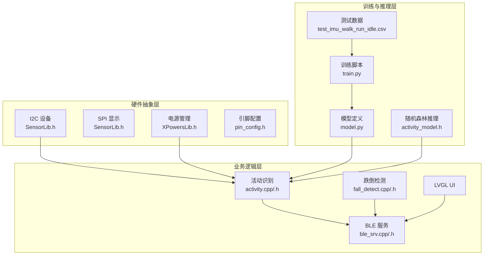
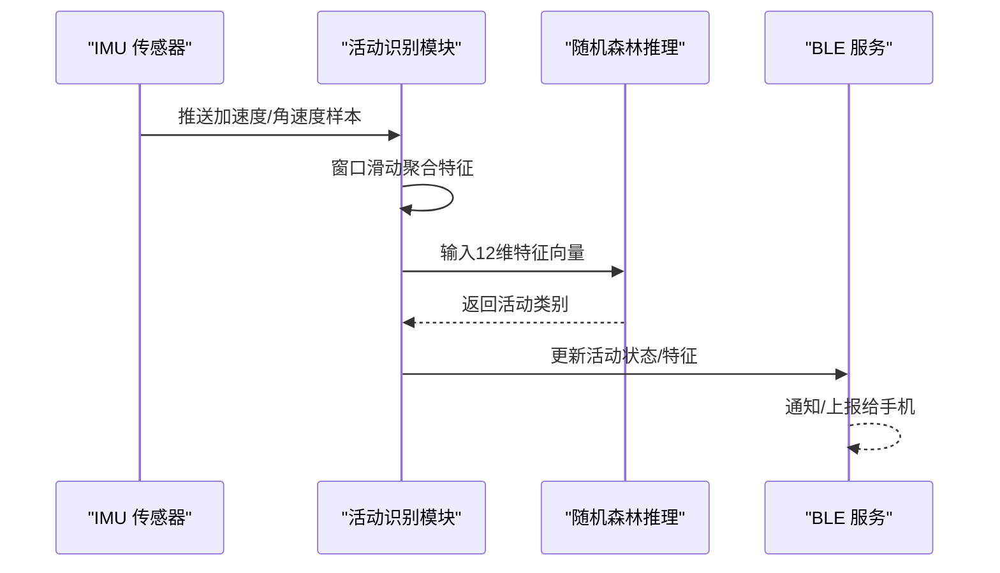
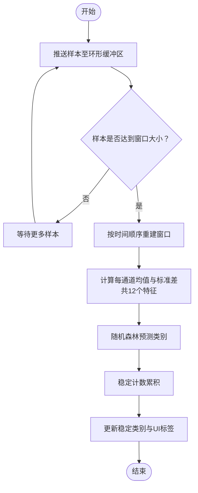
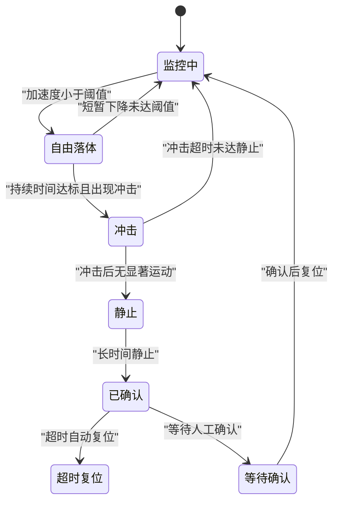
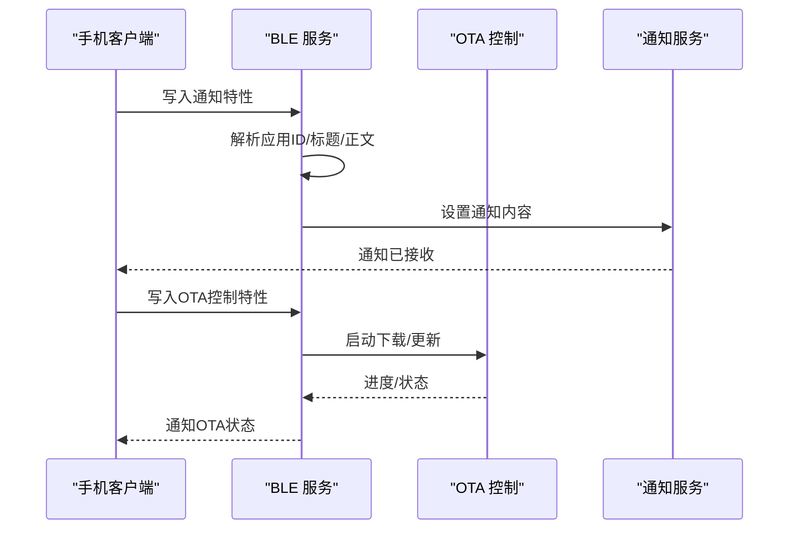
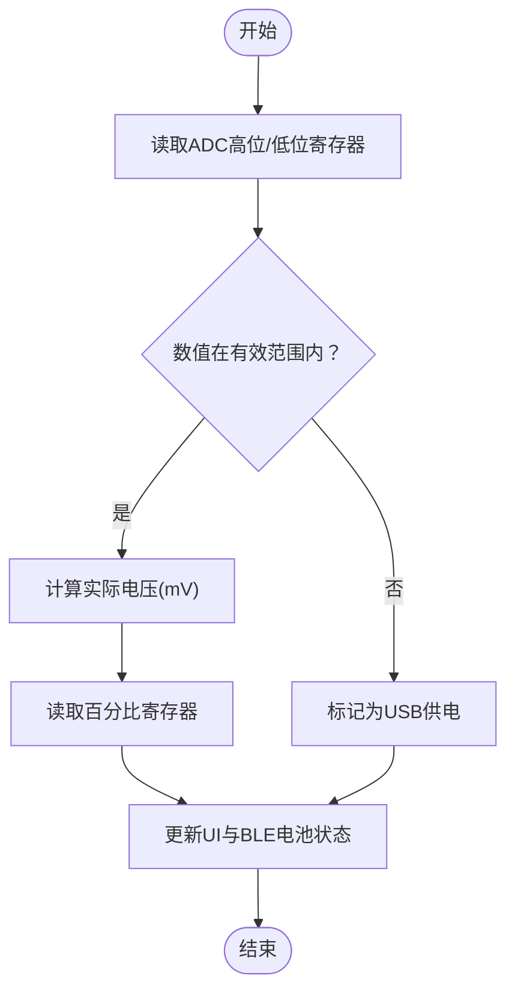
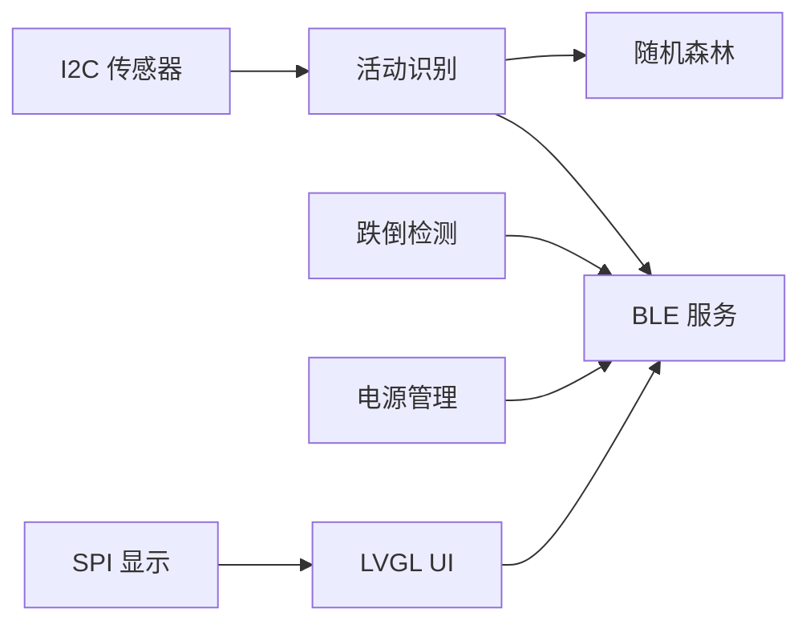

# 单元测试

<cite>
**本文引用的文件**
- [src/main.cpp](file://src/main.cpp)
- [src/activity.h](file://src/activity.h)
- [src/activity.cpp](file://src/activity.cpp)
- [src/fall_detect.h](file://src/fall_detect.h)
- [src/fall_detect.cpp](file://src/fall_detect.cpp)
- [src/service/ble_srv.h](file://src/service/ble_srv.h)
- [src/service/ble_srv.cpp](file://src/service/ble_srv.cpp)
- [lib/SensorLib-Waveshare/src/SensorLib.h](file://lib/SensorLib-Waveshare/src/SensorLib.h)
- [lib/XPowersLib/src/XPowersLib.h](file://lib/XPowersLib/src/XPowersLib.h)
- [training/test_imu_walk_run_idle.csv](file://training/test_imu_walk_run_idle.csv)
- [training/model.py](file://training/model.py)
- [training/train.py](file://training/train.py)
- [include/pin_config.h](file://include/pin_config.h)
- [src/activity_model.h](file://src/activity_model.h)
- [platformio.ini](file://platformio.ini)
</cite>

## 目录
1. [引言](#引言)
2. [项目结构](#项目结构)
3. [核心组件](#核心组件)
4. [架构总览](#架构总览)
5. [详细组件分析](#详细组件分析)
6. [依赖关系分析](#依赖关系分析)
7. [性能考虑](#性能考虑)
8. [故障排查指南](#故障排查指南)
9. [结论](#结论)
10. [附录](#附录)

## 引言
本指南面向 SmartBracelet 项目的单元测试实践，聚焦以下目标：
- 模块测试策略：传感器数据处理、AI 推理算法、电源管理等核心模块
- 接口测试技术：BLE 服务接口、I2C 通信接口、SPI 显示接口
- 边界条件测试：极端温度、高湿度、强磁场等环境下的功能验证
- 测试用例编写示例：IMU 数据校验、活动识别准确性测试、电源状态转换测试
- 测试数据准备与管理：CSV 格式的传感器数据集使用
- 自动化测试脚本：训练与推理流程的自动化执行

## 项目结构
SmartBracelet 采用模块化分层设计：
- 硬件抽象层：I2C/SPI/I2S 引脚定义与底层驱动
- 业务逻辑层：活动识别、跌倒检测、BLE 服务、UI 层
- 训练与推理层：Python 训练脚本与轻量级推理模型

图示来源
- [src/activity.cpp](file://src/activity.cpp#L1-L130)
- [src/fall_detect.cpp](file://src/fall_detect.cpp#L1-L147)
- [src/service/ble_srv.cpp](file://src/service/ble_srv.cpp#L1-L413)
- [lib/SensorLib-Waveshare/src/SensorLib.h](file://lib/SensorLib-Waveshare/src/SensorLib.h#L90-L118)
- [lib/XPowersLib/src/XPowersLib.h](file://lib/XPowersLib/src/XPowersLib.h#L14-L28)
- [training/train.py](file://training/train.py#L1-L175)
- [training/model.py](file://training/model.py#L1-L69)
- [training/test_imu_walk_run_idle.csv](file://training/test_imu_walk_run_idle.csv#L1-L800)
- [src/activity_model.h](file://src/activity_model.h#L1-L74)
- [include/pin_config.h](file://include/pin_config.h#L1-L41)

章节来源
- [platformio.ini](file://platformio.ini#L1-L41)

## 核心组件
- 活动识别（IMU 特征提取与分类）
  - 窗口滑动聚合特征（均值/标准差），随后通过随机森林进行分类
  - 输出当前活动类别与最新特征数组，供 BLE 上报
- 跌倒检测（IMU 加速度阈值与状态机）
  - 基于自由落体、冲击、静止的时序判定，进入确认告警状态
- BLE 服务（设备信息、电池、通知、OTA、IMU 特征）
  - 提供读写特性，支持手机端订阅与控制
- 电源管理（PMU 驱动）
  - 电压/电量测量、充电状态查询、寄存器读取封装
- 传感器与显示（I2C/SPI）
  - 统一接口抽象，便于替换与测试

章节来源
- [src/activity.h](file://src/activity.h#L1-L13)
- [src/activity.cpp](file://src/activity.cpp#L1-L130)
- [src/fall_detect.h](file://src/fall_detect.h#L1-L32)
- [src/fall_detect.cpp](file://src/fall_detect.cpp#L1-L147)
- [src/service/ble_srv.h](file://src/service/ble_srv.h#L1-L50)
- [src/service/ble_srv.cpp](file://src/service/ble_srv.cpp#L1-L413)
- [lib/XPowersLib/src/XPowersLib.h](file://lib/XPowersLib/src/XPowersLib.h#L14-L28)
- [lib/SensorLib-Waveshare/src/SensorLib.h](file://lib/SensorLib-Waveshare/src/SensorLib.h#L90-L118)

## 架构总览
下图展示从传感器到 BLE 的数据通路与关键测试点：

图示来源
- [src/activity.cpp](file://src/activity.cpp#L30-L76)
- [src/activity_model.h](file://src/activity_model.h#L58-L73)
- [src/service/ble_srv.cpp](file://src/service/ble_srv.cpp#L350-L361)

## 详细组件分析

### 活动识别模块测试
- 测试目标
  - 特征提取正确性（均值/标准差）
  - 分类稳定性（滑动窗口长度、步进步幅）
  - 随机森林预测一致性
- 关键接口
  - activity_push_data：输入样本
  - activity_get_features：输出最新特征
  - activity_get_current：输出稳定后的活动类别
- 测试策略
  - 使用 CSV 数据集生成多组窗口样本，验证特征计算
  - 对比不同窗口大小/步长对分类结果的影响
  - 验证“稳定计数”机制在噪声下的鲁棒性

图示来源
- [src/activity.cpp](file://src/activity.cpp#L30-L76)
- [src/activity.cpp](file://src/activity.cpp#L107-L129)
- [src/activity_model.h](file://src/activity_model.h#L58-L73)

章节来源
- [src/activity.h](file://src/activity.h#L1-L13)
- [src/activity.cpp](file://src/activity.cpp#L1-L130)
- [src/activity_model.h](file://src/activity_model.h#L1-L74)
- [training/test_imu_walk_run_idle.csv](file://training/test_imu_walk_run_idle.csv#L1-L800)

### 跌倒检测模块测试
- 测试目标
  - 自由落体、冲击、静止阶段的阈值与窗口设置
  - 状态机转换的时序正确性
  - 报警触发与超时自动复位
- 关键接口
  - fall_detect_update：输入加速度样本
  - fall_detect_get_state：查询当前状态
  - fall_detect_has_fallen：一次性确认标志
  - fall_detect_acknowledge：人工确认复位
- 测试策略
  - 构造典型自由落体→冲击→静止序列，验证状态转换
  - 添加抖动与噪声，评估误报率
  - 验证超时后状态自动恢复

图示来源
- [src/fall_detect.cpp](file://src/fall_detect.cpp#L68-L146)

章节来源
- [src/fall_detect.h](file://src/fall_detect.h#L1-L32)
- [src/fall_detect.cpp](file://src/fall_detect.cpp#L1-L147)

### BLE 服务接口测试
- 测试目标
  - 特性读写、通知/指示行为
  - 手机端协议解析（通知、OTA、语音命令、DND）
  - IMU 特征上报（48 字节浮点数组）
- 关键接口
  - ble_srv_send、ble_srv_update_*、ble_srv_update_imu_features
  - 通知服务、OTA 服务、数据服务 UUID
- 测试策略
  - 使用 BLE 客户端模拟写入命令，断言内部状态变化
  - 验证 MTU 设置与大数据包分片
  - 验证连接状态与通知频率

图示来源
- [src/service/ble_srv.cpp](file://src/service/ble_srv.cpp#L63-L123)
- [src/service/ble_srv.cpp](file://src/service/ble_srv.cpp#L226-L248)
- [src/service/ble_srv.cpp](file://src/service/ble_srv.cpp#L372-L385)

章节来源
- [src/service/ble_srv.h](file://src/service/ble_srv.h#L1-L50)
- [src/service/ble_srv.cpp](file://src/service/ble_srv.cpp#L1-L413)

### 电源管理函数测试
- 测试目标
  - 电压/电量寄存器读取与范围校验
  - 充电状态查询与 UI 显示联动
  - USB 供电模式识别
- 关键接口
  - read_batt_voltage_raw、read_batt_percent_raw、batt_is_valid
  - 充电状态查询与图标颜色
- 测试策略
  - 伪造寄存器返回值，覆盖正常/异常/USB 模式
  - 验证 UI 百分比与颜色随电量变化

图示来源
- [src/main.cpp](file://src/main.cpp#L421-L446)
- [src/main.cpp](file://src/main.cpp#L484-L500)

章节来源
- [src/main.cpp](file://src/main.cpp#L421-L500)

### 传感器与显示接口测试
- 测试目标
  - I2C/SPI 初始化与读写正确性
  - 设备地址与引脚映射一致性
  - 显示刷新与背光控制
- 关键接口
  - SensorLib.h 中的接口类型与引脚结构
  - SPI/I2C 传输封装
- 测试策略
  - 使用逻辑分析仪或仿真设备验证时序
  - 单元测试中以桩函数替换底层 I2C/SPI

章节来源
- [lib/SensorLib-Waveshare/src/SensorLib.h](file://lib/SensorLib-Waveshare/src/SensorLib.h#L90-L118)
- [include/pin_config.h](file://include/pin_config.h#L1-L41)

## 依赖关系分析
- 模块耦合
  - 活动识别依赖 IMU 采样与随机森林推理
  - BLE 服务依赖活动识别与电源状态
  - 跌倒检测独立于 BLE，但可触发通知
- 外部依赖
  - Arduino BLE 库、LVGL、SensorLib、XPowersLib
- 可能的循环依赖
  - 当前结构清晰，无明显循环依赖

图示来源
- [src/activity.cpp](file://src/activity.cpp#L1-L130)
- [src/fall_detect.cpp](file://src/fall_detect.cpp#L1-L147)
- [src/service/ble_srv.cpp](file://src/service/ble_srv.cpp#L1-L413)
- [lib/SensorLib-Waveshare/src/SensorLib.h](file://lib/SensorLib-Waveshare/src/SensorLib.h#L90-L118)
- [lib/XPowersLib/src/XPowersLib.h](file://lib/XPowersLib/src/XPowersLib.h#L14-L28)

## 性能考虑
- 特征计算与分类
  - 窗口大小与步长影响实时性与准确性，需在资源与精度间权衡
- BLE 通知频率
  - 合理设置 MTU 与通知间隔，避免频繁唤醒导致功耗上升
- 电源管理
  - 低功耗模式下限制传感器采样频率与 UI 刷新

## 故障排查指南
- BLE 不可用
  - 检查初始化日志与广告状态
  - 验证 UUID 与描述符注册
- 电源读数异常
  - 校验寄存器读取与范围判断逻辑
  - 对比不同 PMU 芯片的寄存器布局
- 活动识别不稳定
  - 调整窗口大小与稳定计数阈值
  - 检查特征计算与随机森林权重
- 跌倒误报
  - 优化阈值与窗口参数，增加去抖策略

章节来源
- [src/service/ble_srv.cpp](file://src/service/ble_srv.cpp#L250-L285)
- [src/main.cpp](file://src/main.cpp#L421-L446)
- [src/activity.cpp](file://src/activity.cpp#L107-L129)
- [src/fall_detect.cpp](file://src/fall_detect.cpp#L68-L146)

## 结论
通过模块化测试策略与接口隔离，SmartBracelet 的核心功能可在本地高效验证。建议优先覆盖：
- 特征提取与分类的回归测试
- BLE 协议与状态机的时序测试
- 电源与传感器接口的边界条件测试
- 自动化训练与推理流水线的集成测试

## 附录

### 测试用例编写示例

- IMU 数据校验
  - 输入：CSV 文件中的加速度/角速度列
  - 步骤：按时间戳读取样本，调用 activity_push_data
  - 断言：特征数组的均值/标准差在合理区间内
  - 参考路径：[训练脚本](file://training/train.py#L80-L85)，[特征计算](file://src/activity.cpp#L52-L76)

- 活动识别准确性测试
  - 输入：test_imu_walk_run_idle.csv 的多段样本
  - 步骤：逐窗口推入样本，记录预测类别
  - 断言：与标签一致率高于阈值
  - 参考路径：[CSV 数据](file://training/test_imu_walk_run_idle.csv#L1-L800)，[分类逻辑](file://src/activity.cpp#L107-L129)

- 电源状态转换测试
  - 输入：伪造寄存器返回值（有效/无效/USB）
  - 步骤：调用 read_batt_voltage_raw/batt_is_valid
  - 断言：UI 百分比与颜色随状态变化
  - 参考路径：[电源函数](file://src/main.cpp#L421-L446)，[UI 更新](file://src/main.cpp#L484-L500)

- BLE 接口测试
  - 输入：模拟手机写入通知/OTA/语音命令
  - 步骤：调用 onWrite 回调，检查内部状态
  - 断言：状态机与通知内容符合预期
  - 参考路径：[回调解析](file://src/service/ble_srv.cpp#L63-L123)，[OTA 状态](file://src/service/ble_srv.cpp#L377-L385)

- 自动化测试脚本
  - 训练自动化：指定 CSV、窗口大小、模型类型，导出 ONNX 与检查点
  - 参考路径：[训练入口](file://training/train.py#L52-L175)，[模型定义](file://training/model.py#L5-L69)

章节来源
- [training/train.py](file://training/train.py#L52-L175)
- [training/model.py](file://training/model.py#L1-L69)
- [training/test_imu_walk_run_idle.csv](file://training/test_imu_walk_run_idle.csv#L1-L800)
- [src/activity.cpp](file://src/activity.cpp#L52-L76)
- [src/activity.cpp](file://src/activity.cpp#L107-L129)
- [src/main.cpp](file://src/main.cpp#L421-L500)
- [src/service/ble_srv.cpp](file://src/service/ble_srv.cpp#L63-L123)
- [src/service/ble_srv.cpp](file://src/service/ble_srv.cpp#L377-L385)