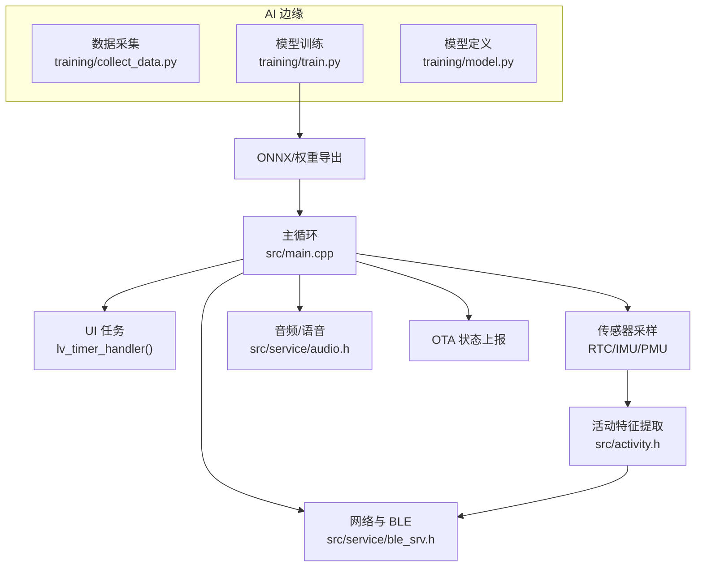
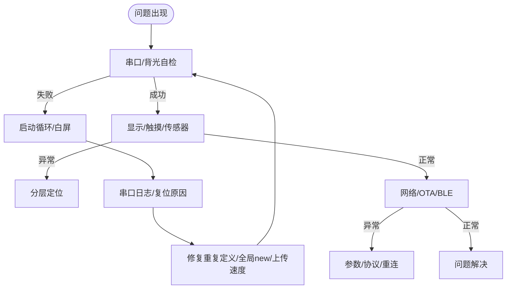
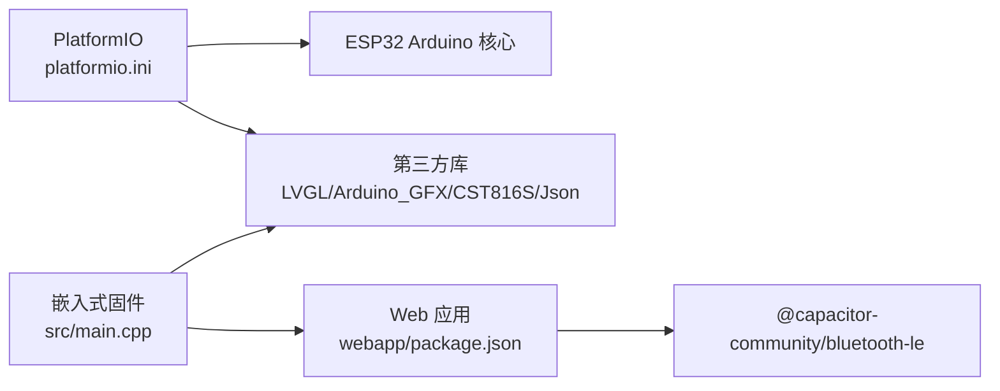

# 测试与调试

<cite>
**本文引用的文件**
- [platformio.ini](file://platformio.ini)
- [DEBUG_REPORT.md](file://DEBUG_REPORT.md)
- [src/main.cpp](file://src/main.cpp)
- [src/service/ble_srv.h](file://src/service/ble_srv.h)
- [src/activity.h](file://src/activity.h)
- [src/fall_detect.h](file://src/fall_detect.h)
- [src/service/audio.h](file://src/service/audio.h)
- [training/requirements.txt](file://training/requirements.txt)
- [training/collect_data.py](file://training/collect_data.py)
- [training/train.py](file://training/train.py)
- [training/model.py](file://training/model.py)
- [webapp/package.json](file://webapp/package.json)
</cite>

## 目录
1. [简介](#简介)
2. [项目结构](#项目结构)
3. [核心组件](#核心组件)
4. [架构总览](#架构总览)
5. [详细组件分析](#详细组件分析)
6. [依赖关系分析](#依赖关系分析)
7. [性能考虑](#性能考虑)
8. [故障排查指南](#故障排查指南)
9. [结论](#结论)
10. [附录](#附录)

## 简介
本指南面向 SmartBracelet 项目，提供系统化的测试与调试方法论，覆盖单元测试、接口测试、边界条件测试、集成测试（硬件/软件/系统）、调试工具使用、性能测试与优化、故障诊断流程、自动化测试框架搭建、测试数据管理与回归策略、质量保证流程等。文档结合项目现有配置与历史调试报告，给出可落地的实践步骤与可视化图示。

## 项目结构
SmartBracelet 采用 PlatformIO 工程组织，包含嵌入式固件、AI 边缘训练脚本、跨平台 Web 应用三大部分：
- 嵌入式固件（ESP32-S3）：主循环、UI（LVGL）、传感器（RTC/IMU/PMU）、BLE/WiFi、音频/语音、OTA 升级等
- AI 边缘训练：IMU 数据采集、模型训练与导出
- Web 应用：Capacitor + Android（蓝牙 LE 交互）

```mermaid
graph TB
subgraph "嵌入式固件"
MCU["ESP32-S3<br/>src/main.cpp"]
UI["LVGL UI<br/>src/lv_port_*"]
SENSORS["传感器<br/>RTC/IMU/PMU"]
NET["网络<br/>BLE/WiFi/NTP"]
AUDIO["音频/语音<br/>src/service/audio.*"]
OTA["OTA 升级"]
end
subgraph "AI 边缘训练"
COLLECT["数据采集<br/>training/collect_data.py"]
TRAIN["模型训练<br/>training/train.py"]
MODEL["模型定义<br/>training/model.py"]
end
subgraph "Web 应用"
APP["Android 应用<br/>webapp/android"]
end
MCU --> UI
MCU --> SENSORS
MCU --> NET
MCU --> AUDIO
MCU --> OTA
COLLECT --> TRAIN --> MODEL
TRAIN --> MCU
APP < --> NET
```

图表来源
- [src/main.cpp](file://src/main.cpp#L615-L722)
- [training/collect_data.py](file://training/collect_data.py#L42-L115)
- [training/train.py](file://training/train.py#L52-L175)
- [training/model.py](file://training/model.py#L5-L69)
- [webapp/package.json](file://webapp/package.json#L15-L21)

章节来源
- [platformio.ini](file://platformio.ini#L14-L41)
- [DEBUG_REPORT.md](file://DEBUG_REPORT.md#L1-L120)

## 核心组件
- 主控制器与系统调度：负责设备初始化、UI 循环、传感器轮询、网络与 BLE 服务、OTA 状态上报
- UI 与输入：LVGL 显示驱动、触摸输入驱动、页面切换与动画
- 传感器：RTC（时间基准）、IMU（运动/计步/特征提取）、PMU（电量/充电状态）
- 通信：BLE（双向服务、通知、OTA 状态）、WiFi（NTP 校时、天气轮询）
- 音频/语音：播放与录音、语音聊天回调
- AI 边缘推理：IMU 特征提取与模型导出（ONNX/权重）

章节来源
- [src/main.cpp](file://src/main.cpp#L1-L120)
- [src/service/ble_srv.h](file://src/service/ble_srv.h#L1-L50)
- [src/activity.h](file://src/activity.h#L1-L13)
- [src/fall_detect.h](file://src/fall_detect.h#L1-L32)
- [src/service/audio.h](file://src/service/audio.h#L1-L23)

## 架构总览
系统采用“主循环 + 事件驱动”的嵌入式架构，配合 LVGL 任务调度与 BLE/WiFi 服务后台处理。AI 边缘训练与嵌入式推理通过数据采集与模型导出形成闭环。



图表来源
- [src/main.cpp](file://src/main.cpp#L724-L800)
- [src/service/ble_srv.h](file://src/service/ble_srv.h#L6-L48)
- [src/activity.h](file://src/activity.h#L6-L12)
- [training/collect_data.py](file://training/collect_data.py#L77-L115)
- [training/train.py](file://training/train.py#L146-L171)

## 详细组件分析

### 单元测试策略
- 模块测试
  - 传感器模块：独立测试 IMU/RTC/PMU 初始化与读取，断言地址与寄存器读写有效性
  - UI 模块：对 LVGL 页面创建与更新函数进行行为断言（文本、颜色、尺寸）
  - 通信模块：BLE 服务接口（通知/写入/OTA 状态）与 WiFi NTP 同步流程
- 接口测试
  - 针对 BLE 服务对外接口（电池、步数、活动、OTA 状态）进行契约测试
  - 针对音频/语音接口（播放/录音/音量）进行输入输出断言
- 边界条件测试
  - 低功耗状态下的唤醒与恢复（抬腕、触摸、RTC 定时）
  - 串口/USB CDC 枚举超时与重连
  - 传感器数据异常（NaN/溢出/漂移）下的鲁棒性

章节来源
- [src/service/ble_srv.h](file://src/service/ble_srv.h#L6-L48)
- [src/service/audio.h](file://src/service/audio.h#L5-L23)
- [src/activity.h](file://src/activity.h#L6-L12)
- [DEBUG_REPORT.md](file://DEBUG_REPORT.md#L279-L292)

### 集成测试方法
- 硬件集成测试
  - 显示与触摸：验证 LVGL 刷新回调、颜色字节序、触摸坐标映射
  - 传感器总线：I2C 多设备共存（CST816D/PCF85063/QMI8658/AXP2101）无地址冲突
  - 电源与背光：抬腕亮屏、息屏定时、Deep Sleep 唤醒路径
- 软件集成测试
  - BLE/WiFi/NTP：连接、同步、断开与重连
  - OTA 升级：状态机推进、进度上报、升级失败回滚
- 系统联调测试
  - 从串口到 BLE 的中文 UTF-8 透传
  - 通知页面与 Do Not Disturb 模式联动

章节来源
- [DEBUG_REPORT.md](file://DEBUG_REPORT.md#L348-L519)
- [src/main.cpp](file://src/main.cpp#L508-L613)

### 调试工具使用
- 串口调试
  - 使用 PlatformIO Monitor 与 USB CDC（USBSerial），设置波特率与过滤器
  - 在关键路径添加日志输出，确保启动序列可追踪
- 逻辑分析仪/示波器
  - SPI/I2C 时序验证（ST7789、CST816D、PMU/RTC/IMU）
  - 背光 PWM、按键/中断引脚电平
- IDE/工具链
  - PlatformIO 上传速度与烧录参数（QIO/频率/大小）
  - esptool.py 手动三段式烧录与全片擦除

章节来源
- [platformio.ini](file://platformio.ini#L18-L23)
- [DEBUG_REPORT.md](file://DEBUG_REPORT.md#L135-L161)
- [DEBUG_REPORT.md](file://DEBUG_REPORT.md#L324-L331)

### 性能测试与优化
- 内存使用分析
  - 关注 IRAM/DRAM 占用，避免启动阶段溢出（参考调试报告中的 IRAM 翻倍与 TG0WDT 复位）
  - 优化 LVGL 显示缓冲区大小与字体资源
- CPU 负载测试
  - 通过 UI 刷新周期（LVGL 每 5ms）与传感器采样频率评估负载
- 功耗测量
  - 基于 PMU 读数与背光控制策略，验证息屏/Deep Sleep 效果
- 上传与稳定性
  - 上传速度从 921600 降为 115200，提升可靠性

章节来源
- [DEBUG_REPORT.md](file://DEBUG_REPORT.md#L584-L591)
- [DEBUG_REPORT.md](file://DEBUG_REPORT.md#L252-L259)
- [src/main.cpp](file://src/main.cpp#L95-L100)

### 故障诊断流程
- 快速自检
  - 串口输出确认启动、背光闪烁确认芯片运行
- 分层定位
  - 显示：LVGL 配置、刷新回调、颜色字节序
  - 触控：I2C 引脚映射、中断与坐标读取
  - 传感器：地址冲突、初始化顺序、总线稳定性
- 日志与根因
  - USB CDC 枚举超时、重复 USBSerial 定义、全局 new 导致的启动崩溃
  - 上传失败与 flash 损坏（带电插拔）



图表来源
- [DEBUG_REPORT.md](file://DEBUG_REPORT.md#L18-L58)
- [DEBUG_REPORT.md](file://DEBUG_REPORT.md#L584-L608)

章节来源
- [DEBUG_REPORT.md](file://DEBUG_REPORT.md#L18-L58)
- [DEBUG_REPORT.md](file://DEBUG_REPORT.md#L584-L608)

### 自动化测试框架搭建
- 单元测试（本地/CI）
  - 使用 C++ 单元测试框架（如 GoogleTest），针对传感器/通信/算法模块编写测试用例
  - 使用 PlatformIO 的构建与测试目标，集成到 CI 流水线
- 集成测试（硬件）
  - 使用 Python/Shell 脚本自动化上传、日志采集、功能验证
  - 通过 esptool.py 与 PlatformIO CLI 组合实现一键烧录与自检
- 结果分析
  - 生成测试报告与覆盖率统计，记录失败用例与复现步骤

章节来源
- [platformio.ini](file://platformio.ini#L11-L12)
- [DEBUG_REPORT.md](file://DEBUG_REPORT.md#L324-L331)

### 测试数据管理与回归策略
- 数据采集
  - 使用 IMU 数据采集脚本，规范标签与文件命名，统一时间戳
- 数据集划分
  - 训练/验证/测试集划分，窗口化与步长策略
- 模型版本与导出
  - 保存 PyTorch 权重与 ONNX，记录超参与指标
- 回归测试
  - 每次模型更新后，对关键场景（步行/跑步/静止）进行回归验证
  - 嵌入式侧加载新模型后，进行功能与性能回归

章节来源
- [training/collect_data.py](file://training/collect_data.py#L56-L115)
- [training/train.py](file://training/train.py#L80-L142)
- [training/model.py](file://training/model.py#L57-L69)

## 依赖关系分析
- 平台与工具链
  - PlatformIO 环境、ESP32 Arduino 核心、上传速度与烧录参数
- 库依赖
  - LVGL、Arduino_GFX、CST816S、SensorLib、XPowersLib、ArduinoJson
- 应用依赖
  - Capacitor + Android 蓝牙 LE 通信



图表来源
- [platformio.ini](file://platformio.ini#L37-L41)
- [webapp/package.json](file://webapp/package.json#L15-L21)

章节来源
- [platformio.ini](file://platformio.ini#L37-L41)
- [webapp/package.json](file://webapp/package.json#L15-L21)

## 性能考虑
- 启动与内存
  - 避免全局构造与 IRAM 溢出，精简调试级别与依赖
- 显示与输入
  - 控制 LVGL 刷新频率与缓冲区大小，减少 UI 更新开销
- 通信与功耗
  - WiFi 动态开关、BLE 低功耗模式、息屏与 Deep Sleep 策略
- 上传与稳定性
  - 降低上传波特率，使用 esptool.py 手动烧录提升成功率

章节来源
- [DEBUG_REPORT.md](file://DEBUG_REPORT.md#L584-L591)
- [DEBUG_REPORT.md](file://DEBUG_REPORT.md#L252-L259)
- [DEBUG_REPORT.md](file://DEBUG_REPORT.md#L324-L331)

## 故障排查指南
- 启动循环/白屏
  - 检查重复定义 USBSerial、全局 new、上传速度与复位方式
- 显示异常
  - LVGL 配置、颜色字节序、刷新回调、背光控制
- 触控无响应
  - I2C 引脚映射、中断与坐标读取、总线共享
- 通信不稳定
  - BLE/WiFi 连接状态、NTP 同步、OTA 状态上报
- 上传失败/“板子死了”
  - 全片擦除、手动三段式烧录、USB 带电插拔风险

章节来源
- [DEBUG_REPORT.md](file://DEBUG_REPORT.md#L18-L58)
- [DEBUG_REPORT.md](file://DEBUG_REPORT.md#L198-L240)
- [DEBUG_REPORT.md](file://DEBUG_REPORT.md#L324-L331)

## 结论
通过系统化的测试与调试方法，结合历史调试经验与工具链配置，SmartBracelet 项目可在资源受限的嵌入式平台上实现稳定的功能交付与持续迭代。建议将单元测试、集成测试与自动化流程纳入日常开发，配合严格的回归策略与质量门禁，保障产品可靠性与用户体验。

## 附录
- 上传与烧录最佳实践
  - 使用 115200 上传速度，确保 esptool.py 三段式烧录
  - 全片擦除后冷启动，避免带电插拔
- 串口日志建议
  - 在关键路径添加日志，包含启动、初始化、状态切换、错误码
- AI 边缘训练要点
  - 数据采集标准化、模型导出一致性、回归验证闭环

章节来源
- [DEBUG_REPORT.md](file://DEBUG_REPORT.md#L324-L331)
- [training/requirements.txt](file://training/requirements.txt#L1-L5)
- [training/collect_data.py](file://training/collect_data.py#L56-L115)
- [training/train.py](file://training/train.py#L146-L171)