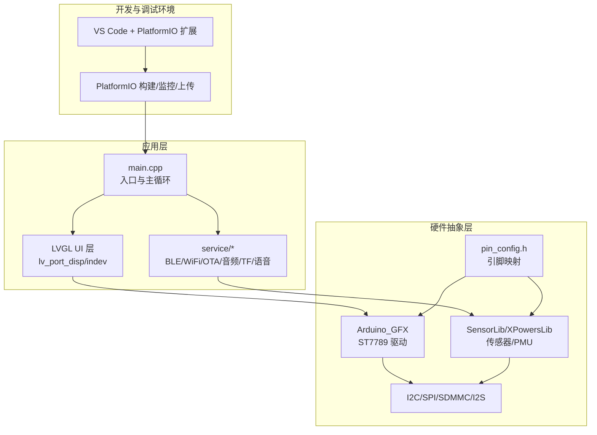
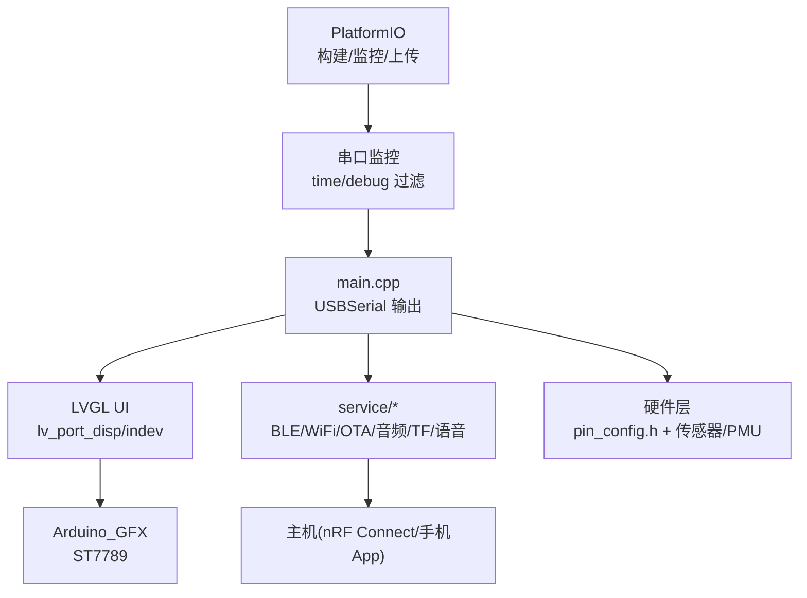
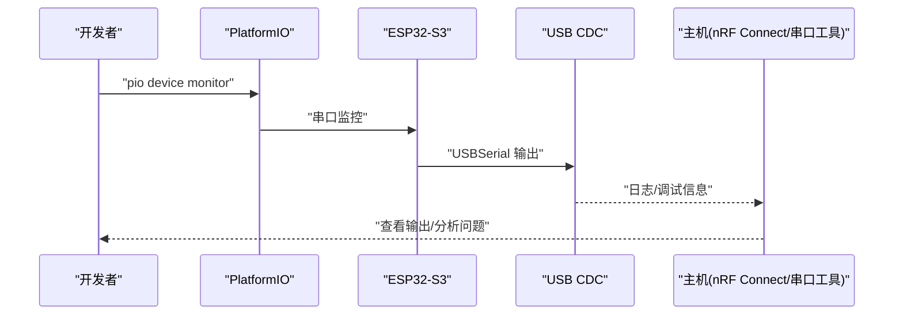
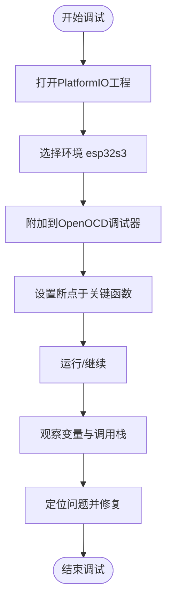
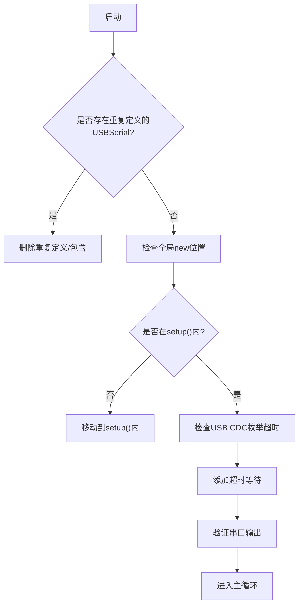
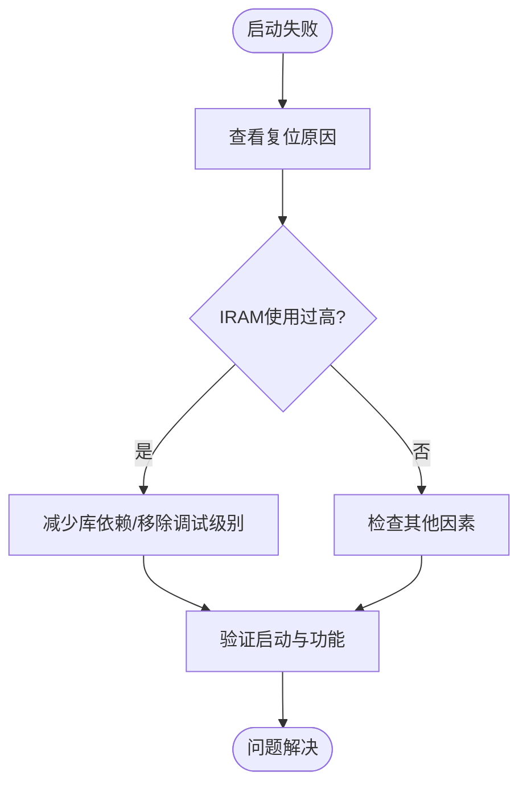
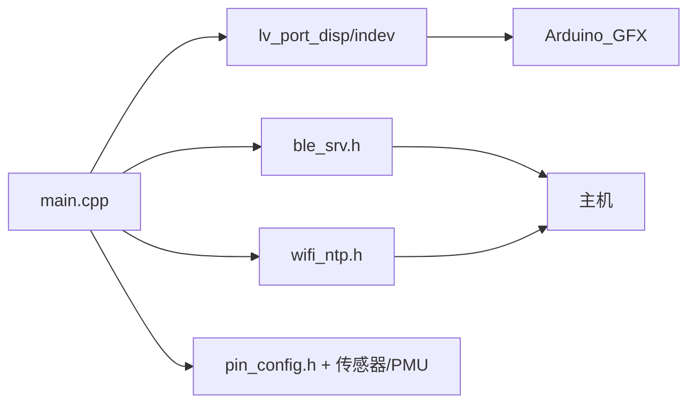

# 调试工具

<cite>
**本文引用的文件**
- [platformio.ini](file://platformio.ini)
- [DEBUG_REPORT.md](file://DEBUG_REPORT.md)
- [DEVELOPMENT_PLAN.md](file://DEVELOPMENT_PLAN.md)
- [boards/ESP32-S3-R8-OPI.json](file://boards/ESP32-S3-R8-OPI.json)
- [include/pin_config.h](file://include/pin_config.h)
- [include/lv_conf.h](file://include/lv_conf.h)
- [src/main.cpp](file://src/main.cpp)
- [src/service/ble_srv.h](file://src/service/ble_srv.h)
- [src/service/wifi_ntp.h](file://src/service/wifi_ntp.h)
- [src/lv_port_disp.h](file://src/lv_port_disp.h)
- [src/lv_port_indev.h](file://src/lv_port_indev.h)
</cite>

## 目录
1. [简介](#简介)
2. [项目结构](#项目结构)
3. [核心组件](#核心组件)
4. [架构总览](#架构总览)
5. [详细组件分析](#详细组件分析)
6. [依赖关系分析](#依赖关系分析)
7. [性能考量](#性能考量)
8. [故障排查指南](#故障排查指南)
9. [结论](#结论)
10. [附录](#附录)

## 简介
本指南面向SmartBracelet项目的开发者与维护者，系统讲解调试工具与方法，覆盖以下主题：
- 串口调试与日志输出控制（USB CDC、时间戳、调试过滤器）
- 硬件调试设备（逻辑分析仪、示波器、频谱分析仪）的应用场景与操作要点
- PlatformIO调试环境配置（调试器、断点、变量监视）
- 典型调试案例：Boot Loop诊断、内存溢出排查、通信异常处理
- 调试信息解读：寄存器状态、内存布局、任务调度等底层信息
- 调试最佳实践与效率提升技巧

## 项目结构
SmartBracelet采用PlatformIO + Arduino框架，结合LVGL图形界面、BLE/WiFi通信、传感器与音频模块，形成“应用层→服务层→硬件抽象层”的分层架构。调试相关的关键位置包括：
- 顶层配置：platformio.ini中的监控波特率、过滤器、上传速度与构建标志
- 硬件引脚与外设：include/pin_config.h定义的显示、触控、I2C、TF卡、音频等引脚
- UI与显示：include/lv_conf.h与src/lv_port_*端口文件
- 服务与通信：src/service/*（BLE、WiFi、OTA、音频、TF卡、语音等）
- 调试报告与开发计划：DEBUG_REPORT.md与DEVELOPMENT_PLAN.md记录了大量真实调试经验

**章节来源**
- [platformio.ini](file://platformio.ini#L14-L41)
- [include/pin_config.h](file://include/pin_config.h#L1-L41)
- [include/lv_conf.h](file://include/lv_conf.h#L1-L114)
- [src/lv_port_disp.h](file://src/lv_port_disp.h#L1-L11)
- [src/lv_port_indev.h](file://src/lv_port_indev.h#L1-L11)

## 核心组件
- 串口调试与日志输出
  - 使用USB CDC虚拟串口进行调试输出，建议在setup()中加入超时等待，避免USB未枚举导致阻塞
  - platformio.ini中配置monitor_filters=time、debug，便于观察时间戳与调试信息
- 显示与UI调试
  - LVGL配置与显示缓冲区、颜色字节序（SWAP=0）、刷新周期等
  - 通过lv_port_disp与lv_port_indev端口对接Arduino_GFX与触控
- 通信与服务调试
  - BLE服务接口、WiFi NTP校时、OTA状态上报、音频/TF卡/语音等服务
- 硬件引脚与外设
  - 显示、触控、I2C、TF卡、音频等引脚定义与冲突规避

**章节来源**
- [platformio.ini](file://platformio.ini#L18-L21)
- [src/main.cpp](file://src/main.cpp#L615-L722)
- [include/lv_conf.h](file://include/lv_conf.h#L14-L34)
- [src/lv_port_disp.h](file://src/lv_port_disp.h#L1-L11)
- [src/lv_port_indev.h](file://src/lv_port_indev.h#L1-L11)
- [src/service/ble_srv.h](file://src/service/ble_srv.h#L1-L50)
- [src/service/wifi_ntp.h](file://src/service/wifi_ntp.h#L1-L26)

## 架构总览
下图展示调试相关的系统交互：PlatformIO负责构建与监控，main.cpp作为入口输出调试信息，UI层通过LVGL与Arduino_GFX驱动显示，服务层通过BLE/WiFi与主机通信，硬件层由引脚配置与传感器/PMU等外设组成。

**图示来源**
- [platformio.ini](file://platformio.ini#L18-L21)
- [src/main.cpp](file://src/main.cpp#L615-L722)
- [src/lv_port_disp.h](file://src/lv_port_disp.h#L1-L11)
- [src/lv_port_indev.h](file://src/lv_port_indev.h#L1-L11)
- [src/service/ble_srv.h](file://src/service/ble_srv.h#L1-L50)
- [include/pin_config.h](file://include/pin_config.h#L1-L41)

## 详细组件分析

### 串口调试与日志输出控制
- USB CDC调试
  - 使用USBSerial进行调试输出，避免在setup()中直接输出导致USB未枚举时阻塞，应加入超时等待
  - 建议在setup()早期加入“Booting...”与版本信息输出，便于快速判断启动状态
- 日志输出控制
  - platformio.ini中monitor_filters=time、debug，可自动添加时间戳并过滤调试信息
  - 若需更精细的日志控制，可在代码中按模块分级输出，或临时启用LVGL日志（生产环境建议关闭）
- 调试信息格式化
  - 使用printf风格输出，配合时间戳与模块标识，便于追踪问题
  - 对BLE/WiFi/PMU等模块，输出关键寄存器或状态字，辅助定位硬件问题

**图示来源**
- [platformio.ini](file://platformio.ini#L18-L21)
- [src/main.cpp](file://src/main.cpp#L615-L722)

**章节来源**
- [platformio.ini](file://platformio.ini#L18-L21)
- [src/main.cpp](file://src/main.cpp#L615-L722)
- [include/lv_conf.h](file://include/lv_conf.h#L88-L91)

### 硬件调试设备使用
- 逻辑分析仪
  - 应用于I2C/SPI/SDMMC等总线协议分析，检查时序、起始/停止位、ACK/NACK与数据正确性
  - 建议在触控/I2C传感器/TF卡等模块出现通信异常时使用
- 示波器
  - 检查GPIO电平、时钟频率与占空比，验证SPI/MOSI/CLK/CS等信号质量
  - 用于排查USB CDC枚举失败、背光/音频信号异常等问题
- 频谱分析仪
  - 用于WiFi/蓝牙射频干扰排查，结合BLE/WiFi共存场景定位问题
- 实战要点
  - 使用逻辑分析仪捕获I2C事务，核对设备地址、寄存器读写序列与返回值
  - 使用示波器测量背光PWM占空比与音频I2S信号，确认驱动与负载匹配

[本节为通用调试方法说明，不直接分析具体文件]

### PlatformIO调试环境配置
- 调试器设置
  - ESP32-S3使用OpenOCD作为调试器，boards/ESP32-S3-R8-OPI.json中定义了openocd_target
  - 建议在VS Code中安装PlatformIO扩展，启用调试视图进行断点调试
- 断点调试
  - 在main.cpp关键路径（如setup/loop、BLE回调、WiFi状态机）设置断点
  - 结合变量监视查看UI状态、传感器数据、BLE连接状态与OTA进度
- 变量监视
  - 监视UI相关变量（当前页面、步数、电池百分比、通知数据）
  - 监视服务状态（WiFi连接、BLE连接、PMU寄存器状态）

**图示来源**
- [boards/ESP32-S3-R8-OPI.json](file://boards/ESP32-S3-R8-OPI.json#L25-L27)

**章节来源**
- [boards/ESP32-S3-R8-OPI.json](file://boards/ESP32-S3-R8-OPI.json#L1-L40)

### 典型调试案例

#### Boot Loop诊断
- 现象
  - 启动循环（RTC_SW_SYS_RST），setup()前反复重启
- 根因
  - 重复定义USBSerial（main.cpp中手写HWCDC对象，同时Arduino 3.x内核已预定义）
  - 全局new对象在initVariant()阶段执行，堆管理器/外设/USB驱动尚未就绪
- 解决
  - 删除重复定义，直接使用框架内置USBSerial
  - 将new表达式移至setup()内，确保设施初始化完成
- 验证
  - 串口输出“Booting...”与版本信息，随后进入主循环

**图示来源**
- [DEBUG_REPORT.md](file://DEBUG_REPORT.md#L18-L56)
- [src/main.cpp](file://src/main.cpp#L615-L722)

**章节来源**
- [DEBUG_REPORT.md](file://DEBUG_REPORT.md#L18-L56)
- [src/main.cpp](file://src/main.cpp#L615-L722)

#### 内存溢出排查（IRAM溢出）
- 现象
  - 启动阶段TG0WDT_SYS_RST复位，SHA-256校验失败
- 根因
  - Arduino_DriveBus库体积过大导致IRAM使用超出默认限制
  - `-DBOARD_HAS_PSRAM`与无PSRAM板冲突
  - `-DCORE_DEBUG_LEVEL=5`引入过多IRAM_ATTR函数
- 解决
  - 回退到CST816S库，精简依赖
  - 移除不必要的构建标志，缩小镜像
- 验证
  - 串口监控不再Boot Loop，UI与触控功能正常

**图示来源**
- [DEBUG_REPORT.md](file://DEBUG_REPORT.md#L564-L607)

**章节来源**
- [DEBUG_REPORT.md](file://DEBUG_REPORT.md#L564-L607)

#### 通信异常处理（BLE/WiFi共存）
- 现象
  - BLE notify返回void导致连接断开
- 根因
  - ESP32 BLE Arduino库v2.0.0的notify()返回void，非bool
- 解决
  - 直接调用notify()，不再尝试接收返回值
- 验证
  - BLE连接稳定，通知与双向通信正常

**章节来源**
- [DEBUG_REPORT.md](file://DEBUG_REPORT.md#L728-L731)

### 调试信息解读
- 寄存器状态
  - PMU寄存器读取（STATUS1/ADC_CTRL/BATFET/DET_CTRL等）用于诊断充电与电量状态
  - USB CDC枚举状态与超时机制，避免阻塞
- 内存布局
  - RAM/Flash使用率监控，避免IRAM溢出
  - LVGL显示缓冲区大小与刷新周期对内存的影响
- 任务调度
  - LVGL定时器（5ms）与主循环调度，确保UI与服务并发运行
  - WiFi省电策略：周期性开启与关闭，避免长时间占用射频

**章节来源**
- [src/main.cpp](file://src/main.cpp#L709-L721)
- [include/lv_conf.h](file://include/lv_conf.h#L22-L34)
- [src/main.cpp](file://src/main.cpp#L724-L764)

## 依赖关系分析
- 组件耦合
  - main.cpp依赖LVGL端口、Arduino_GFX、CST816S、Wire/I2C总线、BLE/WiFi服务
  - LVGL端口依赖Arduino_GFX与显示驱动
  - 服务层依赖各硬件抽象与第三方库
- 外部依赖
  - PlatformIO工具链、OpenOCD调试器、nRF Connect/Android调试工具
- 潜在环路
  - 服务层与UI层通过回调/状态共享交互，需避免循环依赖

**图示来源**
- [src/main.cpp](file://src/main.cpp#L1-L27)
- [src/lv_port_disp.h](file://src/lv_port_disp.h#L1-L11)
- [src/lv_port_indev.h](file://src/lv_port_indev.h#L1-L11)
- [src/service/ble_srv.h](file://src/service/ble_srv.h#L1-L50)
- [src/service/wifi_ntp.h](file://src/service/wifi_ntp.h#L1-L26)
- [include/pin_config.h](file://include/pin_config.h#L1-L41)

**章节来源**
- [src/main.cpp](file://src/main.cpp#L1-L27)
- [src/lv_port_disp.h](file://src/lv_port_disp.h#L1-L11)
- [src/lv_port_indev.h](file://src/lv_port_indev.h#L1-L11)
- [src/service/ble_srv.h](file://src/service/ble_srv.h#L1-L50)
- [src/service/wifi_ntp.h](file://src/service/wifi_ntp.h#L1-L26)
- [include/pin_config.h](file://include/pin_config.h#L1-L41)

## 性能考量
- 串口与上传稳定性
  - 上传速度建议使用115200，避免高波特率下的信号完整性问题
  - 使用esptool.py直接烧录，提高成功率
- 内存与IRAM
  - 控制库依赖数量，避免IRAM溢出
  - LVGL缓冲区大小与刷新周期需平衡内存与流畅度
- 射频共存
  - BLE与WiFi共存时采用分时复用策略，避免相互干扰

**章节来源**
- [DEBUG_REPORT.md](file://DEBUG_REPORT.md#L252-L259)
- [DEBUG_REPORT.md](file://DEBUG_REPORT.md#L584-L591)
- [DEVELOPMENT_PLAN.md](file://DEVELOPMENT_PLAN.md#L509-L524)

## 故障排查指南
- USB插拔后“板子死亡”
  - 现象：串口无输出、上传失败、bootloader校验失败
  - 处理：全片擦除后手动三段式烧录，确认eFuse与flash模式
- RTS复位不可靠
  - 现象：提示Hard resetting via RTS pin但芯片无法启动
  - 处理：上传后手动拔插USB冷启动
- USB CDC枚举超时
  - 现象：setup中USBSerial.println丢失
  - 处理：添加3秒超时等待，确保USB准备就绪
- 触控引脚冲突
  - 现象：触控与USB引脚共用导致冲突
  - 处理：将触控I2C迁移到非USB引脚（如IIC_SDA/SCL）

**章节来源**
- [DEBUG_REPORT.md](file://DEBUG_REPORT.md#L189-L344)
- [DEBUG_REPORT.md](file://DEBUG_REPORT.md#L449-L457)
- [DEBUG_REPORT.md](file://DEBUG_REPORT.md#L521-L635)

## 结论
通过规范的串口调试、合理的硬件调试设备使用、完善的PlatformIO调试配置以及系统化的调试案例实践，SmartBracelet项目能够高效定位并解决Boot Loop、内存溢出、通信异常等关键问题。建议在开发流程中固化以下习惯：
- 启动即输出关键信息，尽早发现启动问题
- 严格控制全局初始化，避免在全局作用域分配资源
- 精简依赖与构建标志，防止IRAM溢出
- 使用稳定的上传与监控策略，提升调试效率

[本节为总结性内容，不直接分析具体文件]

## 附录
- 调试工具清单
  - 串口监控：pio device monitor（time/debug过滤器）
  - 逻辑分析仪：I2C/SPI/SDMMC协议分析
  - 示波器：信号完整性与PWM/音频波形检查
  - 频谱分析仪：WiFi/蓝牙射频干扰排查
  - 调试器：OpenOCD + VS Code PlatformIO
- 最佳实践
  - 启动阶段最小化输出，逐步增加复杂度
  - 对关键模块（BLE/WiFi/PMU）输出寄存器状态
  - 使用超时机制避免USB枚举阻塞
  - 上传前确认eFuse与flash模式一致

[本节为通用指导，不直接分析具体文件]