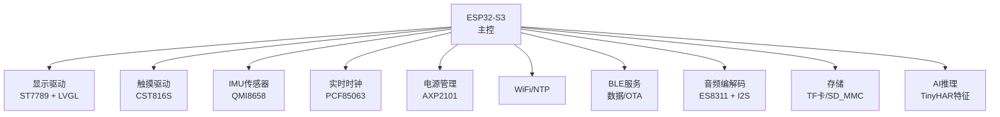
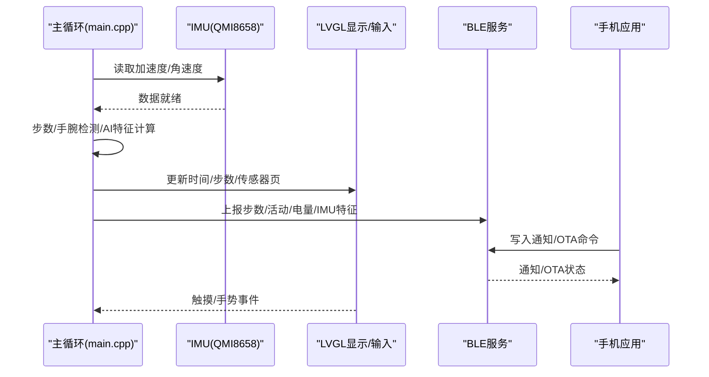
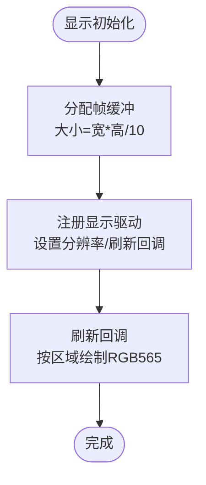
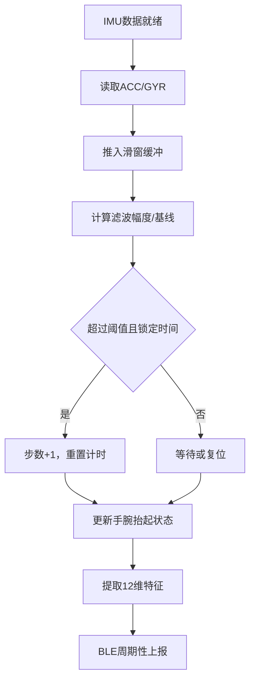
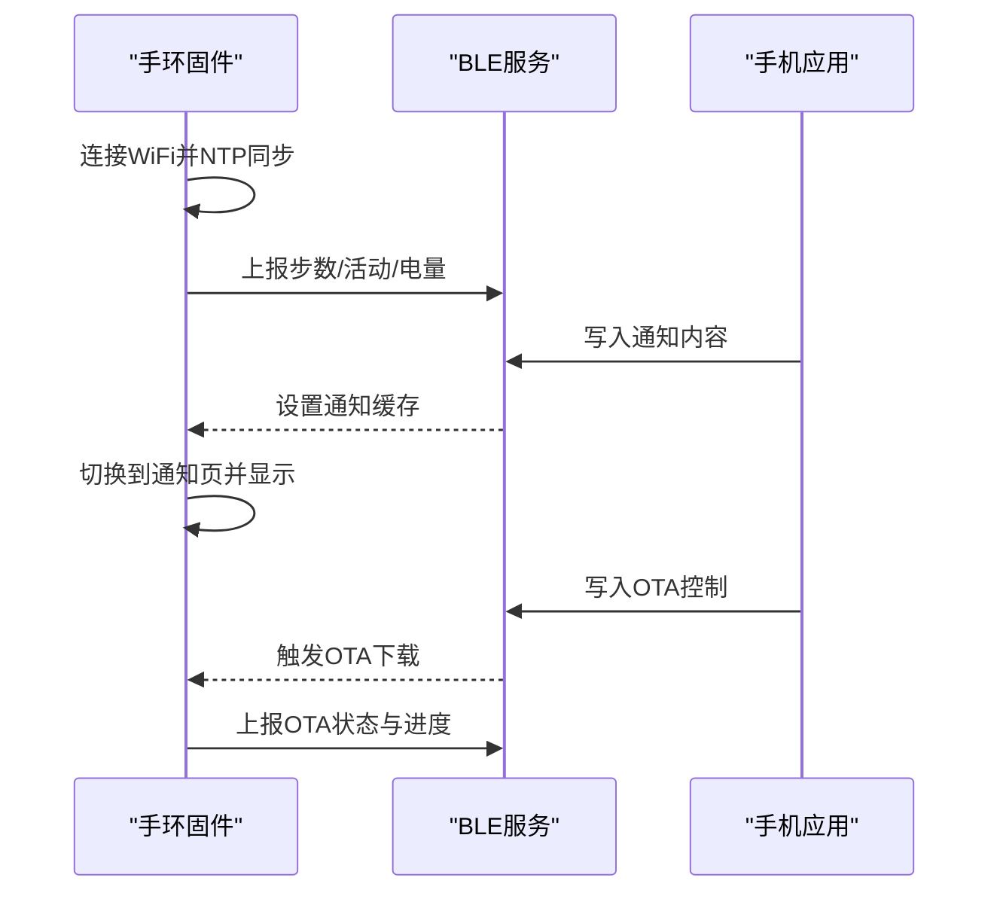
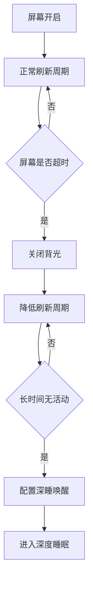
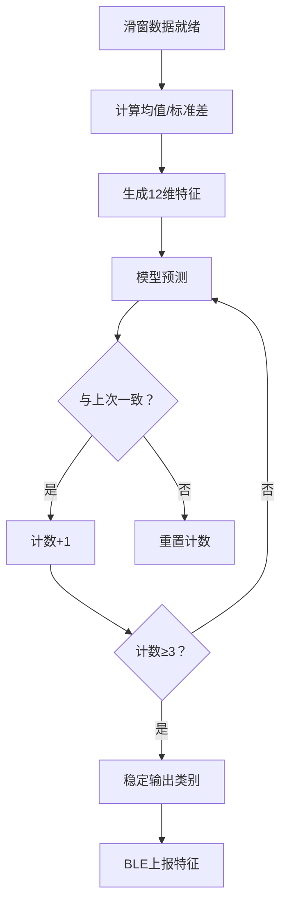
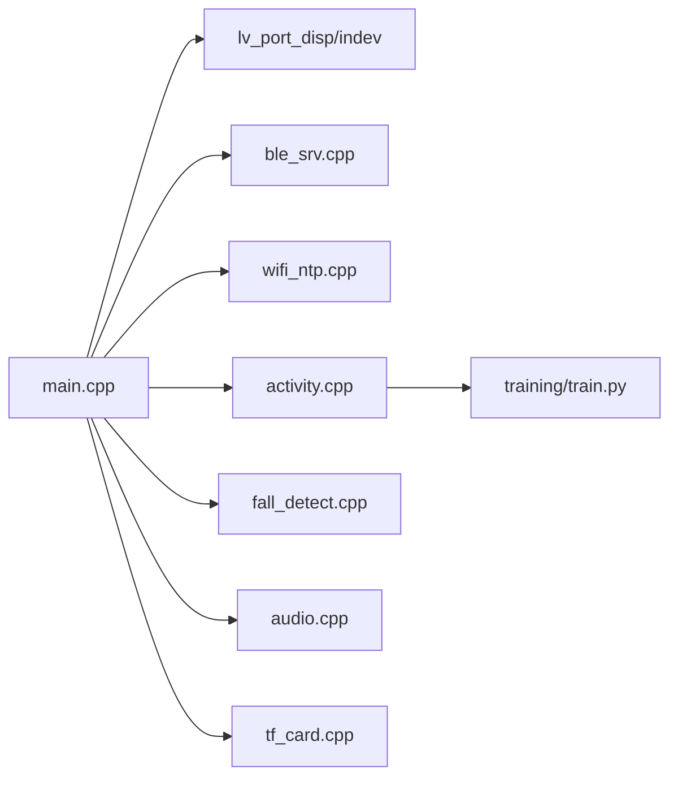

# 集成测试

<cite>
**本文引用的文件**
- [platformio.ini](file://platformio.ini)
- [ESP32-S3-R8-OPI.json](file://boards/ESP32-S3-R8-OPI.json)
- [lv_conf.h](file://include/lv_conf.h)
- [pin_config.h](file://include/pin_config.h)
- [main.cpp](file://src/main.cpp)
- [lv_port_disp.cpp](file://src/lv_port_disp.cpp)
- [lv_port_indev.cpp](file://src/lv_port_indev.cpp)
- [ble_srv.cpp](file://src/service/ble_srv.cpp)
- [wifi_ntp.cpp](file://src/service/wifi_ntp.cpp)
- [activity.cpp](file://src/activity.cpp)
- [fall_detect.cpp](file://src/fall_detect.cpp)
- [audio.cpp](file://src/service/audio.cpp)
- [tf_card.cpp](file://src/service/tf_card.cpp)
- [train.py](file://training/train.py)
</cite>

## 目录
1. [简介](#简介)
2. [项目结构](#项目结构)
3. [核心组件](#核心组件)
4. [架构总览](#架构总览)
5. [详细组件分析](#详细组件分析)
6. [依赖关系分析](#依赖关系分析)
7. [性能考量](#性能考量)
8. [故障排查指南](#故障排查指南)
9. [结论](#结论)
10. [附录](#附录)

## 简介
本集成测试文档面向SmartBracelet项目，覆盖硬件与软件的端到端联调验证，重点包括：
- 硬件集成：显示系统（ST7789 + LVGL）、触摸（CST816S）、传感器（QMI8658 IMU、PCF85063 RTC）、电源管理（AXP2101）协同工作。
- 软件集成：LVGL图形界面、传感器数据融合与AI推理（TinyHAR模型）、BLE数据服务与OTA服务、语音与音频播放、TF卡存储。
- 系统联调：功能验证、性能基准、稳定性与功耗测试。
- 测试场景：多传感器数据同步、BLE通信稳定性、电源管理效率、语音链路、AI推理特征上传。

## 项目结构
SmartBracelet采用ESP32-S3平台，以Arduino框架开发，核心由主循环驱动，配合LVGL图形栈、BLE服务、WiFi NTP、传感器与电源管理库组成。构建配置通过PlatformIO与自定义板JSON定义，LVGL通过自定义配置头进行裁剪优化。

图示来源
- [main.cpp](file://src/main.cpp#L615-L722)
- [lv_port_disp.cpp](file://src/lv_port_disp.cpp#L22-L32)
- [lv_port_indev.cpp](file://src/lv_port_indev.cpp#L21-L27)
- [ble_srv.cpp](file://src/service/ble_srv.cpp#L250-L285)
- [wifi_ntp.cpp](file://src/service/wifi_ntp.cpp#L21-L30)
- [audio.cpp](file://src/service/audio.cpp#L262-L282)
- [tf_card.cpp](file://src/service/tf_card.cpp#L7-L28)
- [activity.cpp](file://src/activity.cpp#L42-L76)

章节来源
- [platformio.ini](file://platformio.ini#L14-L41)
- [ESP32-S3-R8-OPI.json](file://boards/ESP32-S3-R8-OPI.json#L1-L40)
- [lv_conf.h](file://include/lv_conf.h#L1-L114)
- [pin_config.h](file://include/pin_config.h#L1-L41)

## 核心组件
- 显示与输入
  - LVGL显示端口负责缓冲区初始化与刷新回调；触摸端口将手势与坐标注入LVGL输入队列。
- 传感器与时间
  - IMU提供加速度与角速度，用于步数、手腕抬举检测与AI特征提取；RTC用于时间同步。
- 电源与功耗
  - PMU配置DC/ALDO输出与充电参数，主循环在屏幕关闭时降低更新频率，在深睡前进入低功耗模式。
- 无线与服务
  - BLE提供设备信息、电池、通知、数据服务（步数、电量、活动、IMU特征）与OTA服务；WiFi负责NTP校时与周期性唤醒。
- 媒体与存储
  - ES8311音频编解码器与I2S驱动，支持录音、播放与音量控制；TF卡通过SD_MMC挂载，支持目录遍历与WAV播放。
- AI推理
  - 活动识别基于滑窗统计特征，使用训练好的TinyHAR模型进行分类，周期性通过BLE特征通道上报。

章节来源
- [lv_port_disp.cpp](file://src/lv_port_disp.cpp#L11-L32)
- [lv_port_indev.cpp](file://src/lv_port_indev.cpp#L6-L27)
- [main.cpp](file://src/main.cpp#L805-L871)
- [ble_srv.cpp](file://src/service/ble_srv.cpp#L190-L223)
- [wifi_ntp.cpp](file://src/service/wifi_ntp.cpp#L62-L92)
- [audio.cpp](file://src/service/audio.cpp#L262-L365)
- [tf_card.cpp](file://src/service/tf_card.cpp#L7-L60)
- [activity.cpp](file://src/activity.cpp#L42-L129)

## 架构总览
下图展示从硬件到软件的关键交互路径：主循环驱动传感器采集、UI刷新、BLE数据上报与OTA状态回传；LVGL通过显示与输入端口连接到具体外设；BLE服务暴露特性供手机端读写；AI特征通过BLE特征通道上送。

图示来源
- [main.cpp](file://src/main.cpp#L805-L871)
- [lv_port_disp.cpp](file://src/lv_port_disp.cpp#L11-L20)
- [lv_port_indev.cpp](file://src/lv_port_indev.cpp#L6-L19)
- [ble_srv.cpp](file://src/service/ble_srv.cpp#L317-L370)

## 详细组件分析

### 显示系统与LVGL集成
- 显示端口
  - 初始化LVGL显示驱动，设置分辨率与刷新回调；使用Arduino_ST7789驱动器，按区域刷新屏幕像素。
- 输入端口
  - 将触摸事件与坐标注入LVGL输入队列，支持点击与滑动手势。
- UI页面
  - 主表盘、模拟表盘、传感器页、通知页、秒表、天气、活动AI、音乐控制、语音聊天等页面对象创建与切换。

图示来源
- [lv_port_disp.cpp](file://src/lv_port_disp.cpp#L5-L32)

章节来源
- [lv_port_disp.cpp](file://src/lv_port_disp.cpp#L11-L32)
- [lv_port_indev.cpp](file://src/lv_port_indev.cpp#L6-L27)
- [main.cpp](file://src/main.cpp#L406-L419)

### 传感器系统与数据融合
- IMU配置
  - 初始化QMI8658，启用加速度计与陀螺仪，配置采样率与滤波；主循环中读取数据并推入活动窗口。
- 步数与手腕检测
  - 低通滤波估计重力分量，结合峰值检测与超时复位实现步数统计；手腕抬起通过重力方向变化与抖动能量判定。
- AI特征提取
  - 以固定窗口与步进滑窗提取均值与标准差共12维特征，保存以便BLE上报。

图示来源
- [main.cpp](file://src/main.cpp#L805-L812)
- [main.cpp](file://src/main.cpp#L517-L547)
- [main.cpp](file://src/main.cpp#L559-L613)
- [activity.cpp](file://src/activity.cpp#L30-L76)
- [ble_srv.cpp](file://src/service/ble_srv.cpp#L403-L412)

章节来源
- [main.cpp](file://src/main.cpp#L805-L871)
- [activity.cpp](file://src/activity.cpp#L30-L129)

### 通信模块（BLE与WiFi）
- BLE服务
  - 设备信息服务、电池服务、当前时间服务、通知服务（可写入）、数据服务（步数、电量、活动、IMU特征）、OTA服务（可写入控制、状态通知）。
  - 支持Do Not Disturb开关、语音命令透传、OTA下载触发与进度上报。
- WiFi/NTP
  - 连接指定SSID/密码，周期性重连；成功后配置时区并同步时间，设置RTC；周期性关闭WiFi以节能，定时唤醒拉取天气与NTP。

图示来源
- [ble_srv.cpp](file://src/service/ble_srv.cpp#L168-L223)
- [ble_srv.cpp](file://src/service/ble_srv.cpp#L225-L248)
- [wifi_ntp.cpp](file://src/service/wifi_ntp.cpp#L62-L92)
- [main.cpp](file://src/main.cpp#L724-L764)

章节来源
- [ble_srv.cpp](file://src/service/ble_srv.cpp#L250-L413)
- [wifi_ntp.cpp](file://src/service/wifi_ntp.cpp#L21-L122)
- [main.cpp](file://src/main.cpp#L724-L764)

### 电源管理与功耗控制
- PMU初始化
  - 关闭非必要DC/ALDO，设置DC1/ALDO1电压，启用ADC测量与电池监测，配置充电电流与预充电电流。
- 功耗策略
  - 屏幕关闭时降低UI刷新周期；深度睡眠前禁用部分电源域，定时唤醒与外部中断唤醒（触摸）。

图示来源
- [main.cpp](file://src/main.cpp#L831-L898)
- [main.cpp](file://src/main.cpp#L670-L716)

章节来源
- [main.cpp](file://src/main.cpp#L831-L898)
- [main.cpp](file://src/main.cpp#L670-L716)

### AI推理引擎与特征上传
- 特征工程
  - 以固定窗口与步进滑窗提取6轴信号的均值与标准差，形成12维特征向量。
- 推理与稳定化
  - 使用训练好的模型进行分类，要求连续多次一致才稳定输出，避免误报。
- BLE上传
  - 每5秒周期性上传IMU特征，供手机端或云端进行联合推理。

图示来源
- [activity.cpp](file://src/activity.cpp#L42-L76)
- [activity.cpp](file://src/activity.cpp#L107-L129)
- [ble_srv.cpp](file://src/service/ble_srv.cpp#L403-L412)

章节来源
- [activity.cpp](file://src/activity.cpp#L1-L130)
- [ble_srv.cpp](file://src/service/ble_srv.cpp#L403-L412)

### 媒体与存储
- 音频
  - PCA9557控制功放使能，ES8311初始化与寄存器配置，I2S TX/RX驱动，支持正弦音、WAV播放与音量调节。
- 存储
  - TF卡/SD_MMC挂载，提供容量查询、目录遍历与文件读取接口。

章节来源
- [audio.cpp](file://src/service/audio.cpp#L262-L365)
- [tf_card.cpp](file://src/service/tf_card.cpp#L7-L60)

## 依赖关系分析
- 组件耦合
  - 主循环对显示、输入、BLE、WiFi、传感器、电源均有直接调用；AI特征依赖传感器数据；BLE数据服务依赖AI与传感器状态。
- 外部依赖
  - LVGL、Arduino_GFX、CST816S、SensorLib、XPowersLib、BLEDevice、WiFi、I2S、SD_MMC、ONNX/TensorRT（训练侧）。

图示来源
- [main.cpp](file://src/main.cpp#L615-L722)
- [ble_srv.cpp](file://src/service/ble_srv.cpp#L250-L285)
- [wifi_ntp.cpp](file://src/service/wifi_ntp.cpp#L21-L30)
- [activity.cpp](file://src/activity.cpp#L42-L76)
- [fall_detect.cpp](file://src/fall_detect.cpp#L54-L146)
- [audio.cpp](file://src/service/audio.cpp#L262-L282)
- [tf_card.cpp](file://src/service/tf_card.cpp#L7-L28)
- [train.py](file://training/train.py#L52-L175)

章节来源
- [main.cpp](file://src/main.cpp#L615-L722)
- [train.py](file://training/train.py#L52-L175)

## 性能考量
- 显示与内存
  - LVGL内存配置与缓冲区大小影响渲染性能；建议根据实际UI复杂度调整缓冲区与刷新周期。
- 传感器与AI
  - IMU采样率与滑窗长度决定特征维度与计算开销；BLE特征上报周期需平衡带宽与实时性。
- 无线与功耗
  - WiFi周期性开关与BLE慢广告间隔有助于节能；OTA期间提高BLE MTU与状态上报频率。
- 训练与部署
  - 训练脚本支持不同模型与超参，导出ONNX便于跨平台部署；模型参数量与算子复杂度直接影响运行时性能。

## 故障排查指南
- 显示异常
  - 检查SPI引脚配置与背光控制；确认LVGL缓冲区大小与刷新回调未被阻塞。
- 触摸无响应
  - 确认触摸中断引脚与I2C地址正确；检查输入端口读回调是否被其他任务抢占。
- 传感器数据异常
  - 校准IMU偏置；检查I2C总线与上拉电阻；确认采样率与滤波设置合理。
- BLE连接不稳定
  - 检查广告间隔与MTU设置；确保服务UUID与特性描述符正确；避免频繁写入导致丢包。
- WiFi无法连接
  - 核对SSID/密码；检查AP可达性与信道干扰；确认NTP服务器可用。
- OTA失败
  - 检查URL有效性与网络连通；查看OTA状态特性通知；确认设备有足够存储空间。
- 电源异常
  - 核对PMU寄存器配置与充电参数；检查USB供电状态与负载电流；确认深睡唤醒引脚配置。

章节来源
- [lv_port_disp.cpp](file://src/lv_port_disp.cpp#L11-L32)
- [lv_port_indev.cpp](file://src/lv_port_indev.cpp#L6-L27)
- [ble_srv.cpp](file://src/service/ble_srv.cpp#L250-L285)
- [wifi_ntp.cpp](file://src/service/wifi_ntp.cpp#L37-L92)
- [main.cpp](file://src/main.cpp#L881-L898)

## 结论
本集成测试文档提供了SmartBracelet从硬件到软件的全链路验证方案，涵盖显示、传感器、通信、电源、媒体与AI推理等关键模块。通过系统化的测试场景与流程，可有效保障功能正确性、性能稳定性与功耗效率，为后续迭代与量产奠定基础。

## 附录

### 测试环境搭建
- 硬件准备
  - ESP32-S3开发板、ST7789屏幕、CST816S触摸、QMI8658 IMU、PCF85063 RTC、AXP2101 PMU、ES8311音频编解码、TF卡槽。
- 开发工具
  - PlatformIO IDE、串口监视器、BLE调试工具（如nRF Connect）、Android/iOS手机应用。
- 配置要点
  - 平台与板型：ESP32-S3，自定义板JSON；构建标志包含LVGL配置头与调试选项。
  - 引脚映射：参考引脚配置头，确保SPI/I2C/音频/I2S引脚与原理图一致。
  - LVGL配置：颜色深度、内存、刷新周期、字体与小部件裁剪按资源限制调整。

章节来源
- [platformio.ini](file://platformio.ini#L14-L41)
- [ESP32-S3-R8-OPI.json](file://boards/ESP32-S3-R8-OPI.json#L1-L40)
- [lv_conf.h](file://include/lv_conf.h#L1-L114)
- [pin_config.h](file://include/pin_config.h#L1-L41)

### 测试场景与步骤
- 多传感器数据同步
  - 步骤：启动设备，观察传感器页数值变化；在不同动作（静止、走路、跑步）下记录ACC/GYR与步数；对比AI页面分类与实际动作一致性。
  - 关注点：滑窗长度与步进步幅、滤波参数、特征稳定性。
- BLE通信稳定性
  - 步骤：持续发送通知与OTA命令，记录丢包率与延迟；在弱信号环境下测试重连与状态回传。
  - 关注点：MTU设置、广告间隔、服务UUID一致性。
- 电源管理效率
  - 步骤：记录屏幕开启/关闭/深睡各阶段电流与休眠唤醒时间；评估不同刷新周期对续航的影响。
  - 关注点：PMU寄存器配置、深睡唤醒源、定时器精度。
- 语音链路与音频
  - 步骤：麦克风录音并播放，检查音质与延迟；通过BLE下发TTS数据并验证播放。
  - 关注点：I2S采样率与DMA缓冲、音频编解码寄存器、功放使能。
- AI推理特征上传
  - 步骤：在不同动作下采集数据，观察特征向量变化与BLE上报频率；评估分类准确率与稳定性。
  - 关注点：滑窗参数、模型阈值、BLE上报周期。

### 测试结果分析与问题定位
- 数据收集
  - 使用串口日志记录关键指标（时间戳、步数、电量、RSSI、OTA状态、错误码）。
- 分析方法
  - 统计丢包率、平均延迟、功耗曲线、分类准确率与混淆矩阵。
- 定位手段
  - 逐步缩小范围：硬件→驱动→协议→应用层；利用断点与日志交叉验证。