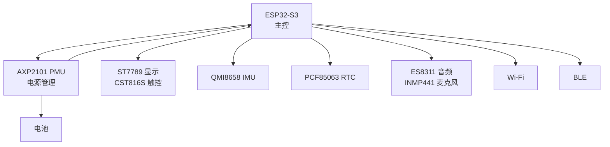
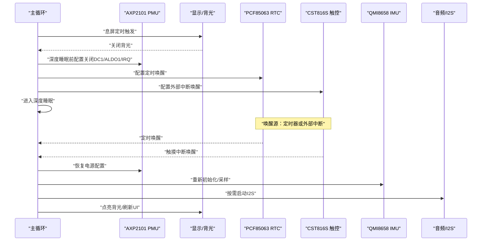
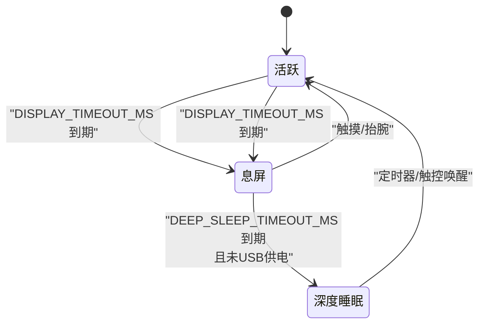
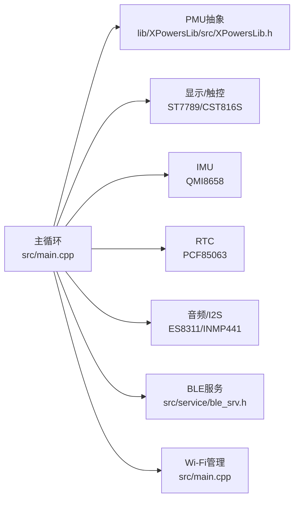

# 低功耗策略

<cite>
**本文引用的文件**
- [boards/ESP32-S3-R8-OPI.json](file://boards/ESP32-S3-R8-OPI.json)
- [include/pin_config.h](file://include/pin_config.h)
- [src/main.cpp](file://src/main.cpp)
- [src/service/audio.h](file://src/service/audio.h)
- [src/service/audio.cpp](file://src/service/audio.cpp)
- [src/service/ble_srv.h](file://src/service/ble_srv.h)
- [src/lv_port_disp.h](file://src/lv_port_disp.h)
- [src/activity.h](file://src/activity.h)
- [lib/SensorLib-Waveshare/src/SensorQMI8658.hpp](file://lib/SensorLib-Waveshare/src/SensorQMI8658.hpp)
- [lib/SensorLib-Waveshare/src/SensorPCF85063.hpp](file://lib/SensorLib-Waveshare/src/SensorPCF85063.hpp)
- [lib/XPowersLib/src/XPowersLib.h](file://lib/XPowersLib/src/XPowersLib.h)
- [lib/XPowersLib/src/XPowersAXP2101.tpp](file://lib/XPowersLib/src/XPowersAXP2101.tpp)
- [lib/XPowersLib/src/XPowersAXP192.tpp](file://lib/XPowersLib/src/XPowersAXP192.tpp)
- [src/service/tf_card.h](file://src/service/tf_card.h)
- [DEBUG_REPORT.md](file://DEBUG_REPORT.md)
- [DEVELOPMENT_PLAN.md](file://DEVELOPMENT_PLAN.md)
</cite>

## 目录
1. [简介](#简介)
2. [项目结构](#项目结构)
3. [核心组件](#核心组件)
4. [架构总览](#架构总览)
5. [详细组件分析](#详细组件分析)
6. [依赖关系分析](#依赖关系分析)
7. [性能考量](#性能考量)
8. [故障排查指南](#故障排查指南)
9. [结论](#结论)
10. [附录](#附录)

## 简介
本文件面向SmartBracelet的低功耗策略，系统化阐述从系统级到硬件级的功耗优化路径，覆盖睡眠模式（深度睡眠与浅度睡眠）、外设功耗控制、动态功耗调节、唤醒机制以及功耗测试与分析方法。文档以仓库现有实现为依据，结合调试报告与开发计划中的指标，给出可操作的优化建议与验证路径。

## 项目结构
SmartBracelet采用“主控 + 外设 + 电源管理 + 显示与输入 + 无线通信”的分层组织方式：
- 主控与运行时：ESP32-S3（Arduino框架），负责任务调度、UI渲染、传感器数据处理、BLE/Wi-Fi服务与OTA。
- 外设：ST7789显示、CST816S触控、QMI8658 IMU、PCF85063 RTC、ES8311音频编解码器、INMP441麦克风、TF卡。
- 电源管理：AXP2101 PMU，提供多路DC/ALDO/LDO输出与充电管理，并支持低功耗模式与唤醒配置。
- 无线通信：BLE与Wi-Fi，按需开启以降低功耗。

图表来源
- [src/main.cpp](file://src/main.cpp#L615-L722)
- [lib/XPowersLib/src/XPowersLib.h](file://lib/XPowersLib/src/XPowersLib.h#L14-L28)
- [include/pin_config.h](file://include/pin_config.h#L1-L41)

章节来源
- [boards/ESP32-S3-R8-OPI.json](file://boards/ESP32-S3-R8-OPI.json#L1-L40)
- [include/pin_config.h](file://include/pin_config.h#L1-L41)
- [src/main.cpp](file://src/main.cpp#L615-L722)

## 核心组件
- 电源管理（PMU）：通过AXP2101对各路电源输出进行开关与电压配置，支持关闭非必要通道、禁用IRQ、设置系统掉电阈值等，为深度睡眠做准备。
- 显示与触控：ST7789配合CST816S，背光由GPIO控制；在息屏状态下关闭背光以降低功耗。
- 传感器：QMI8658 IMU在活跃态按需采样，非活跃态可降低ODR或关闭；PCF85063 RTC用于定时唤醒。
- 音频系统：ES8311音频编解码器与INMP441麦克风通过I2S驱动，录音/播放时启用相应通道，空闲时停止I2S以节省功耗。
- 无线通信：BLE与Wi-Fi按周期性需求开启，避免常驻开启导致的功耗上升。
- 任务调度：基于LVGL与主循环的事件驱动模型，结合定时器与外部中断实现低功耗唤醒。

章节来源
- [src/main.cpp](file://src/main.cpp#L876-L898)
- [src/service/audio.cpp](file://src/service/audio.cpp#L127-L154)
- [lib/SensorLib-Waveshare/src/SensorQMI8658.hpp](file://lib/SensorLib-Waveshare/src/SensorQMI8658.hpp#L311-L420)
- [lib/SensorLib-Waveshare/src/SensorPCF85063.hpp](file://lib/SensorLib-Waveshare/src/SensorPCF85063.hpp#L116-L135)
- [lib/XPowersLib/src/XPowersLib.h](file://lib/XPowersLib/src/XPowersLib.h#L14-L28)

## 架构总览
下图展示低功耗策略在系统中的位置与交互关系：主循环根据屏幕状态与活动计时决定是否进入息屏或深度睡眠；PMU在深度睡眠前关闭非必要电源通道并配置唤醒源；传感器与音频在非活跃时段停止采样或I2S传输；BLE/Wi-Fi按需开启并周期性关闭。

图表来源
- [src/main.cpp](file://src/main.cpp#L876-L898)
- [lib/SensorLib-Waveshare/src/SensorPCF85063.hpp](file://lib/SensorLib-Waveshare/src/SensorPCF85063.hpp#L116-L135)
- [lib/XPowersLib/src/XPowersAXP2101.tpp](file://lib/XPowersLib/src/XPowersAXP2101.tpp#L994-L1013)

## 详细组件分析

### 系统级睡眠模式设计
- 浅度睡眠（息屏）：屏幕背光关闭，CPU保持运行但减少UI刷新频率与非必要任务；通过DISPLAY_TIMEOUT_MS定时器触发。
- 深度睡眠：在USB未插入时，若长时间无活动则进入深度睡眠；唤醒源包括RTC定时器与触控中断；PMU关闭DC1/ALDO1及所有IRQ，降低静态电流。
- USB供电保护：当检测到USB供电时，不进入深度睡眠，仅息屏，确保串口通信与充电可用。

图表来源
- [src/main.cpp](file://src/main.cpp#L876-L898)
- [DEBUG_REPORT.md](file://DEBUG_REPORT.md#L793-L805)

章节来源
- [src/main.cpp](file://src/main.cpp#L876-L898)
- [DEBUG_REPORT.md](file://DEBUG_REPORT.md#L762-L805)
- [DEVELOPMENT_PLAN.md](file://DEVELOPMENT_PLAN.md#L209-L220)

### 睡眠模式实现细节
- 息屏逻辑：基于last_activity_time与DISPLAY_TIMEOUT_MS判断，调用set_backlight(false)关闭背光。
- 深度睡眠入口：DEEP_SLEEP_TIMEOUT_MS到期且未USB供电时，先配置PMU（关闭DC1/ALDO1/IRQ），再启用定时器唤醒（60秒）与外部中断唤醒（TP_INT），最后调用esp_deep_sleep_start。
- 唤醒源配置：定时器唤醒使用esp_sleep_enable_timer_wakeup；触控唤醒使用esp_sleep_enable_ext0_wakeup，引脚来自TP_INT。

章节来源
- [src/main.cpp](file://src/main.cpp#L876-L898)
- [include/pin_config.h](file://include/pin_config.h#L19-L20)

### 外设功耗控制策略
- 显示器与触控
  - 背光控制：通过GPIO控制LCD_BL，在息屏时关闭背光。
  - 初始化阶段对ST7789物理不可见区域进行像素填充，避免花屏。
- 传感器
  - IMU（QMI8658）：在活跃态按需配置加速度计与陀螺仪ODR与LPF；非活跃态可通过降低ODR或关闭传感器通道降低功耗。
  - RTC（PCF85063）：用于深度睡眠定时唤醒，保持低功耗运行。
- 音频系统
  - 发送路径（I2S_NUM_0，ES8311）：仅在播放时启用I2S，播放结束后停止I2S以降低功耗。
  - 录制路径（I2S_NUM_1，INMP441）：录音开始时安装I2S并启动任务，录音结束时停止I2S并等待任务退出。
- TF卡
  - 通过SDMMC接口挂载，按需初始化与查询容量信息，避免常驻供电。

章节来源
- [src/main.cpp](file://src/main.cpp#L628-L643)
- [lib/SensorLib-Waveshare/src/SensorQMI8658.hpp](file://lib/SensorLib-Waveshare/src/SensorQMI8658.hpp#L311-L420)
- [lib/SensorLib-Waveshare/src/SensorPCF85063.hpp](file://lib/SensorLib-Waveshare/src/SensorPCF85063.hpp#L116-L135)
- [src/service/audio.cpp](file://src/service/audio.cpp#L127-L154)
- [src/service/audio.cpp](file://src/service/audio.cpp#L225-L245)
- [src/service/tf_card.h](file://src/service/tf_card.h#L1-L9)

### 动态功耗调节机制
- CPU频率与总线频率
  - 当前实现未显式调整CPU频率与总线分频；主循环中通过delay(5)让出CPU时间片，减少空转功耗。
- 外设时钟与采样率
  - IMU采样率通过configAccelerometer与configGyroscope配置，可在非活跃态降低ODR以降低功耗。
  - 音频采样率固定于I2S初始化阶段，录音/播放时启用相应通道，空闲时停止I2S。
- 电源通道管理
  - 深度睡眠前关闭DC1/ALDO1等非必要电源通道，并禁用PMU IRQ，降低静态电流。

章节来源
- [src/main.cpp](file://src/main.cpp#L924-L925)
- [lib/SensorLib-Waveshare/src/SensorQMI8658.hpp](file://lib/SensorLib-Waveshare/src/SensorQMI8658.hpp#L311-L420)
- [src/service/audio.cpp](file://src/service/audio.cpp#L127-L154)
- [lib/XPowersLib/src/XPowersAXP2101.tpp](file://lib/XPowersLib/src/XPowersAXP2101.tpp#L994-L1013)

### 唤醒机制设计
- 定时器唤醒：使用esp_sleep_enable_timer_wakeup配置60秒周期，满足定期RTC检查与系统维护需求。
- 通信唤醒：BLE/Wi-Fi在需要时开启，非活跃时关闭；当前未见专用“通信唤醒”配置，建议在需要时通过外部中断或定时器轮询实现。
- 触觉唤醒：CST816S触控INT引脚连接至ESP32-S3的EXT0唤醒引脚，触摸事件可唤醒设备。
- USB供电检测：在USB供电时避免深度睡眠，确保串口通信与充电可用。

章节来源
- [src/main.cpp](file://src/main.cpp#L894-L896)
- [include/pin_config.h](file://include/pin_config.h#L19-L20)
- [DEBUG_REPORT.md](file://DEBUG_REPORT.md#L801-L805)

### 电池与电源管理
- PMU初始化：配置DC1/ALDO1输出电压，启用电池/系统电压测量与电量计量，设置充电参数（目标电压、恒流等）。
- 掉电阈值：AXP192族PMU支持设置系统掉电电压，避免过放损坏电池。
- 低功耗配置：深度睡眠前关闭非必要电源通道与IRQ，降低静态电流。

章节来源
- [src/main.cpp](file://src/main.cpp#L670-L716)
- [lib/XPowersLib/src/XPowersLib.h](file://lib/XPowersLib/src/XPowersLib.h#L14-L28)
- [lib/XPowersLib/src/XPowersAXP192.tpp](file://lib/XPowersLib/src/XPowersAXP192.tpp#L324-L358)
- [lib/XPowersLib/src/XPowersAXP2101.tpp](file://lib/XPowersLib/src/XPowersAXP2101.tpp#L994-L1013)

### 无线与BLE服务
- BLE服务：提供电池电量、步数、活动状态、OTA状态等数据上报；支持Do Not Disturb模式与语音聊天回调。
- Wi-Fi管理：按周期开启以获取天气与NTP同步，随后关闭以降低功耗。

章节来源
- [src/service/ble_srv.h](file://src/service/ble_srv.h#L1-L50)
- [src/main.cpp](file://src/main.cpp#L748-L764)

## 依赖关系分析
- 主循环依赖PMU进行电源状态切换，依赖显示驱动与触控驱动进行用户交互，依赖BLE/Wi-Fi服务进行数据传输。
- IMU与RTC分别承担运动检测与定时唤醒职责，音频子系统按需启停I2S。
- 电源管理库提供统一的PMU抽象，支持不同芯片族的差异化实现。

图表来源
- [src/main.cpp](file://src/main.cpp#L615-L722)
- [lib/XPowersLib/src/XPowersLib.h](file://lib/XPowersLib/src/XPowersLib.h#L14-L28)
- [src/service/ble_srv.h](file://src/service/ble_srv.h#L1-L50)

章节来源
- [src/main.cpp](file://src/main.cpp#L615-L722)
- [lib/XPowersLib/src/XPowersLib.h](file://lib/XPowersLib/src/XPowersLib.h#L14-L28)

## 性能考量
- 采样率与滤波：IMU采样率与低通滤波参数影响功耗与精度平衡；建议在非活跃态降低ODR并启用LPF。
- I2S负载：音频播放/录音时I2S DMA与任务调度带来一定功耗，建议在空闲时停止I2S并释放队列资源。
- UI刷新：息屏时降低LVGL刷新频率或暂停非关键动画，减少显示驱动功耗。
- 无线唤醒：BLE/Wi-Fi按需开启，避免长连导致的功耗上升；OTA期间保持无线可用。

## 故障排查指南
- 顶部花屏：在初始化后通过SPI直接向物理不可见区域写黑像素，修复显示异常。
- 电池读数异常：当isBatteryConnect()返回false时，改用直接读取ADC寄存器与百分比寄存器的方式绕过检测。
- 深睡断串口：USB供电时跳过深度睡眠，仅息屏，确保串口通信与充电可用。
- 抬腕检测无效：v1版本通过相邻帧差值阈值过高导致误判，v2版本改为重力向量夹角与静止基线对比，提升可靠性。

章节来源
- [DEBUG_REPORT.md](file://DEBUG_REPORT.md#L821-L844)
- [DEBUG_REPORT.md](file://DEBUG_REPORT.md#L762-L805)

## 结论
SmartBracelet的低功耗策略以“状态机 + 外设按需 + PMU深度睡眠”为核心，结合定时器与触控中断实现可靠唤醒。通过降低IMU采样率、关闭非必要电源通道、停止I2S与息屏背光等手段，可在保证用户体验的同时显著降低功耗。建议后续引入动态频率调节与更精细的无线唤醒策略，进一步优化续航表现。

## 附录

### 功耗测试方法与工具
- 电流表/万用表：在USB供电与电池供电两种模式下分别测量不同状态下的电流，记录活跃、息屏、深度睡眠三档电流。
- 串口日志：利用USB串口输出PMU寄存器状态与唤醒原因，辅助定位异常。
- 电池检测：通过直接读取ADC寄存器与百分比寄存器，验证电池状态与电量估算。

章节来源
- [src/main.cpp](file://src/main.cpp#L697-L716)
- [DEBUG_REPORT.md](file://DEBUG_REPORT.md#L839-L844)