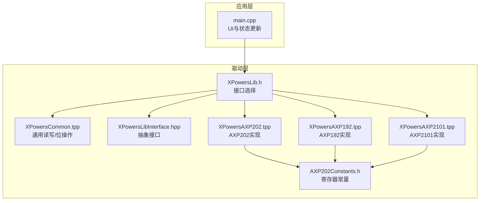
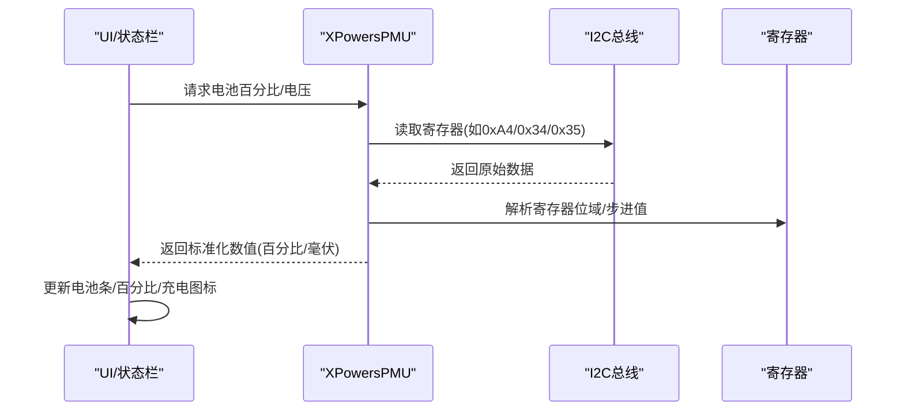
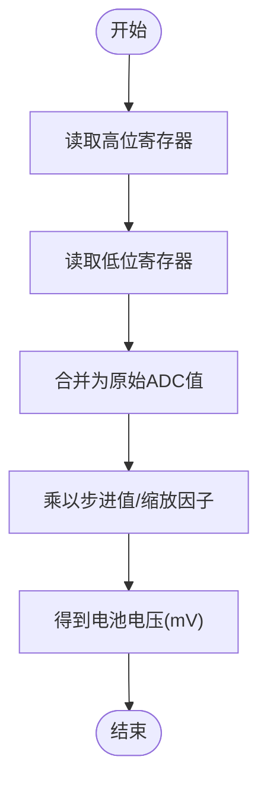
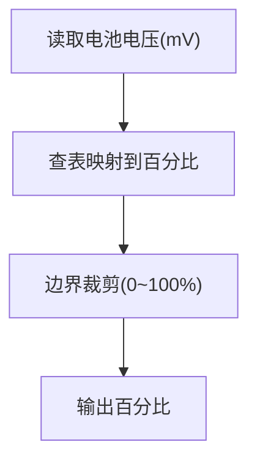
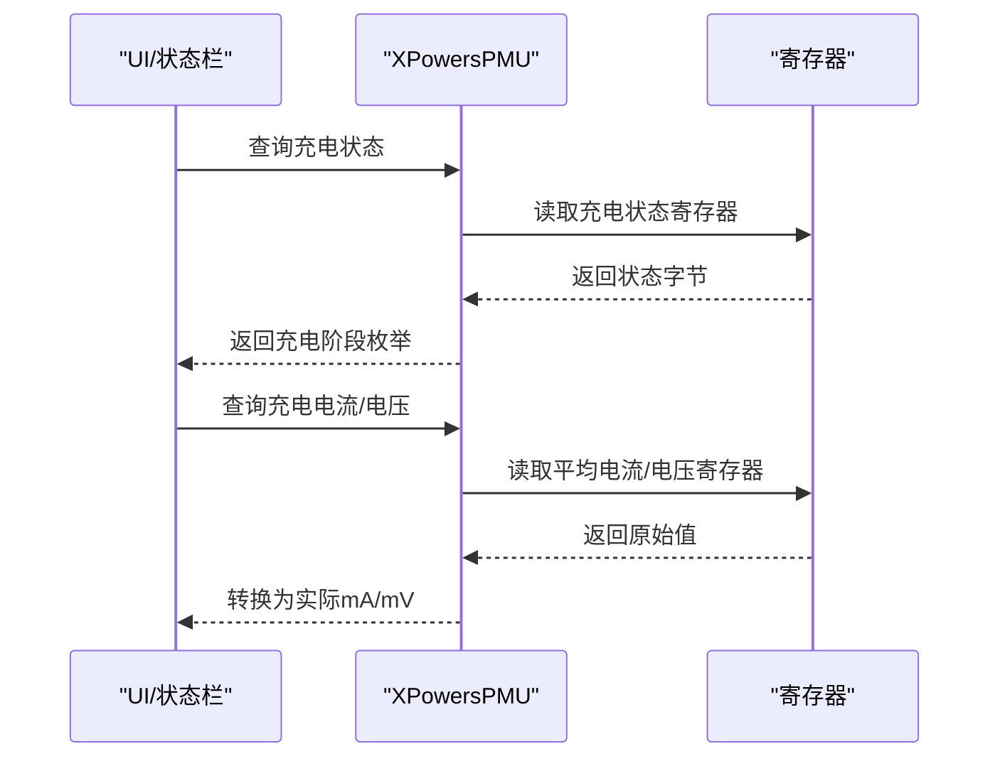
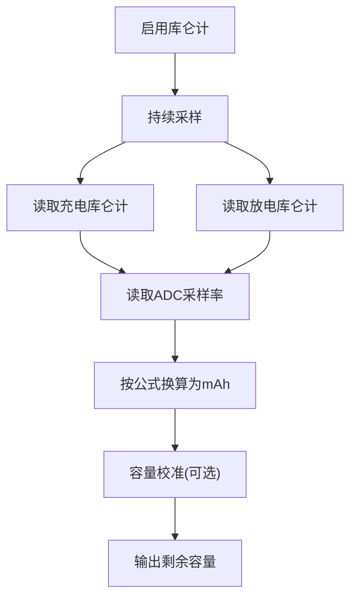
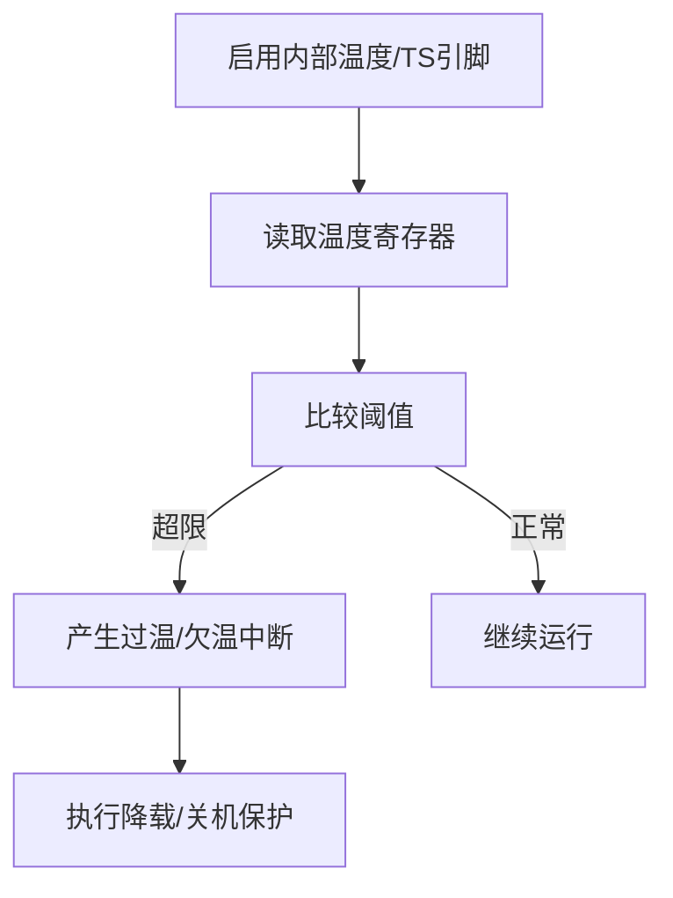
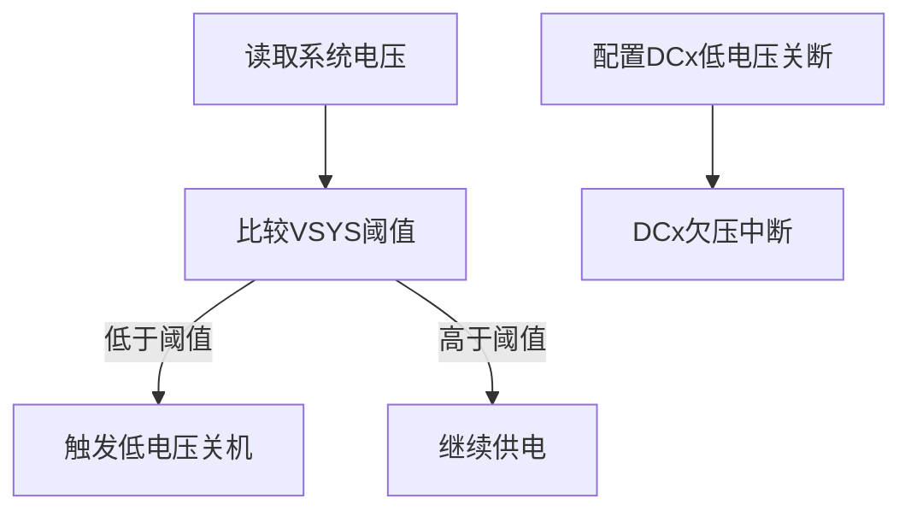
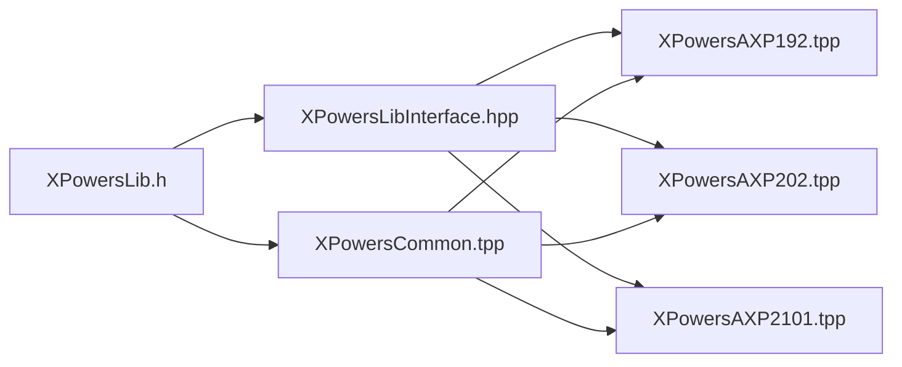

# 电池监控

<cite>
**本文引用的文件**
- [main.cpp](file://src/main.cpp)
- [XPowersLib.h](file://lib/XPowersLib/src/XPowersLib.h)
- [XPowersCommon.tpp](file://lib/XPowersLib/src/XPowersCommon.tpp)
- [XPowersLibInterface.hpp](file://lib/XPowersLib/src/XPowersLibInterface.hpp)
- [AXP202Constants.h](file://lib/XPowersLib/src/REG/AXP202Constants.h)
- [XPowersAXP202.tpp](file://lib/XPowersLib/src/XPowersAXP202.tpp)
- [XPowersAXP192.tpp](file://lib/XPowersLib/src/XPowersAXP192.tpp)
- [XPowersAXP2101.tpp](file://lib/XPowersLib/src/XPowersAXP2101.tpp)
</cite>

## 目录
1. [引言](#引言)
2. [项目结构](#项目结构)
3. [核心组件](#核心组件)
4. [架构总览](#架构总览)
5. [详细组件分析](#详细组件分析)
6. [依赖关系分析](#依赖关系分析)
7. [性能考虑](#性能考虑)
8. [故障排查指南](#故障排查指南)
9. [结论](#结论)
10. [附录](#附录)

## 引言
本文件面向智能手环项目的电池监控系统，围绕电池电压测量、ADC采样、电量估算、健康状态检测、充电状态监控与保护策略进行系统化技术说明。结合项目中使用的电源管理芯片库（XPowersLib），对底层寄存器读取、采样率、库函数封装、UI展示与中断处理进行深入解析，帮助开发者在有限资源下实现高可靠、低功耗的电池管理。

## 项目结构
项目采用“应用层 + 外设驱动库”的分层组织方式：
- 应用层：主程序负责UI更新、传感器数据采集与电池状态展示
- 驱动层：XPowersLib 提供统一接口，适配不同PMU芯片（AXP192/AXP202/AXP2101）
- 寄存器常量层：各芯片寄存器地址与步进值定义



图表来源
- [main.cpp](file://src/main.cpp#L1-L50)
- [XPowersLib.h](file://lib/XPowersLib/src/XPowersLib.h#L14-L28)
- [XPowersCommon.tpp](file://lib/XPowersLib/src/XPowersCommon.tpp#L104-L133)
- [XPowersLibInterface.hpp](file://lib/XPowersLib/src/XPowersLibInterface.hpp#L160-L180)
- [AXP202Constants.h](file://lib/XPowersLib/src/REG/AXP202Constants.h#L1-L50)

章节来源
- [main.cpp](file://src/main.cpp#L1-L50)
- [XPowersLib.h](file://lib/XPowersLib/src/XPowersLib.h#L14-L28)

## 核心组件
- 电源管理芯片（PMU）封装：通过XPowersLib统一接口访问AXP192/AXP202/AXP2101
- 通用I2C读写与寄存器位操作：XPowersCommon提供底层通信与寄存器访问
- 电池状态采集：电压、电流、百分比、充电状态、温度等
- UI与BLE服务：电池百分比、充电图标、USB接入提示
- 中断与保护：过温、低电压、充电完成等中断处理

章节来源
- [XPowersLib.h](file://lib/XPowersLib/src/XPowersLib.h#L14-L28)
- [XPowersCommon.tpp](file://lib/XPowersLib/src/XPowersCommon.tpp#L135-L207)
- [XPowersLibInterface.hpp](file://lib/XPowersLib/src/XPowersLibInterface.hpp#L304-L322)

## 架构总览
应用层通过PMU接口读取电池与系统状态，经UI模块展示；同时利用中断机制响应异常事件，保障安全运行。



图表来源
- [main.cpp](file://src/main.cpp#L469-L500)
- [XPowersAXP202.tpp](file://lib/XPowersLib/src/XPowersAXP202.tpp#L1389-L1400)
- [AXP202Constants.h](file://lib/XPowersLib/src/REG/AXP202Constants.h#L133-L148)

## 详细组件分析

### 1) 电池电压测量与ADC采样
- 原始寄存器读取：通过PMU接口读取电池电压高位/低位寄存器，拼接为原始ADC值
- 单位换算：依据芯片寄存器步进值转换为实际电压（单位毫伏）
- 采样率：部分芯片支持可配置的ADC采样率，用于库函数计算库仑计数据



图表来源
- [main.cpp](file://src/main.cpp#L421-L429)
- [XPowersAXP202.tpp](file://lib/XPowersLib/src/XPowersAXP202.tpp#L1183-L1190)
- [AXP202Constants.h](file://lib/XPowersLib/src/REG/AXP202Constants.h#L139-L148)

章节来源
- [main.cpp](file://src/main.cpp#L421-L429)
- [XPowersAXP202.tpp](file://lib/XPowersLib/src/XPowersAXP202.tpp#L1183-L1190)
- [AXP202Constants.h](file://lib/XPowersLib/src/REG/AXP202Constants.h#L139-L148)

### 2) 电量估算与百分比映射
- 百分比来源：部分芯片提供内置估算的百分比寄存器
- 电压阈值表：库中使用预置的电压阈值表进行百分比粗估（不同芯片实现略有差异）



图表来源
- [XPowersAXP202.tpp](file://lib/XPowersLib/src/XPowersAXP202.tpp#L1389-L1400)
- [XPowersAXP192.tpp](file://lib/XPowersLib/src/XPowersAXP192.tpp#L1207-L1215)

章节来源
- [XPowersAXP202.tpp](file://lib/XPowersLib/src/XPowersAXP202.tpp#L1389-L1400)
- [XPowersAXP192.tpp](file://lib/XPowersLib/src/XPowersAXP192.tpp#L1207-L1215)

### 3) 充电状态监控与充电参数
- 充电状态查询：通过PMU接口获取当前充电阶段（预充/恒流/恒压/完成）
- 充电电流/电压：读取平均充电/放电电流与输入电压寄存器
- 充电保护：可通过寄存器设置充电目标电压、限流等



图表来源
- [main.cpp](file://src/main.cpp#L492-L500)
- [XPowersAXP202.tpp](file://lib/XPowersLib/src/XPowersAXP202.tpp#L1371-L1377)
- [XPowersLibInterface.hpp](file://lib/XPowersLib/src/XPowersLibInterface.hpp#L361-L390)

章节来源
- [main.cpp](file://src/main.cpp#L492-L500)
- [XPowersAXP202.tpp](file://lib/XPowersLib/src/XPowersAXP202.tpp#L1371-L1377)
- [XPowersLibInterface.hpp](file://lib/XPowersLib/src/XPowersLibInterface.hpp#L361-L390)

### 4) 库仑计数与容量校准
- 库仑计启用/停止/清零：通过控制寄存器启用或复位库仑计功能
- 充放电库仑计寄存器：读取累计充电/放电库仑计数值
- 采样率：库函数根据ADC采样率计算电量变化（Ah）



图表来源
- [XPowersAXP192.tpp](file://lib/XPowersLib/src/XPowersAXP192.tpp#L1331-L1350)
- [XPowersAXP202.tpp](file://lib/XPowersLib/src/XPowersAXP202.tpp#L1330-L1363)
- [XPowersAXP192.tpp](file://lib/XPowersLib/src/XPowersAXP192.tpp#L1377-L1390)

章节来源
- [XPowersAXP192.tpp](file://lib/XPowersLib/src/XPowersAXP192.tpp#L1331-L1350)
- [XPowersAXP202.tpp](file://lib/XPowersLib/src/XPowersAXP202.tpp#L1330-L1363)
- [XPowersAXP192.tpp](file://lib/XPowersLib/src/XPowersAXP192.tpp#L1377-L1390)

### 5) 温度监测与热保护
- 内部温度：通过内部温度寄存器读取PMU温度
- TS引脚：可选外部NTC温度检测（需硬件支持）
- 中断：过温/欠温中断标志位可用于触发保护动作



图表来源
- [XPowersLibInterface.hpp](file://lib/XPowersLib/src/XPowersLibInterface.hpp#L557-L591)
- [XPowersAXP202.tpp](file://lib/XPowersLib/src/XPowersAXP202.tpp#L998-L1006)

章节来源
- [XPowersLibInterface.hpp](file://lib/XPowersLib/src/XPowersLibInterface.hpp#L557-L591)
- [XPowersAXP202.tpp](file://lib/XPowersLib/src/XPowersAXP202.tpp#L998-L1006)

### 6) 低电压/过放保护与系统保护
- 低电压关机电压阈值：可配置系统最低工作电压，低于阈值自动关机
- 低电压关断功能：针对特定DC/DC通道可配置低电压自动关闭
- 中断：低电压/欠压相关中断用于告警或保护



图表来源
- [XPowersLibInterface.hpp](file://lib/XPowersLib/src/XPowersLibInterface.hpp#L348-L359)
- [XPowersAXP2101.tpp](file://lib/XPowersLib/src/XPowersAXP2101.tpp#L892-L911)

章节来源
- [XPowersLibInterface.hpp](file://lib/XPowersLib/src/XPowersLibInterface.hpp#L348-L359)
- [XPowersAXP2101.tpp](file://lib/XPowersLib/src/XPowersAXP2101.tpp#L892-L911)

### 7) UI与BLE服务中的电池信息展示
- 百分比与电压：从PMU读取并更新状态栏电池图标与百分比
- 充电状态：根据充电阶段显示充电符号
- USB接入：当未检测到有效电池时，显示USB模式提示

```mermaid
sequenceDiagram
participant Loop as "主循环"
participant PMU as "XPowersPMU"
participant UI as "UI/状态栏"
participant BLE as "BLE服务"
Loop->>PMU : 读取百分比/电压/充电状态
PMU-->>Loop : 返回数值
Loop->>UI : 更新电池百分比/图标
Loop->>BLE : 上报电池电量
Loop->>UI : 显示充电/USB状态
```

图表来源
- [main.cpp](file://src/main.cpp#L469-L500)
- [main.cpp](file://src/main.cpp#L435-L446)

章节来源
- [main.cpp](file://src/main.cpp#L469-L500)
- [main.cpp](file://src/main.cpp#L435-L446)

## 依赖关系分析
- 接口选择：通过宏定义在编译期选择具体芯片实现
- 通用层：所有芯片实现共享通用I2C读写与寄存器位操作
- 抽象接口：XPowersLibInterface定义统一能力集，便于上层调用



图表来源
- [XPowersLib.h](file://lib/XPowersLib/src/XPowersLib.h#L14-L28)
- [XPowersCommon.tpp](file://lib/XPowersLib/src/XPowersCommon.tpp#L104-L133)
- [XPowersLibInterface.hpp](file://lib/XPowersLib/src/XPowersLibInterface.hpp#L160-L180)

章节来源
- [XPowersLib.h](file://lib/XPowersLib/src/XPowersLib.h#L14-L28)
- [XPowersCommon.tpp](file://lib/XPowersLib/src/XPowersCommon.tpp#L104-L133)
- [XPowersLibInterface.hpp](file://lib/XPowersLib/src/XPowersLibInterface.hpp#L160-L180)

## 性能考虑
- ADC采样率：较高的采样率会增加I2C负载与功耗，应按需求折中
- UI刷新频率：电池状态更新周期建议≥1s，避免频繁I2C轮询
- 库仑计精度：库仑计数据受采样率影响，建议在稳定工况下进行容量校准
- 温度采样：温度采样频率不宜过高，避免额外功耗

## 故障排查指南
- 无有效电池电压：检查电池连接与检测使能，确认原始寄存器读数范围
- 百分比异常：核对阈值表与边界裁剪逻辑，必要时自定义映射表
- 充电状态不更新：检查充电状态寄存器读取路径与中断标志位
- 过温/欠压：查看对应中断标志位，确认阈值配置与保护动作是否生效
- I2C通信失败：检查地址、引脚配置与回调函数返回值

章节来源
- [main.cpp](file://src/main.cpp#L430-L433)
- [XPowersAXP202.tpp](file://lib/XPowersLib/src/XPowersAXP202.tpp#L971-L1034)
- [XPowersCommon.tpp](file://lib/XPowersLib/src/XPowersCommon.tpp#L135-L207)

## 结论
本项目通过XPowersLib实现了对多款PMU芯片的统一抽象，结合寄存器级读写与库函数封装，完成了电池电压/电流/电量/温度/充电状态的采集与展示。配合中断与保护机制，可在有限资源下实现可靠的电池管理。建议在实际部署中结合具体应用场景优化采样率、阈值与UI刷新策略，并在出厂或固件升级时进行容量校准与阈值验证。

## 附录
- 寄存器常量参考：不同芯片的寄存器地址与步进值定义
- 采样率与库仑计：采样率影响库仑计精度，需在设计阶段明确

章节来源
- [AXP202Constants.h](file://lib/XPowersLib/src/REG/AXP202Constants.h#L1-L193)
- [XPowersAXP202.tpp](file://lib/XPowersLib/src/XPowersAXP202.tpp#L1353-L1358)