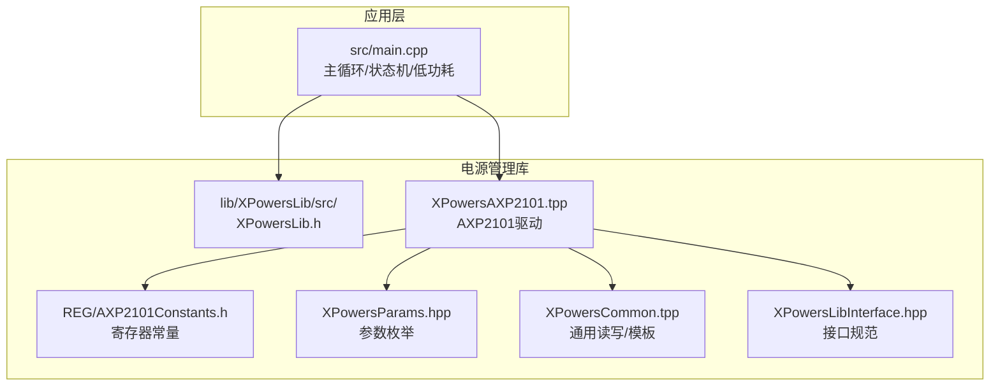
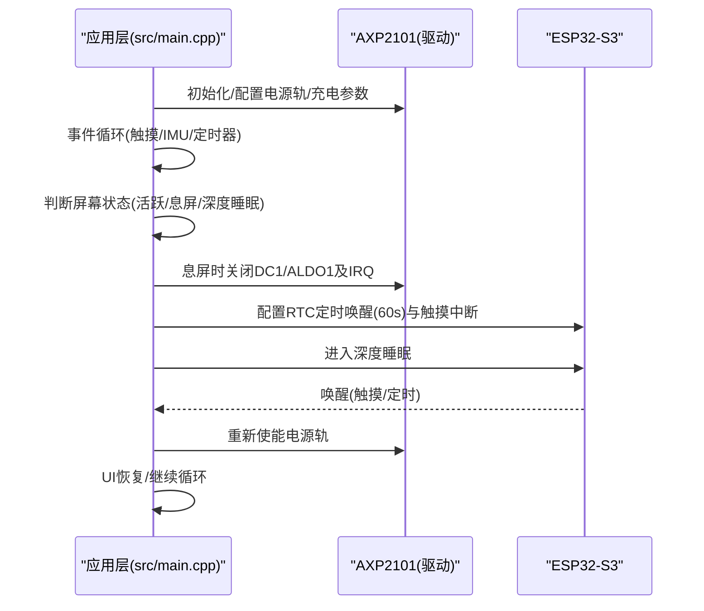
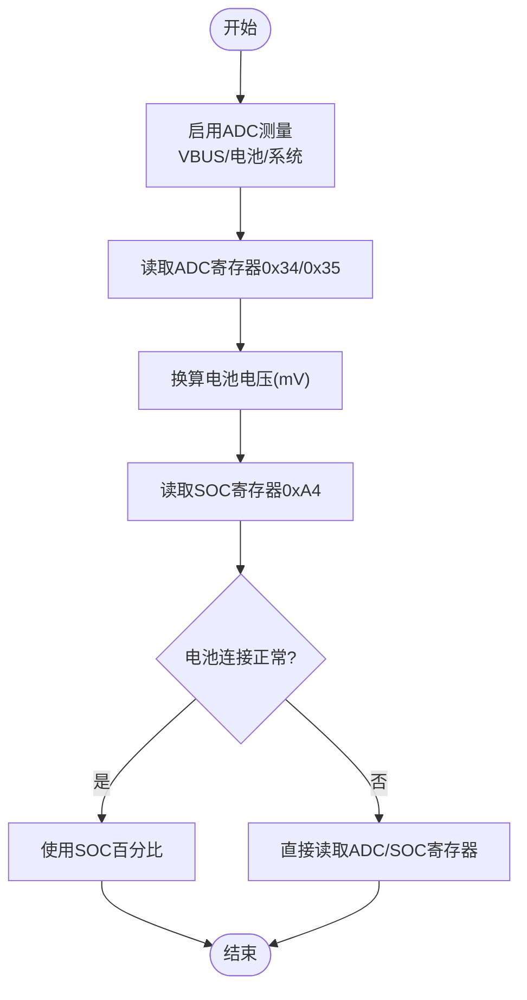
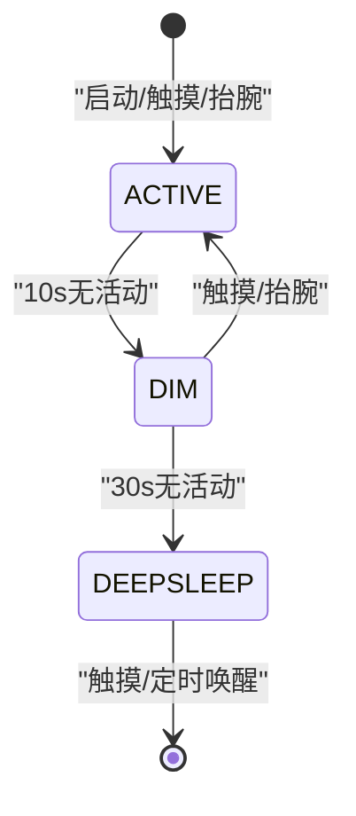
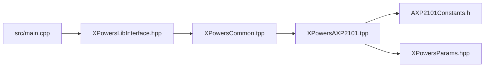

# 电源管理

<cite>
**本文引用的文件**
- [src/main.cpp](file://src/main.cpp)
- [lib/XPowersLib/src/XPowersLib.h](file://lib/XPowersLib/src/XPowersLib.h)
- [lib/XPowersLib/src/XPowersAXP2101.tpp](file://lib/XPowersLib/src/XPowersAXP2101.tpp)
- [lib/XPowersLib/src/REG/AXP2101Constants.h](file://lib/XPowersLib/src/REG/AXP2101Constants.h)
- [lib/XPowersLib/src/XPowersParams.hpp](file://lib/XPowersLib/src/XPowersParams.hpp)
- [lib/XPowersLib/src/XPowersCommon.tpp](file://lib/XPowersLib/src/XPowersCommon.tpp)
- [lib/XPowersLib/src/XPowersLibInterface.hpp](file://lib/XPowersLib/src/XPowersLibInterface.hpp)
- [DEVELOPMENT_PLAN.md](file://DEVELOPMENT_PLAN.md)
- [DEBUG_REPORT.md](file://DEBUG_REPORT.md)
</cite>

## 目录
1. [简介](#简介)
2. [项目结构](#项目结构)
3. [核心组件](#核心组件)
4. [架构总览](#架构总览)
5. [详细组件分析](#详细组件分析)
6. [依赖关系分析](#依赖关系分析)
7. [性能考量](#性能考量)
8. [故障排查指南](#故障排查指南)
9. [结论](#结论)
10. [附录](#附录)

## 简介
本文件面向 SmartBracelet 的电源管理系统，围绕 AXP2101 电源管理芯片展开，系统性阐述其配置与使用、电量监控算法、低功耗策略、充电管理、电源状态管理与功耗优化，并提供故障诊断与续航优化建议。文档以仓库现有实现为依据，结合调试报告与开发计划中的设计目标，形成可操作的技术参考。

## 项目结构
SmartBracelet 将电源管理封装在 XPowersLib 库中，应用层通过统一接口与 AXP2101 交互，主程序负责系统状态机与低功耗控制。

图表来源
- [src/main.cpp](file://src/main.cpp#L1-L120)
- [lib/XPowersLib/src/XPowersLib.h](file://lib/XPowersLib/src/XPowersLib.h#L1-L36)
- [lib/XPowersLib/src/XPowersAXP2101.tpp](file://lib/XPowersLib/src/XPowersAXP2101.tpp#L1-L120)
- [lib/XPowersLib/src/REG/AXP2101Constants.h](file://lib/XPowersLib/src/REG/AXP2101Constants.h#L1-L60)
- [lib/XPowersLib/src/XPowersParams.hpp](file://lib/XPowersLib/src/XPowersParams.hpp#L1-L120)
- [lib/XPowersLib/src/XPowersCommon.tpp](file://lib/XPowersLib/src/XPowersCommon.tpp#L1-L120)
- [lib/XPowersLib/src/XPowersLibInterface.hpp](file://lib/XPowersLib/src/XPowersLibInterface.hpp#L120-L200)

章节来源
- [src/main.cpp](file://src/main.cpp#L615-L722)
- [lib/XPowersLib/src/XPowersLib.h](file://lib/XPowersLib/src/XPowersLib.h#L14-L28)

## 核心组件
- AXP2101 驱动与接口：提供电源轨配置、ADC 测量、充电参数设置、中断与看门狗、低电量阈值、电源序列与睡眠唤醒控制等能力。
- 应用层电源状态机：基于触摸、抬腕、定时器与 USB 状态，控制屏幕背光、息屏与深度睡眠。
- 电量监控：通过 ADC 寄存器直读与百分比寄存器读取，绕过电池连接检测位，保证在异常状态下仍可显示电量信息。

章节来源
- [lib/XPowersLib/src/XPowersAXP2101.tpp](file://lib/XPowersLib/src/XPowersAXP2101.tpp#L502-L550)
- [lib/XPowersLib/src/XPowersAXP2101.tpp](file://lib/XPowersLib/src/XPowersAXP2101.tpp#L967-L1011)
- [src/main.cpp](file://src/main.cpp#L421-L446)
- [src/main.cpp](file://src/main.cpp#L876-L898)

## 架构总览
应用层通过统一接口访问 AXP2101，主循环根据用户交互与定时器切换屏幕状态；当满足深度睡眠条件时，关闭关键电源轨与中断，配置 ESP32-S3 的 RTC 定时与外部中断唤醒，进入深度睡眠。

图表来源
- [src/main.cpp](file://src/main.cpp#L876-L898)
- [lib/XPowersLib/src/XPowersAXP2101.tpp](file://lib/XPowersLib/src/XPowersAXP2101.tpp#L967-L1011)

章节来源
- [src/main.cpp](file://src/main.cpp#L876-L898)
- [DEBUG_REPORT.md](file://DEBUG_REPORT.md#L793-L805)

## 详细组件分析

### AXP2101 配置与使用
- 电源轨与测量
  - 电源轨配置：禁用未使用通道，启用所需通道（如 DC1、ALDO1），并设置目标电压。
  - 电压测量：启用 VBUS、电池与系统电压测量，用于判断供电状态与显示电量。
- 充电管理
  - 充电目标电压与恒流设置：配置充电终止电压与恒流电流，预充电电流可单独设置。
  - 充电使能：通过寄存器位控制充电使能，确保在必要时强制开启。
- 电量监控
  - 燃料计模块：启用燃料计，设置看门狗与低电量阈值，读取百分比寄存器。
  - ADC 直读：在电池连接检测异常时，直接读取 ADC 寄存器以获得电压与百分比。
- 保护与中断
  - 看门狗：可配置中断、复位与拉低 PWROK 等行为，超时清零。
  - 低电量阈值：设置低电量警告与关机电压阈值，避免过放。
  - 中断：按需启用/禁用各类中断，清理中断状态。
- 电源序列与睡眠
  - 电源序列：控制 PWROK 延迟与上电顺序。
  - 睡眠唤醒：配置唤醒源（引脚低电平、PWROK 低电平等），启用睡眠。

章节来源
- [lib/XPowersLib/src/XPowersAXP2101.tpp](file://lib/XPowersLib/src/XPowersAXP2101.tpp#L502-L550)
- [lib/XPowersLib/src/XPowersAXP2101.tpp](file://lib/XPowersLib/src/XPowersAXP2101.tpp#L530-L550)
- [lib/XPowersLib/src/XPowersAXP2101.tpp](file://lib/XPowersLib/src/XPowersAXP2101.tpp#L620-L671)
- [lib/XPowersLib/src/XPowersAXP2101.tpp](file://lib/XPowersLib/src/XPowersAXP2101.tpp#L673-L710)
- [lib/XPowersLib/src/XPowersAXP2101.tpp](file://lib/XPowersLib/src/XPowersAXP2101.tpp#L967-L1011)
- [lib/XPowersLib/src/XPowersAXP2101.tpp](file://lib/XPowersLib/src/XPowersAXP2101.tpp#L1156-L1304)
- [lib/XPowersLib/src/REG/AXP2101Constants.h](file://lib/XPowersLib/src/REG/AXP2101Constants.h#L1-L120)
- [lib/XPowersLib/src/XPowersParams.hpp](file://lib/XPowersLib/src/XPowersParams.hpp#L74-L103)

### 电量监控算法实现
- 电压测量
  - 使用 ADC 控制寄存器启用电池/系统/USB 电压测量。
  - 通过寄存器 0x34/0x35 读取高 5 位与低 8 位组合，换算得到电池电压（单位 mV）。
- 百分比估计
  - 读取寄存器 0xA4 的百分比值作为粗略电量。
  - 在电池连接检测异常时，直接读取 ADC 与百分比寄存器，绕过连接检测位。
- 健康状态检测
  - 通过充电状态机与低电量阈值中断，判断是否处于充电、放电或停止状态。
  - 通过看门狗与热保护等寄存器状态辅助判断异常。

图表来源
- [src/main.cpp](file://src/main.cpp#L421-L446)
- [lib/XPowersLib/src/REG/AXP2101Constants.h](file://lib/XPowersLib/src/REG/AXP2101Constants.h#L46-L56)
- [lib/XPowersLib/src/REG/AXP2101Constants.h](file://lib/XPowersLib/src/REG/AXP2101Constants.h#L130-L133)

章节来源
- [src/main.cpp](file://src/main.cpp#L421-L446)
- [DEBUG_REPORT.md](file://DEBUG_REPORT.md#L835-L849)

### 低功耗策略设计
- 状态机
  - 活跃：屏幕亮，背光常开；触摸/抬腕重置定时器。
  - 息屏：屏幕灭，10 秒无活动后关闭背光；触摸/抬腕唤醒。
  - 深度睡眠：息屏 30 秒后进入深度睡眠；60 秒 RTC 定时或触摸中断唤醒。
- 睡眠配置
  - 睡前关闭 DC1、ALDO1 与所有 IRQ，降低静态电流。
  - 配置 ESP32-S3 的 RTC 定时唤醒与外部中断（触摸）唤醒。
- USB 保活
  - 插拔 USB 时禁止深度睡眠，保持串口通信与调试能力。

图表来源
- [src/main.cpp](file://src/main.cpp#L876-L898)
- [DEBUG_REPORT.md](file://DEBUG_REPORT.md#L793-L805)
- [DEVELOPMENT_PLAN.md](file://DEVELOPMENT_PLAN.md#L209-L218)

章节来源
- [src/main.cpp](file://src/main.cpp#L876-L898)
- [DEBUG_REPORT.md](file://DEBUG_REPORT.md#L793-L805)
- [DEVELOPMENT_PLAN.md](file://DEVELOPMENT_PLAN.md#L209-L218)

### 充电管理系统
- 充电参数
  - 目标电压与恒流：设置充电终止电压与恒流电流，预充电电流可独立配置。
  - 充电使能：通过寄存器位强制开启充电，确保在异常情况下仍可尝试充电。
- 充电状态监控
  - 通过充电状态机与中断判断充电开始、进行中与完成。
  - 低电量阈值与看门狗配合，避免长时间过充或过放。
- 充电效率优化
  - 合理设置输入限流与 DPM（最小系统电压），提升充电稳定性。
  - 在 USB 插入时维持系统供电，避免深度睡眠影响充电过程。

章节来源
- [lib/XPowersLib/src/XPowersAXP2101.tpp](file://lib/XPowersLib/src/XPowersAXP2101.tpp#L474-L528)
- [lib/XPowersLib/src/XPowersAXP2101.tpp](file://lib/XPowersLib/src/XPowersAXP2101.tpp#L620-L671)
- [src/main.cpp](file://src/main.cpp#L682-L691)

### 电源状态管理与异常处理
- 电源模式切换
  - 通过电源序列与 PWROK 延迟控制上电顺序，避免瞬态冲击。
  - 在深度睡眠前后分别关闭/重新使能关键电源轨。
- 异常处理
  - 电池保护板触发导致无法检测到电池时，直接读取 ADC 与百分比寄存器，避免 UI 崩溃。
  - USB 插入时禁止深度睡眠，保证调试与充电。
- 安全保护
  - 看门狗超时可配置为仅中断、中断+复位、中断+拉低 PWROK 或中断+全关断，用于系统级保护。
  - 低电量阈值与过温保护联动，防止过放与过热损坏。

章节来源
- [lib/XPowersLib/src/XPowersAXP2101.tpp](file://lib/XPowersLib/src/XPowersAXP2101.tpp#L967-L1011)
- [lib/XPowersLib/src/XPowersAXP2101.tpp](file://lib/XPowersLib/src/XPowersAXP2101.tpp#L620-L671)
- [DEBUG_REPORT.md](file://DEBUG_REPORT.md#L839-L871)

### 功耗优化策略
- CPU 频率调节
  - 在息屏状态下降低 UI 更新频率，减少 CPU 活动时间。
- 外设休眠
  - 息屏时关闭未使用的电源轨与中断，仅保留必要的测量与唤醒源。
- 显示亮度控制
  - 通过背光引脚控制屏幕亮度，息屏时关闭背光。
- 无线模块管理
  - WiFi 在非必要时关闭，周期性唤醒以完成网络任务。

章节来源
- [src/main.cpp](file://src/main.cpp#L832-L849)
- [src/main.cpp](file://src/main.cpp#L876-L898)

## 依赖关系分析
- 组件耦合
  - 应用层仅依赖 XPowersLib 的接口类，通过统一方法访问 AXP2101，降低耦合度。
  - AXP2101 驱动内部依赖通用读写模板与参数枚举，便于扩展其他 PMU。
- 外部依赖
  - I2C 通信由 Wire 提供，寄存器读写通过模板封装。
  - ESP32-S3 的深度睡眠 API 用于低功耗唤醒。

图表来源
- [lib/XPowersLib/src/XPowersLibInterface.hpp](file://lib/XPowersLib/src/XPowersLibInterface.hpp#L160-L200)
- [lib/XPowersLib/src/XPowersCommon.tpp](file://lib/XPowersLib/src/XPowersCommon.tpp#L104-L133)
- [lib/XPowersLib/src/XPowersAXP2101.tpp](file://lib/XPowersLib/src/XPowersAXP2101.tpp#L1-L120)
- [lib/XPowersLib/src/REG/AXP2101Constants.h](file://lib/XPowersLib/src/REG/AXP2101Constants.h#L1-L60)
- [lib/XPowersLib/src/XPowersParams.hpp](file://lib/XPowersLib/src/XPowersParams.hpp#L1-L120)

章节来源
- [lib/XPowersLib/src/XPowersLib.h](file://lib/XPowersLib/src/XPowersLib.h#L14-L28)
- [lib/XPowersLib/src/XPowersCommon.tpp](file://lib/XPowersLib/src/XPowersCommon.tpp#L104-L133)

## 性能考量
- 读写效率
  - 采用模板封装 I2C 读写，减少重复代码；批量读取寄存器时使用连续读取接口。
- 电量估算精度
  - 直接读取 ADC 寄存器可绕过电池连接检测位，提高在异常状态下的可用性。
- 低功耗表现
  - 设计目标：活跃 ~80mA，息屏 ~30mA，深睡 ~2.5mA；实际需结合硬件与负载进行实测。

章节来源
- [lib/XPowersLib/src/XPowersCommon.tpp](file://lib/XPowersLib/src/XPowersCommon.tpp#L135-L200)
- [DEVELOPMENT_PLAN.md](file://DEVELOPMENT_PLAN.md#L209-L218)

## 故障排查指南
- 电池显示异常
  - 症状：显示 0mV、-1% 或浮空噪声。
  - 排查：检查电池保护板是否触发（过放断开），确认 AXP2101 是否检测到电池。
  - 处理：直接读取 ADC 与百分比寄存器，不依赖连接检测位；若保护板锁定，需物理断开重接或更换电池。
- 深度睡眠断开串口
  - 症状：USB 插入时无法边充电边调试。
  - 处理：在深度睡眠前检测 USB 插入状态，插着 USB 时不进入深睡。
- 抬腕检测无效
  - 症状：抬腕不亮屏。
  - 处理：检查 IMU 数据路径与算法参数（运动阈值、角度阈值），确保未被 LVGL 触控读取干扰。

章节来源
- [DEBUG_REPORT.md](file://DEBUG_REPORT.md#L839-L871)
- [src/main.cpp](file://src/main.cpp#L882-L898)
- [DEBUG_REPORT.md](file://DEBUG_REPORT.md#L779-L791)

## 结论
SmartBracelet 的电源管理以 AXP2101 为核心，通过统一接口实现电源轨配置、电量监控、充电管理与低功耗控制。应用层以状态机驱动屏幕与睡眠策略，结合看门狗与低电量阈值保障系统安全。在电池异常情况下，采用直接寄存器读取策略提升可用性。建议在后续版本中进一步细化充电曲线与唤醒源配置，以获得更优的续航表现。

## 附录
- 关键寄存器与参数
  - 电源轨与测量：0x10、0x14、0x15、0x16、0x34-0x39、0xA4
  - 看门狗与低电量：0x18、0x19、0x1A
  - 电源序列与睡眠：0x25、0x26、0x2B
- 参数枚举
  - 充电目标电压、充电电流、VBUS 限流、看门狗配置、低电量阈值等

章节来源
- [lib/XPowersLib/src/REG/AXP2101Constants.h](file://lib/XPowersLib/src/REG/AXP2101Constants.h#L1-L243)
- [lib/XPowersLib/src/XPowersParams.hpp](file://lib/XPowersLib/src/XPowersParams.hpp#L74-L103)
- [lib/XPowersLib/src/XPowersParams.hpp](file://lib/XPowersLib/src/XPowersParams.hpp#L176-L183)
- [lib/XPowersLib/src/XPowersParams.hpp](file://lib/XPowersLib/src/XPowersParams.hpp#L285-L317)