# 电源芯片配置

<cite>
**本文档引用的文件**
- [AXP2101Constants.h](file://lib/XPowersLib/src/REG/AXP2101Constants.h)
- [XPowersAXP2101.tpp](file://lib/XPowersLib/src/XPowersAXP2101.tpp)
- [XPowersLib.h](file://lib/XPowersLib/src/XPowersLib.h)
- [XPowersParams.hpp](file://lib/XPowersLib/src/XPowersParams.hpp)
- [main.cpp](file://src/main.cpp)
</cite>

## 目录
1. [简介](#简介)
2. [项目结构](#项目结构)
3. [核心组件](#核心组件)
4. [架构概览](#架构概览)
5. [详细组件分析](#详细组件分析)
6. [依赖关系分析](#依赖关系分析)
7. [性能考虑](#性能考虑)
8. [故障排除指南](#故障排除指南)
9. [结论](#结论)

## 简介

本文件为AXP2101电源管理芯片的专业技术文档，基于SmartBracelet项目的实际代码实现。AXP2101是一款高性能的电源管理单元(PMU)，集成了多种电源调节功能，包括DCDC转换器、LDO稳压器、电池充电管理、系统监控等功能。

该文档详细解释了AXP2101的寄存器配置、电压调节参数、电流限制设置等核心技术细节，并深入阐述了各个电源通道的配置方法，包括DCDC1、DCDC2、LDO1、LDO2等输出通道的电压设置和电流限制。同时涵盖了电源管理模式的配置，包括正常模式、睡眠模式、深睡模式的切换条件和参数设置，以及电源保护功能的配置。

## 项目结构

该项目采用模块化设计，电源管理功能主要集中在XPowersLib库中，通过统一的接口抽象支持多种PMU芯片。

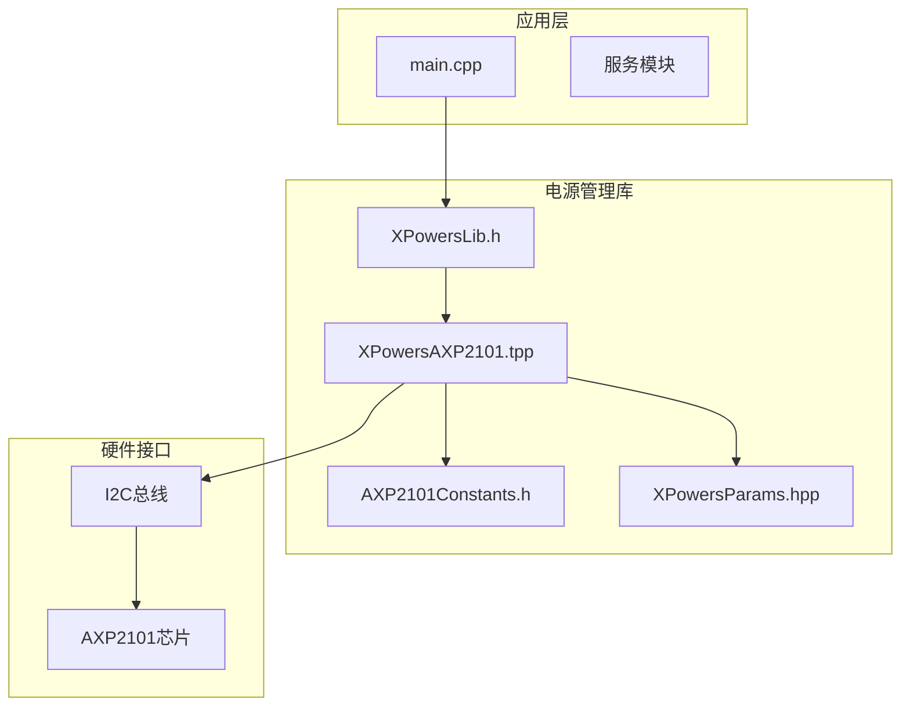

**图表来源**
- [XPowersLib.h](file://lib/XPowersLib/src/XPowersLib.h#L14-L28)
- [XPowersAXP2101.tpp](file://lib/XPowersLib/src/XPowersAXP2101.tpp#L199-L233)
- [main.cpp](file://src/main.cpp#L670-L716)

**章节来源**
- [XPowersLib.h](file://lib/XPowersLib/src/XPowersLib.h#L1-L36)
- [main.cpp](file://src/main.cpp#L1-L50)

## 核心组件

### AXP2101电源管理芯片

AXP2101是本项目使用的电源管理芯片，具有以下核心特性：
- 支持多种DCDC转换器通道(DCDC1-D CDC5)
- 支持多组LDO稳压器(ALDO1-ALDO4, BLDO1-BLDO2, DLDO1-DLDO2)
- 集成电池充电管理功能
- 内置温度监控和过温保护
- 支持多种电源管理模式

### 电源通道分类

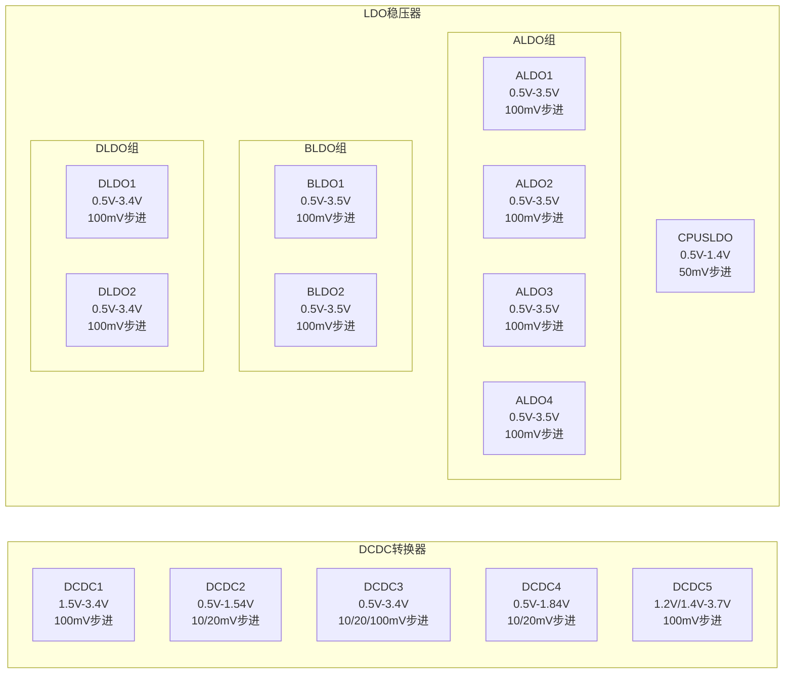

**图表来源**
- [AXP2101Constants.h](file://lib/XPowersLib/src/REG/AXP2101Constants.h#L134-L242)

**章节来源**
- [AXP2101Constants.h](file://lib/XPowersLib/src/REG/AXP2101Constants.h#L134-L242)

## 架构概览

### 初始化流程

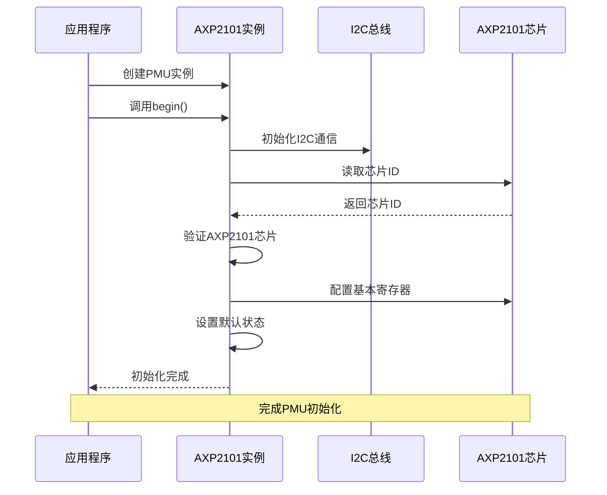

**图表来源**
- [XPowersAXP2101.tpp](file://lib/XPowersLib/src/XPowersAXP2101.tpp#L3025-L3033)
- [main.cpp](file://src/main.cpp#L670-L716)

### 电源通道配置流程

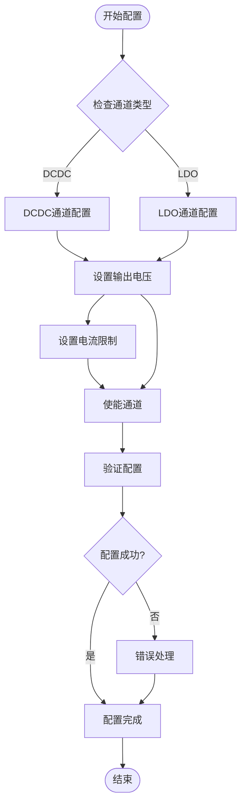

**图表来源**
- [XPowersAXP2101.tpp](file://lib/XPowersLib/src/XPowersAXP2101.tpp#L1419-L1438)
- [XPowersAXP2101.tpp](file://lib/XPowersLib/src/XPowersAXP2101.tpp#L1772-L1788)

**章节来源**
- [XPowersAXP2101.tpp](file://lib/XPowersLib/src/XPowersAXP2101.tpp#L1404-L1451)
- [XPowersAXP2101.tpp](file://lib/XPowersLib/src/XPowersAXP2101.tpp#L1757-L1794)

## 详细组件分析

### 电源通道配置详解

#### DCDC1通道配置

DCDC1是最高优先级的电源通道，支持宽范围的输出电压调节：

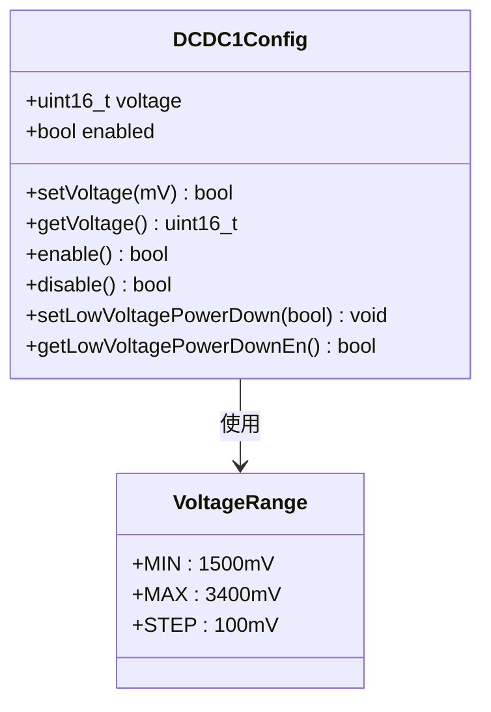

**图表来源**
- [XPowersAXP2101.tpp](file://lib/XPowersLib/src/XPowersAXP2101.tpp#L1419-L1438)
- [AXP2101Constants.h](file://lib/XPowersLib/src/REG/AXP2101Constants.h#L135-L137)

DCDC1的配置特点：
- 输出电压范围：1.5V - 3.4V
- 电压步进：100mV
- 支持低电压关断保护
- 最大输出电流：根据具体应用配置

#### DCDC2通道配置

DCDC2采用分段电压范围设计，提供更精细的电压调节：

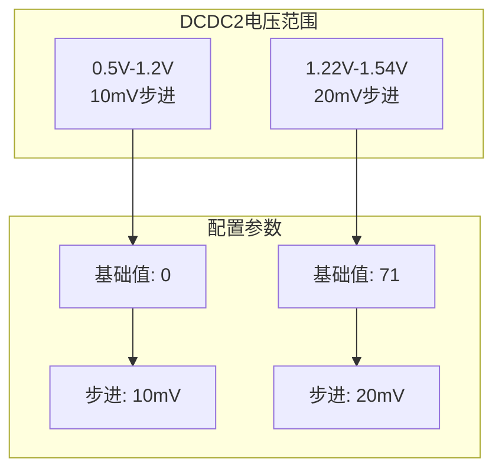

**图表来源**
- [AXP2101Constants.h](file://lib/XPowersLib/src/REG/AXP2101Constants.h#L139-L148)
- [XPowersAXP2101.tpp](file://lib/XPowersLib/src/XPowersAXP2101.tpp#L1471-L1491)

DCDC2的配置特点：
- 分段电压范围设计
- 两种步进模式：10mV和20mV
- 基础值偏移：71用于第二段范围
- 支持低电压关断保护

#### LDO通道配置

LDO通道提供稳定的低压电源输出，适用于敏感电路：

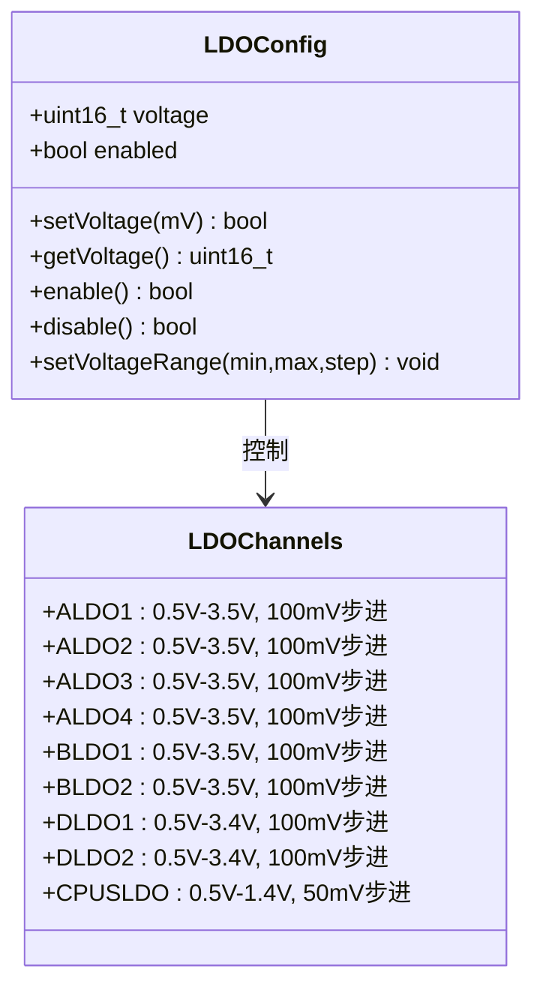

**图表来源**
- [XPowersAXP2101.tpp](file://lib/XPowersLib/src/XPowersAXP2101.tpp#L1772-L1788)
- [AXP2101Constants.h](file://lib/XPowersLib/src/REG/AXP2101Constants.h#L194-L239)

**章节来源**
- [XPowersAXP2101.tpp](file://lib/XPowersLib/src/XPowersAXP2101.tpp#L1757-L1794)
- [XPowersAXP2101.tpp](file://lib/XPowersLib/src/XPowersAXP2101.tpp#L1940-L1958)

### 电源管理模式

#### 正常工作模式

在正常工作模式下，PMU提供稳定的电源供应给所有外设：

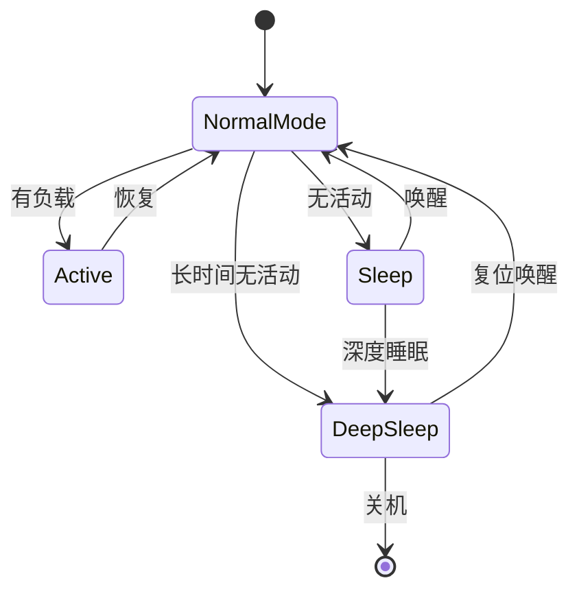

#### 睡眠模式配置

睡眠模式用于降低功耗，适用于短暂的待机状态：

| 参数 | 配置值 | 说明 |
|------|--------|------|
| 休眠延迟 | 8ms/16ms/32ms/64ms | 可配置的PWROK延迟时间 |
| 启动序列 | 顺序/并行/禁用 | 电源开启时的启动顺序控制 |
| 唤醒源 | 触摸中断/PWRON引脚 | 支持多种唤醒方式 |

#### 深睡模式配置

深睡模式提供最低功耗状态，适用于长时间休眠：

```mermaid
flowchart TD
DeepSleep[进入深睡模式] --> DisablePower[关闭非必要电源]
DisablePower --> ConfigureWake[配置唤醒源]
ConfigureWake --> EnableTimer[启用定时器唤醒]
EnableTimer --> EnableTouch[启用触摸唤醒]
EnableTouch --> EnterSleep[进入深度睡眠]
EnterSleep --> Wakeup[唤醒事件]
Wakeup --> RestorePower[恢复电源]
RestorePower --> ExitDeepSleep[退出深睡]
ExitDeepSleep --> [*]
```

**章节来源**
- [XPowersAXP2101.tpp](file://lib/XPowersLib/src/XPowersAXP2101.tpp#L994-L1021)
- [XPowersAXP2101.tpp](file://lib/XPowersLib/src/XPowersAXP2101.tpp#L942-L992)

### 电源保护功能

#### 过压保护(Over-Voltage Protection)

PMU提供多级过压保护机制：

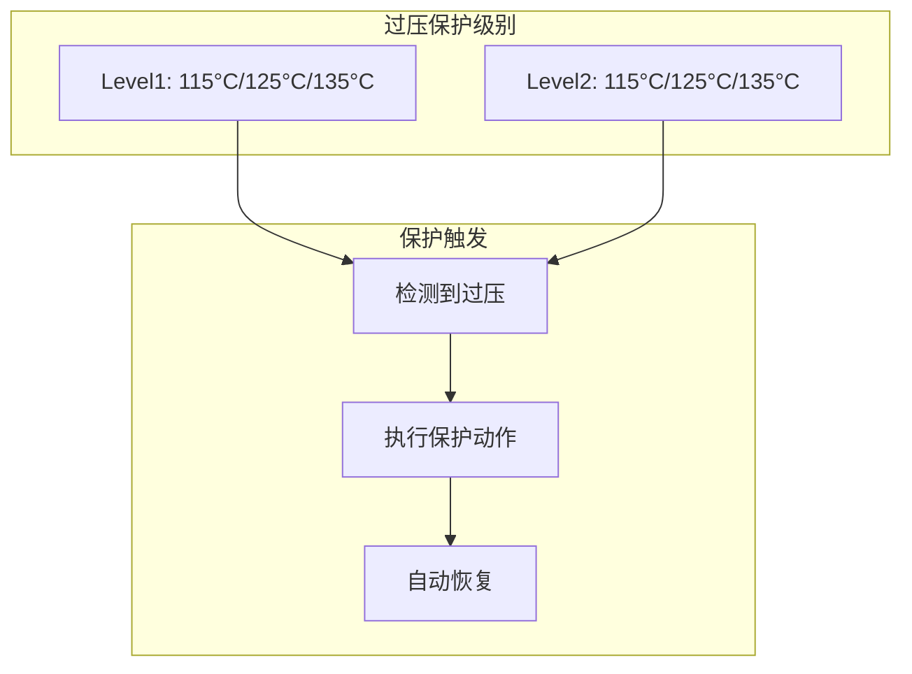

#### 欠压保护(Under-Voltage Protection)

欠压保护确保系统在电压过低时的安全运行：

| 保护类型 | 触发阈值 | 动作 |
|----------|----------|------|
| VBUS欠压 | 可配置阈值 | 关闭PMU |
| VSYS欠压 | 2.6V-3.3V | 系统关机 |
| DCDC欠压 | 各通道独立 | 通道关闭 |

#### 过流保护(Over-Current Protection)

过流保护防止电源通道过载损坏：

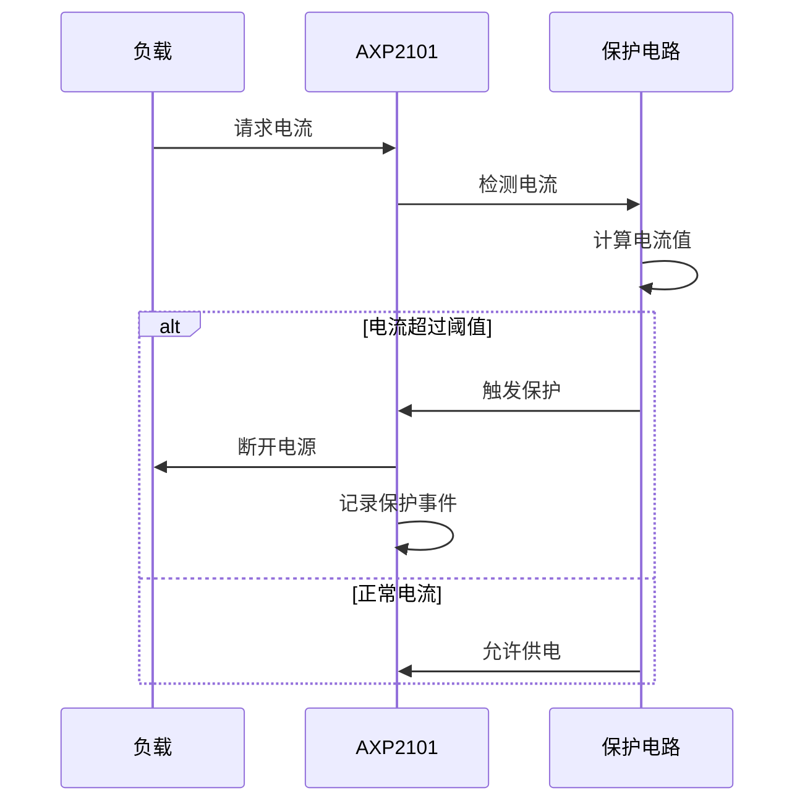

**章节来源**
- [XPowersAXP2101.tpp](file://lib/XPowersLib/src/XPowersAXP2101.tpp#L846-L911)
- [XPowersAXP2101.tpp](file://lib/XPowersLib/src/XPowersAXP2101.tpp#L1442-L1451)

### 电池充电管理

#### 充电参数配置

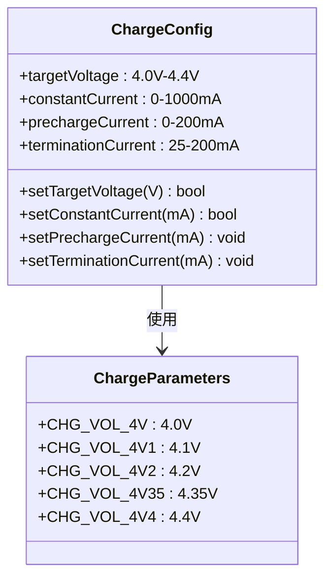

**图表来源**
- [XPowersParams.hpp](file://lib/XPowersLib/src/XPowersParams.hpp#L74-L83)
- [XPowersParams.hpp](file://lib/XPowersLib/src/XPowersParams.hpp#L86-L103)

#### 充电状态监控

PMU提供完整的充电状态监控功能：

| 充电状态 | 描述 | 寄存器位 |
|----------|------|----------|
| Tri-State | 预充电阶段 | 位0 |
| Pre-State | 预充电完成 | 位1 |
| CC-State | 恒流充电 | 位2 |
| CV-State | 恒压充电 | 位3 |
| Done-State | 充电完成 | 位4 |
| Stop-State | 停止充电 | 位5 |

**章节来源**
- [XPowersAXP2101.tpp](file://lib/XPowersLib/src/XPowersAXP2101.tpp#L333-L339)
- [XPowersParams.hpp](file://lib/XPowersLib/src/XPowersParams.hpp#L74-L103)

## 依赖关系分析

### 组件耦合关系

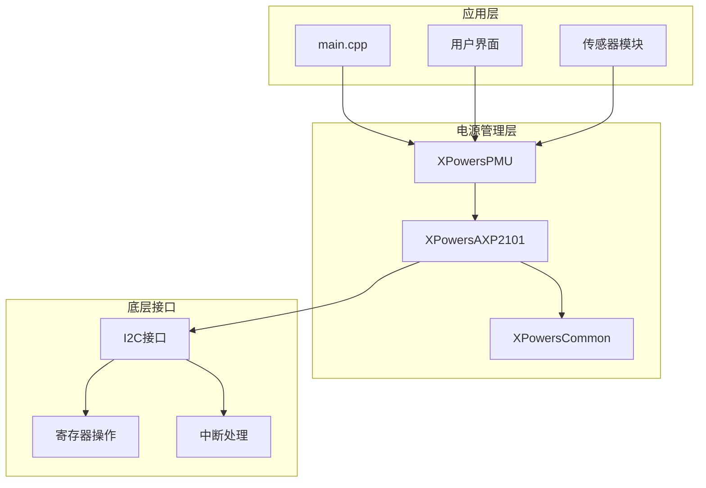

**图表来源**
- [XPowersLib.h](file://lib/XPowersLib/src/XPowersLib.h#L20-L22)
- [XPowersAXP2101.tpp](file://lib/XPowersLib/src/XPowersAXP2101.tpp#L199-L202)

### 寄存器依赖关系

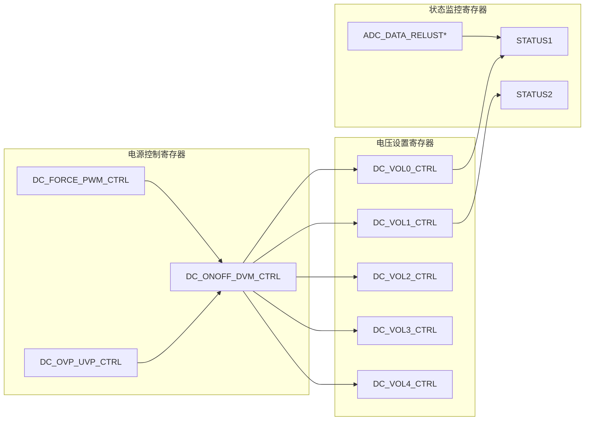

**图表来源**
- [AXP2101Constants.h](file://lib/XPowersLib/src/REG/AXP2101Constants.h#L108-L127)
- [AXP2101Constants.h](file://lib/XPowersLib/src/REG/AXP2101Constants.h#L11-L16)

**章节来源**
- [AXP2101Constants.h](file://lib/XPowersLib/src/REG/AXP2101Constants.h#L108-L127)
- [XPowersAXP2101.tpp](file://lib/XPowersLib/src/XPowersAXP2101.tpp#L1419-L1438)

## 性能考虑

### 功耗优化策略

1. **动态电源管理**
   - 根据应用需求动态启用/禁用电源通道
   - 实现智能休眠和唤醒机制
   - 优化ADC采样频率以平衡精度和功耗

2. **效率优化**
   - 选择合适的DCDC转换器模式(CCM/PWM)
   - 优化开关频率以减少EMI
   - 合理设置输出电压以提高整体效率

3. **热管理**
   - 监控芯片温度并实施热保护
   - 合理分配负载以避免局部过热
   - 利用内部热阈值设置进行温度控制

### 实时性要求

系统对电源管理的实时性要求较高，特别是在以下场景：
- 快速响应触摸唤醒
- 实时电池电量监测
- 即时的充电状态反馈

## 故障排除指南

### 常见问题及解决方案

#### 1. PMU初始化失败

**症状**：PMU无法正常初始化，返回错误状态

**可能原因**：
- I2C通信异常
- 芯片地址配置错误
- 电源供应不稳定

**解决步骤**：
1. 检查I2C连接和上拉电阻
2. 验证PMU供电电压
3. 确认芯片地址配置正确
4. 查看初始化日志输出

#### 2. 电源通道无法启用

**症状**：调用enable()函数后通道仍处于关闭状态

**可能原因**：
- 保护机制触发
- 电压设置超出范围
- 寄存器写入失败

**解决步骤**：
1. 检查保护寄存器状态
2. 验证电压设置是否在允许范围内
3. 确认寄存器写入操作成功
4. 清除相关保护标志

#### 3. 电池充电异常

**症状**：充电指示灯不亮或充电速度异常

**可能原因**：
- 充电参数配置不当
- 电池连接问题
- 温度保护触发

**解决步骤**：
1. 检查充电目标电压设置
2. 验证充电电流限制参数
3. 监控电池温度和电压
4. 检查充电状态寄存器

#### 4. 电源管理中断异常

**症状**：中断信号无法正常触发或处理

**可能原因**：
- 中断掩码配置错误
- 中断状态寄存器未正确清除
- 外部中断引脚配置问题

**解决步骤**：
1. 检查中断使能寄存器
2. 确认中断状态寄存器已清除
3. 验证外部中断引脚连接
4. 测试中断处理函数

**章节来源**
- [XPowersAXP2101.tpp](file://lib/XPowersLib/src/XPowersAXP2101.tpp#L2536-L2590)
- [main.cpp](file://src/main.cpp#L686-L716)

## 结论

AXP2101电源管理芯片提供了全面的电源管理功能，通过XPowersLib库的封装，开发者可以方便地配置和控制各种电源通道。该库实现了以下关键特性：

1. **完整的电源通道控制**：支持DCDC和LDO通道的精确电压调节和电流限制
2. **灵活的电源管理模式**：提供正常、睡眠、深睡等多种工作模式
3. **完善的保护机制**：集成过压、欠压、过流等多重保护功能
4. **智能充电管理**：支持多种充电参数配置和状态监控
5. **高效的中断处理**：提供完整的中断状态管理和处理机制

通过合理的配置和优化，AXP2101能够满足智能穿戴设备对低功耗、高可靠性的严格要求。实际应用中，建议根据具体的硬件配置和使用场景，仔细调整各项参数以达到最佳的性能和功耗平衡。