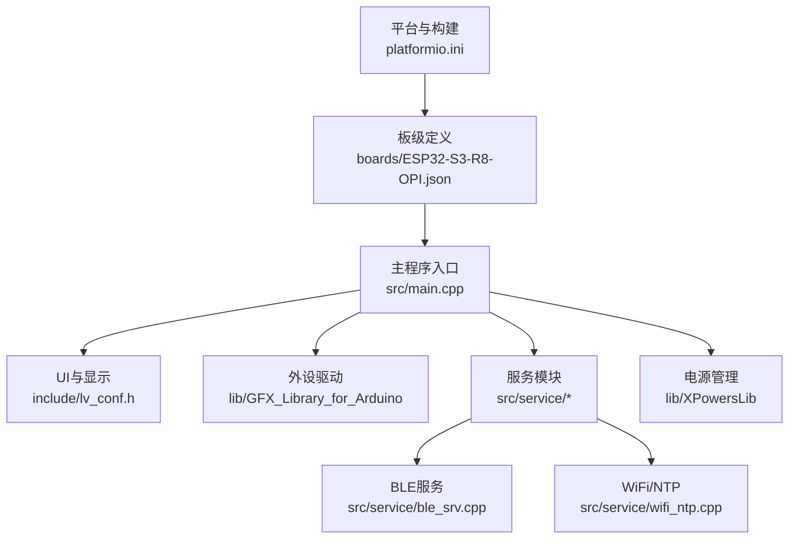
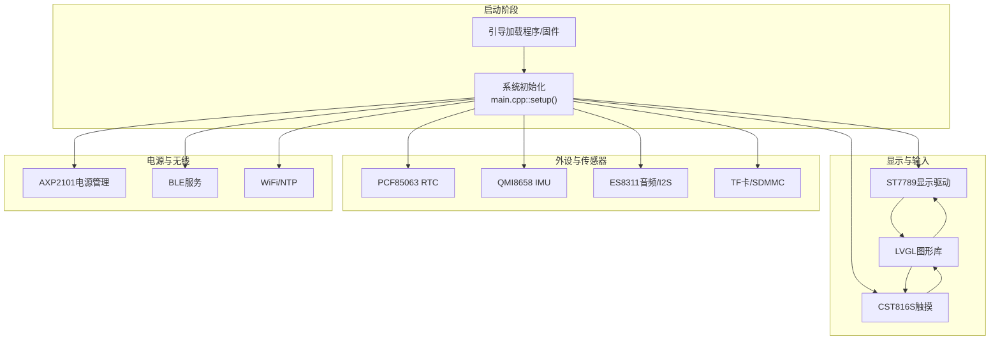
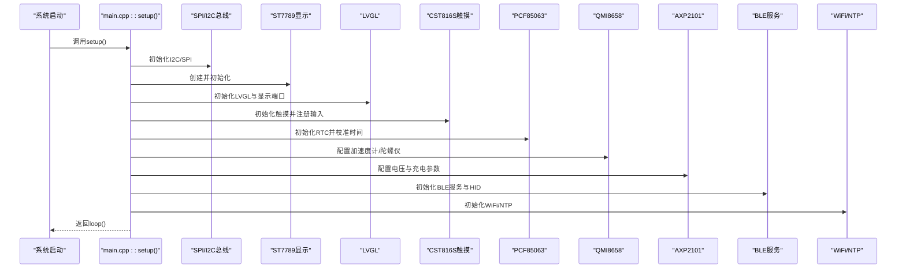
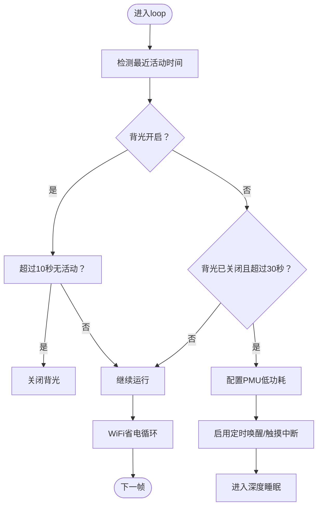
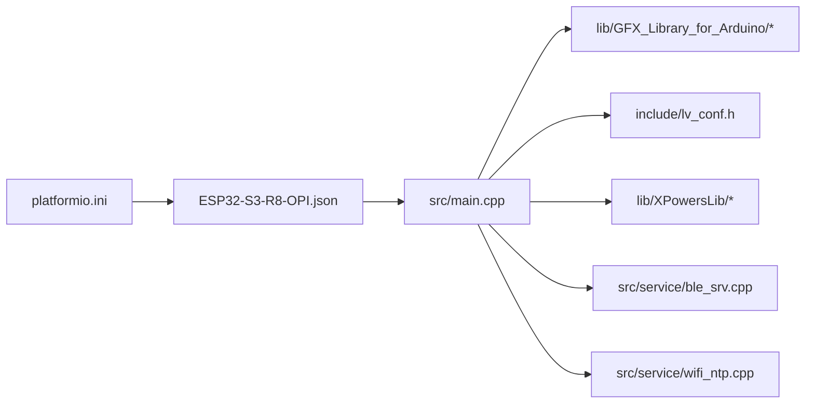

# 微控制器核心

<cite>
**本文引用的文件列表**
- [ESP32-S3-R8-OPI.json](file://boards/ESP32-S3-R8-OPI.json)
- [pin_config.h（include）](file://include/pin_config.h)
- [pin_config.h（src）](file://src/pin_config.h)
- [main.cpp](file://src/main.cpp)
- [platformio.ini](file://platformio.ini)
- [lv_conf.h](file://include/lv_conf.h)
- [Arduino_ESP32SPI.cpp](file://lib/GFX_Library_for_Arduino/src/databus/Arduino_ESP32SPI.cpp)
- [Arduino_ESP32LCD8.cpp](file://lib/GFX_Library_for_Arduino/src/databus/Arduino_ESP32LCD8.cpp)
- [Arduino_ESP32LCD16.cpp](file://lib/GFX_Library_for_Arduino/src/databus/Arduino_ESP32LCD16.cpp)
- [ble_srv.cpp](file://src/service/ble_srv.cpp)
- [wifi_ntp.cpp](file://src/service/wifi_ntp.cpp)
- [DEBUG_REPORT.md](file://DEBUG_REPORT.md)
- [XPowersAXP2101.tpp](file://lib/XPowersLib/src/XPowersAXP2101.tpp)
</cite>

## 目录
1. [简介](#简介)
2. [项目结构](#项目结构)
3. [核心组件](#核心组件)
4. [架构总览](#架构总览)
5. [详细组件分析](#详细组件分析)
6. [依赖关系分析](#依赖关系分析)
7. [性能考量](#性能考量)
8. [故障排查指南](#故障排查指南)
9. [结论](#结论)
10. [附录](#附录)

## 简介
本技术文档围绕ESP32-S3微控制器在智能手表项目中的应用进行系统化梳理，重点阐述其作为主控芯片的优势：双核架构、集成Wi-Fi与蓝牙、丰富的外设接口、灵活的时钟与内存配置、GPIO复用能力，并结合项目中的引脚分配、启动流程、外设初始化顺序、功耗管理与性能优化策略，形成从硬件到软件的完整技术视图。文档同时提供引脚映射表与功能说明，帮助开发者快速理解与扩展系统。

## 项目结构
该项目采用模块化组织方式，核心代码位于src目录，包含UI、传感器、音频、BLE、WiFi、OTA等服务模块；外设驱动与库位于lib目录；构建配置与板级定义位于根目录与boards目录。

图表来源
- [platformio.ini](file://platformio.ini#L14-L41)
- [ESP32-S3-R8-OPI.json](file://boards/ESP32-S3-R8-OPI.json#L1-L40)
- [main.cpp](file://src/main.cpp#L1-L120)

章节来源
- [platformio.ini](file://platformio.ini#L1-L41)
- [ESP32-S3-R8-OPI.json](file://boards/ESP32-S3-R8-OPI.json#L1-L40)

## 核心组件
- 主控芯片：ESP32-S3（双核、集成Wi-Fi与蓝牙、支持PSRAM）
- 显示系统：ST7789 LCD，通过SPI接口驱动，配合LVGL图形库
- 触摸系统：CST816S电容触摸控制器
- 传感器系统：PCF85063 RTC与时钟、QMI8658 6轴IMU
- 音频系统：ES8311音频编解码器与INMP441麦克风（I2S）
- 存储与TF卡：SDMMC接口（1-bit模式）
- 电源管理：AXP2101 PMU，支持充电控制与低功耗管理
- 无线通信：BLE（NimBLE）与WiFi（Arduino WiFi）

章节来源
- [main.cpp](file://src/main.cpp#L615-L722)
- [pin_config.h（include）](file://include/pin_config.h#L1-L41)
- [pin_config.h（src）](file://src/pin_config.h#L1-L41)

## 架构总览
下图展示从启动到运行期的系统架构与关键交互路径。

图表来源
- [main.cpp](file://src/main.cpp#L615-L722)
- [ble_srv.cpp](file://src/service/ble_srv.cpp#L250-L267)
- [wifi_ntp.cpp](file://src/service/wifi_ntp.cpp#L101-L121)

## 详细组件分析

### ESP32-S3微控制器核心特性与优势
- 双核架构：主频240 MHz，具备高性能与实时任务处理能力，适合UI渲染、传感器数据处理与无线协议栈并发运行。
- 集成Wi-Fi与蓝牙：内置802.11 b/g/n Wi-Fi与BLE，满足穿戴设备的短距离通信需求。
- 丰富的外设接口：SPI、I2C、I2S、UART、SDMMC、GPIO等，覆盖显示、音频、存储、传感器与电源管理等场景。
- 内存与存储：支持PSRAM，结合LVGL内存配置，可在有限RAM内实现流畅UI；Flash容量16MB，分区合理以支持引导、分区表与固件。
- 低功耗支持：提供轻度睡眠、深度睡眠与定时唤醒机制，结合PMU与触摸中断，实现智能息屏与节能。

章节来源
- [ESP32-S3-R8-OPI.json](file://boards/ESP32-S3-R8-OPI.json#L17-L22)
- [platformio.ini](file://platformio.ini#L15-L24)
- [DEBUG_REPORT.md](file://DEBUG_REPORT.md#L762-L805)

### 时钟配置与系统频率
- CPU频率：240 MHz
- Flash频率：80 MHz（配置为qio模式）
- 构建标志包含CPU频率宏，确保编译期与运行时一致
- 显示时序与LCD时钟分频由底层驱动根据F_CPU动态计算，保证刷新稳定

章节来源
- [ESP32-S3-R8-OPI.json](file://boards/ESP32-S3-R8-OPI.json#L17-L18)
- [Arduino_ESP32LCD8.cpp](file://lib/GFX_Library_for_Arduino/src/databus/Arduino_ESP32LCD8.cpp#L100-L151)
- [Arduino_ESP32LCD16.cpp](file://lib/GFX_Library_for_Arduino/src/databus/Arduino_ESP32LCD16.cpp#L82-L133)

### 内存布局与图形库配置
- LVGL内存：自定义内存分配关闭，使用堆内存，内存大小64KB，缓冲区数量上限16，适配240×284分辨率与16位色深
- 图形缓存与字体：开启常用字体与复杂绘制，兼顾UI细节与性能
- 屏幕刷新周期：默认30ms，触摸与显示读取周期同步

章节来源
- [lv_conf.h](file://include/lv_conf.h#L11-L46)

### GPIO引脚复用与外设映射
- 显示：LCD_DC、LCD_CS、LCD_SCK、LCD_MOSI、LCD_RST、LCD_BL
- I2C：IIC_SDA、IIC_SCL，触摸TP_SDA/TP_SCL、TP_RST、TP_INT
- TF卡：SDMMC_CLK、SDMMC_CMD、SDMMC_D0（1-bit模式）
- 音频：I2S_MCK、I2S_BCK、I2S_WS、I2S_DO、I2S_DI（ES8311），INMP441_WS、INMP441_SCK、INMP441_SD、INMP441_LRS
- PMU相关：PCA9557地址常量与ES8311地址常量用于音频控制

章节来源
- [pin_config.h（include）](file://include/pin_config.h#L1-L41)
- [pin_config.h（src）](file://src/pin_config.h#L1-L41)

### 启动流程与外设初始化顺序
- 初始化USB串口与延时等待枚举
- 初始化I2C总线
- 创建SPI总线与ST7789显示对象，清空物理不可见区域
- 初始化LVGL与显示端口、TF卡、音频、语音通话、跌倒检测
- 初始化触摸控制器并注册输入端口
- 初始化RTC与IMU，配置加速度计/陀螺仪参数
- 初始化PMU，配置DC/ALDO电压与充电参数，启用电量测量
- 初始化BLE服务与HID，初始化WiFi/NTP
- 打印“Ready”完成

图表来源
- [main.cpp](file://src/main.cpp#L615-L722)

章节来源
- [main.cpp](file://src/main.cpp#L615-L722)

### 外设初始化顺序与关键点
- 显示优先：先完成SPI与显示初始化，再进行LVGL与输入端口注册，确保UI可用
- 传感器：在显示与输入可用后，初始化RTC与IMU，避免阻塞UI
- PMU：在所有外设初始化完成后，统一配置PMU，确保电源稳定
- 无线：BLE与WiFi分别在独立服务模块中初始化，避免相互干扰

章节来源
- [main.cpp](file://src/main.cpp#L626-L721)

### 功耗管理模式与性能优化策略
- 屏幕背光控制：基于活动检测与定时器，10秒无活动自动关闭背光，30秒后进入深度睡眠
- WiFi省电：NTP同步与天气获取后关闭WiFi无线电，周期性重新开启以保持网络可用
- BLE省电：限制连接数与描述符数量，降低功耗
- 显示时钟分频：根据F_CPU动态计算，避免过高的SPI/I2S频率导致抖动与功耗上升
- PMU低功耗：深度睡眠前关闭DC1/ALDO1与所有IRQ，减少静态电流

图表来源
- [main.cpp](file://src/main.cpp#L876-L899)
- [DEBUG_REPORT.md](file://DEBUG_REPORT.md#L793-L805)

章节来源
- [main.cpp](file://src/main.cpp#L876-L899)
- [DEBUG_REPORT.md](file://DEBUG_REPORT.md#L762-L805)

### 引脚分配表与功能映射
以下为项目中使用的引脚映射（来源于头文件与初始化代码）：

- 显示相关
  - LCD_DC：显示数据/命令选择
  - LCD_CS：显示片选
  - LCD_SCK：显示时钟
  - LCD_MOSI：显示MOSI
  - LCD_RST：显示复位
  - LCD_BL：背光控制（GPIO）
- I2C与触摸
  - IIC_SDA：I2C数据线
  - IIC_SCL：I2C时钟线
  - TP_SDA：触摸I2C数据线
  - TP_SCL：触摸I2C时钟线
  - TP_RST：触摸复位
  - TP_INT：触摸中断
- TF卡（SDMMC）
  - SDMMC_CLK：时钟
  - SDMMC_CMD：命令
  - SDMMC_D0：数据0
- 音频（I2S）
  - I2S_MCK：主时钟
  - I2S_BCK：位时钟
  - I2S_WS：左右声道选择
  - I2S_DO：数字音频输出
  - I2S_DI：数字音频输入（麦克风）
  - ES8311_ADDR：音频编解码器地址
  - PCA9557_ADDR：PCA9557扩展IO地址（用于PA_EN）
- 麦克风（I2S_NUM_1）
  - INMP441_WS：LRCK
  - INMP441_SCK：BCLK
  - INMP441_SD：SDATA
  - INMP441_LRS：左/右声道选择（如需要）

章节来源
- [pin_config.h（include）](file://include/pin_config.h#L1-L41)
- [pin_config.h（src）](file://src/pin_config.h#L1-L41)

### 无线通信配置
- BLE服务：设备名称、加密级别、MTU设置、服务与特征创建
- WiFi/NTP：STA模式、连接尝试、RSSI查询、周期性NTP同步与天气更新

章节来源
- [ble_srv.cpp](file://src/service/ble_srv.cpp#L250-L267)
- [wifi_ntp.cpp](file://src/service/wifi_ntp.cpp#L101-L121)

## 依赖关系分析
- 构建与板级：platformio.ini与ESP32-S3-R8-OPI.json共同定义了目标芯片、框架、上传参数与额外编译标志
- 显示驱动：Arduino_ESP32SPI.cpp负责SPI模块使能与复位，Arduino_ESP32LCD8/16.cpp负责LCD时钟分频与频率计算
- 电源管理：XPowersAXP2101.tpp提供PMU寄存器操作与低功耗控制接口
- UI与输入：LVGL配置与输入端口初始化在main.cpp中完成

图表来源
- [platformio.ini](file://platformio.ini#L14-L41)
- [ESP32-S3-R8-OPI.json](file://boards/ESP32-S3-R8-OPI.json#L1-L40)
- [main.cpp](file://src/main.cpp#L1-L120)

章节来源
- [platformio.ini](file://platformio.ini#L1-L41)
- [ESP32-S3-R8-OPI.json](file://boards/ESP32-S3-R8-OPI.json#L1-L40)

## 性能考量
- 显示刷新：LVGL默认刷新周期30ms，结合F_CPU动态计算的LCD/I2S时钟，平衡画面流畅度与功耗
- 内存占用：LVGL内存64KB，缓冲区上限16，适合240×284分辨率与多页面UI
- 无线优化：BLE连接数与描述符数量限制，WiFi周期性开关，减少CPU与射频功耗
- 传感器采样：IMU配置为125 Hz加速度与112.1 Hz陀螺仪，满足步态识别与抬腕检测需求

章节来源
- [lv_conf.h](file://include/lv_conf.h#L21-L46)
- [main.cpp](file://src/main.cpp#L661-L668)

## 故障排查指南
- USB CDC枚举超时：在调用begin后增加3秒超时等待，避免永久阻塞
- 上传输出截断：使用esptool.py直接上传，避免IDE输出截断
- 板子自动复位：部分板子RTS未连接复位线路，可通过DTR或手动RST按键复位
- 最小可行性验证：先验证背光闪烁与显示基本功能，再逐步添加外设驱动
- 深度睡眠唤醒：确认触摸中断与定时唤醒配置正确，PMU低功耗设置在睡眠前完成

章节来源
- [DEBUG_REPORT.md](file://DEBUG_REPORT.md#L123-L330)
- [DEBUG_REPORT.md](file://DEBUG_REPORT.md#L762-L805)

## 结论
本项目充分利用ESP32-S3的双核、Wi-Fi与蓝牙能力，结合LVGL与丰富外设，构建出功能完备的智能手表系统。通过合理的启动流程、外设初始化顺序、功耗管理与性能优化策略，实现了在有限资源下的高可用与低功耗运行。引脚映射清晰、模块化设计便于扩展与维护。

## 附录
- 构建与上传参数：参考platformio.ini与ESP32-S3-R8-OPI.json中的构建标志与上传配置
- 显示驱动时序：参考Arduino_ESP32SPI.cpp与Arduino_ESP32LCD8/16.cpp中的模块使能与时钟分频逻辑
- 电源管理：参考XPowersAXP2101.tpp中的寄存器操作与低功耗控制函数