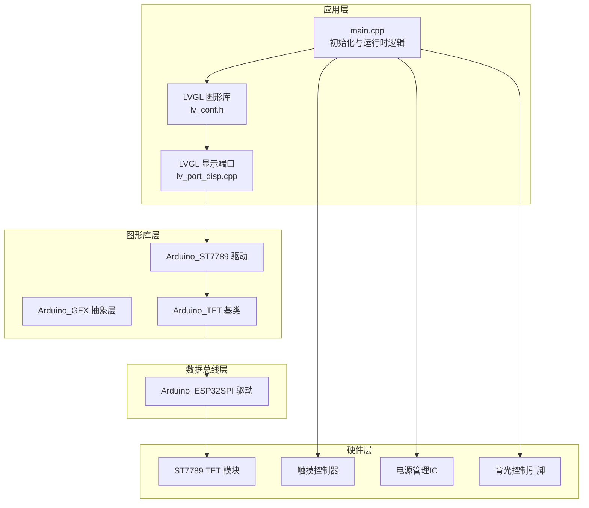
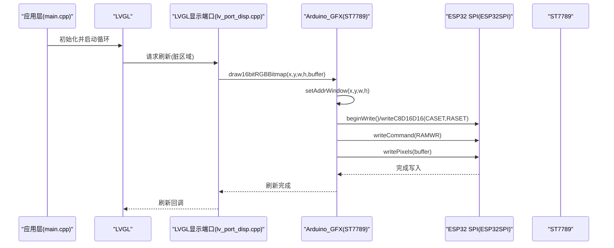
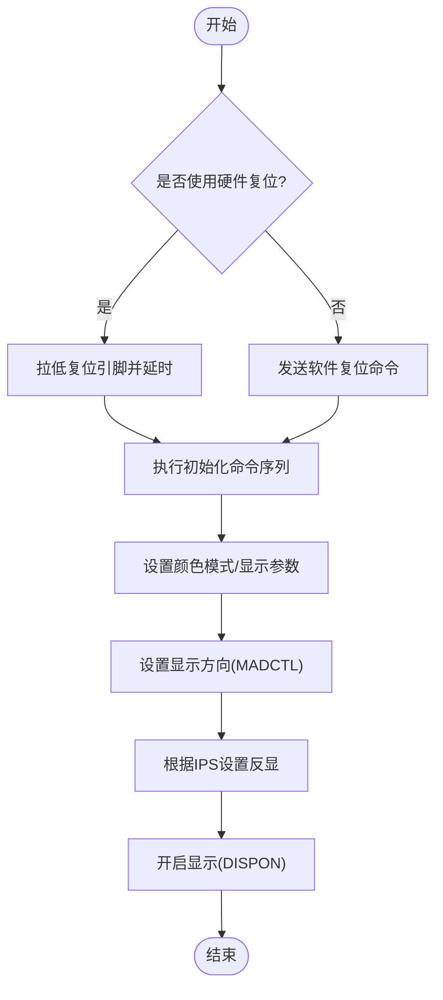
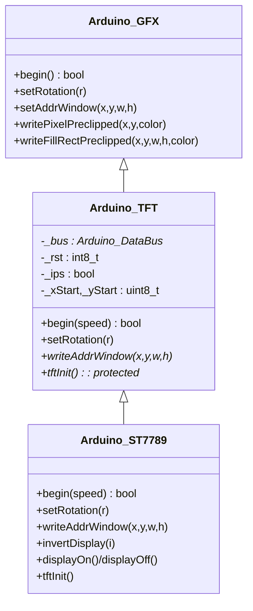
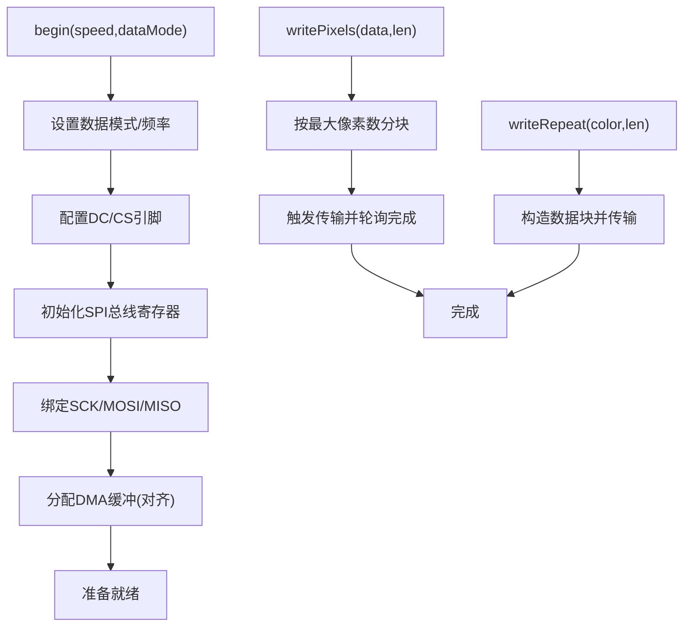
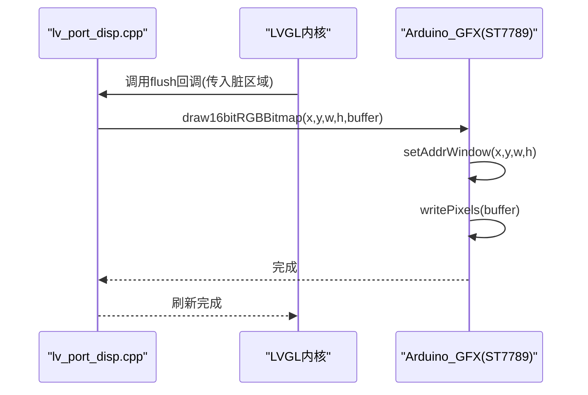
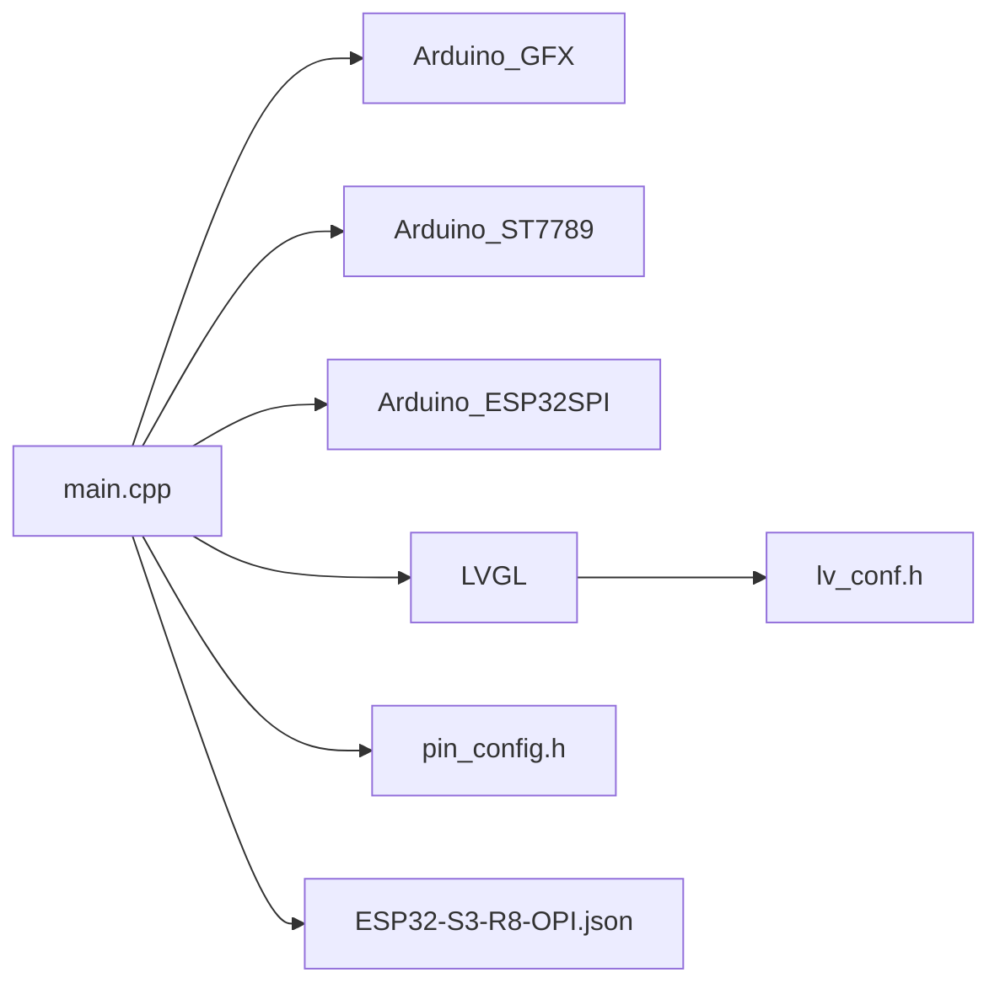

# 显示系统

<cite>
**本文引用的文件**
- [Arduino_ST7789.h](file://lib/GFX_Library_for_Arduino/src/display/Arduino_ST7789.h)
- [Arduino_ST7789.cpp](file://lib/GFX_Library_for_Arduino/src/display/Arduino_ST7789.cpp)
- [Arduino_TFT.h](file://lib/GFX_Library_for_Arduino/src/Arduino_TFT.h)
- [Arduino_TFT.cpp](file://lib/GFX_Library_for_Arduino/src/Arduino_TFT.cpp)
- [Arduino_ESP32SPI.h](file://lib/GFX_Library_for_Arduino/src/databus/Arduino_ESP32SPI.h)
- [Arduino_ESP32SPI.cpp](file://lib/GFX_Library_for_Arduino/src/databus/Arduino_ESP32SPI.cpp)
- [pin_config.h](file://include/pin_config.h)
- [lv_port_disp.h](file://src/lv_port_disp.h)
- [lv_port_disp.cpp](file://src/lv_port_disp.cpp)
- [lv_conf.h](file://include/lv_conf.h)
- [main.cpp](file://src/main.cpp)
- [ESP32-S3-R8-OPI.json](file://boards/ESP32-S3-R8-OPI.json)
</cite>

## 目录
1. [引言](#引言)
2. [项目结构](#项目结构)
3. [核心组件](#核心组件)
4. [架构总览](#架构总览)
5. [详细组件分析](#详细组件分析)
6. [依赖关系分析](#依赖关系分析)
7. [性能考虑](#性能考虑)
8. [故障诊断与维修](#故障诊断与维修)
9. [结论](#结论)

## 引言
本技术文档面向SmartBracelet显示系统，围绕ST7789 2.83英寸TFT LCD显示模块展开，系统性阐述其硬件接口（SPI）、显示缓冲区管理、像素格式与颜色空间转换、显示初始化流程、图像渲染优化、背光控制、刷新率与功耗策略，并提供实用的性能调优与故障诊断建议。文档以仓库中的实际代码为依据，结合LVGL图形界面框架，给出可操作的实现细节与优化路径。

## 项目结构
SmartBracelet的显示系统由以下层次构成：
- 应用层：主程序负责初始化显示、触摸、传感器与电源管理，并通过LVGL进行UI渲染。
- 图形库层：Arduino_GFX抽象了显示设备与数据总线，ST7789驱动继承自Arduino_TFT，提供TFT特有功能。
- 数据总线层：ESP32 SPI驱动封装底层寄存器访问，支持DMA与9位SPI模式，优化写入性能。
- 硬件层：ST7789显示面板、触摸控制器、电源管理IC以及背光控制引脚。

图表来源
- [main.cpp](file://src/main.cpp#L615-L722)
- [lv_port_disp.cpp](file://src/lv_port_disp.cpp#L22-L32)
- [Arduino_ST7789.cpp](file://lib/GFX_Library_for_Arduino/src/display/Arduino_ST7789.cpp#L17-L26)
- [Arduino_TFT.cpp](file://lib/GFX_Library_for_Arduino/src/Arduino_TFT.cpp#L22-L44)
- [Arduino_ESP32SPI.cpp](file://lib/GFX_Library_for_Arduino/src/databus/Arduino_ESP32SPI.cpp#L155-L325)

章节来源
- [main.cpp](file://src/main.cpp#L615-L722)
- [lv_port_disp.cpp](file://src/lv_port_disp.cpp#L22-L32)
- [Arduino_ST7789.h](file://lib/GFX_Library_for_Arduino/src/display/Arduino_ST7789.h#L122-L145)
- [Arduino_TFT.h](file://lib/GFX_Library_for_Arduino/src/Arduino_TFT.h#L11-L80)
- [Arduino_ESP32SPI.h](file://lib/GFX_Library_for_Arduino/src/databus/Arduino_ESP32SPI.h#L29-L99)

## 核心组件
- ST7789驱动：提供旋转设置、地址窗口写入、反显、开关显示等TFT专用功能；使用批量命令序列完成初始化。
- Arduino_TFT基类：统一显示设备生命周期、旋转与地址窗口管理、像素写入与批量绘制。
- ESP32 SPI总线：封装SPI寄存器与DMA，支持8位/9位写入、重复像素写入、像素块写入、字节流写入等。
- LVGL显示端口：定义显示缓冲区大小，注册flush回调，将LVGL绘制区域映射到ST7789物理像素。
- 背光控制：通过GPIO输出控制背光引脚，实现动态亮度与省电策略。

章节来源
- [Arduino_ST7789.cpp](file://lib/GFX_Library_for_Arduino/src/display/Arduino_ST7789.cpp#L34-L120)
- [Arduino_TFT.cpp](file://lib/GFX_Library_for_Arduino/src/Arduino_TFT.cpp#L22-L191)
- [Arduino_ESP32SPI.cpp](file://lib/GFX_Library_for_Arduino/src/databus/Arduino_ESP32SPI.cpp#L155-L800)
- [lv_port_disp.cpp](file://src/lv_port_disp.cpp#L5-L32)
- [main.cpp](file://src/main.cpp#L549-L552)

## 架构总览
显示系统采用“LVGL渲染 -> 显示端口 -> ST7789驱动 -> SPI总线 -> 硬件”的分层架构。LVGL按刷新周期提交脏矩形区域，显示端口将其转为ST7789的地址窗口与像素数据，SPI总线高效地将数据写入面板。

图表来源
- [lv_port_disp.cpp](file://src/lv_port_disp.cpp#L11-L20)
- [Arduino_ST7789.cpp](file://lib/GFX_Library_for_Arduino/src/display/Arduino_ST7789.cpp#L57-L76)
- [Arduino_ESP32SPI.cpp](file://lib/GFX_Library_for_Arduino/src/databus/Arduino_ESP32SPI.cpp#L561-L590)

## 详细组件分析

### ST7789驱动与初始化流程
- 初始化序列：复位引脚控制或软件复位后，执行批量命令数组，包括睡眠唤醒、颜色模式设置、显示控制等。
- 地址窗口：CASET/RASET设置当前写入区域，RAMWR触发写入。
- 旋转与方向：通过MADCTL寄存器设置行列翻转、行优先与RGB顺序。
- 反显与开关显示：根据IPS模式切换反显状态；SLPOUT/SLPIN控制睡眠。

图表来源
- [Arduino_ST7789.cpp](file://lib/GFX_Library_for_Arduino/src/display/Arduino_ST7789.cpp#L97-L120)
- [Arduino_ST7789.h](file://lib/GFX_Library_for_Arduino/src/display/Arduino_ST7789.h#L54-L121)

章节来源
- [Arduino_ST7789.h](file://lib/GFX_Library_for_Arduino/src/display/Arduino_ST7789.h#L54-L121)
- [Arduino_ST7789.cpp](file://lib/GFX_Library_for_Arduino/src/display/Arduino_ST7789.cpp#L97-L120)

### Arduino_TFT基类与渲染路径
- 生命周期：begin()中先初始化数据总线，再调用子类tftInit()，最后应用旋转与地址窗口。
- 写入路径：setAddrWindow()内部调用子类writeAddrWindow()设置窗口，随后写入像素或重复像素。
- 批量绘制：针对不同位深与格式提供writePixels/writeBytes/writeRepeat等优化路径。

图表来源
- [Arduino_TFT.h](file://lib/GFX_Library_for_Arduino/src/Arduino_TFT.h#L11-L80)
- [Arduino_TFT.cpp](file://lib/GFX_Library_for_Arduino/src/Arduino_TFT.cpp#L11-L800)
- [Arduino_ST7789.h](file://lib/GFX_Library_for_Arduino/src/display/Arduino_ST7789.h#L122-L145)

章节来源
- [Arduino_TFT.h](file://lib/GFX_Library_for_Arduino/src/Arduino_TFT.h#L11-L80)
- [Arduino_TFT.cpp](file://lib/GFX_Library_for_Arduino/src/Arduino_TFT.cpp#L22-L191)

### ESP32 SPI总线与数据传输
- 模式与频率：根据平台选择SPI_MODE3/SPI_MODE2；默认频率在begin()中确定。
- 9位SPI：当未连接DC引脚时，使用9位模式传输命令/数据。
- DMA与缓冲：使用内部DMA通道与对齐缓冲，支持writePixels/writeRepeat/writeBytes等批量写入。
- 优化点：writePixels按最大像素数分块传输，writeRepeat减少多次写入开销。

图表来源
- [Arduino_ESP32SPI.cpp](file://lib/GFX_Library_for_Arduino/src/databus/Arduino_ESP32SPI.cpp#L155-L325)
- [Arduino_ESP32SPI.cpp](file://lib/GFX_Library_for_Arduino/src/databus/Arduino_ESP32SPI.cpp#L719-L753)
- [Arduino_ESP32SPI.cpp](file://lib/GFX_Library_for_Arduino/src/databus/Arduino_ESP32SPI.cpp#L598-L711)

章节来源
- [Arduino_ESP32SPI.h](file://lib/GFX_Library_for_Arduino/src/databus/Arduino_ESP32SPI.h#L29-L99)
- [Arduino_ESP32SPI.cpp](file://lib/GFX_Library_for_Arduino/src/databus/Arduino_ESP32SPI.cpp#L155-L800)

### LVGL显示端口与缓冲区管理
- 缓冲区大小：根据分辨率计算显示缓冲区大小，避免超界。
- flush回调：将LVGL脏矩形区域映射为ST7789的地址窗口与像素数据。
- 注册显示驱动：设置分辨率、刷新回调与双缓冲指针。

图表来源
- [lv_port_disp.cpp](file://src/lv_port_disp.cpp#L11-L20)
- [lv_port_disp.h](file://src/lv_port_disp.h#L6-L10)

章节来源
- [lv_port_disp.h](file://src/lv_port_disp.h#L1-L11)
- [lv_port_disp.cpp](file://src/lv_port_disp.cpp#L5-L32)
- [lv_conf.h](file://include/lv_conf.h#L14-L28)

### 背光控制与电源管理
- 背光控制：通过GPIO输出控制背光引脚，配合屏幕超时与手腕抬腕检测实现动态点亮。
- 电源策略：PMU配置DC/ALDO电压与功能，启用电池测量与充电控制，降低待机功耗。

章节来源
- [main.cpp](file://src/main.cpp#L549-L552)
- [main.cpp](file://src/main.cpp#L670-L716)

## 依赖关系分析
- 主程序依赖：Arduino_GFX、Arduino_ST7789、Arduino_ESP32SPI、LVGL、触摸与传感器库。
- 驱动依赖：ST7789驱动依赖Arduino_TFT基类；Arduino_TFT依赖Arduino_DataBus；ESP32 SPI驱动依赖ESP32寄存器与DMA。
- 配置依赖：pin_config.h定义引脚映射；lv_conf.h定义LVGL颜色深度与刷新周期；ESP32-S3-R8-OPI.json定义芯片与内存类型。

图表来源
- [main.cpp](file://src/main.cpp#L1-L28)
- [pin_config.h](file://include/pin_config.h#L1-L41)
- [lv_conf.h](file://include/lv_conf.h#L1-L114)
- [ESP32-S3-R8-OPI.json](file://boards/ESP32-S3-R8-OPI.json#L1-L40)

章节来源
- [main.cpp](file://src/main.cpp#L1-L28)
- [pin_config.h](file://include/pin_config.h#L1-L41)
- [lv_conf.h](file://include/lv_conf.h#L1-L114)
- [ESP32-S3-R8-OPI.json](file://boards/ESP32-S3-R8-OPI.json#L1-L40)

## 性能考虑
- 刷新率与内存：LVGL刷新周期与内存配置需平衡流畅度与RAM占用，建议根据实际帧率调整刷新周期与缓存大小。
- SPI写入优化：优先使用writePixels/writeRepeat减少函数调用开销；确保DMA缓冲对齐，避免碎片化。
- 屏幕裁剪：仅刷新脏矩形区域，避免全屏重绘；ST7789地址窗口复用减少寄存器切换。
- 背光与功耗：结合屏幕超时与活动检测动态控制背光；PMU合理配置输出电压与功能，降低待机电流。
- 平台特性：ESP32-S3具备PSRAM与更高主频，可在LVGL中启用更大缓冲或更复杂UI元素。

章节来源
- [lv_conf.h](file://include/lv_conf.h#L28-L35)
- [Arduino_ESP32SPI.cpp](file://lib/GFX_Library_for_Arduino/src/databus/Arduino_ESP32SPI.cpp#L719-L753)
- [main.cpp](file://src/main.cpp#L549-L552)
- [ESP32-S3-R8-OPI.json](file://boards/ESP32-S3-R8-OPI.json#L17-L18)

## 故障诊断与维修
- 无显示/花屏
  - 检查硬件复位时序与初始化命令序列是否正确执行。
  - 确认SPI数据模式与频率设置是否匹配ST7789要求。
  - 验证DC引脚连接与9位SPI模式切换逻辑。
- 画面撕裂/闪烁
  - 确保LVGL刷新回调与显示端口flush配对使用，避免跨线程直接写屏。
  - 检查缓冲区大小与脏矩形范围，避免越界或重复刷新。
- 像素色值异常
  - 核对LVGL颜色深度与交换设置，确保与ST7789像素格式一致。
  - 检查writePixels写入路径与字节序配置。
- 背光不亮
  - 检查背光引脚配置与GPIO输出状态；确认屏幕超时逻辑未关闭背光。
- 触控无响应
  - 确认触摸控制器供电与I2C引脚配置；检查中断引脚与LVGL输入端口注册。

章节来源
- [Arduino_ST7789.cpp](file://lib/GFX_Library_for_Arduino/src/display/Arduino_ST7789.cpp#L97-L120)
- [Arduino_ESP32SPI.cpp](file://lib/GFX_Library_for_Arduino/src/databus/Arduino_ESP32SPI.cpp#L155-L325)
- [lv_port_disp.cpp](file://src/lv_port_disp.cpp#L11-L20)
- [main.cpp](file://src/main.cpp#L549-L552)

## 结论
SmartBracelet显示系统基于ST7789与ESP32 SPI总线，通过Arduino_GFX抽象与LVGL渲染形成清晰的分层架构。通过合理的初始化流程、地址窗口管理、批量写入优化与背光/电源策略，系统在保证视觉效果的同时兼顾了性能与功耗。实践中应重点关注SPI时序、LVGL缓冲与刷新策略、以及硬件引脚配置的一致性，以获得稳定可靠的显示体验。