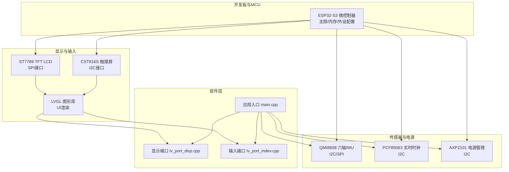
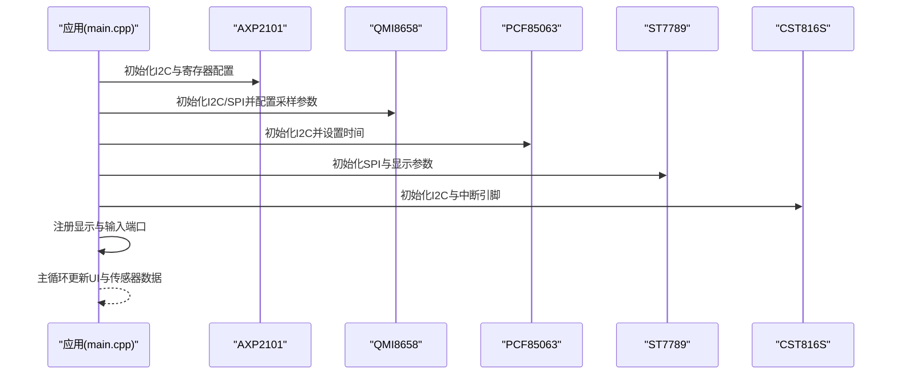
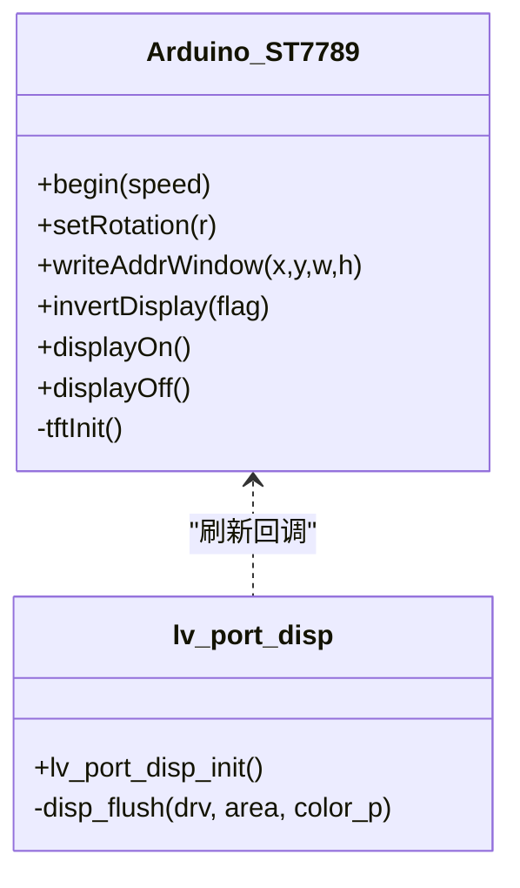
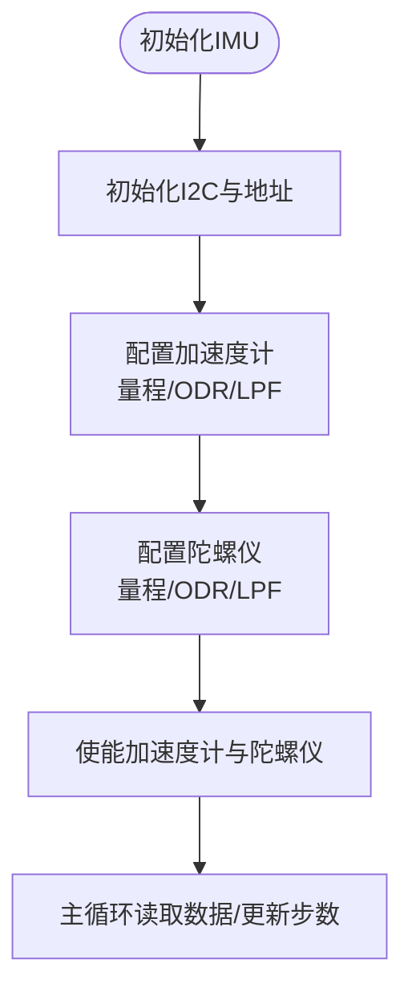
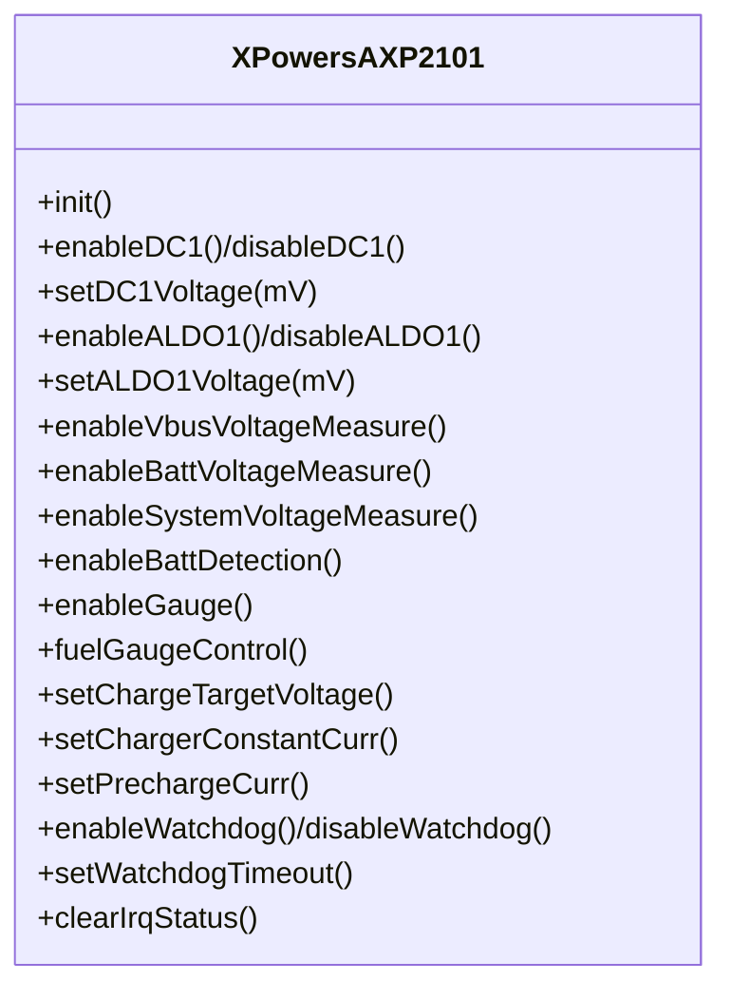
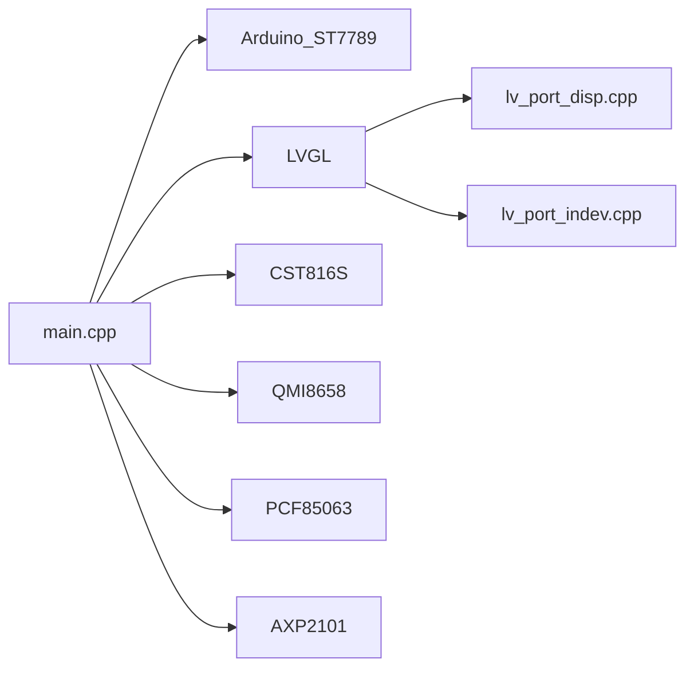
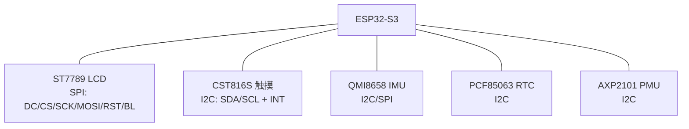

# 硬件设计

<cite>
**本文引用的文件**
- [boards/ESP32-S3-R8-OPI.json](file://boards/ESP32-S3-R8-OPI.json)
- [include/pin_config.h](file://include/pin_config.h)
- [src/pin_config.h](file://src/pin_config.h)
- [include/lv_conf.h](file://include/lv_conf.h)
- [lib/SensorLib-Waveshare/src/SensorQMI8658.hpp](file://lib/SensorLib-Waveshare/src/SensorQMI8658.hpp)
- [lib/SensorLib-Waveshare/src/SensorPCF85063.hpp](file://lib/SensorLib-Waveshare/src/SensorPCF85063.hpp)
- [lib/XPowersLib/src/XPowersAXP2101.tpp](file://lib/XPowersLib/src/XPowersAXP2101.tpp)
- [src/main.cpp](file://src/main.cpp)
- [platformio.ini](file://platformio.ini)
- [src/lv_port_disp.cpp](file://src/lv_port_disp.cpp)
- [src/lv_port_indev.cpp](file://src/lv_port_indev.cpp)
- [lib/GFX_Library_for_Arduino/src/display/Arduino_ST7789.h](file://lib/GFX_Library_for_Arduino/src/display/Arduino_ST7789.h)
- [lib/SensorLib-Waveshare/src/REG/QMI8658Constants.h](file://lib/SensorLib-Waveshare/src/REG/QMI8658Constants.h)
- [lib/SensorLib-Waveshare/src/REG/PCF85063Constants.h](file://lib/SensorLib-Waveshare/src/REG/PCF85063Constants.h)
</cite>

## 目录
1. [简介](#简介)
2. [项目结构](#项目结构)
3. [核心组件](#核心组件)
4. [架构总览](#架构总览)
5. [详细组件分析](#详细组件分析)
6. [依赖关系分析](#依赖关系分析)
7. [性能考虑](#性能考虑)
8. [故障排查指南](#故障排查指南)
9. [结论](#结论)
10. [附录](#附录)

## 简介
本文件面向SmartBracelet硬件设计，系统化阐述基于ESP32-S3微控制器的硬件架构与实现细节。重点覆盖以下方面：
- ESP32-S3选型依据与配置要点（主频、内存、外设）
- 显示子系统：ST7789 2.83英寸TFT LCD、LVGL图形界面与背光控制
- 触摸子系统：CST816S电容式触摸屏
- 传感子系统：QMI8658六轴IMU（加速度计/陀螺仪）、PCF85063实时时钟
- 电源管理：AXP2101电源管理芯片的供电路径、充电策略与监控
- 接口规范：I2C、SPI、GPIO的使用与电气特性
- 引脚分配与电气连接图
- 电源方案：电压调节、电流限制、功耗优化
- 故障诊断与维修建议

## 项目结构
SmartBracelet采用PlatformIO工程组织，硬件相关代码集中在include、lib、src三个目录，并通过platformio.ini进行构建配置。硬件引脚定义集中于include与src下的pin_config.h，显示与输入设备驱动位于src目录，传感器与电源库位于lib目录。

图表来源
- [boards/ESP32-S3-R8-OPI.json](file://boards/ESP32-S3-R8-OPI.json#L1-L40)
- [src/main.cpp](file://src/main.cpp#L615-L722)
- [src/lv_port_disp.cpp](file://src/lv_port_disp.cpp#L22-L32)
- [src/lv_port_indev.cpp](file://src/lv_port_indev.cpp#L21-L27)

章节来源
- [boards/ESP32-S3-R8-OPI.json](file://boards/ESP32-S3-R8-OPI.json#L1-L40)
- [platformio.ini](file://platformio.ini#L1-L41)

## 核心组件
- ESP32-S3微控制器：主控，负责系统调度、外设控制、无线通信与应用逻辑执行。
- ST7789 TFT LCD：240×320分辨率，SPI接口，配合Arduino_GFX与LVGL驱动显示。
- CST816S电容式触摸屏：I2C接口，提供手势与点触输入。
- QMI8658六轴IMU：I2C接口，提供加速度计与陀螺仪数据，支持FIFO与中断。
- PCF85063实时时钟：I2C接口，提供时间日期与闹钟功能。
- AXP2101电源管理芯片：I2C接口，提供多路DCDC/LDO输出、充电管理、电量计量与看门狗。

章节来源
- [src/main.cpp](file://src/main.cpp#L615-L722)
- [lib/GFX_Library_for_Arduino/src/display/Arduino_ST7789.h](file://lib/GFX_Library_for_Arduino/src/display/Arduino_ST7789.h#L1-L145)
- [lib/SensorLib-Waveshare/src/SensorQMI8658.hpp](file://lib/SensorLib-Waveshare/src/SensorQMI8658.hpp#L163-L191)
- [lib/SensorLib-Waveshare/src/SensorPCF85063.hpp](file://lib/SensorLib-Waveshare/src/SensorPCF85063.hpp#L53-L71)
- [lib/XPowersLib/src/XPowersAXP2101.tpp](file://lib/XPowersLib/src/XPowersAXP2101.tpp#L207-L233)

## 架构总览
SmartBracelet硬件架构围绕ESP32-S3展开，通过I2C连接PMU、IMU、RTC与触摸；通过SPI连接LCD；通过GPIO控制背光与复位。应用层在main.cpp中初始化各模块，LVGL负责UI渲染，触摸事件由输入端口驱动传递给LVGL。

图表来源
- [src/main.cpp](file://src/main.cpp#L615-L722)
- [src/lv_port_disp.cpp](file://src/lv_port_disp.cpp#L22-L32)
- [src/lv_port_indev.cpp](file://src/lv_port_indev.cpp#L21-L27)

## 详细组件分析

### ESP32-S3微控制器与引脚分配
- 选型依据：高性能双核、集成WROOM-32无线模块、具备PSRAM、支持高速SPI/I2C等。
- 关键配置：主频、内存类型、分区、上传速度等在boards与platformio.ini中定义。
- 引脚分配：显示、触摸、I2C、音频、TF卡等均在pin_config.h中集中定义，便于统一管理与修改。

章节来源
- [boards/ESP32-S3-R8-OPI.json](file://boards/ESP32-S3-R8-OPI.json#L2-L22)
- [platformio.ini](file://platformio.ini#L14-L36)
- [include/pin_config.h](file://include/pin_config.h#L1-L41)
- [src/pin_config.h](file://src/pin_config.h#L1-L41)

### 显示子系统：ST7789与LVGL
- 显示驱动：Arduino_ST7789通过SPI与MCU通信，支持多种命令序列与颜色格式。
- LVGL集成：lv_port_disp.cpp配置显示缓冲区大小与刷新回调，实现与Arduino_GFX的桥接。
- 背光控制：通过LCD_BL引脚控制背光开关，实现省电与显示切换。

图表来源
- [lib/GFX_Library_for_Arduino/src/display/Arduino_ST7789.h](file://lib/GFX_Library_for_Arduino/src/display/Arduino_ST7789.h#L122-L144)
- [src/lv_port_disp.cpp](file://src/lv_port_disp.cpp#L11-L20)

章节来源
- [src/lv_port_disp.cpp](file://src/lv_port_disp.cpp#L5-L9)
- [src/lv_port_disp.cpp](file://src/lv_port_disp.cpp#L22-L32)
- [include/lv_conf.h](file://include/lv_conf.h#L14-L23)

### 触摸子系统：CST816S
- 接口：I2C，支持中断引脚用于事件上报。
- 集成：lv_port_indev.cpp读取触摸状态并转换为LVGL输入事件。
- 应用：在主循环中处理滑动等手势以切换页面。

章节来源
- [src/lv_port_indev.cpp](file://src/lv_port_indev.cpp#L6-L19)
- [src/main.cpp](file://src/main.cpp#L510-L514)

### 传感子系统：QMI8658六轴IMU
- 接口：I2C或SPI均可（库支持），在主程序中以I2C方式初始化。
- 功能：加速度计/陀螺仪配置、FIFO、温度、中断与唤醒。
- 配置：主程序中设置加速度计与陀螺仪的量程、输出速率与低通滤波模式，并启用两传感器。

图表来源
- [src/main.cpp](file://src/main.cpp#L661-L668)
- [lib/SensorLib-Waveshare/src/SensorQMI8658.hpp](file://lib/SensorLib-Waveshare/src/SensorQMI8658.hpp#L311-L357)
- [lib/SensorLib-Waveshare/src/SensorQMI8658.hpp](file://lib/SensorLib-Waveshare/src/SensorQMI8658.hpp#L369-L420)

章节来源
- [src/main.cpp](file://src/main.cpp#L661-L668)
- [lib/SensorLib-Waveshare/src/REG/QMI8658Constants.h](file://lib/SensorLib-Waveshare/src/REG/QMI8658Constants.h#L32-L41)

### 实时时钟：PCF85063
- 接口：I2C，地址固定。
- 功能：时间日期读写、闹钟设置、启停与运行状态检测。
- 应用：首次启动时校准时间，后续通过网络同步保持精度。

章节来源
- [src/main.cpp](file://src/main.cpp#L656-L659)
- [lib/SensorLib-Waveshare/src/SensorPCF85063.hpp](file://lib/SensorLib-Waveshare/src/SensorPCF85063.hpp#L91-L135)
- [lib/SensorLib-Waveshare/src/REG/PCF85063Constants.h](file://lib/SensorLib-Waveshare/src/REG/PCF85063Constants.h#L34-L46)

### 电源管理：AXP2101
- 接口：I2C，地址固定。
- 功能：多路DCDC/LDO输出、充电管理（恒流/恒压/预充电）、电量计量、看门狗、中断与保护。
- 应用：关闭未用通道、设置目标电压与电流、启用ADC测量、配置看门狗与中断。

图表来源
- [lib/XPowersLib/src/XPowersAXP2101.tpp](file://lib/XPowersLib/src/XPowersAXP2101.tpp#L207-L233)
- [lib/XPowersLib/src/XPowersAXP2101.tpp](file://lib/XPowersLib/src/XPowersAXP2101.tpp#L678-L709)

章节来源
- [src/main.cpp](file://src/main.cpp#L670-L716)
- [lib/XPowersLib/src/XPowersAXP2101.tpp](file://lib/XPowersLib/src/XPowersAXP2101.tpp#L474-L528)

## 依赖关系分析
- 硬件依赖：显示与触摸依赖MCU的SPI与I2C；传感器与电源依赖I2C；音频与TF卡依赖特定GPIO与I2S。
- 软件依赖：main.cpp依赖各驱动与库；LVGL依赖显示与输入端口；传感器库与电源库封装底层寄存器访问。
- 外部库：Arduino_GFX、LVGL、CST816S、SensorLib-Waveshare、XPowersLib。

图表来源
- [src/main.cpp](file://src/main.cpp#L1-L27)
- [src/lv_port_disp.cpp](file://src/lv_port_disp.cpp#L1-L32)
- [src/lv_port_indev.cpp](file://src/lv_port_indev.cpp#L1-L27)

章节来源
- [src/main.cpp](file://src/main.cpp#L1-L27)

## 性能考虑
- 显示刷新：LVGL刷新周期与内存缓冲区大小在lv_conf.h中配置，需平衡UI流畅度与内存占用。
- 传感器采样：IMU采样率与低通滤波影响功耗与精度，应按场景选择合适参数。
- 无线与外设：WiFi按需开启，避免持续高功耗；I2C与SPI速率需满足器件规格。
- 电源管理：合理设置DCDC/LDO输出电压与负载电流，启用看门狗与低电量告警，降低待机电流。

章节来源
- [include/lv_conf.h](file://include/lv_conf.h#L21-L23)
- [src/main.cpp](file://src/main.cpp#L88-L93)

## 故障排查指南
- 显示异常
  - 检查LCD_BL背光引脚是否拉高，确认SPI连接与初始化序列。
  - 参考显示驱动命令序列与初始化流程。
- 触摸无响应
  - 检查I2C引脚与上拉电阻，确认中断引脚连接。
  - 验证触摸库初始化与LVGL输入端口注册。
- 传感器数据异常
  - 核对I2C地址与引脚，检查寄存器配置与采样参数。
  - 使用库提供的寄存器读写函数验证通信。
- 电源问题
  - 检查PMU各输出通道是否正确使能，确认充电参数与ADC测量是否启用。
  - 关注看门狗与中断状态，排查过温/过压保护触发。
- 时间不同步
  - 确认RTC初始化与时间设置流程，检查网络同步逻辑。

章节来源
- [src/main.cpp](file://src/main.cpp#L626-L642)
- [src/lv_port_indev.cpp](file://src/lv_port_indev.cpp#L6-L19)
- [lib/SensorLib-Waveshare/src/SensorQMI8658.hpp](file://lib/SensorLib-Waveshare/src/SensorQMI8658.hpp#L200-L237)
- [lib/SensorLib-Waveshare/src/SensorPCF85063.hpp](file://lib/SensorLib-Waveshare/src/SensorPCF85063.hpp#L91-L135)
- [lib/XPowersLib/src/XPowersAXP2101.tpp](file://lib/XPowersLib/src/XPowersAXP2101.tpp#L623-L671)

## 结论
SmartBracelet硬件以ESP32-S3为核心，结合ST7789显示、CST816S触摸、QMI8658 IMU、PCF85063 RTC与AXP2101电源管理，形成完整的可穿戴设备基础平台。通过合理的引脚分配、接口规范与电源策略，可在保证功能的同时实现较好的能效表现。建议在实际生产中进一步完善PCB布局、屏蔽与EMC设计，并针对不同应用场景优化传感器采样与无线策略。

## 附录

### 引脚分配表（基于pin_config.h）
- 显示（SPI）：LCD_DC、LCD_CS、LCD_SCK、LCD_MOSI、LCD_RST、LCD_BL
- I2C：IIC_SDA、IIC_SCL
- 触摸：TP_SDA、TP_SCL、TP_RST、TP_INT
- TF卡（SDMMC 1-bit）：SDMMC_CLK、SDMMC_CMD、SDMMC_D0
- 音频（I2S）：I2S_MCK、I2S_BCK、I2S_WS、I2S_DO、I2S_DI
- 麦克风（I2S_NUM_1）：INMP441_WS、INMP441_SCK、INMP441_SD、INMP441_LRS

章节来源
- [include/pin_config.h](file://include/pin_config.h#L5-L41)
- [src/pin_config.h](file://src/pin_config.h#L5-L41)

### 电气连接图（概念示意）

图表来源
- [include/pin_config.h](file://include/pin_config.h#L5-L41)
- [src/pin_config.h](file://src/pin_config.h#L5-L41)
- [src/main.cpp](file://src/main.cpp#L615-L722)

### 接口规范与注意事项
- I2C：使用标准模式，确保上拉电阻与总线电容符合器件要求；注意地址匹配与时序。
- SPI：ST7789支持SPI接口，注意时钟极性与相位、帧格式与速率限制。
- GPIO：背光、复位、中断引脚需按器件要求配置上拉/下拉与驱动能力。
- 电源：PMU输出电压与电流需满足各模块需求，注意热插拔与反向保护。

章节来源
- [src/main.cpp](file://src/main.cpp#L626-L629)
- [lib/GFX_Library_for_Arduino/src/display/Arduino_ST7789.h](file://lib/GFX_Library_for_Arduino/src/display/Arduino_ST7789.h#L19-L48)