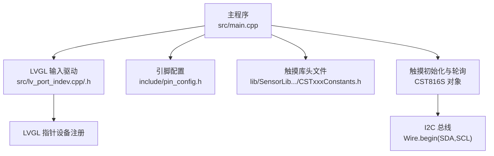
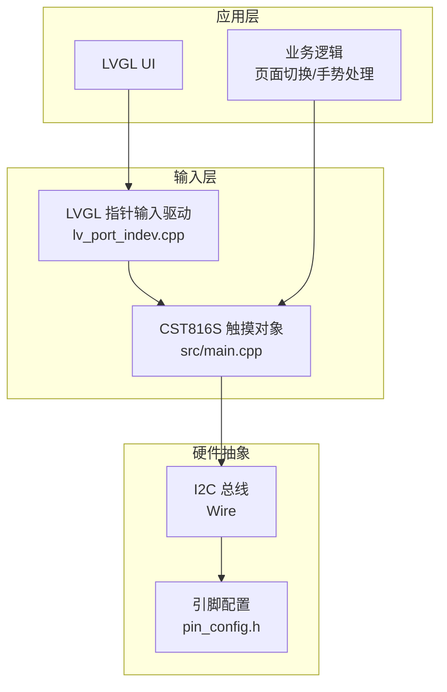
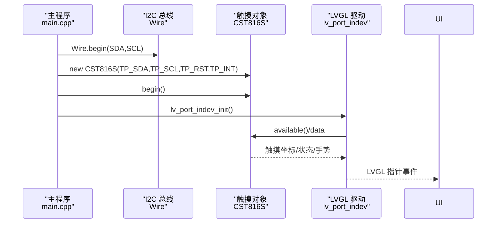
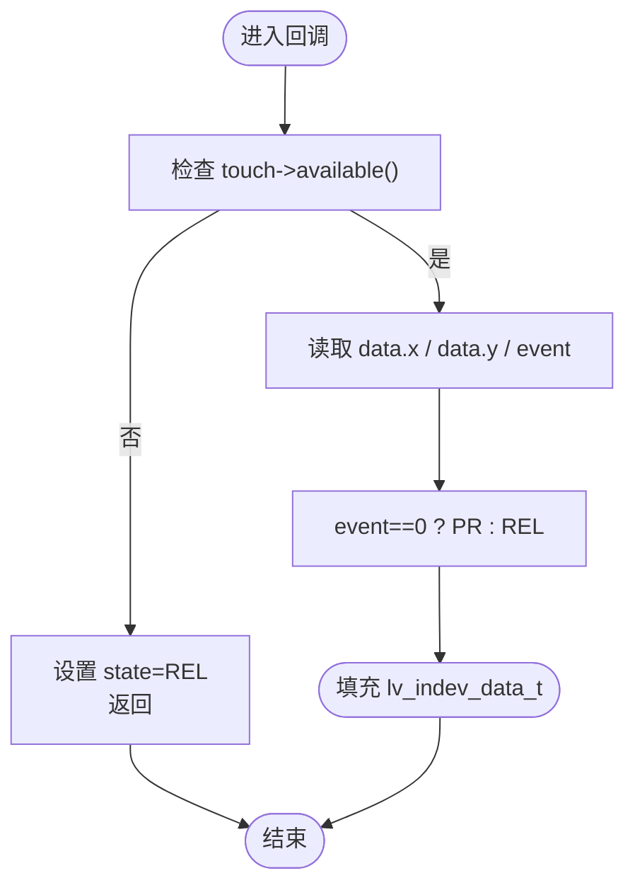
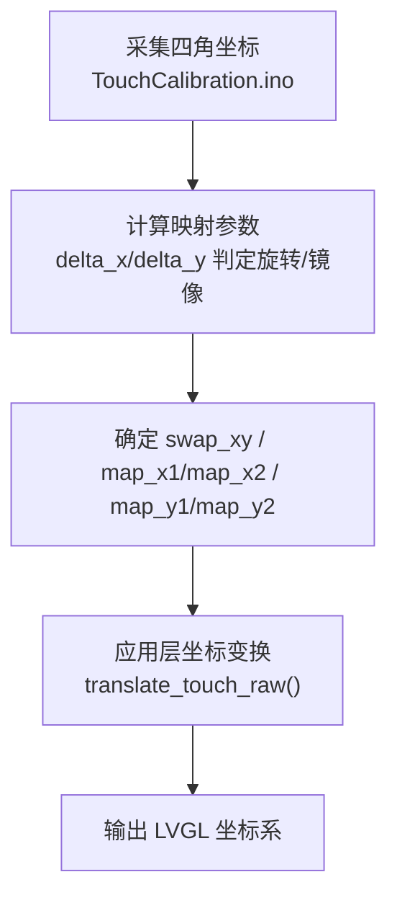
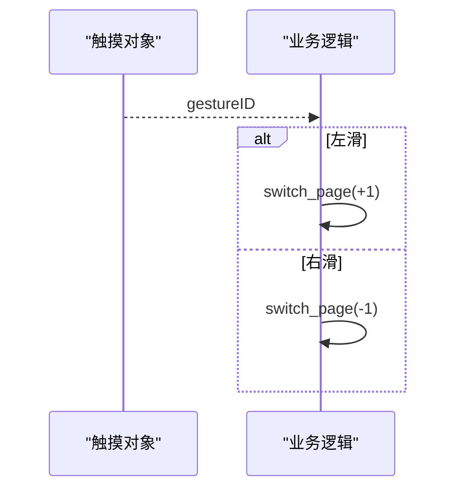
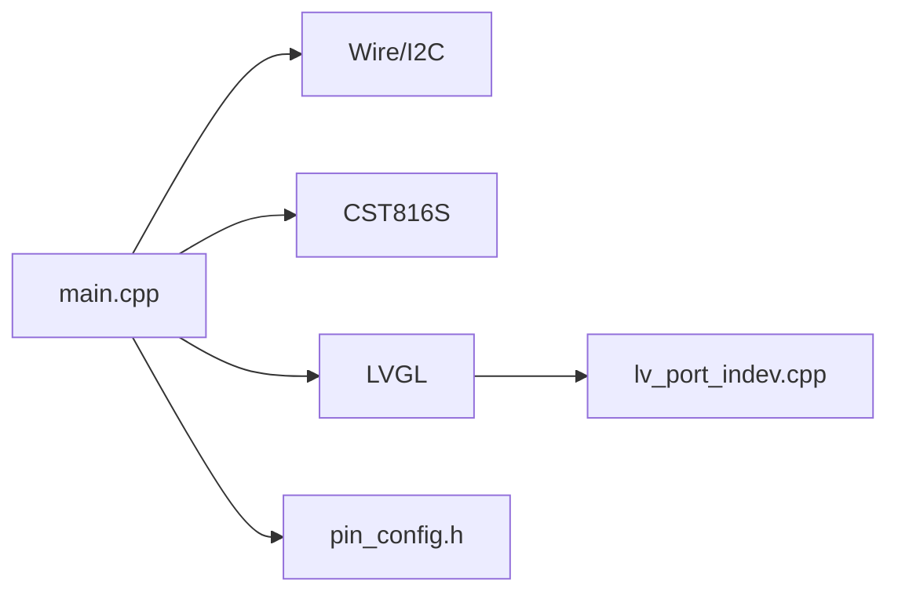

# 触摸接口

<cite>
**本文引用的文件**
- [main.cpp](file://src/main.cpp)
- [lv_port_indev.cpp](file://src/lv_port_indev.cpp)
- [lv_port_indev.h](file://src/lv_port_indev.h)
- [pin_config.h](file://include/pin_config.h)
- [CSTxxxConstants.h](file://lib/SensorLib-Waveshare/src/REG/CSTxxxConstants.h)
- [TouchCalibration.ino](file://lib/GFX_Library_for_Arduino/examples/TouchCalibration/TouchCalibration.ino)
- [TouchCalibration/touch.h](file://lib/GFX_Library_for_Arduino/examples/TouchCalibration/touch.h)
- [DEBUG_REPORT.md](file://DEBUG_REPORT.md)
</cite>

## 目录
1. [简介](#简介)
2. [项目结构](#项目结构)
3. [核心组件](#核心组件)
4. [架构总览](#架构总览)
5. [详细组件分析](#详细组件分析)
6. [依赖关系分析](#依赖关系分析)
7. [性能考虑](#性能考虑)
8. [故障排查指南](#故障排查指南)
9. [结论](#结论)
10. [附录](#附录)

## 简介
本文件面向 SmartBracelet 的触摸接口系统，围绕 CST816D（兼容 CST816S）电容式触摸屏与 I2C 通信进行技术说明。内容涵盖触摸坐标转换、手势识别、LVGL 指针输入驱动对接、触摸校准流程、抗干扰与灵敏度调节、功耗优化策略，并提供故障诊断与维护建议。文档同时给出关键数据流与交互序列图，帮助读者快速理解系统工作原理。

## 项目结构
触摸接口相关代码主要分布在以下位置：
- 主程序入口与初始化：src/main.cpp
- LVGL 指针输入设备驱动：src/lv_port_indev.{h,cpp}
- 引脚配置：include/pin_config.h
- 触摸芯片常量定义：lib/SensorLib-Waveshare/src/REG/CSTxxxConstants.h
- 触摸校准示例工程：lib/GFX_Library_for_Arduino/examples/TouchCalibration/*
- 调试与历史问题记录：DEBUG_REPORT.md

图表来源
- [main.cpp](file://src/main.cpp#L615-L654)
- [lv_port_indev.cpp](file://src/lv_port_indev.cpp#L21-L27)
- [pin_config.h](file://include/pin_config.h#L14-L20)
- [CSTxxxConstants.h](file://lib/SensorLib-Waveshare/src/REG/CSTxxxConstants.h#L33-L41)

章节来源
- [main.cpp](file://src/main.cpp#L615-L654)
- [lv_port_indev.cpp](file://src/lv_port_indev.cpp#L1-L28)
- [pin_config.h](file://include/pin_config.h#L14-L20)
- [CSTxxxConstants.h](file://lib/SensorLib-Waveshare/src/REG/CSTxxxConstants.h#L33-L41)

## 核心组件
- 触摸控制器：CST816D（兼容 CST816S），I2C 地址 0x15
- I2C 接口：通过 Wire 总线访问，引脚由 pin_config.h 定义
- LVGL 指针输入驱动：将触摸事件映射为 LVGL 指针事件
- 手势识别：基于 CST816S 提供的 gestureID（如左右滑动）

章节来源
- [main.cpp](file://src/main.cpp#L652-L653)
- [lv_port_indev.cpp](file://src/lv_port_indev.cpp#L6-L18)
- [CSTxxxConstants.h](file://lib/SensorLib-Waveshare/src/REG/CSTxxxConstants.h#L33-L41)

## 架构总览
下图展示了触摸接口在系统中的位置与交互路径：

图表来源
- [main.cpp](file://src/main.cpp#L615-L654)
- [lv_port_indev.cpp](file://src/lv_port_indev.cpp#L6-L18)
- [pin_config.h](file://include/pin_config.h#L14-L20)

## 详细组件分析

### 触摸初始化与 I2C 通信
- 初始化顺序：Wire.begin(SDA,SCL) → 创建 CST816S 对象并调用 begin() → 注册 LVGL 指针输入驱动
- I2C 地址：0x15（CST816S/CST816D）
- 引脚映射：TP_SDA/TP_SCL/TP_RST/TP_INT 在 pin_config.h 中定义

图表来源
- [main.cpp](file://src/main.cpp#L626-L654)
- [lv_port_indev.cpp](file://src/lv_port_indev.cpp#L6-L18)
- [pin_config.h](file://include/pin_config.h#L17-L20)
- [CSTxxxConstants.h](file://lib/SensorLib-Waveshare/src/REG/CSTxxxConstants.h#L33-L34)

章节来源
- [main.cpp](file://src/main.cpp#L626-L654)
- [pin_config.h](file://include/pin_config.h#L17-L20)
- [CSTxxxConstants.h](file://lib/SensorLib-Waveshare/src/REG/CSTxxxConstants.h#L33-L34)

### LVGL 指针输入驱动对接
- 驱动类型：LV_INDEV_TYPE_POINTER
- 数据来源：touch->available() 返回真时，读取 touch->data.x/y 并设置 state（按下/抬起）
- 事件映射：event==0 映射为按下，否则为抬起

图表来源
- [lv_port_indev.cpp](file://src/lv_port_indev.cpp#L6-L18)

章节来源
- [lv_port_indev.cpp](file://src/lv_port_indev.cpp#L6-L18)
- [lv_port_indev.h](file://src/lv_port_indev.h#L1-L10)

### 坐标转换与屏幕适配
- 当前实现：直接使用 touch->data.x/y 作为 LVGL 坐标
- 校准思路：参考触摸校准示例，通过四角采样计算映射参数（交换轴、映射区间微调），再在应用层进行坐标变换
- 适用场景：旋转/镜像/边界不一致时的补偿

图表来源
- [TouchCalibration.ino](file://lib/GFX_Library_for_Arduino/examples/TouchCalibration/TouchCalibration.ino#L169-L225)
- [TouchCalibration/touch.h](file://lib/GFX_Library_for_Arduino/examples/TouchCalibration/touch.h#L172-L214)

章节来源
- [TouchCalibration.ino](file://lib/GFX_Library_for_Arduino/examples/TouchCalibration/TouchCalibration.ino#L169-L225)
- [TouchCalibration/touch.h](file://lib/GFX_Library_for_Arduino/examples/TouchCalibration/touch.h#L172-L214)

### 手势识别与页面切换
- 手势来源：CST816S 的 gestureID 字段
- 业务应用：根据 SWIPE_LEFT/SWIPE_RIGHT 切换页面
- 注意：当前实现未对多点触控进行专门处理，仅使用单点坐标；如需多指手势，需扩展驱动层解析

图表来源
- [main.cpp](file://src/main.cpp#L510-L514)

章节来源
- [main.cpp](file://src/main.cpp#L510-L514)

### 抗干扰与去抖动
- 去抖动策略：在应用层对连续多次读取取均值/最大压力点，降低噪声影响
- 抗干扰建议：
  - I2C 上拉电阻与走线长度优化
  - 屏蔽层与地平面完整
  - 降低 I2C 速率（默认 100kHz/400kHz，必要时降速）
  - 避免与 USB CDC 共用引脚（历史问题提示）

章节来源
- [TouchCalibration/touch.h](file://lib/GFX_Library_for_Arduino/examples/TouchCalibration/touch.h#L172-L214)
- [DEBUG_REPORT.md](file://DEBUG_REPORT.md#L397-L400)

### 灵敏度与采样频率
- 灵敏度：可通过滤波与阈值调整（例如对 z 值取最大值，结合压力阈值）
- 采样频率：LVGL 通过定时器驱动循环（约 5ms），触摸读取在回调中进行，整体由 LVGL 调度控制
- 功耗优化：触摸中断引脚（INT）可用于唤醒或减少轮询；当前实现采用轮询方式

章节来源
- [lv_port_indev.cpp](file://src/lv_port_indev.cpp#L6-L18)
- [main.cpp](file://src/main.cpp#L724-L725)

## 依赖关系分析
- 主程序依赖：Wire、CST816S、LVGL、引脚配置
- 驱动依赖：LVGL 指针输入接口
- 硬件依赖：I2C 地址 0x15，引脚映射

图表来源
- [main.cpp](file://src/main.cpp#L626-L654)
- [lv_port_indev.cpp](file://src/lv_port_indev.cpp#L1-L28)
- [pin_config.h](file://include/pin_config.h#L14-L20)

章节来源
- [main.cpp](file://src/main.cpp#L626-L654)
- [lv_port_indev.cpp](file://src/lv_port_indev.cpp#L1-L28)
- [pin_config.h](file://include/pin_config.h#L14-L20)

## 性能考虑
- I2C 通信：确保总线稳定，避免与 USB CDC 引脚冲突
- LVGL 轮询：保持 5ms 定时器节奏，避免阻塞
- 坐标转换：尽量在应用层一次性完成，减少重复计算
- 中断唤醒：若硬件允许，优先使用 INT 引脚触发，降低 CPU 占用

## 故障排查指南
- 触摸无响应
  - 检查 I2C 引脚是否正确（SDA/SCL）且未与 USB CDC 冲突
  - 确认 CST816S 初始化成功，I2C 地址 0x15 是否可寻址
  - 验证 LVGL 驱动已注册
- 坐标错位/颠倒
  - 使用触摸校准工具进行四角采样，生成映射参数
  - 在应用层实现坐标变换
- 手势无效
  - 确认 gestureID 字段可用，当前业务逻辑仅处理左右滑动
- 串口消息丢失
  - USB CDC 重枚举时间较长，属于已知现象

章节来源
- [DEBUG_REPORT.md](file://DEBUG_REPORT.md#L397-L400)
- [DEBUG_REPORT.md](file://DEBUG_REPORT.md#L513-L517)
- [TouchCalibration.ino](file://lib/GFX_Library_for_Arduino/examples/TouchCalibration/TouchCalibration.ino#L98-L113)

## 结论
SmartBracelet 的触摸接口以 CST816D 为核心，通过 I2C 与 LVGL 指针驱动无缝对接，实现了基本的坐标读取、状态映射与手势页面切换。当前实现简洁可靠，具备良好的可扩展性：可在应用层增加坐标校准、压力滤波与多点触控解析；在硬件层面引入中断唤醒与 I2C 优化，进一步提升稳定性与能效。

## 附录

### 触摸校准实现步骤（基于示例工程）
- 在屏幕上按顺序点击四个角，采集原始坐标
- 计算映射参数：swap_xy、map_x1/x2、map_y1/y2
- 将参数应用到坐标变换函数，输出 LVGL 坐标

章节来源
- [TouchCalibration.ino](file://lib/GFX_Library_for_Arduino/examples/TouchCalibration/TouchCalibration.ino#L134-L248)
- [TouchCalibration/touch.h](file://lib/GFX_Library_for_Arduino/examples/TouchCalibration/touch.h#L172-L214)