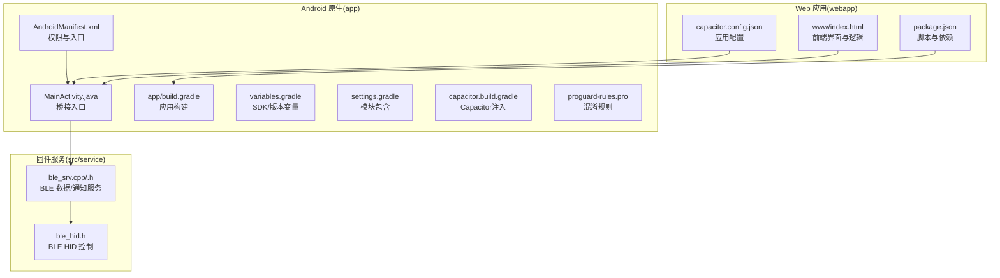
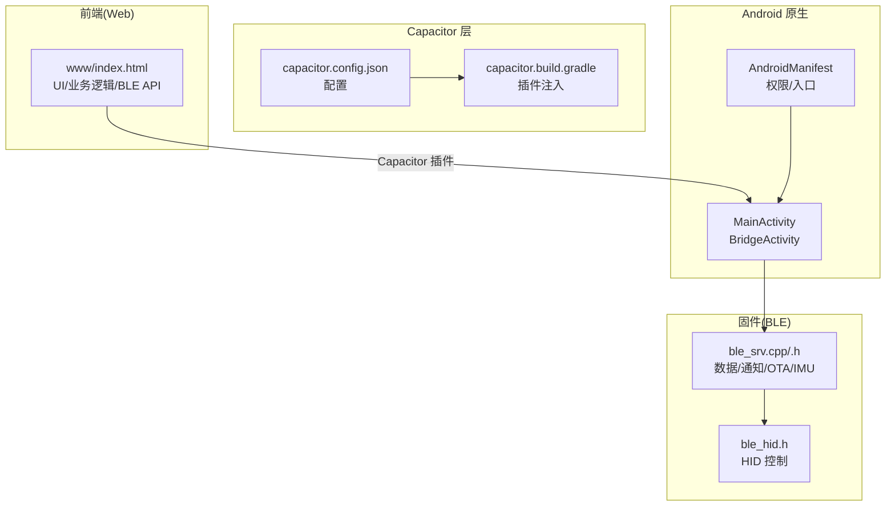
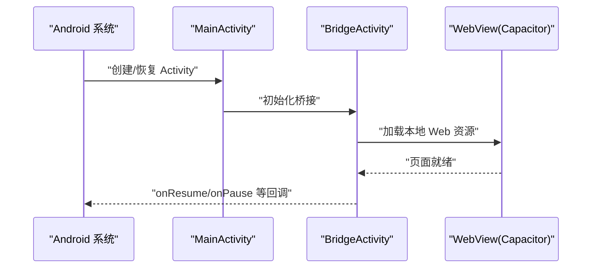
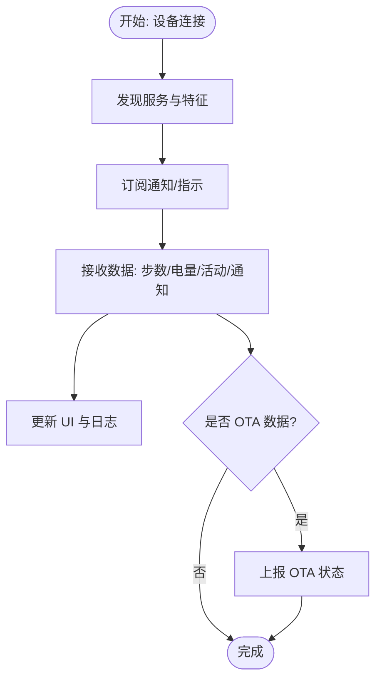
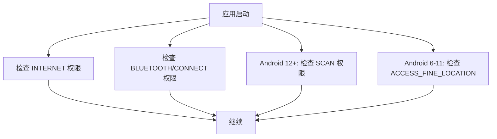
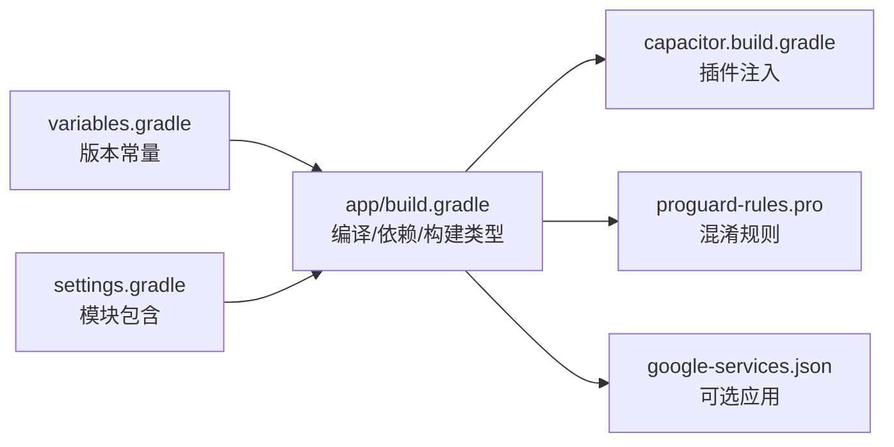
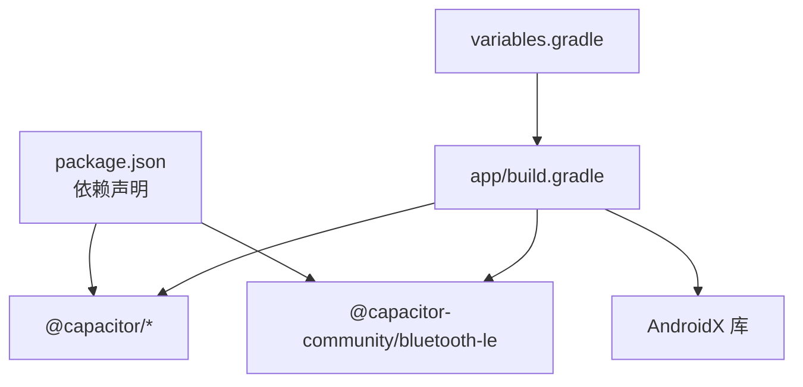

# Android应用

<cite>
**本文引用的文件**
- [webapp/android/app/src/main/AndroidManifest.xml](file://webapp/android/app/src/main/AndroidManifest.xml)
- [webapp/android/app/src/main/java/com/smartbracelet/app/MainActivity.java](file://webapp/android/app/src/main/java/com/smartbracelet/app/MainActivity.java)
- [webapp/capacitor.config.json](file://webapp/capacitor.config.json)
- [webapp/package.json](file://webapp/package.json)
- [webapp/android/app/build.gradle](file://webapp/android/app/build.gradle)
- [webapp/android/app/capacitor.build.gradle](file://webapp/android/app/capacitor.build.gradle)
- [webapp/android/variables.gradle](file://webapp/android/variables.gradle)
- [webapp/android/settings.gradle](file://webapp/android/settings.gradle)
- [webapp/www/index.html](file://webapp/www/index.html)
- [webapp/android/app/proguard-rules.pro](file://webapp/android/app/proguard-rules.pro)
- [src/service/ble_srv.cpp](file://src/service/ble_srv.cpp)
- [src/service/ble_srv.h](file://src/service/ble_srv.h)
- [src/service/ble_hid.h](file://src/service/ble_hid.h)
</cite>

## 目录
1. [简介](#简介)
2. [项目结构](#项目结构)
3. [核心组件](#核心组件)
4. [架构总览](#架构总览)
5. [组件详解](#组件详解)
6. [依赖关系分析](#依赖关系分析)
7. [性能与优化](#性能与优化)
8. [故障排查指南](#故障排查指南)
9. [结论](#结论)
10. [附录](#附录)

## 简介
本文件为 SmartBracelet Android 应用的全面技术文档，聚焦于以下方面：
- Android 应用架构与 MainActivity 生命周期管理
- Capacitor 框架在 Android 平台的集成方式（原生插件、BLE 通信、系统服务）
- Android Manifest 权限配置（蓝牙、网络、定位等）
- 构建与打包流程（Gradle 配置、签名、版本管理）
- Android 特有功能（后台/前台服务、系统通知）
- 调试、性能监控与崩溃处理
- 发布流程与 Google Play 提交要点

## 项目结构
该仓库采用多模块结构：前端 Web 应用位于 webapp，Android 原生桥接层位于 webapp/android，固件侧 BLE 服务位于 src/service。



**图表来源**
- [webapp/www/index.html](file://webapp/www/index.html#L655-L720)
- [webapp/android/app/src/main/AndroidManifest.xml](file://webapp/android/app/src/main/AndroidManifest.xml#L1-L51)
- [webapp/android/app/src/main/java/com/smartbracelet/app/MainActivity.java](file://webapp/android/app/src/main/java/com/smartbracelet/app/MainActivity.java#L1-L6)
- [webapp/android/app/build.gradle](file://webapp/android/app/build.gradle#L1-L55)
- [webapp/android/variables.gradle](file://webapp/android/variables.gradle#L1-L16)
- [webapp/android/settings.gradle](file://webapp/android/settings.gradle#L1-L5)
- [webapp/android/app/capacitor.build.gradle](file://webapp/android/app/capacitor.build.gradle#L1-L20)
- [webapp/android/app/proguard-rules.pro](file://webapp/android/app/proguard-rules.pro#L1-L22)
- [src/service/ble_srv.cpp](file://src/service/ble_srv.cpp#L158-L223)
- [src/service/ble_srv.h](file://src/service/ble_srv.h#L1-L49)
- [src/service/ble_hid.h](file://src/service/ble_hid.h#L1-L23)

**章节来源**
- [webapp/android/app/src/main/AndroidManifest.xml](file://webapp/android/app/src/main/AndroidManifest.xml#L1-L51)
- [webapp/android/app/src/main/java/com/smartbracelet/app/MainActivity.java](file://webapp/android/app/src/main/java/com/smartbracelet/app/MainActivity.java#L1-L6)
- [webapp/android/app/build.gradle](file://webapp/android/app/build.gradle#L1-L55)
- [webapp/android/variables.gradle](file://webapp/android/variables.gradle#L1-L16)
- [webapp/android/settings.gradle](file://webapp/android/settings.gradle#L1-L5)
- [webapp/android/app/capacitor.build.gradle](file://webapp/android/app/capacitor.build.gradle#L1-L20)
- [webapp/android/app/proguard-rules.pro](file://webapp/android/app/proguard-rules.pro#L1-L22)
- [webapp/www/index.html](file://webapp/www/index.html#L655-L720)
- [src/service/ble_srv.cpp](file://src/service/ble_srv.cpp#L158-L223)
- [src/service/ble_srv.h](file://src/service/ble_srv.h#L1-L49)
- [src/service/ble_hid.h](file://src/service/ble_hid.h#L1-L23)

## 核心组件
- MainActivity：继承自 BridgeActivity，作为 Capacitor 桥接入口，承载 WebView 容器与原生能力交互。
- Capacitor 配置：capacitor.config.json 定义应用标识、Web 目录、服务器方案与插件参数（如 BLE 插件的通知开关）。
- Gradle 构建：app/build.gradle 统一管理 SDK 版本、构建类型、依赖与插件；variables.gradle 提供版本常量；settings.gradle 引入子模块。
- 权限清单：AndroidManifest.xml 声明网络、蓝牙、定位等权限，并声明 FileProvider 以支持文件分享。
- 前端界面：www/index.html 实现扫描设备、连接、显示数据、发送通知、语音聊天等功能，并通过 Capacitor 插件与 BLE 交互。

**章节来源**
- [webapp/android/app/src/main/java/com/smartbracelet/app/MainActivity.java](file://webapp/android/app/src/main/java/com/smartbracelet/app/MainActivity.java#L1-L6)
- [webapp/capacitor.config.json](file://webapp/capacitor.config.json#L1-L14)
- [webapp/android/app/build.gradle](file://webapp/android/app/build.gradle#L1-L55)
- [webapp/android/variables.gradle](file://webapp/android/variables.gradle#L1-L16)
- [webapp/android/settings.gradle](file://webapp/android/settings.gradle#L1-L5)
- [webapp/android/app/src/main/AndroidManifest.xml](file://webapp/android/app/src/main/AndroidManifest.xml#L38-L50)
- [webapp/www/index.html](file://webapp/www/index.html#L655-L720)

## 架构总览
SmartBracelet Android 应用采用 Capacitor 将 Web 前端嵌入到 Android 原生容器中，前端通过 Capacitor 插件与 BLE 通信，固件侧提供 BLE 服务与特征，实现手表与手机之间的数据传输与控制。



**图表来源**
- [webapp/android/app/src/main/java/com/smartbracelet/app/MainActivity.java](file://webapp/android/app/src/main/java/com/smartbracelet/app/MainActivity.java#L1-L6)
- [webapp/android/app/src/main/AndroidManifest.xml](file://webapp/android/app/src/main/AndroidManifest.xml#L1-L51)
- [webapp/capacitor.config.json](file://webapp/capacitor.config.json#L1-L14)
- [webapp/android/app/capacitor.build.gradle](file://webapp/android/app/capacitor.build.gradle#L1-L20)
- [webapp/www/index.html](file://webapp/www/index.html#L655-L720)
- [src/service/ble_srv.cpp](file://src/service/ble_srv.cpp#L158-L223)
- [src/service/ble_srv.h](file://src/service/ble_srv.h#L1-L49)
- [src/service/ble_hid.h](file://src/service/ble_hid.h#L1-L23)

## 组件详解

### MainActivity 与生命周期
- 入口类：MainActivity 继承自 BridgeActivity，作为 Capacitor 的 WebView 容器入口。
- 生命周期：由 Android 系统管理，Capacitor 在其基础上扩展了与插件的交互、WebView 初始化与事件分发。
- 启动模式：singleTask，避免重复实例；导出为 true，允许外部启动。



**图表来源**
- [webapp/android/app/src/main/java/com/smartbracelet/app/MainActivity.java](file://webapp/android/app/src/main/java/com/smartbracelet/app/MainActivity.java#L1-L6)
- [webapp/android/app/src/main/AndroidManifest.xml](file://webapp/android/app/src/main/AndroidManifest.xml#L12-L25)

**章节来源**
- [webapp/android/app/src/main/java/com/smartbracelet/app/MainActivity.java](file://webapp/android/app/src/main/java/com/smartbracelet/app/MainActivity.java#L1-L6)
- [webapp/android/app/src/main/AndroidManifest.xml](file://webapp/android/app/src/main/AndroidManifest.xml#L12-L25)

### Capacitor 集成与原生插件
- 插件注册：capacitor.build.gradle 动态引入 @capacitor-community/bluetooth-le 插件。
- 配置项：capacitor.config.json 中启用 BLE 插件的通知显示。
- 前端调用：www/index.html 中通过 Capacitor Plugins 访问 BLE，定义服务与特征 UUID，统一 Web/原生 API。

```mermaid
sequenceDiagram
participant UI as "www/index.html"
participant CAP as "Capacitor Plugins"
participant BLE as "BLE 插件(@capacitor-community/bluetooth-le)"
participant AND as "Android 系统"
UI->>CAP : "initialize({ displayStrings })"
CAP->>BLE : "请求扫描/连接/订阅"
BLE->>AND : "调用系统蓝牙 API"
AND-->>BLE : "返回扫描结果/连接状态"
BLE-->>CAP : "封装事件/数据"
CAP-->>UI : "触发回调/更新界面"
```

**图表来源**
- [webapp/capacitor.config.json](file://webapp/capacitor.config.json#L8-L12)
- [webapp/android/app/capacitor.build.gradle](file://webapp/android/app/capacitor.build.gradle#L11-L14)
- [webapp/www/index.html](file://webapp/www/index.html#L681-L686)

**章节来源**
- [webapp/capacitor.config.json](file://webapp/capacitor.config.json#L1-L14)
- [webapp/android/app/capacitor.build.gradle](file://webapp/android/app/capacitor.build.gradle#L1-L20)
- [webapp/www/index.html](file://webapp/www/index.html#L655-L720)

### BLE 通信与固件服务
- 服务与特征：固件侧定义数据服务（步数、电量、活动）、通知服务（收发）、电池服务、时间服务等，前端通过 UUID 进行发现与订阅。
- 通知与指示：使用 notify/indicate，支持断线重连后的状态同步。
- OTA 与 IMU：提供 OTA 状态上报与 IMU 特征数据推送，用于边缘 AI 推理。



**图表来源**
- [src/service/ble_srv.cpp](file://src/service/ble_srv.cpp#L189-L223)
- [src/service/ble_srv.cpp](file://src/service/ble_srv.cpp#L317-L361)
- [src/service/ble_srv.h](file://src/service/ble_srv.h#L12-L49)

**章节来源**
- [src/service/ble_srv.cpp](file://src/service/ble_srv.cpp#L158-L223)
- [src/service/ble_srv.cpp](file://src/service/ble_srv.cpp#L317-L361)
- [src/service/ble_srv.h](file://src/service/ble_srv.h#L1-L49)

### Android Manifest 权限与安全
- 网络：INTERNET 用于加载本地资源与网络请求。
- 蓝牙：BLUETOOTH/BLUETOOTH_ADMIN（限制最大 SDK 30），BLUETOOTH_SCAN/BLUETOOTH_CONNECT（Android 12+）。
- 定位：ACCESS_FINE_LOCATION/ACCESS_COARSE_LOCATION（Android 6-11 扫描所需）。
- 蓝牙 LE：声明硬件特性可选。
- 文件提供：FileProvider 支持文件分享与安装。



**图表来源**
- [webapp/android/app/src/main/AndroidManifest.xml](file://webapp/android/app/src/main/AndroidManifest.xml#L40-L49)

**章节来源**
- [webapp/android/app/src/main/AndroidManifest.xml](file://webapp/android/app/src/main/AndroidManifest.xml#L38-L50)

### 构建与打包流程
- Gradle 配置：app/build.gradle 设置 compile/target/minSdk、版本号、构建类型与依赖；引入 Capacitor 与 Cordova 插件模块。
- 版本管理：variables.gradle 统一管理 SDK 与依赖版本；settings.gradle 引入子模块。
- 插件注入：capacitor.build.gradle 注入 @capacitor-community/bluetooth-le。
- 混淆：proguard-rules.pro 提供默认占位，便于后续扩展。
- Google Services：检测 google-services.json 自动应用插件（用于推送等）。



**图表来源**
- [webapp/android/variables.gradle](file://webapp/android/variables.gradle#L1-L16)
- [webapp/android/settings.gradle](file://webapp/android/settings.gradle#L1-L5)
- [webapp/android/app/build.gradle](file://webapp/android/app/build.gradle#L1-L55)
- [webapp/android/app/capacitor.build.gradle](file://webapp/android/app/capacitor.build.gradle#L1-L20)
- [webapp/android/app/proguard-rules.pro](file://webapp/android/app/proguard-rules.pro#L1-L22)

**章节来源**
- [webapp/android/variables.gradle](file://webapp/android/variables.gradle#L1-L16)
- [webapp/android/settings.gradle](file://webapp/android/settings.gradle#L1-L5)
- [webapp/android/app/build.gradle](file://webapp/android/app/build.gradle#L1-L55)
- [webapp/android/app/capacitor.build.gradle](file://webapp/android/app/capacitor.build.gradle#L1-L20)
- [webapp/android/app/proguard-rules.pro](file://webapp/android/app/proguard-rules.pro#L1-L22)

### Android 特有功能
- 前台/后台服务：建议在需要持续 BLE 任务时使用前台服务，确保长连接稳定性与用户体验。
- 系统通知：BLE 插件可配置显示通知；结合 FileProvider 可实现 OTA 安装提示。
- 权限动态申请：在运行时按需申请蓝牙扫描与定位权限，提升隐私与兼容性。

[本节为通用实践说明，不直接分析具体文件，故无“章节来源”]

### 调试、性能与崩溃处理
- 调试：利用 Capacitor 日志与浏览器调试工具；Android Studio Logcat 观察原生层输出。
- 性能：合理使用 notify/indicate，避免频繁大包；对 UI 更新进行节流；启用合适的混淆与资源压缩。
- 崩溃处理：捕获前端异常并上报；原生层记录关键路径日志；在 BLE 回调中做好空值与状态校验。

[本节为通用实践说明，不直接分析具体文件，故无“章节来源”]

## 依赖关系分析
- 前端依赖：@capacitor-community/bluetooth-le、@capacitor/android、@capacitor/cli、@capacitor/core。
- Gradle 依赖：appcompat、coordinatorlayout、core-splashscreen、Capacitor 与 Cordova 插件模块。
- 版本耦合：compileSdk/targetSdk/minSdk 一致；第三方库版本由 variables.gradle 统一管理。



**图表来源**
- [webapp/package.json](file://webapp/package.json#L15-L21)
- [webapp/android/app/build.gradle](file://webapp/android/app/build.gradle#L33-L43)
- [webapp/android/variables.gradle](file://webapp/android/variables.gradle#L1-L16)

**章节来源**
- [webapp/package.json](file://webapp/package.json#L1-L22)
- [webapp/android/app/build.gradle](file://webapp/android/app/build.gradle#L33-L43)
- [webapp/android/variables.gradle](file://webapp/android/variables.gradle#L1-L16)

## 性能与优化
- BLE 速率控制：根据手表刷新频率调整 notify 频率，避免过度唤醒。
- UI 渲染：对频繁更新的数据使用虚拟滚动或节流策略。
- 资源压缩：Release 构建启用资源压缩与代码混淆（按需）。
- 内存管理：及时取消订阅与释放监听，防止内存泄漏。

[本节为通用实践说明，不直接分析具体文件，故无“章节来源”]

## 故障排查指南
- 权限问题：确认 AndroidManifest 权限齐全且运行时已授权；Android 12+ 必须同时授予 BLUETOOTH_SCAN 与 BLUETOOTH_CONNECT。
- 蓝牙不可用：检查设备是否支持 BLE；在低端机上适当放宽最小 SDK 或提供降级提示。
- 连接不稳定：确认单任务启动模式与正确的 UUID；在固件侧确保特征描述符与 notify/indicate 正确配置。
- 构建失败：核对 Gradle 版本、Java 版本与 SDK 路径；检查 google-services.json 是否存在。

**章节来源**
- [webapp/android/app/src/main/AndroidManifest.xml](file://webapp/android/app/src/main/AndroidManifest.xml#L40-L49)
- [webapp/android/app/build.gradle](file://webapp/android/app/build.gradle#L47-L55)

## 结论
SmartBracelet Android 应用通过 Capacitor 将 Web 前端与 Android 原生能力无缝整合，配合固件侧完善的 BLE 服务，实现了稳定的数据传输与丰富的交互体验。遵循本文的权限配置、构建流程与调试建议，可有效提升应用质量与发布效率。

[本节为总结性内容，不直接分析具体文件，故无“章节来源”]

## 附录
- Google Play 提交建议：准备清晰的应用截图与说明；明确数据使用与权限用途；遵守隐私政策与开发者协议；在发布前进行多机型测试与合规审查。

[本节为通用实践说明，不直接分析具体文件，故无“章节来源”]