# Web应用

<cite>
**本文档引用的文件**
- [index.html](file://webapp/index.html)
- [capacitor.config.json](file://webapp/capacitor.config.json)
- [package.json](file://webapp/package.json)
- [main.cpp](file://src/main.cpp)
- [ble_srv.cpp](file://src/service/ble_srv.cpp)
- [voice_chat.cpp](file://src/service/voice_chat.cpp)
- [ota_update.cpp](file://src/service/ota_update.cpp)
- [activity.cpp](file://src/activity.cpp)
</cite>

## 目录
1. [项目概述](#项目概述)
2. [项目结构](#项目结构)
3. [核心组件](#核心组件)
4. [架构总览](#架构总览)
5. [详细组件分析](#详细组件分析)
6. [依赖关系分析](#依赖关系分析)
7. [性能考虑](#性能考虑)
8. [故障排除指南](#故障排除指南)
9. [结论](#结论)

## 项目概述
本项目是一个基于Web技术的智能手表配套应用，支持通过Web Bluetooth或Capacitor BLE在浏览器中与ESP32-S3智能手表进行通信。应用提供设备发现、连接管理、数据读取、通知发送、语音聊天、固件升级、健康趋势可视化等完整功能。

## 项目结构
项目采用前后端分离架构，前端Web应用位于webapp目录，后端固件位于src目录：

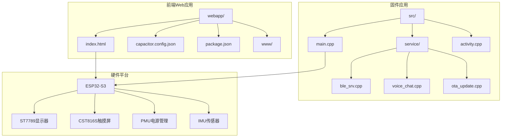

**图表来源**
- [index.html](file://webapp/index.html#L1-L1686)
- [main.cpp](file://src/main.cpp#L1-L926)

**章节来源**
- [index.html](file://webapp/index.html#L1-L1686)
- [capacitor.config.json](file://webapp/capacitor.config.json#L1-L14)
- [package.json](file://webapp/package.json#L1-L22)

## 核心组件
Web应用由多个核心组件构成，每个组件负责特定的功能领域：

### 1. 视觉设计系统
- **CSS变量系统**：定义了完整的色彩体系和设计令牌
- **响应式布局**：适配移动端设备的流式布局
- **动画系统**：包含淡入动画和数值变化动画效果

### 2. 蓝牙通信层
- **统一BLE服务**：支持Web Bluetooth和Capacitor BLE两种模式
- **多服务支持**：数据服务、通知服务、电池服务、时间服务
- **特性订阅**：自动订阅步数、活动状态、电池电量等实时数据

### 3. 用户界面模块
- **连接界面**：设备扫描和连接管理
- **仪表盘**：实时数据显示和状态展示
- **通知面板**：应用通知发送功能
- **语音聊天**：文本输入、语音识别、AI对话集成
- **固件升级**：OTA更新管理和进度监控

**章节来源**
- [index.html](file://webapp/index.html#L7-L509)
- [index.html](file://webapp/index.html#L705-L972)

## 架构总览
应用采用分层架构设计，实现了前后端的清晰分离：

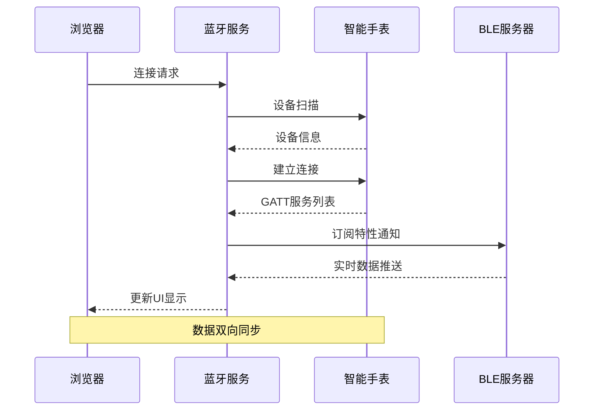

**图表来源**
- [index.html](file://webapp/index.html#L785-L832)
- [ble_srv.cpp](file://src/service/ble_srv.cpp#L250-L285)

## 详细组件分析

### HTML结构设计
应用采用语义化的HTML5结构，包含完整的页面骨架：

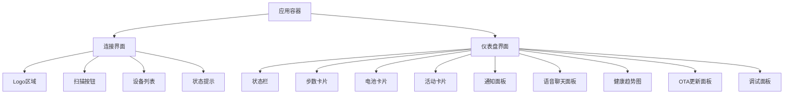

**图表来源**
- [index.html](file://webapp/index.html#L514-L702)

**章节来源**
- [index.html](file://webapp/index.html#L514-L702)

### CSS样式系统
应用实现了完整的CSS变量系统，提供了丰富的视觉设计能力：

#### 主题色彩体系
- **深色主题**：`--bg-primary: #0d0d1a` 作为主背景色
- **卡片主题**：`--bg-card: #1a1a2e` 提供内容区域背景
- **强调色**：`--accent: #00d4ff` 用于重要元素和链接
- **状态色**：绿色(#00d488)表示成功，红色(#ff4466)表示错误

#### 响应式设计
- **视口设置**：`width=device-width, initial-scale=1.0`
- **安全区域**：`env(safe-area-inset-bottom)` 支持刘海屏
- **弹性布局**：使用Flexbox实现自适应排列

**章节来源**
- [index.html](file://webapp/index.html#L8-L31)

### JavaScript交互逻辑
应用的核心逻辑集中在统一的BLE服务类中：

#### BleService类架构
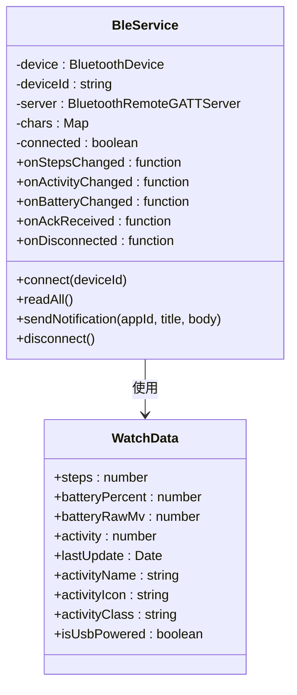

**图表来源**
- [index.html](file://webapp/index.html#L756-L972)

#### 数据模型设计
WatchData类提供了完整的手表数据抽象：

| 属性名 | 类型 | 描述 | 默认值 |
|--------|------|------|--------|
| steps | number | 步数计数 | 0 |
| batteryPercent | number | 电池百分比 | -1 |
| batteryRawMv | number | 电池电压(mV) | 0 |
| activity | number | 活动状态(0-2) | 2 |
| lastUpdate | Date | 最后更新时间 | null |

**章节来源**
- [index.html](file://webapp/index.html#L756-L765)

### Web Bluetooth API实现
应用实现了完整的Web Bluetooth API使用流程：

#### 设备发现流程
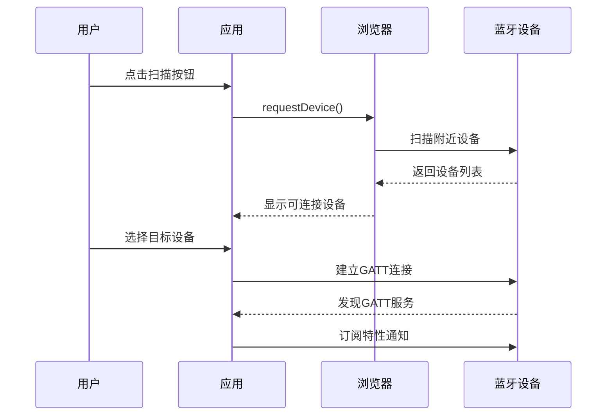

**图表来源**
- [index.html](file://webapp/index.html#L1024-L1045)

#### GATT服务访问
应用支持以下核心服务：

| 服务名称 | UUID | 特性 | 功能 |
|----------|------|------|------|
| 数据服务 | abcd1000 | STEPS_CHAR | 步数数据 |
| 数据服务 | abcd1000 | BATT_RAW_CHAR | 电池原始电压 |
| 数据服务 | abcd1000 | ACTIVITY_CHAR | 活动状态 |
| 通知服务 | abcd0001 | NOTIFY_RX_CHAR | 接收通知 |
| 通知服务 | abcd0001 | NOTIFY_TX_CHAR | 发送ACK确认 |
| 电池服务 | 0000180f | BATTERY_LEVEL | 电池电量 |
| 时间服务 | 00001805 | CURRENT_TIME | 当前时间 |

**章节来源**
- [index.html](file://webapp/index.html#L715-L727)

### 响应式设计原理
应用实现了完整的响应式设计系统：

#### 动画系统
- **淡入动画**：`.dashboard.active .card` 使用渐变动画
- **数值闪烁**：`.value-changed` 动画效果
- **状态指示**：绿色脉冲效果表示连接状态

#### 主题切换机制
应用支持动态主题切换，通过CSS变量实现：

```css
/* 连接状态指示 */
.status-dot {
    width: 8px; height: 8px;
    border-radius: 50%;
    background: var(--green);
    box-shadow: 0 0 8px var(--green);
}

/* 错误状态指示 */
.connect-status.error {
    color: var(--red);
}
```

**章节来源**
- [index.html](file://webapp/index.html#L492-L509)
- [index.html](file://webapp/index.html#L238-L243)
- [index.html](file://webapp/index.html#L103-L104)

### 用户界面组件详解

#### 连接屏幕组件
连接屏幕提供了直观的设备连接体验：

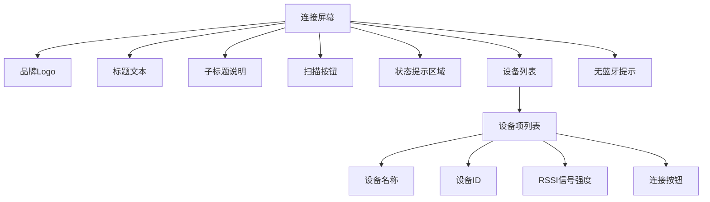

**图表来源**
- [index.html](file://webapp/index.html#L515-L531)

#### 仪表盘组件
仪表盘包含多个数据展示卡片：

##### 步数统计卡片
- **步数显示**：大字体数字显示当前步数
- **进度条**：显示步数目标完成进度
- **目标设定**：默认10,000步目标

##### 电池状态卡片
- **电量百分比**：实时显示电池电量
- **电压显示**：显示电池电压(mV)
- **USB状态**：检测并显示USB充电状态
- **进度条**：可视化电池电量

##### 活动状态卡片
- **活动图标**：根据活动类型显示不同图标
- **活动名称**：显示当前活动状态
- **强度描述**：显示活动强度级别

**章节来源**
- [index.html](file://webapp/index.html#L544-L577)

#### 通知发送功能
通知发送面板提供了完整的消息发送能力：

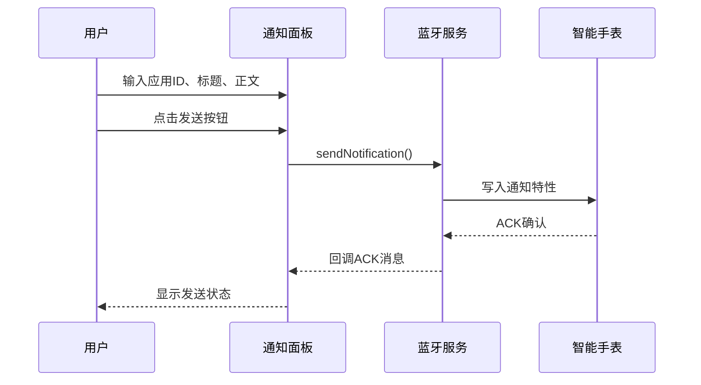

**图表来源**
- [index.html](file://webapp/index.html#L1251-L1261)

#### 语音聊天功能
语音聊天集成了多种技术：

##### 文本聊天流程
- **API密钥管理**：本地存储DeepSeek API密钥
- **多轮对话**：维护聊天历史记录
- **LLM集成**：调用DeepSeek Chat API
- **BLE回传**：将结果发送到手表

##### 语音识别集成
- **Web Speech API**：支持中文语音识别
- **实时转录**：语音到文本的实时转换
- **状态反馈**：提供录音状态指示

**章节来源**
- [index.html](file://webapp/index.html#L1276-L1434)

### 数据模型和状态管理

#### WatchData类实现
WatchData类提供了完整的数据模型：

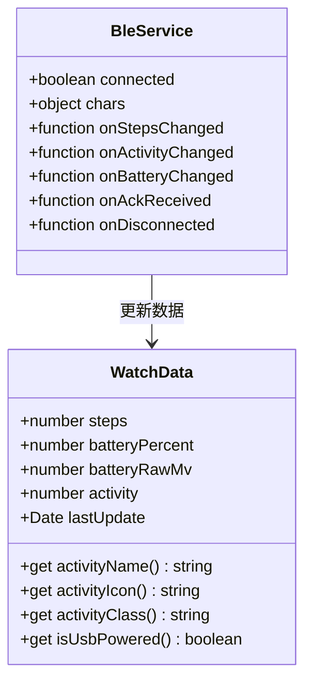

**图表来源**
- [index.html](file://webapp/index.html#L756-L765)
- [index.html](file://webapp/index.html#L770-L783)

#### 数据更新机制
应用实现了实时数据更新机制：

1. **BLE回调处理**：通过特性通知接收实时数据
2. **状态变更检测**：自动检测数据变化并触发UI更新
3. **时间戳记录**：记录每次数据更新的时间
4. **本地存储**：使用localStorage保存用户偏好设置

**章节来源**
- [index.html](file://webapp/index.html#L1159-L1161)
- [index.html](file://webapp/index.html#L1213-L1220)

### 固件升级管理
OTA更新功能提供了完整的固件升级能力：

#### OTA状态管理
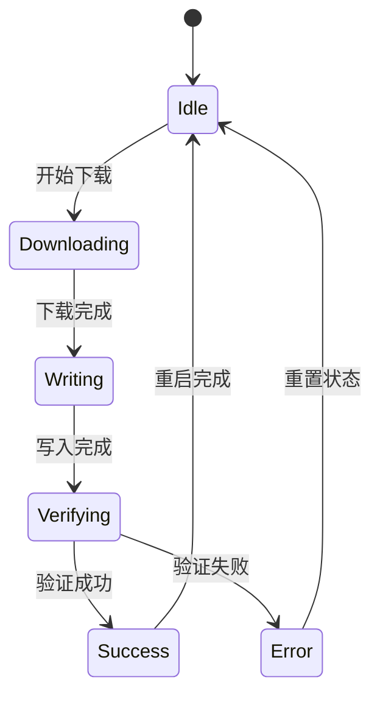

**图表来源**
- [ota_update.cpp](file://src/service/ota_update.cpp#L18-L40)

#### 升级流程控制
- **URL验证**：检查固件URL的有效性
- **网络状态检查**：确保WiFi连接可用
- **空间检测**：验证Flash存储空间
- **进度报告**：通过BLE特性上报升级状态

**章节来源**
- [index.html](file://webapp/index.html#L1464-L1497)
- [ota_update.cpp](file://src/service/ota_update.cpp#L54-L171)

## 依赖关系分析

### 前端依赖关系
应用使用了现代化的前端技术栈：

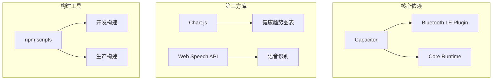

**图表来源**
- [package.json](file://webapp/package.json#L15-L21)

### 固件依赖关系
固件应用依赖于多个Arduino库：

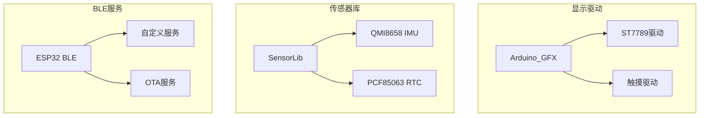

**图表来源**
- [main.cpp](file://src/main.cpp#L1-L28)

**章节来源**
- [package.json](file://webapp/package.json#L1-L22)
- [main.cpp](file://src/main.cpp#L1-L28)

## 性能考虑
应用在多个层面进行了性能优化：

### 1. 内存管理
- **数据缓存**：使用Map存储已发现的设备信息
- **状态持久化**：localStorage保存用户设置
- **对象复用**：避免频繁创建DOM元素

### 2. 网络优化
- **OTA分块传输**：4KB块大小优化下载性能
- **超时控制**：30秒HTTP请求超时
- **断点续传**：支持网络中断后的恢复

### 3. 电池优化
- **屏幕休眠**：5秒无操作自动休眠
- **深度睡眠**：长时间不使用进入深度睡眠
- **传感器节流**：屏幕关闭时降低更新频率

### 4. 用户体验优化
- **渐进式加载**：卡片按顺序淡入显示
- **即时反馈**：操作状态的实时视觉反馈
- **错误处理**：友好的错误提示和恢复机制

## 故障排除指南

### 常见问题诊断

#### 蓝牙连接问题
1. **检查浏览器支持**：确保使用支持Web Bluetooth的浏览器
2. **权限验证**：确认蓝牙权限已授权
3. **设备兼容性**：验证手表固件版本兼容性

#### 数据同步问题
1. **连接状态检查**：确认设备处于连接状态
2. **特性订阅验证**：检查相关特性的订阅状态
3. **数据格式验证**：确认数据包格式正确

#### OTA升级问题
1. **网络连接检查**：确保WiFi连接稳定
2. **存储空间验证**：检查Flash存储空间是否充足
3. **固件完整性**：验证固件文件的完整性

**章节来源**
- [index.html](file://webapp/index.html#L1004-L1008)
- [index.html](file://webapp/index.html#L1330-L1333)

### 调试工具
应用内置了完整的调试功能：

#### 调试面板
- **原始数据显示**：显示底层数据包内容
- **时间戳记录**：记录每次数据更新的时间
- **状态监控**：实时显示连接和状态信息

#### 日志系统
- **错误日志**：记录所有异常和错误信息
- **性能指标**：监控应用性能指标
- **用户行为**：跟踪用户操作行为

**章节来源**
- [index.html](file://webapp/index.html#L690-L700)
- [index.html](file://webapp/index.html#L1213-L1220)

## 结论
SmartBracelet Web应用展现了现代Web技术在物联网设备管理中的强大能力。通过精心设计的架构和实现，应用成功地实现了：

1. **跨平台兼容性**：同时支持Web浏览器和原生应用
2. **实时数据同步**：通过BLE实现低延迟的数据传输
3. **用户体验优化**：提供流畅、直观的操作界面
4. **性能高效性**：在资源受限的环境中保持良好性能

该应用为智能穿戴设备的Web管理提供了一个优秀的参考实现，展示了如何将复杂的硬件交互抽象为简洁易用的Web界面。