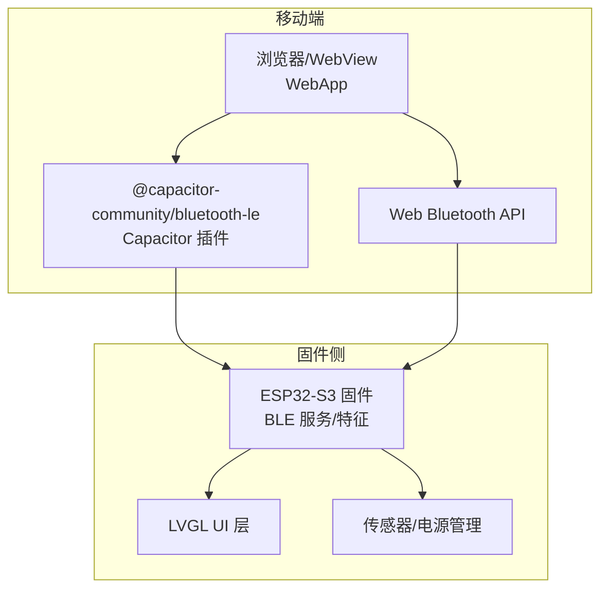
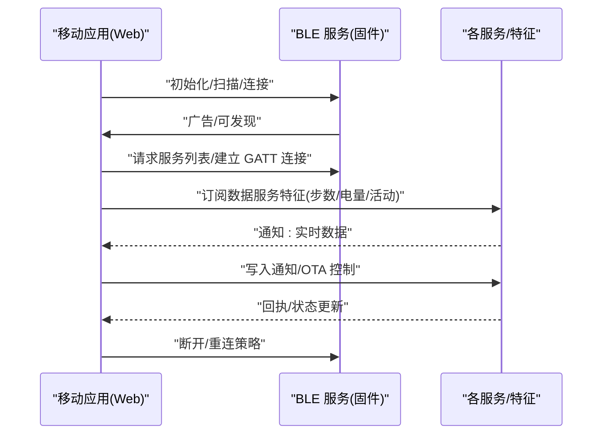
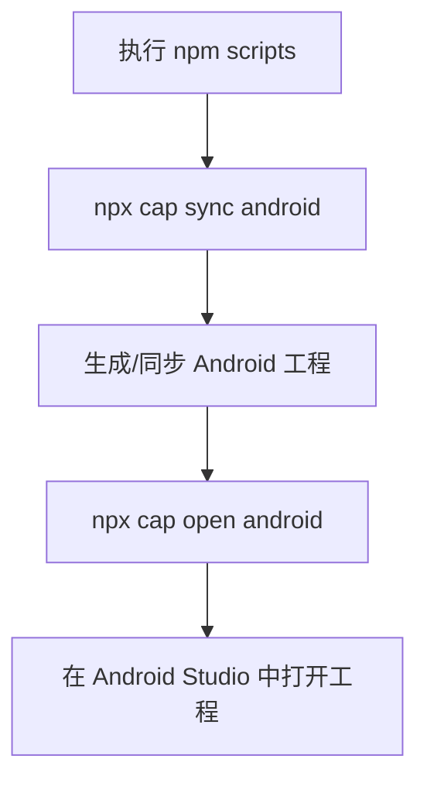
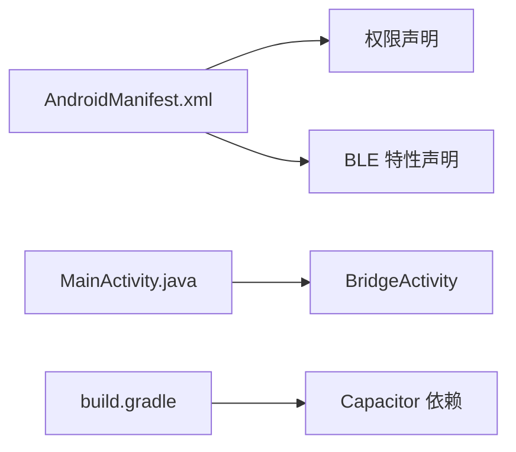
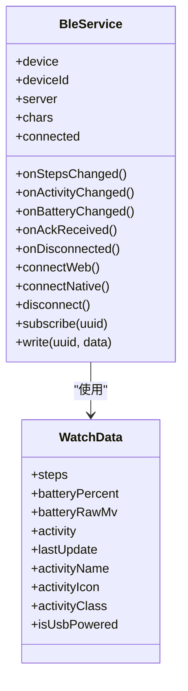
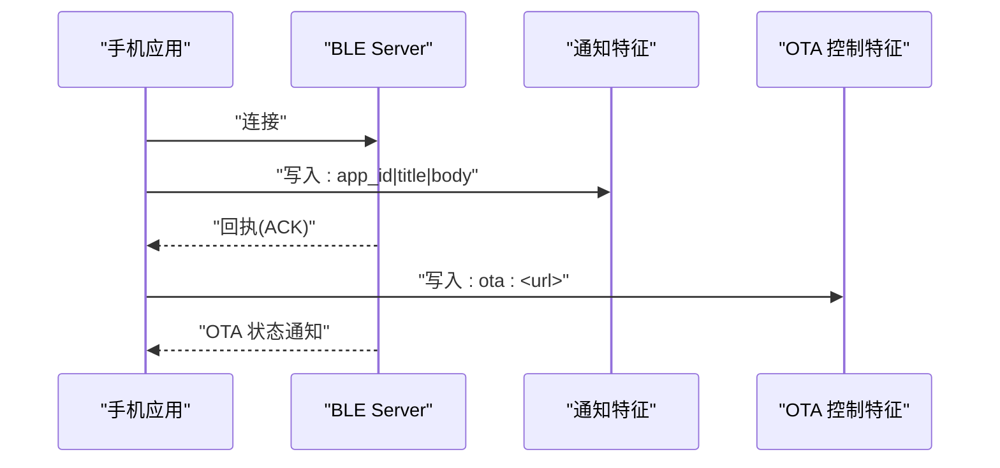
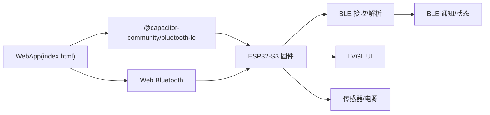

# 移动端应用

<cite>
**本文引用的文件**
- [capacitor.config.json](file://webapp/capacitor.config.json)
- [package.json](file://webapp/package.json)
- [index.html](file://webapp/index.html)
- [AndroidManifest.xml](file://webapp/android/app/src/main/AndroidManifest.xml)
- [MainActivity.java](file://webapp/android/app/src/main/java/com/smartbracelet/app/MainActivity.java)
- [build.gradle](file://webapp/android/app/build.gradle)
- [main.cpp](file://src/main.cpp)
- [ble_srv.cpp](file://src/service/ble_srv.cpp)
- [ble_hid.cpp](file://src/service/ble_hid.cpp)
- [platformio.ini](file://platformio.ini)
</cite>

## 目录
1. [引言](#引言)
2. [项目结构](#项目结构)
3. [核心组件](#核心组件)
4. [架构总览](#架构总览)
5. [详细组件分析](#详细组件分析)
6. [依赖关系分析](#依赖关系分析)
7. [性能考虑](#性能考虑)
8. [故障排查指南](#故障排查指南)
9. [结论](#结论)
10. [附录](#附录)

## 引言
本文件为 SmartBracelet 移动端应用的技术文档，面向开发者与产品团队，系统性阐述以下内容：
- Capacitor 跨平台框架的集成与配置（Android 与 Web 平台）
- Web Bluetooth API 的使用（设备发现、连接管理、数据传输）
- Android 应用开发要点（原生权限、BLE 通信、应用生命周期）
- 用户界面设计（页面布局、交互设计、响应式适配）
- 数据同步机制（实时数据传输、离线缓存、数据一致性）
- 应用发布与分发（签名配置、版本管理、更新机制）
- 调试方法、性能优化与用户体验建议

## 项目结构
该仓库采用“固件侧 + 移动端 Web 应用”的双端架构：
- 固件侧（ESP32-S3）：运行在嵌入式设备上，负责传感器采集、BLE 服务、显示与业务逻辑
- 移动端 Web 应用（Capacitor + Web Bluetooth）：通过 Web Bluetooth 或 Capacitor 插件与设备交互，提供设备管理、通知下发、语音聊天、OTA 升级等功能

图表来源
- [index.html](file://webapp/index.html#L705-L800)
- [ble_srv.cpp](file://src/service/ble_srv.cpp#L250-L285)
- [platformio.ini](file://platformio.ini#L14-L41)

章节来源
- [capacitor.config.json](file://webapp/capacitor.config.json#L1-L14)
- [package.json](file://webapp/package.json#L1-L22)
- [index.html](file://webapp/index.html#L1-L120)
- [AndroidManifest.xml](file://webapp/android/app/src/main/AndroidManifest.xml#L1-L51)
- [build.gradle](file://webapp/android/app/build.gradle#L1-L55)
- [main.cpp](file://src/main.cpp#L615-L722)
- [ble_srv.cpp](file://src/service/ble_srv.cpp#L1-L60)
- [platformio.ini](file://platformio.ini#L1-L41)

## 核心组件
- Capacitor 配置与脚本
  - 应用标识、应用名、Web 打包目录、服务器配置、插件启用（BLE）
  - 构建/打开/开发脚本命令
- Android 权限与清单
  - 网络、蓝牙、位置权限；BLE 特性声明
- Web 前端
  - 主题化样式、页面布局、交互控件、BLE 统一服务封装
- 固件 BLE 服务
  - 设备信息服务、电池服务、当前时间、通知服务、数据服务、OTA 服务、HID 消费控制
- 平台构建配置
  - PlatformIO 环境、编译选项、库依赖

章节来源
- [capacitor.config.json](file://webapp/capacitor.config.json#L1-L14)
- [package.json](file://webapp/package.json#L6-L10)
- [AndroidManifest.xml](file://webapp/android/app/src/main/AndroidManifest.xml#L38-L50)
- [index.html](file://webapp/index.html#L705-L800)
- [ble_srv.cpp](file://src/service/ble_srv.cpp#L125-L248)
- [platformio.ini](file://platformio.ini#L14-L41)

## 架构总览
移动端通过 Web Bluetooth 或 Capacitor 插件访问固件提供的 BLE 服务，完成设备发现、连接、订阅特征值、发送通知与 OTA 控制等操作。固件侧以 BLE Server 提供多组服务与特征，同时维护本地 UI 与传感器状态。

图表来源
- [index.html](file://webapp/index.html#L769-L800)
- [ble_srv.cpp](file://src/service/ble_srv.cpp#L250-L285)

章节来源
- [index.html](file://webapp/index.html#L705-L800)
- [ble_srv.cpp](file://src/service/ble_srv.cpp#L250-L285)

## 详细组件分析

### Capacitor 集成与配置
- 应用元数据与打包目录
  - appId、appName、webDir、server.androidScheme
- 插件启用
  - 启用 BLE 插件并开启通知显示
- 依赖与脚本
  - @capacitor-community/bluetooth-le、@capacitor/android、@capacitor/cli、@capacitor/core
  - build/open/dev 脚本调用 Capacitor 同步与打开 Android

图表来源
- [package.json](file://webapp/package.json#L6-L10)
- [capacitor.config.json](file://webapp/capacitor.config.json#L1-L14)

章节来源
- [capacitor.config.json](file://webapp/capacitor.config.json#L1-L14)
- [package.json](file://webapp/package.json#L15-L21)

### Android 应用开发要点
- 清单权限
  - 网络、蓝牙、扫描/连接权限（Android 12+）、位置权限（Android 6-11）
  - 蓝牙低功耗特性声明
- Activity 与桥接
  - MainActivity 继承 BridgeActivity，承载 WebView 容器
- 构建配置
  - compileSdk/targetSdk/minSdk、版本号/名称、资源忽略规则、依赖引入 Capacitor 与 Cordova 插件

图表来源
- [AndroidManifest.xml](file://webapp/android/app/src/main/AndroidManifest.xml#L38-L50)
- [MainActivity.java](file://webapp/android/app/src/main/java/com/smartbracelet/app/MainActivity.java#L1-L6)
- [build.gradle](file://webapp/android/app/build.gradle#L33-L43)

章节来源
- [AndroidManifest.xml](file://webapp/android/app/src/main/AndroidManifest.xml#L1-L51)
- [MainActivity.java](file://webapp/android/app/src/main/java/com/smartbracelet/app/MainActivity.java#L1-L6)
- [build.gradle](file://webapp/android/app/build.gradle#L1-L55)

### Web 前端与 UI 设计
- 页面结构
  - 连接页、设备列表、仪表盘（步数、电量、活动、通知、聊天、健康趋势、OTA、调试）
- 主题与样式
  - CSS 变量定义深色主题、圆角、阴影、过渡动画
- 交互与响应式
  - 使用 viewport meta、容器最大宽度、安全区域适配、卡片布局、折叠面板
- BLE 抽象层
  - 统一的 BleService 类，支持 Web Bluetooth 与 Capacitor 插件
  - UUID 映射、Base64/Uint8Array 辅助函数、WatchData 模型
  - 连接/断开、订阅特征、回调注册、断线处理

图表来源
- [index.html](file://webapp/index.html#L769-L800)
- [index.html](file://webapp/index.html#L755-L766)

章节来源
- [index.html](file://webapp/index.html#L48-L700)
- [index.html](file://webapp/index.html#L705-L800)

### 固件 BLE 服务与协议
- 服务与特征
  - 设备信息服务（厂商、型号、序列号）
  - 电池服务（读取/通知）
  - 当前时间服务（读取/写入）
  - 通知服务（RX 写入、TX 通知）
  - 数据服务（步数/电量原始值/活动/IMU 特征）
  - OTA 服务（控制/状态）
  - HID 消费控制（播放/暂停/上一首/下一首/音量）
- 连接与广告
  - 设置 MTU、加密级别、广告间隔，启动广播
- 数据更新
  - 步数、电量、活动、OTA 状态、IMU 特征的读取与通知
- 协议格式
  - 通知：app_id|title|body
  - OTA：ota:url
  - DND：dnd:1/dnd:0
  - 语音：voice:cmd|arg

图表来源
- [ble_srv.cpp](file://src/service/ble_srv.cpp#L168-L187)
- [ble_srv.cpp](file://src/service/ble_srv.cpp#L225-L248)
- [ble_srv.cpp](file://src/service/ble_srv.cpp#L82-L123)

章节来源
- [ble_srv.cpp](file://src/service/ble_srv.cpp#L125-L248)
- [ble_srv.cpp](file://src/service/ble_srv.cpp#L287-L413)
- [ble_hid.cpp](file://src/service/ble_hid.cpp#L67-L111)

### 固件主循环与 UI 更新
- 初始化
  - 显示、触摸、传感器、电源管理、BLE 服务、OTA、语音、跌倒检测、页面初始化
- 主循环
  - LVGL 计时器、WiFi/NTP、OTA 循环、通知处理、串口命令解析（含 OTA 触发）
- 事件与页面
  - 手势切换页面、模拟表盘、传感器页、通知页、音乐页、语音聊天页
- 能耗与屏幕
  - WiFi 动态开关、背光超时、手腕抬起唤醒

章节来源
- [main.cpp](file://src/main.cpp#L615-L722)
- [main.cpp](file://src/main.cpp#L724-L800)

### 平台构建与依赖
- PlatformIO 环境
  - ESP32-S3 开发板、Arduino 框架、监控参数、上传端口
- 编译标志
  - 调试优化、LVGL 简化头、BLE/NimBLE 限制、IRAM 优化关闭、包含路径
- 依赖库
  - LVGL、ArduinoJson、触摸驱动、BLE 库等

章节来源
- [platformio.ini](file://platformio.ini#L14-L41)

## 依赖关系分析
- 移动端对固件的依赖
  - 通过 BLE 服务与特征进行双向通信
- 移动端内部依赖
  - WebApp 依赖 Web Bluetooth 或 Capacitor 插件；UI 依赖 BleService 抽象层
- 固件侧依赖
  - BLE、LVGL、传感器库、电源管理库、OTA 库、音频/语音相关模块

图表来源
- [package.json](file://webapp/package.json#L15-L21)
- [index.html](file://webapp/index.html#L705-L736)
- [ble_srv.cpp](file://src/service/ble_srv.cpp#L250-L285)

章节来源
- [package.json](file://webapp/package.json#L15-L21)
- [index.html](file://webapp/index.html#L705-L736)
- [ble_srv.cpp](file://src/service/ble_srv.cpp#L250-L285)

## 性能考虑
- BLE 优化
  - 合理设置 MTU、降低广告频率、按需通知、避免频繁订阅
- 固件侧优化
  - WiFi 动态开关、背光超时、滤波算法、低功耗模式
- 前端优化
  - 图表按需渲染、动画节流、资源压缩、缓存策略
- 存储与同步
  - 本地缓存与去重、增量更新、冲突解决策略

## 故障排查指南
- 蓝牙不可用或扫描失败
  - 检查 Android 权限（蓝牙、扫描、位置）、Web 平台权限提示
- 连接不稳定或断开
  - 检查广告间隔、MTU 设置、连接参数；确认固件是否重启或复位
- 数据不同步
  - 确认订阅特征、通知回调、UI 刷新逻辑；检查协议格式
- OTA 失败
  - 检查 URL 可达性、固件状态机、进度上报、错误日志
- 调试
  - 使用固件串口日志、Web 控制台日志、BLE 分析工具

章节来源
- [AndroidManifest.xml](file://webapp/android/app/src/main/AndroidManifest.xml#L38-L50)
- [ble_srv.cpp](file://src/service/ble_srv.cpp#L250-L285)
- [main.cpp](file://src/main.cpp#L724-L800)

## 结论
本项目通过 Capacitor 将 Web 技术与原生能力结合，配合固件侧完善的 BLE 服务，实现了从设备发现到数据同步、通知下发、语音聊天与 OTA 升级的完整链路。建议在后续迭代中完善离线缓存与一致性策略、增强错误恢复与可视化诊断，并持续优化 BLE 与固件侧的能耗表现。

## 附录
- 发布与分发
  - Android：配置签名、版本号/名称、混淆与资源压缩、内测/发布渠道
  - Web：静态资源部署、HTTPS、Service Worker 缓存策略
- 更新机制
  - OTA 服务通过 BLE 控制，固件侧下载/写入/重启流程需保证完整性与可回滚
- 用户体验
  - 响应式布局、手势导航、动画反馈、Do Not Disturb、语音输入与转写