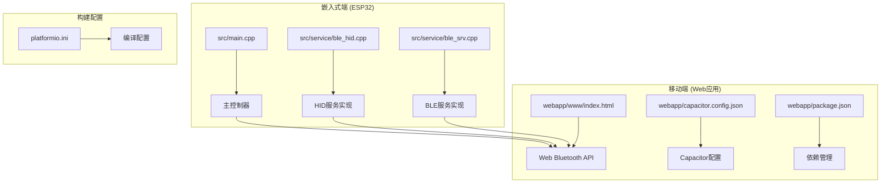
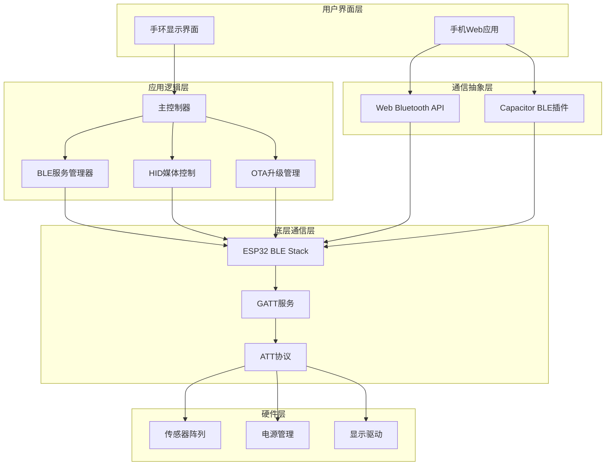
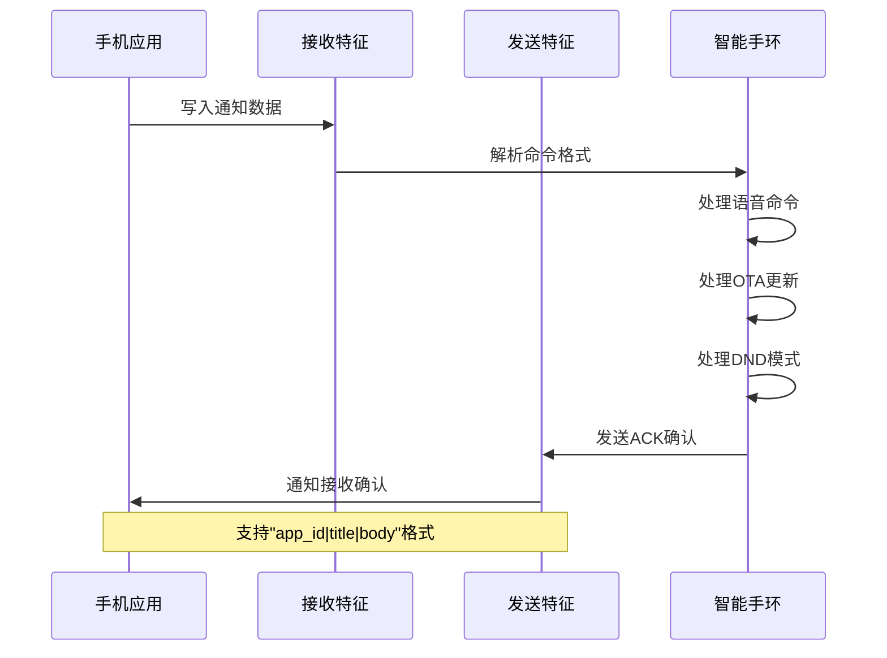
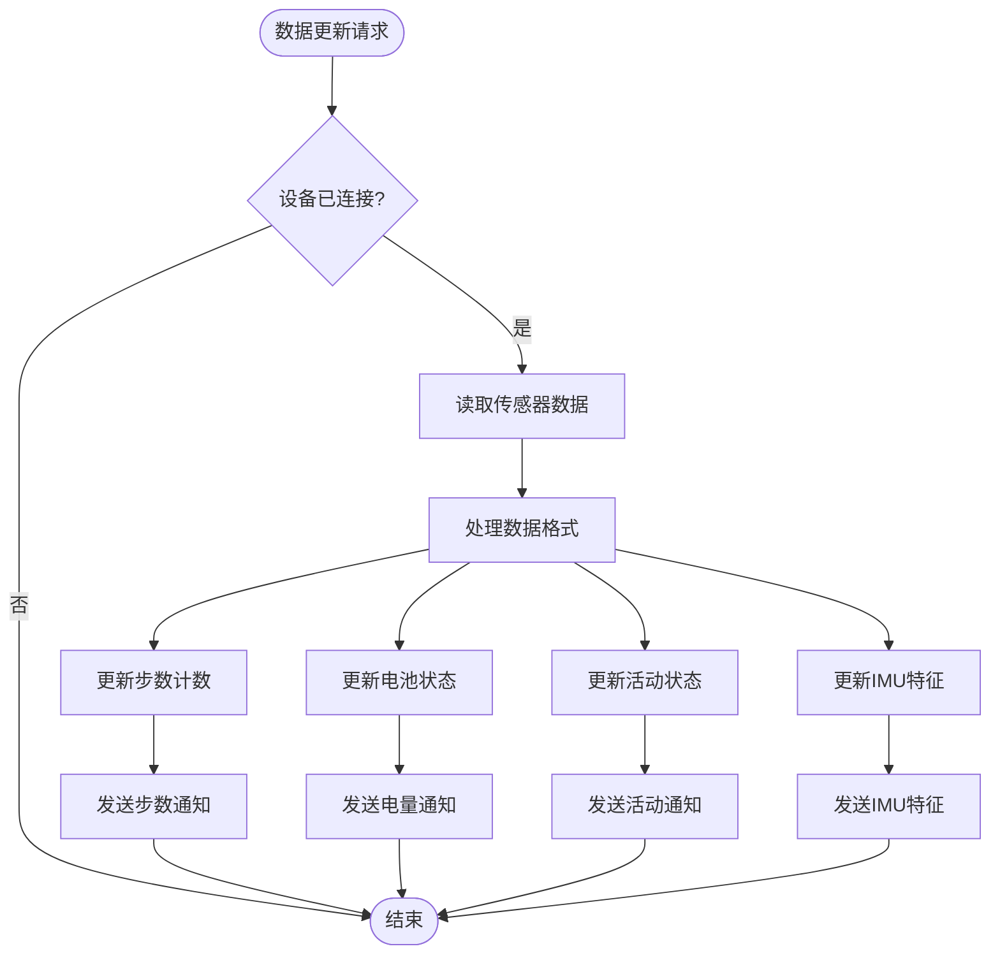
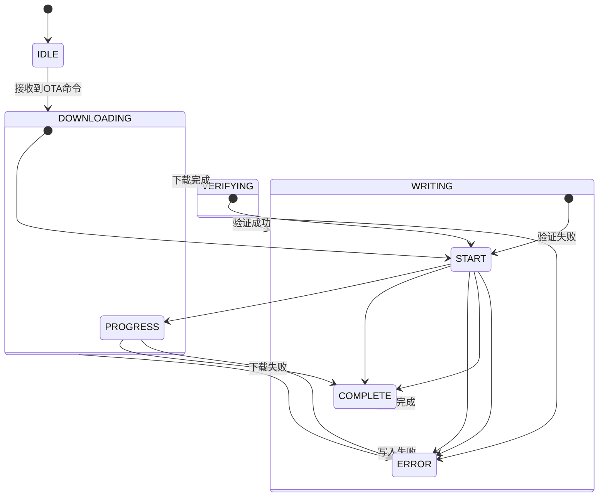
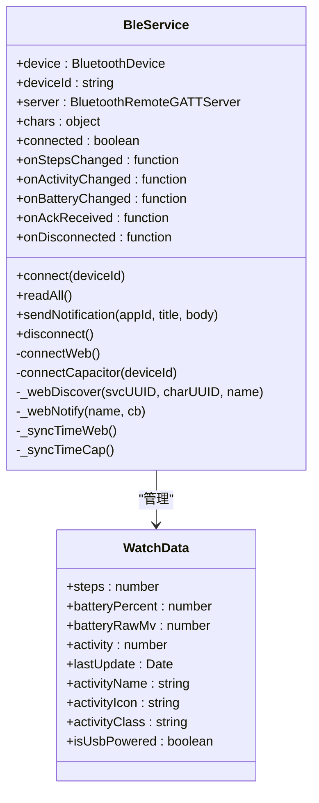
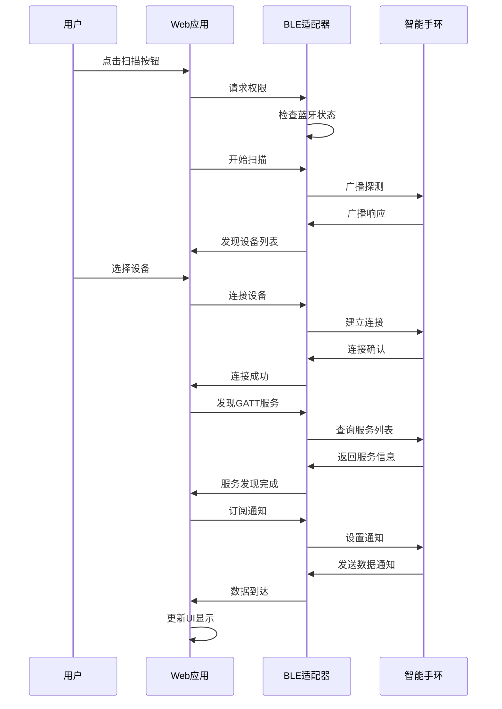
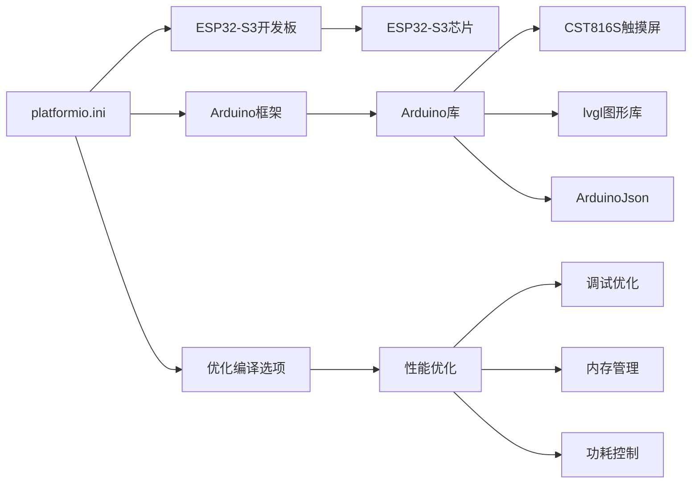
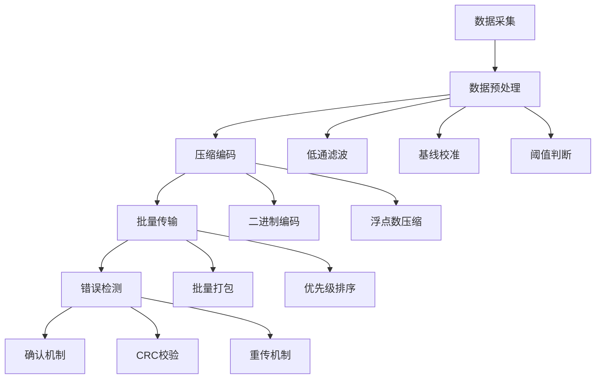

# 蓝牙通信集成

<cite>
**本文档引用的文件**
- [src/service/ble_srv.cpp](file://src/service/ble_srv.cpp)
- [src/service/ble_srv.h](file://src/service/ble_srv.h)
- [src/service/ble_hid.cpp](file://src/service/ble_hid.cpp)
- [src/service/ble_hid.h](file://src/service/ble_hid.h)
- [src/main.cpp](file://src/main.cpp)
- [webapp/www/index.html](file://webapp/www/index.html)
- [webapp/capacitor.config.json](file://webapp/capacitor.config.json)
- [webapp/package.json](file://webapp/package.json)
- [platformio.ini](file://platformio.ini)
</cite>

## 目录
1. [简介](#简介)
2. [项目结构](#项目结构)
3. [核心组件](#核心组件)
4. [架构概览](#架构概览)
5. [详细组件分析](#详细组件分析)
6. [依赖关系分析](#依赖关系分析)
7. [性能考虑](#性能考虑)
8. [故障排除指南](#故障排除指南)
9. [结论](#结论)

## 简介

SmartBracelet是一款基于ESP32-S3的智能手环项目，实现了完整的蓝牙低功耗（BLE）通信系统。该系统采用双端架构：嵌入式端使用ESP32的BLE Stack实现GATT服务，移动端使用Web Bluetooth API和Capacitor BLE插件进行通信。

系统支持多种BLE服务，包括通知服务、时间服务、电池服务、数据服务和OTA升级服务，为智能穿戴设备提供了完整的通信解决方案。

## 项目结构

项目采用模块化设计，主要分为三个部分：



**图表来源**
- [src/service/ble_srv.cpp](file://src/service/ble_srv.cpp#L1-L413)
- [src/service/ble_hid.cpp](file://src/service/ble_hid.cpp#L1-L141)
- [src/main.cpp](file://src/main.cpp#L615-L722)

**章节来源**
- [src/service/ble_srv.cpp](file://src/service/ble_srv.cpp#L1-L413)
- [src/service/ble_hid.cpp](file://src/service/ble_hid.cpp#L1-L141)
- [src/main.cpp](file://src/main.cpp#L615-L722)

## 核心组件

### BLE服务架构

系统实现了多个专用的BLE服务，每个服务都有明确的功能分工：

| 服务类型 | UUID | 功能描述 | 特征数量 |
|---------|------|----------|----------|
| 通知服务 | abcd0001-0000-1000-8000-00805f9b34fb | 设备间双向通信 | 2个 |
| 数据服务 | abcd1000-0000-1000-8000-00805f9b34fb | 传感器数据传输 | 4个 |
| OTA服务 | abcd2000-0000-1000-8000-00805f9b34fb | 固件升级 | 2个 |
| 设备信息服务 | 0000180A | 设备信息读取 | 3个 |
| 电池服务 | 0000180F | 电量监控 | 1个 |
| 时间服务 | 00001805 | 时间同步 | 1个 |

### 数据服务特征映射

数据服务是系统的核心，负责向手机端传输传感器数据：

```mermaid
erDiagram
DATA_SERVICE {
UUID abcd1000-0000-1000-8000-00805f9b34fb
}
STEPS_CHAR {
UUID abcd1001-0000-1000-8000-00805f9b34fb
TYPE uint32_t
ACCESS READ/NOWIFY
DESCRIPTION 步数计数器
}
BATT_RAW_CHAR {
UUID abcd1002-0000-1000-8000-00805f9b34fb
TYPE uint16_t
ACCESS READ
DESCRIPTION 电池电压原始值
}
ACTIVITY_CHAR {
UUID abcd1003-0000-1000-8000-00805f9b34fb
TYPE uint8_t
ACCESS READ/NOWIFY
DESCRIPTION 活动状态
}
IMU_FEAT_CHAR {
UUID abcd1004-0000-1000-8000-00805f9b34fb
TYPE float[12]
ACCESS READ/NOWIFY
DESCRIPTION IMU特征数据
}
DATA_SERVICE ||--o{ STEPS_CHAR : "包含"
DATA_SERVICE ||--o{ BATT_RAW_CHAR : "包含"
DATA_SERVICE ||--o{ ACTIVITY_CHAR : "包含"
DATA_SERVICE ||--o{ IMU_FEAT_CHAR : "包含"
```

**图表来源**
- [src/service/ble_srv.cpp](file://src/service/ble_srv.cpp#L189-L223)
- [src/service/ble_srv.h](file://src/service/ble_srv.h#L12-L20)

**章节来源**
- [src/service/ble_srv.cpp](file://src/service/ble_srv.cpp#L189-L223)
- [src/service/ble_srv.h](file://src/service/ble_srv.h#L12-L20)

## 架构概览

系统采用分层架构设计，实现了从硬件到应用的完整通信链路：



**图表来源**
- [src/main.cpp](file://src/main.cpp#L615-L722)
- [webapp/www/index.html](file://webapp/www/index.html#L717-L922)

## 详细组件分析

### BLE服务实现

#### 通知服务 (Notification Service)

通知服务是设备与手机之间的主要通信通道，支持双向数据传输：



**图表来源**
- [src/service/ble_srv.cpp](file://src/service/ble_srv.cpp#L63-L123)
- [src/service/ble_srv.cpp](file://src/service/ble_srv.cpp#L168-L187)

通知服务支持以下协议格式：

| 协议类型 | 格式示例 | 用途 |
|---------|----------|------|
| 通知消息 | `com.example.app|标题|正文` | 应用通知推送 |
| 语音命令 | `voice:cmd|arg` | 语音助手控制 |
| OTA更新 | `ota:http://example.com/firmware.bin` | 固件升级触发 |
| DND模式 | `dnd:1` 或 `dnd:0` | 勿扰模式开关 |

**章节来源**
- [src/service/ble_srv.cpp](file://src/service/ble_srv.cpp#L63-L123)
- [src/service/ble_srv.cpp](file://src/service/ble_srv.cpp#L168-L187)

#### 数据服务 (Data Service)

数据服务负责向手机端传输传感器数据和设备状态信息：



**图表来源**
- [src/service/ble_srv.cpp](file://src/service/ble_srv.cpp#L329-L412)
- [src/service/ble_srv.h](file://src/service/ble_srv.h#L12-L16)

数据服务支持的数据类型：

| 数据类型 | 字节长度 | 更新频率 | 描述 |
|---------|----------|----------|------|
| 步数计数 | 4字节 | 实时 | 32位无符号整数 |
| 电池电压 | 2字节 | 1秒一次 | 毫伏特数值 |
| 活动状态 | 1字节 | 1秒一次 | 0=步行, 1=跑步, 2=静止 |
| IMU特征 | 48字节 | 1秒一次 | 12个浮点数序列 |

**章节来源**
- [src/service/ble_srv.cpp](file://src/service/ble_srv.cpp#L329-L412)
- [src/service/ble_srv.h](file://src/service/ble_srv.h#L12-L16)

#### OTA升级服务

OTA服务允许通过BLE进行固件升级，确保设备能够远程更新：



**图表来源**
- [src/service/ble_srv.cpp](file://src/service/ble_srv.cpp#L225-L248)
- [src/service/ble_srv.h](file://src/service/ble_srv.h#L36-L37)

**章节来源**
- [src/service/ble_srv.cpp](file://src/service/ble_srv.cpp#L225-L248)
- [src/service/ble_srv.h](file://src/service/ble_srv.h#L36-L37)

### Web应用BLE实现

#### 统一BLE服务接口

Web应用实现了统一的BLE服务接口，支持Web Bluetooth和Capacitor两种后端：



**图表来源**
- [webapp/www/index.html](file://webapp/www/index.html#L720-L922)
- [webapp/www/index.html](file://webapp/www/index.html#L706-L715)

#### 设备扫描和连接流程



**图表来源**
- [webapp/www/index.html](file://webapp/www/index.html#L997-L1073)
- [webapp/www/index.html](file://webapp/www/index.html#L1013-L1030)

**章节来源**
- [webapp/www/index.html](file://webapp/www/index.html#L717-L922)
- [webapp/www/index.html](file://webapp/www/index.html#L997-L1073)

### HID媒体控制服务

系统集成了BLE HID Consumer Control服务，支持媒体播放控制：

| 控制命令 | 报告ID | 键码 | 功能 |
|---------|--------|------|------|
| 播放/暂停 | 0x03 | 0x00CD | 媒体播放控制 |
| 下一首 | 0x03 | 0x00B5 | 切换下一首歌曲 |
| 上一首 | 0x03 | 0x00B6 | 切换上一首歌曲 |
| 音量增加 | 0x03 | 0x00E9 | 提高音量 |
| 音量减少 | 0x03 | 0x00EA | 降低音量 |

**章节来源**
- [src/service/ble_hid.cpp](file://src/service/ble_hid.cpp#L18-L27)
- [src/service/ble_hid.cpp](file://src/service/ble_hid.cpp#L51-L65)

## 依赖关系分析

### 构建系统配置

项目使用PlatformIO进行构建管理，配置了专门的ESP32-S3开发环境：



**图表来源**
- [platformio.ini](file://platformio.ini#L14-L41)

### 移动端依赖管理

Web应用使用Capacitor作为跨平台桥接框架：

```mermaid
graph TB
A[webapp/package.json] --> B[@capacitor-community/bluetooth-le]
A --> C[@capacitor/android]
A --> D[@capacitor/cli]
A --> E[@capacitor/core]
B --> F[Web Bluetooth包装]
C --> G[Android平台支持]
D --> H[命令行工具]
E --> I[核心功能]
F --> J[统一BLE接口]
G --> K[原生BLE调用]
I --> L[跨平台兼容]
```

**图表来源**
- [webapp/package.json](file://webapp/package.json#L15-L21)
- [webapp/capacitor.config.json](file://webapp/capacitor.config.json#L8-L12)

**章节来源**
- [platformio.ini](file://platformio.ini#L14-L41)
- [webapp/package.json](file://webapp/package.json#L15-L21)
- [webapp/capacitor.config.json](file://webapp/capacitor.config.json#L8-L12)

## 性能考虑

### 功耗优化策略

系统采用了多层次的功耗优化策略：

1. **广告间隔优化**: 将BLE广告间隔从默认的100ms调整为640ms，显著降低功耗
2. **连接参数优化**: 设置最小连接间隔为640ms，最大为2000ms
3. **MTU大小优化**: 使用256字节MTU提升传输效率
4. **WiFi电源管理**: 智能控制WiFi开关，每10分钟开启一次用于天气更新

### 数据传输优化



**图表来源**
- [src/main.cpp](file://src/main.cpp#L517-L547)
- [src/service/ble_srv.cpp](file://src/service/ble_srv.cpp#L278-L282)

### 内存管理优化

系统在内存受限的ESP32环境中实现了高效的内存管理：

- **静态分配**: 关键数据结构使用静态内存分配
- **缓冲区复用**: 避免频繁的内存分配和释放
- **数据对齐**: 优化数据结构以提高内存访问效率

**章节来源**
- [src/main.cpp](file://src/main.cpp#L517-L547)
- [src/service/ble_srv.cpp](file://src/service/ble_srv.cpp#L278-L282)

## 故障排除指南

### 常见连接问题

| 问题症状 | 可能原因 | 解决方案 |
|---------|----------|----------|
| 无法发现设备 | 蓝牙未启用或权限不足 | 检查系统蓝牙设置和应用权限 |
| 连接失败 | 设备距离过远或信号干扰 | 移动到信号良好区域重新尝试 |
| 传输中断 | MTU协商失败或数据过大 | 降低数据包大小或检查网络质量 |
| 通知不接收 | 通知订阅未正确设置 | 重新建立GATT连接并重新订阅 |

### 调试工具使用

系统提供了丰富的调试功能：

1. **串口调试**: 通过USB串口输出详细的BLE通信日志
2. **OTA状态监控**: 实时显示固件升级进度和状态
3. **传感器数据可视化**: 在Web界面显示实时传感器数据
4. **连接状态指示**: 显示当前连接状态和RSSI信号强度

### 性能监控指标

| 指标类型 | 正常范围 | 监控方法 |
|---------|----------|----------|
| 连接成功率 | >95% | 统计连接尝试次数 |
| 传输延迟 | <100ms | 测量从发送到接收的时间差 |
| 电池消耗 | <5mA | 监测电流消耗情况 |
| 数据丢失率 | <1% | 统计重传次数和总数据量 |

**章节来源**
- [src/main.cpp](file://src/main.cpp#L766-L780)
- [src/service/ble_srv.cpp](file://src/service/ble_srv.cpp#L287-L294)

## 结论

SmartBracelet蓝牙通信系统展现了现代IoT设备通信架构的最佳实践。通过精心设计的服务层次、优化的数据传输协议和完善的错误处理机制，系统实现了稳定可靠的BLE通信。

关键优势包括：

1. **模块化设计**: 清晰的服务分离使得系统易于维护和扩展
2. **跨平台兼容**: 同时支持Web Bluetooth和Capacitor，覆盖主流平台
3. **性能优化**: 多层次的功耗和性能优化确保设备续航能力
4. **用户体验**: 直观的Web界面和及时的通知反馈提升用户满意度

该系统为其他智能穿戴设备的BLE通信实现提供了优秀的参考模板，其设计理念和实现细节值得在类似项目中借鉴和应用。