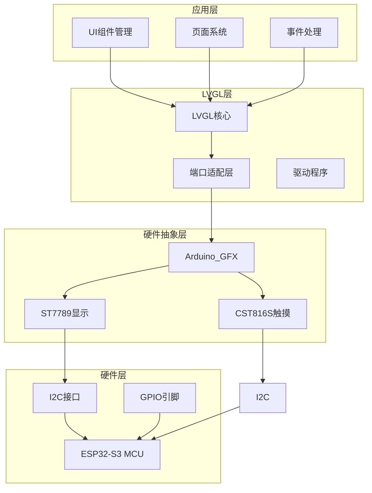
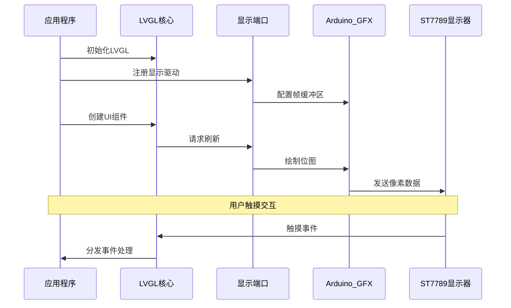
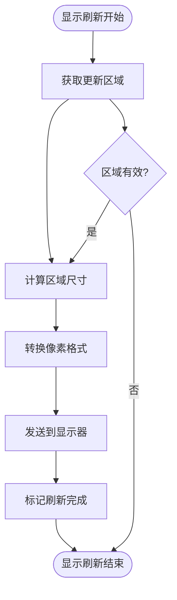
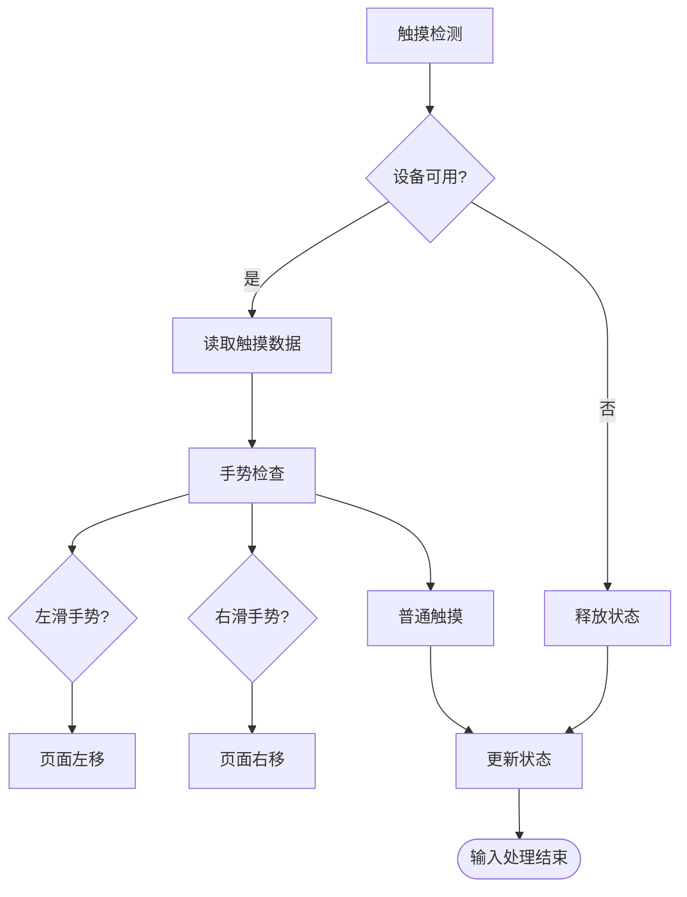
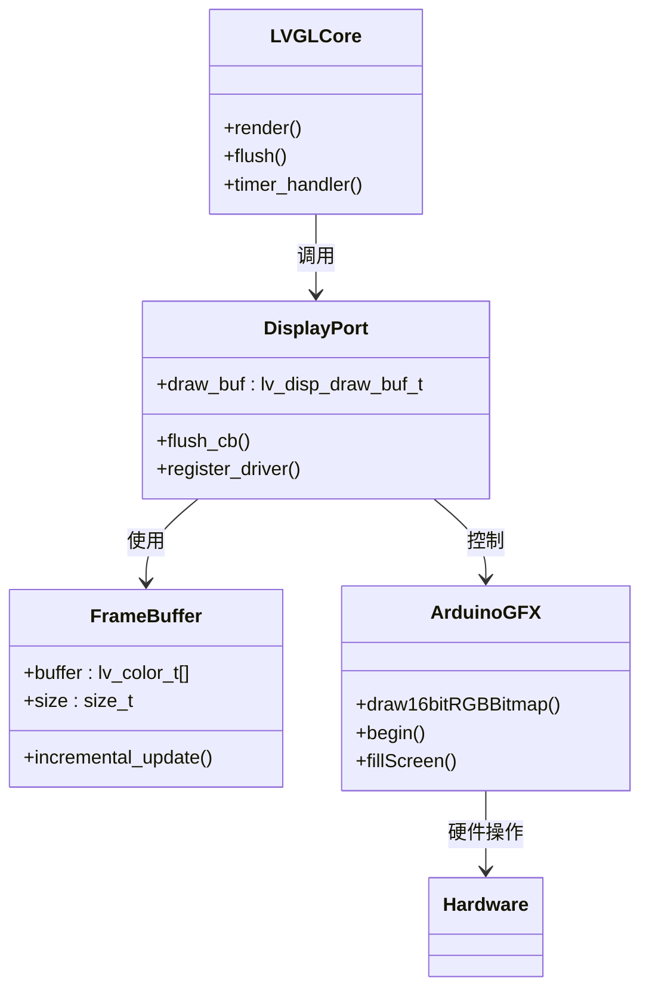

# LVGL图形系统集成

<cite>
**本文档引用的文件**
- [lv_conf.h](file://include/lv_conf.h)
- [lv_port_disp.cpp](file://src/lv_port_disp.cpp)
- [lv_port_disp.h](file://src/lv_port_disp.h)
- [lv_port_indev.cpp](file://src/lv_port_indev.cpp)
- [lv_port_indev.h](file://src/lv_port_indev.h)
- [pin_config.h](file://include/pin_config.h)
- [main.cpp](file://src/main.cpp)
- [platformio.ini](file://platformio.ini)
</cite>

## 目录
1. [简介](#简介)
2. [项目结构](#项目结构)
3. [核心组件](#核心组件)
4. [架构概览](#架构概览)
5. [详细组件分析](#详细组件分析)
6. [依赖关系分析](#依赖关系分析)
7. [性能考虑](#性能考虑)
8. [故障排除指南](#故障排除指南)
9. [结论](#结论)

## 简介

SmartBracelet项目集成了LVGL（Light and Versatile Graphics Library）图形系统，为可穿戴设备提供了完整的图形用户界面解决方案。本项目基于ESP32-S3微控制器，采用ST7789显示器和CST816S触摸控制器，实现了从底层硬件驱动到高级UI组件的完整图形栈。

LVGL在SmartBracelet中的集成方案涵盖了显示驱动端口实现、输入设备端口配置、图形库初始化过程，以及完整的UI组件管理系统。该系统支持多页面导航、手势识别、动画效果和实时数据展示等功能。

## 项目结构

SmartBracelet项目的LVGL集成遵循模块化设计原则，主要分为以下几个层次：



**图表来源**
- [main.cpp](file://src/main.cpp#L615-L722)
- [lv_port_disp.cpp](file://src/lv_port_disp.cpp#L22-L32)
- [lv_port_indev.cpp](file://src/lv_port_indev.cpp#L21-L27)

**章节来源**
- [main.cpp](file://src/main.cpp#L615-L722)
- [platformio.ini](file://platformio.ini#L14-L41)

## 核心组件

### 显示驱动端口

显示驱动端口是LVGL与硬件显示设备之间的桥梁，负责将LVGL渲染的图像数据传输到物理显示器。

**关键特性：**
- 双缓冲机制：使用1/10屏幕大小的帧缓冲区
- 增量刷新：仅刷新发生变化的区域
- 高效像素传输：直接调用Arduino_GFX的16位RGB位图绘制函数

**章节来源**
- [lv_port_disp.cpp](file://src/lv_port_disp.cpp#L5-L32)
- [lv_port_disp.h](file://src/lv_port_disp.h#L1-L11)

### 输入设备端口

输入设备端口处理触摸输入，为用户提供直观的交互方式。

**关键特性：**
- 指针类型输入设备
- 实时状态检测
- 坐标数据转换
- 手势识别支持

**章节来源**
- [lv_port_indev.cpp](file://src/lv_port_indev.cpp#L6-L27)
- [lv_port_indev.h](file://src/lv_port_indev.h#L1-L11)

### 图形配置参数

LVGL配置文件定义了整个图形系统的参数设置：

**颜色配置：**
- 16位颜色深度（RGB565格式）
- 屏幕透明度支持关闭
- 字节序交换禁用

**内存配置：**
- 64KB总内存
- 最大16个内存缓冲区
- 图层简单缓冲区大小24KB

**性能配置：**
- 默认刷新周期30ms
- 输入设备读取周期30ms
- 自定义时间源（millis函数）

**章节来源**
- [lv_conf.h](file://include/lv_conf.h#L14-L34)

## 架构概览

SmartBracelet的LVGL架构采用分层设计，确保了良好的模块化和可维护性：



**图表来源**
- [main.cpp](file://src/main.cpp#L644-L650)
- [lv_port_disp.cpp](file://src/lv_port_disp.cpp#L11-L20)
- [lv_port_indev.cpp](file://src/lv_port_indev.cpp#L6-L19)

## 详细组件分析

### 显示驱动实现

显示驱动通过增量刷新机制优化渲染性能：



**图表来源**
- [lv_port_disp.cpp](file://src/lv_port_disp.cpp#L11-L20)

**实现细节：**
- 使用Arduino_GFX的16位RGB位图绘制函数
- 支持任意矩形区域的增量更新
- 自动标记刷新完成状态

**章节来源**
- [lv_port_disp.cpp](file://src/lv_port_disp.cpp#L11-L20)

### 输入设备处理

触摸输入通过CST816S传感器实现，支持多种交互模式：



**图表来源**
- [lv_port_indev.cpp](file://src/lv_port_indev.cpp#L6-L19)
- [main.cpp](file://src/main.cpp#L510-L514)

**功能特性：**
- 实时触摸状态检测
- 坐标位置获取
- 手势识别（左滑、右滑）
- 自动释放状态管理

**章节来源**
- [lv_port_indev.cpp](file://src/lv_port_indev.cpp#L6-L19)
- [main.cpp](file://src/main.cpp#L510-L514)

### UI组件管理系统

SmartBracelet实现了完整的UI组件管理策略：

**页面系统：**
- 10个独立页面（手表面、模拟表盘、传感器、通知等）
- 页面间平滑动画切换
- 状态栏和页面指示器

**组件生命周期：**
- 页面创建时初始化
- 切换时保持状态
- 内存优化的组件复用

**章节来源**
- [main.cpp](file://src/main.cpp#L406-L419)
- [main.cpp](file://src/main.cpp#L448-L455)

### 图形渲染管道

LVGL渲染管道采用高效的双缓冲机制：



**图表来源**
- [lv_port_disp.cpp](file://src/lv_port_disp.cpp#L8-L9)
- [lv_port_disp.cpp](file://src/lv_port_disp.cpp#L24-L31)

**渲染流程：**
1. LVGL核心生成帧缓冲区
2. 显示端口处理增量区域
3. Arduino_GFX执行像素传输
4. 硬件显示器更新显示内容

**章节来源**
- [lv_port_disp.cpp](file://src/lv_port_disp.cpp#L8-L31)

## 依赖关系分析

SmartBracelet项目中LVGL相关的依赖关系如下：

```mermaid
graph TB
subgraph "LVGL核心"
LVGL[lvgl@^8.4.0]
Config[lv_conf.h]
end
subgraph "硬件抽象层"
ArduinoGFX[Arduino_GFX]
ST7789[Arduino_ST7789]
CST816S[CST816S]
end
subgraph "平台配置"
ESP32[ESP32-S3]
SPI[I2C]
Arduino[Arduino框架]
end
LVGL --> Config
LVGL --> ArduinoGFX
ArduinoGFX --> ST7789
ArduinoGFX --> CST816S
ArduinoGFX --> ESP32
ST7789 --> SPI
CST816S --> I2C
ESP32 --> Arduino
```

**图表来源**
- [platformio.ini](file://platformio.ini#L37-L40)
- [main.cpp](file://src/main.cpp#L3-L9)

**依赖特点：**
- LVGL版本8.4.0，支持现代图形功能
- Arduino_GFX提供硬件抽象层
- CST816S触摸控制器支持手势识别
- ESP32-S3提供高性能处理能力

**章节来源**
- [platformio.ini](file://platformio.ini#L37-L40)
- [main.cpp](file://src/main.cpp#L3-L9)

## 性能考虑

### 内存优化策略

SmartBracelet采用了多项内存优化技术：

**内存配置：**
- 总内存64KB，适合嵌入式环境
- 最大16个内存缓冲区，平衡性能与内存占用
- 图层简单缓冲区24KB，支持复杂图形效果

**帧缓冲优化：**
- 使用屏幕1/10大小的帧缓冲区
- 增量刷新减少带宽占用
- 16位RGB565格式节省内存空间

**编译优化：**
- 使用-Og优化级别保持调试能力
- 禁用不必要的示例代码
- 配置宏减少功能开销

**章节来源**
- [lv_conf.h](file://include/lv_conf.h#L21-L23)
- [lv_conf.h](file://include/lv_conf.h#L43-L44)
- [platformio.ini](file://platformio.ini#L26-L27)

### 渲染性能优化

**刷新策略：**
- 默认30ms刷新周期，平衡流畅度与功耗
- 增量区域刷新，避免全屏重绘
- 自定义时间源，精确控制渲染节奏

**图形优化：**
- 启用复杂绘制功能但限制缓存大小
- 启用默认字体集合，支持中文显示
- 关闭日志输出，减少运行时开销

**章节来源**
- [lv_conf.h](file://include/lv_conf.h#L28-L29)
- [lv_conf.h](file://include/lv_conf.h#L40-L45)
- [lv_conf.h](file://include/lv_conf.h#L63-L65)

## 故障排除指南

### 常见问题诊断

**显示初始化失败：**
- 检查SPI连接和引脚配置
- 验证ST7789显示器供电
- 确认Arduino_GFX库版本兼容性

**触摸无响应：**
- 验证I2C连接和地址配置
- 检查CST816S中断引脚连接
- 确认触摸校准参数正确

**内存不足错误：**
- 检查帧缓冲区大小设置
- 减少同时显示的UI组件数量
- 关闭不必要的LVGL功能

**章节来源**
- [main.cpp](file://src/main.cpp#L628-L630)
- [lv_port_indev.cpp](file://src/lv_port_indev.cpp#L6-L19)

### 调试工具使用

**串口调试：**
- 启用USB串口通信
- 输出系统启动信息和状态
- 监控内存使用情况

**性能监控：**
- 使用LVGL基准测试功能
- 监控帧率和渲染时间
- 分析内存使用峰值

**硬件测试：**
- 验证SPI时序和电平
- 检查I2C通信质量
- 测试触摸响应延迟

**章节来源**
- [main.cpp](file://src/main.cpp#L620-L623)
- [lv_conf.h](file://include/lv_conf.h#L89-L91)

### 性能监控方法

**帧率监控：**
- 使用LVGL内置的监视回调
- 记录每帧渲染时间
- 分析不同场景下的性能表现

**内存使用分析：**
- 监控堆内存使用情况
- 分析LVGL内存池状态
- 识别内存泄漏问题

**优化建议：**
- 根据实际需求调整刷新频率
- 优化UI组件复杂度
- 合理使用动画效果

**章节来源**
- [lv_conf.h](file://include/lv_conf.h#L96-L99)

## 结论

SmartBracelet项目成功集成了LVGL图形系统，实现了功能完整、性能优化的可穿戴设备UI解决方案。通过合理的架构设计和优化策略，该系统在资源受限的嵌入式环境中提供了流畅的用户体验。

**主要成就：**
- 完整的LVGL端口适配层实现
- 高效的双缓冲渲染机制
- 支持手势识别的触摸输入系统
- 优化的内存管理和性能监控

**未来改进方向：**
- 增加更多的UI组件和主题支持
- 实现更复杂的动画效果
- 优化电池续航管理
- 扩展硬件抽象层以支持更多显示设备

该集成方案为其他嵌入式图形应用提供了优秀的参考模板，展示了如何在资源受限的环境中实现高质量的图形用户界面。