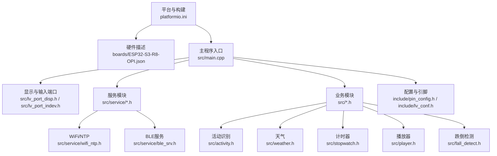
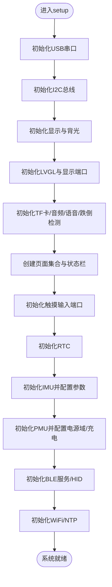
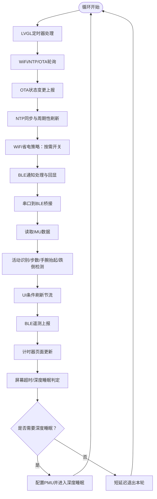
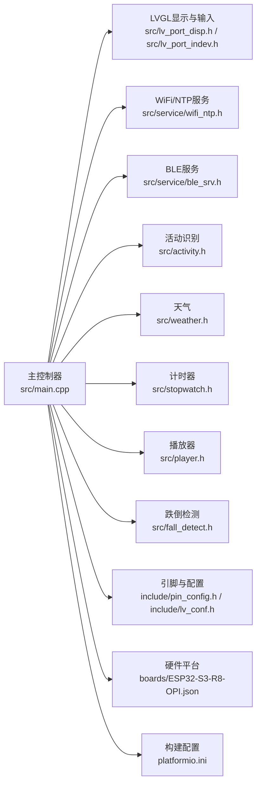

# 主控制器设计

<cite>
**本文引用的文件**
- [src/main.cpp](file://src/main.cpp)
- [include/pin_config.h](file://include/pin_config.h)
- [include/lv_conf.h](file://include/lv_conf.h)
- [platformio.ini](file://platformio.ini)
- [src/lv_port_disp.h](file://src/lv_port_disp.h)
- [src/lv_port_indev.h](file://src/lv_port_indev.h)
- [src/service/wifi_ntp.h](file://src/service/wifi_ntp.h)
- [src/service/ble_srv.h](file://src/service/ble_srv.h)
- [src/activity.h](file://src/activity.h)
- [src/weather.h](file://src/weather.h)
- [src/stopwatch.h](file://src/stopwatch.h)
- [src/player.h](file://src/player.h)
- [src/fall_detect.h](file://src/fall_detect.h)
- [boards/ESP32-S3-R8-OPI.json](file://boards/ESP32-S3-R8-OPI.json)
</cite>

## 目录
1. [引言](#引言)
2. [项目结构](#项目结构)
3. [核心组件](#核心组件)
4. [架构总览](#架构总览)
5. [详细组件分析](#详细组件分析)
6. [依赖关系分析](#依赖关系分析)
7. [性能考量](#性能考量)
8. [故障排查指南](#故障排查指南)
9. [结论](#结论)
10. [附录](#附录)

## 引言
本文件面向SmartBracelet主控制器（运行于ESP32-S3）的设计与实现，围绕主程序入口setup()与loop()两大阶段，系统性阐述以下主题：
- 系统初始化流程：硬件配置、外设初始化、资源分配策略
- 主循环设计：任务调度、定时器处理、事件响应与低功耗控制
- 系统状态管理：电源状态、显示状态、通信状态的协同机制
- 模块化初始化策略：显示子系统、传感器子系统、通信模块的启动顺序与依赖关系
- 代码组织结构：全局变量管理、函数分层设计、命名规范
- 错误处理与恢复：异常路径、系统重启与调试接口
- 实践建议：性能优化、功耗控制与可维护性

## 项目结构
SmartBracelet采用“功能域分层 + 外设驱动封装”的组织方式：
- 平台与构建：platformio.ini定义目标板、编译选项与库依赖；ESP32-S3硬件描述在boards目录中
- 驱动与中间件：include目录提供LVGL配置与引脚映射；src目录下按功能域划分（UI、服务、业务逻辑）
- 服务模块：网络与时间（wifi_ntp）、蓝牙服务（ble_srv）、OTA更新、音频与TF卡等
- 业务模块：活动识别（activity）、天气（weather）、计时器（stopwatch）、播放器（player）、跌倒检测（fall_detect）



图表来源
- [platformio.ini](file://platformio.ini#L1-L41)
- [boards/ESP32-S3-R8-OPI.json](file://boards/ESP32-S3-R8-OPI.json#L1-L40)
- [src/main.cpp](file://src/main.cpp#L1-L200)
- [src/lv_port_disp.h](file://src/lv_port_disp.h#L1-L11)
- [src/lv_port_indev.h](file://src/lv_port_indev.h#L1-L11)
- [src/service/wifi_ntp.h](file://src/service/wifi_ntp.h#L1-L26)
- [src/service/ble_srv.h](file://src/service/ble_srv.h#L1-L50)
- [src/activity.h](file://src/activity.h#L1-L13)
- [src/weather.h](file://src/weather.h#L1-L7)
- [src/stopwatch.h](file://src/stopwatch.h#L1-L6)
- [src/player.h](file://src/player.h#L1-L6)
- [src/fall_detect.h](file://src/fall_detect.h#L1-L32)
- [include/pin_config.h](file://include/pin_config.h#L1-L41)
- [include/lv_conf.h](file://include/lv_conf.h#L1-L114)

章节来源
- [platformio.ini](file://platformio.ini#L1-L41)
- [boards/ESP32-S3-R8-OPI.json](file://boards/ESP32-S3-R8-OPI.json#L1-L40)

## 核心组件
- 主控制器：负责系统初始化、主循环调度、状态机与事件处理
- 显示与输入：基于LVGL的显示端口与触摸输入端口
- 传感器子系统：RTC（PCF85063）与IMU（QMI8658），提供时间、运动与步数数据
- 电源管理：PMU（AXP2101）提供电源域控制、充电管理与电量估算
- 通信服务：WiFi/NTP用于时间同步与天气拉取；BLE用于设备连接、通知与OTA
- 业务模块：活动识别、天气、计时器、播放器、语音聊天、跌倒检测

章节来源
- [src/main.cpp](file://src/main.cpp#L1-L200)
- [include/pin_config.h](file://include/pin_config.h#L1-L41)
- [include/lv_conf.h](file://include/lv_conf.h#L1-L114)
- [src/lv_port_disp.h](file://src/lv_port_disp.h#L1-L11)
- [src/lv_port_indev.h](file://src/lv_port_indev.h#L1-L11)
- [src/service/wifi_ntp.h](file://src/service/wifi_ntp.h#L1-L26)
- [src/service/ble_srv.h](file://src/service/ble_srv.h#L1-L50)
- [src/activity.h](file://src/activity.h#L1-L13)
- [src/weather.h](file://src/weather.h#L1-L7)
- [src/stopwatch.h](file://src/stopwatch.h#L1-L6)
- [src/player.h](file://src/player.h#L1-L6)
- [src/fall_detect.h](file://src/fall_detect.h#L1-L32)

## 架构总览
主控制器以“setup()初始化 + loop()主循环”为核心，采用“事件驱动 + 周期性更新”的混合模式：
- 初始化阶段：串口、I2C、显示与触摸、LVGL、存储与音频、语音与跌倒检测、传感器、PMU、BLE与WiFi/NTP
- 运行阶段：每轮循环处理LVGL定时器、WiFi/NTP、OTA、BLE通知、串口到BLE桥接、IMU数据、步数与手腕抬起检测、屏幕超时与深度睡眠、手势导航

```mermaid
sequenceDiagram
participant Boot as "系统启动"
participant Setup as "setup()"
participant Loop as "loop()"
participant Disp as "显示/输入端口"
participant Srv as "服务模块"
participant HW as "硬件子系统"
Boot->>Setup : 调用初始化
Setup->>HW : 初始化串口/I2C/显示/触摸/LVGL
Setup->>Srv : 初始化存储/音频/语音/跌倒检测
Setup->>HW : 初始化传感器/PMU
Setup->>Srv : 初始化BLE/WiFi/NTP
Setup-->>Boot : 就绪
loop 每次循环
Loop->>Disp : LVGL定时器处理
Loop->>Srv : WiFi/NTP轮询/OTA轮询
Loop->>HW : IMU数据读取与特征提取
Loop->>Loop : 步数/手腕抬起/跌倒检测
Loop->>Disp : 条件刷新UI节流
Loop->>Srv : 推送BLE遥测/通知
Loop->>Loop : 屏幕超时/深度睡眠判定
end
```

图表来源
- [src/main.cpp](file://src/main.cpp#L615-L722)
- [src/main.cpp](file://src/main.cpp#L724-L926)
- [src/lv_port_disp.h](file://src/lv_port_disp.h#L1-L11)
- [src/lv_port_indev.h](file://src/lv_port_indev.h#L1-L11)
- [src/service/wifi_ntp.h](file://src/service/wifi_ntp.h#L1-L26)
- [src/service/ble_srv.h](file://src/service/ble_srv.h#L1-L50)

## 详细组件分析

### 系统初始化流程（setup）
- 串口与时间戳：初始化USB串口并打印固件版本信息
- I2C总线：初始化SCL/SDA引脚
- 显示与背光：配置LCD_BL为输出并点亮；实例化SPI总线与ST7789显示驱动；清理由面板高度差异导致的物理无效区域；初始化LVGL与显示端口；初始化TF卡、音频、语音、跌倒检测、页面集合与触摸输入端口
- 传感器与PMU：初始化RTC与IMU（加速度计/陀螺仪），配置滤波与采样率；初始化PMU，关闭非必要电源域，设置DC/ALDO电压与充电参数，开启ADC测量与电池监测
- 通信服务：初始化BLE服务与HID服务，初始化WiFi/NTP



图表来源
- [src/main.cpp](file://src/main.cpp#L615-L722)
- [include/pin_config.h](file://include/pin_config.h#L1-L41)

章节来源
- [src/main.cpp](file://src/main.cpp#L615-L722)
- [include/pin_config.h](file://include/pin_config.h#L1-L41)

### 主循环设计（loop）
- 定时器与服务轮询：调用LVGL定时器处理；WiFi/NTP轮询；OTA轮询
- OTA状态上报：周期性向BLE服务上报OTA状态与进度
- 时间同步与WiFi省电：在WiFi连接后进行NTP同步；同步完成后短暂开启WiFi以拉取天气，随后关闭；每隔固定周期重新开启以维持更新
- 通知处理：当收到BLE通知时，支持勿扰模式、回显确认消息
- 串口到BLE桥接：缓冲串口输入，支持UTF-8中文与命令（如OTA）
- IMU数据处理：读取加速度与角速度，推入活动识别队列，更新步数、手腕抬起检测与跌倒检测
- UI更新节流：根据屏幕开关状态调整刷新周期；仅在屏幕开启时刷新所有页面；屏幕关闭时仅保持时间显示
- 遥测上报：周期性向BLE上报活动状态、步数、电池原始电压或USB供电标记、IMU特征（避免频繁上报）
- 计时器与页面：当前页为计时器时，保持亚秒级更新
- 屏幕超时与深度睡眠：屏幕开启超时则关闭背光；长时间无活动且未插电时进入深度睡眠，唤醒条件为定时器或触摸中断



图表来源
- [src/main.cpp](file://src/main.cpp#L724-L926)

章节来源
- [src/main.cpp](file://src/main.cpp#L724-L926)

### 系统状态管理
- 电源状态：PMU负责电源域与充电管理；屏幕关闭时降低刷新频率；USB接入时避免深度睡眠
- 显示状态：屏幕超时自动关闭背光；唤醒通过触摸或手势；页面切换时动画过渡
- 通信状态：BLE连接状态影响通知显示与遥测；WiFi按需开启以平衡功耗与功能

章节来源
- [src/main.cpp](file://src/main.cpp#L876-L898)
- [src/service/ble_srv.h](file://src/service/ble_srv.h#L1-L50)
- [src/service/wifi_ntp.h](file://src/service/wifi_ntp.h#L1-L26)

### 模块化初始化策略
- 显示与输入：先完成显示驱动与LVGL初始化，再创建页面与状态栏；触摸在LVGL输入端口初始化之后启用
- 传感器：IMU与PMU在显示与UI之后初始化，确保系统可用后再采集数据
- 通信：BLE与WiFi/NTP最后初始化，以便UI与服务模块在系统就绪后即可使用
- 存储与音频：TF卡、音频、语音、跌倒检测在显示与触摸之后初始化，保证UI交互与媒体能力可用

章节来源
- [src/main.cpp](file://src/main.cpp#L644-L722)

### 代码组织结构
- 全局变量：集中声明于main.cpp顶部，涵盖UI控件、传感器数据、系统状态与页面索引
- 函数分层：
  - 页面与UI：watchface_create、sensor_page_create、init_pages等
  - 更新与刷新：update_watchface、update_sensor_page、update_analog_watchface、update_notif_page等
  - 业务算法：update_step_count、update_wrist_detect、fall_detect_update等
  - 系统控制：set_backlight、reset_activity_timer、handle_gesture等
- 命名规范：模块前缀（如wifi_、ble_、pmu_）、函数语义化（如update_*、handle_*、init_*）、常量全大写（如STEP_LOCK_MS）

章节来源
- [src/main.cpp](file://src/main.cpp#L1-L500)

### 错误处理机制与系统恢复
- 显示初始化失败：若显示驱动初始化失败，进入死循环等待，便于上电观察
- 电量检测：对ADC噪声进行范围校验，避免错误显示；USB接入时以特殊标识提示
- WiFi省电：在OTA写入期间避免关闭WiFi，防止中断；周期性重开以维持服务
- 深度睡眠：进入睡眠前禁用非必要电源域与中断，设置定时器与外部唤醒源
- 调试接口：USB串口输出关键状态与日志，便于问题定位

章节来源
- [src/main.cpp](file://src/main.cpp#L629-L630)
- [src/main.cpp](file://src/main.cpp#L430-L446)
- [src/main.cpp](file://src/main.cpp#L748-L764)
- [src/main.cpp](file://src/main.cpp#L881-L898)

## 依赖关系分析
- 组件耦合：主控制器对各模块采用“弱耦合接口”，通过头文件声明的API进行交互
- 外设依赖：显示与触摸依赖LVGL与Arduino_GFX；传感器依赖Wire总线；PMU通过寄存器接口访问
- 编译与运行：platformio.ini指定目标板、框架、监控与上传参数；include/lv_conf.h定制LVGL内存与渲染参数



图表来源
- [src/main.cpp](file://src/main.cpp#L1-L200)
- [src/lv_port_disp.h](file://src/lv_port_disp.h#L1-L11)
- [src/lv_port_indev.h](file://src/lv_port_indev.h#L1-L11)
- [src/service/wifi_ntp.h](file://src/service/wifi_ntp.h#L1-L26)
- [src/service/ble_srv.h](file://src/service/ble_srv.h#L1-L50)
- [src/activity.h](file://src/activity.h#L1-L13)
- [src/weather.h](file://src/weather.h#L1-L7)
- [src/stopwatch.h](file://src/stopwatch.h#L1-L6)
- [src/player.h](file://src/player.h#L1-L6)
- [src/fall_detect.h](file://src/fall_detect.h#L1-L32)
- [include/pin_config.h](file://include/pin_config.h#L1-L41)
- [include/lv_conf.h](file://include/lv_conf.h#L1-L114)
- [boards/ESP32-S3-R8-OPI.json](file://boards/ESP32-S3-R8-OPI.json#L1-L40)
- [platformio.ini](file://platformio.ini#L1-L41)

章节来源
- [src/main.cpp](file://src/main.cpp#L1-L200)
- [platformio.ini](file://platformio.ini#L1-L41)
- [include/lv_conf.h](file://include/lv_conf.h#L1-L114)

## 性能考量
- 刷新节流：屏幕关闭时延长刷新周期，显著降低功耗
- WiFi省电：仅在必要时开启WiFi，减少射频功耗
- LVGL配置：定制内存大小与渲染参数，适配240×284分辨率与16位色深
- IMU处理：在loop中按需读取与处理，避免阻塞主循环
- OTA状态上报：在下载与写入阶段持续上报进度，提升用户体验

## 故障排查指南
- 显示异常：检查显示驱动初始化与背光引脚；确认面板物理无效区域清除逻辑
- 串口无输出：确认USB串口初始化与超时等待逻辑；检查端口与波特率
- WiFi无法连接：核对SSID/密码配置；检查WiFi省电策略是否过早关闭射频
- 电量显示异常：检查PMU寄存器读取与范围校验；区分USB供电与电池供电状态
- 深度睡眠不生效：确认PMU电源域关闭与中断唤醒配置；检查USB接入时的睡眠保护逻辑

章节来源
- [src/main.cpp](file://src/main.cpp#L629-L630)
- [src/main.cpp](file://src/main.cpp#L620-L623)
- [src/main.cpp](file://src/main.cpp#L748-L764)
- [src/main.cpp](file://src/main.cpp#L430-L446)
- [src/main.cpp](file://src/main.cpp#L881-L898)

## 结论
SmartBracelet主控制器以清晰的初始化流程与稳健的主循环设计为基础，结合显示、传感器、电源与通信模块的模块化组织，实现了在ESP32-S3平台上对多任务与低功耗的平衡。通过节流刷新、WiFi省电、深度睡眠与完善的错误处理，系统在保证交互体验的同时有效降低了能耗。建议在后续迭代中进一步细化状态机与事件日志，增强可维护性与可测试性。

## 附录
- 关键宏与常量：屏幕尺寸、背光引脚、I2C引脚、WiFi凭证、NTP服务器与时区偏移、屏幕超时与深度睡眠阈值、步数算法参数等
- 构建与烧录：platformio.ini定义了目标环境、编译标志与上传端口；boards/ESP32-S3-R8-OPI.json提供了硬件特性与内存布局

章节来源
- [include/pin_config.h](file://include/pin_config.h#L1-L41)
- [platformio.ini](file://platformio.ini#L1-L41)
- [boards/ESP32-S3-R8-OPI.json](file://boards/ESP32-S3-R8-OPI.json#L1-L40)