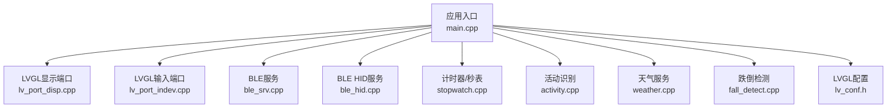
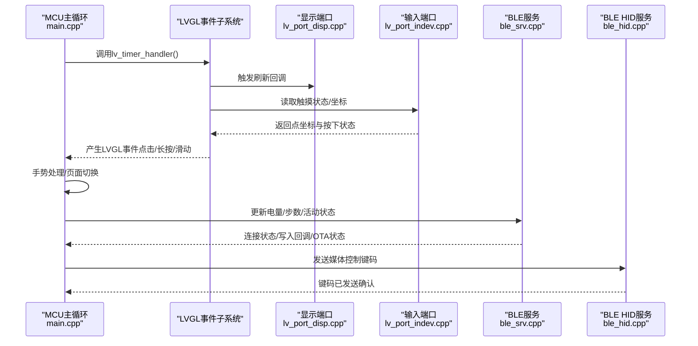
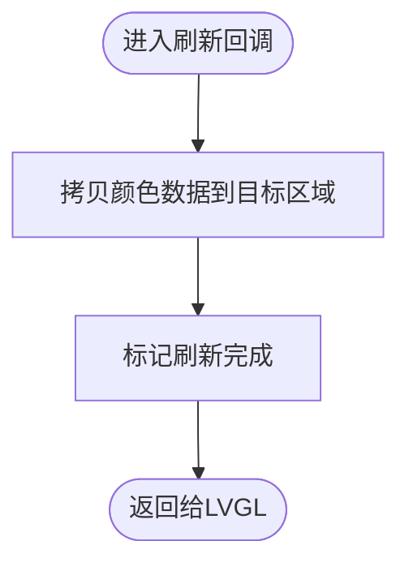
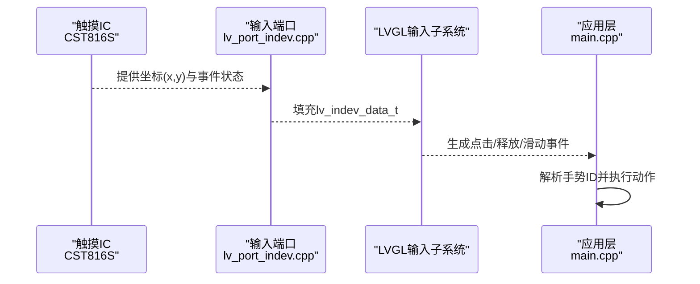
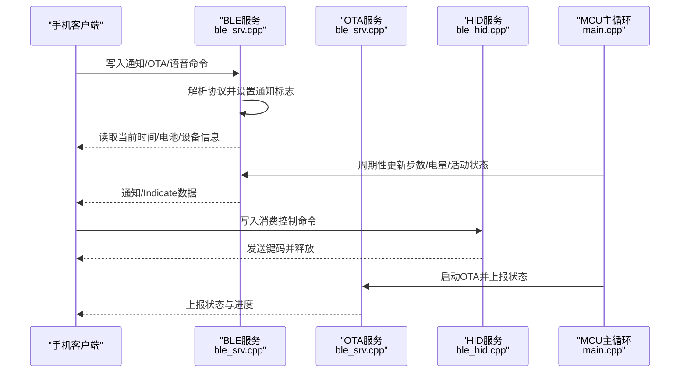
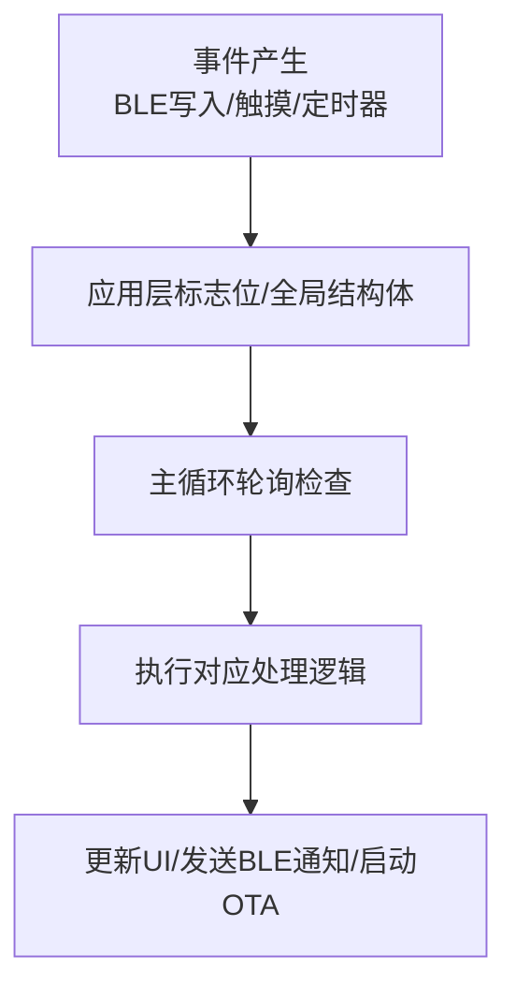
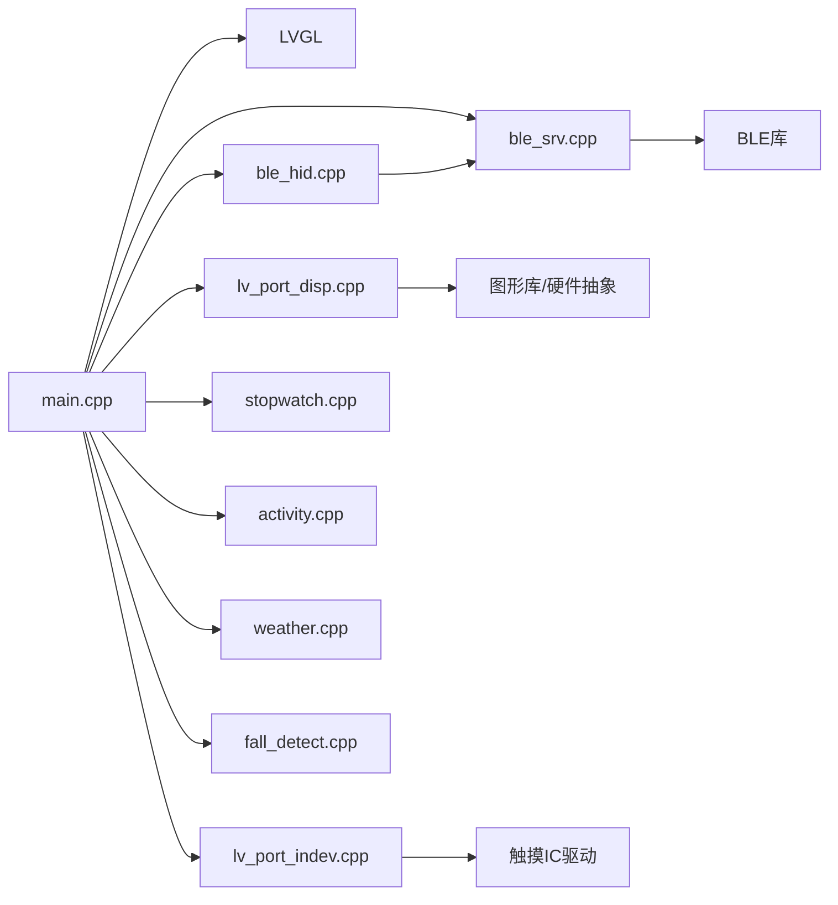

# 事件驱动架构

<cite>
**本文引用的文件**
- [main.cpp](file://src/main.cpp)
- [lv_port_indev.cpp](file://src/lv_port_indev.cpp)
- [lv_port_indev.h](file://src/lv_port_indev.h)
- [lv_port_disp.cpp](file://src/lv_port_disp.cpp)
- [lv_conf.h](file://include/lv_conf.h)
- [ble_srv.cpp](file://src/service/ble_srv.cpp)
- [ble_srv.h](file://src/service/ble_srv.h)
- [ble_hid.cpp](file://src/service/ble_hid.cpp)
- [ble_hid.h](file://src/service/ble_hid.h)
- [stopwatch.cpp](file://src/stopwatch.cpp)
- [stopwatch.h](file://src/stopwatch.h)
- [activity.cpp](file://src/activity.cpp)
- [weather.cpp](file://src/weather.cpp)
- [fall_detect.cpp](file://src/fall_detect.cpp)
- [platformio.ini](file://platformio.ini)
</cite>

## 目录
1. [引言](#引言)
2. [项目结构](#项目结构)
3. [核心组件](#核心组件)
4. [架构总览](#架构总览)
5. [详细组件分析](#详细组件分析)
6. [依赖关系分析](#依赖关系分析)
7. [性能考虑](#性能考虑)
8. [故障排查指南](#故障排查指南)
9. [结论](#结论)
10. [附录](#附录)

## 引言
本文件面向SmartBracelet的事件驱动架构，系统性阐述其在嵌入式设备中的实现方式与工程实践。重点覆盖以下方面：
- 定时器机制：LVGL自定义tick与主循环调度、UI刷新周期与传感器采样节奏
- 中断处理：触摸中断唤醒与深度睡眠、按键/手势事件的中断参与
- 异步事件管理：BLE连接状态变化、数据收发、通知下发与OTA状态上报
- LVGL定时器系统：注册、回调执行与优先级管理
- 触摸事件处理：检测、坐标获取、手势识别与事件传播
- BLE通信事件：连接状态变化、数据接收、通知发送与错误处理
- 系统事件队列设计：事件类型定义、消息传递与线程安全
- 性能优化策略：事件批处理、延迟处理与资源竞争避免
- 调试方法与性能分析工具使用

## 项目结构
SmartBracelet采用“主循环 + LVGL事件子系统 + 外设服务”的分层组织：
- 应用入口与主循环位于应用层，负责系统初始化、周期性任务调度与事件分发
- LVGL显示与输入端口封装了底层图形与输入驱动，提供统一的事件源
- 服务层封装BLE、Wi-Fi、OTA等异步功能，通过回调与标志位与主循环交互
- 功能页面与算法模块（计步、活动识别、天气、跌倒检测）作为事件消费者

图表来源
- [main.cpp](file://src/main.cpp#L615-L722)
- [lv_port_disp.cpp](file://src/lv_port_disp.cpp#L22-L32)
- [lv_port_indev.cpp](file://src/lv_port_indev.cpp#L21-L27)
- [ble_srv.cpp](file://src/service/ble_srv.cpp#L250-L285)
- [ble_hid.cpp](file://src/service/ble_hid.cpp#L67-L111)
- [stopwatch.cpp](file://src/stopwatch.cpp#L119-L189)
- [activity.cpp](file://src/activity.cpp#L78-L129)
- [weather.cpp](file://src/weather.cpp#L81-L146)
- [fall_detect.cpp](file://src/fall_detect.cpp#L24-L47)
- [lv_conf.h](file://include/lv_conf.h#L28-L34)

章节来源
- [main.cpp](file://src/main.cpp#L615-L722)
- [lv_conf.h](file://include/lv_conf.h#L28-L34)

## 核心组件
- 主循环与调度：每轮循环调用LVGL定时器处理器、Wi-Fi/NTP轮询、OTA轮询，并处理BLE通知与串口到BLE转发
- LVGL显示与输入端口：注册显示缓冲区与刷新回调；注册指针型输入设备驱动，从触摸IC读取坐标与状态
- BLE服务：设备信息、电池、当前时间、通知、数据、OTA等多服务；连接回调、写入回调解析协议
- BLE HID：消费控制服务，向手机发送媒体控制键码
- 计时器/秒表：基于毫秒计时的状态机，支持计时器与秒表模式切换
- 活动识别：滑动窗口特征提取与分类器预测
- 天气服务：周期性拉取天气数据并更新UI
- 跌倒检测：基于加速度阈值与状态机的跌倒判定

章节来源
- [main.cpp](file://src/main.cpp#L724-L925)
- [lv_port_disp.cpp](file://src/lv_port_disp.cpp#L22-L32)
- [lv_port_indev.cpp](file://src/lv_port_indev.cpp#L21-L27)
- [ble_srv.cpp](file://src/service/ble_srv.cpp#L250-L413)
- [ble_hid.cpp](file://src/service/ble_hid.cpp#L67-L141)
- [stopwatch.cpp](file://src/stopwatch.cpp#L119-L189)
- [activity.cpp](file://src/activity.cpp#L78-L129)
- [weather.cpp](file://src/weather.cpp#L81-L146)
- [fall_detect.cpp](file://src/fall_detect.cpp#L24-L147)

## 架构总览
SmartBracelet的事件驱动以“主循环 + LVGL事件子系统”为核心，外设与服务通过回调、标志位与共享状态进行解耦协作。

图表来源
- [main.cpp](file://src/main.cpp#L724-L725)
- [lv_port_disp.cpp](file://src/lv_port_disp.cpp#L11-L20)
- [lv_port_indev.cpp](file://src/lv_port_indev.cpp#L6-L19)
- [ble_srv.cpp](file://src/service/ble_srv.cpp#L49-L61)
- [ble_hid.cpp](file://src/service/ble_hid.cpp#L51-L65)

## 详细组件分析

### LVGL定时器系统与显示刷新
- 自定义tick：通过配置启用自定义tick，使用millis()作为系统时间源，刷新周期由配置决定
- 显示缓冲：双缓冲/单缓冲策略结合屏幕分辨率，减少撕裂与提升帧率
- 刷新回调：在回调中将LVGL绘制的像素块直接写入物理屏，完成后标记就绪

图表来源
- [lv_port_disp.cpp](file://src/lv_port_disp.cpp#L11-L20)
- [lv_conf.h](file://include/lv_conf.h#L28-L34)

章节来源
- [lv_conf.h](file://include/lv_conf.h#L28-L34)
- [lv_port_disp.cpp](file://src/lv_port_disp.cpp#L22-L32)

### 触摸事件处理流程
- 输入驱动：注册指针型输入设备，从触摸IC读取坐标与事件状态
- LVGL集成：LVGL输入驱动将触摸状态转换为指针事件
- 应用层处理：主循环中读取手势ID，触发页面切换或重置活动计时

图表来源
- [lv_port_indev.cpp](file://src/lv_port_indev.cpp#L6-L19)
- [lv_port_indev.h](file://src/lv_port_indev.h#L4-L6)
- [main.cpp](file://src/main.cpp#L900-L922)

章节来源
- [lv_port_indev.cpp](file://src/lv_port_indev.cpp#L21-L27)
- [lv_port_indev.h](file://src/lv_port_indev.h#L4-L6)
- [main.cpp](file://src/main.cpp#L900-L922)

### BLE通信事件处理
- 服务初始化：创建多个服务与特性，设置通知描述符与MTU
- 连接回调：连接/断开事件自动重启广播
- 写入回调：解析通知格式、OTA命令、DND开关与语音命令
- 数据服务：步数、原始电量、活动状态、IMU特征等
- OTA服务：状态特性用于上报下载/写入进度
- HID服务：消费控制键码，实现播放/暂停、上一首/下一首、音量调节

图表来源
- [ble_srv.cpp](file://src/service/ble_srv.cpp#L49-L123)
- [ble_srv.cpp](file://src/service/ble_srv.cpp#L250-L413)
- [ble_hid.cpp](file://src/service/ble_hid.cpp#L67-L141)
- [main.cpp](file://src/main.cpp#L724-L741)

章节来源
- [ble_srv.cpp](file://src/service/ble_srv.cpp#L250-L413)
- [ble_srv.h](file://src/service/ble_srv.h#L22-L47)
- [ble_hid.cpp](file://src/service/ble_hid.cpp#L67-L141)
- [ble_hid.h](file://src/service/ble_hid.h#L9-L23)

### 系统事件队列设计
- 事件类型定义：通知事件、OTA状态事件、语音命令事件、DND开关事件
- 消息传递机制：通过全局结构体与标志位在服务与应用层之间传递
- 线程安全保证：主循环单线程顺序执行，避免互斥锁；对共享状态的访问集中在主循环内

图表来源
- [ble_srv.cpp](file://src/service/ble_srv.cpp#L94-L122)
- [main.cpp](file://src/main.cpp#L766-L780)
- [main.cpp](file://src/main.cpp#L724-L741)

章节来源
- [ble_srv.h](file://src/service/ble_srv.h#L22-L47)
- [main.cpp](file://src/main.cpp#L766-L780)

### 性能优化策略
- 事件批处理：主循环集中处理各类事件，减少频繁上下文切换
- 延迟处理：UI刷新周期固定，传感器与网络请求按需调度，避免阻塞
- 资源竞争避免：仅在主循环访问共享状态；BLE与OTA状态通过原子性更新与通知机制保证一致性
- 低功耗策略：Wi-Fi周期性开关、深度睡眠与中断唤醒

章节来源
- [main.cpp](file://src/main.cpp#L748-L764)
- [main.cpp](file://src/main.cpp#L895-L897)
- [platformio.ini](file://platformio.ini#L25-L36)

### 调试方法与性能分析
- 日志输出：USB串口打印BLE事件、OTA状态、PMU寄存器读数等
- LVGL性能监控：可选启用性能/内存监控宏（默认关闭）
- 断点与观察：在主循环关键节点设置断点，观察事件处理时序

章节来源
- [main.cpp](file://src/main.cpp#L620-L625)
- [main.cpp](file://src/main.cpp#L717-L721)
- [lv_conf.h](file://include/lv_conf.h#L96-L99)

## 依赖关系分析
- 主循环依赖LVGL事件子系统进行UI与输入处理
- 显示端口依赖图形库与硬件抽象层
- 输入端口依赖触摸IC驱动
- BLE服务依赖蓝牙库与特性定义
- HID服务依赖BLE服务实例
- 页面与算法模块依赖LVGL与传感器数据

图表来源
- [main.cpp](file://src/main.cpp#L1-L28)
- [lv_port_disp.cpp](file://src/lv_port_disp.cpp#L1-L9)
- [lv_port_indev.cpp](file://src/lv_port_indev.cpp#L1-L6)
- [ble_srv.cpp](file://src/service/ble_srv.cpp#L1-L8)
- [ble_hid.cpp](file://src/service/ble_hid.cpp#L1-L9)
- [stopwatch.cpp](file://src/stopwatch.cpp#L1-L3)
- [activity.cpp](file://src/activity.cpp#L1-L5)
- [weather.cpp](file://src/weather.cpp#L1-L7)
- [fall_detect.cpp](file://src/fall_detect.cpp#L1-L6)

章节来源
- [main.cpp](file://src/main.cpp#L1-L28)
- [platformio.ini](file://platformio.ini#L37-L41)

## 性能考虑
- LVGL刷新周期：通过配置项控制刷新间隔，平衡流畅度与功耗
- 传感器采样与滤波：在主循环中进行低通/高通滤波与特征提取，避免占用过多CPU
- BLE MTU与通知频率：合理设置MTU与通知间隔，降低功耗与提高吞吐
- Wi-Fi电源管理：周期性开启/关闭，减少待机功耗
- 深度睡眠与中断唤醒：在无活动时进入深度睡眠，触摸中断唤醒

章节来源
- [lv_conf.h](file://include/lv_conf.h#L28-L34)
- [main.cpp](file://src/main.cpp#L895-L897)
- [main.cpp](file://src/main.cpp#L748-L764)

## 故障排查指南
- BLE无法连接：检查广告参数、加密级别与连接数限制
- 通知不显示：确认通知特性写入格式、DND状态与连接状态
- OTA失败：检查URL合法性、网络连通性与状态上报
- 触摸无响应：确认触摸IC初始化、中断引脚与输入驱动注册
- UI卡顿：检查刷新回调耗时、内存分配与LVGL配置

章节来源
- [ble_srv.cpp](file://src/service/ble_srv.cpp#L250-L285)
- [ble_srv.cpp](file://src/service/ble_srv.cpp#L94-L122)
- [main.cpp](file://src/main.cpp#L792-L798)
- [lv_port_indev.cpp](file://src/lv_port_indev.cpp#L21-L27)
- [lv_conf.h](file://include/lv_conf.h#L21-L24)

## 结论
SmartBracelet通过主循环与LVGL事件子系统的协同，实现了稳定的事件驱动架构。触摸、BLE、传感器与UI在统一的调度框架下高效运行，同时通过合理的配置与优化策略，在资源受限的嵌入式平台上实现了良好的性能与功耗表现。建议在后续迭代中进一步完善事件队列的结构化设计与并发安全机制，以支撑更复杂的业务场景。

## 附录
- 关键宏与配置：LVGL自定义tick、刷新周期、内存与字体配置
- 平台构建选项：编译优化等级、BLE相关宏定义与库依赖

章节来源
- [lv_conf.h](file://include/lv_conf.h#L1-L114)
- [platformio.ini](file://platformio.ini#L25-L41)