# 软件架构

<cite>
**本文引用的文件**
- [src/main.cpp](file://src/main.cpp)
- [include/lv_conf.h](file://include/lv_conf.h)
- [include/pin_config.h](file://include/pin_config.h)
- [src/lv_port_disp.cpp](file://src/lv_port_disp.cpp)
- [src/lv_port_indev.cpp](file://src/lv_port_indev.cpp)
- [src/service/ble_srv.cpp](file://src/service/ble_srv.cpp)
- [src/service/wifi_ntp.cpp](file://src/service/wifi_ntp.cpp)
- [src/activity.cpp](file://src/activity.cpp)
- [src/weather.cpp](file://src/weather.cpp)
- [src/service/ota_update.cpp](file://src/service/ota_update.cpp)
- [src/service/audio.cpp](file://src/service/audio.cpp)
- [src/fall_detect.cpp](file://src/fall_detect.cpp)
- [src/player.cpp](file://src/player.cpp)
- [platformio.ini](file://platformio.ini)
- [boards/ESP32-S3-R8-OPI.json](file://boards/ESP32-S3-R8-OPI.json)
</cite>

## 目录
1. [引言](#引言)
2. [项目结构](#项目结构)
3. [核心组件](#核心组件)
4. [架构总览](#架构总览)
5. [详细组件分析](#详细组件分析)
6. [依赖分析](#依赖分析)
7. [性能考虑](#性能考虑)
8. [故障排查指南](#故障排查指南)
9. [结论](#结论)
10. [附录](#附录)

## 引言
本文件面向SmartBracelet项目的软件架构，系统性梳理其分层架构与模块化设计，解释主控制器的职责划分、任务调度与资源管理策略；详述LVGL图形系统的集成方案（显示驱动、输入设备、UI组件）；阐述事件驱动机制（定时器、中断、异步通信）；给出系统状态机设计（电源管理、显示页面切换、BLE通信）；并总结代码组织、命名规范与开发约定。

## 项目结构
项目采用“按功能域分层 + 模块化”的组织方式：
- 应用入口与主循环：src/main.cpp
- 图形界面：LVGL配置与端口适配（include/lv_conf.h、src/lv_port_disp.cpp、src/lv_port_indev.cpp）
- 服务层：BLE、WiFi/NTP、OTA、音频、TF卡、语音聊天等（src/service/*.cpp）
- 业务功能：活动识别、天气、播放器、跌倒检测等（src/*.cpp）
- 平台与硬件：platformio.ini、include/pin_config.h、boards/*.json

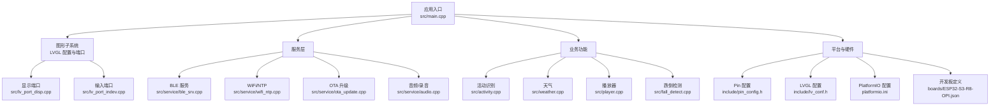

图表来源
- [src/main.cpp](file://src/main.cpp#L615-L722)
- [src/lv_port_disp.cpp](file://src/lv_port_disp.cpp#L22-L32)
- [src/lv_port_indev.cpp](file://src/lv_port_indev.cpp#L21-L27)
- [src/service/ble_srv.cpp](file://src/service/ble_srv.cpp#L250-L285)
- [src/service/wifi_ntp.cpp](file://src/service/wifi_ntp.cpp#L21-L30)
- [src/service/ota_update.cpp](file://src/service/ota_update.cpp#L18-L40)
- [src/service/audio.cpp](file://src/service/audio.cpp#L262-L282)
- [src/activity.cpp](file://src/activity.cpp#L78-L105)
- [src/weather.cpp](file://src/weather.cpp#L81-L116)
- [src/player.cpp](file://src/player.cpp#L82-L148)
- [src/fall_detect.cpp](file://src/fall_detect.cpp#L24-L28)
- [include/pin_config.h](file://include/pin_config.h#L1-L41)
- [include/lv_conf.h](file://include/lv_conf.h#L1-L114)
- [platformio.ini](file://platformio.ini#L14-L41)
- [boards/ESP32-S3-R8-OPI.json](file://boards/ESP32-S3-R8-OPI.json#L1-L40)

章节来源
- [src/main.cpp](file://src/main.cpp#L615-L722)
- [platformio.ini](file://platformio.ini#L14-L41)
- [boards/ESP32-S3-R8-OPI.json](file://boards/ESP32-S3-R8-OPI.json#L1-L40)

## 核心组件
- 主控制器与任务调度
  - setup()负责外设初始化、LVGL端口注册、服务启动与页面构建
  - loop()周期性调用LVGL定时器、WiFi/NTP、OTA循环，并处理BLE通知、串口到BLE转发、屏幕超时与背光控制
- LVGL图形系统
  - 显示端口：双缓冲、flush回调、分辨率配置
  - 输入端口：触摸读取、指针类型、状态转换
- 服务层
  - BLE服务：设备信息、电池、时间、通知、数据、OTA等多特性
  - WiFi/NTP：连接管理、自动重连、时间同步、省电策略
  - OTA升级：HTTP下载、刷写进度、校验与重启
  - 音频：ES8311编解码、I2S TX/RX、录音队列、WAV播放、音量控制
- 业务功能
  - 活动识别：滑动窗口特征提取与分类
  - 天气：Open-Meteo接口、JSON解析、UI更新
  - 播放器：TF卡扫描、文件过滤、播放控制
  - 跌倒检测：状态机与阈值算法

章节来源
- [src/main.cpp](file://src/main.cpp#L615-L722)
- [src/lv_port_disp.cpp](file://src/lv_port_disp.cpp#L11-L20)
- [src/lv_port_indev.cpp](file://src/lv_port_indev.cpp#L6-L19)
- [src/service/ble_srv.cpp](file://src/service/ble_srv.cpp#L250-L285)
- [src/service/wifi_ntp.cpp](file://src/service/wifi_ntp.cpp#L21-L30)
- [src/service/ota_update.cpp](file://src/service/ota_update.cpp#L54-L171)
- [src/service/audio.cpp](file://src/service/audio.cpp#L262-L282)
- [src/activity.cpp](file://src/activity.cpp#L78-L130)
- [src/weather.cpp](file://src/weather.cpp#L81-L147)
- [src/player.cpp](file://src/player.cpp#L82-L156)
- [src/fall_detect.cpp](file://src/fall_detect.cpp#L54-L147)

## 架构总览
SmartBracelet采用事件驱动与分层架构：
- 硬件抽象层：引脚、I2C/I2S、SPI、触摸、PMU
- 图形与输入层：LVGL + 显示/输入端口
- 服务层：BLE、WiFi/NTP、OTA、音频、TF卡
- 业务层：活动识别、天气、播放器、跌倒检测
- 应用层：主循环、页面切换、手势处理、状态机

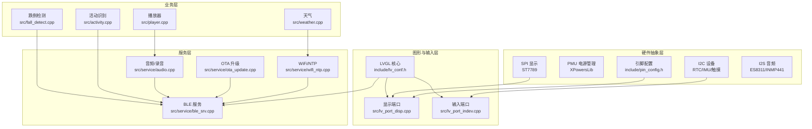

图表来源
- [include/pin_config.h](file://include/pin_config.h#L1-L41)
- [include/lv_conf.h](file://include/lv_conf.h#L1-L114)
- [src/lv_port_disp.cpp](file://src/lv_port_disp.cpp#L22-L32)
- [src/lv_port_indev.cpp](file://src/lv_port_indev.cpp#L21-L27)
- [src/service/ble_srv.cpp](file://src/service/ble_srv.cpp#L250-L285)
- [src/service/wifi_ntp.cpp](file://src/service/wifi_ntp.cpp#L21-L30)
- [src/service/ota_update.cpp](file://src/service/ota_update.cpp#L18-L40)
- [src/service/audio.cpp](file://src/service/audio.cpp#L262-L282)
- [src/activity.cpp](file://src/activity.cpp#L78-L130)
- [src/weather.cpp](file://src/weather.cpp#L81-L147)
- [src/player.cpp](file://src/player.cpp#L82-L156)
- [src/fall_detect.cpp](file://src/fall_detect.cpp#L24-L28)

## 详细组件分析

### 主控制器与任务调度
- setup()职责
  - 初始化背光、串口、I2C、SPI、显示、LVGL、TF卡、音频、语音聊天、跌倒检测、页面
  - 初始化触摸、注册LVGL输入端口
  - 初始化RTC、IMU、PMU
  - 启动BLE服务、BLE HID、WiFi/NTP
- loop()职责
  - LVGL定时器、WiFi/NTP、OTA循环
  - 同步OTA状态到BLE
  - NTP同步与周期性刷新
  - WiFi省电策略：按周期开关射频
  - 处理BLE通知、串口命令转发、OTA指令
  - 屏幕超时与手腕抬腕唤醒

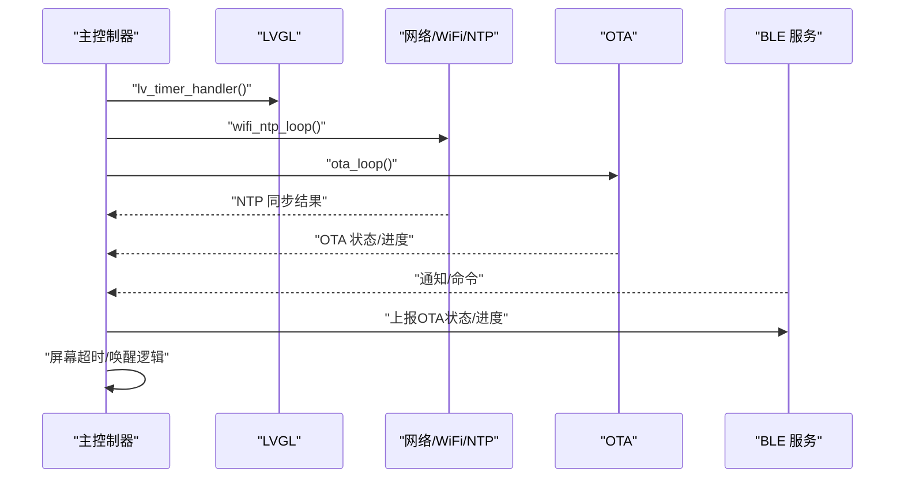

图表来源
- [src/main.cpp](file://src/main.cpp#L724-L800)
- [src/service/wifi_ntp.cpp](file://src/service/wifi_ntp.cpp#L37-L60)
- [src/service/ota_update.cpp](file://src/service/ota_update.cpp#L54-L171)
- [src/service/ble_srv.cpp](file://src/service/ble_srv.cpp#L377-L385)

章节来源
- [src/main.cpp](file://src/main.cpp#L615-L722)
- [src/main.cpp](file://src/main.cpp#L724-L800)

### LVGL图形系统集成
- 显示驱动
  - 双缓冲区配置，flush回调直接写入Arduino_GFX驱动
  - 分辨率与刷新周期在LVGL配置中设定
- 输入设备
  - 触摸读取封装为指针型输入设备，支持按下/释放状态
- UI组件
  - 时间/日期/电量/步数/传感器页/通知页/秒表/天气/活动AI/播放器/语音/音乐页
  - 页面间滑动切换，顶部状态栏图标

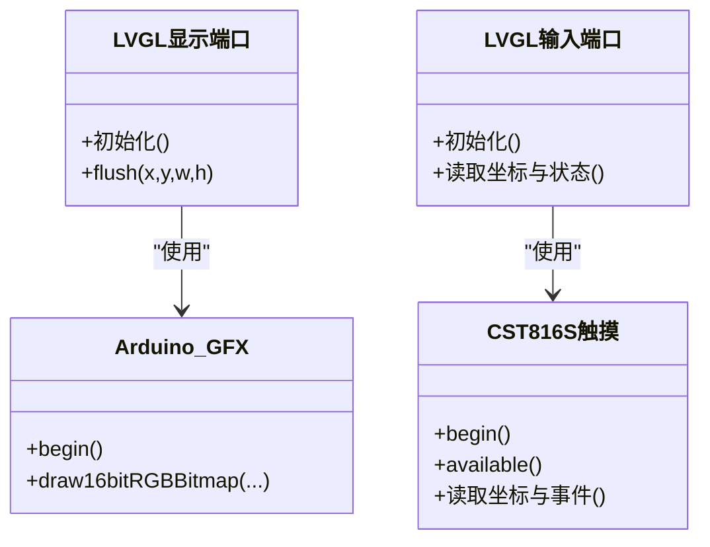

图表来源
- [src/lv_port_disp.cpp](file://src/lv_port_disp.cpp#L11-L20)
- [src/lv_port_indev.cpp](file://src/lv_port_indev.cpp#L6-L19)
- [src/main.cpp](file://src/main.cpp#L628-L630)

章节来源
- [include/lv_conf.h](file://include/lv_conf.h#L28-L34)
- [src/lv_port_disp.cpp](file://src/lv_port_disp.cpp#L5-L32)
- [src/lv_port_indev.cpp](file://src/lv_port_indev.cpp#L1-L28)
- [src/main.cpp](file://src/main.cpp#L406-L419)

### 事件驱动架构
- 定时器处理
  - LVGL tick基于millis()，默认刷新周期在LVGL配置中设置
- 中断响应
  - 触摸中断线接入，输入端口轮询可用性
- 异步通信
  - BLE服务：通知/指示、OTA状态上报、语音命令
  - WiFi：STA模式、自动重连、NTP同步
  - OTA：HTTP下载、刷写进度、错误上报
  - 音频：I2S RX队列、录音任务、WAV播放任务

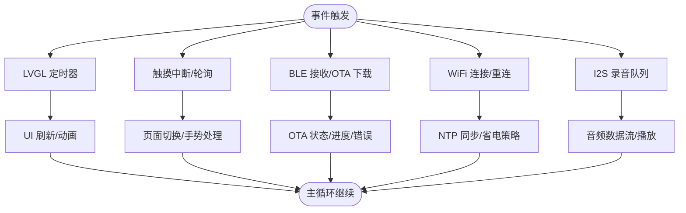

图表来源
- [include/lv_conf.h](file://include/lv_conf.h#L30-L34)
- [src/lv_port_indev.cpp](file://src/lv_port_indev.cpp#L6-L19)
- [src/service/ble_srv.cpp](file://src/service/ble_srv.cpp#L63-L123)
- [src/service/wifi_ntp.cpp](file://src/service/wifi_ntp.cpp#L37-L60)
- [src/service/ota_update.cpp](file://src/service/ota_update.cpp#L54-L171)
- [src/service/audio.cpp](file://src/service/audio.cpp#L165-L188)

章节来源
- [include/lv_conf.h](file://include/lv_conf.h#L28-L34)
- [src/lv_port_indev.cpp](file://src/lv_port_indev.cpp#L6-L19)
- [src/service/ble_srv.cpp](file://src/service/ble_srv.cpp#L63-L123)
- [src/service/wifi_ntp.cpp](file://src/service/wifi_ntp.cpp#L37-L60)
- [src/service/ota_update.cpp](file://src/service/ota_update.cpp#L54-L171)
- [src/service/audio.cpp](file://src/service/audio.cpp#L165-L188)

### 系统状态机设计
- 电源管理状态
  - PMU初始化与电源路径配置，背光控制，充电状态上报
  - WiFi射频省电：NTP同步后关闭，周期性开启用于天气/NTP
- 显示页面切换
  - 手势/按钮切换，页面动画
- BLE通信状态
  - 广告、连接、通知、OTA状态机

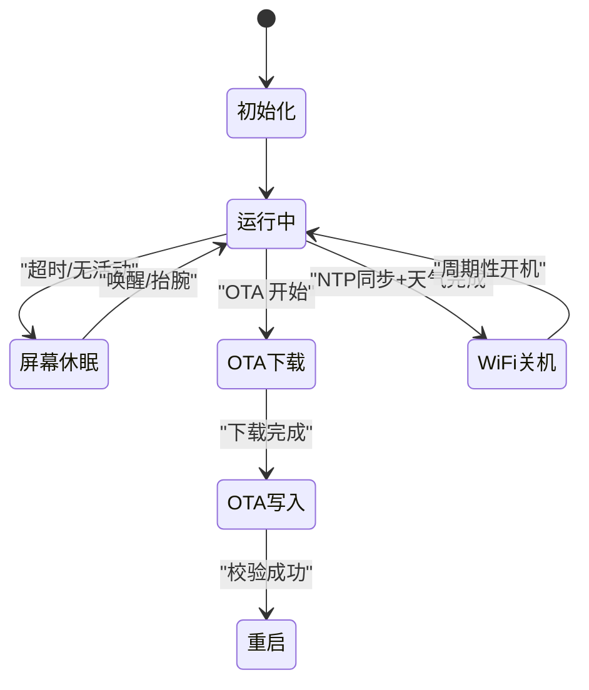

图表来源
- [src/main.cpp](file://src/main.cpp#L95-L107)
- [src/main.cpp](file://src/main.cpp#L748-L764)
- [src/service/ota_update.cpp](file://src/service/ota_update.cpp#L18-L40)
- [src/service/ota_update.cpp](file://src/service/ota_update.cpp#L155-L170)
- [src/service/wifi_ntp.cpp](file://src/service/wifi_ntp.cpp#L94-L112)

章节来源
- [src/main.cpp](file://src/main.cpp#L95-L107)
- [src/main.cpp](file://src/main.cpp#L748-L764)
- [src/service/ota_update.cpp](file://src/service/ota_update.cpp#L18-L40)
- [src/service/ota_update.cpp](file://src/service/ota_update.cpp#L155-L170)
- [src/service/wifi_ntp.cpp](file://src/service/wifi_ntp.cpp#L94-L112)

### 业务功能模块

#### 活动识别
- 特征工程：滑动窗口均值/标准差（12维），保存供BLE上传
- 预测稳定：连续多数次一致才更新显示

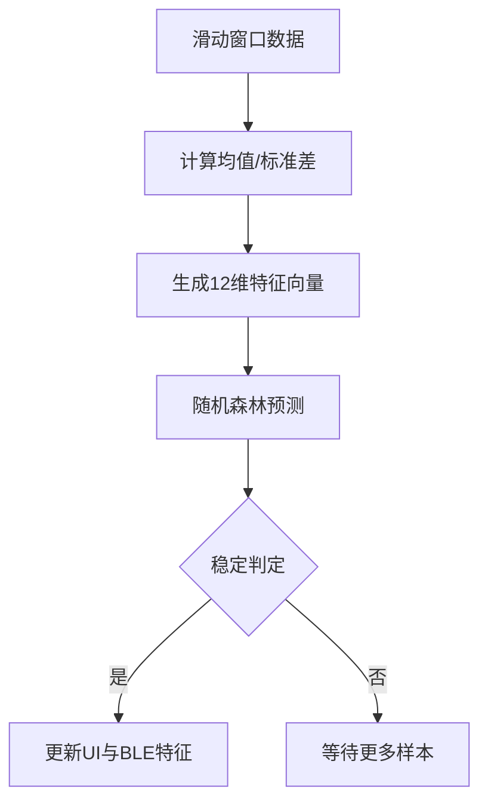

图表来源
- [src/activity.cpp](file://src/activity.cpp#L42-L76)
- [src/activity.cpp](file://src/activity.cpp#L107-L130)

章节来源
- [src/activity.cpp](file://src/activity.cpp#L78-L130)

#### 天气
- 周期性拉取Open-Meteo天气，解析JSON，更新UI与状态

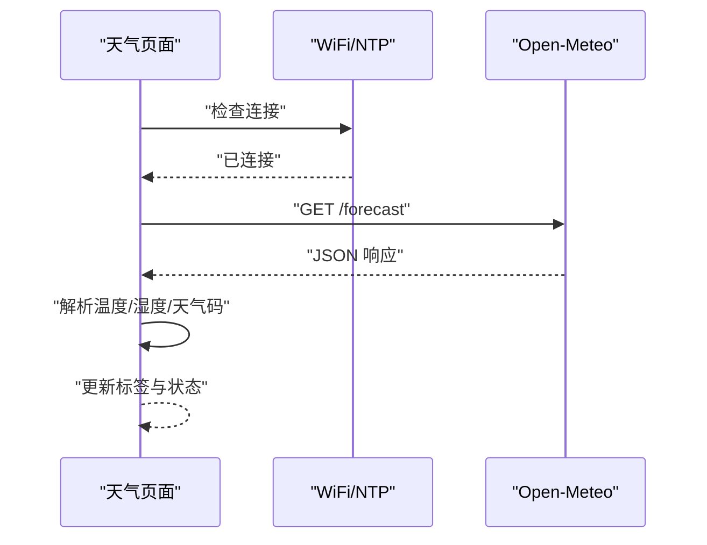

图表来源
- [src/weather.cpp](file://src/weather.cpp#L39-L79)
- [src/weather.cpp](file://src/weather.cpp#L118-L146)

章节来源
- [src/weather.cpp](file://src/weather.cpp#L81-L147)

#### 播放器
- TF卡扫描WAV文件，选择播放，播放中状态更新

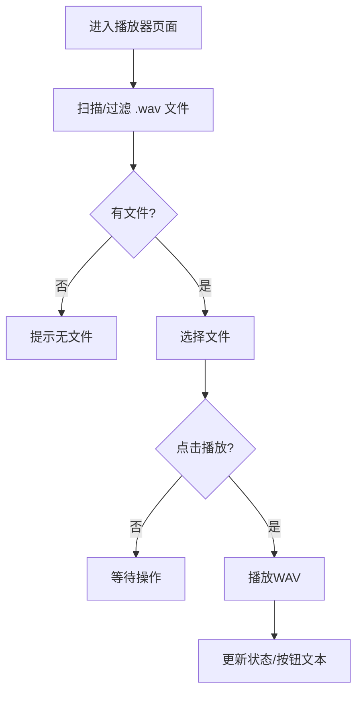

图表来源
- [src/player.cpp](file://src/player.cpp#L20-L33)
- [src/player.cpp](file://src/player.cpp#L47-L68)
- [src/player.cpp](file://src/player.cpp#L150-L156)

章节来源
- [src/player.cpp](file://src/player.cpp#L82-L156)

#### 跌倒检测
- 状态机：监控→自由落体→冲击→静止→确认→告警发送→恢复

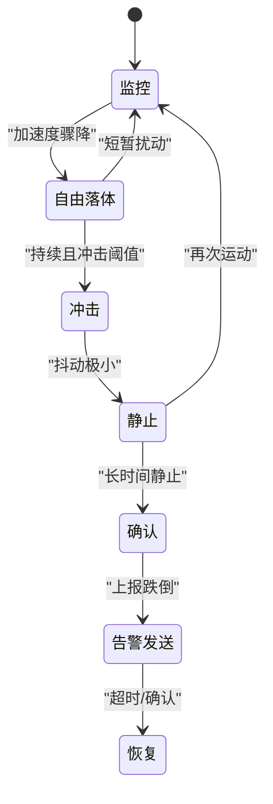

图表来源
- [src/fall_detect.cpp](file://src/fall_detect.cpp#L68-L146)

章节来源
- [src/fall_detect.cpp](file://src/fall_detect.cpp#L24-L28)
- [src/fall_detect.cpp](file://src/fall_detect.cpp#L54-L147)

## 依赖分析
- 组件耦合
  - 主控制器耦合LVGL、服务层与业务层；服务层之间通过回调/共享状态交互
  - 图形层与硬件层通过Arduino_GFX与Arduino_DataBus解耦
- 外部依赖
  - LVGL、ArduinoJson、CST816S、ESP-IDF I2S、BLE库
- 平台配置
  - ESP32-S3、QIO闪存、PSRAM、分区表

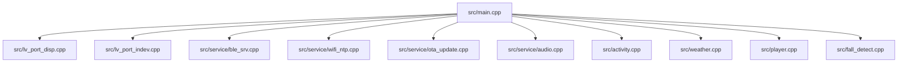

图表来源
- [src/main.cpp](file://src/main.cpp#L1-L28)
- [src/service/ble_srv.cpp](file://src/service/ble_srv.cpp#L1-L10)
- [src/service/wifi_ntp.cpp](file://src/service/wifi_ntp.cpp#L1-L8)
- [src/service/ota_update.cpp](file://src/service/ota_update.cpp#L1-L12)
- [src/service/audio.cpp](file://src/service/audio.cpp#L1-L12)
- [src/activity.cpp](file://src/activity.cpp#L1-L6)
- [src/weather.cpp](file://src/weather.cpp#L1-L8)
- [src/player.cpp](file://src/player.cpp#L1-L6)
- [src/fall_detect.cpp](file://src/fall_detect.cpp#L1-L6)

章节来源
- [platformio.ini](file://platformio.ini#L37-L41)
- [boards/ESP32-S3-R8-OPI.json](file://boards/ESP32-S3-R8-OPI.json#L1-L40)

## 性能考虑
- LVGL内存与刷新
  - 双缓冲大小与刷新周期在配置中平衡流畅度与内存占用
- WiFi省电
  - 同步与天气获取后关闭射频，周期性开启以降低功耗
- OTA下载
  - 分块下载与进度上报，失败回退与错误信息记录
- 音频
  - I2S DMA缓冲与队列避免阻塞，录音任务分离

章节来源
- [include/lv_conf.h](file://include/lv_conf.h#L21-L24)
- [include/lv_conf.h](file://include/lv_conf.h#L28-L34)
- [src/main.cpp](file://src/main.cpp#L88-L107)
- [src/service/wifi_ntp.cpp](file://src/service/wifi_ntp.cpp#L94-L112)
- [src/service/ota_update.cpp](file://src/service/ota_update.cpp#L109-L151)
- [src/service/audio.cpp](file://src/service/audio.cpp#L165-L188)

## 故障排查指南
- BLE无法连接/无广告
  - 检查服务初始化与广告参数
- WiFi无法连接/频繁断开
  - 查看重连日志与RSSI
- OTA失败
  - 检查URL可达性、固件大小、空间与校验错误
- 音频无声/杂音
  - 检查ES8311寄存器、I2S引脚、音量设置
- 画面撕裂/卡顿
  - 调整LVGL刷新周期与缓冲大小

章节来源
- [src/service/ble_srv.cpp](file://src/service/ble_srv.cpp#L250-L285)
- [src/service/wifi_ntp.cpp](file://src/service/wifi_ntp.cpp#L37-L60)
- [src/service/ota_update.cpp](file://src/service/ota_update.cpp#L79-L93)
- [src/service/audio.cpp](file://src/service/audio.cpp#L262-L282)
- [include/lv_conf.h](file://include/lv_conf.h#L28-L34)

## 结论
SmartBracelet通过清晰的分层与模块化设计，结合LVGL图形系统与事件驱动机制，在有限资源下实现了丰富的穿戴式功能。主控制器以setup/loop为核心，协调图形、服务与业务模块；电源管理与网络省电策略有效延长续航；OTA与BLE为设备维护与扩展提供了基础能力。

## 附录

### 代码组织与命名规范
- 文件组织
  - 按功能域分层：src/（业务）、src/service/（服务）、include/（公共头）
  - 平台与硬件：include/pin_config.h、boards/ESP32-S3-R8-OPI.json、platformio.ini
- 命名建议
  - 类型与变量：语义化、避免缩写；如BLE相关使用ble_前缀
  - 函数：动词短语；如wifi_ntp_sync()
  - 宏与常量：全大写+下划线；如WEATHER_REFRESH_MS
- 开发约定
  - 优先使用Arduino_GFX与LVGL端口，避免直接操作底层寄存器
  - 服务层统一回调与错误码，便于上层聚合
  - 业务层尽量无阻塞，必要时使用任务或队列

章节来源
- [include/pin_config.h](file://include/pin_config.h#L1-L41)
- [platformio.ini](file://platformio.ini#L14-L41)
- [boards/ESP32-S3-R8-OPI.json](file://boards/ESP32-S3-R8-OPI.json#L1-L40)