# BLE服务架构

<cite>
**本文档引用的文件**
- [ble_srv.cpp](file://src/service/ble_srv.cpp)
- [ble_srv.h](file://src/service/ble_srv.h)
- [ota_update.cpp](file://src/service/ota_update.cpp)
- [ota_update.h](file://src/service/ota_update.h)
- [ble_hid.cpp](file://src/service/ble_hid.cpp)
- [ble_hid.h](file://src/service/ble_hid.h)
- [main.cpp](file://src/main.cpp)
</cite>

## 目录
1. [简介](#简介)
2. [项目结构](#项目结构)
3. [核心组件](#核心组件)
4. [架构概览](#架构概览)
5. [详细组件分析](#详细组件分析)
6. [依赖关系分析](#依赖关系分析)
7. [性能考虑](#性能考虑)
8. [故障排除指南](#故障排除指南)
9. [结论](#结论)

## 简介

SmartBracelet项目实现了完整的BLE（蓝牙低功耗）服务架构，为智能手环提供了丰富的无线通信功能。该架构基于ESP32-S3平台，采用Arduino BLE库构建，支持多种标准和自定义GATT服务，实现了设备信息、电池管理、时间同步、通知传输、数据遥测、固件升级和HID媒体控制等核心功能。

本技术文档深入解析了SmartBracelet中实现的BLE服务架构，包括设备信息服务(0x180A)、电池服务(0x180F)、当前时间服务(0x1805)、通知服务(自定义UUID)、数据服务(自定义UUID)和OTA服务(自定义UUID)，详细说明每个服务的UUID定义、特征值配置、属性权限设置和数据格式。

## 项目结构

SmartBracelet项目的BLE服务架构主要分布在以下目录和文件中：

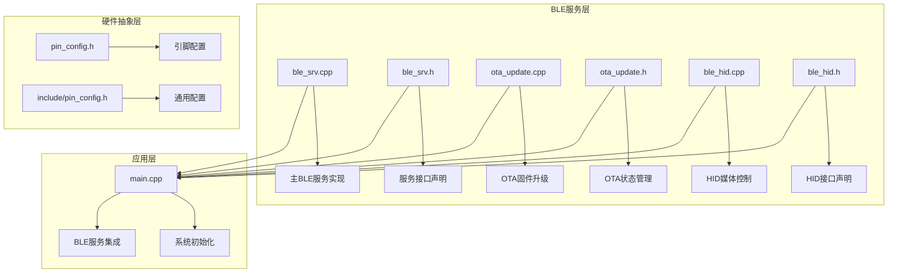

**图表来源**
- [ble_srv.cpp](file://src/service/ble_srv.cpp#L1-L50)
- [ble_srv.h](file://src/service/ble_srv.h#L1-L30)
- [main.cpp](file://src/main.cpp#L15-L25)

**章节来源**
- [ble_srv.cpp](file://src/service/ble_srv.cpp#L1-L50)
- [ble_srv.h](file://src/service/ble_srv.h#L1-L30)
- [main.cpp](file://src/main.cpp#L15-L25)

## 核心组件

SmartBracelet的BLE服务架构由六个主要组件构成，每个组件都实现了特定的功能域：

### 设备信息服务 (Device Information Service - 0x180A)
- **功能**：提供设备的基本信息，包括制造商名称、型号编号、序列号等
- **特征值**：
  - 制造商名称 (0x2A29) - 只读
  - 型号编号 (0x2A24) - 只读  
  - 序列号 (0x2A25) - 只读

### 电池服务 (Battery Service - 0x180F)
- **功能**：监控和报告设备电池状态
- **特征值**：
  - 电池电量 (0x2A19) - 可读可通知

### 当前时间服务 (Current Time Service - 0x1805)
- **功能**：提供和同步设备当前时间
- **特征值**：
  - 当前时间 (0x2A2B) - 可读可写

### 通知服务 (Custom Notification Service)
- **功能**：处理来自手机的通知消息和语音命令
- **UUID**：abcd0001-0000-1000-8000-00805f9b34fb
- **特征值**：
  - 通知接收 (abcd0002-0000-1000-8000-00805f9b34fb) - 可写
  - 数据传输 (abcd0003-0000-1000-8000-00805f9b34fb) - 可通知可指示

### 数据服务 (Custom Data Service)
- **功能**：向手机传输传感器数据和遥测信息
- **UUID**：abcd1000-0000-1000-8000-00805f9b34fb
- **特征值**：
  - 步数计数 (abcd1001-0000-1000-8000-00805f9b34fb) - 可读可通知
  - 电池电压 (abcd1002-0000-1000-8000-00805f9b34fb) - 可读
  - 活动状态 (abcd1003-0000-1000-8000-00805f9b34fb) - 可读可通知
  - IMU特征 (abcd1004-0000-1000-8000-00805f9b34fb) - 可读可通知

### OTA服务 (Custom OTA Service)
- **功能**：支持远程固件升级
- **UUID**：abcd2000-0000-1000-8000-00805f9b34fb
- **特征值**：
  - 控制 (abcd2001-0000-1000-8000-00805f9b34fb) - 可写
  - 状态 (abcd2002-0000-1000-8000-00805f9b34fb) - 可读可通知

**章节来源**
- [ble_srv.cpp](file://src/service/ble_srv.cpp#L125-L248)
- [ble_srv.h](file://src/service/ble_srv.h#L12-L47)

## 架构概览

SmartBracelet的BLE架构采用了模块化设计，所有服务共享同一个BLE服务器实例，通过不同的服务UUID进行逻辑分离：

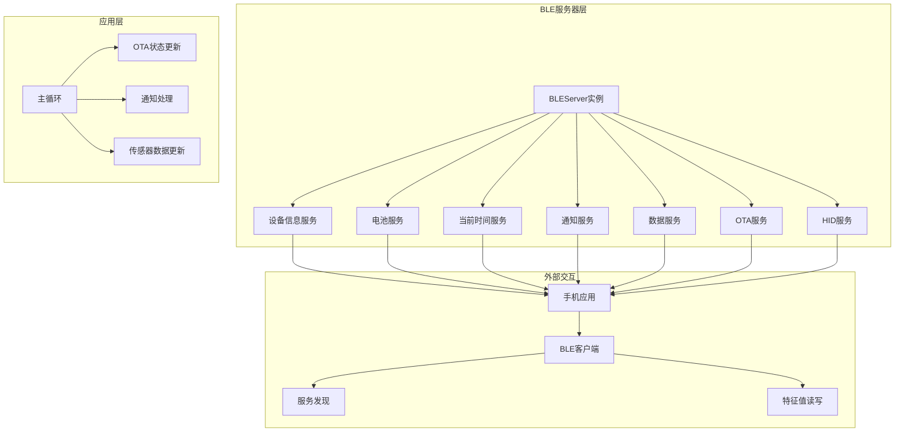

**图表来源**
- [ble_srv.cpp](file://src/service/ble_srv.cpp#L250-L285)
- [main.cpp](file://src/main.cpp#L718-L721)

### 服务发现流程

BLE服务的发现过程遵循标准的GATT协议：

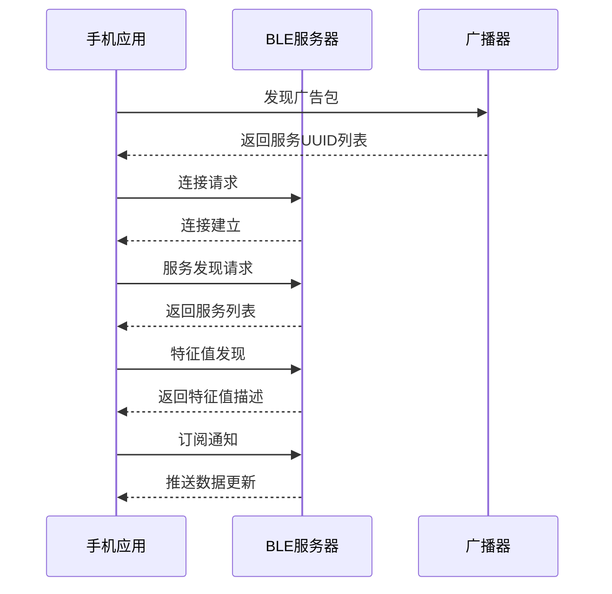

**图表来源**
- [ble_srv.cpp](file://src/service/ble_srv.cpp#L269-L282)

**章节来源**
- [ble_srv.cpp](file://src/service/ble_srv.cpp#L250-L285)

## 详细组件分析

### 设备信息服务 (0x180A)

设备信息服务实现了标准的设备信息特性，提供设备的基本识别信息：

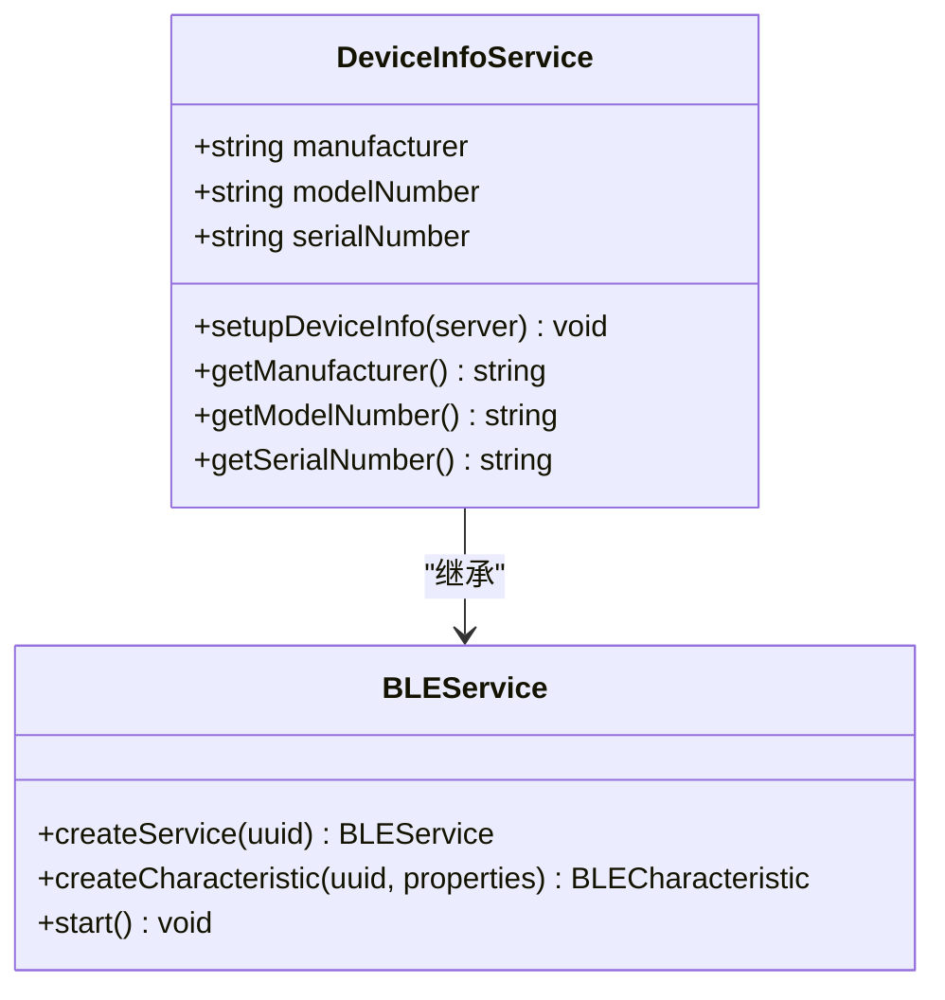

**图表来源**
- [ble_srv.cpp](file://src/service/ble_srv.cpp#L125-L143)

**章节来源**
- [ble_srv.cpp](file://src/service/ble_srv.cpp#L125-L143)

### 电池服务 (0x180F)

电池服务提供了实时的电池状态监控和通知机制：

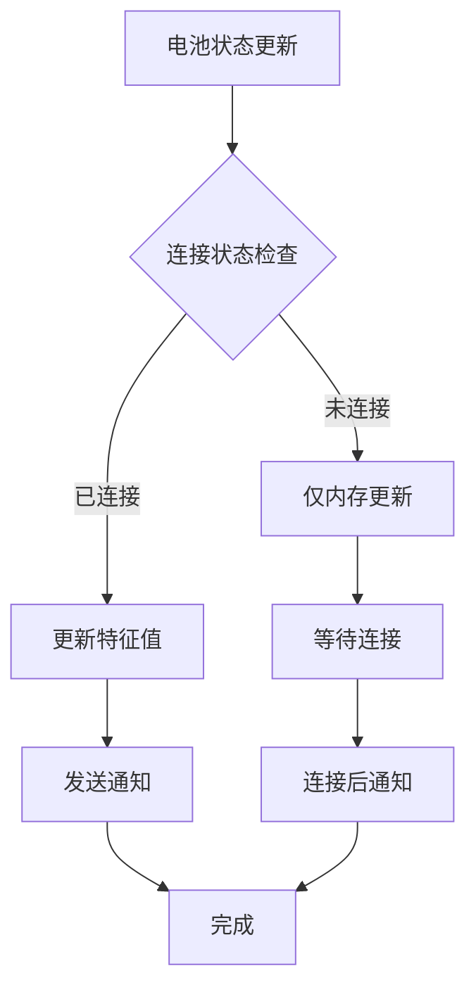

**图表来源**
- [ble_srv.cpp](file://src/service/ble_srv.cpp#L287-L294)

**章节来源**
- [ble_srv.cpp](file://src/service/ble_srv.cpp#L145-L156)
- [ble_srv.cpp](file://src/service/ble_srv.cpp#L287-L294)

### 当前时间服务 (0x1805)

当前时间服务实现了标准的时间同步功能：

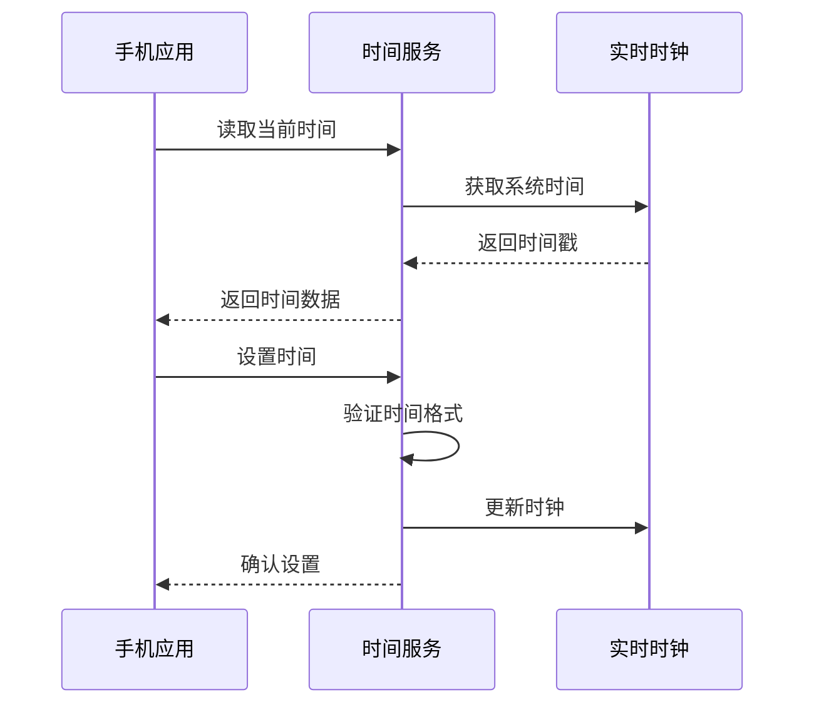

**图表来源**
- [ble_srv.cpp](file://src/service/ble_srv.cpp#L158-L166)
- [ble_srv.cpp](file://src/service/ble_srv.cpp#L296-L315)

**章节来源**
- [ble_srv.cpp](file://src/service/ble_srv.cpp#L158-L166)
- [ble_srv.cpp](file://src/service/ble_srv.cpp#L296-L315)

### 通知服务

通知服务是SmartBracelet的核心通信组件，支持多种消息类型：

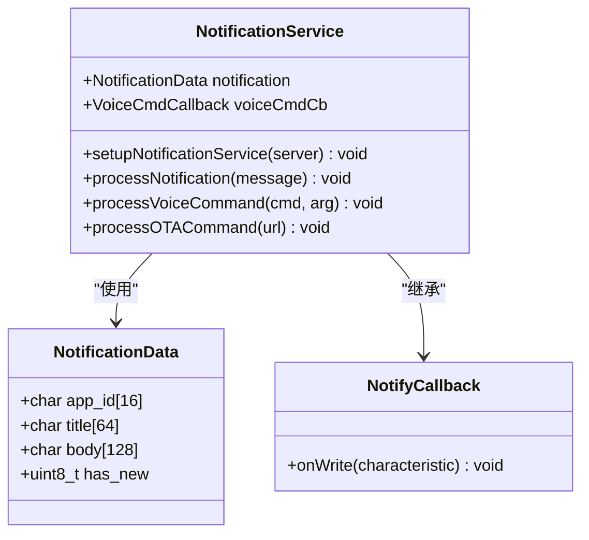

**图表来源**
- [ble_srv.cpp](file://src/service/ble_srv.cpp#L168-L187)
- [ble_srv.cpp](file://src/service/ble_srv.cpp#L49-L123)

**章节来源**
- [ble_srv.cpp](file://src/service/ble_srv.cpp#L168-L187)
- [ble_srv.cpp](file://src/service/ble_srv.cpp#L49-L123)

### 数据服务

数据服务负责向手机传输传感器数据和遥测信息：

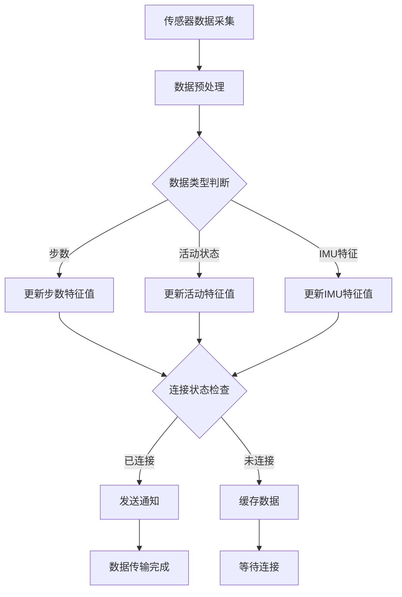

**图表来源**
- [ble_srv.cpp](file://src/service/ble_srv.cpp#L190-L223)
- [ble_srv.cpp](file://src/service/ble_srv.cpp#L330-L412)

**章节来源**
- [ble_srv.cpp](file://src/service/ble_srv.cpp#L190-L223)
- [ble_srv.cpp](file://src/service/ble_srv.cpp#L330-L412)

### OTA服务

OTA服务实现了安全的远程固件升级功能：

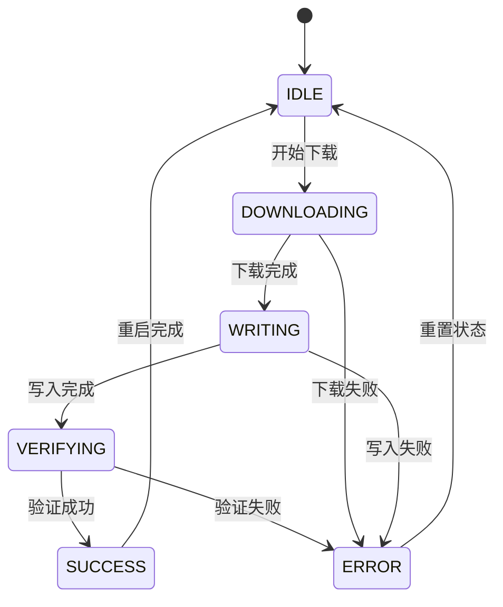

**图表来源**
- [ota_update.cpp](file://src/service/ota_update.cpp#L7-L14)
- [ota_update.cpp](file://src/service/ota_update.cpp#L18-L40)

**章节来源**
- [ble_srv.cpp](file://src/service/ble_srv.cpp#L225-L248)
- [ota_update.cpp](file://src/service/ota_update.cpp#L18-L171)
- [ota_update.h](file://src/service/ota_update.h#L6-L35)

### HID服务

HID服务提供了媒体控制功能，允许手机远程控制音乐播放：

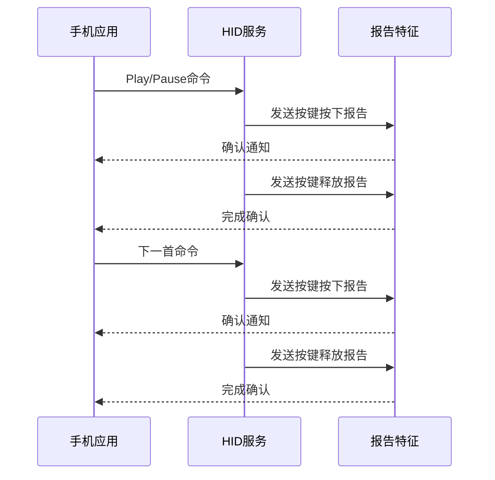

**图表来源**
- [ble_hid.cpp](file://src/service/ble_hid.cpp#L51-L65)
- [ble_hid.cpp](file://src/service/ble_hid.cpp#L117-L140)

**章节来源**
- [ble_hid.cpp](file://src/service/ble_hid.cpp#L67-L111)
- [ble_hid.cpp](file://src/service/ble_hid.cpp#L117-L140)

## 依赖关系分析

SmartBracelet的BLE服务架构展现了清晰的层次化依赖关系：

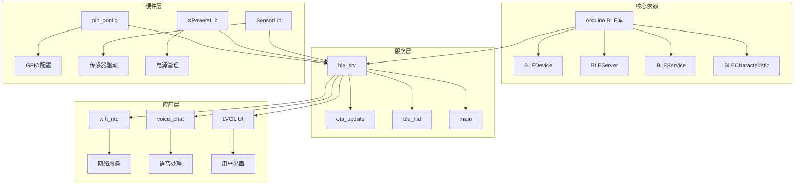

**图表来源**
- [ble_srv.cpp](file://src/service/ble_srv.cpp#L1-L10)
- [main.cpp](file://src/main.cpp#L1-L28)

**章节来源**
- [ble_srv.cpp](file://src/service/ble_srv.cpp#L1-L10)
- [main.cpp](file://src/main.cpp#L1-L28)

### 关键依赖关系

1. **BLE库依赖**：所有BLE服务都依赖于Arduino BLE库提供的基础API
2. **服务间依赖**：主BLE服务依赖OTA更新模块和HID服务模块
3. **硬件抽象依赖**：BLE服务依赖于底层硬件配置和传感器驱动
4. **应用层集成**：BLE服务与WiFi、语音处理、UI等应用功能集成

**章节来源**
- [ble_srv.cpp](file://src/service/ble_srv.cpp#L1-L10)
- [main.cpp](file://src/main.cpp#L14-L25)

## 性能考虑

SmartBracelet的BLE服务架构在设计时充分考虑了性能优化：

### 电源管理优化
- **慢速广播间隔**：使用0x400-0x800的广播间隔，降低功耗
- **连接参数优化**：设置适当的最小和最大连接间隔
- **MTU设置**：启用256字节MTU以提高数据传输效率

### 数据传输优化
- **批量数据处理**：IMU特征值支持最多12个浮点数的批量传输
- **条件通知**：仅在有连接时才发送通知，避免无效传输
- **数据压缩**：合理选择数据格式以减少传输开销

### 内存管理
- **静态分配**：关键数据结构采用静态分配，避免动态内存碎片
- **缓冲区管理**：合理设置缓冲区大小，平衡内存使用和性能

## 故障排除指南

### 常见问题及解决方案

#### 连接问题
- **症状**：设备无法被发现或连接不稳定
- **原因**：广播配置不当或连接参数冲突
- **解决**：检查广播UUID设置和连接间隔配置

#### 通知丢失
- **症状**：手机收不到设备推送的数据
- **原因**：客户端未正确订阅通知或设备离线
- **解决**：验证客户端订阅状态和服务连接状态

#### OTA升级失败
- **症状**：固件升级过程中断或失败
- **原因**：网络连接中断或存储空间不足
- **解决**：检查WiFi连接状态和可用存储空间

**章节来源**
- [ble_srv.cpp](file://src/service/ble_srv.cpp#L49-L61)
- [ota_update.cpp](file://src/service/ota_update.cpp#L18-L40)

## 结论

SmartBracelet的BLE服务架构展现了现代IoT设备的优秀实践，通过模块化设计实现了功能的清晰分离和高效的资源利用。该架构不仅满足了基本的BLE通信需求，还为未来的功能扩展预留了充足的空间。

主要优势包括：
- **模块化设计**：各服务独立实现，便于维护和扩展
- **标准化与自定义结合**：既支持标准BLE服务，又实现了必要的自定义功能
- **性能优化**：在功耗、内存和传输效率方面都有良好表现
- **安全性考虑**：实现了基本的BLE安全配置

该架构为类似IoT设备的BLE服务开发提供了优秀的参考模板，展示了如何在资源受限的嵌入式环境中实现复杂的无线通信功能。