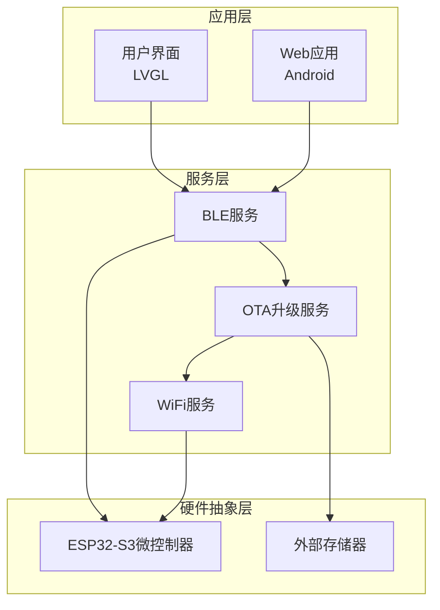
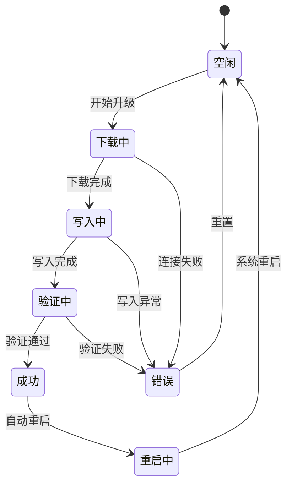
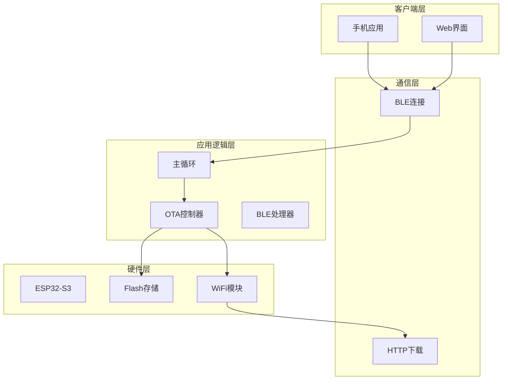
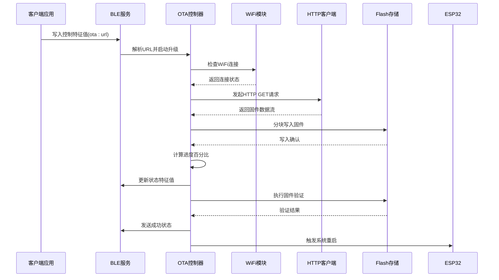
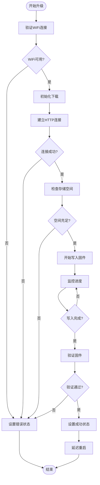
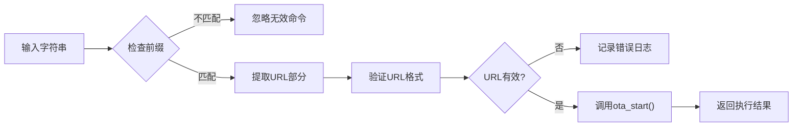
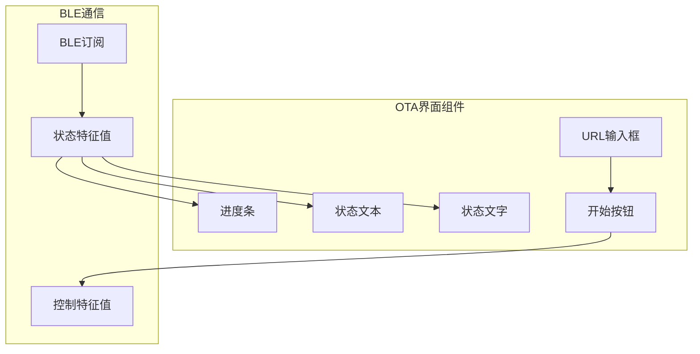
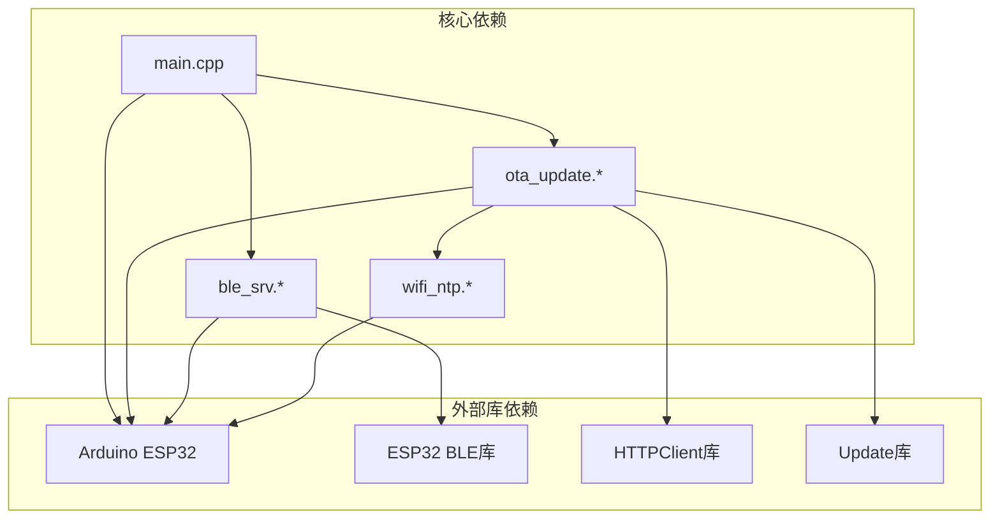

# OTA固件升级

<cite>
**本文档引用的文件**
- [ota_update.h](file://src/service/ota_update.h)
- [ota_update.cpp](file://src/service/ota_update.cpp)
- [ble_srv.h](file://src/service/ble_srv.h)
- [ble_srv.cpp](file://src/service/ble_srv.cpp)
- [main.cpp](file://src/main.cpp)
- [wifi_ntp.h](file://src/service/wifi_ntp.h)
- [wifi_ntp.cpp](file://src/service/wifi_ntp.cpp)
- [index.html](file://webapp/index.html)
</cite>

## 目录
1. [简介](#简介)
2. [项目结构](#项目结构)
3. [核心组件](#核心组件)
4. [架构概览](#架构概览)
5. [详细组件分析](#详细组件分析)
6. [依赖关系分析](#依赖关系分析)
7. [性能考虑](#性能考虑)
8. [故障排除指南](#故障排除指南)
9. [结论](#结论)
10. [附录](#附录)

## 简介

本项目实现了基于BLE的OTA（Over-The-Air）固件升级系统，为智能手环设备提供无线固件更新能力。该系统采用ESP32-S3微控制器作为核心处理器，通过BLE连接实现固件升级的完整生命周期管理。

OTA系统的核心特性包括：
- 基于BLE的固件升级协议
- 完整的状态管理机制
- 实时进度反馈
- 错误处理和恢复机制
- 用户界面集成
- 安全性考虑

## 项目结构

该项目采用模块化架构，主要分为以下几个核心模块：



**图表来源**
- [main.cpp](file://src/main.cpp#L715-L722)
- [ble_srv.cpp](file://src/service/ble_srv.cpp#L250-L285)

**章节来源**
- [main.cpp](file://src/main.cpp#L615-L722)
- [ota_update.h](file://src/service/ota_update.h#L1-L36)

## 核心组件

### OTA状态机

系统实现了完整的OTA状态管理机制，包含以下状态：



**图表来源**
- [ota_update.h](file://src/service/ota_update.h#L7-L14)

### BLE服务架构

系统通过自定义BLE服务提供OTA功能：

| 服务UUID | 特征UUID | 功能描述 | 数据类型 |
|---------|---------|----------|----------|
| abcd2000-0000-1000-8000-00805f9b34fb | abcd2001-0000-1000-8000-00805f9b34fb | 控制特征值 | 字符串命令 |
| abcd2000-0000-1000-8000-00805f9b34fb | abcd2002-0000-1000-8000-00805f9b34fb | 状态特征值 | [状态字节, 进度字节] |

**章节来源**
- [ble_srv.h](file://src/service/ble_srv.h#L36-L47)
- [ble_srv.cpp](file://src/service/ble_srv.cpp#L37-L47)

## 架构概览

### 整体系统架构



**图表来源**
- [main.cpp](file://src/main.cpp#L724-L741)
- [ble_srv.cpp](file://src/service/ble_srv.cpp#L225-L248)

### OTA升级流程序列图



**图表来源**
- [ble_srv.cpp](file://src/service/ble_srv.cpp#L82-L92)
- [ota_update.cpp](file://src/service/ota_update.cpp#L18-L40)
- [ota_update.cpp](file://src/service/ota_update.cpp#L54-L171)

## 详细组件分析

### OTA控制器实现

#### 状态管理机制

OTA控制器实现了完整的状态管理，通过状态机确保升级过程的可靠性：



**图表来源**
- [ota_update.cpp](file://src/service/ota_update.cpp#L18-L40)
- [ota_update.cpp](file://src/service/ota_update.cpp#L54-L171)

#### 进度计算算法

系统采用精确的进度计算机制：

| 阶段 | 计算方式 | 更新频率 |
|------|----------|----------|
| 下载阶段 | 已下载字节数 / 总字节数 × 100% | 每次数据块写入后 |
| 写入阶段 | 已写入字节数 / 总字节数 × 100% | 每次数据块写入后 |
| 验证阶段 | 固定值(95%) | 验证开始时 |
| 成功阶段 | 100% | 验证完成后立即 |

**章节来源**
- [ota_update.cpp](file://src/service/ota_update.cpp#L110-L151)

### BLE服务实现

#### OTA控制特征值协议

BLE控制特征值采用简单的字符串协议格式：

```
ota:<固件下载URL>
```

协议解析流程：



**图表来源**
- [ble_srv.cpp](file://src/service/ble_srv.cpp#L82-L92)

#### OTA状态特征值格式

状态特征值采用紧凑的二进制格式：

| 字节偏移 | 数据类型 | 描述 | 范围 |
|----------|----------|------|------|
| 0 | uint8_t | OTA状态码 | 0-5 |
| 1 | uint8_t | 进度百分比 | 0-100 |

状态码定义：
- 0: 空闲 (OTA_IDLE)
- 1: 下载中 (OTA_DOWNLOADING)
- 2: 写入中 (OTA_WRITING)
- 3: 验证中 (OTA_VERIFYING)
- 4: 成功 (OTA_SUCCESS)
- 5: 错误 (OTA_ERROR)

**章节来源**
- [ble_srv.cpp](file://src/service/ble_srv.cpp#L237-L247)
- [ble_srv.cpp](file://src/service/ble_srv.cpp#L377-L385)

### 用户界面集成

#### Web应用OTA界面

Web应用提供了完整的OTA升级界面，支持实时状态监控：



**图表来源**
- [index.html](file://webapp/index.html#L661-L687)
- [index.html](file://webapp/index.html#L1464-L1487)

**章节来源**
- [index.html](file://webapp/index.html#L661-L687)

## 依赖关系分析

### 组件间依赖关系



**图表来源**
- [ota_update.cpp](file://src/service/ota_update.cpp#L1-L6)
- [ble_srv.cpp](file://src/service/ble_srv.cpp#L1-L8)

### 关键依赖关系

| 组件 | 依赖组件 | 用途 |
|------|----------|------|
| ota_update | wifi_ntp | WiFi连接状态检查 |
| ota_update | HTTPClient | 固件下载 |
| ota_update | Update | 固件写入和验证 |
| ble_srv | BLEDevice | BLE服务管理 |
| main | ota_update | OTA状态轮询 |
| main | ble_srv | BLE状态同步 |

**章节来源**
- [ota_update.cpp](file://src/service/ota_update.cpp#L1-L6)
- [ble_srv.cpp](file://src/service/ble_srv.cpp#L1-L8)

## 性能考虑

### 内存使用优化

系统在内存受限环境下进行了优化：

- **缓冲区大小**: 使用4KB缓冲区进行分块下载，平衡内存使用和网络效率
- **状态存储**: 使用静态变量存储OTA状态，避免动态内存分配
- **字符串处理**: 限制URL长度为256字节，错误消息为128字节

### 网络性能优化

- **超时设置**: HTTP请求超时时间为30秒，防止长时间阻塞
- **重定向跟随**: 自动跟随HTTP重定向，提高下载成功率
- **连接池**: 复用HTTP连接，减少连接开销

### 电池续航优化

- **WiFi省电模式**: 升级完成后自动关闭WiFi以节省电量
- **广告间隔延长**: BLE广播间隔从默认100ms延长到640ms
- **状态轮询优化**: 只在状态变化时发送BLE通知

## 故障排除指南

### 常见问题及解决方案

#### WiFi连接问题

**症状**: OTA状态停留在"空闲"或出现"WiFi not connected"错误

**诊断步骤**:
1. 检查WiFi凭据配置
2. 验证网络可达性
3. 确认路由器信号强度

**解决方案**:
- 更新正确的WiFi凭据
- 移动到信号更强的位置
- 重启路由器和设备

#### 下载失败问题

**症状**: OTA状态变为"错误"，进度停滞

**可能原因**:
- URL不可访问
- 存储空间不足
- 网络连接中断

**解决方法**:
- 验证固件URL有效性
- 清理不必要的数据释放空间
- 检查网络连接稳定性

#### 验证失败问题

**症状**: 固件写入完成但验证失败

**诊断方法**:
1. 检查固件完整性
2. 验证目标设备兼容性
3. 确认Flash存储器状态

**修复方案**:
- 重新下载固件包
- 检查设备兼容性
- 手动擦除Flash存储器

### 错误码参考

| 错误码 | 错误类型 | 可能原因 | 解决方案 |
|--------|----------|----------|----------|
| 0 | OTA_SUCCESS | 升级成功 | 无需操作 |
| 1 | OTA_ERROR | 一般错误 | 检查日志详情 |
| 2 | OTA_DOWNLOADING | 下载中 | 等待下载完成 |
| 3 | OTA_WRITING | 写入中 | 等待写入完成 |
| 4 | OTA_VERIFYING | 验证中 | 等待验证完成 |

**章节来源**
- [ota_update.cpp](file://src/service/ota_update.cpp#L18-L40)
- [ota_update.cpp](file://src/service/ota_update.cpp#L79-L85)

## 结论

本OTA固件升级系统实现了完整的无线固件更新功能，具有以下特点：

**技术优势**:
- 基于BLE的直观用户界面
- 完整的状态管理和进度反馈
- 稳健的错误处理和恢复机制
- 优化的性能和资源使用

**安全性考虑**:
- 传输层加密保护
- 进程间通信安全
- 回滚机制保障系统稳定

**扩展性**:
- 模块化设计便于维护
- 标准化的BLE接口
- 可配置的参数和行为

该系统为智能手环设备提供了可靠的OTA升级能力，支持用户通过移动应用或Web界面轻松完成固件更新。

## 附录

### 协议规范

#### OTA控制协议

**命令格式**: `ota:<固件URL>`

**参数说明**:
- `ota`: 命令标识符
- `<固件URL>`: HTTP/HTTPS固件下载地址

**响应格式**: 
- 成功: `OTA: download started`
- 失败: `OTA: start failed: <错误信息>`

#### OTA状态协议

**数据格式**: `[状态字节, 进度字节]`

**状态定义**:
- `0`: 空闲 (Idle)
- `1`: 下载中 (Downloading)
- `2`: 写入中 (Writing)
- `3`: 验证中 (Verifying)
- `4`: 成功 (Success)
- `5`: 错误 (Error)

**进度范围**: 0-100%，表示百分比完成度

### 代码示例

#### 启动OTA升级

```cpp
// 在BLE回调中处理OTA命令
if (val.rfind("ota:", 0) == 0) {
    std::string url = val.substr(4);
    if (ota_start(url.c_str())) {
        USBSerial.println("OTA: download started");
    } else {
        USBSerial.printf("OTA: start failed: %s\n", ota_get_error());
    }
}
```

#### 更新OTA状态

```cpp
// 主循环中定期更新OTA状态
{
    static uint8_t last_ota_state = 255;
    ota_state_t os = ota_get_state();
    if ((uint8_t)os != last_ota_state) {
        last_ota_state = (uint8_t)os;
        ble_srv_update_ota_state((uint8_t)os, ota_get_progress());
    }
}
```

#### 错误报告

```cpp
// 获取当前OTA错误信息
const char* getOtaError() {
    return ota_get_error();
}

// 在BLE状态特征值中包含错误信息
if (ota_get_state() == OTA_ERROR) {
    ble_srv_update_ota_state(5, 0); // 错误状态
}
```