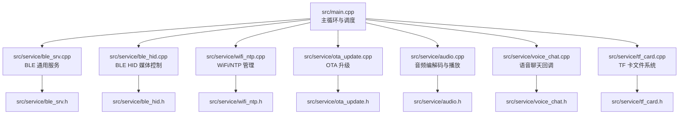
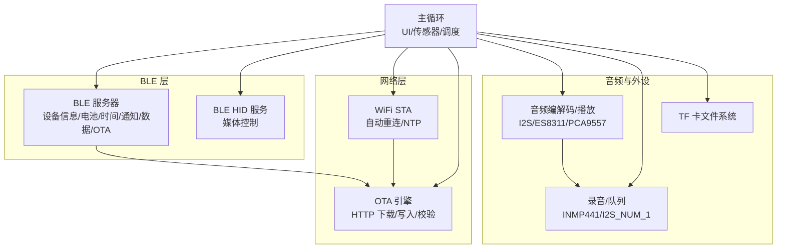
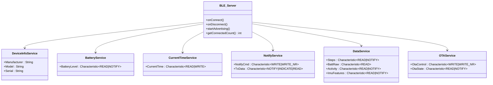
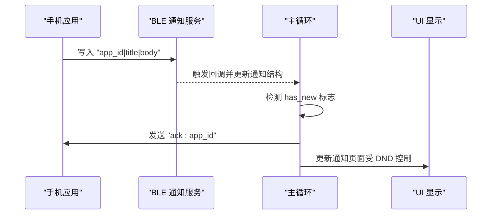
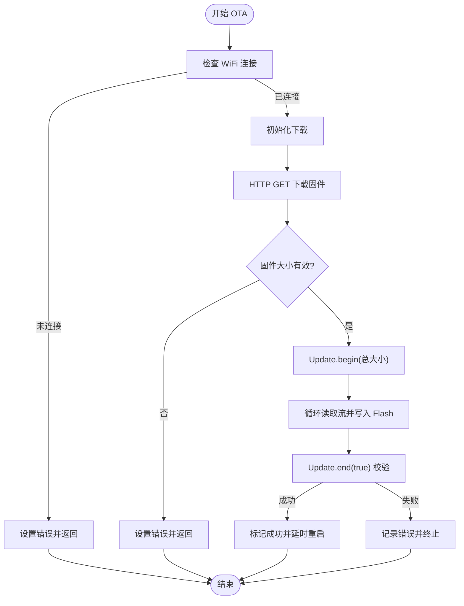
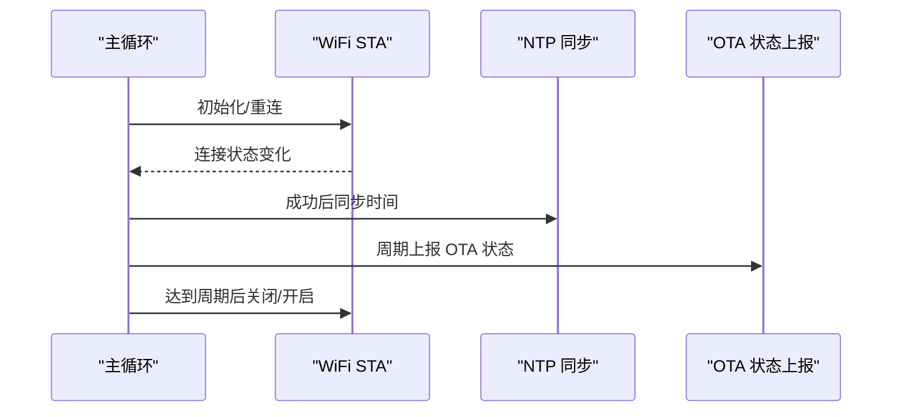
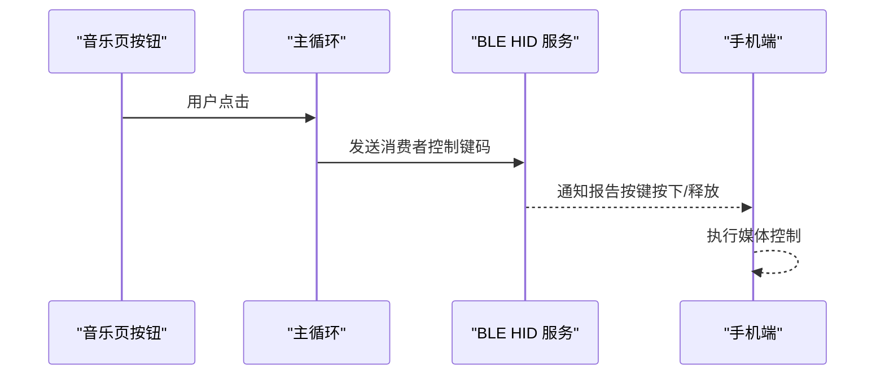
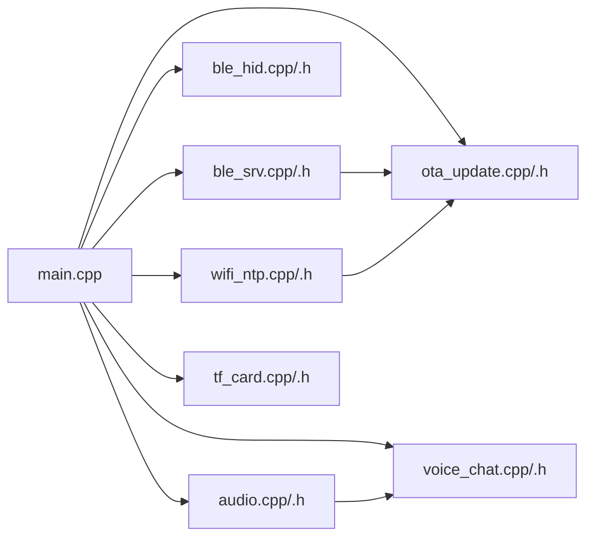

# 通信系统

<cite>
**本文引用的文件**
- [src/service/ble_srv.h](file://src/service/ble_srv.h)
- [src/service/ble_srv.cpp](file://src/service/ble_srv.cpp)
- [src/service/ble_hid.h](file://src/service/ble_hid.h)
- [src/service/ble_hid.cpp](file://src/service/ble_hid.cpp)
- [src/service/ota_update.h](file://src/service/ota_update.h)
- [src/service/ota_update.cpp](file://src/service/ota_update.cpp)
- [src/service/wifi_ntp.h](file://src/service/wifi_ntp.h)
- [src/service/wifi_ntp.cpp](file://src/service/wifi_ntp.cpp)
- [src/service/audio.h](file://src/service/audio.h)
- [src/service/audio.cpp](file://src/service/audio.cpp)
- [src/service/voice_chat.h](file://src/service/voice_chat.h)
- [src/service/voice_chat.cpp](file://src/service/voice_chat.cpp)
- [src/service/tf_card.h](file://src/service/tf_card.h)
- [src/service/tf_card.cpp](file://src/service/tf_card.cpp)
- [src/main.cpp](file://src/main.cpp)
</cite>

## 目录
1. [简介](#简介)
2. [项目结构](#项目结构)
3. [核心组件](#核心组件)
4. [架构总览](#架构总览)
5. [详细组件分析](#详细组件分析)
6. [依赖关系分析](#依赖关系分析)
7. [性能考虑](#性能考虑)
8. [故障排除指南](#故障排除指南)
9. [结论](#结论)
10. [附录](#附录)

## 简介
本文件为 SmartBracelet 通信系统的全面技术文档，围绕以下主题展开：BLE 服务架构（GATT 服务与特征值）、通知推送机制、OTA 固件升级流程、WiFi 网络管理策略、BLE HID 键盘鼠标功能、通信安全、性能优化与故障排除，以及与移动端应用的通信协议与数据交换格式。

## 项目结构
该仓库采用按“服务”分层的组织方式，核心通信相关代码集中在 src/service 目录中，主程序入口在 src/main.cpp，配合 UI、传感器、电源管理等模块协同工作。

图表来源
- [src/main.cpp](file://src/main.cpp#L715-L722)
- [src/service/ble_srv.cpp](file://src/service/ble_srv.cpp#L250-L285)
- [src/service/ble_hid.cpp](file://src/service/ble_hid.cpp#L67-L111)
- [src/service/wifi_ntp.cpp](file://src/service/wifi_ntp.cpp#L21-L30)
- [src/service/ota_update.cpp](file://src/service/ota_update.cpp#L18-L40)
- [src/service/audio.cpp](file://src/service/audio.cpp#L262-L282)
- [src/service/voice_chat.cpp](file://src/service/voice_chat.cpp#L41-L44)
- [src/service/tf_card.cpp](file://src/service/tf_card.cpp#L7-L28)

章节来源
- [src/main.cpp](file://src/main.cpp#L715-L722)
- [src/service/ble_srv.cpp](file://src/service/ble_srv.cpp#L250-L285)

## 核心组件
- BLE 通用服务：设备信息、电池电量、当前时间、通知下发、数据上报（步数、电量原始值、活动类型、IMU 特征）、OTA 状态、Do Not Disturb 模式、语音命令回调与结果回传。
- BLE HID：基于 HID over GATT 的媒体控制服务，支持播放/暂停、上一首/下一首、音量加减。
- OTA 升级：通过 HTTP 下载固件，校验并写入 Flash，成功后延时重启并通过 BLE 通知进度与状态。
- WiFi/NTP：STA 模式连接、自动重连、NTP 时间同步、RSSI 获取、周期性开关 WiFi 节能。
- 音频与录音：I2S 驱动、ES8311 音频编解码、PCA9557 扩展器控制功放、INMP441 录音、WAV 播放与 TTS 推送播放。
- 语音聊天：手机端发起录音，云端处理后通过 BLE 返回转录与回复文本。
- TF 卡：SDMMC 文件系统初始化与目录遍历。

章节来源
- [src/service/ble_srv.h](file://src/service/ble_srv.h#L6-L48)
- [src/service/ble_srv.cpp](file://src/service/ble_srv.cpp#L125-L285)
- [src/service/ble_hid.h](file://src/service/ble_hid.h#L12-L23)
- [src/service/ble_hid.cpp](file://src/service/ble_hid.cpp#L67-L111)
- [src/service/ota_update.h](file://src/service/ota_update.h#L7-L31)
- [src/service/ota_update.cpp](file://src/service/ota_update.cpp#L18-L171)
- [src/service/wifi_ntp.h](file://src/service/wifi_ntp.h#L11-L25)
- [src/service/wifi_ntp.cpp](file://src/service/wifi_ntp.cpp#L21-L122)
- [src/service/audio.h](file://src/service/audio.h#L5-L23)
- [src/service/audio.cpp](file://src/service/audio.cpp#L262-L365)
- [src/service/voice_chat.h](file://src/service/voice_chat.h#L4-L15)
- [src/service/voice_chat.cpp](file://src/service/voice_chat.cpp#L11-L44)
- [src/service/tf_card.h](file://src/service/tf_card.h#L4-L9)
- [src/service/tf_card.cpp](file://src/service/tf_card.cpp#L7-L60)

## 架构总览
下图展示 BLE、WiFi、OTA、音频与主循环之间的交互关系。

图表来源
- [src/main.cpp](file://src/main.cpp#L718-L721)
- [src/service/ble_srv.cpp](file://src/service/ble_srv.cpp#L250-L285)
- [src/service/ble_hid.cpp](file://src/service/ble_hid.cpp#L67-L111)
- [src/service/wifi_ntp.cpp](file://src/service/wifi_ntp.cpp#L37-L60)
- [src/service/ota_update.cpp](file://src/service/ota_update.cpp#L54-L171)
- [src/service/audio.cpp](file://src/service/audio.cpp#L165-L260)
- [src/service/tf_card.cpp](file://src/service/tf_card.cpp#L7-L28)

## 详细组件分析

### BLE 服务架构与 GATT 定义
- 设备信息服务（0x180A）：制造商、型号、序列号。
- 电池服务（0x180F）：可读取的电池电量百分比，支持通知。
- 当前时间服务（0x1805）：可读写的当前时间特征。
- 通知服务（自定义 UUID）：接收来自手机的通知内容（应用 ID、标题、正文），支持写入与通知；同时提供下行通道用于手机读取。
- 数据服务（自定义 UUID）：步数、电量原始值、活动类型、IMU 特征（最多 12 个 float，48 字节）。
- OTA 服务（自定义 UUID）：控制特征用于触发升级，状态特征用于上报状态与进度。
- 广告：慢速广告间隔以节能，包含上述服务 UUID。
- 连接管理：断开后自动重新广播；连接计数用于判断是否处于连接态。

图表来源
- [src/service/ble_srv.cpp](file://src/service/ble_srv.cpp#L125-L285)

章节来源
- [src/service/ble_srv.cpp](file://src/service/ble_srv.cpp#L125-L285)
- [src/service/ble_srv.h](file://src/service/ble_srv.h#L12-L48)

### 通知推送机制
- 协议格式：应用 ID|标题|正文，最大长度限制在头文件中定义。
- 接收路径：通知服务的写入特征触发解析，填充全局通知结构体。
- 上报路径：主循环检测到新通知后，打印日志并回发确认字符串（ack:应用 ID）。
- Do Not Disturb：可通过写入特征设置 DND 开关，抑制通知显示但不影响回执。

图表来源
- [src/service/ble_srv.cpp](file://src/service/ble_srv.cpp#L102-L122)
- [src/main.cpp](file://src/main.cpp#L766-L780)

章节来源
- [src/service/ble_srv.cpp](file://src/service/ble_srv.cpp#L102-L122)
- [src/main.cpp](file://src/main.cpp#L766-L780)
- [src/service/ble_srv.h](file://src/service/ble_srv.h#L22-L29)

### OTA 固件升级流程
- 启动条件：WiFi 已连接；避免重复启动。
- 下载阶段：HTTP GET 请求，记录总大小，使用 Update.begin 初始化刷写。
- 写入阶段：分块读取流数据写入 Flash，计算进度百分比。
- 校验阶段：Update.end(true) 校验，成功则标记成功并延时重启，失败记录错误。
- 状态上报：主循环周期性将 OTA 状态与进度通过 BLE 状态特征通知手机。
- 回滚机制：当前实现未见显式回滚逻辑，建议在应用层保留上次有效版本信息并在升级失败时恢复。

图表来源
- [src/service/ota_update.cpp](file://src/service/ota_update.cpp#L18-L171)
- [src/main.cpp](file://src/main.cpp#L727-L741)

章节来源
- [src/service/ota_update.cpp](file://src/service/ota_update.cpp#L18-L171)
- [src/service/ota_update.h](file://src/service/ota_update.h#L7-L31)
- [src/main.cpp](file://src/main.cpp#L727-L741)

### WiFi 网络管理策略
- 连接建立：STA 模式，保存凭据，首次连接后持续重试。
- 断线重连：状态异常时定期重试，避免长时间离线。
- 功率优化：NTP 同步与天气获取完成后关闭 WiFi，每 10 分钟周期性开启以维持服务。
- RSSI 获取：用于 UI 状态指示与网络质量评估。
- NTP 同步：配置时区与 NTP 服务器，超时重试，成功后更新 RTC。

图表来源
- [src/service/wifi_ntp.cpp](file://src/service/wifi_ntp.cpp#L37-L122)
- [src/main.cpp](file://src/main.cpp#L724-L764)

章节来源
- [src/service/wifi_ntp.cpp](file://src/service/wifi_ntp.cpp#L21-L122)
- [src/service/wifi_ntp.h](file://src/service/wifi_ntp.h#L11-L25)
- [src/main.cpp](file://src/main.cpp#L743-L764)

### BLE HID 键盘鼠标功能
- 服务与特征：HID 服务 UUID 与标准报告、报告映射、信息、控制点、协议模式特征。
- 报告描述：消费者控制（Consumer Control）报告，包含 Report ID 与两个字节的键码。
- 事件处理：发送按键按下与释放（50ms 间隔），支持播放/暂停、上一首/下一首、音量加/减。
- 依赖关系：必须在 BLE 服务器初始化后再创建 HID 服务。

图表来源
- [src/main.cpp](file://src/main.cpp#L340-L396)
- [src/service/ble_hid.cpp](file://src/service/ble_hid.cpp#L51-L65)
- [src/service/ble_hid.cpp](file://src/service/ble_hid.cpp#L117-L140)

章节来源
- [src/service/ble_hid.h](file://src/service/ble_hid.h#L12-L23)
- [src/service/ble_hid.cpp](file://src/service/ble_hid.cpp#L67-L111)
- [src/main.cpp](file://src/main.cpp#L340-L396)

### 与移动端应用的通信协议与数据交换格式
- 通知下发：手机向通知服务写入 "app_id|title|body"，设备回发 "ack:app_id"。
- OTA 触发：手机向 OTA 控制特征写入 "ota:url"，设备开始下载并上报状态。
- 语音聊天：手机发起 "voice:start"，停止 "voice:stop"，结果 "voice:result|转录|回复"。
- Do Not Disturb：手机写入 "dnd:1" 或 "dnd:0"。
- 下行通道：设备通过 Tx 特征发送任意字符串，支持 UTF-8（含中文）。
- BLE 数据服务：设备主动通知步数、活动类型、IMU 特征（浮点数组打包）。

章节来源
- [src/service/ble_srv.cpp](file://src/service/ble_srv.cpp#L71-L122)
- [src/service/ble_srv.cpp](file://src/service/ble_srv.cpp#L317-L327)
- [src/service/ble_srv.cpp](file://src/service/ble_srv.cpp#L363-L370)
- [src/service/ble_srv.cpp](file://src/service/ble_srv.cpp#L189-L223)
- [src/service/voice_chat.cpp](file://src/service/voice_chat.cpp#L11-L39)

## 依赖关系分析
- 主循环依赖：BLE 服务器指针、WiFi 连接状态、OTA 状态机、音频/录音状态、TF 卡可用性。
- 服务间耦合：BLE HID 依赖 BLE 服务器实例；OTA 依赖 WiFi 与 HTTP；音频依赖 I2S 与 I2C；语音聊天依赖 BLE 通知服务回调。
- 外部依赖：ArduinoBLE、WiFi、HTTPClient、Update、LVGL、触摸驱动、传感器库、电源管理库。

图表来源
- [src/main.cpp](file://src/main.cpp#L14-L26)
- [src/service/ble_srv.cpp](file://src/service/ble_srv.cpp#L250-L285)
- [src/service/ble_hid.cpp](file://src/service/ble_hid.cpp#L67-L111)
- [src/service/wifi_ntp.cpp](file://src/service/wifi_ntp.cpp#L21-L30)
- [src/service/ota_update.cpp](file://src/service/ota_update.cpp#L18-L40)
- [src/service/audio.cpp](file://src/service/audio.cpp#L262-L282)
- [src/service/voice_chat.cpp](file://src/service/voice_chat.cpp#L41-L44)
- [src/service/tf_card.cpp](file://src/service/tf_card.cpp#L7-L28)

章节来源
- [src/main.cpp](file://src/main.cpp#L14-L26)

## 性能考虑
- BLE 广告节能：慢速最小间隔（约 640ms），降低功耗。
- MTU 设置：启用 256 字节 MTU 提升吞吐。
- WiFi 功耗：NTP 同步与天气获取后关闭 WiFi，周期性唤醒维持服务。
- OTA 优化：分块下载与进度上报，避免阻塞主循环。
- 音频：I2S DMA 缓冲与任务队列分离录音，减少中断延迟。
- UI 刷新：LVGL 定时器驱动，避免轮询。

章节来源
- [src/service/ble_srv.cpp](file://src/service/ble_srv.cpp#L253-L282)
- [src/service/wifi_ntp.cpp](file://src/service/wifi_ntp.cpp#L94-L112)
- [src/service/ota_update.cpp](file://src/service/ota_update.cpp#L109-L151)
- [src/service/audio.cpp](file://src/service/audio.cpp#L165-L188)

## 故障排除指南
- BLE 无法连接或频繁断开
  - 检查慢速广告间隔与加密设置；确认手机端未强制断开。
  - 参考：[src/service/ble_srv.cpp](file://src/service/ble_srv.cpp#L253-L282)
- OTA 下载失败
  - 确认 WiFi 已连接；检查 URL 可达性与固件大小；关注错误信息。
  - 参考：[src/service/ota_update.cpp](file://src/service/ota_update.cpp#L18-L93)
- OTA 写入或校验失败
  - 检查剩余空间与写入权限；查看 Update 错误码。
  - 参考：[src/service/ota_update.cpp](file://src/service/ota_update.cpp#L98-L147)
- WiFi 无法连接或频繁掉线
  - 查看重连逻辑与凭据；确认热点可用。
  - 参考：[src/service/wifi_ntp.cpp](file://src/service/wifi_ntp.cpp#L37-L60)
- 音频无声或杂音
  - 检查 PCA9557 扩展器输出与 ES8311 寄存器配置；确认 I2S 引脚与采样率。
  - 参考：[src/service/audio.cpp](file://src/service/audio.cpp#L28-L124)
- TF 卡不可用
  - 检查引脚配置与卡类型；按提示格式化为 FAT32。
  - 参考：[src/service/tf_card.cpp](file://src/service/tf_card.cpp#L7-L28)

章节来源
- [src/service/ble_srv.cpp](file://src/service/ble_srv.cpp#L253-L282)
- [src/service/ota_update.cpp](file://src/service/ota_update.cpp#L18-L147)
- [src/service/wifi_ntp.cpp](file://src/service/wifi_ntp.cpp#L37-L60)
- [src/service/audio.cpp](file://src/service/audio.cpp#L28-L124)
- [src/service/tf_card.cpp](file://src/service/tf_card.cpp#L7-L28)

## 结论
本通信系统以 BLE 为核心，结合 HID、OTA、WiFi/NTP、音频与文件系统，形成完整的穿戴设备通信与服务能力。通过慢速广告、MTU 优化、WiFi 功率管理和 OTA 分块写入等策略，在保证功能完整性的同时兼顾了续航与稳定性。建议后续增强 OTA 回滚与安全签名机制，进一步提升可靠性与安全性。

## 附录
- 通信安全
  - 当前 BLE 使用加密但无配对（ESP_LE_AUTH_NO_BOND），建议在后续版本引入配对与签名机制。
  - 参考：[src/service/ble_srv.cpp](file://src/service/ble_srv.cpp#L253-L258)
- 数据模型（简要）
  - 通知结构体字段：应用 ID、标题、正文、新消息标志。
  - OTA 状态机：空闲、下载中、写入中、校验中、成功、错误。
  - 语音聊天状态：空闲、录音中、等待中、响应中。
  - 参考：[src/service/ble_srv.h](file://src/service/ble_srv.h#L22-L29), [src/service/ota_update.h](file://src/service/ota_update.h#L7-L14), [src/service/voice_chat.h](file://src/service/voice_chat.h#L4-L9)