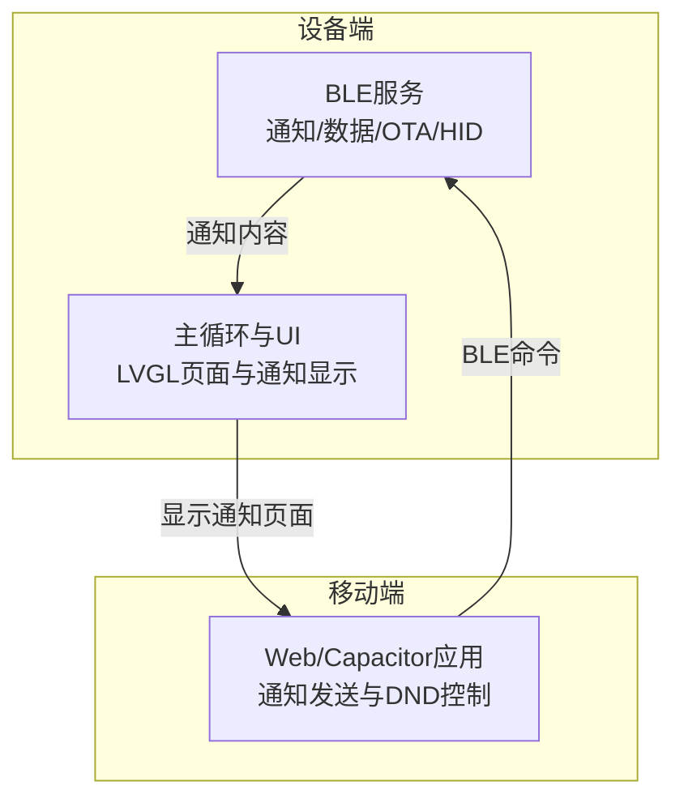
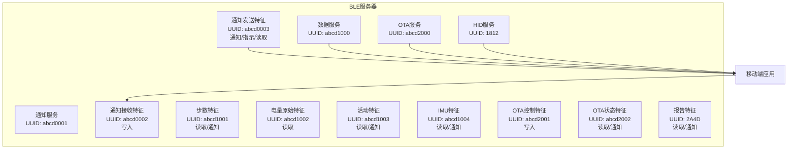
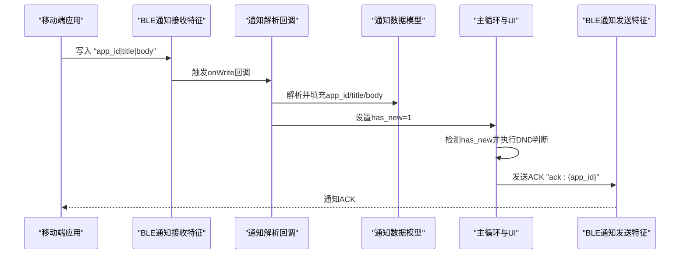
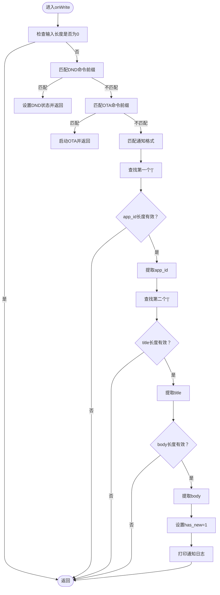
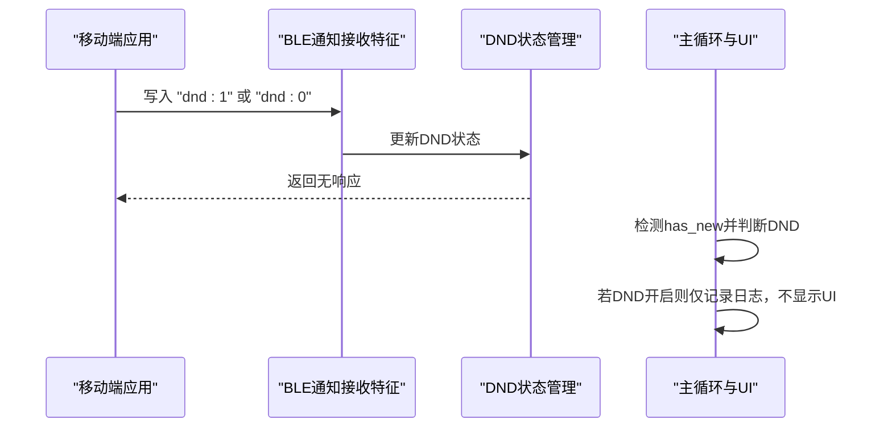
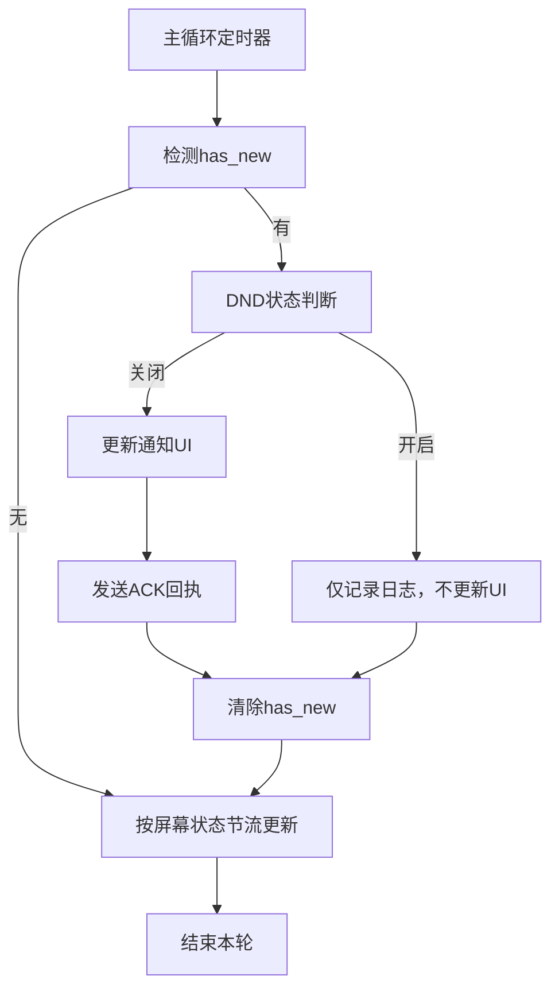
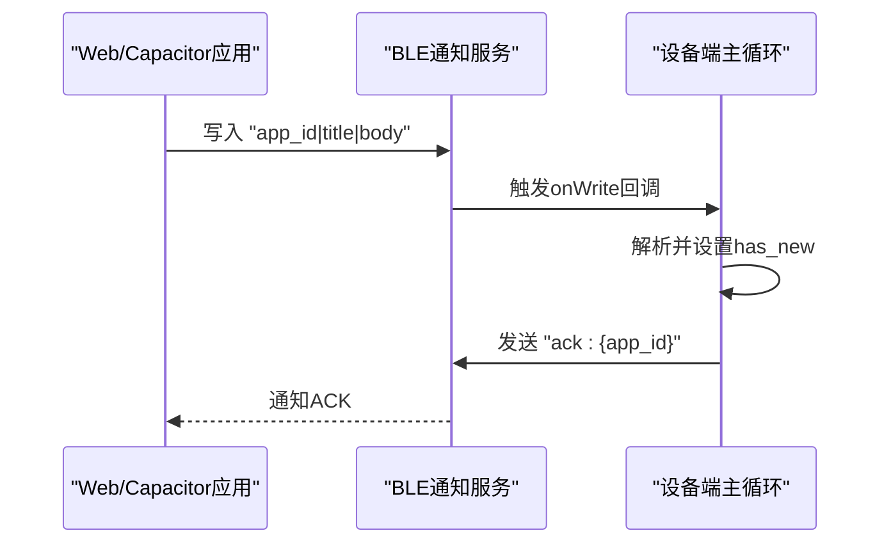
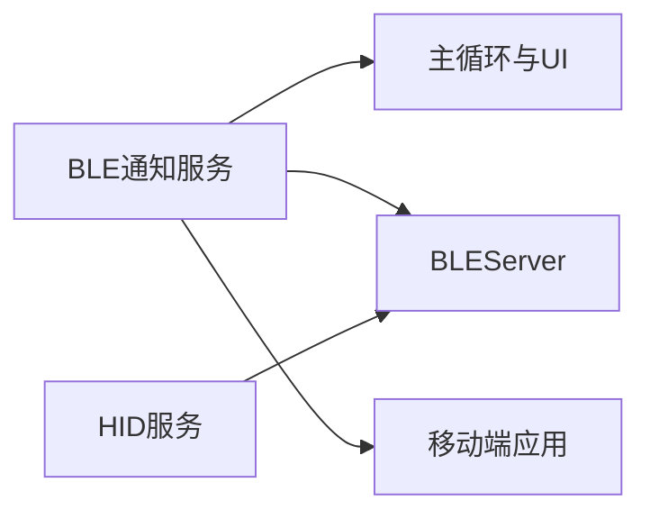

# 通知推送机制

<cite>
**本文档引用的文件**
- [src/service/ble_srv.h](file://src/service/ble_srv.h)
- [src/service/ble_srv.cpp](file://src/service/ble_srv.cpp)
- [src/service/ble_hid.h](file://src/service/ble_hid.h)
- [src/service/ble_hid.cpp](file://src/service/ble_hid.cpp)
- [src/main.cpp](file://src/main.cpp)
- [webapp/index.html](file://webapp/index.html)
- [webapp/android/app/src/main/assets/public/index.html](file://webapp/android/app/src/main/assets/public/index.html)
</cite>

## 目录
1. [简介](#简介)
2. [项目结构](#项目结构)
3. [核心组件](#核心组件)
4. [架构总览](#架构总览)
5. [详细组件分析](#详细组件分析)
6. [依赖关系分析](#依赖关系分析)
7. [性能考虑](#性能考虑)
8. [故障排除指南](#故障排除指南)
9. [结论](#结论)

## 简介
本文件系统性地阐述了智能手环项目的通知推送机制，涵盖BLE通知服务的实现原理、通知特征值配置、数据格式与传输协议、通知消息解析流程、Do Not Disturb（DND）功能、通知发送时机与频率控制、队列管理策略，以及与移动端应用的通知协议对接、错误处理与性能优化。文档同时提供完整的代码级架构图与序列图，帮助开发者快速理解并扩展通知功能。

## 项目结构
该项目采用分层模块化设计：
- 服务层：BLE服务（通知、数据、OTA、HID）
- 应用层：主循环与UI（LVGL），负责通知显示与交互
- 移动端：Web/Capacitor应用，负责向手环发送通知命令

图表来源
- [src/service/ble_srv.cpp](file://src/service/ble_srv.cpp#L250-L285)
- [src/main.cpp](file://src/main.cpp#L718-L722)
- [webapp/index.html](file://webapp/index.html#L579-L613)

章节来源
- [src/service/ble_srv.cpp](file://src/service/ble_srv.cpp#L250-L285)
- [src/main.cpp](file://src/main.cpp#L718-L722)
- [webapp/index.html](file://webapp/index.html#L579-L613)

## 核心组件
- BLE通知服务：定义通知接收与发送特征值，解析通知格式，支持ACK回执
- 通知数据模型：包含app_id、title、body与has_new标志位
- DND状态管理：通过命令切换DND模式，影响通知显示与日志输出
- 主循环通知处理：检测新通知、条件判断（DND）、回发ACK、更新UI
- 移动端协议对接：Web/Capacitor应用通过BLE发送通知与DND命令

章节来源
- [src/service/ble_srv.h](file://src/service/ble_srv.h#L22-L29)
- [src/service/ble_srv.cpp](file://src/service/ble_srv.cpp#L94-L122)
- [src/main.cpp](file://src/main.cpp#L766-L780)

## 架构总览
BLE通知服务由多个特性组成：
- 通知接收特征（写入）：用于接收来自移动端的通知命令
- 通知发送特征（通知/指示）：用于向移动端回发ACK等响应
- 数据服务：步数、电量、活动状态等遥测数据的双向通知
- OTA服务：固件更新触发与进度通知
- HID服务：媒体控制（播放/暂停、上一首/下一首、音量调节）

图表来源
- [src/service/ble_srv.cpp](file://src/service/ble_srv.cpp#L168-L187)
- [src/service/ble_srv.cpp](file://src/service/ble_srv.cpp#L190-L223)
- [src/service/ble_srv.cpp](file://src/service/ble_srv.cpp#L226-L248)
- [src/service/ble_hid.cpp](file://src/service/ble_hid.cpp#L67-L111)

章节来源
- [src/service/ble_srv.cpp](file://src/service/ble_srv.cpp#L168-L248)
- [src/service/ble_hid.cpp](file://src/service/ble_hid.cpp#L67-L111)

## 详细组件分析

### 通知特征值与协议
- 通知接收特征（写入）：用于接收移动端发送的命令，如通知内容、OTA命令、DND命令
- 通知发送特征（通知/指示/读取）：用于向移动端回发ACK等响应
- 通知格式：`app_id|title|body`，其中各字段长度限制为app_id≤15、title≤63、body≤127
- ACK回执：设备在收到通知后，会回发`ack:{app_id}`给移动端

图表来源
- [src/service/ble_srv.cpp](file://src/service/ble_srv.cpp#L63-L123)
- [src/service/ble_srv.cpp](file://src/service/ble_srv.cpp#L102-L122)
- [src/main.cpp](file://src/main.cpp#L766-L780)

章节来源
- [src/service/ble_srv.cpp](file://src/service/ble_srv.cpp#L168-L187)
- [src/service/ble_srv.cpp](file://src/service/ble_srv.cpp#L102-L122)
- [src/main.cpp](file://src/main.cpp#L766-L780)

### 通知解析流程与边界检查
解析逻辑遵循以下步骤：
1. 检查输入是否为空
2. 查找第一个`|`位置，确保其在有效范围内（app_id长度限制）
3. 查找第二个`|`位置，确保title长度限制满足
4. 剩余部分作为body，确保长度限制满足
5. 设置has_new标志位，触发后续处理

图表来源
- [src/service/ble_srv.cpp](file://src/service/ble_srv.cpp#L63-L123)
- [src/service/ble_srv.cpp](file://src/service/ble_srv.cpp#L102-L122)

章节来源
- [src/service/ble_srv.cpp](file://src/service/ble_srv.cpp#L63-L123)

### Do Not Disturb（DND）功能
- 状态管理：维护全局DND开关变量，支持查询与设置
- 条件判断：在主循环中检测has_new时，若DND开启则抑制通知显示但仍然记录日志
- 用户控制：移动端通过复选框切换DND，并发送`dnd:1`或`dnd:0`命令到设备
- 持久化：移动端本地存储DND状态，刷新页面时恢复

图表来源
- [src/service/ble_srv.cpp](file://src/service/ble_srv.cpp#L94-L100)
- [src/service/ble_srv.cpp](file://src/service/ble_srv.cpp#L392-L401)
- [src/main.cpp](file://src/main.cpp#L766-L780)
- [webapp/index.html](file://webapp/index.html#L1229-L1242)

章节来源
- [src/service/ble_srv.cpp](file://src/service/ble_srv.cpp#L94-L100)
- [src/service/ble_srv.cpp](file://src/service/ble_srv.cpp#L392-L401)
- [src/main.cpp](file://src/main.cpp#L766-L780)
- [webapp/index.html](file://webapp/index.html#L1229-L1242)

### 通知发送时机、频率控制与队列管理
- 发送时机：主循环检测到has_new后立即处理，随后回发ACK
- 频率控制：BLE广告间隔已降低以节省功耗；IMU特征每5秒上报一次，避免频繁通知
- 队列管理：采用单条通知模型（has_new标志位），同一时刻仅处理一条通知；若在DND开启时收到新通知，仍会记录日志但不更新UI
- 屏幕节流：屏幕关闭时降低更新频率，减少BLE与UI开销

图表来源
- [src/main.cpp](file://src/main.cpp#L766-L780)
- [src/main.cpp](file://src/main.cpp#L831-L871)

章节来源
- [src/main.cpp](file://src/main.cpp#L766-L780)
- [src/main.cpp](file://src/main.cpp#L831-L871)

### 与移动端应用的通知协议对接
- 通知发送：移动端通过通知接收特征写入`app_id|title|body`
- DND控制：移动端通过通知接收特征写入`dnd:1`或`dnd:0`
- ACK回执：设备侧回发`ack:{app_id}`，移动端监听通知发送特征以确认送达
- 协议一致性：移动端与设备端均使用相同的UUID与协议格式

图表来源
- [webapp/index.html](file://webapp/index.html#L579-L613)
- [webapp/android/app/src/main/assets/public/index.html](file://webapp/android/app/src/main/assets/public/index.html#L720-L782)
- [src/service/ble_srv.cpp](file://src/service/ble_srv.cpp#L102-L122)
- [src/main.cpp](file://src/main.cpp#L776-L780)

章节来源
- [webapp/index.html](file://webapp/index.html#L579-L613)
- [webapp/android/app/src/main/assets/public/index.html](file://webapp/android/app/src/main/assets/public/index.html#L720-L782)
- [src/service/ble_srv.cpp](file://src/service/ble_srv.cpp#L102-L122)
- [src/main.cpp](file://src/main.cpp#L776-L780)

### 错误处理机制
- 输入校验：解析前检查输入长度，避免空输入导致异常
- 边界检查：严格限制各字段长度，防止缓冲区溢出
- OTA错误：启动OTA失败时记录错误信息并通过串口输出
- 连接状态：仅在设备连接时进行通知与遥测更新，避免无效操作
- UI降级：当DND开启时，通知仅记录日志而不更新UI，保证用户体验

章节来源
- [src/service/ble_srv.cpp](file://src/service/ble_srv.cpp#L63-L123)
- [src/service/ble_srv.cpp](file://src/service/ble_srv.cpp#L82-L92)
- [src/main.cpp](file://src/main.cpp#L766-L780)

### 性能优化策略
- 广告节流：降低BLE广告间隔，减少功耗
- 屏幕节流：屏幕关闭时降低UI更新频率
- 特征节流：IMU特征每5秒上报一次，避免频繁通知
- MTU优化：设置MTU为256字节，提升传输效率
- 连接管理：仅在连接状态下进行通知与遥测更新

章节来源
- [src/service/ble_srv.cpp](file://src/service/ble_srv.cpp#L254-L282)
- [src/main.cpp](file://src/main.cpp#L831-L871)

## 依赖关系分析
BLE通知服务与其他模块的耦合关系如下：
- 与主循环：通过has_new标志位与UI页面联动
- 与BLE服务器：共享BLEServer指针，HID服务在通知服务之后初始化
- 与移动端：遵循统一的UUID与协议格式，确保跨平台兼容

图表来源
- [src/service/ble_srv.cpp](file://src/service/ble_srv.cpp#L250-L268)
- [src/service/ble_hid.cpp](file://src/service/ble_hid.cpp#L67-L111)
- [src/main.cpp](file://src/main.cpp#L718-L722)

章节来源
- [src/service/ble_srv.cpp](file://src/service/ble_srv.cpp#L250-L268)
- [src/service/ble_hid.cpp](file://src/service/ble_hid.cpp#L67-L111)
- [src/main.cpp](file://src/main.cpp#L718-L722)

## 性能考虑
- 传输效率：合理设置MTU与特征长度，避免频繁小包传输
- 功耗控制：降低广告间隔与UI更新频率，延长电池续航
- 资源占用：避免在中断或高频任务中进行复杂计算，保持主循环响应性
- 可靠性：ACK机制确保移动端确认收到通知，必要时可扩展重试策略

## 故障排除指南
- 通知未显示：检查DND状态是否开启；确认移动端已连接且特征订阅成功
- 通知格式错误：确认移动端发送格式为`app_id|title|body`，且各字段长度不超过限制
- OTA失败：检查URL有效性与网络连通性，查看串口输出的错误信息
- UI不更新：确认has_new标志位被正确设置，主循环定时器正常运行

章节来源
- [src/service/ble_srv.cpp](file://src/service/ble_srv.cpp#L94-L122)
- [src/main.cpp](file://src/main.cpp#L766-L780)

## 结论
该通知推送机制通过清晰的特征值划分、严格的协议格式与边界检查、完善的DND控制与ACK回执，实现了稳定可靠的移动端与设备端通信。配合频率控制与功耗优化策略，系统在保证用户体验的同时兼顾了资源消耗。未来可在现有基础上扩展批量通知、优先级队列与重试机制，进一步提升可靠性与扩展性。