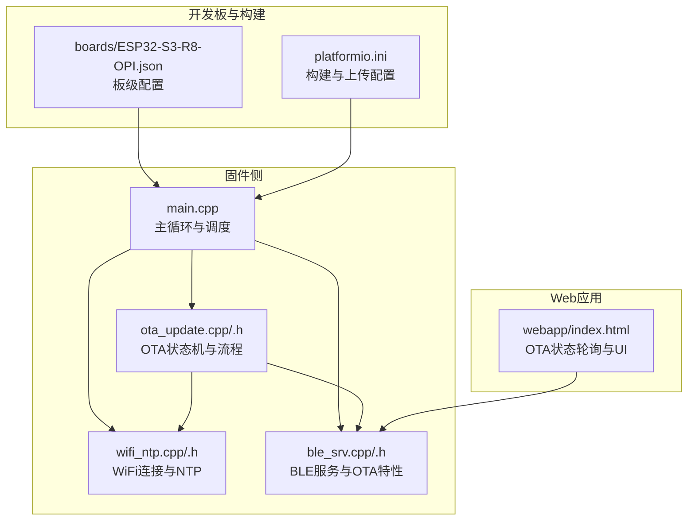
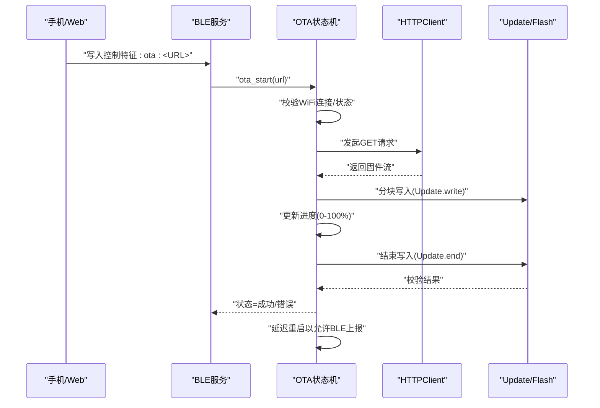
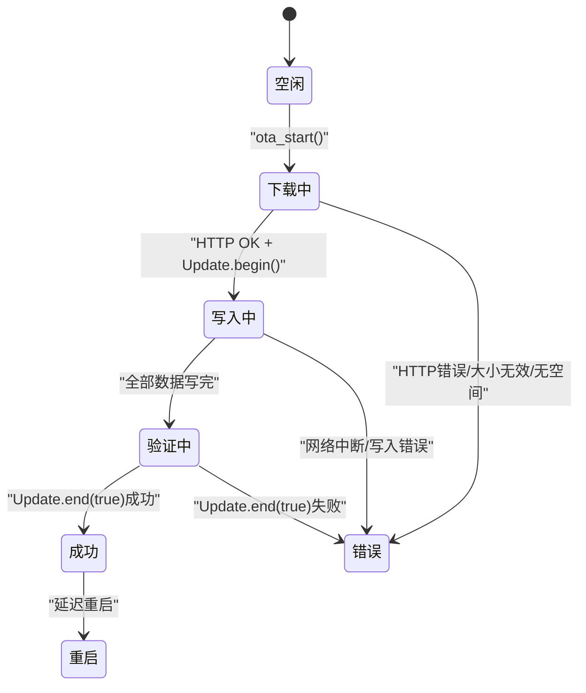
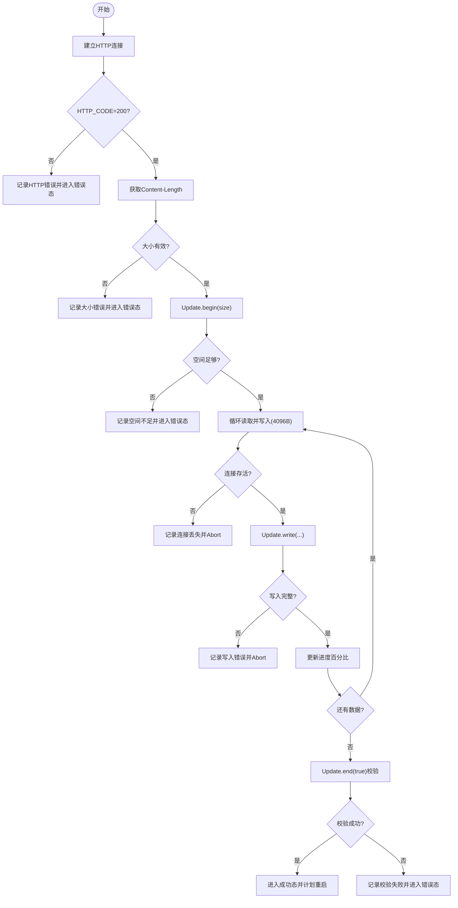
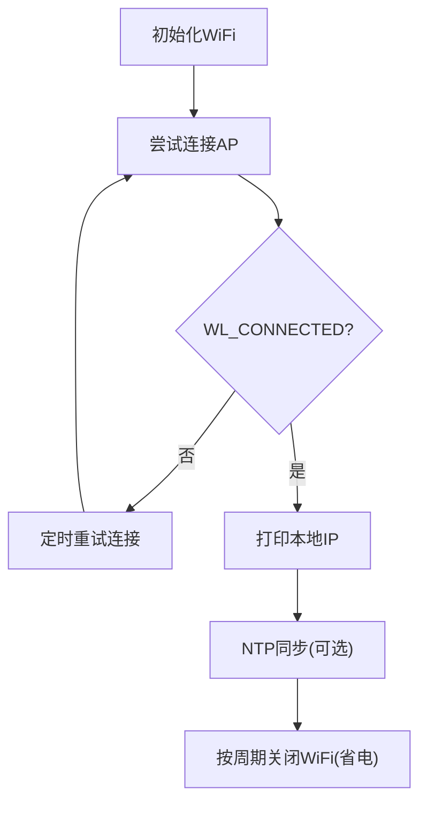
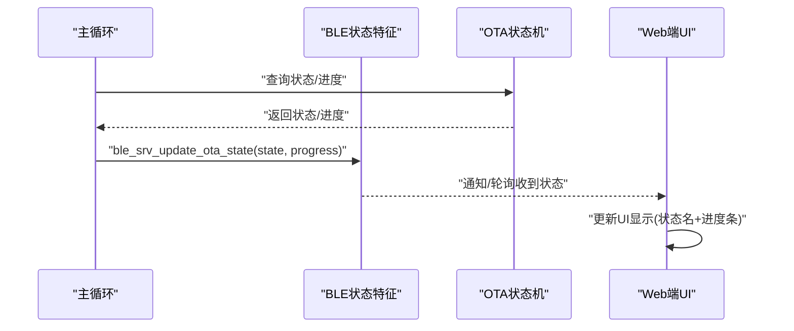
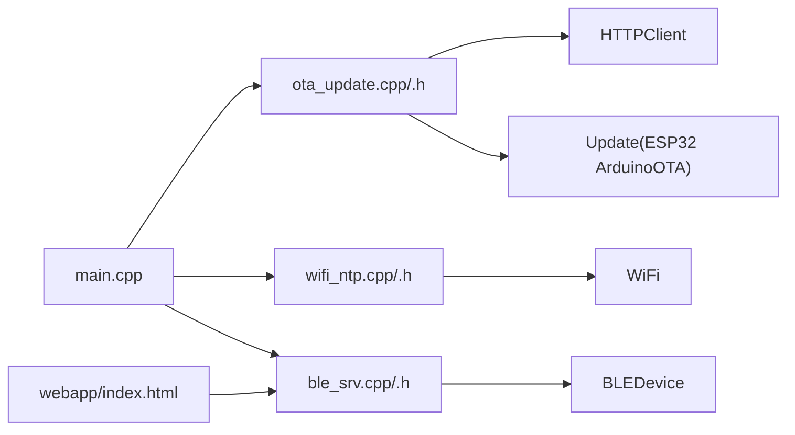

# OTA升级

<cite>
**本文引用的文件**
- [ota_update.h](file://src/service/ota_update.h)
- [ota_update.cpp](file://src/service/ota_update.cpp)
- [wifi_ntp.h](file://src/service/wifi_ntp.h)
- [wifi_ntp.cpp](file://src/service/wifi_ntp.cpp)
- [ble_srv.h](file://src/service/ble_srv.h)
- [ble_srv.cpp](file://src/service/ble_srv.cpp)
- [main.cpp](file://src/main.cpp)
- [index.html](file://webapp/index.html)
- [ESP32-S3-R8-OPI.json](file://boards/ESP32-S3-R8-OPI.json)
- [platformio.ini](file://platformio.ini)
</cite>

## 目录
1. [简介](#简介)
2. [项目结构](#项目结构)
3. [核心组件](#核心组件)
4. [架构总览](#架构总览)
5. [详细组件分析](#详细组件分析)
6. [依赖关系分析](#依赖关系分析)
7. [性能考量](#性能考量)
8. [故障排查指南](#故障排查指南)
9. [结论](#结论)
10. [附录](#附录)

## 简介
本文件面向SmartBracelet设备的OTA（空中下载）升级系统，系统基于ESP32-S3主控，通过BLE触发升级命令，使用HTTP下载固件镜像，利用ArduinoOTA底层接口进行分区写入与校验，支持进度上报与状态通知。本文档从工作原理、升级流程、安全机制、分发策略、错误处理与恢复、测试与质量保证等方面进行全面说明，帮助开发者与运维人员正确部署与维护OTA能力。

## 项目结构
SmartBracelet的OTA相关代码主要分布在以下模块：
- 固件侧（ESP32-S3）：OTA控制逻辑、WiFi连接管理、BLE服务、主循环调度
- Web应用（Capacitor/Android）：OTA状态轮询与UI展示
- 开发板与构建配置：平台定义、分区布局、上传参数

**图表来源**
- [main.cpp](file://src/main.cpp#L724-L741)
- [ota_update.cpp](file://src/service/ota_update.cpp#L54-L170)
- [wifi_ntp.cpp](file://src/service/wifi_ntp.cpp#L37-L60)
- [ble_srv.cpp](file://src/service/ble_srv.cpp#L230-L248)
- [index.html](file://webapp/index.html#L1464-L1487)
- [ESP32-S3-R8-OPI.json](file://boards/ESP32-S3-R8-OPI.json#L1-L40)
- [platformio.ini](file://platformio.ini#L14-L41)

**章节来源**
- [main.cpp](file://src/main.cpp#L724-L741)
- [ota_update.cpp](file://src/service/ota_update.cpp#L18-L40)
- [wifi_ntp.cpp](file://src/service/wifi_ntp.cpp#L21-L30)
- [ble_srv.cpp](file://src/service/ble_srv.cpp#L230-L248)
- [index.html](file://webapp/index.html#L1464-L1487)
- [ESP32-S3-R8-OPI.json](file://boards/ESP32-S3-R8-OPI.json#L1-L40)
- [platformio.ini](file://platformio.ini#L14-L41)

## 核心组件
- OTA状态机与流程控制：负责状态转换、进度计算、错误记录与重启调度
- HTTP下载与写入：基于HTTPClient与Update库，分块读取并写入Flash
- WiFi连接管理：确保升级前具备可用WiFi，支持断线重连与省电策略
- BLE服务：提供OTA控制特征与状态通知，支持手机端轮询或订阅
- 主循环集成：在主循环中驱动OTA状态机，向BLE上报状态变化

**章节来源**
- [ota_update.h](file://src/service/ota_update.h#L6-L14)
- [ota_update.cpp](file://src/service/ota_update.cpp#L18-L40)
- [wifi_ntp.h](file://src/service/wifi_ntp.h#L6-L25)
- [ble_srv.h](file://src/service/ble_srv.h#L36-L44)
- [main.cpp](file://src/main.cpp#L724-L741)

## 架构总览
OTA升级采用“BLE触发 + HTTP下载 + 分区写入 + 校验重启”的链路，整体流程如下：

**图表来源**
- [ble_srv.cpp](file://src/service/ble_srv.cpp#L82-L92)
- [ota_update.cpp](file://src/service/ota_update.cpp#L65-L170)
- [main.cpp](file://src/main.cpp#L729-L741)

## 详细组件分析

### OTA状态机与流程控制
- 状态定义：空闲、下载中、写入中、验证中、成功、错误
- 关键接口：
  - 启动：ota_start(url)，返回是否启动成功
  - 查询：ota_get_state()/ota_get_progress()/ota_get_error()
  - 循环：ota_loop()，在主循环中调用推进状态
- 进度计算：基于已写入字节数与Content-Length
- 错误处理：连接失败、大小无效、空间不足、写入失败、校验失败
- 成功后延迟重启：预留时间让BLE上报成功状态

**图表来源**
- [ota_update.h](file://src/service/ota_update.h#L6-L14)
- [ota_update.cpp](file://src/service/ota_update.cpp#L18-L40)
- [ota_update.cpp](file://src/service/ota_update.cpp#L106-L170)

**章节来源**
- [ota_update.h](file://src/service/ota_update.h#L6-L34)
- [ota_update.cpp](file://src/service/ota_update.cpp#L18-L40)
- [ota_update.cpp](file://src/service/ota_update.cpp#L106-L170)

### HTTP下载与分区写入
- HTTP客户端：设置重定向策略、超时、User-Agent
- 大小校验：通过getSize()获取Content-Length，若<=0则报错
- 分区准备：Update.begin(totalSize)判断剩余空间是否足够
- 分块写入：4096字节缓冲，逐块读取并写入Flash
- 连接健壮性：检测连接断开并中止写入
- 结束与校验：Update.end(true)执行校验，成功后进入成功态并计划重启

**图表来源**
- [ota_update.cpp](file://src/service/ota_update.cpp#L65-L170)

**章节来源**
- [ota_update.cpp](file://src/service/ota_update.cpp#L65-L170)

### WiFi连接管理
- 初始化：STA模式、断开旧连接、设置SSID/PASS
- 连接状态：周期性重试，连接成功后打印本地IP
- NTP同步：在WiFi可用时进行时间同步，用于日志与功能
- 省电策略：根据业务周期关闭WiFi无线电，避免不必要的功耗

**图表来源**
- [wifi_ntp.cpp](file://src/service/wifi_ntp.cpp#L21-L60)
- [wifi_ntp.cpp](file://src/service/wifi_ntp.cpp#L62-L92)
- [main.cpp](file://src/main.cpp#L748-L764)

**章节来源**
- [wifi_ntp.h](file://src/service/wifi_ntp.h#L6-L25)
- [wifi_ntp.cpp](file://src/service/wifi_ntp.cpp#L21-L122)
- [main.cpp](file://src/main.cpp#L748-L764)

### BLE服务与状态上报
- OTA服务UUID与特征：
  - 控制特征：接收“ota:<url>”命令
  - 状态特征：上报[状态, 进度百分比]
- 主循环集成：每帧查询OTA状态并通知BLE，确保UI实时更新
- Web端轮询：Web端订阅状态特征，解析状态名与进度，展示成功/失败

**图表来源**
- [ble_srv.cpp](file://src/service/ble_srv.cpp#L230-L248)
- [main.cpp](file://src/main.cpp#L729-L741)
- [index.html](file://webapp/index.html#L1464-L1487)

**章节来源**
- [ble_srv.h](file://src/service/ble_srv.h#L36-L44)
- [ble_srv.cpp](file://src/service/ble_srv.cpp#L230-L248)
- [main.cpp](file://src/main.cpp#L729-L741)
- [index.html](file://webapp/index.html#L1464-L1487)

### 升级包生成与打包（概念说明）
- 固件镜像创建：通过PlatformIO构建生成.bin/.elf
- 版本嵌入：FIRMWARE_VERSION宏在头文件中定义，便于识别版本
- 分区布局：板级JSON定义分区表与内存类型，确保升级分区可用
- 上传参数：platformio.ini配置上传端口、速度、框架等

注意：仓库未包含具体的升级包生成脚本，以上为概念性说明；实际打包需结合具体构建流程与服务器发布策略。

**章节来源**
- [ota_update.h](file://src/service/ota_update.h#L32-L34)
- [ESP32-S3-R8-OPI.json](file://boards/ESP32-S3-R8-OPI.json#L1-L40)
- [platformio.ini](file://platformio.ini#L14-L41)

## 依赖关系分析
- 组件耦合：
  - main.cpp依赖ota_update与wifi_ntp，负责调度与状态上报
  - ble_srv.cpp依赖ota_update，作为OTA控制入口
  - webapp通过BLE轮询状态特征，形成用户交互闭环
- 外部依赖：
  - ArduinoOTA（Update）：底层写入与校验
  - HTTPClient：HTTP下载
  - BLE库：BLE服务与特征
  - WiFi库：STA连接与状态

**图表来源**
- [main.cpp](file://src/main.cpp#L24-L26)
- [ota_update.cpp](file://src/service/ota_update.cpp#L1-L6)
- [wifi_ntp.cpp](file://src/service/wifi_ntp.cpp#L1-L4)
- [ble_srv.cpp](file://src/service/ble_srv.cpp#L1-L8)
- [index.html](file://webapp/index.html#L1464-L1487)

**章节来源**
- [main.cpp](file://src/main.cpp#L24-L26)
- [ota_update.cpp](file://src/service/ota_update.cpp#L1-L6)
- [wifi_ntp.cpp](file://src/service/wifi_ntp.cpp#L1-L4)
- [ble_srv.cpp](file://src/service/ble_srv.cpp#L1-L8)
- [index.html](file://webapp/index.html#L1464-L1487)

## 性能考量
- 下载吞吐：4096B分块写入，兼顾内存占用与吞吐；可根据网络状况调整缓冲大小
- 连接超时：HTTP超时30秒，建议在弱网环境下适当增大
- 省电策略：WiFi按周期关闭，避免长时间待机功耗
- UI刷新：BLE状态上报频率适中，避免频繁通知造成资源浪费

[本节为通用指导，无需特定文件引用]

## 故障排查指南
- 常见错误与定位：
  - WiFi未连接：ota_start会直接返回错误，检查wifi_ntp连接与重试逻辑
  - HTTP错误码：检查服务器可达性与URL有效性
  - 固件大小无效：确认服务器返回正确的Content-Length
  - 空间不足：检查分区表与剩余空间
  - 写入失败：检查网络稳定性与缓冲区大小
  - 校验失败：检查固件完整性与签名（如启用）
- 恢复机制：
  - 网络中断：连接断开时Abort并进入错误态，可重新发起OTA
  - 写入失败：终止写入并保留当前状态，等待修复后重试
  - 成功后延迟重启：确保BLE上报成功后再重启，避免状态不一致

**章节来源**
- [ota_update.cpp](file://src/service/ota_update.cpp#L18-L40)
- [ota_update.cpp](file://src/service/ota_update.cpp#L79-L170)
- [wifi_ntp.cpp](file://src/service/wifi_ntp.cpp#L37-L60)

## 结论
SmartBracelet的OTA系统以BLE为入口、HTTP为传输、ArduinoOTA为写入引擎，实现了从触发到完成的全链路升级能力。系统具备清晰的状态机、进度上报与错误处理机制，并结合WiFi省电策略与UI轮询，满足可观察性与可靠性需求。后续可在安全机制（签名/完整性）、分发策略（CDN/版本管理）与测试流程方面进一步完善。

[本节为总结性内容，无需特定文件引用]

## 附录

### 升级流程状态定义
- 空闲：初始态，等待OTA命令
- 下载中：已收到URL并开始HTTP下载
- 写入中：开始向Flash写入固件
- 验证中：写入完成后进行校验
- 成功：校验通过，计划重启
- 错误：任一环节失败，记录错误原因

**章节来源**
- [ota_update.h](file://src/service/ota_update.h#L6-L14)

### 安全机制（现状与建议）
- 现状：代码未体现固件签名验证与完整性校验
- 建议：
  - 引入固件签名与公钥校验
  - 使用SHA256等算法进行完整性校验
  - 回滚保护：保留上一个健康版本，失败自动回滚
  - 仅允许HTTPS与可信源

[本节为建议性内容，无需特定文件引用]

### 升级包分发策略（建议）
- 服务器配置：提供稳定HTTP下载，支持断点续传与重试
- CDN部署：就近加速，降低丢包率
- 版本管理：语义化版本号，支持灰度与回滚
- 签名与校验：服务端提供签名与哈希，客户端验证

[本节为建议性内容，无需特定文件引用]

### 测试与质量保证（建议）
- 单元测试：模拟网络异常、写入失败、校验失败场景
- 回归测试：不同固件版本间的升级兼容性
- 灰度发布：小范围设备先行升级，监控成功率与稳定性
- 日志与遥测：记录升级全过程，便于问题定位

[本节为建议性内容，无需特定文件引用]