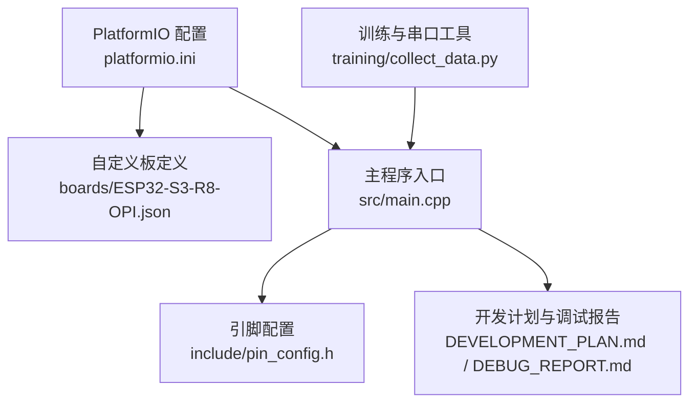
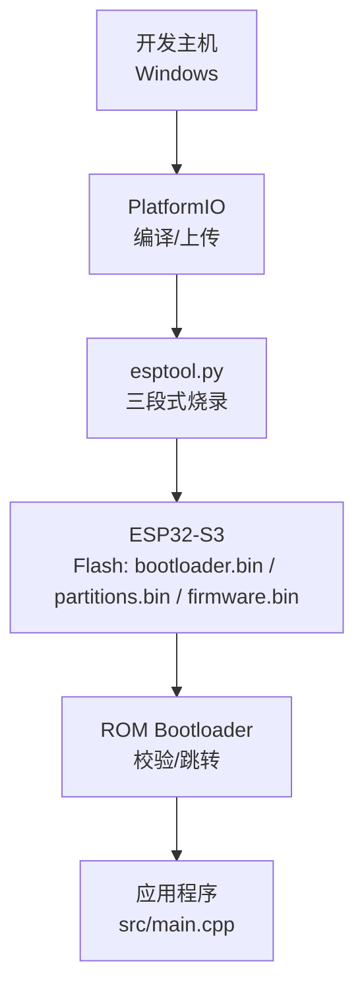
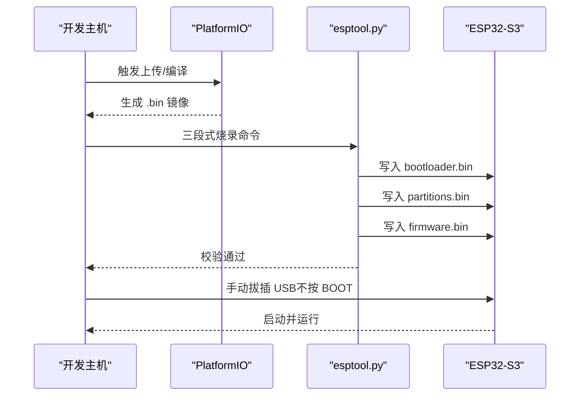
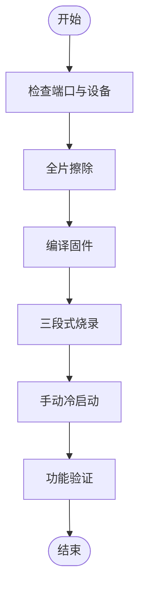
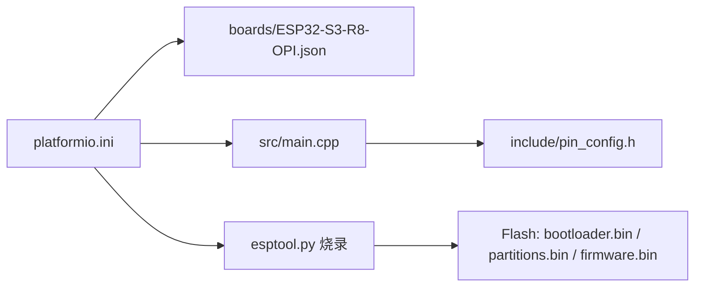
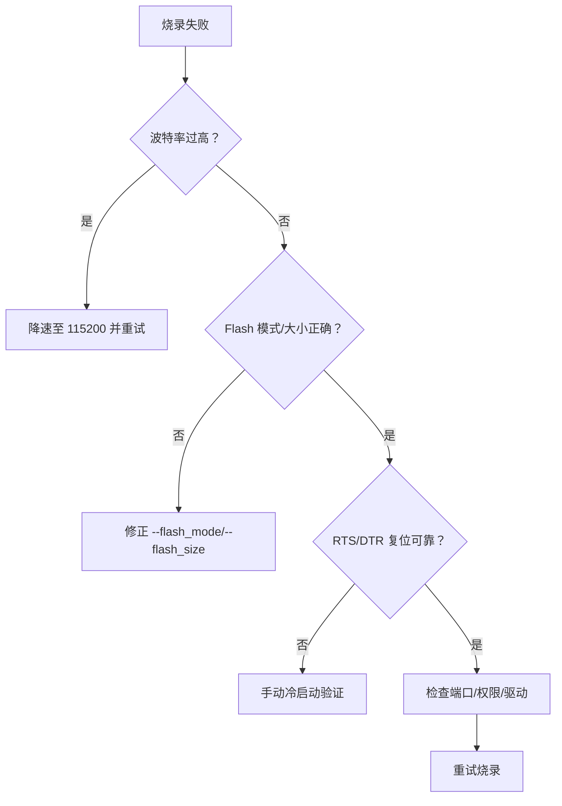

# 固件烧录

<cite>
**本文引用的文件**
- [platformio.ini](file://platformio.ini)
- [ESP32-S3-R8-OPI.json](file://boards/ESP32-S3-R8-OPI.json)
- [main.cpp](file://src/main.cpp)
- [pin_config.h](file://include/pin_config.h)
- [DEVELOPMENT_PLAN.md](file://DEVELOPMENT_PLAN.md)
- [DEBUG_REPORT.md](file://DEBUG_REPORT.md)
- [collect_data.py](file://training/collect_data.py)
- [requirements.txt](file://training/requirements.txt)
</cite>

## 目录
1. [简介](#简介)
2. [项目结构](#项目结构)
3. [核心组件](#核心组件)
4. [架构总览](#架构总览)
5. [详细组件分析](#详细组件分析)
6. [依赖关系分析](#依赖关系分析)
7. [性能考虑](#性能考虑)
8. [故障排查指南](#故障排查指南)
9. [结论](#结论)
10. [附录](#附录)

## 简介
本指南面向 SmartBracelet 项目的固件烧录与调试，目标是帮助开发者在 Windows 平台上完成稳定的固件烧录流程，涵盖 PlatformIO 开发环境安装与配置、编译与上传参数、硬件连接与电源管理、以及批量与单机烧录的实践方法。同时提供常见问题的诊断与解决方案，确保从开发到量产的一致性与可靠性。

## 项目结构
SmartBracelet 采用 PlatformIO 项目组织方式，核心目录与文件如下：
- 平台与环境配置：platformio.ini
- 自定义开发板定义：boards/ESP32-S3-R8-OPI.json
- 主程序入口与硬件接口：src/main.cpp、include/pin_config.h
- 烧录与调试经验总结：DEVELOPMENT_PLAN.md、DEBUG_REPORT.md
- 辅助工具（串口采集与训练）：training/collect_data.py、training/requirements.txt

**图表来源**
- [platformio.ini](file://platformio.ini#L11-L41)
- [ESP32-S3-R8-OPI.json](file://boards/ESP32-S3-R8-OPI.json#L1-L40)
- [main.cpp](file://src/main.cpp#L1-L120)
- [pin_config.h](file://include/pin_config.h#L1-L41)
- [DEVELOPMENT_PLAN.md](file://DEVELOPMENT_PLAN.md#L489-L506)
- [DEBUG_REPORT.md](file://DEBUG_REPORT.md#L207-L240)
- [collect_data.py](file://training/collect_data.py#L1-L96)

**章节来源**
- [platformio.ini](file://platformio.ini#L11-L41)
- [ESP32-S3-R8-OPI.json](file://boards/ESP32-S3-R8-OPI.json#L1-L40)
- [main.cpp](file://src/main.cpp#L1-L120)
- [pin_config.h](file://include/pin_config.h#L1-L41)
- [DEVELOPMENT_PLAN.md](file://DEVELOPMENT_PLAN.md#L489-L506)
- [DEBUG_REPORT.md](file://DEBUG_REPORT.md#L207-L240)
- [collect_data.py](file://training/collect_data.py#L1-L96)

## 核心组件
- PlatformIO 环境与上传参数
  - 默认环境、平台版本、框架、监控与上传波特率、上传端口、Flash 模式等均在 platformio.ini 中集中配置。
- 自定义开发板定义
  - boards/ESP32-S3-R8-OPI.json 提供了 Flash 大小、内存类型、分区表、上传速度等硬件相关参数。
- 主程序与硬件接口
  - src/main.cpp 负责初始化显示、触摸、传感器、电源管理、BLE/WiFi 等模块，并通过 include/pin_config.h 管理引脚映射。
- 烧录与调试经验
  - DEVELOPMENT_PLAN.md 与 DEBUG_REPORT.md 提供了 esptool.py 手动三段式烧录、波特率选择、eFuse 与 Flash 模式、复位策略等关键经验。

**章节来源**
- [platformio.ini](file://platformio.ini#L14-L36)
- [ESP32-S3-R8-OPI.json](file://boards/ESP32-S3-R8-OPI.json#L24-L36)
- [main.cpp](file://src/main.cpp#L615-L722)
- [pin_config.h](file://include/pin_config.h#L1-L41)
- [DEVELOPMENT_PLAN.md](file://DEVELOPMENT_PLAN.md#L489-L506)
- [DEBUG_REPORT.md](file://DEBUG_REPORT.md#L207-L240)

## 架构总览
下图展示了从开发到烧录的关键交互：PlatformIO 生成固件镜像，通过 esptool.py 将 bootloader、分区表与固件写入 Flash；设备上电后从 Flash 启动并进入运行态。

**图表来源**
- [DEVELOPMENT_PLAN.md](file://DEVELOPMENT_PLAN.md#L493-L501)
- [DEBUG_REPORT.md](file://DEBUG_REPORT.md#L213-L231)
- [platformio.ini](file://platformio.ini#L22-L24)

## 详细组件分析

### PlatformIO 开发环境安装与配置
- Python 与 PlatformIO Core
  - 安装 Python 与 PlatformIO Core，确保命令行可用。
- VS Code 插件
  - 安装 PlatformIO IDE 扩展，打开项目根目录后自动加载 platformio.ini。
- 项目配置要点
  - 默认环境、平台版本、框架、监控与上传波特率、上传端口、Flash 模式、构建标志与库依赖等集中在 platformio.ini。
  - 若使用自定义板定义，boards/ESP32-S3-R8-OPI.json 提供额外硬件参数（Flash 大小、内存类型、分区表、上传速度等）。

**章节来源**
- [platformio.ini](file://platformio.ini#L11-L41)
- [ESP32-S3-R8-OPI.json](file://boards/ESP32-S3-R8-OPI.json#L1-L40)

### 烧录工具与连接
- 推荐使用 esptool.py 直接烧录
  - 使用 PowerShell 脚本调用 esptool.py，指定芯片型号、端口、波特率、Flash 模式与频率、Flash 大小，并分三段写入 bootloader、分区表与固件。
  - 注意：eFuse 锁定 QIO 模式，必须使用 --flash_mode qio；波特率使用 115200 以避免“包内容传输停止”错误。
- 上传端口与速度
  - platformio.ini 中 upload_port 与 upload_speed 已设置为 COM9 与 115200，确保与实际硬件一致。
- 复位策略
  - 使用 --after hard_reset，确保 esptool.py 完成时的 RTS 脉冲可靠触发冷启动。

**图表来源**
- [DEVELOPMENT_PLAN.md](file://DEVELOPMENT_PLAN.md#L493-L501)
- [DEBUG_REPORT.md](file://DEBUG_REPORT.md#L213-L231)

**章节来源**
- [DEVELOPMENT_PLAN.md](file://DEVELOPMENT_PLAN.md#L489-L506)
- [DEBUG_REPORT.md](file://DEBUG_REPORT.md#L207-L240)
- [platformio.ini](file://platformio.ini#L22-L24)

### 固件编译流程
- 项目构建
  - PlatformIO 根据 platformio.ini 与 boards/ESP32-S3-R8-OPI.json 解析平台、板型、框架、库依赖与构建标志。
- 编译参数设置
  - 监控波特率 monitor_speed、上传波特率 upload_speed、Flash 模式 board_build.flash_mode、包含路径 -Iinclude、库目录 lib_extra_dirs 等。
- 输出文件格式
  - 生成 bootloader.bin、partitions.bin、firmware.bin 三段镜像，用于 esptool.py 三段式烧录。

**章节来源**
- [platformio.ini](file://platformio.ini#L14-L41)
- [ESP32-S3-R8-OPI.json](file://boards/ESP32-S3-R8-OPI.json#L2-L7)
- [DEVELOPMENT_PLAN.md](file://DEVELOPMENT_PLAN.md#L493-L501)

### 烧录前准备
- 硬件连接检查
  - 确认 USB 线质量良好，避免带电插拔导致 Flash 写入中断。
  - 若使用自定义板定义，注意 eFuse 与 Flash 模式（QIO）与 Flash 大小（16MB）。
- 串口配置
  - platformio.ini 中 monitor_speed 与 upload_speed 均为 115200，确保与设备一致。
- 电源管理
  - 烧录完成后手动拔插 USB 线进行冷启动，避免 RTS/DTR 复位电路不可靠导致无法从 Flash 启动。

**章节来源**
- [DEBUG_REPORT.md](file://DEBUG_REPORT.md#L207-L240)
- [platformio.ini](file://platformio.ini#L18-L24)
- [ESP32-S3-R8-OPI.json](file://boards/ESP32-S3-R8-OPI.json#L30-L36)

### 批量烧录与单机烧录
- 单机烧录
  - 使用 esptool.py 三段式烧录，适用于一次性验证与最小化流程。
- 批量烧录
  - 可基于 PowerShell 脚本封装 esptool.py 命令，循环遍历多个端口与设备，结合日志记录与校验结果，形成自动化流水线。
  - 建议在脚本中加入：
    - 降低上传波特率至 115200
    - 全片擦除（erase_flash）
    - 三段式写入（bootloader、partitions、firmware）
    - 手动冷启动验证

**图表来源**
- [DEBUG_REPORT.md](file://DEBUG_REPORT.md#L334-L344)
- [DEVELOPMENT_PLAN.md](file://DEVELOPMENT_PLAN.md#L493-L501)

**章节来源**
- [DEBUG_REPORT.md](file://DEBUG_REPORT.md#L332-L344)
- [DEVELOPMENT_PLAN.md](file://DEVELOPMENT_PLAN.md#L489-L506)

### 烧录流程与关键参数
- 三段式烧录顺序
  - 0x0 bootloader.bin
  - 0x8000 partitions.bin
  - 0x10000 firmware.bin
- 关键参数
  - --flash_mode qio（eFuse 锁定 QIO）
  - --flash_freq 80m
  - --flash_size 16MB
  - --baud 115200
  - --after hard_reset

**章节来源**
- [DEVELOPMENT_PLAN.md](file://DEVELOPMENT_PLAN.md#L493-L501)
- [DEBUG_REPORT.md](file://DEBUG_REPORT.md#L213-L231)

## 依赖关系分析
- 硬件与软件耦合
  - platformio.ini 与 boards/ESP32-S3-R8-OPI.json 共同决定 Flash 大小、内存类型、分区表与上传速度。
  - src/main.cpp 依赖 include/pin_config.h 的引脚映射，初始化显示、触摸、传感器与电源管理模块。
- 烧录工具链
  - PlatformIO 生成二进制镜像，esptool.py 负责 Flash 写入与校验，最终由设备从 Flash 启动。

**图表来源**
- [platformio.ini](file://platformio.ini#L14-L41)
- [ESP32-S3-R8-OPI.json](file://boards/ESP32-S3-R8-OPI.json#L1-L40)
- [main.cpp](file://src/main.cpp#L1-L120)
- [pin_config.h](file://include/pin_config.h#L1-L41)

**章节来源**
- [platformio.ini](file://platformio.ini#L14-L41)
- [ESP32-S3-R8-OPI.json](file://boards/ESP32-S3-R8-OPI.json#L1-L40)
- [main.cpp](file://src/main.cpp#L615-L722)
- [pin_config.h](file://include/pin_config.h#L1-L41)

## 性能考虑
- 上传波特率对稳定性的影响
  - 高波特率（如 921600）在部分硬件上易出现“包内容传输停止”错误；建议统一使用 115200。
- Flash 模式与频率
  - eFuse 锁定 QIO 模式，必须使用 --flash_mode qio；Flash 频率设置为 80MHz。
- 内存与 IRAM 溢出风险
  - 精简库依赖与优化构建标志，避免 TG0WDT 复位与 IRAM 溢出。

**章节来源**
- [DEBUG_REPORT.md](file://DEBUG_REPORT.md#L252-L259)
- [DEBUG_REPORT.md](file://DEBUG_REPORT.md#L267-L272)
- [DEVELOPMENT_PLAN.md](file://DEVELOPMENT_PLAN.md#L509-L514)

## 故障排查指南
- 烧录失败
  - 降低 upload_speed 至 115200，使用 esptool.py 全片擦除后三段式烧录。
  - 确认 --flash_mode qio 与 --flash_size 16MB 正确。
- 设备识别错误
  - 确认 upload_port 与实际端口一致；若 RTS/DTR 复位不可靠，上传后手动拔插 USB 冷启动。
- 权限问题
  - 使用管理员权限运行 PowerShell；确保串口驱动与权限正确。
- 启动循环或黑屏
  - 先用纯 GPIO 背光闪烁测试确认芯片运行，再逐步恢复显示与串口输出。
- 串口输出丢失
  - 在程序中添加 USB CDC 枚举超时逻辑，避免永久阻塞。

**图表来源**
- [DEBUG_REPORT.md](file://DEBUG_REPORT.md#L252-L259)
- [DEBUG_REPORT.md](file://DEBUG_REPORT.md#L267-L277)
- [DEBUG_REPORT.md](file://DEBUG_REPORT.md#L279-L291)

**章节来源**
- [DEBUG_REPORT.md](file://DEBUG_REPORT.md#L332-L344)
- [DEBUG_REPORT.md](file://DEBUG_REPORT.md#L207-L240)
- [DEBUG_REPORT.md](file://DEBUG_REPORT.md#L252-L259)
- [DEBUG_REPORT.md](file://DEBUG_REPORT.md#L267-L277)
- [DEBUG_REPORT.md](file://DEBUG_REPORT.md#L279-L291)

## 结论
通过 PlatformIO 与 esptool.py 的组合，配合正确的波特率、Flash 模式与分区策略，SmartBracelet 可实现稳定可靠的固件烧录。建议在开发与量产中统一使用 115200 波特率、QIO 模式与三段式烧录流程，并在出现问题时遵循“全片擦除 → 重新编译 → 三段式烧录 → 手动冷启动”的恢复流程。

## 附录
- 串口数据采集辅助
  - training/collect_data.py 可通过串口采集 IMU 数据并标注标签，便于后续模型训练与验证。
- 依赖与环境
  - training/requirements.txt 提供了训练与串口采集所需的 Python 依赖。

**章节来源**
- [collect_data.py](file://training/collect_data.py#L1-L96)
- [requirements.txt](file://training/requirements.txt#L1-L5)