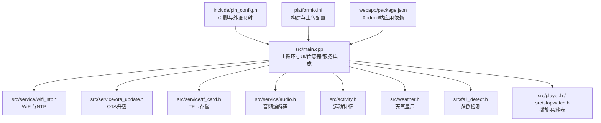
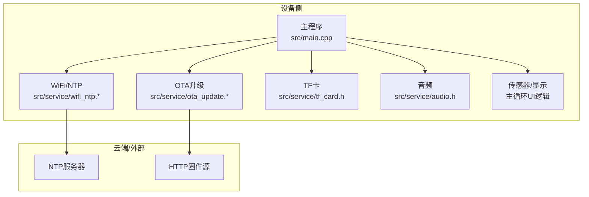
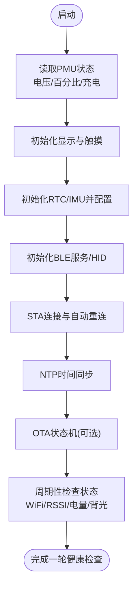
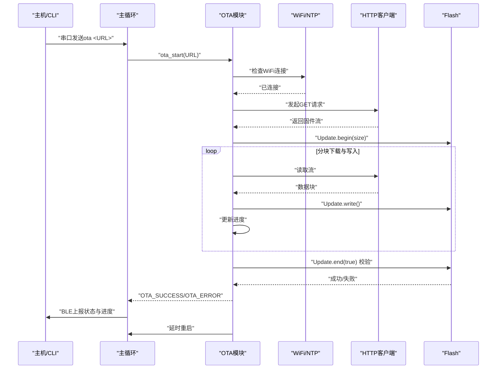
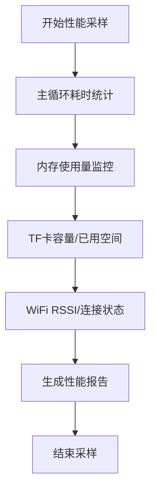
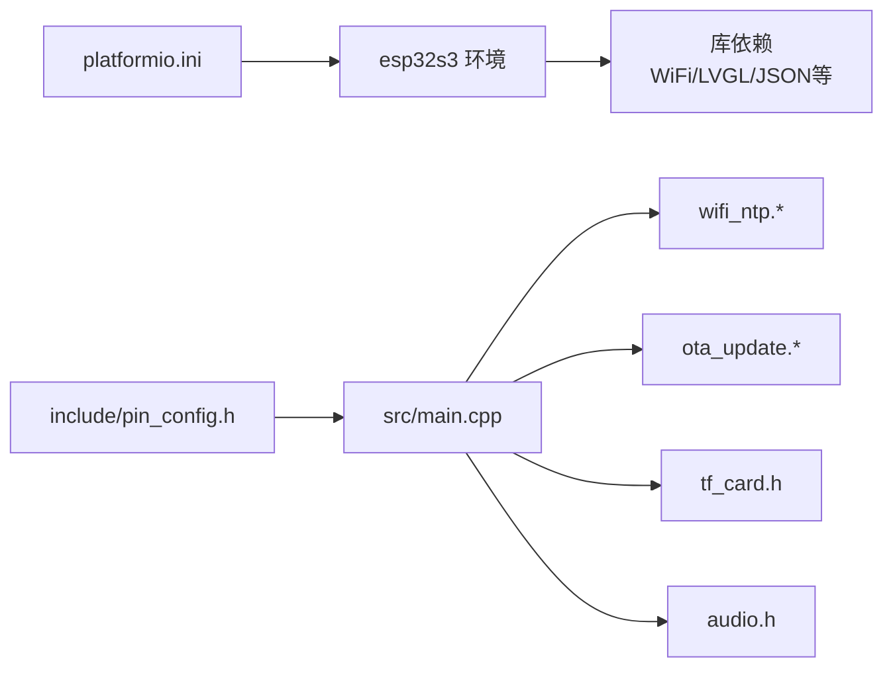

# 系统维护

<cite>
**本文引用的文件**
- [src/main.cpp](file://src/main.cpp)
- [platformio.ini](file://platformio.ini)
- [include/pin_config.h](file://include/pin_config.h)
- [src/service/ota_update.h](file://src/service/ota_update.h)
- [src/service/ota_update.cpp](file://src/service/ota_update.cpp)
- [src/service/wifi_ntp.h](file://src/service/wifi_ntp.h)
- [src/service/wifi_ntp.cpp](file://src/service/wifi_ntp.cpp)
- [src/service/tf_card.h](file://src/service/tf_card.h)
- [src/service/audio.h](file://src/service/audio.h)
- [src/activity.h](file://src/activity.h)
- [src/weather.h](file://src/weather.h)
- [src/fall_detect.h](file://src/fall_detect.h)
- [src/player.h](file://src/player.h)
- [src/stopwatch.h](file://src/stopwatch.h)
- [webapp/package.json](file://webapp/package.json)
</cite>

## 目录
1. [简介](#简介)
2. [项目结构](#项目结构)
3. [核心组件](#核心组件)
4. [架构总览](#架构总览)
5. [详细组件分析](#详细组件分析)
6. [依赖关系分析](#依赖关系分析)
7. [性能考量](#性能考量)
8. [故障排查指南](#故障排查指南)
9. [结论](#结论)
10. [附录](#附录)

## 简介
本指南面向SmartBracelet系统的运维与维护人员，提供从硬件状态监控、软件运行状态检查到资源使用评估的系统健康检查流程；覆盖固件版本管理、兼容性检查与升级路径规划；阐述配置管理策略（用户配置保存、默认配置恢复、配置迁移）；给出性能监控方案（CPU使用率、内存占用、存储空间、网络连接等）；详解日志管理（日志级别、收集、分析与故障定位）；并列出定期维护任务（系统清理、缓存管理、数据库优化等），以及维护工具使用方法（调试接口、诊断命令、性能分析工具）。

## 项目结构
SmartBracelet采用嵌入式C++开发，主程序位于src目录，服务模块集中在src/service子目录，硬件引脚定义在include/pin_config.h中，构建配置在platformio.ini中，配套的Android端应用位于webapp目录。

**图示来源**
- [src/main.cpp](file://src/main.cpp#L615-L722)
- [src/service/wifi_ntp.cpp](file://src/service/wifi_ntp.cpp#L21-L30)
- [src/service/ota_update.cpp](file://src/service/ota_update.cpp#L18-L40)
- [src/service/tf_card.h](file://src/service/tf_card.h#L4-L8)
- [src/service/audio.h](file://src/service/audio.h#L4-L22)
- [src/activity.h](file://src/activity.h#L4-L12)
- [src/weather.h](file://src/weather.h#L4-L6)
- [src/fall_detect.h](file://src/fall_detect.h#L16-L29)
- [src/player.h](file://src/player.h#L4-L5)
- [src/stopwatch.h](file://src/stopwatch.h#L4-L5)
- [include/pin_config.h](file://include/pin_config.h#L1-L41)
- [platformio.ini](file://platformio.ini#L14-L36)
- [webapp/package.json](file://webapp/package.json#L15-L20)

**章节来源**
- [src/main.cpp](file://src/main.cpp#L615-L722)
- [platformio.ini](file://platformio.ini#L14-L36)
- [include/pin_config.h](file://include/pin_config.h#L1-L41)

## 核心组件
- 主循环与UI：负责LVGL界面、触摸输入、传感器数据采集与展示、BLE服务、OTA状态上报等。
- WiFi/NTP服务：负责STA连接、自动重连、时间同步、RSSI获取、按需开关WiFi以省电。
- OTA升级：基于HTTP下载固件镜像，使用ESP-IDF Update进行写入与校验，支持进度与错误上报。
- 存储服务：TF卡初始化与容量查询，用于日志、媒体或AI训练数据的落盘。
- 音频服务：I2S驱动的音频播放与录音，支持音量控制与播放状态查询。
- 运动与天气：运动特征提取与展示、天气信息获取与刷新。
- 跌倒检测：基于加速度计的状态机检测自由落体、冲击与静止确认。
- 页面与控件：播放器、秒表等页面的UI与交互。

**章节来源**
- [src/main.cpp](file://src/main.cpp#L406-L419)
- [src/service/wifi_ntp.h](file://src/service/wifi_ntp.h#L11-L24)
- [src/service/ota_update.h](file://src/service/ota_update.h#L6-L35)
- [src/service/tf_card.h](file://src/service/tf_card.h#L4-L8)
- [src/service/audio.h](file://src/service/audio.h#L4-L22)
- [src/activity.h](file://src/activity.h#L4-L12)
- [src/weather.h](file://src/weather.h#L4-L6)
- [src/fall_detect.h](file://src/fall_detect.h#L6-L29)
- [src/player.h](file://src/player.h#L4-L5)
- [src/stopwatch.h](file://src/stopwatch.h#L4-L5)

## 架构总览
系统采用“主循环+服务模块”的分层设计：主程序负责调度与状态机推进，各服务模块独立封装网络、存储、音频等功能，通过统一的接口与主循环交互。

**图示来源**
- [src/main.cpp](file://src/main.cpp#L724-L764)
- [src/service/wifi_ntp.cpp](file://src/service/wifi_ntp.cpp#L62-L92)
- [src/service/ota_update.cpp](file://src/service/ota_update.cpp#L54-L170)

## 详细组件分析

### 组件A：系统健康检查流程
- 硬件状态监控
  - 电源管理：读取电池电压与百分比、充电状态、背光开关；通过PMU寄存器读数判断供电状态。
  - 触摸与显示：初始化CST816S触摸与ST7789屏幕，清除异常像素区域，确保显示正常。
  - 传感器：初始化PCF85063 RTC与QMI8658 IMU，配置采样参数并启用传感器。
- 软件运行状态检查
  - BLE服务：初始化BLE服务与HID，上报OTA状态与通知ACK。
  - WiFi/NTP：STA连接、自动重连、时间同步、周期性开关以省电。
  - OTA状态：状态机推进、进度上报、错误码记录。
- 资源使用情况评估
  - 电池电量与充电状态：用于评估续航与功耗策略。
  - WiFi RSSI：评估信号质量与切换策略。
  - 屏幕背光与超时：根据活动检测与超时策略降低功耗。

**图示来源**
- [src/main.cpp](file://src/main.cpp#L615-L722)
- [src/service/wifi_ntp.cpp](file://src/service/wifi_ntp.cpp#L21-L60)
- [src/service/ota_update.cpp](file://src/service/ota_update.cpp#L42-L53)

**章节来源**
- [src/main.cpp](file://src/main.cpp#L421-L508)
- [src/main.cpp](file://src/main.cpp#L615-L722)
- [src/service/wifi_ntp.cpp](file://src/service/wifi_ntp.cpp#L94-L121)

### 组件B：版本控制系统与升级路径
- 固件版本管理
  - 版本字符串在头文件中定义，随构建嵌入固件。
- 兼容性检查
  - OTA前检查WiFi连接与可用空间；下载过程中断则回滚并记录错误。
- 升级路径规划
  - 通过HTTP URL触发下载，写入Flash后校验并延时重启，BLE上报成功后再复位。

**图示来源**
- [src/main.cpp](file://src/main.cpp#L782-L800)
- [src/service/ota_update.cpp](file://src/service/ota_update.cpp#L18-L170)
- [src/service/wifi_ntp.cpp](file://src/service/wifi_ntp.cpp#L62-L92)

**章节来源**
- [src/service/ota_update.h](file://src/service/ota_update.h#L32-L35)
- [src/service/ota_update.cpp](file://src/service/ota_update.cpp#L18-L170)
- [src/main.cpp](file://src/main.cpp#L724-L764)

### 组件C：配置管理策略
- 用户配置保存
  - 通过BLE服务与手机端应用交互，实现配置下发与持久化（具体实现由BLE服务与应用共同完成）。
- 默认配置恢复
  - 若检测到配置损坏或缺失，可通过BLE下发默认值或执行恢复流程。
- 配置迁移
  - 当固件版本升级导致配置格式变更时，应在OTA完成后执行迁移逻辑（例如在BLE服务中处理新字段）。

**章节来源**
- [src/main.cpp](file://src/main.cpp#L718-L719)
- [src/service/ota_update.cpp](file://src/service/ota_update.cpp#L155-L170)

### 组件D：性能监控方案
- CPU使用率
  - 通过主循环定时调用LVGL计时器与各服务循环，结合串口输出统计每轮耗时。
- 内存占用
  - 使用串口打印内存信息（如可用堆大小）辅助评估；避免大对象栈上分配。
- 存储空间
  - TF卡容量与已用空间查询，用于日志与数据落盘容量规划。
- 网络连接
  - WiFi RSSI与连接状态，NTP同步成功率与周期性开关策略。

**图示来源**
- [src/main.cpp](file://src/main.cpp#L724-L764)
- [src/service/tf_card.h](file://src/service/tf_card.h#L6-L8)
- [src/service/wifi_ntp.cpp](file://src/service/wifi_ntp.cpp#L118-L121)

**章节来源**
- [src/service/tf_card.h](file://src/service/tf_card.h#L6-L8)
- [src/service/wifi_ntp.cpp](file://src/service/wifi_ntp.cpp#L118-L121)

### 组件E：日志管理
- 日志级别设置
  - 使用串口输出（USBSerial）进行调试与运行日志记录，建议区分不同模块的日志等级。
- 日志收集
  - 通过串口监视器或IDE的串口过滤器收集日志。
- 日志分析
  - 关注OTA错误、WiFi断连、NTP失败、PMU异常等关键事件。
- 故障定位
  - 结合BLE上报的OTA状态与进度，快速定位下载、写入、校验阶段的问题。

**章节来源**
- [src/main.cpp](file://src/main.cpp#L620-L625)
- [src/service/ota_update.cpp](file://src/service/ota_update.cpp#L70-L95)
- [src/service/wifi_ntp.cpp](file://src/service/wifi_ntp.cpp#L41-L59)

### 组件F：定期维护任务
- 系统清理
  - 清理无用日志文件，释放TF卡空间；关闭不必要的BLE广播与扫描。
- 缓存管理
  - 定期刷新天气缓存，避免长时间未联网导致的数据陈旧。
- 数据库优化
  - 若存在本地数据库（如训练数据），定期压缩与去重。

**章节来源**
- [src/service/wifi_ntp.cpp](file://src/service/wifi_ntp.cpp#L748-L764)
- [src/weather.h](file://src/weather.h#L6)

### 组件G：维护工具使用指南
- 调试接口
  - 串口命令：发送“ota <URL>”触发OTA；支持UTF-8中文输入。
- 诊断命令
  - 查询WiFi状态、RSSI、NTP同步结果、PMU寄存器读数。
- 性能分析工具
  - 利用串口日志与主循环耗时统计，配合平台IO的监控过滤器进行分析。

**章节来源**
- [src/main.cpp](file://src/main.cpp#L782-L800)
- [src/service/wifi_ntp.cpp](file://src/service/wifi_ntp.cpp#L62-L92)
- [platformio.ini](file://platformio.ini#L19-L21)

## 依赖关系分析
- 构建与上传
  - 平台为Espressif ESP32-S3，框架为Arduino，使用PlatformIO环境配置。
- 外设与引脚
  - 显示屏、触摸、I2C、SDMMC、I2S等均通过include/pin_config.h集中定义。
- 服务模块
  - 各服务模块通过头文件对外暴露接口，主循环统一调度。

**图示来源**
- [platformio.ini](file://platformio.ini#L14-L41)
- [include/pin_config.h](file://include/pin_config.h#L1-L41)
- [src/main.cpp](file://src/main.cpp#L1-L28)

**章节来源**
- [platformio.ini](file://platformio.ini#L14-L41)
- [include/pin_config.h](file://include/pin_config.h#L1-L41)

## 性能考量
- 功耗优化
  - WiFi按需开启/关闭，NTP同步后关闭以节省功耗；屏幕背光与超时策略降低显示功耗。
- 通信稳定性
  - WiFi自动重连与超时重试，NTP同步失败重试机制。
- 存储与I/O
  - OTA写入采用分块读写，避免阻塞主循环；TF卡容量查询用于容量预警。

**章节来源**
- [src/main.cpp](file://src/main.cpp#L748-L764)
- [src/service/wifi_ntp.cpp](file://src/service/wifi_ntp.cpp#L55-L59)
- [src/service/ota_update.cpp](file://src/service/ota_update.cpp#L113-L151)

## 故障排查指南
- OTA失败
  - 检查WiFi连接、URL可达性、固件大小与Flash剩余空间、下载中断与写入错误。
- WiFi频繁断连
  - 查看重连日志、RSSI变化、是否进入省电模式。
- 时间不同步
  - 检查NTP服务器可达性、时区配置、同步超时。
- 电量异常
  - 检查PMU寄存器读数、充电状态、背光与屏幕超时策略。

**章节来源**
- [src/service/ota_update.cpp](file://src/service/ota_update.cpp#L79-L104)
- [src/service/wifi_ntp.cpp](file://src/service/wifi_ntp.cpp#L62-L92)
- [src/main.cpp](file://src/main.cpp#L421-L508)

## 结论
本指南提供了SmartBracelet系统从健康检查、版本控制、配置管理到性能监控与日志管理的全链路维护方法。通过主循环与服务模块的协同、OTA与WiFi/NTP的节律控制、PMU与TF卡的资源监控，可有效保障设备稳定运行与持续演进。

## 附录
- Android端应用依赖
  - Capacitor与蓝牙LE插件用于与设备交互。

**章节来源**
- [webapp/package.json](file://webapp/package.json#L15-L20)