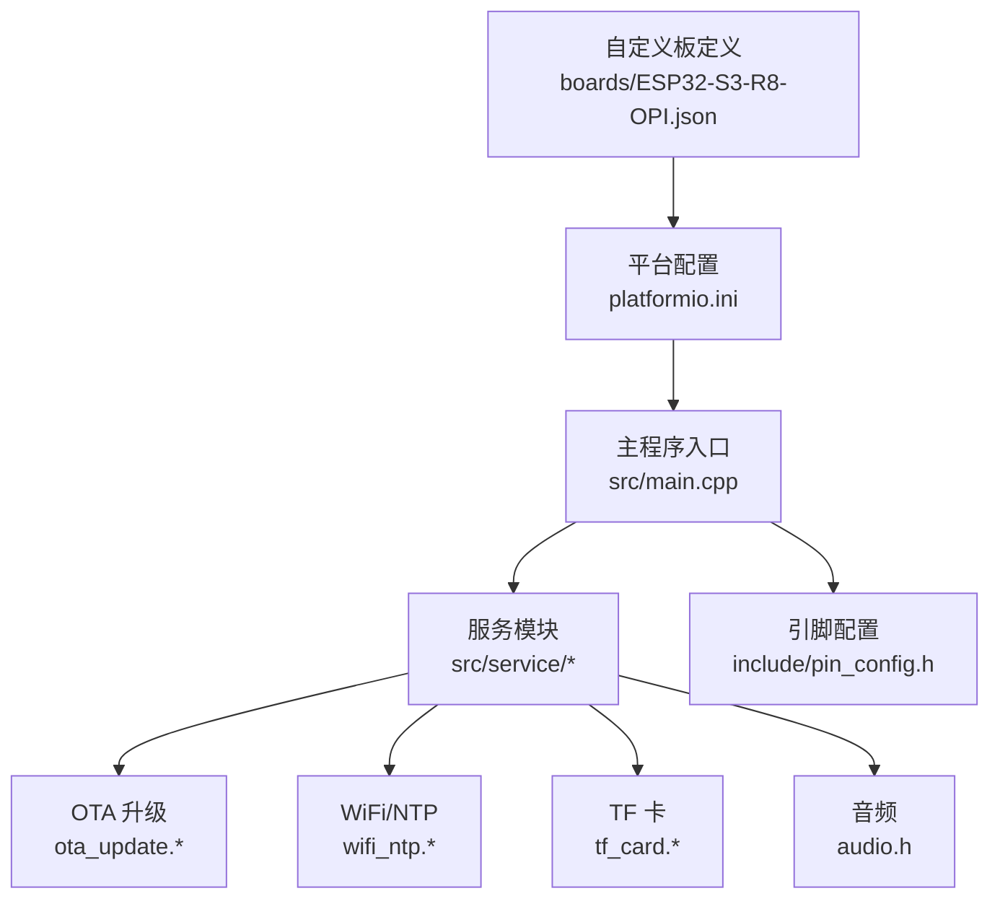
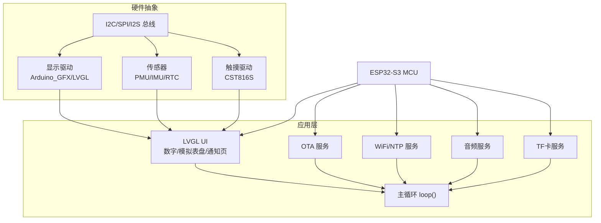
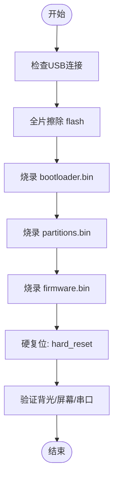
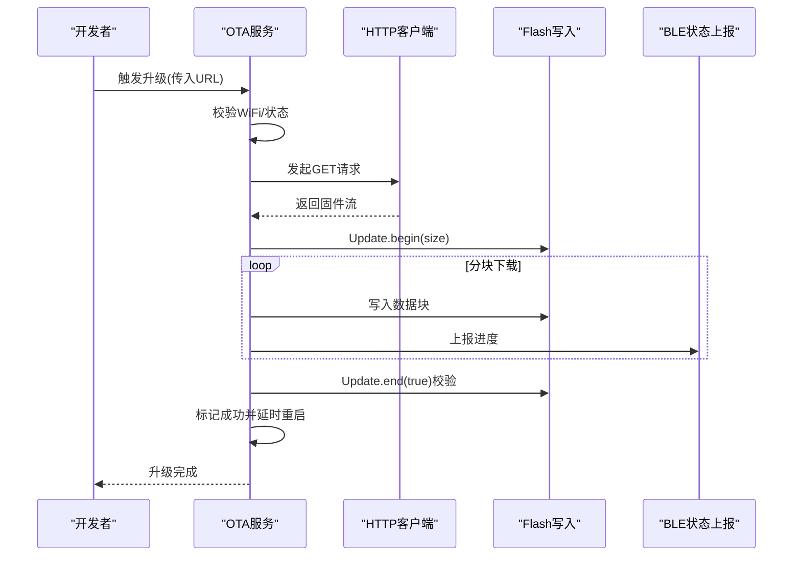
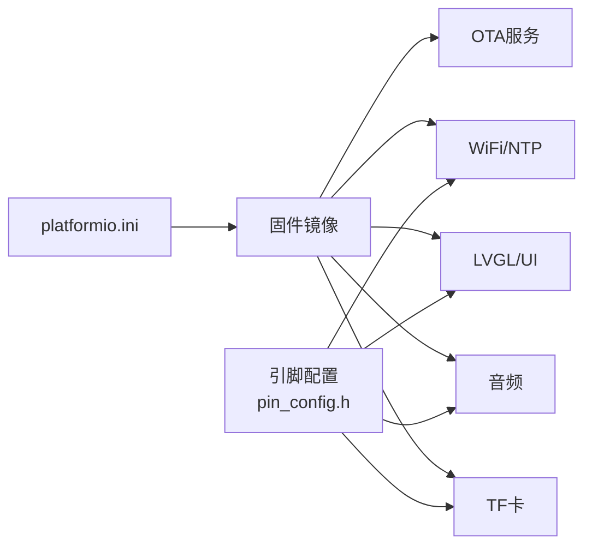
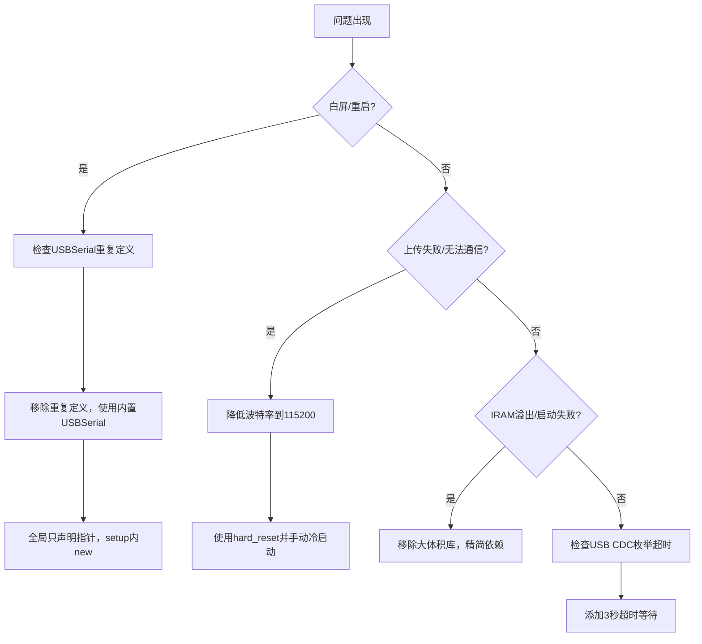

# 部署与维护

<cite>
**本文引用的文件**
- [platformio.ini](file://platformio.ini)
- [main.cpp](file://src/main.cpp)
- [ota_update.h](file://src/service/ota_update.h)
- [ota_update.cpp](file://src/service/ota_update.cpp)
- [wifi_ntp.h](file://src/service/wifi_ntp.h)
- [wifi_ntp.cpp](file://src/service/wifi_ntp.cpp)
- [pin_config.h](file://include/pin_config.h)
- [ESP32-S3-R8-OPI.json](file://boards/ESP32-S3-R8-OPI.json)
- [CLAUDE.md](file://CLAUDE.md)
- [DEBUG_REPORT.md](file://DEBUG_REPORT.md)
- [tf_card.h](file://src/service/tf_card.h)
- [tf_card.cpp](file://src/service/tf_card.cpp)
- [audio.h](file://src/service/audio.h)
</cite>

## 目录
1. [简介](#简介)
2. [项目结构](#项目结构)
3. [核心组件](#核心组件)
4. [架构总览](#架构总览)
5. [详细组件分析](#详细组件分析)
6. [依赖关系分析](#依赖关系分析)
7. [性能考虑](#性能考虑)
8. [故障排除指南](#故障排除指南)
9. [结论](#结论)
10. [附录](#附录)

## 简介
本指南面向SmartBracelet项目的部署与运维，覆盖固件烧录（单机与批量）、OTA升级策略（生成、分发、流程、回滚）、系统升级管理（版本控制、兼容性检查、升级验证）、维护工具（设备诊断、性能监控、健康检查）、故障排除（常见问题、紧急修复、预防性维护）、数据备份与恢复（用户数据保护、配置信息备份、系统还原），以及运维监控与用户支持流程。文档基于仓库现有实现进行提炼与可视化，帮助工程团队与运维人员高效落地。

## 项目结构
SmartBracelet采用PlatformIO工程组织，核心目录与职责如下：
- include：公共头文件（含LVGL配置与引脚定义）
- lib：第三方库（图形、传感器、电源管理等）
- src：主程序与服务模块（UI、传感器、OTA、网络、音频等）
- boards：自定义开发板JSON（eFuse与分区配置）
- webapp：移动端前端（Capacitor + Android APK构建）
- training：边缘AI训练脚本（可选）

**图表来源**
- [platformio.ini](file://platformio.ini#L14-L41)
- [main.cpp](file://src/main.cpp#L1-L120)
- [ota_update.h](file://src/service/ota_update.h#L1-L36)
- [wifi_ntp.h](file://src/service/wifi_ntp.h#L1-L26)
- [tf_card.h](file://src/service/tf_card.h#L1-L9)
- [audio.h](file://src/service/audio.h#L1-L23)
- [pin_config.h](file://include/pin_config.h#L1-L41)
- [ESP32-S3-R8-OPI.json](file://boards/ESP32-S3-R8-OPI.json#L1-L40)

**章节来源**
- [platformio.ini](file://platformio.ini#L14-L41)
- [main.cpp](file://src/main.cpp#L1-L120)
- [pin_config.h](file://include/pin_config.h#L1-L41)
- [ESP32-S3-R8-OPI.json](file://boards/ESP32-S3-R8-OPI.json#L1-L40)

## 核心组件
- 固件烧录与上传
  - 上传速度与模式：115200 baud，QIO模式，推荐使用esptool.py手动三段式烧录
  - 复位策略：优先使用“hard_reset”确保可靠启动
- OTA升级
  - HTTP下载固件，Update.begin写入Flash，校验后重启生效
  - 状态机：空闲/下载中/写入中/校验中/成功/错误
- 网络与时间
  - WiFi STA自动连接，NTP校时，周期性关闭WiFi以省电
- 存储与音频
  - TF卡（SDMMC 1-bit）容量查询与目录遍历
  - I2S音频播放与录音接口
- 引脚与硬件
  - LCD/触摸/PMU/IMU/RTC/I2S等引脚集中定义，便于维护

**章节来源**
- [platformio.ini](file://platformio.ini#L23-L24)
- [ota_update.h](file://src/service/ota_update.h#L6-L14)
- [ota_update.cpp](file://src/service/ota_update.cpp#L18-L40)
- [wifi_ntp.cpp](file://src/service/wifi_ntp.cpp#L21-L30)
- [tf_card.cpp](file://src/service/tf_card.cpp#L7-L28)
- [audio.h](file://src/service/audio.h#L4-L23)
- [pin_config.h](file://include/pin_config.h#L1-L41)

## 架构总览
SmartBracelet运行时架构围绕主循环展开：LVGL渲染、传感器采集、BLE/WiFi交互、OTA状态上报、电源管理与低功耗策略协同工作。

**图表来源**
- [main.cpp](file://src/main.cpp#L615-L722)
- [ota_update.cpp](file://src/service/ota_update.cpp#L54-L63)
- [wifi_ntp.cpp](file://src/service/wifi_ntp.cpp#L37-L60)
- [tf_card.cpp](file://src/service/tf_card.cpp#L7-L28)
- [audio.h](file://src/service/audio.h#L4-L23)

## 详细组件分析

### 固件烧录与批量部署
- 单机烧录
  - 上传速度：115200 baud
  - Flash模式：QIO（eFuse锁定）
  - 推荐流程：使用esptool.py手动三段式烧录（bootloader/partitions/firmware）
  - 复位策略：使用“hard_reset”，避免RTS复位不可靠
- 批量烧录
  - 建议：统一CI/CD流水线，固定波特率与flash模式，自动化执行擦除与三段式写入
  - 注意：USB带电插拔可能导致flash损坏，需在流程中强制断电与全擦除
- 串口与诊断
  - 使用PlatformIO Monitor或串口助手观察启动日志，确认UI与外设初始化

**图表来源**
- [DEBUG_REPORT.md](file://DEBUG_REPORT.md#L219-L231)
- [platformio.ini](file://platformio.ini#L23-L24)

**章节来源**
- [platformio.ini](file://platformio.ini#L23-L24)
- [DEBUG_REPORT.md](file://DEBUG_REPORT.md#L219-L231)
- [CLAUDE.md](file://CLAUDE.md#L31-L31)

### OTA升级策略
- 升级包生成
  - 通过PlatformIO构建产物生成bin文件，确保分区与引导一致
- 分发机制
  - 通过HTTP服务器提供固件URL，设备通过串口命令或UI触发
- 升级流程
  - 状态机：空闲→下载中→写入中→校验中→成功/错误
  - 下载：HTTPClient GET，Update.begin写入，进度回调
  - 校验：Update.end(true)后重启生效
- 回滚策略
  - 当前实现未内置双分区回滚；建议在CI中生成带版本号的固件，失败时回退到上一版本固件URL
- 版本控制与兼容性
  - 固件版本字符串嵌入宏，用于显示与日志追踪
  - 升级前检查WiFi连接与可用空间，避免升级失败

**图表来源**
- [ota_update.cpp](file://src/service/ota_update.cpp#L54-L171)
- [ota_update.h](file://src/service/ota_update.h#L6-L14)
- [main.cpp](file://src/main.cpp#L724-L741)

**章节来源**
- [ota_update.cpp](file://src/service/ota_update.cpp#L18-L40)
- [ota_update.cpp](file://src/service/ota_update.cpp#L65-L171)
- [ota_update.h](file://src/service/ota_update.h#L32-L34)
- [main.cpp](file://src/main.cpp#L724-L741)

### 系统升级管理
- 版本控制
  - 固件版本字符串嵌入宏，便于显示与日志追踪
- 兼容性检查
  - 升级前检查WiFi连接与Flash剩余空间
- 升级验证
  - 成功后延时重启，BLE上报进度，串口输出校验结果

**章节来源**
- [ota_update.h](file://src/service/ota_update.h#L32-L34)
- [ota_update.cpp](file://src/service/ota_update.cpp#L97-L104)
- [main.cpp](file://src/main.cpp#L730-L741)

### 维护工具与健康检查
- 设备诊断
  - TF卡初始化与容量查询，格式化提示
  - 音频播放/录音接口，用于声音链路自检
- 性能监控
  - WiFi RSSI获取，NTP同步状态
  - 电池电压与电量读取（PMU）
- 健康检查
  - 串口输出关键状态（连接、同步、背光、通知）
  - 主循环定期上报OTA状态与进度

**章节来源**
- [tf_card.cpp](file://src/service/tf_card.cpp#L7-L28)
- [audio.h](file://src/service/audio.h#L4-L23)
- [wifi_ntp.cpp](file://src/service/wifi_ntp.cpp#L118-L121)
- [main.cpp](file://src/main.cpp#L421-L508)

### 数据备份与恢复
- 用户数据保护
  - TF卡作为可移动存储，用于日志、录音、配置文件备份
- 配置信息备份
  - 引脚与硬件配置集中在pin_config.h，便于统一维护
- 系统还原
  - 全片擦除后重新三段式烧录，恢复出厂状态

**章节来源**
- [tf_card.cpp](file://src/service/tf_card.cpp#L7-L28)
- [pin_config.h](file://include/pin_config.h#L1-L41)
- [DEBUG_REPORT.md](file://DEBUG_REPORT.md#L219-L231)

## 依赖关系分析
- 平台与板卡
  - 平台：espressif32@6.9.0
  - 板卡：esp32-s3-devkitc-1（自定义JSON用于OPI/PSRAM特性）
- 关键库
  - Arduino_GFX/LVGL：显示与UI
  - SensorLib/XPowersLib：传感器与电源管理
  - WiFi/NTP：网络与时间同步
  - HTTPClient/Update：OTA下载与刷写
- 引脚与总线
  - I2C（PMU/IMU/RTC）、SPI（LCD）、I2S（音频）、SDMMC（TF卡）

**图表来源**
- [platformio.ini](file://platformio.ini#L14-L41)
- [pin_config.h](file://include/pin_config.h#L1-L41)
- [main.cpp](file://src/main.cpp#L1-L28)

**章节来源**
- [platformio.ini](file://platformio.ini#L14-L41)
- [pin_config.h](file://include/pin_config.h#L1-L41)

## 性能考虑
- 上传稳定性
  - 上传速度115200，QIO模式，避免高波特率下的信号完整性问题
- WiFi省电
  - 连接后短暂开启，周期性关闭以节省功耗
- 内存占用
  - LVGL显示缓冲与UI元素占用RAM/Flash，注意阈值
- IRAM限制
  - 避免引入过多IRAM_ATTR函数，防止启动阶段溢出

**章节来源**
- [platformio.ini](file://platformio.ini#L23-L24)
- [wifi_ntp.cpp](file://src/service/wifi_ntp.cpp#L94-L112)
- [DEBUG_REPORT.md](file://DEBUG_REPORT.md#L586-L607)

## 故障排除指南
- 白屏/启动循环
  - 根因：重复定义USBSerial或全局new导致内存布局错误
  - 解决：使用框架内置USBSerial，全局只声明指针，setup内new
- USB插拔后“死亡”
  - 根因：flash写入被中断导致校验失败
  - 解决：全片擦除后手动三段式烧录，使用115200波特率
- RTS复位不可靠
  - 根因：部分板子RTS→EN复位电路不可靠
  - 解决：使用“hard_reset”并手动拔插USB冷启动
- Boot Loop（IRAM溢出）
  - 根因：库体积过大导致IRAM溢出
  - 解决：移除大体积库，回退到轻量驱动，缩小镜像
- 串口输出丢失
  - 根因：USB CDC枚举超时
  - 解决：添加3秒超时等待

**图表来源**
- [DEBUG_REPORT.md](file://DEBUG_REPORT.md#L18-L47)
- [DEBUG_REPORT.md](file://DEBUG_REPORT.md#L189-L240)
- [DEBUG_REPORT.md](file://DEBUG_REPORT.md#L521-L607)
- [DEBUG_REPORT.md](file://DEBUG_REPORT.md#L279-L291)

**章节来源**
- [DEBUG_REPORT.md](file://DEBUG_REPORT.md#L18-L47)
- [DEBUG_REPORT.md](file://DEBUG_REPORT.md#L189-L240)
- [DEBUG_REPORT.md](file://DEBUG_REPORT.md#L521-L607)
- [DEBUG_REPORT.md](file://DEBUG_REPORT.md#L279-L291)

## 结论
SmartBracelet提供了完整的嵌入式手表系统能力：稳定的显示与交互、传感器融合、无线通信、OTA升级与省电策略。部署与维护的关键在于：规范的烧录流程（固定波特率与QIO）、可靠的OTA状态机与回滚策略、完善的故障排除手册与预防性维护。建议在CI/CD中固化上述流程，确保批量部署的一致性与可追溯性。

## 附录
- 运维监控方案
  - 指标：WiFi连接状态、NTP同步状态、电池电量、OTA进度与错误码
  - 建议：BLE上报状态，串口输出关键日志，结合设备管理器定期巡检
- 用户支持流程
  - 常见问题：白屏、USB插拔后无法启动、OTA失败
  - 处理步骤：检查烧录参数、执行全擦除与手动三段式烧录、确认hard_reset与冷启动

**章节来源**
- [main.cpp](file://src/main.cpp#L724-L741)
- [wifi_ntp.cpp](file://src/service/wifi_ntp.cpp#L37-L60)
- [ota_update.cpp](file://src/service/ota_update.cpp#L54-L63)