# 音频播放控制

<cite>
**本文档引用的文件**
- [audio.h](file://src/service/audio.h)
- [audio.cpp](file://src/service/audio.cpp)
- [player.h](file://src/player.h)
- [player.cpp](file://src/player.cpp)
- [pin_config.h](file://include/pin_config.h)
- [tf_card.h](file://src/service/tf_card.h)
- [tf_card.cpp](file://src/service/tf_card.cpp)
- [main.cpp](file://src/main.cpp)
</cite>

## 目录
1. [简介](#简介)
2. [项目结构](#项目结构)
3. [核心组件](#核心组件)
4. [架构概览](#架构概览)
5. [详细组件分析](#详细组件分析)
6. [依赖关系分析](#依赖关系分析)
7. [性能考虑](#性能考虑)
8. [故障诊断指南](#故障诊断指南)
9. [结论](#结论)

## 简介

SmartBracelet音频播放控制系统是一个基于ESP32-S3平台的嵌入式音频播放解决方案。该系统实现了完整的WAV文件播放功能，包括文件格式解析、头部信息验证、数据流处理等核心技术。系统采用I2S数字音频接口配合ES8311音频编解码器，通过DMA缓冲区实现高效的音频数据传输，并提供了完整的UI界面用于音频文件管理和播放控制。

该系统支持多种音频播放模式：
- WAV文件播放（从TF卡读取）
- 内置正弦波测试音
- 实时音频响应播放
- 录音功能（麦克风输入）

## 项目结构

SmartBracelet项目的音频播放系统主要分布在以下目录中：

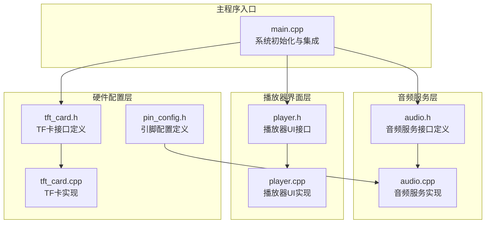

**图表来源**
- [audio.h](file://src/service/audio.h#L1-L23)
- [audio.cpp](file://src/service/audio.cpp#L1-L50)
- [player.h](file://src/player.h#L1-L6)
- [player.cpp](file://src/player.cpp#L1-L20)
- [pin_config.h](file://include/pin_config.h#L1-L41)
- [tf_card.h](file://src/service/tf_card.h#L1-L9)
- [tf_card.cpp](file://src/service/tf_card.cpp#L1-L20)
- [main.cpp](file://src/main.cpp#L615-L650)

**章节来源**
- [audio.h](file://src/service/audio.h#L1-L23)
- [audio.cpp](file://src/service/audio.cpp#L1-L50)
- [player.cpp](file://src/player.cpp#L1-L20)
- [pin_config.h](file://include/pin_config.h#L1-L41)

## 核心组件

### 音频服务组件

音频服务组件是整个系统的核心，负责音频设备的初始化、WAV文件解析、播放控制等功能。主要包含以下关键组件：

#### ES8311音频编解码器驱动
- 支持I2S数字音频接口
- 可编程采样率配置
- 音量控制功能
- 模拟电路配置

#### I2S音频接口驱动
- TX通道：扬声器输出
- RX通道：麦克风输入
- DMA缓冲区管理
- 采样率动态调整

#### WAV文件解析器
- RIFF/WAVE格式验证
- 头部信息提取
- 数据块读取
- 错误处理机制

**章节来源**
- [audio.cpp](file://src/service/audio.cpp#L40-L124)
- [audio.cpp](file://src/service/audio.cpp#L126-L154)
- [audio.cpp](file://src/service/audio.cpp#L296-L302)

### 播放器界面组件

播放器界面组件提供用户交互功能，包括音频文件列表显示、播放控制按钮、状态指示等。

#### 文件管理系统
- TF卡文件扫描
- WAV文件过滤
- 文件列表维护
- 路径管理

#### 用户界面控件
- 播放/停止按钮
- 下一个文件按钮
- 文件状态显示
- 卡片信息显示

**章节来源**
- [player.cpp](file://src/player.cpp#L20-L33)
- [player.cpp](file://src/player.cpp#L82-L148)

### 硬件配置组件

硬件配置组件定义了音频系统所需的引脚映射和硬件参数。

#### 引脚配置
- I2S音频引脚定义
- TF卡引脚配置
- PCA9557 I/O扩展器地址
- ES8311音频编解码器地址

#### 硬件参数
- 采样率设置
- 位深度配置
- DMA缓冲区参数
- 音量范围定义

**章节来源**
- [pin_config.h](file://include/pin_config.h#L27-L41)
- [audio.cpp](file://src/service/audio.cpp#L127-L154)

## 架构概览

SmartBracelet音频播放系统的整体架构采用分层设计，确保了模块化和可维护性：

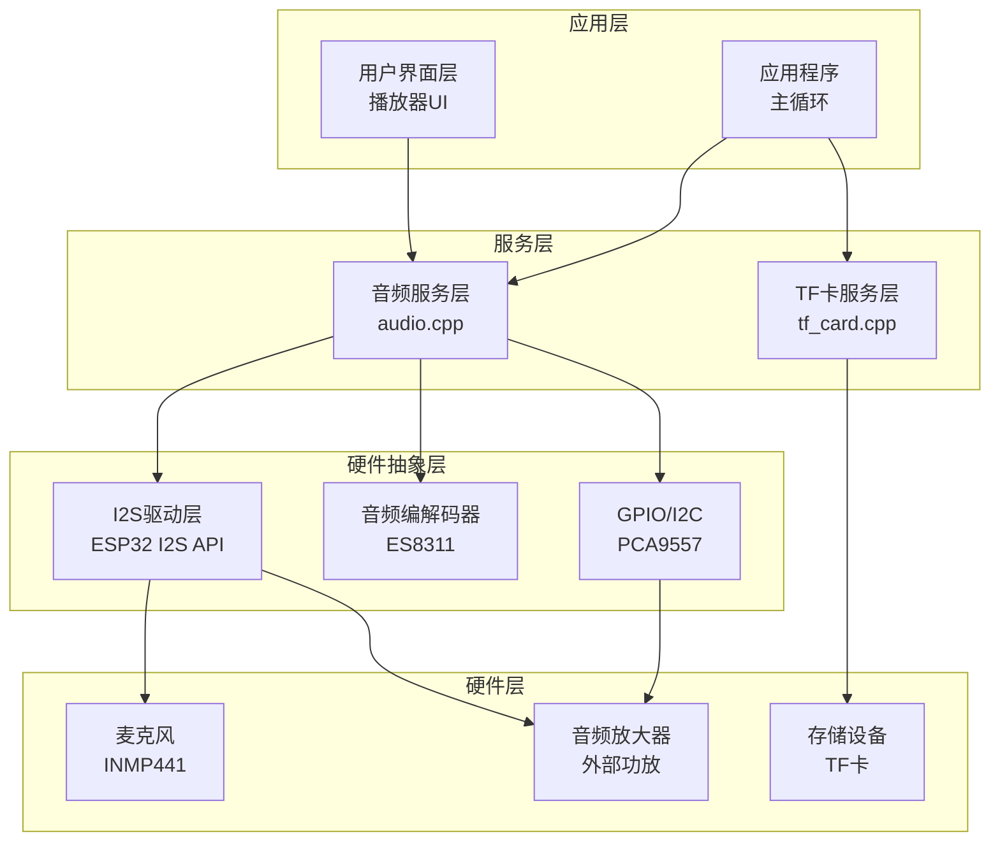

**图表来源**
- [audio.cpp](file://src/service/audio.cpp#L262-L282)
- [tf_card.cpp](file://src/service/tf_card.cpp#L7-L28)
- [main.cpp](file://src/main.cpp#L646-L650)

系统采用事件驱动的架构模式，通过FreeRTOS任务和队列实现异步音频处理：

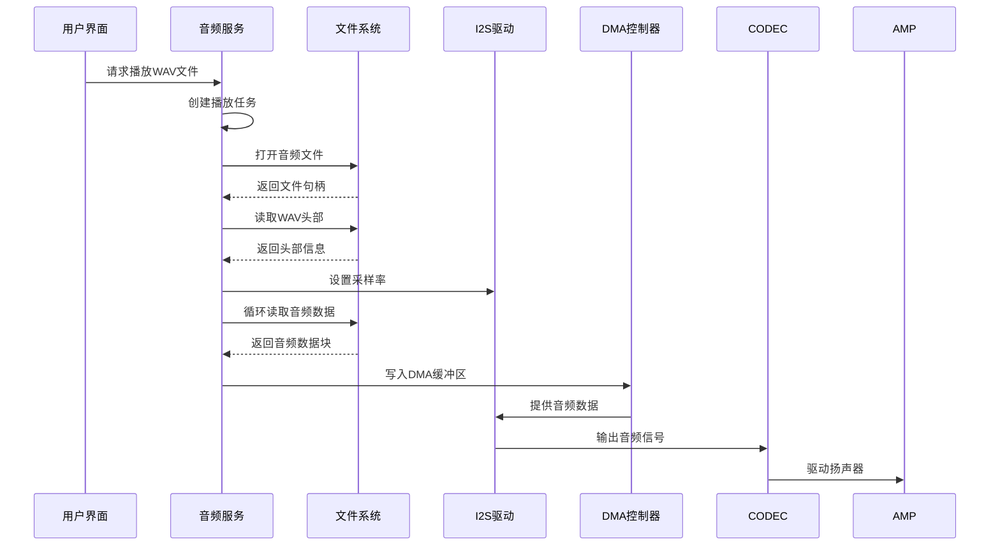

**图表来源**
- [audio.cpp](file://src/service/audio.cpp#L307-L314)
- [audio.cpp](file://src/service/audio.cpp#L316-L344)

**章节来源**
- [audio.cpp](file://src/service/audio.cpp#L262-L282)
- [main.cpp](file://src/main.cpp#L646-L650)

## 详细组件分析

### WAV文件播放实现

WAV文件播放是系统的核心功能，实现了完整的音频文件处理流程：

#### 文件格式解析

WAV文件解析器使用结构体来表示RIFF/WAVE文件头：

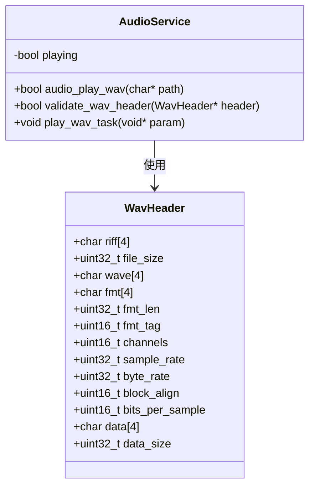

**图表来源**
- [audio.cpp](file://src/service/audio.cpp#L296-L302)
- [audio.cpp](file://src/service/audio.cpp#L307-L314)

WAV文件解析过程包括：
1. **文件打开验证**：检查文件是否存在且可访问
2. **头部读取**：一次性读取完整的WAV文件头
3. **格式验证**：验证RIFF标识符和WAVE格式
4. **参数提取**：提取采样率、位深度、声道数等关键参数

#### 播放任务管理

播放任务采用FreeRTOS任务实现，具有以下特点：

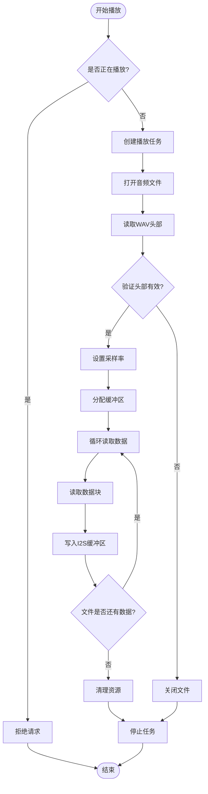

**图表来源**
- [audio.cpp](file://src/service/audio.cpp#L307-L314)
- [audio.cpp](file://src/service/audio.cpp#L316-L344)

#### 内存管理策略

系统采用分层内存管理策略：

1. **任务栈内存**：每个播放任务分配4KB栈空间
2. **数据缓冲区**：动态分配1KB的音频数据缓冲区
3. **路径字符串**：使用strdup复制文件路径
4. **自动清理**：播放完成后自动释放所有分配的内存

**章节来源**
- [audio.cpp](file://src/service/audio.cpp#L307-L314)
- [audio.cpp](file://src/service/audio.cpp#L316-L344)

### I2S音频接口配置

I2S音频接口是系统的核心硬件组件，负责数字音频数据的传输：

#### 发送通道配置（扬声器输出）

发送通道配置针对扬声器输出进行了专门优化：

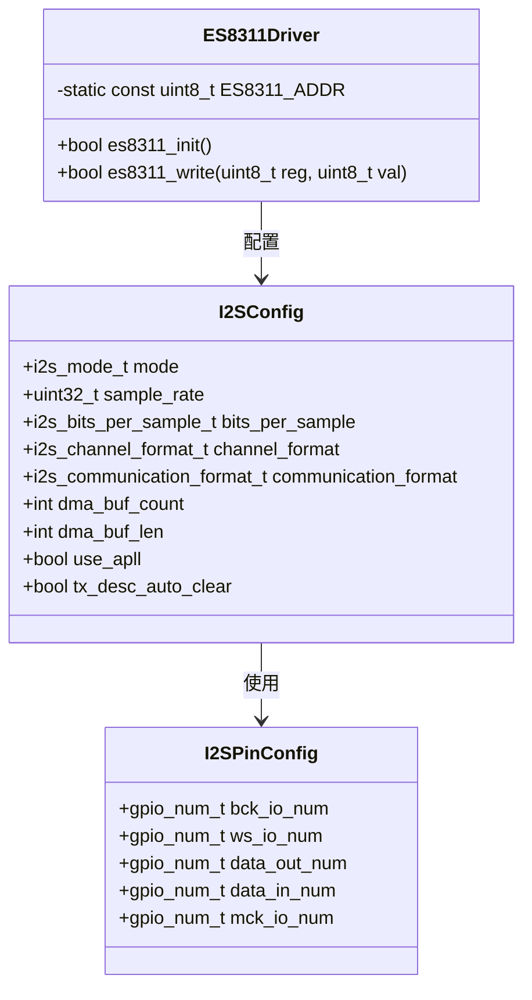

**图表来源**
- [audio.cpp](file://src/service/audio.cpp#L127-L154)
- [audio.cpp](file://src/service/audio.cpp#L78-L124)

发送通道的关键配置参数：
- **采样率**：默认44.1kHz，支持动态调整
- **位深度**：16位，符合WAV文件标准
- **DMA缓冲区**：8个缓冲区，每个256样本
- **时钟配置**：使用外部振荡器（APLL）

#### 接收通道配置（麦克风输入）

接收通道配置针对麦克风输入进行了优化：

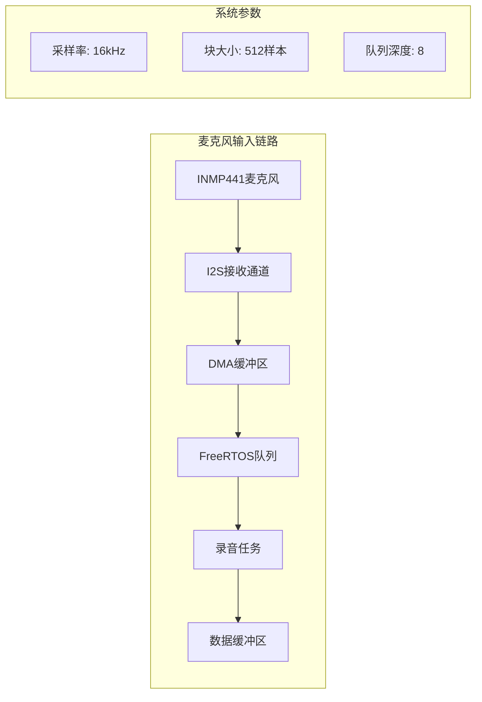

**图表来源**
- [audio.cpp](file://src/service/audio.cpp#L156-L188)
- [audio.cpp](file://src/service/audio.cpp#L190-L223)

接收通道的特点：
- **采样率**：16kHz，满足语音识别需求
- **块大小**：512样本，约32ms延迟
- **队列深度**：8个数据块缓冲
- **任务优先级**：高优先级确保实时性

**章节来源**
- [audio.cpp](file://src/service/audio.cpp#L127-L154)
- [audio.cpp](file://src/service/audio.cpp#L156-L188)
- [audio.cpp](file://src/service/audio.cpp#L190-L223)

### 音频播放控制接口

系统提供了完整的音频播放控制接口，支持多种播放模式：

#### 基础播放接口

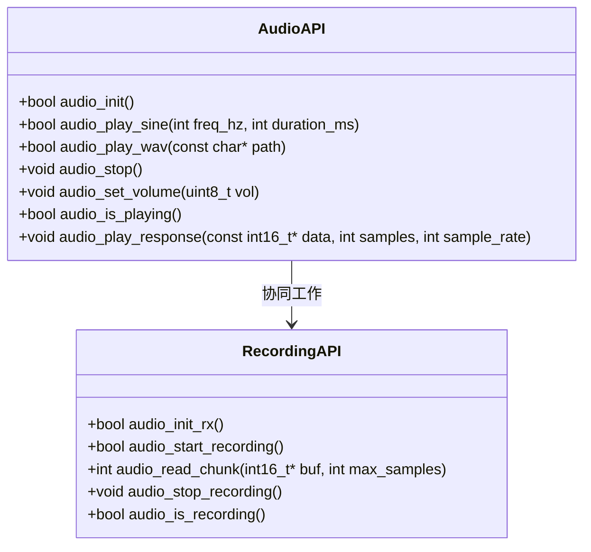

**图表来源**
- [audio.h](file://src/service/audio.h#L4-L22)

#### 播放状态管理

播放状态通过全局变量进行管理，确保线程安全：

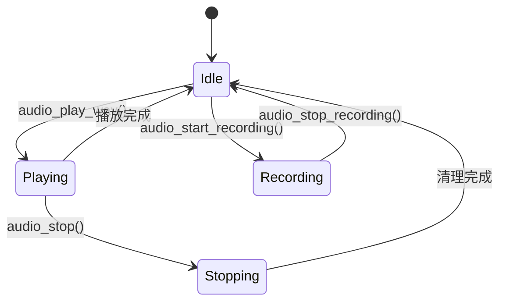

**图表来源**
- [audio.cpp](file://src/service/audio.cpp#L304)
- [audio.cpp](file://src/service/audio.cpp#L346)

#### 音量控制机制

音量控制通过ES8311音频编解码器实现：

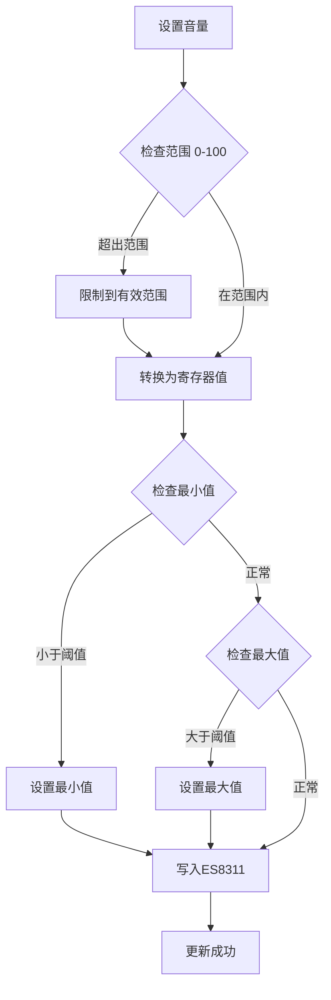

**图表来源**
- [audio.cpp](file://src/service/audio.cpp#L347-L354)

**章节来源**
- [audio.h](file://src/service/audio.h#L4-L22)
- [audio.cpp](file://src/service/audio.cpp#L346-L354)

### 播放器UI组件

播放器UI组件提供了直观的用户交互界面：

#### 文件列表管理

播放器UI实现了完整的文件列表管理功能：

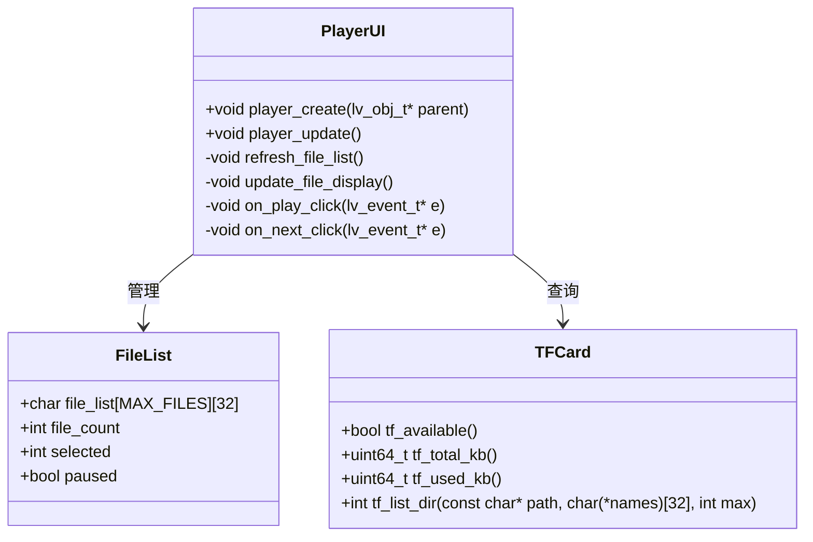

**图表来源**
- [player.h](file://src/player.h#L1-L6)
- [player.cpp](file://src/player.cpp#L20-L33)
- [tf_card.h](file://src/service/tf_card.h#L4-L9)

文件列表管理的关键功能：
- **文件扫描**：自动扫描根目录下的WAV文件
- **文件过滤**：仅显示WAV格式文件
- **选择管理**：支持文件选择和切换
- **状态显示**：实时显示播放状态

#### 用户交互流程

播放器UI的用户交互采用事件驱动模式：

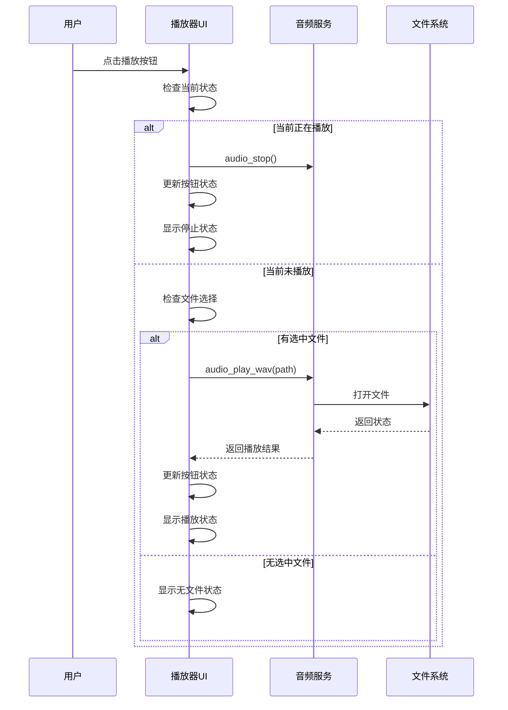

**图表来源**
- [player.cpp](file://src/player.cpp#L47-L68)

**章节来源**
- [player.cpp](file://src/player.cpp#L20-L33)
- [player.cpp](file://src/player.cpp#L47-L68)
- [player.cpp](file://src/player.cpp#L82-L148)

## 依赖关系分析

SmartBracelet音频播放系统的依赖关系呈现清晰的层次结构：

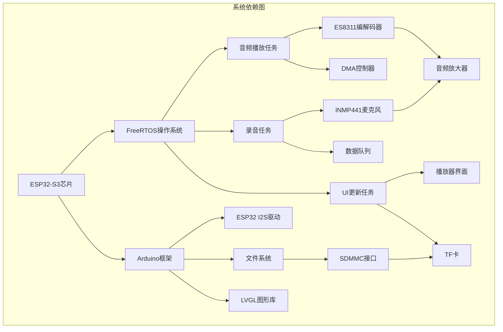

**图表来源**
- [audio.cpp](file://src/service/audio.cpp#L1-L12)
- [player.cpp](file://src/player.cpp#L1-L6)
- [main.cpp](file://src/main.cpp#L1-L27)

### 外部依赖

系统的主要外部依赖包括：

#### 硬件依赖
- **ESP32-S3芯片**：主控制器，支持双核运行
- **ES8311音频编解码器**：I2S音频处理
- **INMP441麦克风**：数字麦克风
- **PCA9557 I/O扩展器**：音频放大器控制

#### 软件依赖
- **FreeRTOS**：实时操作系统内核
- **Arduino框架**：硬件抽象层
- **LVGL**：图形用户界面库
- **SD_MMC**：TF卡文件系统

#### 驱动依赖
- **I2S驱动**：数字音频接口
- **I2C驱动**：音频编解码器通信
- **SPI驱动**：显示设备通信
- **DMA驱动**：高效数据传输

**章节来源**
- [audio.cpp](file://src/service/audio.cpp#L1-L12)
- [main.cpp](file://src/main.cpp#L1-L27)

## 性能考虑

### 缓冲区优化策略

系统采用了多层次的缓冲区优化策略来确保音频播放的流畅性和稳定性：

#### DMA缓冲区配置

发送通道的DMA缓冲区配置经过精心优化：

| 参数 | 数值 | 说明 |
|------|------|------|
| `dma_buf_count` | 8 | DMA缓冲区数量，平衡延迟和内存使用 |
| `dma_buf_len` | 256 | 每个缓冲区的样本数 |
| `sample_rate` | 44.1kHz | 默认采样率 |
| `bits_per_sample` | 16 | 位深度 |

接收通道的缓冲区配置：

| 参数 | 数值 | 说明 |
|------|------|------|
| `dma_buf_count` | 4 | 减少录音延迟 |
| `dma_buf_len` | 1024 | 样本数，约64ms延迟 |
| `sample_rate` | 16kHz | 语音采样率 |
| `chunk_samples` | 512 | 队列传输块大小 |

#### 内存分配优化

系统采用动态内存分配策略，避免静态内存浪费：

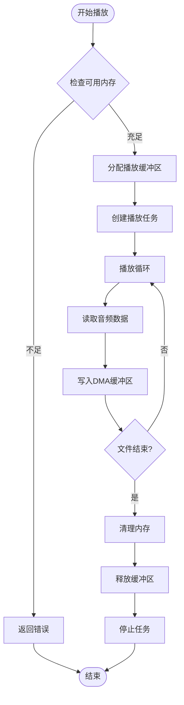

**图表来源**
- [audio.cpp](file://src/service/audio.cpp#L331-L332)
- [audio.cpp](file://src/service/audio.cpp#L340-L341)

### 性能调优建议

基于系统当前实现，以下是性能优化建议：

#### 缓冲区大小调整
- **大文件播放**：可考虑增加DMA缓冲区数量至16个，减少中断频率
- **实时录音**：保持当前配置，确保低延迟
- **内存受限环境**：可减少缓冲区数量，但需权衡性能

#### 采样率优化
- **高质量音频**：使用44.1kHz或更高采样率
- **语音应用**：16kHz已足够，可降低CPU负载
- **动态调整**：根据WAV文件实际采样率动态配置

#### 任务优先级优化
- **播放任务**：优先级设置为1，确保音频连续性
- **录音任务**：优先级设置为3，保证实时性
- **UI任务**：优先级设置为4，避免阻塞用户交互

**章节来源**
- [audio.cpp](file://src/service/audio.cpp#L127-L154)
- [audio.cpp](file://src/service/audio.cpp#L190-L223)

## 故障诊断指南

### 常见问题及解决方案

#### 音频播放失败

**症状**：调用`audio_play_wav()`返回false或播放立即停止

**可能原因**：
1. **文件不存在**：WAV文件路径错误
2. **文件损坏**：WAV文件头不完整或格式不正确
3. **内存不足**：无法分配播放缓冲区
4. **I2S初始化失败**：音频硬件配置错误

**诊断步骤**：
1. 检查文件路径是否正确
2. 验证WAV文件完整性
3. 监控系统内存使用情况
4. 查看串口调试信息

**解决方法**：
```cpp
// 添加文件存在性检查
File f = SD_MMC.open(path);
if (!f) {
    USBSerial.printf("文件不存在: %s\n", path);
    return false;
}

// 检查WAV文件头
WavHeader hdr;
size_t nr = f.read((uint8_t*)&hdr, sizeof(hdr));
if (nr != sizeof(hdr) || 
    memcmp(hdr.riff, "RIFF", 4) != 0 || 
    memcmp(hdr.wave, "WAVE", 4) != 0) {
    USBSerial.println("无效的WAV文件");
    f.close();
    return false;
}
```

#### 音频质量差

**症状**：播放时出现杂音、破音或音量异常

**可能原因**：
1. **采样率不匹配**：WAV文件采样率与系统配置不一致
2. **音量设置不当**：音量值超出有效范围
3. **电源噪声**：音频电路受到电源纹波影响
4. **时钟不稳定**：I2S时钟源不稳定

**诊断步骤**：
1. 检查WAV文件的实际采样率
2. 验证音量设置范围（0-100）
3. 测量音频电路供电电压
4. 检查I2S时钟配置

**解决方法**：
```cpp
// 动态调整采样率
i2s_set_sample_rates(I2S_NUM_0, hdr.sample_rate);

// 安全的音量设置
void safe_volume_set(uint8_t vol) {
    if (vol > 100) vol = 100;
    uint8_t reg = (vol * 0xBF) / 100;
    if (reg > 0xBF) reg = 0xBF;
    if (reg < 0x01) reg = 0x01;
    es8311_write(ES8311_DAC_VOL, reg);
}
```

#### 录音功能异常

**症状**：录音时无声音或录音质量差

**可能原因**：
1. **麦克风配置错误**：INMP441引脚配置不正确
2. **LRS引脚设置**：左声道选择引脚未正确配置
3. **队列溢出**：录音速度超过处理能力
4. **DMA冲突**：I2S通道冲突

**诊断步骤**：
1. 检查INMP441引脚连接
2. 验证LRS引脚电平状态
3. 监控录音队列长度
4. 检查I2S配置冲突

**解决方法**：
```cpp
// 确保LRS引脚正确配置
pinMode(INMP441_LRS, OUTPUT);
digitalWrite(INMP441_LRS, LOW);  // 左声道

// 合理的队列深度配置
#define RX_QUEUE_DEPTH 8
#define RX_CHUNK_SAMPLES 512
```

#### UI界面问题

**症状**：播放器界面显示异常或响应迟缓

**可能原因**：
1. **LVGL内存不足**：UI元素过多导致内存紧张
2. **刷新频率过低**：UI更新频率不够
3. **事件处理阻塞**：长时间操作阻塞UI线程
4. **文件列表过大**：扫描大量文件影响性能

**诊断步骤**：
1. 监控系统内存使用情况
2. 检查UI定时器配置
3. 分析事件处理耗时
4. 优化文件扫描算法

**解决方法**：
```cpp
// 限制文件列表大小
#define MAX_FILES 20

// 优化文件扫描
static void refresh_file_list(void) {
    file_count = tf_list_dir("/", file_list, MAX_FILES);
    // 过滤WAV文件
    int j = 0;
    for (int i = 0; i < file_count; i++) {
        const char *ext = strrchr(file_list[i], '.');
        if (ext && (strcasecmp(ext, ".wav") == 0)) {
            if (i != j) strcpy(file_list[j], file_list[i]);
            j++;
        }
    }
    file_count = j;
}
```

### 调试工具和技巧

#### 串口调试信息

系统提供了丰富的串口调试信息，便于问题诊断：

```cpp
// 初始化阶段调试
USBSerial.println("Audio: ready");
USBSerial.println("Audio: beep...");

// 播放过程调试
USBSerial.printf("Playing: %s\n", path);
USBSerial.println("Playback done");

// 错误信息
USBSerial.println("Audio: invalid WAV");
USBSerial.println("Audio: I2C no response");
```

#### 内存监控

```cpp
// 监控播放缓冲区分配
uint8_t *buf = (uint8_t *)malloc(1024);
if (!buf) {
    USBSerial.println("内存分配失败");
    return false;
}

// 检查系统可用内存
// 在FreeRTOS中使用vPortGetFreeHeapSize()
```

#### 性能分析

```cpp
// 记录播放时间
unsigned long start_time = millis();
// 播放操作
unsigned long end_time = millis();
USBSerial.printf("播放耗时: %lu ms\n", end_time - start_time);
```

**章节来源**
- [audio.cpp](file://src/service/audio.cpp#L325-L328)
- [audio.cpp](file://src/service/audio.cpp#L80-L83)
- [player.cpp](file://src/player.cpp#L150-L155)

## 结论

SmartBracelet音频播放控制系统是一个设计精良的嵌入式音频解决方案，具有以下显著特点：

### 技术优势

1. **完整的WAV支持**：实现了标准RIFF/WAVE格式的完整解析和播放
2. **实时性能**：采用DMA和多缓冲区技术确保音频播放的实时性
3. **模块化设计**：清晰的分层架构便于维护和扩展
4. **用户友好**：提供直观的播放器界面和完善的错误处理

### 架构特色

1. **双通道I2S配置**：同时支持音频输出和输入，功能完整
2. **动态采样率**：根据WAV文件自动调整采样率
3. **灵活的任务管理**：基于FreeRTOS的任务模型确保系统响应性
4. **内存优化**：合理的内存分配策略平衡性能和资源使用

### 应用价值

该系统为智能穿戴设备提供了可靠的音频播放基础，可以广泛应用于：
- 音乐播放器
- 语音助手
- 录音设备
- 音频教学工具

### 改进建议

1. **增强错误恢复**：添加更完善的错误恢复机制
2. **性能监控**：集成实时性能监控功能
3. **配置管理**：提供运行时配置调整能力
4. **扩展接口**：支持更多音频格式和协议

通过持续的优化和完善，该音频播放控制系统将成为SmartBracelet平台的重要基础设施，为用户提供优质的音频体验。