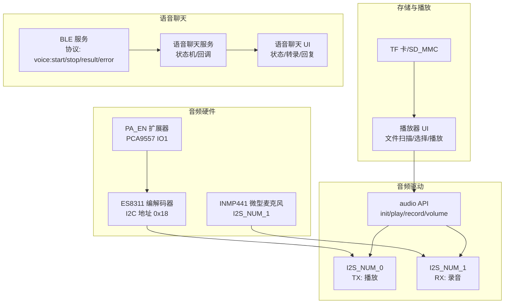
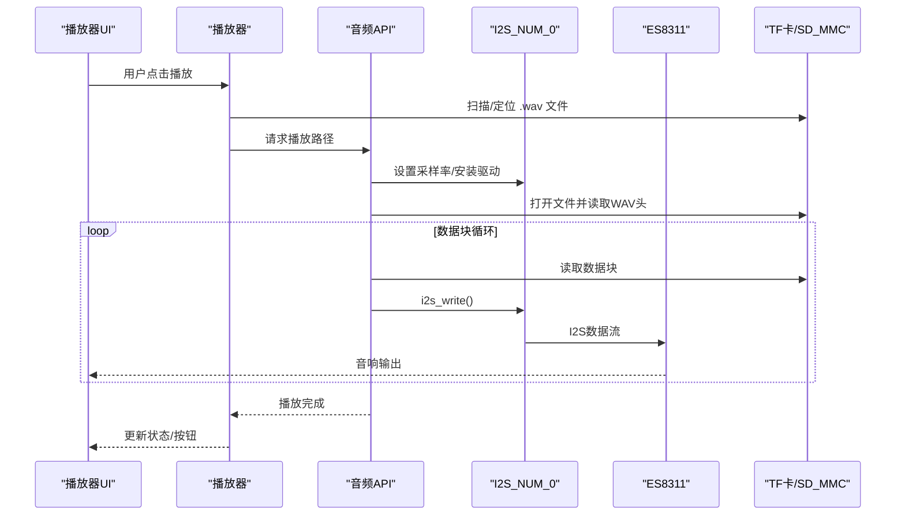
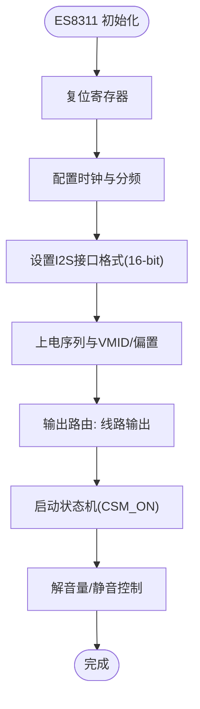
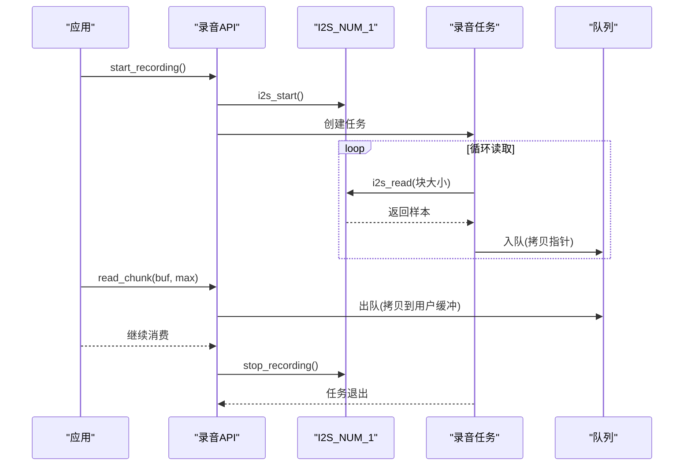
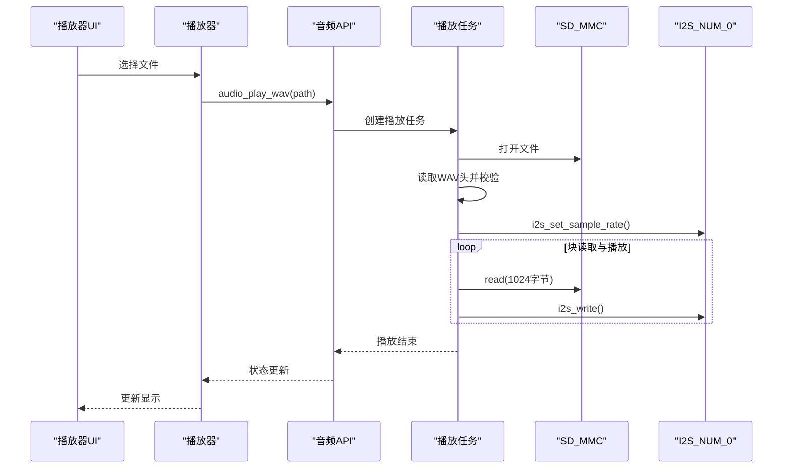
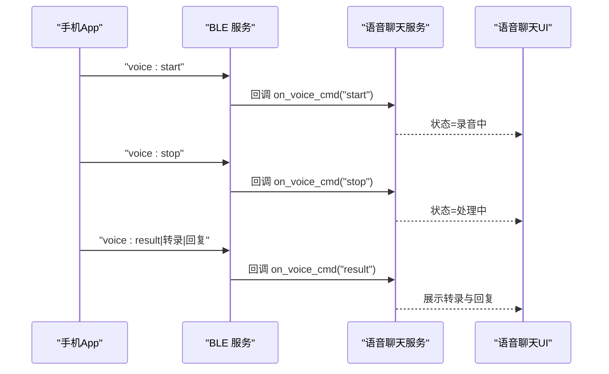
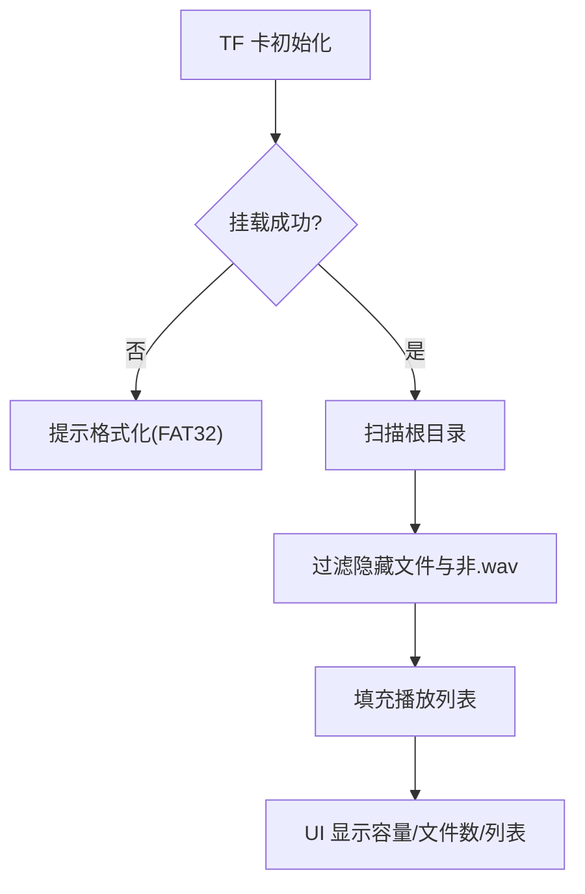
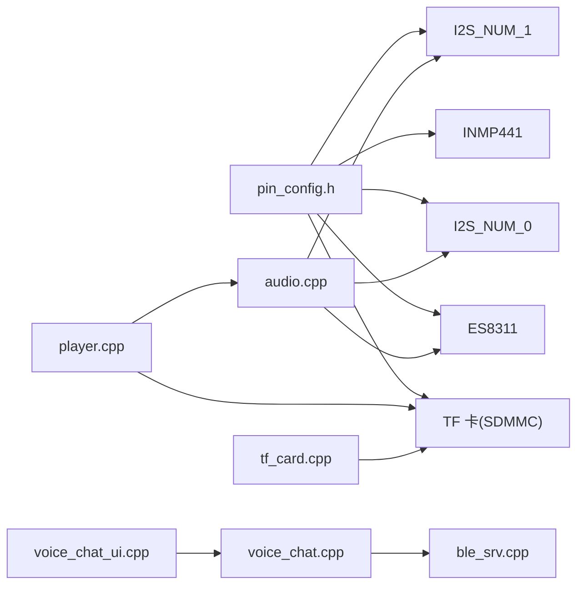

# 音频系统

<cite>
**本文引用的文件**
- [audio.h](file://src/service/audio.h)
- [audio.cpp](file://src/service/audio.cpp)
- [voice_chat.h](file://src/service/voice_chat.h)
- [voice_chat.cpp](file://src/service/voice_chat.cpp)
- [voice_chat_ui.h](file://src/voice_chat_ui.h)
- [voice_chat_ui.cpp](file://src/voice_chat_ui.cpp)
- [tf_card.h](file://src/service/tf_card.h)
- [tf_card.cpp](file://src/service/tf_card.cpp)
- [player.h](file://src/player.h)
- [player.cpp](file://src/player.cpp)
- [pin_config.h](file://include/pin_config.h)
- [ble_srv.h](file://src/service/ble_srv.h)
- [ble_srv.cpp](file://src/service/ble_srv.cpp)
- [ESP32-S3-R8-OPI.json](file://boards/ESP32-S3-R8-OPI.json)
- [DEBUG_REPORT.md](file://DEBUG_REPORT.md)
</cite>

## 目录
1. [简介](#简介)
2. [项目结构](#项目结构)
3. [核心组件](#核心组件)
4. [架构总览](#架构总览)
5. [详细组件分析](#详细组件分析)
6. [依赖关系分析](#依赖关系分析)
7. [性能与优化](#性能与优化)
8. [故障诊断与排错](#故障诊断与排错)
9. [结论](#结论)
10. [附录](#附录)

## 简介
本文件面向 SmartBracelet 的音频系统，围绕以下目标展开：  
- 音频编解码器（ES8311）的配置与使用，涵盖 I2C 初始化、寄存器配置、时钟与接口设置、音量控制等。  
- 音频播放功能，包括 WAV 文件解析、动态采样率切换、播放控制与状态管理。  
- 语音聊天功能设计，覆盖录音路径（INMP441）、I2S 接收、队列分块读取、BLE 协议交互与云端结果展示。  
- 音频处理能力，结合现有实现说明可扩展方向（滤波、增益、噪声抑制等）。  
- TF 卡存储与播放列表管理，包括文件系统扫描、过滤与播放控制。  
- 音质调优、延迟优化与功耗控制策略。  
- 故障诊断与性能监控方法。

## 项目结构
音频系统主要分布在如下模块：
- 音频驱动与编解码：ES8311（I2C）、I2S（TX/RX）
- 录音与播放：INMP441（I2S_NUM_1）、WAV 播放任务
- 存储与播放器：TF 卡（SD_MMC）、播放列表 UI
- 语音聊天：BLE 协议、状态机、UI 展示
- 引脚与平台：pin_config.h、ESP32-S3 平台定义

图表来源
- [audio.cpp](file://src/service/audio.cpp#L1-L365)
- [audio.h](file://src/service/audio.h#L1-L23)
- [tf_card.cpp](file://src/service/tf_card.cpp#L1-L60)
- [player.cpp](file://src/player.cpp#L1-L156)
- [voice_chat.cpp](file://src/service/voice_chat.cpp#L1-L49)
- [voice_chat_ui.cpp](file://src/voice_chat_ui.cpp#L1-L117)
- [ble_srv.cpp](file://src/service/ble_srv.cpp#L44-L120)

章节来源
- [audio.cpp](file://src/service/audio.cpp#L1-L365)
- [audio.h](file://src/service/audio.h#L1-L23)
- [tf_card.cpp](file://src/service/tf_card.cpp#L1-L60)
- [player.cpp](file://src/player.cpp#L1-L156)
- [voice_chat.cpp](file://src/service/voice_chat.cpp#L1-L49)
- [voice_chat_ui.cpp](file://src/voice_chat_ui.cpp#L1-L117)
- [ble_srv.cpp](file://src/service/ble_srv.cpp#L44-L120)

## 核心组件
- ES8311 音频编解码器：通过 I2C 初始化寄存器，配置时钟、接口格式、模拟路由与音量，配合 I2S 输出驱动扬声器。
- I2S 播放（TX）：以主模式、16-bit、单声道（左）I2S 格式输出，支持动态采样率切换与静音/恢复。
- I2S 录音（RX）：INMP441 作为麦克风，I2S_NUM_1 以主模式接收，DMA 分块入队，任务异步出队后供上层消费。
- TF 卡与播放器：SD_MMC 文件系统扫描 .wav 文件，构建播放列表，触发播放任务。
- 语音聊天：BLE 协议传递录音开始/停止与云端结果，UI 展示状态、转录与回复文本。
- 引脚与平台：pin_config.h 明确定义 I2S、TF 卡、ES8311、PCA9557 引脚，ESP32-S3 平台配置在 boards 中。

章节来源
- [audio.h](file://src/service/audio.h#L1-L23)
- [audio.cpp](file://src/service/audio.cpp#L1-L365)
- [tf_card.h](file://src/service/tf_card.h#L1-L9)
- [tf_card.cpp](file://src/service/tf_card.cpp#L1-L60)
- [player.h](file://src/player.h#L1-L6)
- [player.cpp](file://src/player.cpp#L1-L156)
- [voice_chat.h](file://src/service/voice_chat.h#L1-L15)
- [voice_chat.cpp](file://src/service/voice_chat.cpp#L1-L49)
- [voice_chat_ui.h](file://src/voice_chat_ui.h#L1-L6)
- [voice_chat_ui.cpp](file://src/voice_chat_ui.cpp#L1-L117)
- [pin_config.h](file://include/pin_config.h#L1-L41)
- [ESP32-S3-R8-OPI.json](file://boards/ESP32-S3-R8-OPI.json#L1-L40)

## 架构总览
音频系统采用“硬件编解码 + I2S 驱动 + 应用服务”的分层设计：
- 硬件层：ES8311（I2C）、INMP441（I2S）、TF 卡（SDMMC）
- 驱动层：I2S TX/RX 初始化、DMA 分块、队列与任务
- 服务层：播放器、语音聊天、音量控制、状态管理
- UI 层：LVGL 页面展示播放状态、转录与回复

图表来源
- [player.cpp](file://src/player.cpp#L47-L80)
- [audio.cpp](file://src/service/audio.cpp#L307-L344)
- [audio.h](file://src/service/audio.h#L5-L11)

章节来源
- [player.cpp](file://src/player.cpp#L1-L156)
- [audio.cpp](file://src/service/audio.cpp#L262-L344)
- [audio.h](file://src/service/audio.h#L1-L23)

## 详细组件分析

### ES8311 音频编解码器配置与使用
- I2C 初始化与寄存器配置：复位、时钟（MCLK/BCLK）、OSR、接口格式（I2S 16-bit）、电源序列、VMID/偏置、输出路由（线路输出）、启动状态机、解音量与静音控制。
- I2S TX 初始化：主模式、16-bit、单声道（左）、I2S 标准格式、DMA 参数、APLL 使用、引脚绑定。
- 音量控制：映射 0-100 到 ES8311 DAC_VOL 寄存器范围，实现线性音量调节。
- 启动自检：初始化后播放提示音，验证 PA_EN 与 ES8311 工作状态。

图表来源
- [audio.cpp](file://src/service/audio.cpp#L78-L124)
- [audio.cpp](file://src/service/audio.cpp#L127-L154)

章节来源
- [audio.cpp](file://src/service/audio.cpp#L40-L154)
- [pin_config.h](file://include/pin_config.h#L27-L35)
- [DEBUG_REPORT.md](file://DEBUG_REPORT.md#L988-L994)

### I2S 录音（INMP441）与实时传输
- I2S RX 初始化：I2S_NUM_1 主模式、16kHz、16-bit、单声道（左），DMA 缓冲区与队列参数。
- 录音任务：周期性从 I2S 读取固定样本数（512 样本/块），分配内存拷贝后入队；上层以阻塞超时方式取出。
- 状态管理：录音标志、队列句柄、任务句柄；停止时等待任务退出，避免资源泄漏。
- 通道选择：INMP441 LRS 引脚拉低选择左声道。

图表来源
- [audio.cpp](file://src/service/audio.cpp#L156-L259)
- [audio.h](file://src/service/audio.h#L13-L22)

章节来源
- [audio.cpp](file://src/service/audio.cpp#L156-L259)
- [audio.h](file://src/service/audio.h#L13-L22)
- [pin_config.h](file://include/pin_config.h#L37-L41)

### 音频播放功能（WAV）
- WAV 解析：读取 RIFF/WAVE 头，校验标识，提取采样率、位深等信息。
- 动态采样率：根据 WAV 头设置 I2S 采样率，播放完成后恢复默认。
- 播放任务：独立任务打开文件、循环读取数据块并写入 I2S，支持停止与状态查询。
- UI 集成：播放器 UI 扫描 .wav 文件、选择、播放/停止、状态更新。

图表来源
- [player.cpp](file://src/player.cpp#L20-L80)
- [audio.cpp](file://src/service/audio.cpp#L307-L344)
- [audio.h](file://src/service/audio.h#L6-L11)

章节来源
- [player.cpp](file://src/player.cpp#L1-L156)
- [audio.cpp](file://src/service/audio.cpp#L262-L344)
- [audio.h](file://src/service/audio.h#L1-L23)

### 语音聊天功能设计
- 协议与状态：BLE 写入 voice:start/stop/result/error，服务端回调更新状态机；UI 根据状态显示录音中、处理中、结果等。
- 结果展示：转录与回复文本分别显示在独立区域，支持中文换行与滚动。
- 云端集成：手表侧仅负责接收与展示，录音与识别在手机端进行，结果通过 BLE 回传。

图表来源
- [voice_chat.cpp](file://src/service/voice_chat.cpp#L11-L39)
- [voice_chat_ui.cpp](file://src/voice_chat_ui.cpp#L85-L116)
- [ble_srv.cpp](file://src/service/ble_srv.cpp#L71-L80)
- [ble_srv.cpp](file://src/service/ble_srv.cpp#L363-L370)

章节来源
- [voice_chat.h](file://src/service/voice_chat.h#L1-L15)
- [voice_chat.cpp](file://src/service/voice_chat.cpp#L1-L49)
- [voice_chat_ui.h](file://src/voice_chat_ui.h#L1-L6)
- [voice_chat_ui.cpp](file://src/voice_chat_ui.cpp#L1-L117)
- [ble_srv.h](file://src/service/ble_srv.h#L31-L35)
- [ble_srv.cpp](file://src/service/ble_srv.cpp#L44-L120)

### TF 卡存储与播放列表管理
- 初始化：设置引脚、尝试挂载 SDMMC 卡，检测卡类型与容量，失败时给出 FAT32 格式化建议。
- 可用性与容量：提供可用性判断、总容量与已用量查询。
- 目录扫描：遍历根目录，过滤隐藏文件与非 .wav 文件，填充本地数组作为播放列表。
- UI 集成：显示 TF 卡容量与文件数量，支持选择与切换下一首。

图表来源
- [tf_card.cpp](file://src/service/tf_card.cpp#L7-L60)
- [player.cpp](file://src/player.cpp#L20-L33)

章节来源
- [tf_card.h](file://src/service/tf_card.h#L1-L9)
- [tf_card.cpp](file://src/service/tf_card.cpp#L1-L60)
- [player.cpp](file://src/player.cpp#L1-L156)

### 音频处理算法与可扩展性
- 当前实现：播放时动态调整采样率；音量通过寄存器映射；录音采用 DMA 分块与队列；未内置数字滤波、增益控制或噪声抑制算法。
- 可扩展方向：可在录音路径增加数字滤波（如一阶低通/高通）、增益控制（AGC）、噪声抑制（谱减法或维纳滤波）与回声消除（LC-Echo 或深度学习方法），并在 I2S RX 任务与播放路径之间插入处理链。

章节来源
- [audio.cpp](file://src/service/audio.cpp#L330-L344)
- [audio.cpp](file://src/service/audio.cpp#L357-L364)

## 依赖关系分析
- 硬件依赖：ES8311（I2C）、PCA9557（I2C）、INMP441（I2S）、TF 卡（SDMMC）、I2S（I2S_NUM_0/1）。
- 软件依赖：Arduino I2S 驱动、Wire/I2C、SD_MMC 文件系统、LVGL UI、BLE 服务。
- 引脚映射：pin_config.h 提供所有外设引脚定义，确保编译期一致性。

图表来源
- [pin_config.h](file://include/pin_config.h#L1-L41)
- [audio.cpp](file://src/service/audio.cpp#L1-L365)
- [player.cpp](file://src/player.cpp#L1-L156)
- [voice_chat.cpp](file://src/service/voice_chat.cpp#L1-L49)
- [voice_chat_ui.cpp](file://src/voice_chat_ui.cpp#L1-L117)
- [tf_card.cpp](file://src/service/tf_card.cpp#L1-L60)
- [ble_srv.cpp](file://src/service/ble_srv.cpp#L44-L120)

章节来源
- [pin_config.h](file://include/pin_config.h#L1-L41)
- [audio.cpp](file://src/service/audio.cpp#L1-L365)
- [player.cpp](file://src/player.cpp#L1-L156)
- [voice_chat.cpp](file://src/service/voice_chat.cpp#L1-L49)
- [voice_chat_ui.cpp](file://src/voice_chat_ui.cpp#L1-L117)
- [tf_card.cpp](file://src/service/tf_card.cpp#L1-L60)
- [ble_srv.cpp](file://src/service/ble_srv.cpp#L44-L120)

## 性能与优化
- 音质与采样率
  - 播放时按 WAV 头动态设置采样率，避免失真；默认 TX 采样率为 44.1kHz。
  - 录音采样率固定为 16kHz，满足语音场景；若需更高音质，可在 I2S RX 初始化处调整。
- 延迟优化
  - I2S DMA 缓冲区与块大小已平衡吞吐与延迟；可根据实际需求微调 dma_buf_count 与 dma_buf_len。
  - 录音分块大小为 512 样本（约 32ms），队列长度为 8；可根据网络/云端 RTT 调整块大小与队列长度。
- 功耗控制
  - ES8311 与 I2S 在空闲时保持关闭；播放/录音开始时再启用，减少待机功耗。
  - PCA9557 控制 PA_EN，避免不必要的放大器供电。
- 平台特性
  - ESP32-S3 支持 APLL，已在 I2S 初始化中启用，有助于提升音频时钟稳定性。

章节来源
- [audio.cpp](file://src/service/audio.cpp#L127-L154)
- [audio.cpp](file://src/service/audio.cpp#L195-L223)
- [audio.cpp](file://src/service/audio.cpp#L330-L344)
- [ESP32-S3-R8-OPI.json](file://boards/ESP32-S3-R8-OPI.json#L1-L40)

## 故障诊断与排错
- ES8311 无输出
  - 确认 I2C 通信正常且寄存器写入返回成功；检查输出路由是否为线路输出而非耳机。
  - 确认 PA_EN 由 PCA9557 控制并已初始化，否则扩展会阻止功放输出。
- I2S 格式不匹配
  - ES8311 配置为 16-bit I2S，ESP32 I2S 驱动也应为 16-bit；若出现破音或无声，检查 bits_per_sample 与 SDP_IN 设置。
- TF 卡无法挂载
  - 检查引脚连接与 SDMMC 设置；若为大容量卡，按日志提示格式化为 FAT32。
- 录音无声或断断续续
  - 检查 INMP441 LRS 引脚电平（应为低）；确认 I2S RX 初始化与 DMA 参数；查看队列是否溢出导致丢帧。
- 语音聊天无响应
  - 确认 BLE 连接状态与协议格式；检查服务端回调注册与消息分发。

章节来源
- [DEBUG_REPORT.md](file://DEBUG_REPORT.md#L988-L994)
- [audio.cpp](file://src/service/audio.cpp#L28-L38)
- [audio.cpp](file://src/service/audio.cpp#L78-L124)
- [audio.cpp](file://src/service/audio.cpp#L190-L223)
- [tf_card.cpp](file://src/service/tf_card.cpp#L7-L28)
- [ble_srv.cpp](file://src/service/ble_srv.cpp#L44-L120)

## 结论
SmartBracelet 音频系统以 ES8311 为核心，结合 I2S TX/RX 实现了稳定的播放与录音能力，并通过 TF 卡提供本地音频存储与播放列表管理。语音聊天通过 BLE 协议实现手机端录音与云端处理、手表端展示的完整闭环。当前实现注重简洁与可靠性，后续可在录音路径引入数字信号处理算法以进一步提升音质与抗干扰能力。

## 附录
- 关键 API 速览
  - 音频初始化与控制：audio_init、audio_play_sine、audio_play_wav、audio_stop、audio_set_volume、audio_is_playing
  - 录音初始化与控制：audio_init_rx、audio_start_recording、audio_read_chunk、audio_stop_recording、audio_is_recording
  - 语音聊天：voice_chat_init、voice_chat_get_state、voice_chat_get_response、voice_chat_get_transcription
  - TF 卡：tf_init、tf_available、tf_total_kb、tf_used_kb、tf_list_dir
  - 播放器：player_create、player_update
  - 语音聊天 UI：voice_chat_page_create、voice_chat_page_update

章节来源
- [audio.h](file://src/service/audio.h#L1-L23)
- [voice_chat.h](file://src/service/voice_chat.h#L1-L15)
- [tf_card.h](file://src/service/tf_card.h#L1-L9)
- [player.h](file://src/player.h#L1-L6)
- [voice_chat_ui.h](file://src/voice_chat_ui.h#L1-L6)