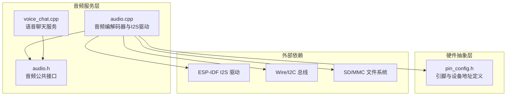
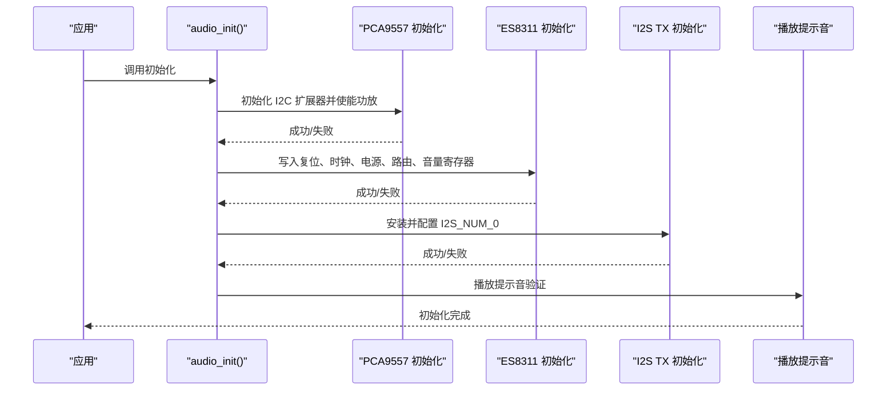
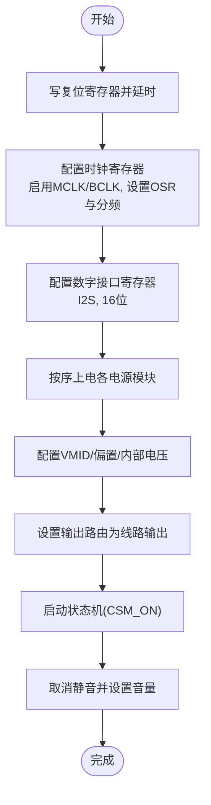
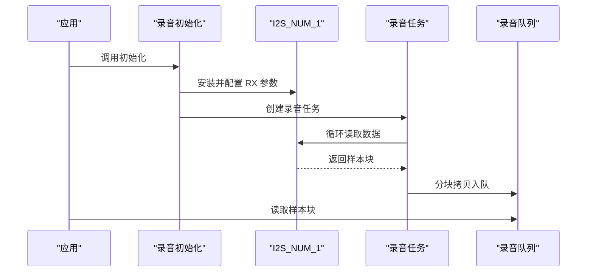
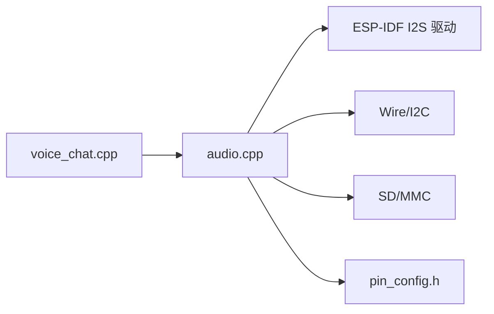

# 音频编解码器控制

<cite>
**本文引用的文件列表**
- [audio.cpp](file://src/service/audio.cpp)
- [audio.h](file://src/service/audio.h)
- [pin_config.h](file://src/pin_config.h)
- [pin_config.h](file://include/pin_config.h)
- [voice_chat.cpp](file://src/service/voice_chat.cpp)
- [DEBUG_REPORT.md](file://DEBUG_REPORT.md)
</cite>

## 目录
1. [简介](#简介)
2. [项目结构](#项目结构)
3. [核心组件](#核心组件)
4. [架构总览](#架构总览)
5. [详细组件分析](#详细组件分析)
6. [依赖关系分析](#依赖关系分析)
7. [性能考量](#性能考量)
8. [故障诊断指南](#故障诊断指南)
9. [结论](#结论)
10. [附录](#附录)

## 简介
本技术文档面向 SmartBracelet 的音频编解码器控制模块，聚焦于 ES8311 音频编解码器的初始化流程、寄存器配置、时钟与电源管理策略，以及 I2S 接口在播放与录音场景下的配置要点。文档同时覆盖 DAC 音量控制、ADC 增益与输出路由等控制机制，并提供音频质量优化与性能调优建议，以及常见问题的诊断与解决路径。

## 项目结构
音频相关代码集中在 src/service/audio.{cpp,h}，引脚定义位于 src/pin_config.h 与 include/pin_config.h，语音聊天服务位于 src/service/voice_chat.cpp。调试与历史修复记录见 DEBUG_REPORT.md。

图表来源
- [audio.cpp](file://src/service/audio.cpp#L1-L365)
- [audio.h](file://src/service/audio.h#L1-L23)
- [pin_config.h](file://src/pin_config.h#L1-L41)
- [pin_config.h](file://include/pin_config.h#L1-L41)
- [voice_chat.cpp](file://src/service/voice_chat.cpp#L1-L49)

章节来源
- [audio.cpp](file://src/service/audio.cpp#L1-L365)
- [audio.h](file://src/service/audio.h#L1-L23)
- [pin_config.h](file://src/pin_config.h#L1-L41)
- [pin_config.h](file://include/pin_config.h#L1-L41)
- [voice_chat.cpp](file://src/service/voice_chat.cpp#L1-L49)

## 核心组件
- ES8311 音频编解码器初始化与寄存器配置
- PCA9557 I2C I/O 扩展器用于功放使能
- I2S 主机模式播放（I2S_NUM_0）
- I2S 主机模式录音（I2S_NUM_1，INMP441）
- 音频播放与录音的公共 API

章节来源
- [audio.cpp](file://src/service/audio.cpp#L40-L124)
- [audio.cpp](file://src/service/audio.cpp#L126-L154)
- [audio.cpp](file://src/service/audio.cpp#L156-L236)
- [audio.h](file://src/service/audio.h#L4-L22)

## 架构总览
音频子系统采用“编解码器 + I2S + I2C”的分层设计：
- I2C 控制 ES8311 寄存器，完成时钟、模拟供电、输出路由与音量控制
- I2S 驱动负责数字音频数据流的发送与接收
- PCA9557 通过 I2C 控制功放使能引脚，确保音频输出链路完整

图表来源
- [audio.cpp](file://src/service/audio.cpp#L262-L282)

章节来源
- [audio.cpp](file://src/service/audio.cpp#L262-L282)

## 详细组件分析

### ES8311 编解码器初始化与寄存器映射
- 复位与状态机启动：先写复位寄存器，延时后清除复位并开启 CSM（从机模式）
- 时钟配置：启用主时钟与位时钟，设置 ADC/DAC 过采样率与分频
- 数字接口：配置 I2S 格式与位宽（16 位）
- 电源序列：按顺序上电各模块，确保模拟偏置与参考电压稳定
- 模拟配置：VMID、偏置与内部电压选择
- 输出路由：选择线路输出模式（非耳机放大器）
- 音量控制：取消静音并设置 DAC 音量寄存器

图表来源
- [audio.cpp](file://src/service/audio.cpp#L78-L124)

章节来源
- [audio.cpp](file://src/service/audio.cpp#L40-L124)

### I2S 接口配置（播放与录音）
- 播放（I2S_NUM_0，ES8311）：
  - 模式：主机 + 发送
  - 采样率：44.1 kHz
  - 位宽：16 位
  - 通道格式：仅左声道
  - 通信格式：标准 I2S
  - DMA：缓冲区数量与长度可调
  - 引脚：MCLK/BCK/WS/DO/DI
- 录音（I2S_NUM_1，INMP441）：
  - 模式：主机 + 接收
  - 采样率：16 kHz
  - 位宽：16 位
  - 通道格式：仅左声道
  - 通信格式：标准 I2S
  - DMA：缓冲区数量与长度可调
  - 引脚：SCK/WS/SD，LRS 引脚拉低选择左声道
  - 任务队列：录音数据分块入队，供上层消费

图表来源
- [audio.cpp](file://src/service/audio.cpp#L156-L236)

章节来源
- [audio.cpp](file://src/service/audio.cpp#L126-L154)
- [audio.cpp](file://src/service/audio.cpp#L156-L236)
- [audio.h](file://src/service/audio.h#L13-L22)

### 音频播放与录音 API
- 播放：
  - 播放正弦波测试
  - 播放 WAV 文件（动态解析头并设置采样率）
  - 停止播放与查询播放状态
  - 动态音量控制（百分比映射到 DAC 音量寄存器）
- 录音：
  - 初始化录音（I2S_NUM_1）
  - 开始/停止录音
  - 从队列读取样本块（阻塞等待）

章节来源
- [audio.h](file://src/service/audio.h#L4-L22)
- [audio.cpp](file://src/service/audio.cpp#L261-L364)

### 引脚与设备地址
- I2C 引脚：SDA/SCL
- ES8311 地址：0x18
- PCA9557 地址：0x19
- I2S 播放引脚：MCLK/BCK/WS/DO/DI
- I2S 录音引脚：SCK/WS/SD，LRS 选择左声道

章节来源
- [pin_config.h](file://src/pin_config.h#L14-L41)
- [pin_config.h](file://include/pin_config.h#L14-L41)

## 依赖关系分析
- 音频模块依赖：
  - I2C 总线（Wire）用于 ES8311 与 PCA9557
  - ESP-IDF I2S 驱动（i2s_driver_install/i2s_set_pin）
  - SD/MMC 文件系统（WAV 播放）
  - 任务队列与内存分配（录音任务与队列）
- 组件耦合：
  - ES8311 初始化与 I2S 播放初始化顺序严格，需先完成编解码器配置再安装 I2S
  - 录音使用独立 I2S 接口与任务队列，避免与播放冲突

图表来源
- [audio.cpp](file://src/service/audio.cpp#L1-L365)
- [pin_config.h](file://src/pin_config.h#L1-L41)
- [voice_chat.cpp](file://src/service/voice_chat.cpp#L1-L49)

章节来源
- [audio.cpp](file://src/service/audio.cpp#L1-L365)
- [pin_config.h](file://src/pin_config.h#L1-L41)
- [voice_chat.cpp](file://src/service/voice_chat.cpp#L1-L49)

## 性能考量
- I2S DMA 缓冲区大小与数量：
  - 播放：DMA 缓冲区数量与长度影响中断频率与 CPU 占用，需根据音频延迟与 CPU 负载平衡
  - 录音：分块大小决定上层处理周期与实时性，建议与目标采样率匹配（如 16kHz 下 32ms 块）
- 采样率切换：
  - 播放 WAV 时动态设置采样率，结束后恢复默认，避免频繁切换带来的不稳定
- 音量控制：
  - 百分比到寄存器值的映射需限制上下限，防止越界导致异常
- 任务优先级与核心亲和：
  - 录音任务使用较高优先级与指定核心，减少中断抖动对音频的影响

章节来源
- [audio.cpp](file://src/service/audio.cpp#L127-L154)
- [audio.cpp](file://src/service/audio.cpp#L190-L236)
- [audio.cpp](file://src/service/audio.cpp#L330-L343)
- [audio.cpp](file://src/service/audio.cpp#L347-L354)

## 故障诊断指南
- I2C 通信失败（ES8311 无响应）：
  - 检查 SDA/SCL 引脚是否正确，上拉电阻是否合适
  - 确认设备地址是否为 0x18
  - 参考调试报告中关于 I2C 通信正常但无音频输出的问题定位
- 功放未使能：
  - PA_EN 实际由 PCA9557 IO1 控制，需先初始化 PCA9557 并设置 IO1 为高电平
  - 若初始化失败，音频输出可能无声
- I2S 格式不匹配：
  - ES8311 配置为 16 位 I2S，ESP32 I2S 驱动也应配置为 16 位
  - 若位宽不一致，会导致音频失真或无声
- 启动提示音缺失：
  - 需实现并调用播放正弦波函数进行自检
- 录音无声或数据丢失：
  - 确认 LRS 引脚拉低选择左声道
  - 检查 I2S 引脚连接与配置
  - 关注队列满时丢弃数据的情况

章节来源
- [DEBUG_REPORT.md](file://DEBUG_REPORT.md#L988-L994)
- [audio.cpp](file://src/service/audio.cpp#L262-L282)
- [audio.cpp](file://src/service/audio.cpp#L190-L236)

## 结论
该音频控制模块通过严格的初始化顺序与寄存器配置，结合 I2S 主机模式的播放与录音能力，实现了从编解码器到扬声器/麦克风的完整音频链路。通过 PCA9557 控制功放、动态音量调节与队列化录音处理，系统具备良好的可维护性与扩展性。建议在后续版本中进一步完善错误上报与日志记录，以提升问题定位效率。

## 附录

### ES8311 寄存器映射与用途摘要
- 复位与状态机：用于复位与启动内部状态机
- 时钟配置：启用主时钟与位时钟，设置过采样率与分频
- 数字接口：配置 I2S 格式与位宽
- 电源序列：按序上电各模块
- 模拟配置：VMID、偏置与内部电压
- 输出路由：选择线路输出模式
- 音量控制：取消静音并设置 DAC 音量

章节来源
- [audio.cpp](file://src/service/audio.cpp#L40-L124)

### I2S 参数对照表
- 播放（I2S_NUM_0，ES8311）
  - 模式：主机 + 发送
  - 采样率：44.1 kHz
  - 位宽：16 位
  - 通道格式：仅左声道
  - 通信格式：标准 I2S
  - DMA：缓冲区数量与长度可调
- 录音（I2S_NUM_1，INMP441）
  - 模式：主机 + 接收
  - 采样率：16 kHz
  - 位宽：16 位
  - 通道格式：仅左声道
  - 通信格式：标准 I2S
  - DMA：缓冲区数量与长度可调

章节来源
- [audio.cpp](file://src/service/audio.cpp#L126-L154)
- [audio.cpp](file://src/service/audio.cpp#L156-L236)
- [audio.h](file://src/service/audio.h#L13-L22)