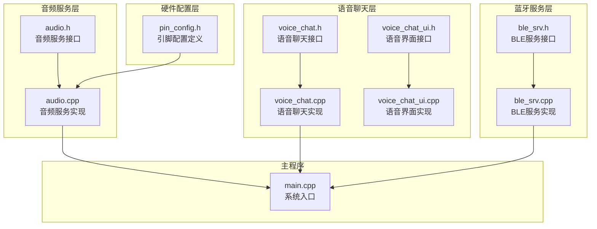
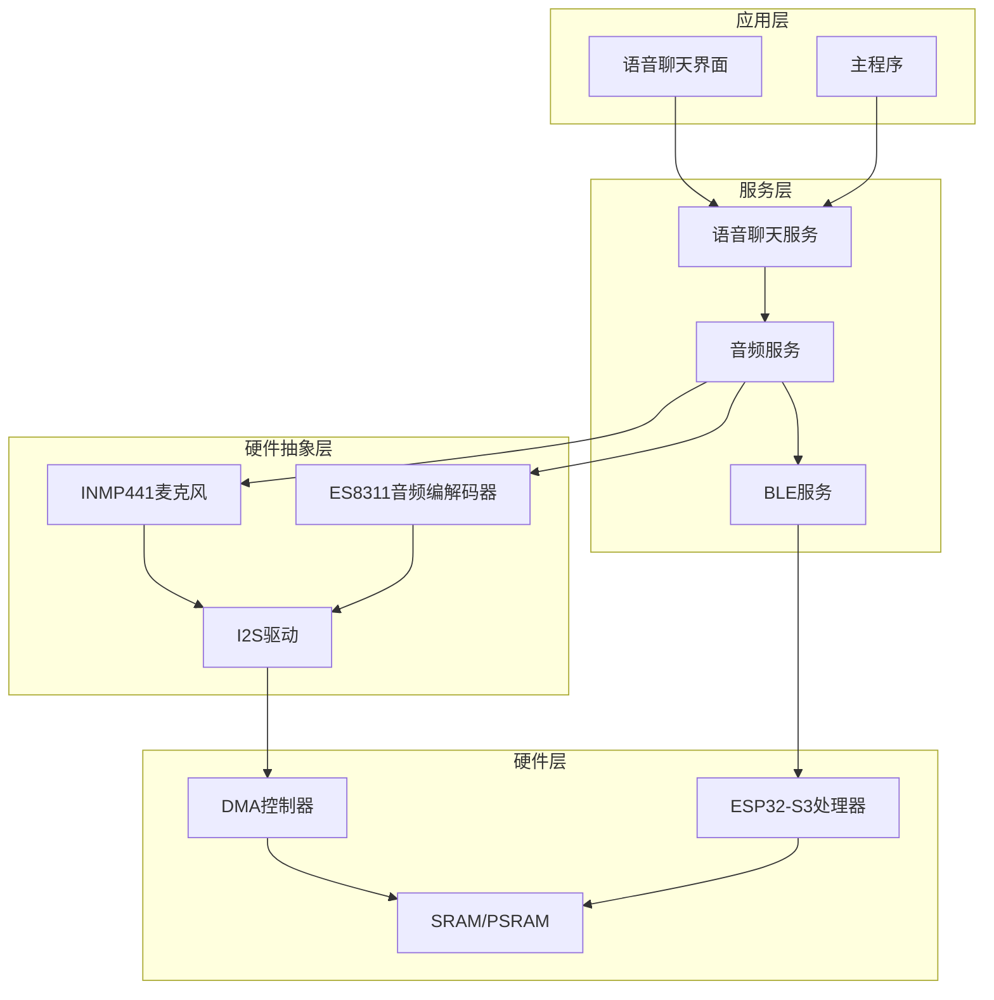
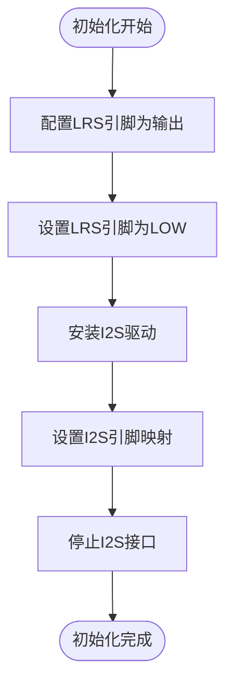
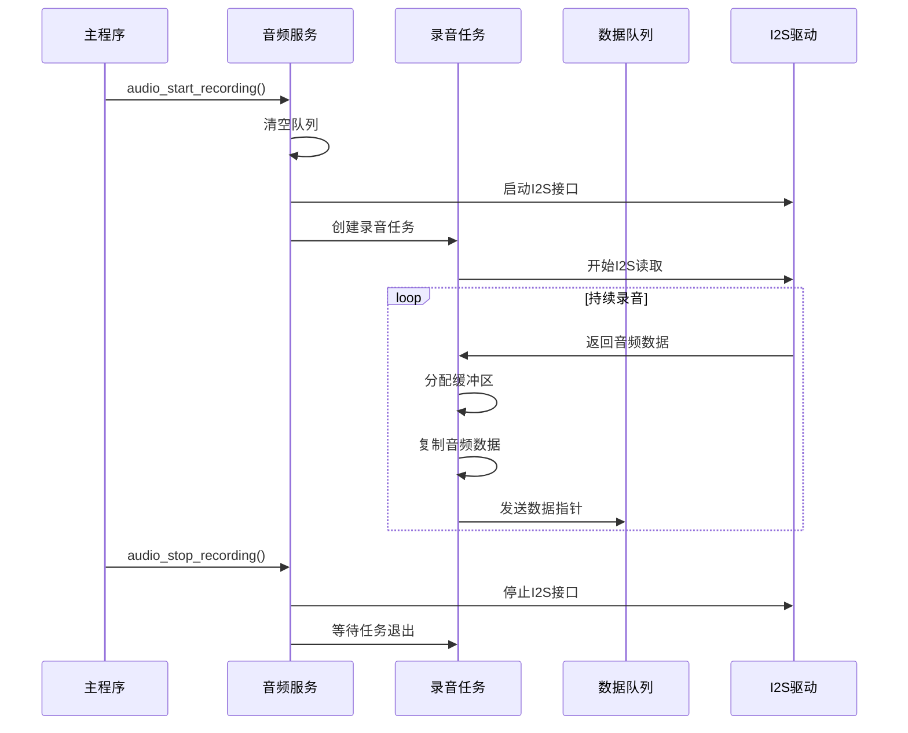
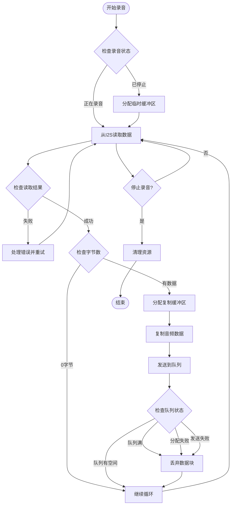
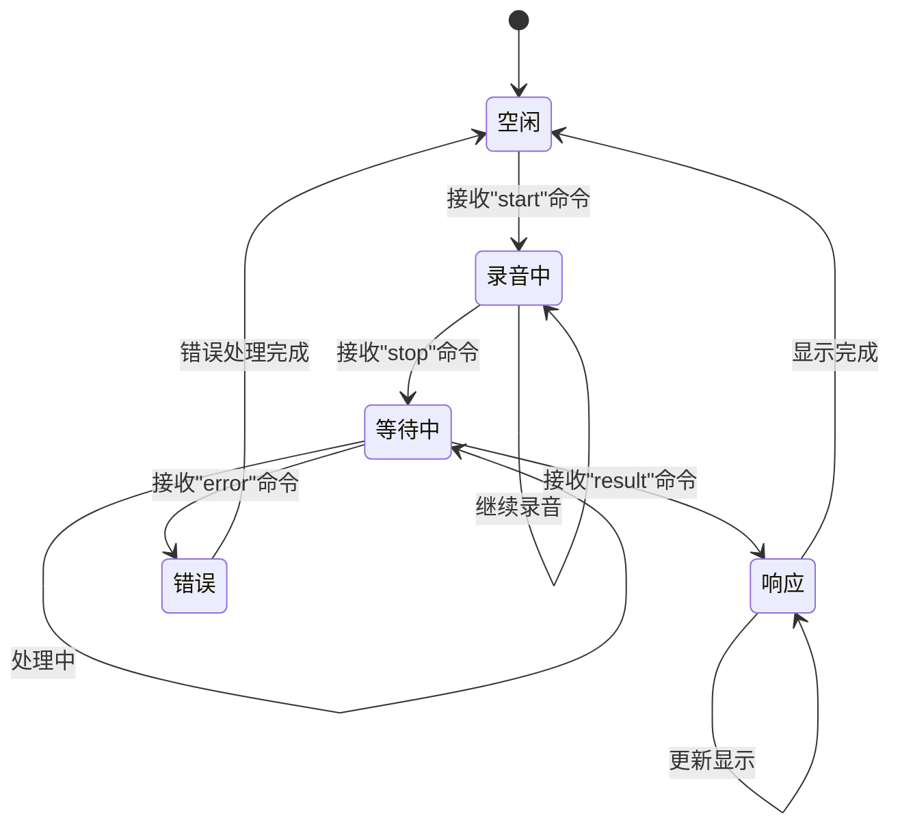
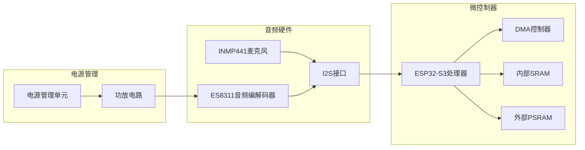
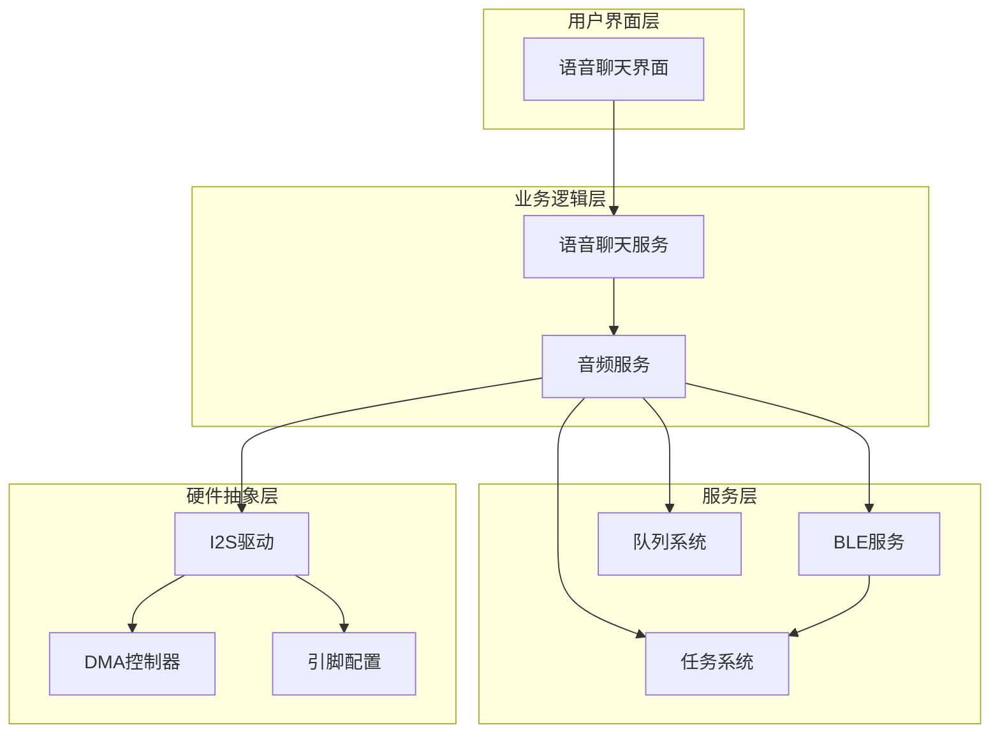
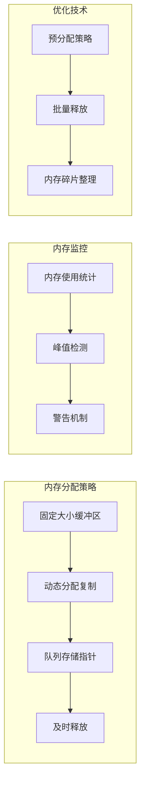
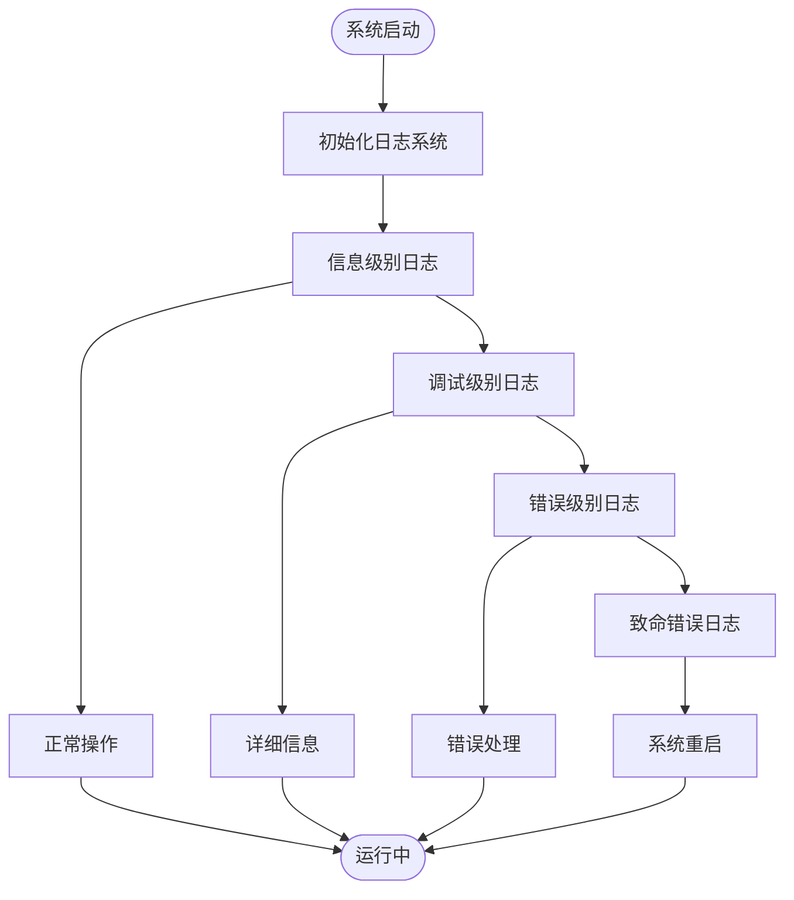

# 麦克风录音系统

<cite>
**本文档引用的文件**
- [audio.h](file://src/service/audio.h)
- [audio.cpp](file://src/service/audio.cpp)
- [pin_config.h](file://include/pin_config.h)
- [voice_chat.h](file://src/service/voice_chat.h)
- [voice_chat.cpp](file://src/service/voice_chat.cpp)
- [ble_srv.h](file://src/service/ble_srv.h)
- [ble_srv.cpp](file://src/service/ble_srv.cpp)
- [voice_chat_ui.h](file://src/voice_chat_ui.h)
- [voice_chat_ui.cpp](file://src/voice_chat_ui.cpp)
- [main.cpp](file://src/main.cpp)
</cite>

## 目录
1. [简介](#简介)
2. [项目结构](#项目结构)
3. [核心组件](#核心组件)
4. [架构概览](#架构概览)
5. [详细组件分析](#详细组件分析)
6. [依赖关系分析](#依赖关系分析)
7. [性能考虑](#性能考虑)
8. [故障诊断指南](#故障诊断指南)
9. [结论](#结论)

## 简介

SmartBracelet麦克风录音系统是一个基于ESP32-S3平台的音频采集解决方案，专门设计用于智能手环设备。该系统采用INMP441 MEMS麦克风作为音频输入源，通过I2S接口实现高质量的数字音频采集，并集成了完整的录音、处理和传输功能。

系统的核心特点包括：
- INMP441 MEMS麦克风的精确配置和控制
- 基于FreeRTOS的任务调度和队列通信机制
- DMA缓冲区管理优化
- 实时录音和云端处理集成
- 完整的音频质量控制和优化策略

## 项目结构

SmartBracelet项目的音频录音系统主要分布在以下目录结构中：



**图表来源**
- [audio.h](file://src/service/audio.h#L1-L23)
- [audio.cpp](file://src/service/audio.cpp#L1-L365)
- [pin_config.h](file://include/pin_config.h#L1-L41)

**章节来源**
- [audio.h](file://src/service/audio.h#L1-L23)
- [audio.cpp](file://src/service/audio.cpp#L1-L365)
- [pin_config.h](file://include/pin_config.h#L1-L41)

## 核心组件

### INMP441 MEMS麦克风配置

INMP441 MEMS麦克风是系统的主要音频输入设备，具有以下关键配置参数：

| 参数 | 数值 | 描述 |
|------|------|------|
| 采样率 | 16 kHz | 语音识别标准采样率 |
| 位深度 | 16 bit | 支持高保真音频录制 |
| 通道格式 | 单声道左通道 | 优化内存使用 |
| I2S模式 | 主模式接收 | 独立时钟控制 |
| DMA缓冲区数量 | 4个 | 提供连续数据流 |
| DMA缓冲区长度 | 1024样本 | 平衡延迟和内存使用 |

### I2S驱动配置

系统使用两个独立的I2S接口：
- **I2S_NUM_0**: 驱动扬声器（ES8311音频编解码器）
- **I2S_NUM_1**: 麦克风输入（INMP441 MEMS麦克风）

每个I2S接口都经过精心配置以满足特定的应用需求。

**章节来源**
- [audio.h](file://src/service/audio.h#L14-L16)
- [audio.cpp](file://src/service/audio.cpp#L190-L223)
- [pin_config.h](file://include/pin_config.h#L37-L41)

## 架构概览

麦克风录音系统的整体架构采用分层设计，确保了模块化和可维护性：



**图表来源**
- [audio.cpp](file://src/service/audio.cpp#L156-L260)
- [voice_chat.cpp](file://src/service/voice_chat.cpp#L1-L49)
- [ble_srv.cpp](file://src/service/ble_srv.cpp#L250-L285)

## 详细组件分析

### INMP441麦克风配置详解

#### LRS引脚配置

INMP441麦克风的LRS（Left/Right Select）引脚用于选择音频通道：



**图表来源**
- [audio.cpp](file://src/service/audio.cpp#L190-L218)

LRS引脚配置的关键点：
- 引脚类型：OUTPUT（输出）
- 默认状态：LOW（选择左通道）
- 作用：控制麦克风选择单声道左通道输入

#### 采样率设置

系统采用16 kHz的标准语音采样率，这是经过精心选择的平衡点：

| 采样率选项 | 适用场景 | 优势 | 劣势 |
|------------|----------|------|------|
| 8 kHz | 语音识别 | 低带宽需求 | 音质较低 |
| 16 kHz | 语音通话 | 良好音质平衡 | 中等带宽 |
| 32 kHz | 高质量音频 | 优秀音质 | 高带宽需求 |
| 44.1 kHz | CD质量 | 最佳音质 | 大量带宽 |

**章节来源**
- [audio.h](file://src/service/audio.h#L14-L14)
- [audio.cpp](file://src/service/audio.cpp#L196-L196)

### 录音任务实现机制

#### 任务调度架构

录音系统采用FreeRTOS任务模型，确保实时性和稳定性：



**图表来源**
- [audio.cpp](file://src/service/audio.cpp#L225-L245)
- [audio.cpp](file://src/service/audio.cpp#L165-L188)

#### DMA缓冲区管理

系统采用多缓冲区策略优化音频流处理：

| 缓冲区参数 | 数值 | 计算公式 | 说明 |
|------------|------|----------|------|
| DMA缓冲区数量 | 4 | N/A | 提供连续数据流 |
| 每缓冲区样本数 | 1024 | N/A | 平衡延迟和内存 |
| 块大小样本数 | 512 | 1024/2 | 适中的数据块 |
| 队列深度 | 8 | N/A | 防止数据丢失 |
| 块大小字节 | 1024 | 512 × 2 | 16位样本的字节数 |

**章节来源**
- [audio.cpp](file://src/service/audio.cpp#L161-L163)
- [audio.cpp](file://src/service/audio.cpp#L220-L220)

### 录音数据处理流程

#### 数据读取和缓冲区复制

录音数据的处理遵循严格的内存管理和错误处理机制：



**图表来源**
- [audio.cpp](file://src/service/audio.cpp#L169-L184)
- [audio.cpp](file://src/service/audio.cpp#L175-L182)

#### 队列通信机制

系统使用FreeRTOS队列实现生产者-消费者模式：

| 队列属性 | 数值 | 描述 |
|----------|------|------|
| 队列类型 | 指针队列 | 存储数据指针而非数据本身 |
| 队列长度 | 8 | 可存储8个数据块 |
| 元素大小 | sizeof(int16_t*) | 指针大小 |
| 阻塞时间 | 100ms | 队列满时的等待时间 |
| 超时时间 | 200ms | 读取超时时间 |

**章节来源**
- [audio.cpp](file://src/service/audio.cpp#L158-L159)
- [audio.cpp](file://src/service/audio.cpp#L220-L220)
- [audio.cpp](file://src/service/audio.cpp#L247-L257)

### 语音聊天系统集成

#### 语音聊天状态管理

语音聊天系统采用有限状态机管理录音过程：



**图表来源**
- [voice_chat.h](file://src/service/voice_chat.h#L4-L9)
- [voice_chat.cpp](file://src/service/voice_chat.cpp#L12-L39)

#### BLE通信协议

系统通过BLE服务实现手机与手表的双向通信：

| 命令类型 | 格式 | 用途 | 示例 |
|----------|------|------|------|
| 开始录音 | "voice:start" | 启动手机录音 | "voice:start" |
| 停止录音 | "voice:stop" | 结束录音并开始处理 | "voice:stop" |
| 处理结果 | "voice:result\|转录\|响应" | 返回云端处理结果 | "voice:result\|你好\|你好" |
| 错误信息 | "voice:error\|错误描述" | 通知错误状态 | "voice:error\|网络错误" |

**章节来源**
- [voice_chat.cpp](file://src/service/voice_chat.cpp#L12-L39)
- [ble_srv.cpp](file://src/service/ble_srv.cpp#L71-L80)

## 依赖关系分析

### 硬件依赖关系

麦克风录音系统涉及多个硬件组件的协调工作：



**图表来源**
- [pin_config.h](file://include/pin_config.h#L27-L41)
- [audio.cpp](file://src/service/audio.cpp#L127-L154)

### 软件依赖关系

系统软件层之间存在清晰的依赖层次：



**图表来源**
- [main.cpp](file://src/main.cpp#L647-L648)
- [audio.cpp](file://src/service/audio.cpp#L156-L159)

**章节来源**
- [main.cpp](file://src/main.cpp#L615-L722)
- [audio.cpp](file://src/service/audio.cpp#L1-L365)

## 性能考虑

### 采样率优化策略

针对SmartBracelet设备的特点，系统采用了以下采样率优化策略：

| 优化维度 | 当前配置 | 优化建议 | 预期效果 |
|----------|----------|----------|----------|
| 采样率 | 16 kHz | 保持不变 | 平衡音质和性能 |
| 位深度 | 16 bit | 保持不变 | 标准音频质量 |
| 通道格式 | 单声道 | 保持不变 | 减少处理开销 |
| DMA缓冲区 | 4个×1024样本 | 保持不变 | 稳定的数据流 |
| 队列深度 | 8 | 可调整至6-10 | 根据实际需求优化 |

### 缓冲区大小调整

缓冲区配置直接影响系统的实时性和稳定性：

| 参数 | 默认值 | 调整范围 | 性能影响 |
|------|--------|----------|----------|
| DMA缓冲区数量 | 4 | 2-8 | 增加提高稳定性但占用更多内存 |
| DMA缓冲区长度 | 1024 | 512-2048 | 增大降低中断频率但增加延迟 |
| 块大小 | 512样本 | 256-1024 | 影响CPU使用率和内存占用 |
| 队列深度 | 8 | 4-16 | 影响数据丢失风险和内存使用 |

### 内存管理优化

系统采用多种内存管理策略确保稳定运行：



**图表来源**
- [audio.cpp](file://src/service/audio.cpp#L165-L188)
- [audio.cpp](file://src/service/audio.cpp#L247-L257)

## 故障诊断指南

### 常见问题及解决方案

#### 麦克风无声音输入

**症状表现**：录音时没有音频数据或数据全为零

**可能原因**：
1. LRS引脚配置错误
2. I2S引脚连接问题
3. 麦克风供电异常
4. I2S驱动安装失败

**诊断步骤**：
1. 检查LRS引脚电平状态
2. 验证I2S引脚映射配置
3. 测量麦克风供电电压
4. 查看I2S安装返回错误码

**解决方法**：
```cpp
// LRS引脚检查示例
pinMode(INMP441_LRS, OUTPUT);
digitalWrite(INMP441_LRS, LOW);  // 确保设置为LOW
```

#### 录音数据丢失

**症状表现**：队列中出现NULL指针或数据块丢失

**可能原因**：
1. 队列深度不足
2. DMA缓冲区溢出
3. 内存分配失败
4. 任务优先级不当

**诊断工具**：
1. 监控队列使用情况
2. 检查内存分配成功率
3. 分析任务执行时间
4. 观察DMA中断频率

**优化策略**：
- 增大队列深度至10-12
- 调整DMA缓冲区大小
- 实施内存池管理
- 优化任务调度优先级

#### 音频质量异常

**症状表现**：录音出现杂音、失真或音量过小

**可能原因**：
1. 采样率配置错误
2. I2S时序问题
3. 电源纹波干扰
4. 外部噪声耦合

**检测方法**：
1. 使用示波器测量I2S信号
2. 分析FFT频谱
3. 检查电源纹波
4. 测试不同环境下的音频质量

**改善措施**：
- 确保I2S时钟精度
- 优化PCB布线减少干扰
- 实施数字滤波算法
- 调整增益控制参数

### 性能监控方法

#### 实时性能指标

系统提供了多种性能监控手段：

| 监控指标 | 测量方法 | 正常范围 | 异常阈值 |
|----------|----------|----------|----------|
| CPU使用率 | FreeRTOS任务统计 | <80% | >90% |
| 内存使用 | heap_caps_get_free_size | >10KB | <5KB |
| 队列占用率 | uxQueueSpacesAvailable | >50% | <20% |
| DMA中断频率 | 中断计数器 | 10-50 Hz | >100 Hz |
| 任务栈剩余 | vTaskGetStackHighWaterMark | >20% | <10% |

#### 日志记录和调试

系统采用分级日志记录机制：



**图表来源**
- [audio.cpp](file://src/service/audio.cpp#L220-L222)
- [voice_chat.cpp](file://src/service/voice_chat.cpp#L15-L38)

**章节来源**
- [audio.cpp](file://src/service/audio.cpp#L1-L365)
- [voice_chat.cpp](file://src/service/voice_chat.cpp#L1-L49)

## 结论

SmartBracelet麦克风录音系统展现了现代嵌入式音频应用的完整实现方案。系统通过精心设计的硬件配置、高效的软件架构和完善的错误处理机制，实现了稳定可靠的音频采集功能。

### 主要成就

1. **硬件配置优化**：INMP441麦克风的精确配置确保了高质量的音频输入
2. **实时性能保证**：基于FreeRTOS的任务调度和DMA缓冲区管理提供了稳定的实时性能
3. **系统集成完善**：与BLE服务、语音聊天界面的无缝集成提升了用户体验
4. **故障诊断完备**：全面的日志记录和性能监控机制便于问题排查和系统优化

### 技术特色

- **双I2S接口设计**：独立的麦克风和扬声器接口避免了相互干扰
- **多级缓冲策略**：DMA缓冲区、队列缓冲区和任务缓冲区的多层次设计
- **灵活的采样率配置**：可根据应用场景调整采样参数
- **完善的错误处理**：从硬件到软件的全链路错误检测和恢复机制

### 未来改进方向

1. **算法优化**：集成更先进的噪声抑制和回声消除算法
2. **性能提升**：优化内存使用和CPU占用率
3. **功能扩展**：支持多通道录音和立体声处理
4. **智能化增强**：集成机器学习算法进行音频内容分析

该系统为智能穿戴设备的音频应用提供了优秀的参考实现，其设计理念和实现细节对于类似项目的开发具有重要的指导价值。