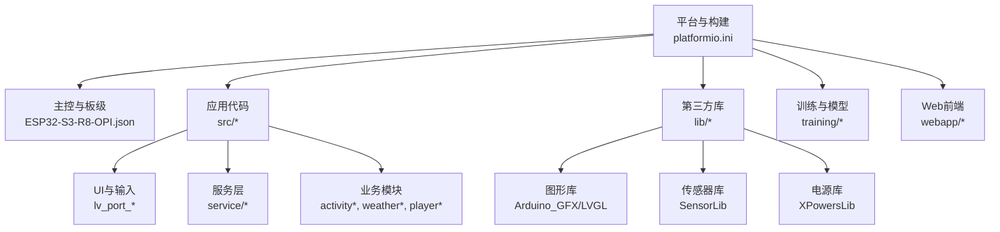
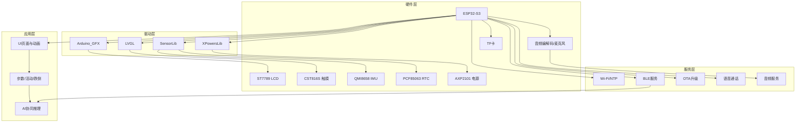
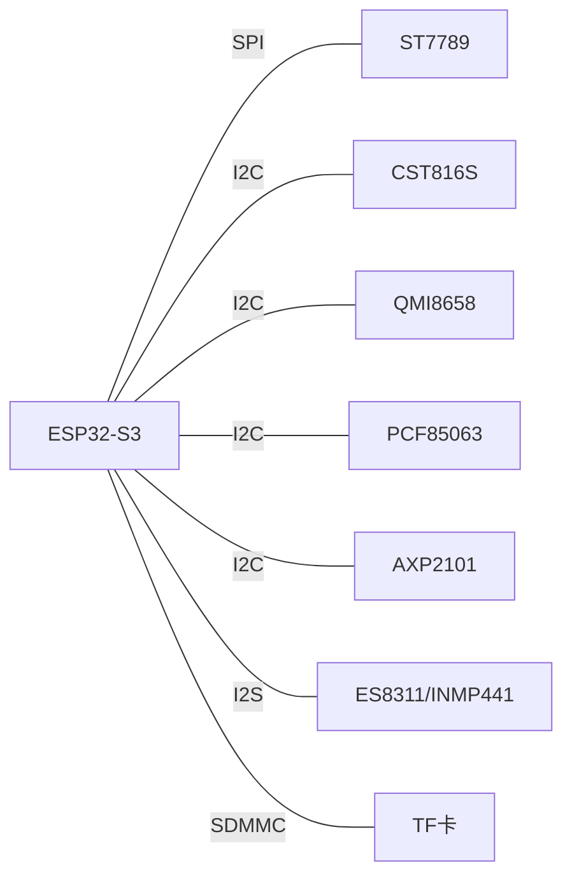
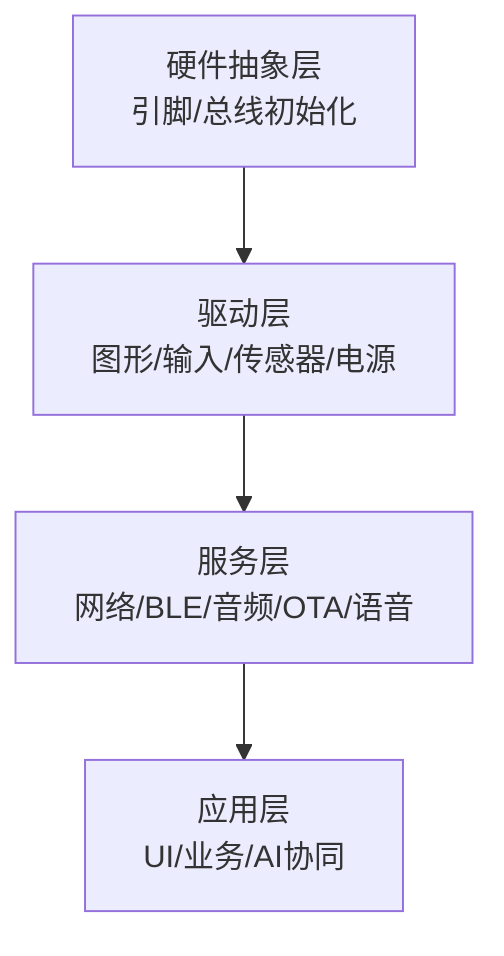
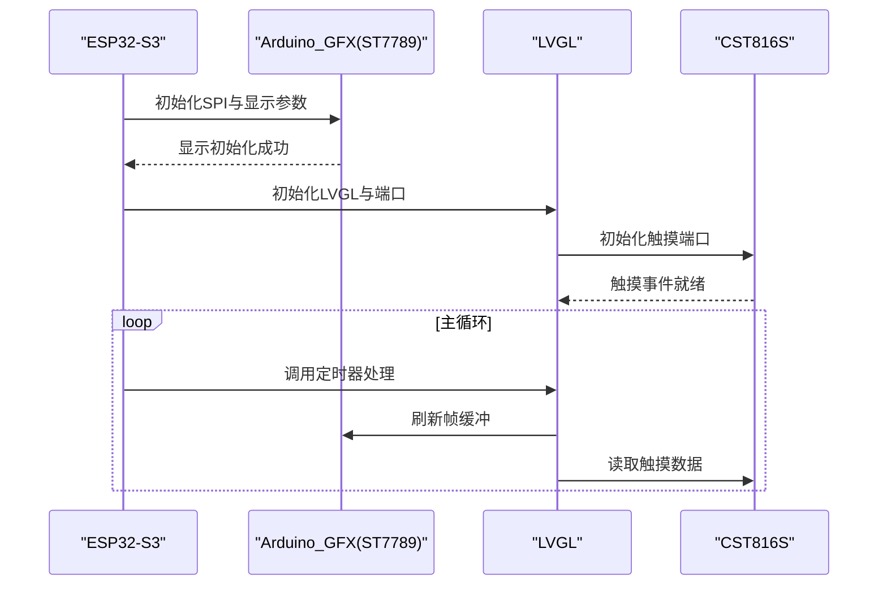
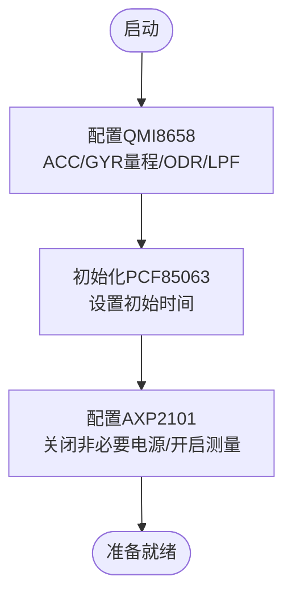
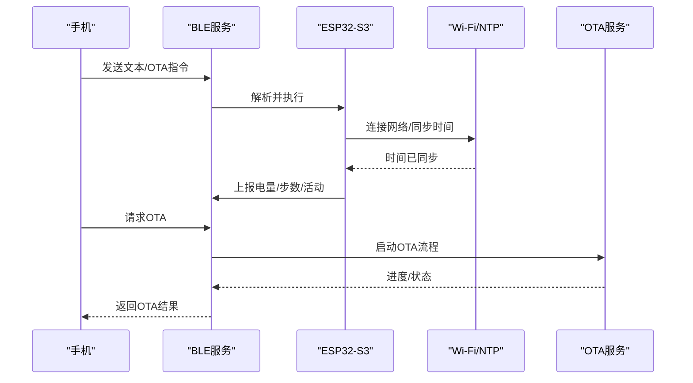
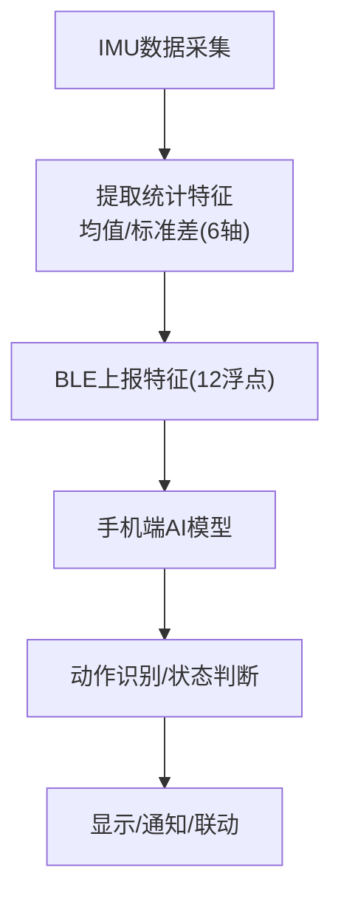
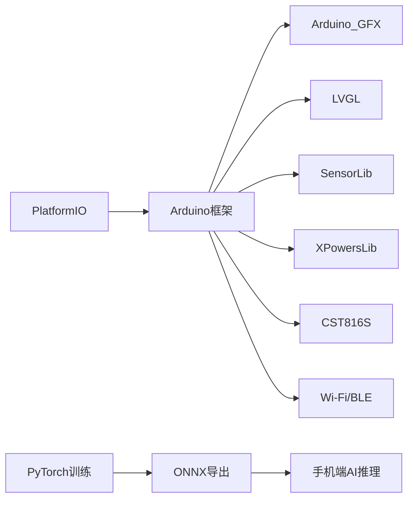

# 技术架构

<cite>
**本文引用的文件**
- [platformio.ini](file://platformio.ini)
- [ESP32-S3-R8-OPI.json](file://boards/ESP32-S3-R8-OPI.json)
- [pin_config.h](file://include/pin_config.h)
- [lv_conf.h](file://include/lv_conf.h)
- [main.cpp](file://src/main.cpp)
- [lv_port_disp.h](file://src/lv_port_disp.h)
- [lv_port_indev.h](file://src/lv_port_indev.h)
- [wifi_ntp.h](file://src/service/wifi_ntp.h)
- [ble_srv.h](file://src/service/ble_srv.h)
- [SensorQMI8658.hpp](file://lib/SensorLib-Waveshare/src/SensorQMI8658.hpp)
- [SensorPCF85063.hpp](file://lib/SensorLib-Waveshare/src/SensorPCF85063.hpp)
- [XPowersLib.h](file://lib/XPowersLib/src/XPowersLib.h)
- [model.py](file://training/model.py)
- [train.py](file://training/train.py)
- [activity.h](file://src/activity.h)
</cite>

## 目录
1. [引言](#引言)
2. [项目结构](#项目结构)
3. [核心组件](#核心组件)
4. [架构总览](#架构总览)
5. [详细组件分析](#详细组件分析)
6. [依赖分析](#依赖分析)
7. [性能考虑](#性能考虑)
8. [故障排查指南](#故障排查指南)
9. [结论](#结论)
10. [附录](#附录)

## 引言
本技术架构文档面向SmartBracelet智能手环项目，系统性阐述硬件与软件两层架构：硬件侧覆盖ESP32-S3主控、ST7789 LCD显示、CST816S触摸、QMI8658 IMU、PCF85063 RTC、AXP2101电源管理等核心器件的连接与数据流；软件侧采用分层设计（硬件抽象层、驱动层、服务层、应用层），并重点说明图形库选型（Arduino_GFX + LVGL）、AI边缘推理方案及其实现路径。文末提供系统框图与组件关系图，帮助开发者快速理解整体运行机制。

## 项目结构
项目采用按功能域划分的目录组织方式：
- include：公共配置头文件（引脚定义、LVGL配置）
- lib：第三方库源码（图形库、传感器库、电源管理库）
- src：应用代码（入口、UI、服务、业务逻辑）
- training：AI训练与模型导出脚本
- webapp：移动端前端（Capacitor + Android工程）
- boards：开发板JSON配置
- platformio.ini：构建与依赖配置

图表来源
- [platformio.ini](file://platformio.ini#L1-L41)
- [ESP32-S3-R8-OPI.json](file://boards/ESP32-S3-R8-OPI.json#L1-L40)
- [main.cpp](file://src/main.cpp#L1-L120)

章节来源
- [platformio.ini](file://platformio.ini#L1-L41)
- [ESP32-S3-R8-OPI.json](file://boards/ESP32-S3-R8-OPI.json#L1-L40)

## 核心组件
- 硬件主控：ESP32-S3（双核240MHz，集成Wi-Fi/蓝牙，具备PSRAM）
- 显示与输入：ST7789 LCD + CST816S电容触摸
- 传感器：QMI8658六轴IMU（加速度计+陀螺仪）+ PCF85063实时时钟
- 电源管理：AXP2101电源芯片（DC/DC、LDO、充电控制、电量计量）
- 通信与网络：Wi-Fi/蓝牙（BLE）用于NTP同步、OTA升级、手机互联
- 存储：TF卡（SDMMC 1-bit模式）用于音频/资源存储

章节来源
- [main.cpp](file://src/main.cpp#L615-L722)
- [pin_config.h](file://include/pin_config.h#L1-L41)
- [SensorQMI8658.hpp](file://lib/SensorLib-Waveshare/src/SensorQMI8658.hpp#L311-L420)
- [SensorPCF85063.hpp](file://lib/SensorLib-Waveshare/src/SensorPCF85063.hpp#L91-L135)
- [XPowersLib.h](file://lib/XPowersLib/src/XPowersLib.h#L14-L28)

## 架构总览
系统采用“分层解耦”的软件架构：
- 硬件抽象层（HAL）：封装引脚、I2C/I2S、SPI等底层接口
- 驱动层：图形驱动（Arduino_GFX + ST7789）、输入驱动（CST816S）、传感器驱动（QMI8658/PCF85063）、电源驱动（AXP2101）
- 服务层：网络服务（Wi-Fi/NTP）、BLE服务（数据/OTA/通知）、音频服务、OTA更新、语音通话
- 应用层：UI页面（时钟/步数/传感器/通知/运动/音乐/语音）、业务算法（步数、活动识别、跌倒检测）

图表来源
- [main.cpp](file://src/main.cpp#L615-L722)
- [lv_port_disp.h](file://src/lv_port_disp.h#L1-L11)
- [lv_port_indev.h](file://src/lv_port_indev.h#L1-L11)
- [SensorQMI8658.hpp](file://lib/SensorLib-Waveshare/src/SensorQMI8658.hpp#L311-L420)
- [SensorPCF85063.hpp](file://lib/SensorLib-Waveshare/src/SensorPCF85063.hpp#L91-L135)
- [XPowersLib.h](file://lib/XPowersLib/src/XPowersLib.h#L14-L28)

## 详细组件分析

### 硬件架构与连接关系
- 显示与背光：ST7789通过SPI连接至ESP32-S3的GPIO引脚，背光由单独GPIO控制
- 触摸：CST816S通过I2C与ESP32-S3相连，提供手势与点触输入
- 传感器：QMI8658与PCF85063均通过I2C与ESP32-S3通信
- 电源：AXP2101通过I2C供电与管理各路电压输出与充电
- 音频：ES8311音频编解码器与INMP441 MEMS麦克风通过I2S与ESP32-S3通信
- 存储：TF卡使用SDMMC 1-bit模式连接

图表来源
- [pin_config.h](file://include/pin_config.h#L1-L41)
- [main.cpp](file://src/main.cpp#L626-L668)

章节来源
- [pin_config.h](file://include/pin_config.h#L1-L41)
- [main.cpp](file://src/main.cpp#L626-L668)

### 软件架构与分层设计
- 硬件抽象层：统一引脚与外设初始化（setup中完成）
- 驱动层：图形与输入驱动（LVGL端口）、传感器驱动（SensorLib）、电源驱动（XPowersLib）
- 服务层：网络（Wi-Fi/NTP）、BLE（数据/OTA/通知）、音频、OTA、语音
- 应用层：UI页面、业务算法（步数/活动/跌倒）、AI协同推理

图表来源
- [main.cpp](file://src/main.cpp#L615-L722)
- [lv_port_disp.h](file://src/lv_port_disp.h#L1-L11)
- [lv_port_indev.h](file://src/lv_port_indev.h#L1-L11)
- [wifi_ntp.h](file://src/service/wifi_ntp.h#L1-L26)
- [ble_srv.h](file://src/service/ble_srv.h#L1-L50)

章节来源
- [main.cpp](file://src/main.cpp#L615-L722)

### 图形与输入子系统（Arduino_GFX + LVGL）
- 图形栈：Arduino_GFX提供ST7789驱动，LVGL负责UI渲染与事件循环
- 输入栈：LVGL输入设备驱动对接CST816S触摸，支持滑动与点击
- 配置：LVGL内存与刷新周期在头文件中集中配置

图表来源
- [main.cpp](file://src/main.cpp#L615-L722)
- [lv_port_disp.h](file://src/lv_port_disp.h#L1-L11)
- [lv_port_indev.h](file://src/lv_port_indev.h#L1-L11)
- [lv_conf.h](file://include/lv_conf.h#L1-L114)

章节来源
- [lv_conf.h](file://include/lv_conf.h#L1-L114)
- [main.cpp](file://src/main.cpp#L615-L722)

### 传感器与时间管理
- IMU（QMI8658）：配置加速度计与陀螺仪量程、采样率与低通滤波，启用数据就绪中断
- RTC（PCF85063）：设置时间、获取日期时间、支持闹钟（未在主流程使用）
- 电源（AXP2101）：关闭非必要DC/DC与LDO，仅保留核心供电；启用电池/系统/USB电压测量与充电控制

图表来源
- [main.cpp](file://src/main.cpp#L661-L716)
- [SensorQMI8658.hpp](file://lib/SensorLib-Waveshare/src/SensorQMI8658.hpp#L311-L420)
- [SensorPCF85063.hpp](file://lib/SensorLib-Waveshare/src/SensorPCF85063.hpp#L91-L135)
- [XPowersLib.h](file://lib/XPowersLib/src/XPowersLib.h#L14-L28)

章节来源
- [main.cpp](file://src/main.cpp#L661-L716)

### 服务层：网络、BLE、OTA与音频
- Wi-Fi/NTP：自动连接指定SSID，周期性同步时间，功耗管理（周期性开关）
- BLE服务：提供数据服务（步数、电量、活动状态）、OTA状态上报、通知转发、语音命令回调
- OTA升级：BLE触发，进度与状态上报
- 音频：初始化音频编解码与麦克风，支持播放与录音

图表来源
- [wifi_ntp.h](file://src/service/wifi_ntp.h#L1-L26)
- [ble_srv.h](file://src/service/ble_srv.h#L1-L50)
- [main.cpp](file://src/main.cpp#L724-L926)

章节来源
- [wifi_ntp.h](file://src/service/wifi_ntp.h#L1-L26)
- [ble_srv.h](file://src/service/ble_srv.h#L1-L50)
- [main.cpp](file://src/main.cpp#L724-L926)

### AI边缘推理与协同
- 训练模型：提供轻量化1D-CNN（TinyHAR）与TCN两种结构，参数量与模型大小适配嵌入式
- 推理路径：手环侧实时提取IMU特征（均值/标准差），周期性通过BLE发送给手机端进行AI协同推理，或本地部署（需额外工具链与模型转换）
- 数据流：手环采集IMU数据，计算统计特征，BLE上报，手机端加载ONNX/TFLite模型进行分类

图表来源
- [activity.h](file://src/activity.h#L1-L13)
- [model.py](file://training/model.py#L5-L69)
- [train.py](file://training/train.py#L52-L175)
- [main.cpp](file://src/main.cpp#L862-L871)

章节来源
- [activity.h](file://src/activity.h#L1-L13)
- [model.py](file://training/model.py#L5-L69)
- [train.py](file://training/train.py#L52-L175)
- [main.cpp](file://src/main.cpp#L862-L871)

## 依赖分析
- 构建与框架：PlatformIO + Arduino + ESP32-S3（含PSRAM）
- 第三方库：Arduino_GFX（图形）、LVGL（UI）、SensorLib（传感器）、XPowersLib（电源）、CST816S（触摸）
- 无线协议：Wi-Fi（NTP）、BLE（GATT/OTA/通知）
- 训练与部署：PyTorch（训练）、ONNX/TFLite（导出/部署）

图表来源
- [platformio.ini](file://platformio.ini#L37-L41)
- [main.cpp](file://src/main.cpp#L1-L28)

章节来源
- [platformio.ini](file://platformio.ini#L37-L41)

## 性能考虑
- 低功耗策略：屏幕超时关闭背光；深度睡眠唤醒（定时器+外部中断）；Wi-Fi周期性开关
- 刷新节流：屏幕关闭时降低UI刷新频率；仅更新必要标签
- 内存优化：LVGL内存与缓冲区限制；避免大对象频繁分配
- 传感器采样：合理设置ODR与LPF，减少噪声与带宽占用
- 存储访问：TF卡使用1-bit模式以节省引脚，注意I/O速度瓶颈

## 故障排查指南
- 显示异常：检查SPI引脚配置与背光控制；确认初始化序列与方向参数
- 触摸无响应：确认I2C地址与中断引脚；检查LVGL输入端口初始化
- 传感器数据异常：校准与量程设置；检查I2C总线与上拉电阻
- 电源问题：确认PMU寄存器配置与ADC读数范围；USB供电时显示“USB”而非百分比
- 网络不稳定：检查SSID/密码；NTP失败重试与Wi-Fi周期性开关策略
- BLE连接断开：检查服务UUID与客户端订阅；OTA过程中避免频繁重连

章节来源
- [main.cpp](file://src/main.cpp#L421-L500)
- [main.cpp](file://src/main.cpp#L748-L764)
- [main.cpp](file://src/main.cpp#L881-L898)

## 结论
SmartBracelet通过清晰的分层架构实现了从硬件到应用的完整闭环：以ESP32-S3为核心，配合ST7789+LVGL提供直观UI，CST816S提供触控交互，QMI8658与PCF85063保障运动与时间感知，AXP2101确保稳定供电；服务层整合网络与BLE能力，支撑OTA与手机互联；AI边缘推理通过特征上报实现高效协同。该架构兼顾性能、功耗与可维护性，适合在资源受限的可穿戴设备上部署。

## 附录
- 关键宏与配置
  - LVGL内存与刷新周期：参见头文件
  - 引脚映射：LCD/触摸/I2C/I2S/TF卡
  - Wi-Fi凭证与NTP服务器：参见头文件
- 开发建议
  - 使用PlatformIO统一构建与依赖管理
  - 在主循环中保持任务粒度小、优先级明确
  - 对外设访问加超时与错误回退